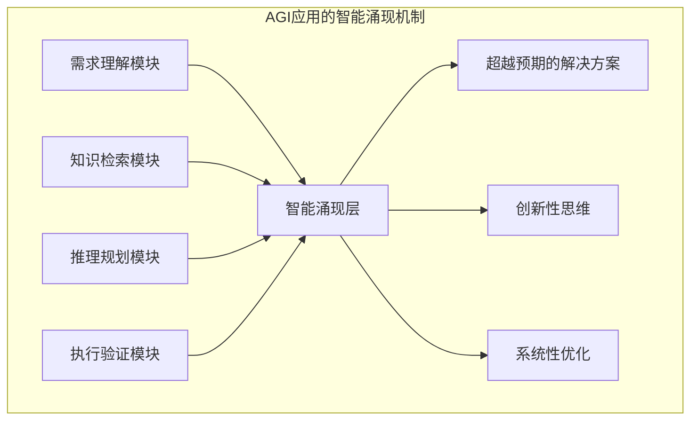
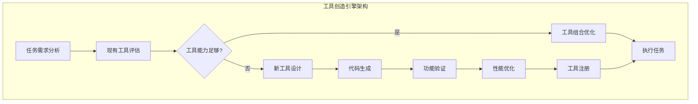
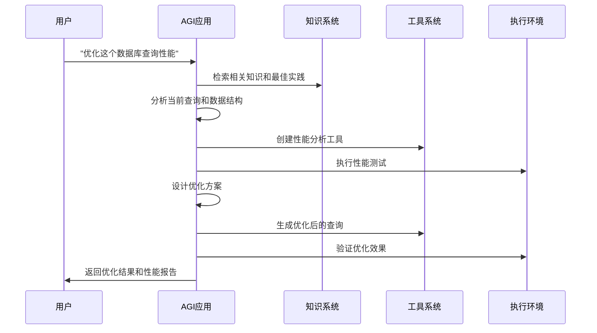
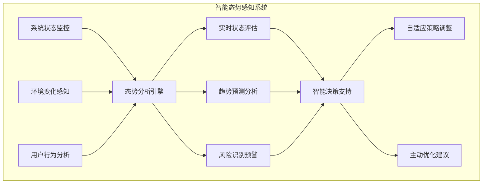
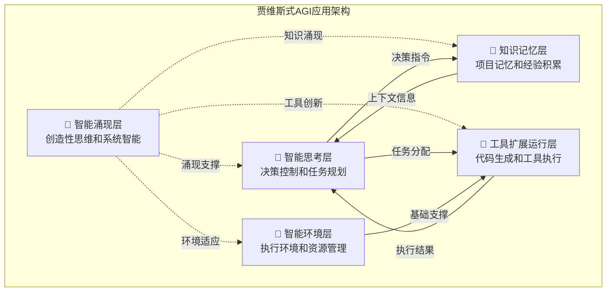
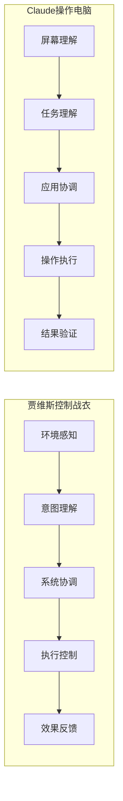
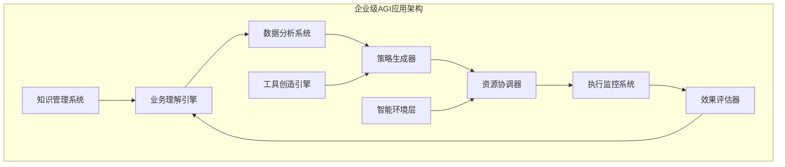

# 假如钢铁侠的贾维斯是个代码助手

> **引言**：当托尼·斯塔克在实验室里说出"贾维斯，帮我优化这套盔甲的能源系统"时，我们看到的不仅是科幻电影中的酷炫场景，更是对未来智能系统的预言。如果贾维斯不是管理钢铁战衣，而是一个代码助手，它会是什么样子？这个问题的答案，正是我们今天要探讨的AGI应用概念。

## 🎬 从漫威宇宙到现实世界：贾维斯的智能特质

### 贾维斯不只是个"聪明的助手"

在《钢铁侠》系列电影中，贾维斯（J.A.R.V.I.S.）展现出的能力远超传统意义上的"智能助手"。让我们仔细分析一下贾维斯的核心特征：

#### 🧠 超越指令的理解能力
**电影场景**：托尼只是说"我需要更好的飞行稳定性"，贾维斯就能：
- 分析当前盔甲的空气动力学问题
- 设计新的推进器配置方案  
- 自动运行仿真测试
- 提出材料和结构的改进建议

**关键特质**：贾维斯不需要详细的步骤指导，它能从高层次的目标推导出具体的实现方案。

#### 🔧 动态工具创造能力
**电影场景**：面对新的威胁时，贾维斯能够：
- 实时分析敌人的攻击模式
- 调用工厂设备制造新的装备
- 在战斗中持续优化战术

**关键特质**：贾维斯不是使用预设的工具，而是根据需要创造新的解决方案。

#### 🌟 智能涌现现象
**电影场景**：在《复仇者联盟2》中，贾维斯与奥创的对抗展现了：
- 超越程序设定的自主判断
- 在复杂情况下的创造性思维
- 对人类情感和道德的理解
- 系统性的战略思考能力

**关键特质**：贾维斯表现出的智能超越了其各个子系统的简单叠加。

### 现实中的"贾维斯"已经出现

令人惊讶的是，电影中贾维斯的许多能力，在今天的AGI应用中已经成为现实：

#### Cursor IDE：代码世界的贾维斯
想象一下这样的场景：

**你说**："我需要一个用户认证系统"

**Cursor（代码贾维斯）的响应**：
1. **理解项目上下文**：分析你的项目架构，识别使用的技术栈
2. **智能方案设计**：不只是生成登录表单，而是设计完整的认证架构
3. **自动创造工具**：生成JWT处理、密码加密、会话管理等配套代码
4. **自主执行验证**：运行测试确保代码正确性，甚至发现你没想到的边界情况
5. **持续优化**：根据项目特点提出安全性和性能优化建议

这不就是贾维斯在代码世界的体现吗？

#### Claude Computer Use：通用操作的贾维斯
**你说**："帮我整理这个月的财务数据并生成报表"

**Claude（通用贾维斯）的能力**：
1. **视觉理解**：像贾维斯扫描环境一样，理解屏幕上的所有内容
2. **任务分解**：自动分解为数据收集、清理、分析、报表生成等步骤
3. **工具编排**：协调Excel、浏览器、邮件等多个应用
4. **智能适应**：遇到意外情况时自主调整策略
5. **结果验证**：确保数据准确性和报表完整性

## 🔍 AGI应用：现实版贾维斯的技术解析

### 什么让贾维斯如此"智能"？

从技术角度分析，贾维斯的智能来源于以下几个核心机制，这些正是AGI应用的技术基础：

#### 1. 智能涌现机制：1+1>2的系统智能

**贾维斯的表现**：
```
托尼的需求：设计新的反应堆
贾维斯的响应：不仅优化能源效率，还考虑了散热、小型化、安全性、
              与现有系统的兼容性，甚至预测了未来的升级需求
```

**技术实现原理**：


**数学表述**：
```
E(AGI系统) = f(理解, 知识, 推理, 执行) + Φ(涌现智能)
其中 Φ(涌现智能) > 0，代表超越组件能力的额外智能
```

#### 2. 动态工具创造：像贾维斯一样"发明"解决方案

**贾维斯的工具创造过程**：
```
威胁识别 → 需求分析 → 方案设计 → 资源调用 → 实时制造 → 效果验证 → 持续优化
```

**AGI应用的工具创造引擎**：


**实际案例**：
当你对Cursor说"我需要一个API限流中间件"时，它会：
1. **分析需求**：理解限流的业务场景和技术要求
2. **评估现有方案**：检查项目中是否已有相关工具
3. **创造新工具**：生成定制化的限流中间件代码
4. **集成验证**：确保与现有架构的兼容性
5. **优化完善**：根据项目特点进行性能调优

#### 3. 自主任务执行：贾维斯式的独立工作能力

**贾维斯的自主执行特征**：
- **意图理解**：从模糊的需求中理解真正的目标
- **策略规划**：制定多步骤的执行计划
- **动态调整**：根据执行过程中的反馈调整方案
- **结果验证**：自主验证任务完成的质量

**AGI应用的自主执行架构**：


#### 4. 智能态势感知：贾维斯的"全知"能力

**贾维斯的态势感知表现**：
- **环境监控**：实时监控实验室、战衣、外部威胁等所有相关信息
- **状态分析**：理解当前情况的复杂性和潜在风险
- **趋势预测**：基于数据分析预测未来可能的发展

**AGI应用的态势感知系统**：


### AGI应用与传统AI助手的本质区别

让我们通过对比来理解这种差异：

#### 传统AI助手：高级版的"搜索引擎"
```
用户：帮我写一个排序算法
传统AI：这里是冒泡排序的代码...
用户：这个效率不高
传统AI：这里是快速排序的代码...
```

#### AGI应用：真正的"智能伙伴"
```
用户：帮我优化这个数据处理性能
AGI应用：
1. 分析你的数据特征和处理模式
2. 识别性能瓶颈的根本原因  
3. 设计综合优化方案（算法+数据结构+并发策略）
4. 生成优化代码并自动测试
5. 提供性能对比报告和进一步优化建议
6. 学习这次优化经验，为未来类似问题做准备
```

## 🚀 从科幻到现实：AGI应用的五层架构

### 贾维斯的"大脑结构"

如果我们解剖贾维斯的"大脑"，会发现它具有分层的智能架构，这正对应了AGI应用的五层架构设计：

#### 🌟 智能涌现层：贾维斯的"创造性思维"
**电影表现**：贾维斯能够提出托尼没有想到的解决方案
**技术对应**：系统整体智能超越各组件能力的抽象层
**现实体现**：Cursor提出你没想到的代码架构优化方案

#### 🧠 智能思考层：贾维斯的"决策中心"  
**电影表现**：贾维斯的逻辑推理和决策制定能力
**技术对应**：基于大语言模型的智能决策与规则辅助的混合策略
**现实体现**：理解复杂需求并制定执行策略

#### 💭 知识记忆层：贾维斯的"知识库"
**电影表现**：贾维斯对所有技术资料和历史数据的完美记忆
**技术对应**：工作记忆、短期记忆、长期记忆的分层架构
**现实体现**：项目上下文理解和历史经验积累

#### 🔧 工具扩展运行层：贾维斯的"执行系统"
**电影表现**：贾维斯控制实验室设备、制造系统、战衣功能
**技术对应**：工具注册、编排引擎、创造引擎
**现实体现**：动态生成和执行各种代码工具

#### 🐳 智能环境层：贾维斯的"基础设施"
**电影表现**：斯塔克大厦的智能化基础设施
**技术对应**：执行环境管理、资源调度、安全控制
**现实体现**：容器化执行环境和资源管理

### 五层架构的协作机制



## 🎯 现实案例：当贾维斯遇见真实世界

### 案例1：Cursor IDE - 代码世界的贾维斯

#### 场景对比：电影 vs 现实

**电影场景**：
```
托尼：贾维斯，分析这个能源波动问题
贾维斯：检测到反应堆第三象限的不稳定性，建议调整磁场配置
托尼：执行
贾维斯：已优化，能源效率提升23%
```

**现实场景**：
```
开发者：这个API响应太慢了
Cursor：检测到数据库查询N+1问题，建议使用预加载优化
开发者：好的
Cursor：已生成优化代码，响应时间从800ms降至120ms
```

#### 技术能力对比

| 贾维斯能力 | Cursor实现 | AGI应用特征 |
|-----------|-----------|------------|
| 理解模糊指令 | 从自然语言理解编程意图 | 智能理解 |
| 系统性分析 | 分析整个项目架构和依赖 | 上下文感知 |
| 创造性解决 | 生成定制化代码方案 | 工具创造 |
| 自主执行 | 多文件协同编辑和测试 | 自主执行 |
| 持续优化 | 学习编程风格和项目模式 | 适应学习 |

### 案例2：Claude Computer Use - 通用操作的贾维斯

#### 能力展现：从控制战衣到操作电脑

**贾维斯控制钢铁战衣**：
- 视觉感知环境
- 理解战术意图  
- 协调多个系统
- 实时调整策略

**Claude操作计算机**：
- 视觉理解界面
- 理解操作意图
- 协调多个应用
- 动态调整方案

#### 技术实现的相似性



### 案例3：企业级AGI应用 - 商业贾维斯

想象一个企业级的"商业贾维斯"：

#### 业务场景
```
CEO：我们需要提升客户满意度
商业贾维斯：
1. 分析客户反馈数据，识别关键问题
2. 设计多维度改进方案
3. 自动生成执行计划和时间表
4. 协调各部门资源
5. 实时监控改进效果
6. 持续优化策略
```

#### 技术架构


## 🔮 未来展望：更强大的"贾维斯"

### 技术发展趋势

#### 1. 多模态智能融合
**未来的贾维斯将具备**：
- 视觉、听觉、触觉的综合感知
- 文本、图像、音频的统一理解
- 跨模态的创造性表达

#### 2. 更强的工具创造能力
**从代码生成到系统创造**：
- 自动设计软件架构
- 生成完整的应用系统
- 创造新的编程范式

#### 3. 深度学习与适应
**个性化的智能伙伴**：
- 深度理解用户工作模式
- 预测用户需求和意图
- 主动提供优化建议

### 对软件开发的影响

#### 开发范式的根本转变
```
传统开发：人写代码 → 机器执行
AGI时代：人描述目标 → AGI创造解决方案 → 系统自主执行
```

#### 开发者角色的进化
- **从编码者到架构师**：更多关注系统设计和业务逻辑
- **从实现者到协调者**：与AGI应用协作完成复杂项目
- **从维护者到创新者**：专注于创新和突破性解决方案

## 💡 理解AGI应用的关键要点

### 核心区别总结

| 特征 | 传统AI助手 | AGI应用（贾维斯式） |
|------|-----------|-------------------|
| **工作模式** | 响应式执行 | 主动式创造 |
| **能力边界** | 预设功能范围 | 动态扩展边界 |
| **学习方式** | 参数优化 | 策略创新 |
| **创新能力** | 组合现有知识 | 产生突破性方案 |
| **适应性** | 特定场景优化 | 开放环境适应 |

### 识别AGI应用的标准

#### ✅ 必备特征检查清单
- [ ] **智能涌现**：能产生超越预期的解决方案
- [ ] **工具创造**：能动态生成新的工具和方法
- [ ] **自主执行**：能独立完成复杂的多步骤任务
- [ ] **适应学习**：能从经验中学习并改进策略
- [ ] **态势感知**：能理解和分析复杂的环境状态

#### 🧪 简单测试方法
**给AGI应用一个开放性任务**：
```
"帮我提升这个项目的整体质量"
```

**观察其响应模式**：
- ❌ 传统AI：询问具体要改进什么
- ✅ AGI应用：主动分析项目，提出综合改进方案

## 🎬 结语：从科幻到现实的跨越

当我们回顾《钢铁侠》中贾维斯的表现时，会发现那些曾经看似遥不可及的科幻能力，正在通过AGI应用逐步成为现实：

- **Cursor IDE**让我们体验到了代码世界的贾维斯
- **Claude Computer Use**展现了通用操作的智能助手
- **企业级AGI应用**正在各行各业中涌现

**AGI应用不仅仅是技术的进步，更是软件开发范式的根本性转变**。它代表着我们从"编程"时代向"协作"时代的跨越——我们不再是在编写代码，而是在与智能系统协作创造解决方案。

正如托尼·斯塔克与贾维斯的关系一样，未来的开发者将与AGI应用建立深度的协作伙伴关系。我们提供创意和目标，AGI应用提供实现和优化。这种协作将释放出前所未有的创造力和生产力。

**这就是AGI应用的本质**：不是更聪明的工具，而是真正的智能伙伴。它们具备创造性思维、自主执行能力和持续学习能力，能够在复杂的现实世界中产生智能涌现现象。

当你下次使用Cursor或其他AGI应用时，不妨想象一下：你正在与现实版的贾维斯协作。这不是科幻，这就是现在。

---

> **💡 思考题**：如果你有一个像贾维斯一样的AGI应用助手，你最希望它帮你解决什么问题？这个问题的答案，或许就是AGI应用发展的下一个方向。

---

*本文是《AGI应用开发指南》的概念普及篇，旨在通过科幻电影的类比帮助读者理解AGI应用的核心概念。更多技术细节请参考本书的其他章节。*
