# Agentic AI：通向AGI应用的关键前站与智能涌现之路


> **核心论点**：Agentic AI是发展智能涌现能力的前站，代表着从传统多智能体系统向真正AGI应用演进的关键阶段。它不仅是技术路径的选择，更是通向人工通用智能的最具潜力发展方向——一个能够自主学习、创造性解决问题并持续进化的智能系统范式。

## 多智能体系统的分化

作为软件开发者，我们都熟悉系统架构的演进：从单体应用到微服务，从MVC到组件化，每一次范式转变都重新定义了我们构建软件的方式。

当前，多智能体系统正在经历一次历史性分化。传统的多智能体架构专注于**任务分解和协作优化**，而随着大语言模型能力的指数级提升，一个革命性的分支正在崛起——**Agentic AI**。

这一分化的深层意义在于：**Agentic AI不仅是多智能体系统的一个分支，更是通向AGI应用的必经之路**。

**为什么Agentic AI是AGI发展的前站？**

从技术演进的角度看，它们代表着智能系统发展的不同阶段：

- **传统多智能体系统**：优化已知问题的执行效率（自动化阶段）
- **Agentic AI**：发展智能涌现能力，处理未知问题的创造性解决（智能化阶段）  
- **AGI应用**：实现人类级别的通用智能（通用化阶段）

Agentic AI承担着关键的桥梁作用——它是从确定性自动化向不确定性智能创造的关键跃迁。

## 引言：多智能体系统的分化与进化

### 多智能体系统发展的历史脉络

在过去的几年里，我们见证了多智能体系统（Multi-Agent Systems, MAS）的蓬勃发展。这一发展历程可以分为几个关键阶段：

#### 第一阶段：概念验证期（2022-2023年初）
- **AutoGPT的突破**：首次展示了大语言模型驱动的自主任务执行能力
- **技术特点**：简单的任务分解和工具调用，主要验证可行性
- **局限性**：执行稳定性差，容易陷入循环，实用性有限

#### 第二阶段：框架化发展期（2023年中-2024年初）
- **Agent框架涌现**：LangChain、LlamaIndex、CrewAI等框架快速发展
- **工作流引擎兴起**：Dify、n8n等低代码平台集成AI能力
- **技术进步**：更好的任务编排、状态管理、错误处理机制

#### 第三阶段：智能涌现探索期（2024年至今）
- **Agentic AI概念兴起**：从协作优化向智能涌现的范式转变
- **AGI前站地位确立**：Agentic AI成为通向AGI应用的关键桥梁
- **技术突破性进展**：智能涌现、工具创造、自主学习等核心能力显现
- **商业价值重新定义**：从效率提升转向智能增强和创新突破

### 分化现象的深层原因：通向AGI的必然选择

在深入参与多个智能系统项目的过程中，我逐渐发现：**多智能体系统的分化不是偶然现象，而是通向AGI应用的必然选择**。这种分化由以下深层原因驱动：

#### 1. 智能演进的内在逻辑
- **自动化阶段**：通过程序化规则提升效率（传统多智能体）
- **智能化阶段**：探索通过涌现能力产生创新（Agentic AI）
- **通用化阶段**：实现人类级别的通用智能（AGI应用）

#### 2. 技术发展的必然趋势
- **计算能力指数增长**：为复杂智能系统提供基础支撑
- **大模型能力突破**：使智能涌现成为可能
- **多模态融合发展**：推动智能系统的全面感知能力

#### 3. 应用需求的根本变化
- **从确定性到不确定性**：需要处理开放世界的复杂问题
- **从执行到创造**：需要系统具备创新和学习能力
- **从工具到伙伴**：需要智能系统成为真正的协作伙伴

**关键洞察**：Agentic AI之所以是最具潜力的发展方向，在于它首次实现了从"程序化智能"向"涌现式智能探索"的根本性跃迁。这一跃迁为AGI应用的实现奠定了坚实基础。

### 智能系统发展的三个关键阶段

#### 传统多智能体系统：协作优化阶段

**核心理念**：通过精细化分工提升整体效率

这类系统遵循传统的分工协作理念，将复杂任务分解为多个子任务，由专门的智能体负责执行，通过优化协作机制提升整体执行效率。这是智能系统发展的**自动化阶段**。

**技术架构特点**：
- **静态角色分工**：每个Agent有明确的职责边界
- **预定义工作流**：任务执行路径相对固定
- **中心化调度**：通过调度器统一管理任务分配
- **确定性输出**：追求可预测、可重复的执行结果

**代表项目分析**：
- **Dify**：低代码AI应用开发平台，强调工作流的可视化设计
- **CrewAI**：多Agent协作框架，专注于角色分工和任务协调

#### Agentic AI：智能涌现探索阶段（AGI前站）

**核心理念**：通过系统协作产生超越组件的智能

这类系统不满足于简单的任务分工，而是追求系统整体智能超越各组成部分的简单叠加，产生"1+1>2"的智能涌现效应。**这是通向AGI应用的关键桥梁阶段**。

**为什么Agentic AI是AGI发展的前站？**

1. **智能涌现能力**：首次探索了系统级的智能突破，为AGI的通用智能奠定基础
2. **创造性问题解决**：能够处理开放性、不确定性问题，接近人类认知模式
3. **自主学习进化**：具备持续学习和自我改进能力，是AGI的核心特征
4. **工具创造能力**：能够创造新工具和解决方案，展现了真正的智能创造力

**技术架构特点**：
- **动态能力组合**：根据任务需求动态组合能力
- **自主任务分解**：系统自主理解和分解复杂任务  
- **工具创造能力**：能够创造新的工具和解决方案
- **适应性学习**：从执行过程中学习和改进

**代表项目分析**：
- **Cursor IDE**：不仅生成代码，还能理解项目上下文，自主执行和调试
- **Claude Computer Use**：能够自主操作计算机完成复杂任务

#### AGI应用：通用智能阶段（未来愿景）

**核心理念**：实现人类级别的通用智能

AGI应用代表着智能系统发展的最终目标——具备人类级别的通用智能，能够在任何认知任务上达到或超越人类水平。

**关键特征**（基于当前理论预测）：
- **通用问题解决能力**：在任何领域都能展现专家级智能
- **自主意识与目标设定**：具备自我意识和独立的目标设定能力
- **无限学习与适应**：能够无限制地学习新知识和适应新环境
- **创造性突破**：能够产生真正原创性的思想和发明

### 三个阶段的本质区别与演进逻辑

#### 设计哲学的根本差异

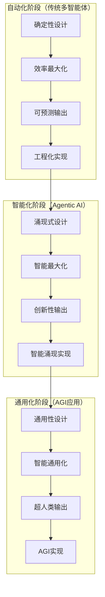

#### 演进路径的必然性

| 维度 | 传统多智能体 | Agentic AI | AGI应用 |
|------|-------------|-----------|---------|
| **智能水平** | 程序化智能 | 涌现式智能 | 通用智能 |
| **问题范围** | 已知问题域 | 开放问题域 | 任意问题域 |
| **学习能力** | 参数调优 | 自主学习 | 无限学习 |
| **创新能力** | 组合创新 | 突破性创造 | 原创性发明 |
| **适应性** | 特定场景 | 动态适应 | 通用适应 |
| **发展阶段** | 当前主流 | 快速发展 | 未来愿景 |

**关键洞察**：这三个阶段不是简单的技术升级，而是**智能本质的根本性跃迁**：
- 从"执行程序"到"产生智能"（多智能体→Agentic AI）
- 从"专用智能"到"通用智能"（Agentic AI→AGI应用）

## Agentic AI概念深度探索：AGI应用的前站与桥梁

### Agentic AI的核心定义与战略地位

> **来自百度百科的定义：**
> 
> Agentic AI（代理式人工智能）是人工智能领域的新兴方向，其核心特征在于能够通过自主感知、推理、规划与执行，独立完成复杂多步骤任务。相较于传统AI工具，它具备主动性、自治性和环境适应性，可脱离人类直接控制进行决策与交互。2024年3月吴恩达首次公开提出该概念后，英伟达CEO黄仁勋于2025年3月将其列为生成式AI后的重要发展阶段。


Agentic AI（代理式人工智能）不仅是人工智能领域的新兴方向，更是**通向AGI应用的关键前站和必经之路**。它代表着从传统自动化系统向真正智能系统的历史性跃迁。

#### 战略定位：AGI发展的关键桥梁

**为什么Agentic AI是AGI应用的前站？**

1. **智能涌现的首次实现**：
   - 传统AI系统：能力 = 组件能力之和
   - Agentic AI：能力 > 组件能力之和（涌现效应）
   - AGI应用：能力 ≥ 人类通用智能

2. **创造性能力的关键突破**：
   - 从"执行预设指令"到"创造性解决问题"
   - 从"使用现有工具"到"创造新的工具"
   - 从"优化已知流程"到"发现未知解决方案"

3. **自主性的根本提升**：
   - 从"被动响应"到"主动感知"
   - 从"人工监督"到"自主决策"
   - 从"单次执行"到"持续学习"

#### 核心特征：五大智能涌现能力

Agentic AI作为AGI前站，具备五大核心特征，每一个都是向AGI应用演进的关键能力：

#### 1. 智能涌现机制：AGI的核心驱动力

Agentic AI的核心在于**智能涌现**——系统整体智能超越各组成部分的简单叠加。这是AGI应用实现的根本机制：

```
E(Agentic AI) > Σ E(组件i) + 协作效应 + Φ(涌现成分)
E(AGI应用) = lim[E(Agentic AI) → 人类级通用智能]
```

**涌现现象的AGI指向性**：
- **创新性解决方案**：产生设计时未预期的解决方案（接近人类创造力）
- **自主学习能力**：从经验中学习并改进策略（人类学习模式）
- **跨域知识迁移**：将一个领域的知识应用到其他领域（通用智能特征）
- **元认知能力**：对自身思考过程的认知和调节（高级智能标志）

**涌现机制的技术实现**：
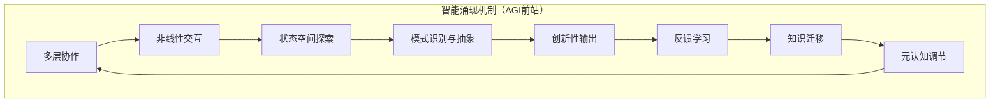

#### 2. 工具创造能力：通向AGI的关键标志

工具的创造和使用是智能的重要标志，Agentic AI在这方面展现了接近AGI的能力：

**AGI导向的工具创造三层次**：
- **工具组合层**：将现有工具进行创新性组合（当前Agentic AI能力）
- **工具生成层**：根据需求动态生成新的工具（接近人类水平）
- **工具进化层**：通过使用反馈持续优化工具（超越人类的潜力）

**工具创造引擎架构**：
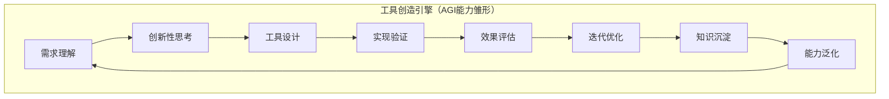

#### 3. 自主任务执行：AGI的核心特征预演

Agentic AI的自主执行能力已经展现出AGI应用的核心特征：

**自主执行的AGI特征**：
- **意图深度理解**：理解用户的深层需求和隐含目标
- **策略创新规划**：创造性地制定解决方案
- **动态智能调整**：根据环境变化智能调整策略
- **自主质量验证**：具备自我评估和改进能力

**自主执行架构（AGI雏形）**：
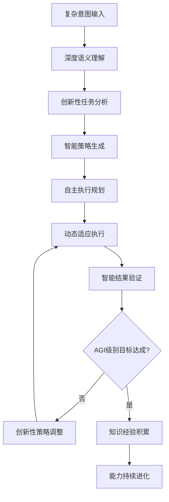

#### 4. 适应性学习：AGI的持续进化机制

Agentic AI具备的学习能力是实现AGI的关键机制：

**AGI导向的学习机制**：
- **经验深度积累**：不仅记录结果，更理解过程
- **模式智能识别**：发现深层的成功和失败模式
- **策略创新优化**：基于学习创造新的解决策略
- **知识主动迁移**：主动将经验应用到新场景

#### 5. 智能态势感知：AGI的环境适应能力

Agentic AI的态势感知能力展现了AGI应用的环境适应特征：

**AGI级态势感知的三个维度**：
- **系统内部洞察**：深度理解自身能力和状态
- **外部环境感知**：全面感知和理解环境变化
- **未来趋势预测**：基于理解进行智能预测和规划

**智能态势感知系统（AGI能力展现）**：
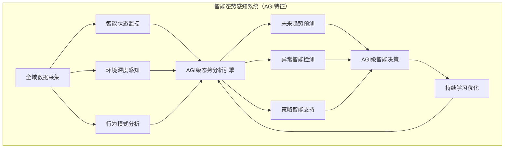

## 演进路径：从协作优化到智能涌现再到通用智能

### 智能系统发展的三阶段演进对比

| 维度 | 传统多智能体系统 | Agentic AI | AGI应用 |
|------|-----------------|-----------|---------|
| **设计理念** | 分工协作优化 | 智能涌现驱动 | 通用智能实现 | 
| **能力表现** | 组件能力叠加 | 超越组件边界 | 超越人类智能 |
| **工具使用** | 预定义工具集 | 动态工具创造 | 无限工具创新 |
| **适应性** | 特定场景优化 | 开放环境适应 | 任意环境通用 |
| **创新能力** | 组合式创新 | 突破性创造 | 原创性发明 |
| **学习机制** | 参数调优 | 自主学习进化 | 无限学习能力 |
| **智能水平** | 程序化智能 | 涌现式智能 | 通用智能 |
| **发展状态** | 当前主流应用 | 快速发展阶段 | 未来愿景目标 |

### 技术实现的根本性跃迁

#### 传统多智能体系统架构
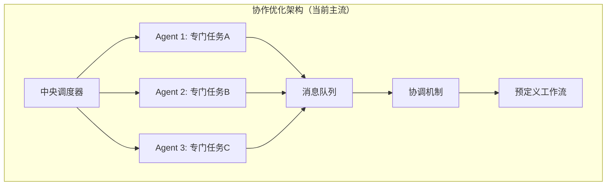

#### Agentic AI应用的智能涌现架构
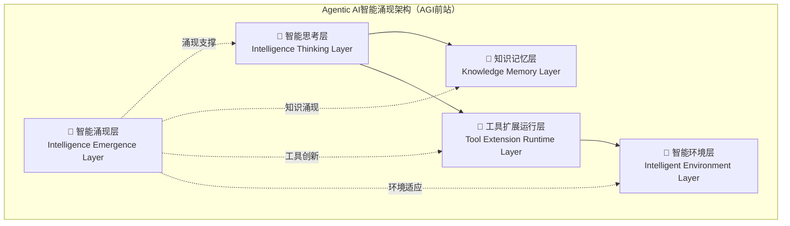

#### AGI应用的通用智能架构（未来设想）
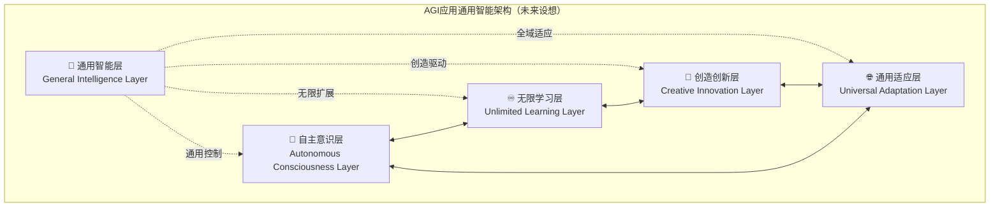

**关键洞察**：**智能涌现层**是Agentic AI独有的核心创新，它为AGI应用的**通用智能层**奠定了基础。这不是简单的技术升级，而是智能范式的根本性跃迁。

## 实战案例：Agentic AI应用的威力展现

### 案例1：Cursor IDE - 代码开发领域的Agentic AI应用典型代表

Cursor不仅仅是一个"智能代码助手"，而是Agentic AI应用在代码开发领域的典型代表，展现了从传统工具到智能系统的根本性转变。

#### 传统开发工具 vs Cursor的对比分析

**传统IDE + AI插件的工作模式**：
```
用户输入需求 → AI生成代码片段 → 用户复制粘贴 → 手动集成调试 → 反复修改
```

**Cursor的Agentic AI应用工作模式**：
```
用户描述目标 → 系统理解项目上下文 → 智能分析现有代码 → 动态创造解决方案 → 自动执行验证 → 持续优化改进
```

#### Cursor的Agentic AI应用特征分析

**1. 智能涌现表现**：
- **上下文理解能力**：不仅理解当前文件，还能理解整个项目的架构和依赖关系
- **创造性编程**：能够提出用户没有想到的优化方案和架构改进
- **自主问题解决**：遇到错误时能够自主分析原因并提供修复方案

**2. 工具创造能力**：
- **动态代码生成**：根据项目特点生成定制化的代码模板
- **测试用例创造**：自动生成针对性的单元测试和集成测试
- **配置文件生成**：根据项目需求生成相应的配置文件

**3. 自主任务执行**：
- **多文件协同编辑**：同时修改多个相关文件保持一致性
- **自动重构**：识别代码异味并自主进行重构优化
- **依赖管理**：自动处理包依赖和版本兼容性问题

**4. 适应性学习**：
- **编程风格学习**：学习用户的编程习惯和代码风格
- **项目模式识别**：识别项目的架构模式并提供相应建议
- **错误模式学习**：从历史错误中学习，避免重复问题

#### 技术实现架构分析

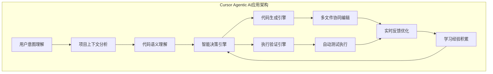


### 案例2：Claude Computer Use - 通用计算机操作的Agentic AI应用

Anthropic的Claude Computer Use功能代表了Agentic AI应用在通用计算机操作领域的突破。

#### 核心能力分析

**1. 视觉理解与操作**：
- **屏幕内容理解**：能够理解复杂的图形界面和文本内容
- **操作意图推理**：根据用户目标推理出具体的操作步骤
- **动态适应能力**：适应不同操作系统和应用程序的界面变化

**2. 多步骤任务执行**：
- **任务分解能力**：将复杂任务分解为可执行的操作序列
- **状态跟踪**：实时跟踪任务执行状态和环境变化
- **错误恢复**：遇到错误时能够自主分析并尝试修复

**3. 工具创造与使用**：
- **脚本生成**：根据需要生成自动化脚本
- **快捷操作创造**：发现和创造提高效率的操作方法
- **跨应用协作**：协调多个应用程序完成复杂任务

#### 技术实现特点

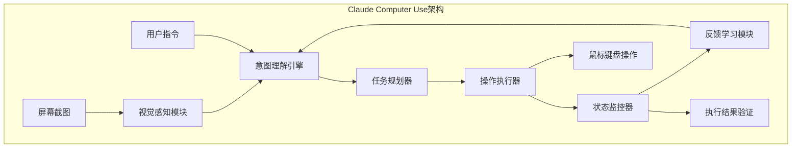

### 案例对比分析：Agentic AI应用的共同特征与AGI指向性

通过对典型案例的深入分析，我们可以总结出Agentic AI应用的共同特征及其向AGI演进的指向性：

| 特征维度 | Cursor IDE  | Claude Computer Use | AGI指向性 |
|---------|-----------|-------------------|----------|
| **智能涌现** | 代码创造性解决方案  | 复杂任务自主执行 | 接近人类创造力水平 |
| **工具创造** | 动态代码生成  | 自动化脚本生成 | 无限工具创新能力 |
| **自主执行** | 多文件协同编辑  | 多步骤操作执行 | 完全自主问题解决 |
| **适应学习** | 编程风格学习 | 界面适应学习 | 无限环境适应能力 |
| **态势感知** | 项目上下文理解 | 屏幕内容理解 | 全域环境感知能力 |

**关键发现**：这些Agentic AI应用已经展现出AGI应用的核心特征雏形，证明了Agentic AI确实是通向AGI的关键前站。

## 智能涌现理论深度探索：Agentic AI的潜力优势论证

### 复杂适应系统理论在Agentic AI中的体现

#### 理论基础：Santa Fe Institute的复杂性科学

Agentic AI的智能涌现现象建立在坚实的科学理论基础之上，特别是Santa Fe Institute开创的复杂适应系统理论：

**核心原理**：
```
系统整体行为 = f(组件, 交互规则, 环境压力) + Φ(涌现特性)
```

**在Agentic AI中的具体体现**：

1. **非线性交互效应**：
   - 传统系统：1+1=2（线性叠加）
   - Agentic AI：1+1>2（非线性涌现）
   - AGI潜力：1+1>>2（指数级智能放大）

2. **自组织特性**：
   - **自适应结构调整**：系统能根据任务需求动态调整内部结构
   - **智能模式识别**：自主发现和利用环境中的模式
   - **创新解决方案生成**：产生超越预设的新颖解决方案

3. **层次涌现现象**：
   ```mermaid
   graph TB
       subgraph "Agentic AI的层次涌现"
           L1[基础组件层] --> L2[功能模块层]
           L2 --> L3[智能协作层]
           L3 --> L4[涌现智能层]
           L4 --> L5[AGI能力层]
       end
       
       L1 -.->|跨层涌现| L3
       L2 -.->|跨层涌现| L4
       L3 -.->|跨层涌现| L5
   ```

### 涌现理论的数学模型与AGI路径

#### Philip Anderson的"More is Different"在AI中的应用

诺贝尔物理学奖得主Philip Anderson的涌现理论为Agentic AI向AGI演进提供了理论支撑：

**涌现的数学表达**：
```
E(Agentic AI) = Σ(组件能力) + Π(交互效应) + Φ(涌现智能)
```

其中：
- **Σ(组件能力)**：各组件能力的简单叠加
- **Π(交互效应)**：组件间交互产生的协同效应  
- **Φ(涌现智能)**：超越组件边界的新兴智能特性

**AGI演进的临界点理论**：
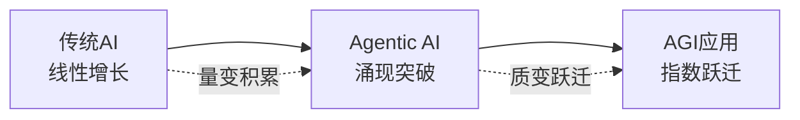

#### 智能涌现的四个关键特征

1. **非线性特征**：
   - **输入-输出非线性**：小的输入变化可能产生巨大的智能提升
   - **能力组合非线性**：不同能力的组合产生意想不到的新能力
   - **学习效率非线性**：随着经验积累，学习效率指数级提升

2. **自组织特征**：
   - **结构自适应**：系统结构根据任务需求自主调整
   - **功能自发现**：系统自主发现新的功能和能力
   - **目标自设定**：在复杂环境中自主设定和调整目标

3. **层次性特征**：
   - **多层次智能**：从基础感知到高级推理的多层次智能体系
   - **跨层交互**：不同层次间的智能交互产生新的涌现现象
   - **层次涌现**：每个层次都可能产生独特的智能涌现

4. **适应性特征**：
   - **环境适应**：快速适应新环境和新任务
   - **策略进化**：解决策略的持续进化和优化
   - **能力扩展**：在使用过程中不断扩展新能力

### 工具创造理论：从使用到创造的智能跃迁

#### Kenneth Oakley的"Man the Tool-maker"理论现代化

工具的创造和使用是智能的重要标志，Agentic AI在这方面的突破为AGI发展奠定了基础：

**智能发展的工具创造阶段**：

1. **工具使用阶段**（传统AI）：
   - 使用预定义的工具和API
   - 按照既定规则调用工具
   - 工具集合相对固定

2. **工具组合阶段**（Agentic AI初期）：
   - 创新性地组合现有工具
   - 发现工具间的新协作模式
   - 产生超越单个工具的能力

3. **工具创造阶段**（Agentic AI成熟期）：
   - 根据需求动态生成新工具
   - 创造性地解决工具缺失问题
   - 具备真正的工具创造能力

4. **工具进化阶段**（AGI应用）：
   - 工具的自主进化和优化
   - 无限的工具创新能力
   - 超越人类的工具创造水平

#### 延展认知理论在Agentic AI中的体现

**延展认知理论核心观点**：认知过程不仅发生在大脑内部，还延展到工具和环境中。

**在Agentic AI中的具体应用**：

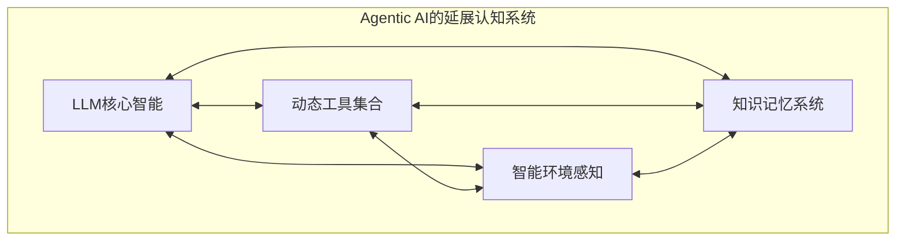

**AGI指向性**：
- **认知边界扩展**：从单一LLM扩展到整个工具生态系统
- **智能分布化**：智能不再局限于中央处理器，而是分布在整个系统中
- **能力无限扩展**：通过工具创造实现能力的无限扩展

### 涌现智能的测量与评估框架

#### Agentic AI向AGI演进的评估指标

为了量化Agentic AI的智能涌现程度及其向AGI的演进进展，我们提出以下评估框架：

**智能涌现度量公式**：
```
涌现指数(EI) = (实际系统能力 - 预期组件能力之和) / 预期组件能力之和
```

**AGI演进评估维度**：

| 评估维度 | 传统多智能体 | Agentic AI | AGI目标 | 评估方法 |
|---------|-------------|-----------|---------|----------|
| **创新能力** | 0-20% | 20-60% | 80-100% | 新解决方案生成率 |
| **学习效率** | 0-30% | 30-70% | 80-100% | 知识迁移成功率 |
| **适应性** | 0-25% | 25-65% | 80-100% | 新环境适应速度 |
| **自主性** | 0-35% | 35-75% | 80-100% | 无监督任务完成率 |
| **通用性** | 0-20% | 20-50% | 80-100% | 跨域任务处理能力 |

**关键洞察**：Agentic AI在各个维度都显著超越传统多智能体系统，并且正在向AGI目标快速逼近，这证明了其作为AGI前站的战略地位。


## Agentic AI：通向AGI的战略路径与未来愿景

通过以上的深入分析，我们可以得出一个重要结论：**Agentic AI不仅是多智能体系统的一个分支，更是通向AGI应用的战略前站和最具潜力的发展方向**。

### Agentic AI的战略重要性

#### 1. 智能范式的历史性突破

Agentic AI代表着从**程序化智能**向**涌现式智能**的根本性跃迁：

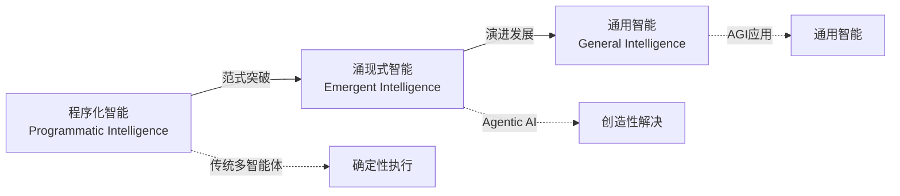

**突破意义**：
- **从执行到创造**：从执行预设指令到创造性解决问题
- **从工具到伙伴**：从被动工具转变为主动协作伙伴
- **从专用到通用**：从特定领域专用向通用智能发展

#### 2. AGI发展的关键桥梁

Agentic AI在AGI发展路径中承担着不可替代的桥梁作用：

| 发展阶段 | 核心特征 | 技术成熟度 | 商业价值 | 战略地位 |
|---------|---------|-----------|---------|----------|
| **传统多智能体** | 协作优化 | 成熟应用 | 效率提升 | 基础阶段 |
| **Agentic AI** | 智能涌现 | 快速发展 | 智能增强 | **关键桥梁** |
| **AGI应用** | 通用智能 | 未来愿景 | 颠覆创新 | 终极目标 |

**桥梁价值**：
- **技术验证**：验证智能涌现的可行性和有效性
- **能力积累**：积累向AGI演进的关键技术能力
- **经验沉淀**：为AGI应用提供宝贵的设计和实现经验

#### 3. 产业发展的战略机遇

Agentic AI为各行各业提供了前所未有的智能化机遇：

**短期机遇（1-3年）**：
- **知识工作增强**：提升专业人士的认知和创造能力
- **复杂问题解决**：处理传统方法难以解决的复杂问题
- **创新加速器**：加速产品和服务的创新迭代

**中期机遇（3-7年）**：
- **行业智能化**：推动各行业的深度智能化转型
- **新商业模式**：催生基于智能涌现的新商业模式
- **生产力革命**：带来新一轮的生产力革命

**长期愿景（7-15年）**：
- **AGI应用落地**：为AGI应用的商业化落地铺平道路
- **智能社会构建**：参与构建真正的智能化社会
- **人机协作新纪元**：开启人机深度协作的新纪元

需要特别指出的是，以上时间预测基于传统研发模式制定。随着AI技术本身成为研发加速器，整个发展进程正在经历前所未有的提速。众多学者和行业专家普遍认为，AI驱动的技术发展呈现指数级加速态势，这意味着实际的发展时间线将显著压缩，各个里程碑的达成时间很可能比上述预测提前。

### 发展前景与挑战

#### 技术发展趋势

**近期发展重点**：
1. **智能涌现机制优化**：深化对智能涌现规律的理解和应用
2. **工具创造能力提升**：增强动态工具生成和优化能力
3. **自主学习机制完善**：提升系统的自主学习和适应能力
4. **跨域能力泛化**：扩展系统在不同领域的应用能力

**中期技术突破**：
1. **多模态智能融合**：实现视觉、语言、行动的深度融合
2. **大规模协作智能**：支持更大规模的智能体协作
3. **元学习能力发展**：具备学会如何学习的元认知能力
4. **创新性思维模式**：发展更接近人类的创新思维模式

#### 面临的主要挑战

**技术挑战**：
1. **可控性与创新性平衡**：在保持可控性的同时发挥创新潜力
2. **效率与智能的权衡**：平衡计算效率和智能水平
3. **稳定性与适应性统一**：在保持系统稳定的同时提升适应性
4. **通用性与专业性结合**：兼顾通用能力和专业领域的深度

**工程挑战**：
1. **大规模部署复杂性**：解决大规模生产环境的部署复杂性
2. **系统监控与治理**：建立有效的智能系统监控和治理机制
3. **性能优化与成本控制**：在性能和成本间找到最优平衡
4. **安全性与隐私保护**：确保系统安全性和用户隐私保护

**社会挑战**：
1. **伦理与责任边界**：明确智能系统的伦理责任边界
2. **就业影响与转型**：应对智能化对就业结构的影响
3. **技能要求变化**：适应智能时代对人才技能的新要求
4. **社会接受度提升**：提升社会对智能系统的理解和接受度

### 结语：拥抱Agentic AI，迎接AGI时代

本文提出的"从多智能体到Agentic AI到AGI应用"的概念框架，为我们理解当前AI发展趋势和未来演进方向提供了一个清晰的理论视角。

**核心观点总结**：

1. **Agentic AI是AGI发展的前站**：它首次实现了智能涌现，为AGI应用奠定了坚实基础
2. **智能涌现是关键突破**：从程序化智能向涌现式智能的跃迁是通向AGI的必经之路
3. **最具潜力的发展方向**：Agentic AI在技术可行性、商业价值、发展前景等方面都展现出巨大潜力

**对开发者的启示**：

- **技术视野**：从传统的工程化思维转向智能涌现思维
- **架构设计**：重视系统的智能涌现能力而非单纯的功能实现
- **能力建设**：培养设计和构建智能涌现系统的核心能力
- **战略布局**：将Agentic AI作为通向AGI的战略投资方向

**未来展望**：

随着技术的不断发展，Agentic AI将在以下方面取得重大突破：
- **智能水平持续提升**：接近并在某些方面超越人类智能水平
- **应用领域不断扩展**：从专业领域扩展到日常生活的各个方面
- **AGI应用逐步实现**：为真正的AGI应用商业化落地创造条件

我们正站在智能技术发展的关键节点。**Agentic AI不仅是技术演进的自然结果，更是通向AGI应用的战略选择**。对于每一个软件开发者而言，理解和掌握Agentic AI的设计理念和技术实现，将成为在AI时代保持竞争优势的核心能力。

无论这一概念框架是否最终被广泛接受，掌握智能涌现系统的设计与实现能力，都将是下一代软件架构师和AI工程师的必备技能。让我们拥抱Agentic AI，共同迎接AGI时代的到来。

> **作者简介**：马云起，《Agentic AI应用软件开发指南》作者，北漂十年程序员，现任北京火花思维教育科技有限公司大数据架构师。从汇编语言到Kubernetes，从iOS开发到大数据架构的全栈工程师，见证并参与了软件架构的多次重大变革。现专注于Agentic AI应用架构设计的理论研究和工程实践，致力于探索通向AGI应用的技术路径。