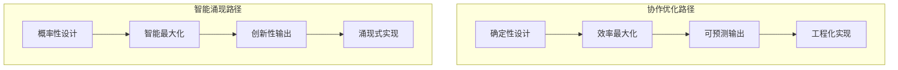
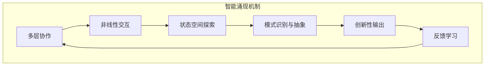
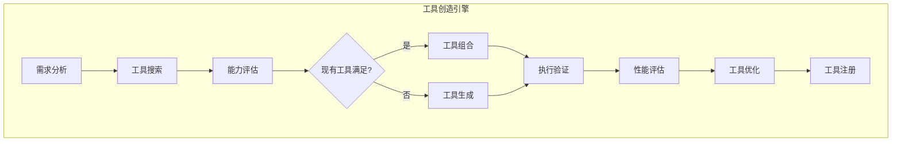
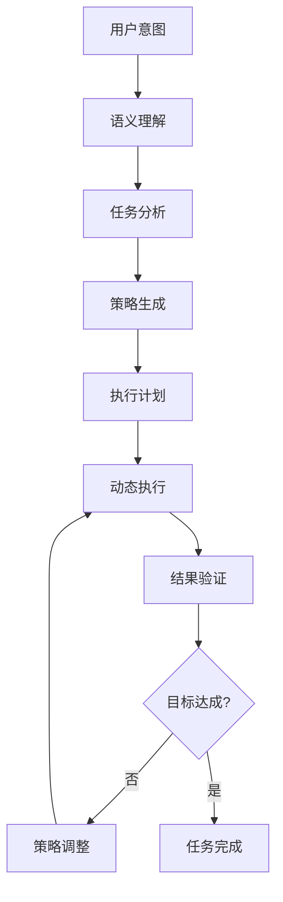
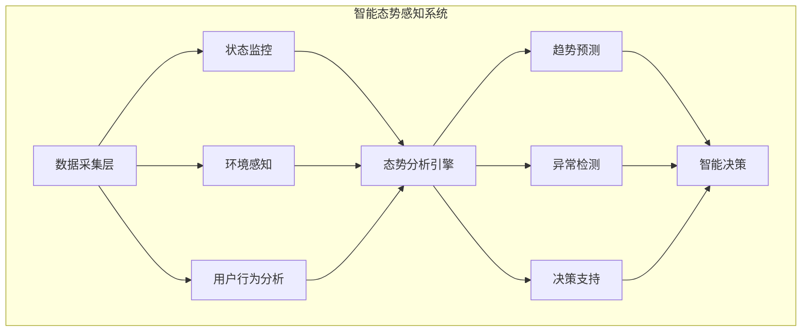
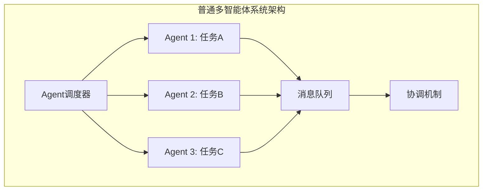
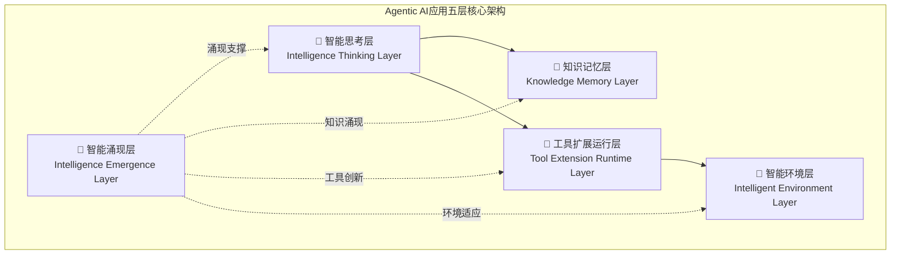
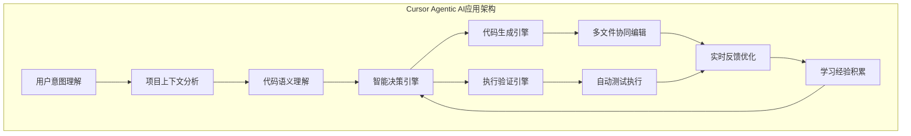
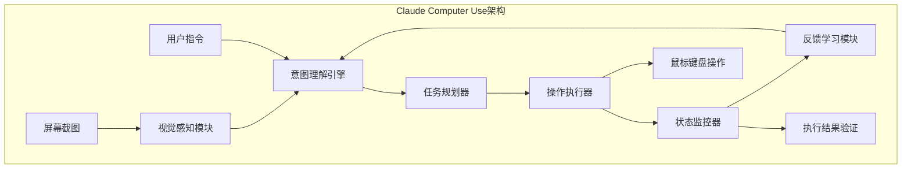

# 从多智能体到Agentic AI应用概念探索

> **作者观点**：我们正站在软件开发史上的一个重要转折点。多智能体系统已经进化出新的形态，本文尝试提出"Agentic AI应用"这一概念来描述一种具备智能涌现能力的新型软件系统范式——一个能够创造性解决问题的智能应用探索方向。

## 多智能体系统的分化：为什么需要新的概念？

作为软件开发者，我们都熟悉系统架构的演进：从单体应用到微服务，从MVC到组件化，每一次范式转变都重新定义了我们构建软件的方式。

当前，多智能体系统正在经历类似的分化。普通的多智能体架构专注于**任务分解和协作优化**，这在很多场景下是有效的。但随着LLM能力的快速提升，一个新的分支正在崛起——**Agentic AI应用**。

**为什么需要区分这两种路径？**

从软件工程的角度看，它们解决的是根本不同的问题：

- **普通多智能体系统**：优化已知问题的执行效率
- **Agentic AI应用**：处理未知问题的创造性解决

这不仅仅是能力的差异，更是**系统设计哲学**的根本分歧。

## 引言：多智能体系统的分化与进化

### 多智能体系统发展的历史脉络

在过去的几年里，我们见证了多智能体系统（Multi-Agent Systems, MAS）的蓬勃发展。这一发展历程可以分为几个关键阶段：

#### 第一阶段：概念验证期（2022-2023年初）
- **AutoGPT的突破**：首次展示了大语言模型驱动的自主任务执行能力
- **技术特点**：简单的任务分解和工具调用，主要验证可行性
- **局限性**：执行稳定性差，容易陷入循环，实用性有限

#### 第二阶段：框架化发展期（2023年中-2024年初）
- **Agent框架涌现**：LangChain、LlamaIndex、CrewAI等框架快速发展
- **工作流引擎兴起**：Dify、n8n等低代码平台集成AI能力
- **技术进步**：更好的任务编排、状态管理、错误处理机制

#### 第三阶段：分化演进期（2024年至今）
- **路径分化明显**：多智能体系统开始分化出不同的发展方向
- **商业化应用**：从实验性项目向生产级应用转变
- **技术成熟度提升**：更稳定的架构设计和工程实践

### 分化现象的深层原因

在深入参与多个多智能体项目的过程中，我逐渐发现：**多智能体系统正在分化出不同的发展路径**。这种分化并非偶然，而是由以下深层原因驱动：

#### 1. 应用场景的差异化需求
- **效率优化场景**：需要通过精细分工提升执行效率
- **创新突破场景**：需要系统产生超越预设的创新能力
- **复杂问题解决**：需要处理开放性、不确定性问题

#### 2. 技术实现路径的选择
- **工程化路径**：强调稳定性、可预测性、可控性
- **智能化路径**：追求创新性、适应性、涌现性
- **平衡化路径**：在稳定性和智能性之间寻求最优平衡

#### 3. 商业价值的不同定位
- **流程自动化价值**：替代重复性人工操作
- **智能增强价值**：增强人类的认知和创造能力
- **创新突破价值**：产生人类难以想到的解决方案

最常见的多智能体系统专注于任务分工和协作优化，而一个新的分支正在崛起——这就是具备智能涌现能力的Agentic AI应用。

### 多智能体系统的两个发展方向

#### 普通多智能体系统：协作优化路径

**核心理念**：通过精细化分工提升整体效率

这类系统遵循传统的分工协作理念，将复杂任务分解为多个子任务，由专门的智能体负责执行，通过优化协作机制提升整体执行效率。

**技术架构特点**：
- **静态角色分工**：每个Agent有明确的职责边界
- **预定义工作流**：任务执行路径相对固定
- **中心化调度**：通过调度器统一管理任务分配
- **确定性输出**：追求可预测、可重复的执行结果

**技术重点**：
- **通信协议**：Agent间的消息传递和状态同步
- **任务调度**：高效的任务分配和执行排序
- **协作算法**：优化多Agent间的协作效率
- **工作流引擎**：可视化的流程设计和执行

**典型应用场景**：
- **工作流自动化**：RPA流程的智能化升级
- **客服机器人协作**：多轮对话中的专业分工

- **业务流程优化**：企业内部流程的自动化

**代表项目分析**：
- **Dify**：低代码AI应用开发平台，强调工作流的可视化设计
- **n8n**：工作流自动化工具，集成AI能力进行任务处理
- **CrewAI**：多Agent协作框架，专注于角色分工和任务协调

#### Agentic AI应用：智能涌现路径  

**核心理念**：通过系统协作产生超越组件的智能

这类系统不满足于简单的任务分工，而是追求系统整体智能超越各组成部分的简单叠加，产生"1+1>2"的智能涌现效应。

**技术架构特点**：
- **动态能力组合**：根据任务需求动态组合能力
- **自主任务分解**：系统自主理解和分解复杂任务
- **工具创造能力**：能够创造新的工具和解决方案
- **适应性学习**：从执行过程中学习和改进

**技术重点**：
- **智能涌现机制**：如何产生超越组件的系统智能
- **工具创造引擎**：动态生成和组合工具的能力
- **自主决策系统**：在不确定环境中的智能决策
- **态势感知能力**：对内外环境的实时感知和分析

**典型应用场景**：
- **创造性问题解决**：处理开放性、无标准答案的问题
- **知识工作增强**：增强专业人士的认知和创造能力
- **智能编程助手**：如Cursor IDE的代码生成和调试能力
- **智能研究助手**：协助进行复杂的研究和分析工作

**代表项目分析**：
- **Cursor IDE**：不仅生成代码，还能理解项目上下文，自主执行和调试
- **京东JoyAgent-JDGenie**：具备智能涌现能力的多智能体系统
- **Claude Computer Use**：能够自主操作计算机完成复杂任务

### 两种路径的本质区别

#### 设计哲学差异



#### 技术实现差异

| 维度 | 协作优化路径 | 智能涌现路径 |
|------|-------------|-------------|
| **系统目标** | 提升执行效率 | 产生智能涌现 |
| **任务分解** | 预定义分解规则 | 自主智能分解 |
| **工具使用** | 固定工具集合 | 动态工具创造 |
| **决策机制** | 规则驱动决策 | LLM驱动决策 |
| **适应性** | 特定场景适应 | 开放环境适应 |
| **创新能力** | 有限组合创新 | 突破性创造 |
| **不确定性处理** | 尽量避免不确定性 | 拥抱和利用不确定性 |

## Agentic AI应用概念探索：多智能体系统的智能涌现分支

### 什么是Agentic AI应用？

**Agentic AI应用（Artificial General Intelligence Application）** 是本文提出的一个概念性探索，用以描述多智能体系统中一个独特的分支，专注于智能涌现和工具创造能力。它代表了从传统的"任务执行系统"向"智能创造系统"的根本性转变的一种可能性探索。


#### 架构设计哲学的根本差异

从系统架构的角度看，两种路径体现了不同的设计哲学：

**普通多智能体系统：组件化协作架构**
```
系统能力 = Σ(Agent能力) + 协作效率优化
```
- **静态角色定义**：每个Agent有明确的功能边界和接口规范
- **确定性工作流**：基于预定义的业务流程和决策树
- **中心化调度**：通过消息队列和协调器管理Agent交互
- **可预测性优先**：追求稳定、可重复的执行结果

**Agentic AI应用：智能涌现架构**
```
系统能力 = f(Agent交互, 上下文感知, 动态学习) + Φ(涌现智能)
```
- **动态能力组合**：系统能力可根据任务需求动态重组
- **自适应决策流**：基于LLM的推理和上下文理解
- **分布式智能**：每个组件都具备一定的自主决策能力
- **创新性优先**：追求超越预设能力的问题解决方案

#### 技术实现的本质区别

这种哲学差异体现在具体的技术实现上：

| 技术维度 | 普通多智能体系统 | Agentic AI应用 |
|---------|----------------|---------|
| **状态管理** | 显式状态机 | 隐式上下文感知 |
| **任务分解** | 静态规则引擎 | 动态LLM推理 |
| **工具调用** | 预注册API集合 | 运行时工具生成 |
| **错误处理** | 异常捕获和重试 | 智能诊断和自修复 |
| **系统扩展** | 手动添加新Agent | 自动发现和集成能力 |

#### 理论基础与科学依据

Agentic AI应用的概念建立在坚实的科学理论基础之上：

**复杂适应系统理论**：
- 来源于Santa Fe Institute的复杂性科学研究
- 核心观点：复杂系统的整体行为超越组成部分的简单叠加
- 在Agentic AI应用中的体现：多个智能组件协作产生的系统智能

**涌现理论**：
- 由诺贝尔物理学奖得主Philip Anderson在《More is Different》中提出
- 关键特征：非线性、自组织、层次性、适应性
- 数学表述：E(系统) = f(组件₁, 组件₂, ..., 组件ₙ, 交互效应) + Φ(涌现成分)

**工具使用理论**：
- 基于Kenneth Oakley的《Man the Tool-maker》和延展认知理论
- 核心观点：工具的使用和创造是智能的重要标志
- 在Agentic AI应用中：不仅使用工具，更能创造工具


#### 概念性定义

基于上述理论基础，本文将**Agentic AI应用（Artificial General Intelligence Application）** 概念性定义为：

**一种基于复杂适应系统理论构建的智能应用系统概念探索，通过多个专门化智能组件的非线性协作，产生超越各组件独立能力总和的涌现智能，并具备自主任务分解、动态工具创造、适应性学习和智能态势感知等核心能力的应用系统设想。**

*注：此定义为概念性探索，旨在为这类新兴智能系统提供理论框架和分析视角。*

#### Agentic AI应用的五大核心特征

#### 1. 智能涌现机制

Agentic AI应用的核心在于**智能涌现**——系统整体智能超越各组成部分的简单叠加：

```
E(AGI系统) > Σ E(组件i) + 协作效应 + Φ(涌现成分)
```

这不仅是数学表达，更是一种全新的系统设计哲学。

**涌现现象的具体表现**：
- **创新性解决方案**：产生设计时未预期的解决方案
- **自主学习能力**：从经验中学习并改进策略
- **跨域知识迁移**：将一个领域的知识应用到其他领域
- **元认知能力**：对自身思考过程的认知和调节

**涌现机制的技术实现**：


#### 2. 工具创造能力

普通多智能体系统使用预定义的工具集，而Agentic AI应用具备动态工具创造能力：

**三个层次的工具创造**：
- **工具组合层**：将现有工具进行创新性组合
- **工具生成层**：根据需求动态生成新的工具
- **工具进化层**：通过使用反馈持续优化工具

**工具创造的技术架构**：


**具体实现能力**：
- **代码生成工具**：根据需求动态生成Python、JavaScript等代码
- **API集成工具**：自动生成第三方服务的集成代码
- **数据处理工具**：创建特定格式的数据转换和处理脚本
- **自动化脚本**：生成系统操作和任务执行脚本

#### 3. 自主任务执行

Agentic AI应用不需要详细的任务分解和执行指令，具备高度的自主性：

**自主执行的四个层次**：
- **意图理解**：理解用户的高层次目标和隐含需求
- **策略规划**：自主制定多步骤执行策略
- **动态调整**：根据执行过程中的反馈调整方案
- **结果验证**：自主验证执行结果的正确性和完整性

**自主执行架构**：


#### 4. 适应性学习

Agentic AI应用具备从经验中学习和持续改进的能力：

**学习机制**：
- **经验积累**：记录和分析历史执行过程
- **模式识别**：识别成功和失败的执行模式
- **策略优化**：基于学习结果优化决策策略
- **知识迁移**：将学到的经验应用到新的场景

#### 5. 智能态势感知

Agentic AI应用具备对内外环境的实时感知和分析能力：

**态势感知的三个维度**：
- **系统内部状态**：监控各组件的运行状态和性能指标
- **外部环境变化**：感知用户需求、数据变化、系统负载等
- **趋势预测分析**：基于历史数据预测未来发展趋势

**态势感知架构**：


## 核心区别：从协作到涌现的分化

### 多智能体系统内部的分化对比

| 维度 | 普通多智能体系统 | Agentic AI应用分支 |
|------|-----------------|-------------|
| **设计理念** | 分工协作优化 | 智能涌现驱动 | 
| **能力表现** | 组件能力叠加 | 超越组件边界 |
| **工具使用** | 预定义工具集 | 动态工具创造 |
| **适应性** | 特定场景优化 | 开放环境适应 |
| **创新能力** | 组合式创新 | 突破性创造 |

### 技术实现的本质区别

#### 传统多智能体系统的技术栈


#### Agentic AI应用的五层核心架构


关键区别在于**智能涌现层**的存在——这是Agentic AI应用分支独有的概念性抽象层，代表系统产生的超越预设能力的智能现象。

## 实战案例：Agentic AI应用的威力展现

### 案例1：Cursor IDE - 代码开发领域的Agentic AI应用典型代表

Cursor不仅仅是一个"智能代码助手"，而是Agentic AI应用在代码开发领域的典型代表，展现了从传统工具到智能系统的根本性转变。

#### 传统开发工具 vs Cursor的对比分析

**传统IDE + AI插件的工作模式**：
```
用户输入需求 → AI生成代码片段 → 用户复制粘贴 → 手动集成调试 → 反复修改
```

**Cursor的Agentic AI应用工作模式**：
```
用户描述目标 → 系统理解项目上下文 → 智能分析现有代码 → 动态创造解决方案 → 自动执行验证 → 持续优化改进
```

#### Cursor的Agentic AI应用特征分析

**1. 智能涌现表现**：
- **上下文理解能力**：不仅理解当前文件，还能理解整个项目的架构和依赖关系
- **创造性编程**：能够提出用户没有想到的优化方案和架构改进
- **自主问题解决**：遇到错误时能够自主分析原因并提供修复方案

**2. 工具创造能力**：
- **动态代码生成**：根据项目特点生成定制化的代码模板
- **测试用例创造**：自动生成针对性的单元测试和集成测试
- **配置文件生成**：根据项目需求生成相应的配置文件

**3. 自主任务执行**：
- **多文件协同编辑**：同时修改多个相关文件保持一致性
- **自动重构**：识别代码异味并自主进行重构优化
- **依赖管理**：自动处理包依赖和版本兼容性问题

**4. 适应性学习**：
- **编程风格学习**：学习用户的编程习惯和代码风格
- **项目模式识别**：识别项目的架构模式并提供相应建议
- **错误模式学习**：从历史错误中学习，避免重复问题

#### 技术实现架构分析




### 案例2：Claude Computer Use - 通用计算机操作的Agentic AI应用

Anthropic的Claude Computer Use功能代表了Agentic AI应用在通用计算机操作领域的突破。

#### 核心能力分析

**1. 视觉理解与操作**：
- **屏幕内容理解**：能够理解复杂的图形界面和文本内容
- **操作意图推理**：根据用户目标推理出具体的操作步骤
- **动态适应能力**：适应不同操作系统和应用程序的界面变化

**2. 多步骤任务执行**：
- **任务分解能力**：将复杂任务分解为可执行的操作序列
- **状态跟踪**：实时跟踪任务执行状态和环境变化
- **错误恢复**：遇到错误时能够自主分析并尝试修复

**3. 工具创造与使用**：
- **脚本生成**：根据需要生成自动化脚本
- **快捷操作创造**：发现和创造提高效率的操作方法
- **跨应用协作**：协调多个应用程序完成复杂任务

#### 技术实现特点



### 案例对比分析：Agentic AI应用的共同特征

通过对三个典型案例的分析，我们可以总结出Agentic AI应用的共同特征：

| 特征维度 | Cursor IDE  | Claude Computer Use |
|---------|-----------|-------------------|
| **智能涌现** | 代码创造性解决方案  | 复杂任务自主执行 |
| **工具创造** | 动态代码生成  | 自动化脚本生成 |
| **自主执行** | 多文件协同编辑  | 多步骤操作执行 |
| **适应学习** | 编程风格学习 | 界面适应学习 |
| **态势感知** | 系统环境感知、任务结果理解 | 屏幕内容理解 |


## Agentic AI应用概念：软件架构的范式革命探索

通过以上的深入分析，我们可以看到，Agentic AI应用代表着软件开发范式的根本性变革——从**静态组件协作**转向**动态智能涌现**。

### 对软件开发的深远影响

#### 1. 开发范式的转变

**从组件化开发到智能化开发**：
```
传统开发：需求分析 → 架构设计 → 编码实现 → 测试部署
AGI开发：意图描述 → 智能理解 → 自主实现 → 持续优化
```

#### 2. 系统架构的演进

**从分层架构到涌现架构**：
- **传统分层架构**：表示层 → 业务层 → 数据层
- **AGI涌现架构**：智能涌现层 → 智能思考层 → 知识记忆层 → 工具运行层 → 环境层

#### 3. 技术栈的重构

| 技术层面 | 传统技术栈 | AGI技术栈 |
|---------|-----------|----------|
| **接口设计** | RESTful API | 自然语言接口 |
| **业务逻辑** | 代码实现 | LLM推理 |
| **数据处理** | SQL/NoSQL | 向量数据库 + 知识图谱 |
| **系统集成** | API调用 | 智能工具创造 |
| **错误处理** | 异常捕获 | 智能诊断修复 |

### 结语

本文提出的"Agentic AI应用"概念是对当前多智能体系统发展趋势的一种理论探索，而非已被广泛接受的权威定义。它试图描述一种新兴的智能系统范式：**从执行预定义逻辑的机器，转变为能够理解、学习和创造的智能系统**。

这一概念探索的价值在于为我们观察和分析新兴智能系统提供了一个理论框架。随着技术的不断发展，这一概念可能会得到进一步完善和修正。

对于软件开发者而言，理解这种新兴趋势既是挑战也是机遇。无论"Agentic AI应用"这一概念是否最终被广泛接受，掌握智能涌现系统的设计理念和技术实现，都将成为下一代软件架构师的重要能力。

> **作者简介**：马云起，北漂十年程序员，现任北京火花思维教育科技有限公司大数据架构师。从汇编语言到Kubernetes，从iOS开发到大数据架构的全栈工程师，见证并参与了软件架构的多次重大变革，专注于Agentic AI应用架构设计的理论研究和工程实践。