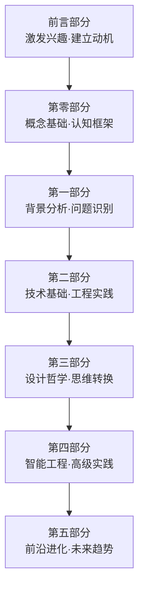
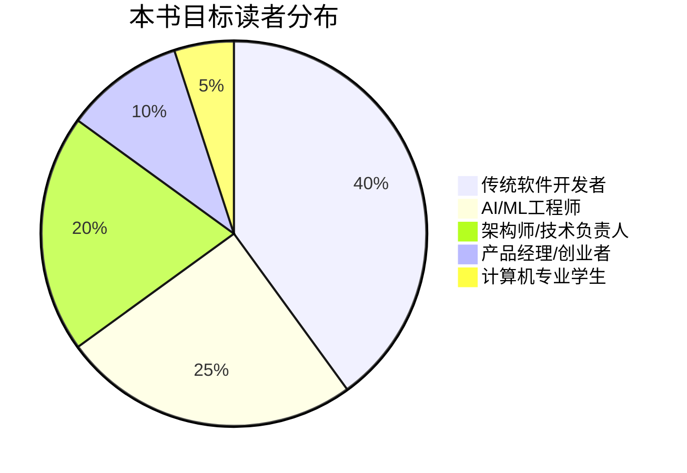
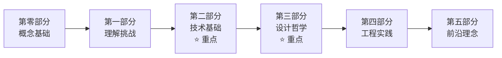
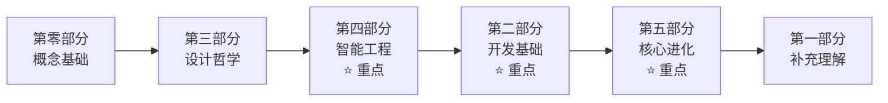
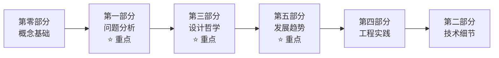
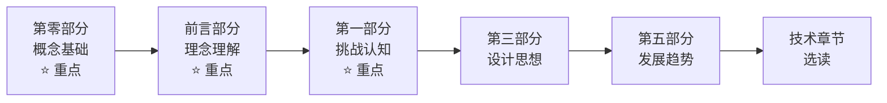
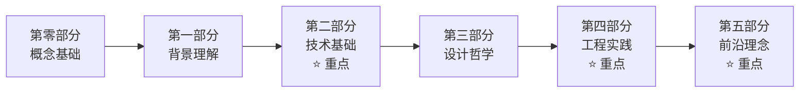

# 如何使用本书

> **"好的方法是成功的一半。正确的阅读策略将让你的学习效果事半功倍。"**

## 🎯 开始之前的重要提醒
### 代码不重要，重要的是思想！！！
### 代码不重要，重要的是思想！！！
### 代码不重要，重要的是思想！！！

### 📖 这本书的正确打开方式

**这不是一本需要从头到尾线性阅读的书籍**，而是一本根据你的背景和需求可以灵活使用的**实战指南**。

**核心建议**：
- 🎯 **目标导向**：明确你的学习目标和期望收获
- 🗺️ **路径选择**：根据背景选择合适的阅读路径  
- 🔄 **迭代学习**：多次阅读，每次关注不同层面
- 💡 **实践验证**：结合实际项目验证理论学习

## 🏗️ 全书结构导览

### 📚 内容组织逻辑



### 🎯 各部分的作用和价值

#### 📢 前言部分（必读）
**作用**：激发兴趣，建立学习动机
- 🌅 了解AGI时代的机遇和挑战
- 💼 认识软件工程师的转型价值
- 📖 理解本书的独特定位
- 🗺️ 选择合适的学习路径

#### 🎯 第零部分：核心概念预览（强烈推荐先读）
**作用**：建立完整的概念基础和认知框架
- 💡 掌握AGI应用的核心概念
- 🏗️ 理解分层架构设计
- 🧠 建立核心开发理念
- 🛣️ 选择个性化学习路径

#### 🔍 第一部分：背景与问题（理解挑战）
**作用**：深入理解AGI应用开发面临的挑战
- 🤔 认识不确定性的来源
- ⚡ 理解与传统开发的区别

#### 🔧 第二部分：开发基础（核心技术）
**作用**：掌握AGI应用开发的核心技术
- 🌊 流式通信技术
- ⚡ 异步并发编程
- 🔄 状态机设计
- 🎨 设计模式应用

#### 🎨 第三部分：设计哲学（思维转换）
**作用**：建立适应新时代的设计思维
- ⚫ 面向黑盒编程
- 🤝 拥抱不确定性
- ⚖️ 合理分工协作

#### 🧠 第四部分：智能工程（高级实践）
**作用**：掌握智能系统的工程化方法
- 💭 上下文工程
- 🤔 智能思考工程

#### 🚀 第五部分：核心进化（前沿理念）
**作用**：理解AGI应用的发展趋势
- ✨ 智能涌现机制
- 📊 智能态势感知

## 🛣️ 个性化学习路径

### 📊 目标读者分析

根据我们的调研，本书的目标读者主要分为5类：



### 👨‍💻 路径一：传统软件开发者

#### 背景特征
- ✅ 具备扎实的软件工程基础
- ✅ 熟悉系统架构设计
- ❓ 对AI/LLM了解有限
- ❓ 缺乏不确定性系统设计经验

#### 🎯 学习目标
转型成为AGI应用开发工程师，掌握在不确定性环境中构建可靠系统的能力。

#### 📚 推荐学习路径


#### 📖 重点关注章节
**必读章节** ⭐⭐⭐：
- 2.1 流式通信基础
- 2.2 异步并发编程
- 2.3 状态机设计
- 3.1 面向黑盒编程

**重要章节** ⭐⭐：
- 1.2 与传统软件开发的区别
- 3.2 拥抱不确定性
- 4.1 上下文工程

#### 🎓 学习建议
- **时间分配**：60%技术实现 + 30%设计理念 + 10%前沿概念
- **实践方式**：结合现有项目思考如何应用AGI技术
- **难点突破**：重点理解概率性编程思维

### 🤖 路径二：AI/ML工程师

#### 背景特征
- ✅ 深度理解AI/ML技术
- ✅ 熟悉模型训练和优化
- ❓ 缺乏大规模系统架构经验
- ❓ 工程化实践相对薄弱

#### 🎯 学习目标
掌握将AI能力工程化的方法，构建可部署的企业级AGI应用。

#### 📚 推荐学习路径


#### 📖 重点关注章节
**必读章节** ⭐⭐⭐：
- 4.1 上下文工程
- 4.2 智能思考工程
- 5.1 智能涌现
- 3.3 不要指望大模型做所有事情

**重要章节** ⭐⭐：
- 2.4 设计模式
- 3.1 面向黑盒编程
- 5.2 智能态势感知

#### 🎓 学习建议
- **时间分配**：50%智能工程 + 30%系统架构 + 20%前沿理念
- **实践方式**：从模型能力出发，思考如何构建完整系统
- **难点突破**：重点理解软件工程在AGI中的重要性

### 🏗️ 路径三：架构师/技术负责人

#### 背景特征
- ✅ 丰富的系统架构经验
- ✅ 技术选型和团队管理能力
- ❓ 对AGI技术特点理解不足
- ❓ 缺乏AI项目管理经验

#### 🎯 学习目标
建立AGI应用的架构设计能力，指导团队进行AGI项目开发。

#### 📚 推荐学习路径


#### 📖 重点关注章节
**必读章节** ⭐⭐⭐：
- 1.1 不确定性的来源分析
- 1.2 与传统软件开发的区别
- 3.1 面向黑盒编程
- 5.1 智能涌现

**重要章节** ⭐⭐：
- 3.2 拥抱不确定性
- 3.3 不要指望大模型做所有事情
- 4.1 上下文工程架构
- 5.2 智能态势感知

#### 🎓 学习建议
- **时间分配**：40%架构设计 + 30%理念哲学 + 20%趋势分析 + 10%技术细节
- **实践方式**：从企业需求出发，设计AGI应用架构
- **难点突破**：理解AGI应用与传统系统的本质差异

### 💼 路径四：产品经理/创业者

#### 背景特征
- ✅ 敏锐的商业嗅觉
- ✅ 产品规划和市场分析能力
- ❓ 技术理解深度有限
- ❓ 对技术实现复杂度认知不足

#### 🎯 学习目标
理解AGI应用的技术本质，做出正确的产品决策和资源投入。

#### 📚 推荐学习路径


#### 📖 重点关注章节
**必读章节** ⭐⭐⭐：
- 前言：AGI应用概念
- 前言：90%软件工程
- 0.1 AGI应用核心概念
- 1.1 不确定性的来源

**重要理解** ⭐⭐：
- 1.2 与传统软件开发的区别
- 3.3 不要指望大模型做所有事情
- 5.1.1 智能涌现的理论基础

#### 🎓 学习建议
- **时间分配**：50%概念理解 + 30%挑战认知 + 20%趋势分析
- **实践方式**：结合市场需求思考AGI应用的商业价值
- **关键理解**：AGI应用开发的复杂性和投入要求

### 🎓 路径五：计算机专业学生

#### 背景特征
- ✅ 计算机基础理论扎实
- ✅ 学习能力强，接受新概念快
- ❓ 缺乏实际项目经验
- ❓ 对企业级系统理解不足

#### 🎯 学习目标
建立AGI应用开发的完整知识体系，为未来职业发展做准备。

#### 📚 推荐学习路径


#### 🎓 学习建议
- **时间分配**：均衡学习各部分内容
- **实践方式**：通过小项目验证理论学习
- **重点培养**：工程化思维和系统性思考能力

## 📖 高效阅读策略

### 🔄 三轮阅读法（推荐）

#### 第一轮：概览理解（1-2天）
**目标**：建立整体认知，了解全书框架
**方法**：
- 仔细阅读前言部分和第零部分
- 浏览其他章节的标题和小结
- 标记感兴趣和重要的章节

#### 第二轮：重点深入（1-2周）
**目标**：深入学习重点内容，掌握核心技能
**方法**：
- 根据学习路径重点阅读相关章节
- 动手实践代码示例和练习
- 做笔记，整理知识要点

#### 第三轮：实践应用（持续）
**目标**：结合实际项目，验证和深化理解
**方法**：
- 在实际项目中应用学到的理念和方法
- 遇到问题时查阅相关章节
- 与团队分享和讨论学习心得

### 🎯 主题式阅读法

如果你有特定的学习目标，可以按主题组织阅读：

#### 🏗️ 架构设计主题
```
第零部分(0.2) → 第三部分(3.1) → 第四部分(4.1-4.2) → 第五部分(5.1)
```

#### 🔧 技术实现主题  
```
第零部分(0.2) → 第二部分(全部) → 第三部分(3.1) → 第四部分(4.1)
```

#### 🧠 设计思维主题
```
第零部分(0.3) → 第一部分(1.2) → 第三部分(全部) → 第五部分(5.2)
```

## 💡 学习效果最大化技巧

### 🔍 主动学习策略

#### 问题驱动学习
在阅读每章前，先思考：
- 🤔 这个概念解决什么问题？
- 🎯 如何在我的项目中应用？
- 🔄 与我已知的概念有什么联系？

#### 笔记整理方法
建议使用**概念图**的方式整理笔记：
```
核心概念 → 定义 → 特征 → 应用场景 → 实现方法 → 注意事项
```

### 🛠️ 实践验证

#### 代码实验
- 📝 每个技术章节都尝试运行代码示例
- 🔧 修改参数，观察不同的结果
- 🚀 结合自己的项目需求进行改进

#### 项目应用
- 🎯 选择一个小项目作为学习载体
- 📊 逐步应用书中的理念和方法
- 🔄 记录遇到的问题和解决方案

### 🤝 社区互动

#### 分享交流
- 📝 写学习笔记和心得分享
- 💬 参与相关技术社区的讨论
- 🎯 与同事分享学习收获

#### 问题求助
- 🔍 遇到问题时先查阅术语表和相关章节
- 💡 在技术社区提出具体的技术问题
- 🤝 与其他学习者互相帮助

## 📊 学习进度跟踪

### 🗓️ 学习计划模板

#### 第1周：基础建立
- [ ] 完成前言部分阅读
- [ ] 完成第零部分学习
- [ ] 选择适合的学习路径
- [ ] 建立学习项目

#### 第2-3周：核心技术
- [ ] 完成重点技术章节学习
- [ ] 实践代码示例
- [ ] 完成技能检查清单

#### 第4周：思维转换
- [ ] 学习设计哲学部分
- [ ] 反思和总结学习心得
- [ ] 制定应用计划

#### 持续：实践应用
- [ ] 在项目中应用所学知识
- [ ] 持续阅读前沿章节
- [ ] 跟踪技术发展动态

### 📈 学习效果评估

#### 知识掌握度自评
| 知识领域 | 理解程度 | 实践程度 | 应用能力 |
|---------|---------|---------|---------|
| AGI应用概念 | □初级 □中级 □高级 | □理论 □实验 □项目 | □了解 □应用 □创新 |
| 分层架构 | □初级 □中级 □高级 | □理论 □实验 □项目 | □了解 □应用 □创新 |
| 核心技术 | □初级 □中级 □高级 | □理论 □实验 □项目 | □了解 □应用 □创新 |

#### 能力发展检查
- [ ] **概念理解能力**：能够准确解释AGI应用的核心概念和特征
- [ ] **架构设计能力**：能够设计符合AGI应用特点的分层架构
- [ ] **技术选型能力**：能够根据具体需求选择合适的技术方案
- [ ] **不确定性处理**：能够设计应对系统不确定性的解决方案
- [ ] **团队协作能力**：能够指导团队进行AGI项目开发和实施

#### 学习成果验证标准

**初级水平（入门）**：
- 理解AGI应用与传统AI应用的区别
- 掌握基本的流式通信和状态机概念
- 能够阅读和理解AGI应用代码

**中级水平（应用）**：  
- 能够独立设计简单的AGI应用架构
- 掌握黑盒编程和异步并发编程
- 能够处理基本的不确定性问题

**高级水平（精通）**：
- 能够设计复杂的企业级AGI应用
- 掌握智能涌现和态势感知等高级概念
- 能够指导团队进行AGI项目开发

## 🚀 开始你的学习之旅

### 🎯 第一步：设定明确目标

在开始阅读之前，请花几分钟思考：
- 🤔 你希望通过这本书获得什么？
- 🎯 你的职业发展目标是什么？
- ⏰ 你能投入多少时间学习？
- 💼 你计划在哪个项目中应用所学知识？

### 📋 第二步：选择学习路径

根据你的背景和目标，选择最适合的学习路径：
- 👨‍💻 传统软件开发者 → 技术实现路径
- 🤖 AI/ML工程师 → 工程化路径  
- 🏗️ 架构师 → 系统设计路径
- 💼 产品经理 → 商业理解路径

### 🚀 第三步：开始行动

**不要拖延，立即开始！**

建议从 [第零部分：核心概念预览](../第零部分_核心概念预览/0.0_全书概念框架.md) 开始，建立完整的认知基础。

记住：**学习的最好时机就是现在，行动的最好方式就是开始。**

---

> **💡 学习提醒**：学习是一个持续的过程，不要急于求成。重要的是建立正确的认知框架和思维模式，技术细节可以在实践中逐步掌握。

> **🤝 需要帮助？** 如果在学习过程中遇到问题，欢迎查阅 [术语表](../术语表.md) 或在相关技术社区寻求帮助。
