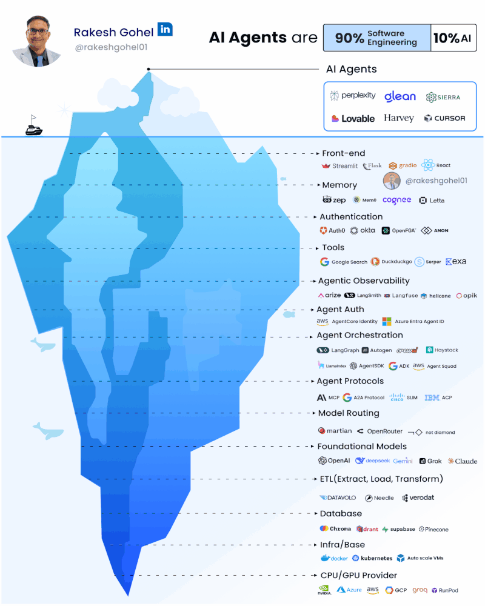
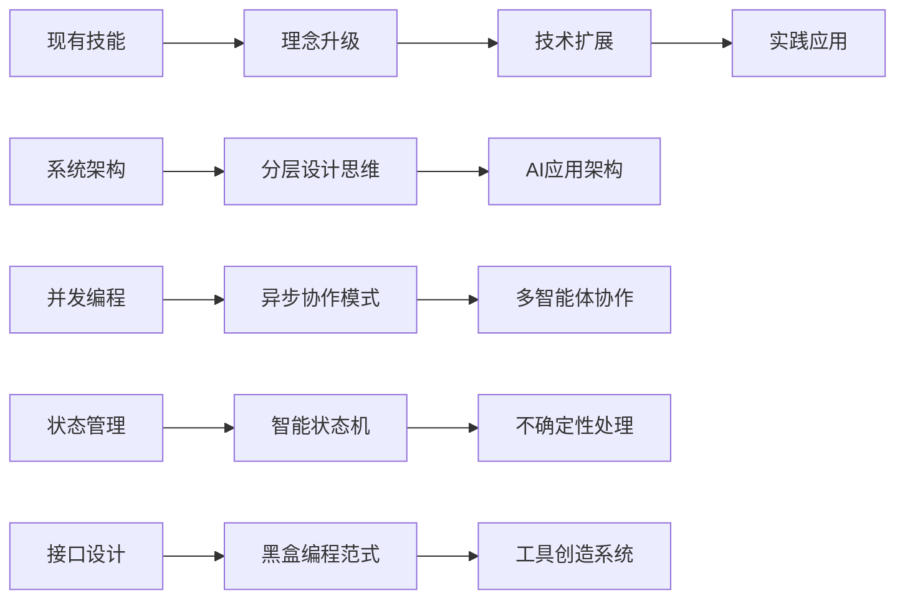

# 软件工程师的新机遇

> **"在AI时代，最大的机遇不是属于那些最懂AI的人，而是属于那些最懂软件工程的人。"**

## 🎯 写给每一位软件工程师的话

如果你是一名软件工程师，正在为AI技术的快速发展感到焦虑，担心自己的技能会被淘汰，那么这一章将彻底改变你的认知。

**好消息是**：AI时代不是来淘汰你的，而是来成就你的。

## 💡 颠覆认知的深刻洞察

### 冰山模型：隐藏的真相

当我们被ChatGPT、Claude、GPT-4等大语言模型的能力震撼时，很容易产生一个错觉：AI应用开发就是调用几个API接口的简单工作。

然而，硅谷知名技术专家**Rakesh Gohel**在2025年8月提出了一个颠覆性的洞察：

> **核心洞察**
> 
> **"AI Agents are about 90% Software Engineering and only 10% AI"**
> 
> **"AI智能体，90%是软件工程，只有10%才是AI。"**

这就像一座冰山：



*图：Rakesh Gohel先生提出的AI Agents冰山模型*


基于对当前AI应用开发实践的深度观察和分析，我在Rakesh Gohel观点的基础上进一步提出：  
  
> **Agentic AI应用开发90%是软件工程，只有10%才是AI。**  
> 
> **Agentic AI Applications are about 90% Software Engineering and only 10% AI.**  
  
随着应用规模的扩大和业务复杂度的提升，软件工程在整个开发过程中的重要性将愈发凸显。

```
🎨 10% AI能力 (水面上)
├─ 模型推理
├─ 智能决策  
└─ 内容生成

⚙️ 90% 软件工程 (水面下)
├─ 系统架构设计
├─ 数据流管理
├─ 异步并发处理
├─ 错误处理机制
├─ 性能优化
├─ 安全防护
├─ 监控运维
└─ 测试保障
```

**这意味着什么？**

意味着构建真正可用的AI应用，**90%的工作量都是你已经熟悉的软件工程领域！**

## 🚀 你的技能正是时代所需

### 从焦虑到自信的转变

**很多软件工程师的担忧**：
- 😰 "AI会替代我的工作吗？"
- 🤔 "我需要重新学习机器学习吗？"
- 😵 "我的经验还有价值吗？"

**现实的答案**：
- ✅ **AI不会替代你，而是需要你来驾驭它**
- ✅ **你不需要成为AI专家，但需要学会工程化AI能力**
- ✅ **你的经验不仅有价值，而且变得更加珍贵**

### 🛠️ 你已经掌握的核心技能

让我们看看AI应用开发需要哪些核心技能，以及你已经具备了多少：

#### 系统架构设计 ✅
**AI应用需要**：复杂的分层架构，支持多组件协作
**你的经验**：微服务架构、分层设计、模块化开发

#### 并发编程 ✅  
**AI应用需要**：处理多智能体协作、异步工具调用
**你的经验**：多线程编程、异步IO、并发控制

#### 状态管理 ✅
**AI应用需要**：管理复杂的执行流程和状态转换
**你的经验**：状态机设计、工作流管理、事务处理

#### 接口设计 ✅
**AI应用需要**：灵活的模块间通信和第三方集成
**你的经验**：RESTful API、微服务通信、系统集成

#### 错误处理 ✅
**AI应用需要**：应对AI系统的不确定性和异常情况
**你的经验**：异常处理、容错设计、系统恢复

#### 性能优化 ✅
**AI应用需要**：高效的资源利用和响应速度
**你的经验**：性能调优、缓存策略、负载均衡

#### 监控运维 ✅
**AI应用需要**：全面的系统监控和智能运维
**你的经验**：日志管理、监控告警、DevOps实践

**看到了吗？你几乎已经具备了所有核心技能！**


## 🔄 从传统开发到Agentic AI应用开发

### 思维模式的转换

| 传统软件开发 | Agentic AI应用开发 |
|------------|-------------|
| **确定性思维** | **概率性思维** |
| 输入→处理→输出 | 输入→推理→多种可能的输出 |
| **完全可控** | **拥抱不确定性** |
| 精确的逻辑控制 | 智能的自适应调整 |
| **预定义流程** | **动态创造能力** |
| 按既定流程执行 | 根据需要创造新工具 |

### 技能升级的路径



## 💰 AI应用开发的职业价值参考

### 市场需求的爆发（具体数据仅供参考）

**行业数据**：
- 全球AI应用市场预计到2030年将达到**1.3万亿美元**
- 85%的企业在未来2年内部署Agentic AI应用
- AI应用开发工程师的平均薪资比传统开发工程师高**30-50%**
- 2025年10月高盛估计，AI生产率带来的长期价值远超前期投入。该行预测，AI的广泛应用可能为美国经济带来20万亿美元的增值，其中约8万亿美元将以资本收入流向企业。
- 高盛：AI热潮并非泡沫 目前仍处于“开场阶段”

**人才缺口**：
- 具备AI应用开发能力的工程师严重短缺
- 大部分AI专家缺乏大规模系统开发经验
- **有经验的软件工程师转型成功率最高**

### 职业发展的新赛道

**新兴职位**：
- AI应用开发工程师
- AI应用架构师
- AI产品经理
- 企业级AI解决方案专家

**核心竞争力**：
- 不是最懂AI算法的人
- 而是最能将AI能力工程化的人
- **你的软件工程背景就是最大的优势**

## 🎯 如何开始你的转型之路

### 第一步：建立正确认知
- ✅ 理解"90%软件工程"的核心洞察
- ✅ 认识到自己技能的价值和可迁移性
- ✅ 建立对AI应用开发的整体认知

### 第二步：掌握核心技术
- 🌊 **流式通信**：实现AI任务的实时反馈
- ⚡ **异步并发**：处理多智能体协作
- 🔄 **状态机设计**：管理复杂的执行流程
- ⚫ **黑盒编程**：构建灵活的模块化系统

### 第三步：转换设计思维
- 🤝 **拥抱不确定性**：从确定性编程转向概率性设计
- ⚖️ **合理分工**：不指望AI做所有事情
- 🎨 **智能涌现**：设计能够产生创新能力的系统

### 第四步：实践验证
- 🚀 从小项目开始，逐步积累经验
- 📊 关注系统的可靠性和工程质量
- 🔧 将现有项目逐步智能化升级

## 🌟 你准备好了吗？

### 机会之窗正在打开

**历史告诉我们**：
- 互联网时代成就了第一代Web开发者
- 移动互联网时代造就了App开发专家
- **AI时代正在为软件工程师打开新的机会之窗**

### 时间窗口有限

**现在正是最佳时机**：
- AI技术刚刚成熟，应用开发刚刚起步
- 市场需求巨大，但人才供给不足
- **早期进入者将获得最大的先发优势**

### 你的优势独一无二

作为有经验的软件工程师，你具备了其他人难以复制的优势：
- ✅ **深厚的工程实践经验**
- ✅ **系统性的架构思维**
- ✅ **成熟的问题解决能力**
- ✅ **对软件质量的深度理解**

**这些优势在AI时代不仅没有贬值，反而变得更加珍贵。**

## 🚀 开始行动

**不要等待，不要犹豫。**

AI时代的大门已经打开，机会就在眼前。你所需要的，只是用新的视角重新审视你的技能，用新的方法应用你的经验。

**这本书将成为你转型路上的导航仪**，帮助你：
- 🎯 重新认识自己技能的价值
- 🛠️ 掌握AI应用开发的核心技术
- 🧠 建立适应新时代的思维模式
- 🚀 具备构建下一代智能应用的能力

**你的AI时代，从现在开始！**

---

> **📖 下一步**：想了解这本书能为你提供哪些独特价值？请继续阅读 [本书的独特价值](本书的独特价值.md)。

> **🚀 迫不及待开始学习？** 建议先阅读 [第零部分：核心概念预览](../第零部分_核心概念预览/0.0_全书概念框架.md) 建立完整的知识框架。
