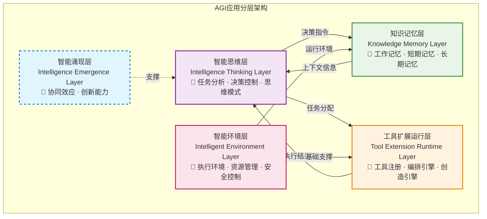
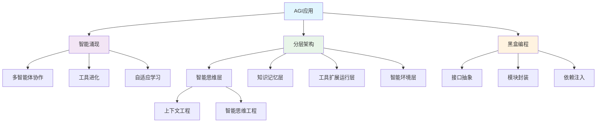

# 核心概念预览

> 在深入AGI应用开发的技术细节之前，本章为读者提供关键概念的预览，帮助建立完整的认知框架。

## 学习目标

- 建立AGI应用开发的整体认知框架
- 理解本书涉及的核心概念和术语
- 掌握概念间的逻辑关系和层次结构
- 为后续深入学习做好知识准备

## 1. 基础概念体系

### 1.1 AGI应用（AGI Application）
**定义**：具备智能涌现机制，能够创造出超越原始组件能力的新兴智能，并运用这些涌现能力自主完成任务的应用系统。

**核心特征**：
- 🧠 智能涌现性：产生超越单一组件的新兴智能行为
- 🛠️ 工具创造能力：动态组合、创造并使用新工具
- 🎯 自主任务执行：独立的任务分解、规划和执行能力
- 📈 适应性学习：根据环境反馈调整策略

### 1.2 智能涌现（Intelligence Emergence）
**基本概念**：多个相对简单的智能组件通过协作产生的复杂智能行为，超越任何单一组件的能力边界。

**关键特点**：
- ✨ 非可预测性：无法从组件分析直接推导
- 🔄 自组织性：无外部控制下形成有序结构
- 📊 层次性：多层次的递进涌现现象
- 🎨 创新性：产生预设程序中不存在的新能力

> **📖 详细阐述**：第五部分"核心进化"将深入探讨智能涌现的理论基础和实现机制。

### 1.3 面向黑盒编程（Black-Box Programming）
**核心理念**：通过接口抽象和封装，隐藏系统内部实现细节的编程范式。

**在AGI应用中的意义**：
- 🔧 模型无关性：轻松切换不同的语言模型
- 🧩 能力组合性：通过编排黑盒组件实现复杂逻辑
- 🌐 技术栈灵活性：不同技术栈组件的协作

> **📖 详细阐述**：第三部分"开发思想与设计哲学"将系统阐述这一编程范式。

## 2. 技术架构体系

### 2.1 AGI应用分层架构
AGI应用采用五层架构设计，每层承担特定职责并相互协作：

**层次关系说明**：
- **自下而上**：每层为上层提供支撑和能力
- **协同工作**：层间通过接口进行信息交换
- **涌现效应**：多层协作产生系统性智能现象

### 2.2 关键技术组件

#### 流式通信（Stream Communication）
**作用**：实现AI任务执行过程的实时反馈和渐进式结果展示
**应用场景**：文本生成、长时间计算、实时监控

#### 异步并发编程（Asynchronous Concurrent Programming）  
**作用**：处理AGI应用中的多任务并发和非阻塞操作
**重要性**：提升系统响应性和资源利用效率

#### 状态机（State Machine）
**作用**：管理AGI应用中复杂的状态转换和执行流程
**特点**：处理不确定性、支持多智能体协作

## 3. 核心开发理念

### 3.1 "90%软件工程 + 10%AI"
**理念来源**：硅谷技术专家Rakesh Gohel的深刻洞察
**核心观点**：AGI应用开发的主要挑战在于软件工程实践，而非AI算法本身

**实践意义**：
- 🔧 重视工程化实践：架构设计、错误处理、性能优化
- 📊 关注系统可靠性：监控、日志、故障恢复
- 🔄 强化开发流程：版本管理、测试、部署

### 3.2 拥抱不确定性
**背景**：AGI应用面临多源不确定性挑战
**策略**：
- 🎯 概率性思维：从确定性编程转向概率性建模
- 🛡️ 容错设计：构建韧性系统架构
- 🔄 自适应机制：动态调整和优化策略

### 3.3 不要指望大模型做所有事情
**核心观点**：认识大模型的能力边界，构建合理的系统分工
**实践原则**：
- 🎯 职责分离：明确各组件的职责边界
- 🔧 优势互补：充分发挥传统技术优势
- ⚖️ 平衡设计：在智能性和可靠性间找到平衡

## 4. 概念关联图谱

## 5. 学习路径指导

### 5.1 推荐阅读顺序
1. **基础认知**：完成本概念预览 → 理解整体框架
2. **问题分析**：第一部分其余章节 → 理解挑战和差异
3. **技术基础**：第二部分 → 掌握核心技术
4. **设计哲学**：第三部分 → 建立设计思维
5. **工程实践**：第四部分 → 学习具体实现
6. **前沿进化**：第五部分 → 理解发展趋势

### 5.2 重点关注领域
根据你的背景和兴趣，可以重点关注：

**传统软件开发者**：
- 重点：第二、三部分（技术基础 + 设计哲学）
- 挑战：概率性思维、不确定性处理

**AI/ML工程师**：
- 重点：第四、五部分（工程实践 + 核心进化）
- 挑战：软件工程实践、系统架构设计

**架构师/技术负责人**：
- 重点：第一、三、五部分（问题分析 + 设计哲学 + 发展趋势）
- 挑战：技术选型、团队协作

## 6. 预备知识检查

在深入学习之前，请确认你具备以下基础知识：

### 必备知识 ✅
- [ ] **基本编程能力**（任何语言）
  - 能够理解基本的面向对象编程概念
  - 熟悉接口、类、继承等基础概念
  - 具备基本的调试和问题解决能力

- [ ] **软件工程基础概念**
  - 理解MVC、分层架构等设计模式
  - 了解API设计和RESTful服务
  - 具备基本的数据库操作知识

- [ ] **基本的系统架构理解**
  - 了解客户端-服务器架构
  - 理解微服务基本概念
  - 熟悉HTTP协议和网络通信

- [ ] **对AI/LLM的基础了解**
  - 知道什么是大语言模型（如ChatGPT、Claude）
  - 理解提示词（Prompt）的概念
  - 有过AI工具的使用经验

### 推荐知识 📚
- [ ] **分布式系统概念**
  - 了解负载均衡、容错机制
  - 理解数据一致性问题

- [ ] **异步编程经验**
  - 熟悉Promise、Future等异步概念
  - 了解事件驱动编程

- [ ] **设计模式了解**
  - 熟悉常用设计模式（单例、工厂、观察者等）
  - 理解SOLID原则

- [ ] **容器化技术基础**
  - 了解Docker基本概念
  - 知道容器编排的作用

### 深入学习知识 🚀
- [ ] **机器学习理论**
  - 理解监督学习、无监督学习概念
  - 了解神经网络基础

- [ ] **复杂系统理论**
  - 理解涌现现象
  - 了解系统思维

- [ ] **认知科学基础**
  - 了解人类认知过程
  - 理解记忆和学习机制

- [ ] **系统工程方法论**
  - 熟悉敏捷开发流程
  - 了解DevOps实践

### 📊 自我评估指南

**如果你的必备知识 ✅ 完成度：**
- **80%以上**：可以顺利阅读全书
- **60-80%**：建议先补充相关基础知识
- **60%以下**：建议先学习相关基础课程

**推荐的学习路径：**
1. **初学者**：重点关注第一、二部分，跳过复杂的代码实现
2. **中级开发者**：按照正常顺序学习，重点实践代码示例
3. **高级开发者**：重点关注架构设计和最佳实践部分

## 7. 术语索引

| 术语 | 英文 | 定义 | 详细章节 |
|------|------|------|----------|
| AGI应用 | AGI Application | 具备智能涌现机制的应用系统 | 前言部分 |
| 智能涌现 | Intelligence Emergence | 多组件协作产生的复杂智能行为 | 第五部分 |
| 黑盒编程 | Black-Box Programming | 基于接口抽象的编程范式 | 第三部分 |
| 流式通信 | Stream Communication | 实时数据传输技术 | 2.1节 |
| 状态机 | State Machine | 状态转换管理机制 | 2.3节 |
| 上下文工程 | Context Engineering | AI记忆系统构建技术 | 4.1节 |
| 智能思维工程 | Intelligence Thinking Engineering | 认知过程工程化实现 | 4.2节 |

## 本章小结

本章为读者构建了AGI应用开发的整体认知框架，介绍了核心概念、技术架构和开发理念。这些概念将在后续章节中得到深入阐述和具体应用。

**关键要点**：
1. **AGI应用**是具备智能涌现特性的新一代AI应用
2. **分层架构**提供了系统性的设计框架
3. **黑盒编程**是适应不确定性的编程范式
4. **工程实践**是AGI应用开发的核心挑战

**下一步**：建议按照推荐的学习路径，结合自身背景选择重点关注的领域，逐步深入AGI应用开发的各个方面。

---

> **💡 学习提示**：如果在阅读过程中遇到概念理解困难，可以随时回到本章查阅相关定义和说明。概念的掌握是技术实践的基础。
