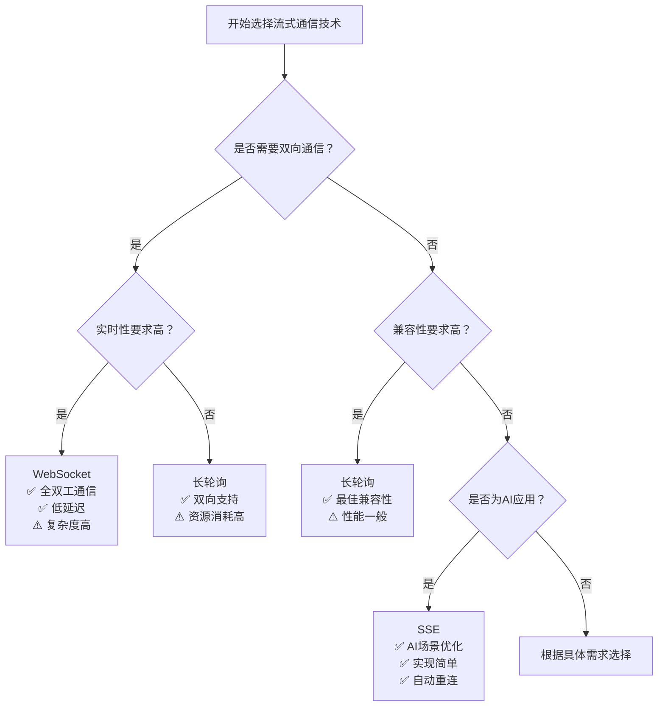
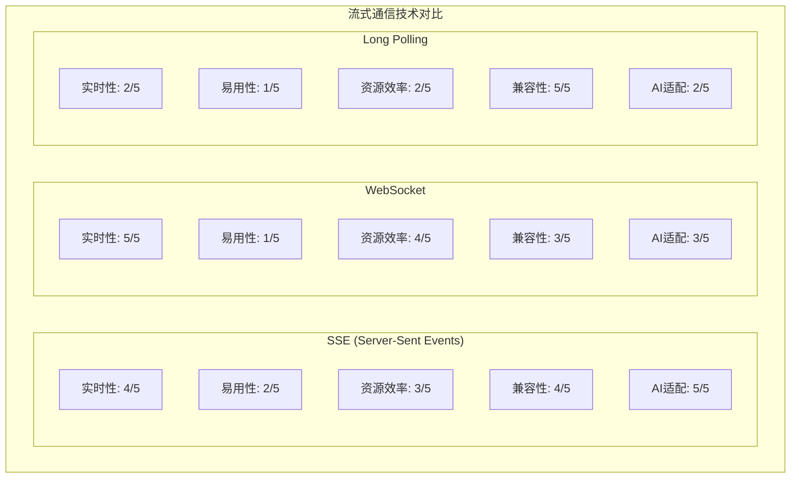

# 2.1.1 流式通信基础与应用场景

**学习目标：** 理解流式通信的核心概念、技术选型考虑，掌握SSE、WebSocket等流式通信协议的特点和适用场景

## 📚 阅读指南

### 🎯 必读内容（适合所有读者）
- 传统HTTP模式的局限性
- 流式通信的优势与应用场景
- 技术选型决策矩阵

### 🔧 技术实现（适合开发者）
- SSE、WebSocket、Long Polling代码示例
- 具体技术实现细节

### 🚀 深入阅读（适合架构师）
- 性能优化策略
- 企业级部署考虑

---

## 从传统通信到流式通信的演进

### 传统HTTP请求响应模式的工作原理

在理解流式通信之前，我们先回顾传统Web应用的通信模式。传统的HTTP通信遵循请求-响应模式：

```
客户端 → HTTP请求 → 服务器
客户端 ← HTTP响应 ← 服务器
```

**传统模式的特点：**
- **同步阻塞**：客户端发送请求后必须等待服务器响应
- **一次性交互**：每次请求对应一次响应，然后连接关闭
- **无状态**：每次请求都是独立的，服务器不保持连接状态

这种模式在处理简单的CRUD操作时表现良好，但在AGI应用场景中面临显著挑战：

### 1. 响应时间不可预测
AI模型的推理时间往往无法预测，从几秒到几分钟不等。传统的同步请求会导致：
- 客户端长时间等待，用户体验差
- 服务器连接资源被长时间占用
- 容易触发网关或代理的超时限制

### 2. 缺乏进度反馈
在传统模式下，用户无法了解AI任务的执行进度：
- 用户不知道任务是否正在执行
- 无法提供任务完成的预估时间
- 系统看起来像是"卡住了"

### 3. 资源利用效率低下
- 服务器需要保持连接直到完整结果生成
- 无法充分利用客户端的处理能力
- 网络带宽利用不均匀

## 流式通信的优势与应用场景

流式通信（Stream Communication）通过建立持久连接，实现数据的实时双向或单向传输：

```
客户端 ←→ 持久连接 ←→ 服务器
       ← 数据流1 ←
       ← 数据流2 ←
       ← 数据流3 ←
       ← ... ←
```

### 核心优势

#### 1. 实时性
- 数据一产生即可传输给客户端
- 用户立即看到AI处理结果
- 支持增量更新和渐进式展示

#### 2. 用户体验优化
- 提供实时的执行状态反馈
- 减少用户等待的焦虑感
- 支持早期取消和中断操作

#### 3. 资源利用效率
- 减少服务器内存占用
- 避免大量数据的缓存
- 支持背压控制（Backpressure）

#### 4. 可扩展性
- 更好地支持高并发场景
- 降低服务器负载峰值
- 支持负载均衡和水平扩展

### 典型应用场景

#### 1. AI文本生成
```
用户提问 → AI模型逐token生成 → 流式返回
"什么是" → "什么是机器" → "什么是机器学习" → ...
```

#### 2. 长时间计算任务
- 数据分析和报表生成
- 机器学习模型训练状态
- 文件批量处理进度

#### 3. 实时监控和告警
- 系统性能指标监控
- 异常事件实时推送
- 业务数据实时展示

## 流式通信技术的演进路径

在深入具体技术之前，让我们了解流式通信技术的演进历程：

```
HTTP轮询 → 长轮询(Long Polling) → 服务器推送事件(SSE) → WebSocket
   ↓            ↓                    ↓              ↓
简单但低效    改善但复杂           单向实时         双向实时
```

### 技术演进的动机

每种技术的出现都是为了解决前一代技术的问题：

1. **HTTP轮询** → **长轮询**：减少无效请求，降低服务器负载
2. **长轮询** → **SSE**：标准化服务器推送，简化实现
3. **SSE** → **WebSocket**：支持双向通信，降低协议开销

## 流式通信技术详解

### Server-Sent Events (SSE)

SSE是HTML5标准的一部分，专门用于服务器向客户端推送数据。

**核心特点：**
- **基于HTTP协议**：复用现有的HTTP基础设施
- **单向通信**：只支持服务器到客户端的数据推送
- **自动重连**：连接断开后浏览器会自动尝试重连
- **事件驱动**：支持命名事件，便于客户端分类处理

**适用场景：**
- AI结果流式返回
- 实时状态更新
- 单向数据推送

**最简单的SSE示例：**

让我们从最基础的SSE实现开始理解：

```java
@RestController
public class BasicStreamController {
    
    @GetMapping(value = "/simple-stream", produces = "text/event-stream")
    public SseEmitter simpleStream() {
        SseEmitter emitter = new SseEmitter();
        
        // 立即发送一条消息
        try {
            emitter.send("Hello, 这是第一条流式消息！");
            emitter.complete(); // 完成传输
        } catch (Exception e) {
            emitter.completeWithError(e);
        }
        
        return emitter;
    }
}
```

**进阶示例：定时发送多条消息**

```java
@RestController
public class StreamController {
    
    @GetMapping(value = "/stream", produces = MediaType.TEXT_EVENT_STREAM_VALUE)
    public SseEmitter streamData() {
        SseEmitter emitter = new SseEmitter(60000L); // 60秒超时
        
        // 异步执行数据生成
        CompletableFuture.runAsync(() -> {
            try {
                for (int i = 1; i <= 5; i++) {
                    emitter.send("数据块 " + i);
                    Thread.sleep(1000); // 每秒发送一条
                }
                emitter.complete(); // 完成流式传输
            } catch (Exception e) {
                emitter.completeWithError(e); // 错误处理
            }
        });
        
        return emitter;
    }
}
```

**对应的前端代码：**

**最简单的客户端实现：**
```javascript
// 创建SSE连接
const eventSource = new EventSource('/simple-stream');

// 接收消息
eventSource.onmessage = function(event) {
    console.log('收到消息:', event.data);
    // 显示在页面上
    document.body.innerHTML += '<p>' + event.data + '</p>';
};
```

**完整的客户端示例：**
```javascript
// 建立SSE连接
const eventSource = new EventSource('/stream');

// 监听消息事件
eventSource.onmessage = function(event) {
    console.log('接收到数据:', event.data);
    // 更新UI显示
    updateUI(event.data);
};

// 监听连接状态
eventSource.onopen = function(event) {
    console.log('✅ SSE连接已建立');
    showStatus('已连接', 'green');
};

eventSource.onerror = function(error) {
    console.error('❌ SSE连接错误:', error);
    showStatus('连接错误', 'red');
};

// UI更新函数
function updateUI(data) {
    const container = document.getElementById('messages');
    const message = document.createElement('div');
    message.className = 'message';
    message.textContent = data;
    container.appendChild(message);
}

function showStatus(text, color) {
    const status = document.getElementById('status');
    status.textContent = text;
    status.style.color = color;
}

// 页面卸载时关闭连接
window.addEventListener('beforeunload', () => {
    eventSource.close();
});
```

### WebSocket

**特点：**
- 基于TCP的全双工通信协议
- 支持双向实时数据传输
- 协议开销小，性能高
- 需要处理连接管理复杂性

**适用场景：**
- 实时聊天应用
- 协作编辑
- 在线游戏
- 需要客户端主动向服务器发送数据的场景

**代码示例（后端 - Java Spring Boot）：**
```java
@Component
public class WebSocketHandler extends TextWebSocketHandler {
    
    @Override
    public void afterConnectionEstablished(WebSocketSession session) {
        // 连接建立后的处理
        System.out.println("WebSocket连接建立: " + session.getId());
    }
    
    @Override
    public void handleTextMessage(WebSocketSession session, TextMessage message) throws IOException {
        // 处理客户端消息
        String payload = message.getPayload();
        session.sendMessage(new TextMessage("收到消息: " + payload));
    }
}
```

### Long Polling

**特点：**
- 基于HTTP的长连接技术
- 客户端发起请求，服务器延迟响应
- 兼容性最好
- 实现相对复杂，资源开销大

**适用场景：**
- 需要兼容老旧浏览器
- 网络环境不稳定
- 对实时性要求不高的场景

## 技术选型决策矩阵

| 技术方案 | 实时性 | 复杂度 | 资源消耗 | 兼容性 | 推荐场景 |
|---------|--------|--------|----------|--------|----------|
| SSE | 高 | 低 | 中 | 好 | **AI结果流式返回** |
| WebSocket | 很高 | 高 | 低 | 中 | 双向实时交互 |
| Long Polling | 中 | 高 | 高 | 很好 | 兼容性要求高 |

### 技术选型决策流程图



### 性能对比分析



## AGI应用中为什么需要流式通信

### 1. 用户体验至关重要

在AGI应用中，用户期望看到"思考过程"：
```
用户问题: "帮我分析这份财务报表"

传统方式:
用户 → 提交问题 → 等待30秒 → 突然出现完整分析结果

流式方式:
用户 → 提交问题 → "正在读取数据..." → "正在分析收入趋势..." 
    → "发现异常指标..." → "生成可视化图表..." → 完整结果
```

### 2. AI任务的特殊性

AI任务具有以下特点，使得流式通信成为必需：

#### Token级别的生成过程
大语言模型逐个token生成文本，天然适合流式输出：

```python
# AI文本生成的典型过程
def generate_text_stream(prompt):
    for token in model.generate(prompt):
        yield token  # 立即返回生成的token
```

#### 多步骤任务执行
AI Agent通常需要执行多个步骤：

```
步骤1: 理解用户意图 ✓
步骤2: 搜索相关信息 ✓  
步骤3: 调用工具分析 ○ (进行中)
步骤4: 生成最终结果 ○
```

#### 资源密集型计算
- GPU计算资源昂贵
- 需要及时释放资源给其他任务
- 避免因异常导致资源长时间占用

### 3. 系统可靠性保障

流式通信为AGI系统提供了更好的可靠性保障：

#### 早期错误发现
```java
// 在流式处理中可以立即发现并处理错误
public void processAITask(SseEmitter emitter) {
    try {
        emitter.send("开始处理...");
        
        // 第一步：数据预处理
        preprocessData();
        emitter.send("数据预处理完成");
        
        // 第二步：模型推理
        if (!modelAvailable()) {
            emitter.send("错误：模型服务不可用");
            emitter.completeWithError(new ModelUnavailableException());
            return;
        }
        
        // 继续处理...
    } catch (Exception e) {
        emitter.completeWithError(e);
    }
}
```

#### 优雅降级
当系统负载过高时，可以：
- 降低流式数据的推送频率
- 简化中间状态的反馈
- 提供基础版本的功能

## 小结

流式通信不是万能解决方案，但在AGI应用开发中具有不可替代的价值。选择合适的流式通信技术需要综合考虑：

1. **业务需求**：是否需要双向通信、实时性要求
2. **技术限制**：团队技术栈、基础设施支持
3. **用户群体**：目标用户的网络环境、设备能力
4. **运维成本**：监控、调试、故障处理的复杂度

## 实际项目案例：AI代码审查助手

### 案例背景
假设我们要构建一个AI代码审查助手，需要分析大型代码库并生成审查报告。传统的同步请求会导致用户等待几分钟甚至更长时间，用户体验极差。

### 流式通信解决方案

#### 1. 系统架构设计
```
用户界面 ←→ [SSE连接] ←→ Web服务器 ←→ AI处理引擎
    ↓                           ↓
实时进度显示              异步任务队列
```

#### 2. 后端实现（Spring Boot + SSE）
```java
@RestController
public class CodeReviewController {
    
    @GetMapping(value = "/api/review/stream", produces = MediaType.TEXT_EVENT_STREAM_VALUE)
    public SseEmitter reviewCodeStream(@RequestParam String repositoryUrl) {
        SseEmitter emitter = new SseEmitter(300000L); // 5分钟超时
        
        CompletableFuture.runAsync(() -> {
            try {
                // 1. 克隆代码库
                emitter.send(createProgressEvent("正在克隆代码库...", 10));
                Repository repo = gitService.cloneRepository(repositoryUrl);
                
                // 2. 分析代码结构
                emitter.send(createProgressEvent("分析代码结构...", 25));
                CodeStructure structure = codeAnalyzer.analyze(repo);
                
                // 3. AI审查 - 分批处理
                List<CodeFile> files = structure.getFiles();
                int totalFiles = files.size();
                
                for (int i = 0; i < totalFiles; i++) {
                    CodeFile file = files.get(i);
                    
                    // 发送当前文件信息
                    emitter.send(createFileEvent(file.getName(), "reviewing"));
                    
                    // AI审查单个文件
                    ReviewResult result = aiService.reviewFile(file);
                    
                    // 发送审查结果
                    emitter.send(createResultEvent(file.getName(), result));
                    
                    // 更新总体进度
                    int progress = 25 + (int)((i + 1.0) / totalFiles * 60);
                    emitter.send(createProgressEvent(
                        String.format("已审查 %d/%d 文件", i + 1, totalFiles), 
                        progress));
                }
                
                // 4. 生成最终报告
                emitter.send(createProgressEvent("生成审查报告...", 90));
                ReviewReport report = reportGenerator.generate(structure);
                
                // 5. 发送完成事件
                emitter.send(createCompletionEvent(report));
                emitter.complete();
                
            } catch (Exception e) {
                emitter.send(createErrorEvent(e.getMessage()));
                emitter.completeWithError(e);
            }
        });
        
        return emitter;
    }
    
    private SseEmitter.SseEventBuilder createProgressEvent(String message, int progress) {
        return SseEmitter.event()
            .name("progress")
            .data(Map.of(
                "message", message,
                "progress", progress,
                "timestamp", System.currentTimeMillis()
            ));
    }
    
    private SseEmitter.SseEventBuilder createFileEvent(String fileName, String status) {
        return SseEmitter.event()
            .name("file_status")
            .data(Map.of(
                "fileName", fileName,
                "status", status,
                "timestamp", System.currentTimeMillis()
            ));
    }
    
    private SseEmitter.SseEventBuilder createResultEvent(String fileName, ReviewResult result) {
        return SseEmitter.event()
            .name("review_result")
            .data(Map.of(
                "fileName", fileName,
                "issues", result.getIssues(),
                "score", result.getScore(),
                "suggestions", result.getSuggestions()
            ));
    }
}
```

#### 3. 前端实现（React + EventSource）
```javascript
import React, { useState, useEffect } from 'react';

function CodeReviewDashboard() {
    const [progress, setProgress] = useState(0);
    const [currentMessage, setCurrentMessage] = useState('');
    const [reviewResults, setReviewResults] = useState([]);
    const [isCompleted, setIsCompleted] = useState(false);
    const [error, setError] = useState(null);

    const startReview = (repositoryUrl) => {
        const eventSource = new EventSource(
            `/api/review/stream?repositoryUrl=${encodeURIComponent(repositoryUrl)}`
        );

        eventSource.addEventListener('progress', (event) => {
            const data = JSON.parse(event.data);
            setProgress(data.progress);
            setCurrentMessage(data.message);
        });

        eventSource.addEventListener('file_status', (event) => {
            const data = JSON.parse(event.data);
            console.log(`文件状态更新: ${data.fileName} - ${data.status}`);
        });

        eventSource.addEventListener('review_result', (event) => {
            const data = JSON.parse(event.data);
            setReviewResults(prev => [...prev, data]);
        });

        eventSource.addEventListener('completion', (event) => {
            const data = JSON.parse(event.data);
            setIsCompleted(true);
            eventSource.close();
        });

        eventSource.addEventListener('error', (event) => {
            const data = JSON.parse(event.data);
            setError(data.message);
            eventSource.close();
        });

        eventSource.onerror = (error) => {
            console.error('SSE连接错误:', error);
            setError('连接中断，请重试');
            eventSource.close();
        };
    };

    return (
        <div className="code-review-dashboard">
            <div className="progress-section">
                <div className="progress-bar">
                    <div 
                        className="progress-fill" 
                        style={{width: `${progress}%`}}
                    ></div>
                </div>
                <p className="progress-message">{currentMessage}</p>
            </div>

            <div className="results-section">
                {reviewResults.map((result, index) => (
                    <div key={index} className="file-result">
                        <h3>{result.fileName}</h3>
                        <div className="score">评分: {result.score}/100</div>
                        <ul className="issues">
                            {result.issues.map((issue, idx) => (
                                <li key={idx}>{issue}</li>
                            ))}
                        </ul>
                    </div>
                ))}
            </div>

            {error && (
                <div className="error-message">
                    错误: {error}
                </div>
            )}

            {isCompleted && (
                <div className="completion-message">
                    ✅ 代码审查完成！
                </div>
            )}
        </div>
    );
}
```

#### 4. 错误处理和重连机制
```javascript
class RobustEventSource {
    constructor(url, options = {}) {
        this.url = url;
        this.options = options;
        this.reconnectDelay = 1000;
        this.maxReconnectDelay = 30000;
        this.reconnectAttempts = 0;
        this.maxReconnectAttempts = 5;
        
        this.connect();
    }
    
    connect() {
        this.eventSource = new EventSource(this.url);
        
        this.eventSource.onopen = () => {
            console.log('SSE连接已建立');
            this.reconnectAttempts = 0;
            this.reconnectDelay = 1000;
        };
        
        this.eventSource.onerror = () => {
            console.log('SSE连接错误，尝试重连...');
            this.eventSource.close();
            this.scheduleReconnect();
        };
    }
    
    scheduleReconnect() {
        if (this.reconnectAttempts >= this.maxReconnectAttempts) {
            console.error('重连次数超限，停止重连');
            return;
        }
        
        setTimeout(() => {
            this.reconnectAttempts++;
            this.connect();
            
            // 指数退避策略
            this.reconnectDelay = Math.min(
                this.reconnectDelay * 2, 
                this.maxReconnectDelay
            );
        }, this.reconnectDelay);
    }
    
    addEventListener(type, listener) {
        this.eventSource.addEventListener(type, listener);
    }
    
    close() {
        this.eventSource.close();
    }
}
```

### 案例效果分析

#### 用户体验提升
- **实时反馈**：用户可以看到审查进度，不再焦虑等待
- **早期结果**：部分文件审查完成后立即显示结果
- **透明过程**：用户了解系统在做什么，建立信任

#### 技术优势
- **资源高效**：服务器不需要缓存大量结果
- **可扩展性**：支持多用户并发审查
- **容错性**：网络中断后可以重连继续

#### 性能数据对比
| 指标 | 传统同步方式 | 流式通信方式 |
|------|-------------|-------------|
| 首次反馈时间 | 5-10分钟 | 2-3秒 |
| 用户等待焦虑 | 高 | 低 |
| 服务器内存占用 | 高（需要缓存全部结果） | 低（流式输出） |
| 并发支持 | 受限 | 良好 |

### 经验总结

#### 适用场景
✅ **适合流式通信的场景**：
- 长时间运行的AI任务
- 需要进度反馈的批处理
- 实时数据分析和展示

❌ **不适合的场景**：
- 简单的CRUD操作
- 需要强一致性的事务操作
- 低延迟要求的实时游戏

#### 实施建议
1. **渐进式实施**：先从关键用户旅程开始
2. **优雅降级**：确保在不支持SSE的环境下有备选方案
3. **监控告警**：建立完善的连接监控和异常告警
4. **性能优化**：合理控制事件发送频率，避免客户端过载

## 本章小结与下章预告

通过本节的学习，我们了解了：

1. **技术演进脉络**：从HTTP轮询到WebSocket的发展历程
2. **核心技术对比**：SSE、WebSocket、Long Polling各自的特点和适用场景  
3. **实际应用案例**：AI代码审查助手的完整实现过程

**关键收获：**
- 掌握了流式通信的基本概念和技术选型原则
- 理解了AI应用场景下流式通信的特殊需求
- 学会了从简单到复杂的渐进式开发方法

### 🔜 下一步学习

在掌握了流式通信的基础知识后，下一节我们将深入**服务端架构设计**，学习如何构建稳定可靠的流式响应系统。我们将重点关注：

- 核心组件的设计模式（如Printer接口、AgentContext上下文）
- SseEmitter的生命周期管理和最佳实践
- 多服务协调下的流式数据传递架构
- 异步处理和线程池的合理配置

这些内容将为我们后续构建企业级AI应用奠定坚实的架构基础。

---

**本节关键要点：**
- 传统HTTP请求-响应模式在AI应用中的局限性
- 流式通信技术的演进路径和选型决策
- SSE、WebSocket、Long Polling的技术特点对比
- AI应用对流式通信的特殊需求分析
- 从基础到复杂的渐进式实现方法
- 完整的AI代码审查助手案例实践
