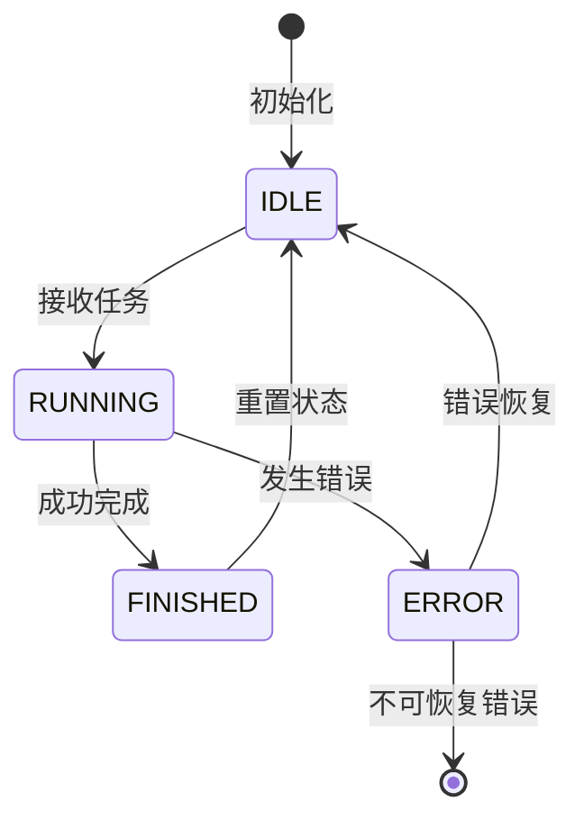

# 2.3.1 AGI应用中的状态机基础理论与设计原则

## 学习目标

- 理解状态机在AGI应用开发中的核心作用与设计理念
- 掌握AI Agent生命周期状态的定义与转换规则
- 熟悉有限状态自动机在复杂AGI系统中的建模方法
- 理解状态机设计的SOLID原则在AGI应用架构中的体现

## 引言

在传统软件开发中，状态机通常用于处理有限的、确定的状态转换场景，如TCP连接状态、用户会话状态等。然而，在AGI应用开发中，状态机面临着前所未有的挑战：大语言模型输出的不确定性、多Agent协作的复杂性、实时流式交互的动态性，以及工具调用的异步性。

本节将从理论基础出发，探讨如何在AGI应用中设计高效、可靠的状态机系统。

## 1. 状态机在AGI应用中的核心作用

### 1.1 不确定性的控制与管理

AGI应用的核心挑战在于处理不确定性。大语言模型的输出具有概率性质，无法保证完全可预测的结果。状态机在这种环境下承担着关键作用：

```java
public enum AgentState {
    IDLE,       // 空闲状态：Agent等待任务分配
    RUNNING,    // 运行状态：Agent正在执行任务
    FINISHED,   // 完成状态：Agent成功完成任务
    ERROR       // 错误状态：Agent遇到不可恢复的错误
}
```

**不确定性处理的三个层次：**

1. **输出不确定性**：LLM可能产生格式不正确、内容不符合预期的输出
2. **执行不确定性**：工具调用可能失败、网络请求可能超时
3. **协作不确定性**：多Agent系统中的消息传递可能出现延迟或丢失

### 1.2 复杂性的分解与抽象

AGI应用通常涉及复杂的多步骤流程，状态机提供了将复杂性分解为可管理单元的机制：

```java
// BaseAgent中的状态管理
public abstract class BaseAgent {
    private AgentState state = AgentState.IDLE;
    private int currentStep = 0;
    private int maxSteps = 10;
    
    public String run(String query) {
        setState(AgentState.IDLE);
        
        List<String> results = new ArrayList<>();
        try {
            while (currentStep < maxSteps && state != AgentState.FINISHED) {
                currentStep++;
                String stepResult = step(); // 抽象方法，由子类实现
                results.add(stepResult);
            }
        } catch (Exception e) {
            state = AgentState.ERROR;
            throw e;
        }
        
        return results.isEmpty() ? "No steps executed" : results.get(results.size() - 1);
    }
}
```

## 2. AI Agent生命周期状态设计

### 2.1 状态定义的设计原则

在JoyAgent-JDGenie项目中，Agent的状态设计遵循以下原则：

**简洁性原则**：状态数量应保持在可管理的范围内，避免状态爆炸
**完整性原则**：状态集合应覆盖Agent的所有可能情况
**互斥性原则**：在任意时刻，Agent只能处于一个明确的状态
**可观测性原则**：每个状态都应该是可监控和可诊断的

### 2.2 状态转换规则



**关键转换逻辑：**

1. **IDLE → RUNNING**：接收到有效任务请求时触发
2. **RUNNING → FINISHED**：成功完成所有步骤或达到终止条件
3. **RUNNING → ERROR**：遇到不可恢复的错误或超出最大步数限制
4. **ERROR/FINISHED → IDLE**：状态重置，准备接收新任务

### 2.3 状态持久化策略

```java
// AgentContext中的状态持久化
public class AgentContext {
    private String requestId;
    private String sessionId;
    private String query;
    private Map<String, Object> contextData = new ConcurrentHashMap<>();
    
    // 状态快照
    public AgentSnapshot createSnapshot() {
        return AgentSnapshot.builder()
            .requestId(requestId)
            .sessionId(sessionId)
            .state(getCurrentState())
            .contextData(new HashMap<>(contextData))
            .timestamp(System.currentTimeMillis())
            .build();
    }
}
```

## 3. 有限状态自动机在AI系统中的建模

### 3.1 扩展状态机模型

传统的有限状态自动机（FSA）在AGI应用中需要扩展以处理：

- **上下文信息**：Agent的记忆、任务历史
- **概率转换**：基于模型输出概率的状态转换
- **异步事件**：来自外部系统的异步响应

```java
// 扩展状态机接口
public interface ExtendedStateMachine<S, E, C> {
    S getCurrentState();
    boolean canTransition(S from, S to, E event, C context);
    void transition(S from, S to, E event, C context);
    void handleAsyncEvent(E event, C context);
}
```

### 3.2 分层状态机架构

在复杂的AGI应用中，采用分层状态机架构可以更好地管理复杂性：

```
应用层状态机（Application Level）
├── Agent层状态机（Agent Level）
│   ├── 任务层状态机（Task Level）
│   └── 工具层状态机（Tool Level）
└── 通信层状态机（Communication Level）
```

### 3.3 状态机组合模式

多个状态机可以通过不同的模式进行组合：

**并行组合**：多个状态机同时运行，独立管理各自状态
**串行组合**：状态机按顺序执行，前一个的输出作为后一个的输入
**条件组合**：根据条件选择不同的状态机执行路径

## 4. SOLID原则在AGI应用状态机设计中的体现

### 4.1 单一职责原则（SRP）

每个状态机应该只负责一个明确的职责领域：

```java
// 专门负责Agent执行状态管理
public class AgentExecutionStateMachine {
    public void handleExecutionState(AgentState from, AgentState to) {
        // 只处理执行相关的状态转换
    }
}

// 专门负责Agent通信状态管理  
public class AgentCommunicationStateMachine {
    public void handleCommunicationState(CommState from, CommState to) {
        // 只处理通信相关的状态转换
    }
}
```

### 4.2 开闭原则（OCP）

状态机设计应该对扩展开放，对修改关闭：

```java
// 抽象状态处理器
public abstract class StateHandler<T> {
    public abstract void enter(T context);
    public abstract void exit(T context);
    public abstract boolean canHandle(AgentState state);
}

// 具体状态处理器实现
public class RunningStateHandler extends StateHandler<AgentContext> {
    @Override
    public void enter(AgentContext context) {
        // 进入RUNNING状态的处理逻辑
    }
    
    @Override
    public boolean canHandle(AgentState state) {
        return state == AgentState.RUNNING;
    }
}
```

### 4.3 里氏替换原则（LSP）

不同类型的Agent应该可以在状态机层面互相替换：

```java
// 所有Agent都应该遵循相同的状态机接口
public abstract class BaseAgent implements AgentStateMachine {
    @Override
    public final AgentState getCurrentState() {
        return this.state;
    }
    
    @Override
    public final void setState(AgentState newState) {
        validateTransition(this.state, newState);
        this.state = newState;
    }
}
```

### 4.4 接口隔离原则（ISP）

将状态机的不同职责分离到不同的接口：

```java
// 状态查询接口
public interface StateQueryable {
    AgentState getCurrentState();
    boolean isInState(AgentState state);
}

// 状态变更接口
public interface StateTransitionable {
    void setState(AgentState newState);
    boolean canTransitionTo(AgentState targetState);
}

// 状态监听接口
public interface StateObservable {
    void addStateListener(StateListener listener);
    void removeStateListener(StateListener listener);
}
```

### 4.5 依赖倒置原则（DIP）

高层模块不应依赖低层模块，两者都应依赖抽象：

```java
// 抽象的状态存储接口
public interface StateStore {
    void saveState(String agentId, AgentState state);
    AgentState loadState(String agentId);
}

// Agent依赖抽象而不是具体实现
public class BaseAgent {
    private final StateStore stateStore; // 依赖抽象
    
    public BaseAgent(StateStore stateStore) {
        this.stateStore = stateStore;
    }
}
```

## 5. 状态机设计的关键决策

### 5.1 状态粒度的选择

**粗粒度状态**：
- 优点：简单易管理，性能开销小
- 缺点：状态信息不够详细，调试困难

**细粒度状态**：
- 优点：状态信息详细，便于调试和监控
- 缺点：复杂度高，性能开销大

**最佳实践**：采用分层设计，在不同层次使用不同的粒度。

### 5.2 状态转换的触发机制

**事件驱动**：状态转换由外部事件触发
```java
public void onToolResult(ToolResult result) {
    if (result.isSuccess()) {
        transitionTo(AgentState.FINISHED);
    } else {
        transitionTo(AgentState.ERROR);
    }
}
```

**时间驱动**：状态转换由时间条件触发
```java
@Scheduled(fixedRate = 5000)
public void checkTimeout() {
    if (isTimeout()) {
        transitionTo(AgentState.ERROR);
    }
}
```

**条件驱动**：状态转换由业务条件触发
```java
public void checkCompletion() {
    if (allTasksCompleted()) {
        transitionTo(AgentState.FINISHED);
    }
}
```

## 6. 小结

本节从理论基础出发，建立了AGI应用中状态机设计的基本框架。我们探讨了：

1. **核心作用**：状态机在AGI应用中主要用于控制不确定性和管理复杂性
2. **生命周期设计**：AI Agent的状态应遵循简洁、完整、互斥、可观测的原则
3. **建模方法**：扩展的有限状态自动机更适合AGI应用的需求
4. **设计原则**：SOLID原则在状态机设计中的具体体现
5. **关键决策**：状态粒度和转换触发机制的选择策略

在接下来的章节中，我们将基于这些理论基础，深入探讨具体的实现技术和最佳实践。

## 延伸阅读

- 《状态机设计模式》- Gang of Four
- 《响应式系统架构》- Jonas Bonér
- 《分布式系统原理与范型》- Andrew S. Tanenbaum
- JoyAgent-JDGenie项目源码：`genie-backend/src/main/java/com/jd/genie/agent/enums/AgentState.java`
