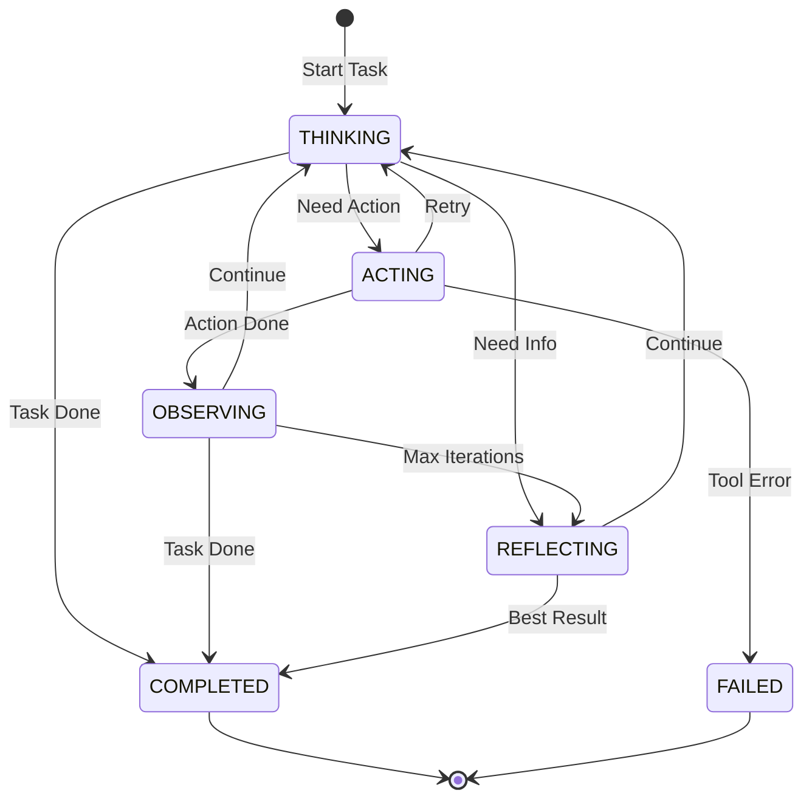

# 2.3.3 任务执行状态机与工作流管理

## 学习目标

- 学会设计任务分解与执行的状态机模型
- 掌握ReAct框架中Thought-Action-Observation循环的状态转换
- 理解任务依赖图与状态转换图的映射关系
- 学会实现任务失败恢复与状态回滚机制

## 引言

在AI应用中，复杂任务通常需要分解为多个子任务，每个子任务都有其独立的执行状态和生命周期。任务执行状态机不仅要管理单个任务的状态转换，还要协调多任务之间的依赖关系和执行顺序。

本节将深入分析JoyAgent-JDGenie项目中的任务执行状态机设计，包括任务规划、分解、执行和监控的完整流程。

## 1. 任务状态模型设计

### 1.1 任务状态枚举定义

```java
/**
 * 任务执行状态枚举
 */
public enum TaskState {
    PLANNED("planned"),         // 已规划：任务已被分解并加入执行计划
    PENDING("pending"),         // 待执行：任务等待前置依赖完成
    RUNNING("running"),         // 执行中：任务正在被Agent执行
    COMPLETED("completed"),     // 已完成：任务成功执行完毕
    FAILED("failed"),          // 执行失败：任务执行过程中出现错误
    SKIPPED("skipped"),        // 已跳过：由于依赖失败或条件不满足被跳过
    CANCELLED("cancelled");     // 已取消：任务被用户或系统主动取消
    
    private final String value;
    
    TaskState(String value) {
        this.value = value;
    }
    
    public String getValue() {
        return value;
    }
}
```

### 1.2 任务数据模型

```java
/**
 * 任务计划数据模型
 */
@Data
@Builder
@AllArgsConstructor
@NoArgsConstructor
public class Plan {
    private List<String> steps;           // 任务步骤列表
    private List<String> stepStatus;      // 每个步骤的状态
    private List<String> stages;          // 阶段分组
    private String currentStep;           // 当前执行步骤
    private int currentIndex;             // 当前步骤索引
    private long createTime;              // 创建时间
    private long updateTime;              // 更新时间
    
    /**
     * 获取下一个待执行的任务
     */
    public String getNextPendingTask() {
        for (int i = 0; i < steps.size(); i++) {
            if ("pending".equals(stepStatus.get(i))) {
                return steps.get(i);
            }
        }
        return null;
    }
    
    /**
     * 更新任务状态
     */
    public synchronized void updateTaskStatus(int index, String status) {
        if (index >= 0 && index < stepStatus.size()) {
            stepStatus.set(index, status);
            updateTime = System.currentTimeMillis();
            
            // 更新当前执行步骤
            if ("running".equals(status)) {
                currentIndex = index;
                currentStep = steps.get(index);
            }
        }
    }
    
    /**
     * 检查所有任务是否完成
     */
    public boolean isAllCompleted() {
        return stepStatus.stream().allMatch("completed"::equals);
    }
    
    /**
     * 获取执行进度百分比
     */
    public double getProgress() {
        long completedCount = stepStatus.stream()
            .mapToLong(status -> "completed".equals(status) ? 1 : 0)
            .sum();
        return (double) completedCount / steps.size() * 100;
    }
}
```

### 1.3 任务执行上下文

```java
/**
 * 任务执行上下文 - 维护任务执行过程中的状态信息
 */
@Data
@Builder
public class TaskExecutionContext {
    private String taskId;
    private String sessionId;
    private String requestId;
    
    // 任务信息
    private String taskDescription;
    private TaskState currentState;
    private int retryCount;
    private int maxRetries = 3;
    
    // 执行结果
    private String result;
    private String errorMessage;
    private List<String> intermediateResults = new ArrayList<>();
    
    // 依赖关系
    private List<String> dependencies = new ArrayList<>();
    private List<String> dependents = new ArrayList<>();
    
    // 时间信息
    private long startTime;
    private long endTime;
    private long lastUpdateTime;
    
    /**
     * 检查依赖是否满足
     */
    public boolean areDependenciesSatisfied(Map<String, TaskState> taskStates) {
        return dependencies.stream()
            .allMatch(depId -> {
                TaskState depState = taskStates.get(depId);
                return depState == TaskState.COMPLETED;
            });
    }
    
    /**
     * 更新任务状态
     */
    public void updateState(TaskState newState) {
        this.currentState = newState;
        this.lastUpdateTime = System.currentTimeMillis();
        
        if (newState == TaskState.RUNNING && startTime == 0) {
            this.startTime = System.currentTimeMillis();
        } else if (newState == TaskState.COMPLETED || newState == TaskState.FAILED) {
            this.endTime = System.currentTimeMillis();
        }
    }
}
```

## 2. ReAct框架的任务状态循环

### 2.1 思考-行动-观察状态机

```java
/**
 * ReAct任务执行状态机
 */
public class ReActTaskStateMachine {
    
    public enum ReActState {
        THINKING,    // 思考阶段：分析问题，制定行动计划
        ACTING,      // 行动阶段：执行工具调用或生成输出
        OBSERVING,   // 观察阶段：分析行动结果，决定下一步
        REFLECTING   // 反思阶段：评估整体进展，调整策略
    }
    
    private ReActState currentState = ReActState.THINKING;
    private TaskExecutionContext taskContext;
    private int maxIterations = 10;
    private int currentIteration = 0;
    
    /**
     * 执行ReAct循环的单次迭代
     */
    public TaskExecutionResult executeIteration() {
        currentIteration++;
        
        try {
            switch (currentState) {
                case THINKING:
                    return executeThinking();
                case ACTING:
                    return executeActing();
                case OBSERVING:
                    return executeObserving();
                case REFLECTING:
                    return executeReflecting();
                default:
                    throw new IllegalStateException("Unknown ReAct state: " + currentState);
            }
        } catch (Exception e) {
            taskContext.updateState(TaskState.FAILED);
            taskContext.setErrorMessage(e.getMessage());
            return TaskExecutionResult.failure(e.getMessage());
        }
    }
    
    /**
     * 思考阶段 - 分析当前情况并制定行动计划
     */
    private TaskExecutionResult executeThinking() {
        log.info("ReAct Thinking phase for task: {}", taskContext.getTaskId());
        
        // 构建思考prompt
        String thinkingPrompt = buildThinkingPrompt(taskContext);
        
        // 调用LLM进行思考
        LLMResponse thinkingResult = llm.chat(thinkingPrompt);
        
        // 解析思考结果
        ThoughtAnalysis analysis = parseThinkingResult(thinkingResult.getContent());
        
        // 决定下一步状态
        if (analysis.shouldAct()) {
            transitionTo(ReActState.ACTING);
            return TaskExecutionResult.intermediate("Thinking completed, moving to action");
        } else if (analysis.isTaskComplete()) {
            taskContext.updateState(TaskState.COMPLETED);
            taskContext.setResult(analysis.getFinalAnswer());
            return TaskExecutionResult.success(analysis.getFinalAnswer());
        } else {
            transitionTo(ReActState.REFLECTING);
            return TaskExecutionResult.intermediate("Need more information, moving to reflection");
        }
    }
    
    /**
     * 行动阶段 - 执行具体的工具调用或生成输出
     */
    private TaskExecutionResult executeActing() {
        log.info("ReAct Acting phase for task: {}", taskContext.getTaskId());
        
        // 解析需要执行的工具调用
        List<ToolCall> toolCalls = parseToolCallsFromContext();
        
        if (toolCalls.isEmpty()) {
            // 无工具调用，直接输出结果
            transitionTo(ReActState.OBSERVING);
            return TaskExecutionResult.intermediate("No tool calls needed");
        }
        
        // 执行工具调用
        List<String> actionResults = new ArrayList<>();
        for (ToolCall toolCall : toolCalls) {
            try {
                String result = executeToolCall(toolCall);
                actionResults.add(result);
                
                // 保存中间结果
                taskContext.getIntermediateResults().add(
                    String.format("Tool: %s, Result: %s", toolCall.getName(), result)
                );
                
            } catch (ToolExecutionException e) {
                log.error("Tool execution failed: {}", toolCall.getName(), e);
                
                if (taskContext.getRetryCount() < taskContext.getMaxRetries()) {
                    taskContext.setRetryCount(taskContext.getRetryCount() + 1);
                    transitionTo(ReActState.THINKING); // 重新思考
                    return TaskExecutionResult.retry("Tool execution failed, retrying");
                } else {
                    taskContext.updateState(TaskState.FAILED);
                    return TaskExecutionResult.failure("Tool execution failed after retries");
                }
            }
        }
        
        // 转换到观察阶段
        transitionTo(ReActState.OBSERVING);
        return TaskExecutionResult.intermediate(String.join("\n", actionResults));
    }
    
    /**
     * 观察阶段 - 分析行动结果
     */
    private TaskExecutionResult executeObserving() {
        log.info("ReAct Observing phase for task: {}", taskContext.getTaskId());
        
        // 分析行动结果
        String lastResult = taskContext.getIntermediateResults().isEmpty() 
            ? "" : taskContext.getIntermediateResults().get(
                taskContext.getIntermediateResults().size() - 1);
        
        ObservationAnalysis analysis = analyzeActionResult(lastResult);
        
        // 根据分析结果决定下一步
        if (analysis.isTaskComplete()) {
            taskContext.updateState(TaskState.COMPLETED);
            taskContext.setResult(analysis.getFinalResult());
            return TaskExecutionResult.success(analysis.getFinalResult());
        } else if (analysis.needsMoreAction()) {
            transitionTo(ReActState.THINKING);
            return TaskExecutionResult.intermediate("Need more actions");
        } else if (currentIteration >= maxIterations) {
            transitionTo(ReActState.REFLECTING);
            return TaskExecutionResult.intermediate("Max iterations reached, reflecting");
        } else {
            transitionTo(ReActState.THINKING);
            return TaskExecutionResult.intermediate("Continue thinking");
        }
    }
    
    /**
     * 反思阶段 - 评估整体执行情况
     */
    private TaskExecutionResult executeReflecting() {
        log.info("ReAct Reflecting phase for task: {}", taskContext.getTaskId());
        
        // 构建反思prompt
        String reflectionPrompt = buildReflectionPrompt(taskContext);
        
        // 进行反思
        LLMResponse reflectionResult = llm.chat(reflectionPrompt);
        ReflectionAnalysis analysis = parseReflectionResult(reflectionResult.getContent());
        
        if (analysis.shouldContinue() && currentIteration < maxIterations) {
            transitionTo(ReActState.THINKING);
            return TaskExecutionResult.intermediate("Reflection suggests continuing");
        } else {
            // 任务结束，输出最佳结果
            taskContext.updateState(TaskState.COMPLETED);
            String finalResult = analysis.getBestResult();
            taskContext.setResult(finalResult);
            return TaskExecutionResult.success(finalResult);
        }
    }
    
    /**
     * 状态转换
     */
    private void transitionTo(ReActState newState) {
        log.debug("ReAct state transition: {} -> {}", currentState, newState);
        this.currentState = newState;
        taskContext.setLastUpdateTime(System.currentTimeMillis());
    }
}
```

### 2.2 任务状态转换图



## 3. 任务依赖图与工作流管理

### 3.1 任务依赖图构建

```java
/**
 * 任务依赖图管理器
 */
@Component
public class TaskDependencyManager {
    
    /**
     * 任务依赖图节点
     */
    @Data
    @Builder
    public static class TaskNode {
        private String taskId;
        private String description;
        private TaskState state;
        private Set<String> dependencies = new HashSet<>();
        private Set<String> dependents = new HashSet<>();
        private TaskExecutionContext context;
        
        /**
         * 检查是否可以执行
         */
        public boolean isReadyToExecute(Map<String, TaskNode> allTasks) {
            return dependencies.stream()
                .allMatch(depId -> {
                    TaskNode dep = allTasks.get(depId);
                    return dep != null && dep.getState() == TaskState.COMPLETED;
                });
        }
    }
    
    private final Map<String, TaskNode> taskGraph = new ConcurrentHashMap<>();
    private final ExecutorService taskExecutor = Executors.newFixedThreadPool(10);
    
    /**
     * 构建任务依赖图
     */
    public void buildDependencyGraph(Plan plan) {
        // 解析任务和依赖关系
        for (int i = 0; i < plan.getSteps().size(); i++) {
            String taskDescription = plan.getSteps().get(i);
            String taskId = "task_" + i;
            
            TaskNode node = TaskNode.builder()
                .taskId(taskId)
                .description(taskDescription)
                .state(TaskState.PLANNED)
                .context(TaskExecutionContext.builder()
                    .taskId(taskId)
                    .taskDescription(taskDescription)
                    .currentState(TaskState.PLANNED)
                    .build())
                .build();
            
            // 分析依赖关系（简化版本）
            if (i > 0) {
                node.getDependencies().add("task_" + (i - 1));
                TaskNode prevNode = taskGraph.get("task_" + (i - 1));
                if (prevNode != null) {
                    prevNode.getDependents().add(taskId);
                }
            }
            
            taskGraph.put(taskId, node);
        }
    }
    
    /**
     * 获取可执行的任务列表
     */
    public List<TaskNode> getReadyTasks() {
        return taskGraph.values().stream()
            .filter(node -> node.getState() == TaskState.PLANNED || 
                          node.getState() == TaskState.PENDING)
            .filter(node -> node.isReadyToExecute(taskGraph))
            .collect(Collectors.toList());
    }
    
    /**
     * 更新任务状态并触发依赖检查
     */
    public void updateTaskState(String taskId, TaskState newState) {
        TaskNode node = taskGraph.get(taskId);
        if (node != null) {
            TaskState oldState = node.getState();
            node.setState(newState);
            node.getContext().updateState(newState);
            
            log.info("Task {} state updated: {} -> {}", taskId, oldState, newState);
            
            // 如果任务完成，检查其依赖任务
            if (newState == TaskState.COMPLETED) {
                checkDependentTasks(taskId);
            }
            
            // 如果任务失败，处理依赖任务
            if (newState == TaskState.FAILED) {
                handleFailedTaskDependencies(taskId);
            }
        }
    }
    
    /**
     * 检查依赖任务是否可以开始执行
     */
    private void checkDependentTasks(String completedTaskId) {
        TaskNode completedTask = taskGraph.get(completedTaskId);
        if (completedTask != null) {
            completedTask.getDependents().forEach(dependentId -> {
                TaskNode dependent = taskGraph.get(dependentId);
                if (dependent != null && 
                    dependent.getState() == TaskState.PLANNED &&
                    dependent.isReadyToExecute(taskGraph)) {
                    
                    // 将依赖任务标记为待执行
                    updateTaskState(dependentId, TaskState.PENDING);
                }
            });
        }
    }
    
    /**
     * 处理失败任务的依赖关系
     */
    private void handleFailedTaskDependencies(String failedTaskId) {
        TaskNode failedTask = taskGraph.get(failedTaskId);
        if (failedTask != null) {
            // 递归标记所有依赖任务为跳过状态
            markDependentsAsSkipped(failedTaskId);
        }
    }
    
    private void markDependentsAsSkipped(String taskId) {
        TaskNode task = taskGraph.get(taskId);
        if (task != null) {
            task.getDependents().forEach(dependentId -> {
                TaskNode dependent = taskGraph.get(dependentId);
                if (dependent != null && 
                    (dependent.getState() == TaskState.PLANNED || 
                     dependent.getState() == TaskState.PENDING)) {
                    
                    updateTaskState(dependentId, TaskState.SKIPPED);
                    markDependentsAsSkipped(dependentId); // 递归处理
                }
            });
        }
    }
}
```

### 3.2 工作流执行引擎

```java
/**
 * 工作流执行引擎 - 协调任务执行和状态管理
 */
@Component
public class WorkflowExecutionEngine {
    
    @Autowired
    private TaskDependencyManager dependencyManager;
    
    @Autowired
    private ExecutorAgent executorAgent;
    
    private final ScheduledExecutorService scheduler = 
        Executors.newScheduledThreadPool(5);
    
    /**
     * 执行工作流
     */
    public CompletableFuture<WorkflowResult> executeWorkflow(Plan plan) {
        String workflowId = UUID.randomUUID().toString();
        log.info("Starting workflow execution: {}", workflowId);
        
        // 构建任务依赖图
        dependencyManager.buildDependencyGraph(plan);
        
        // 创建工作流执行上下文
        WorkflowExecutionContext context = WorkflowExecutionContext.builder()
            .workflowId(workflowId)
            .plan(plan)
            .startTime(System.currentTimeMillis())
            .state(WorkflowState.RUNNING)
            .build();
        
        // 异步执行工作流
        return CompletableFuture.supplyAsync(() -> {
            try {
                return executeWorkflowInternal(context);
            } catch (Exception e) {
                log.error("Workflow execution failed: {}", workflowId, e);
                context.setState(WorkflowState.FAILED);
                context.setErrorMessage(e.getMessage());
                return WorkflowResult.failure(workflowId, e.getMessage());
            }
        });
    }
    
    /**
     * 内部工作流执行逻辑
     */
    private WorkflowResult executeWorkflowInternal(WorkflowExecutionContext context) {
        while (context.getState() == WorkflowState.RUNNING) {
            // 获取可执行的任务
            List<TaskDependencyManager.TaskNode> readyTasks = 
                dependencyManager.getReadyTasks();
            
            if (readyTasks.isEmpty()) {
                // 检查是否所有任务都已完成
                if (isWorkflowComplete()) {
                    context.setState(WorkflowState.COMPLETED);
                    break;
                } else {
                    // 等待正在执行的任务完成
                    try {
                        Thread.sleep(1000);
                    } catch (InterruptedException e) {
                        Thread.currentThread().interrupt();
                        break;
                    }
                    continue;
                }
            }
            
            // 并行执行可执行的任务
            List<CompletableFuture<Void>> taskFutures = readyTasks.stream()
                .map(this::executeTaskAsync)
                .collect(Collectors.toList());
            
            // 等待当前批次任务完成
            CompletableFuture.allOf(taskFutures.toArray(new CompletableFuture[0]))
                .join();
        }
        
        // 生成执行结果
        context.setEndTime(System.currentTimeMillis());
        return generateWorkflowResult(context);
    }
    
    /**
     * 异步执行单个任务
     */
    private CompletableFuture<Void> executeTaskAsync(TaskDependencyManager.TaskNode taskNode) {
        return CompletableFuture.runAsync(() -> {
            try {
                log.info("Executing task: {}", taskNode.getTaskId());
                
                // 更新任务状态为执行中
                dependencyManager.updateTaskState(taskNode.getTaskId(), TaskState.RUNNING);
                
                // 创建ReAct执行器
                ReActTaskStateMachine reactMachine = new ReActTaskStateMachine();
                reactMachine.setTaskContext(taskNode.getContext());
                
                // 执行任务
                TaskExecutionResult result = null;
                while (result == null || result.isIntermediate()) {
                    result = reactMachine.executeIteration();
                    
                    if (result.isFailure()) {
                        dependencyManager.updateTaskState(taskNode.getTaskId(), TaskState.FAILED);
                        taskNode.getContext().setErrorMessage(result.getMessage());
                        return;
                    }
                }
                
                // 任务成功完成
                dependencyManager.updateTaskState(taskNode.getTaskId(), TaskState.COMPLETED);
                taskNode.getContext().setResult(result.getMessage());
                
                log.info("Task completed successfully: {}", taskNode.getTaskId());
                
            } catch (Exception e) {
                log.error("Task execution failed: {}", taskNode.getTaskId(), e);
                dependencyManager.updateTaskState(taskNode.getTaskId(), TaskState.FAILED);
                taskNode.getContext().setErrorMessage(e.getMessage());
            }
        });
    }
    
    /**
     * 检查工作流是否完成
     */
    private boolean isWorkflowComplete() {
        return dependencyManager.getAllTasks().stream()
            .allMatch(task -> task.getState() == TaskState.COMPLETED ||
                             task.getState() == TaskState.FAILED ||
                             task.getState() == TaskState.SKIPPED);
    }
}
```

## 4. 任务失败恢复与状态回滚

### 4.1 任务失败恢复策略

```java
/**
 * 任务恢复策略管理器
 */
@Component
public class TaskRecoveryManager {
    
    public enum RecoveryStrategy {
        RETRY,           // 重试策略：重新执行失败的任务
        SKIP,            // 跳过策略：跳过失败任务，继续执行后续任务
        FALLBACK,        // 降级策略：使用备选方案执行任务
        RESTART,         // 重启策略：从检查点重新开始执行
        MANUAL          // 手动策略：需要人工介入处理
    }
    
    /**
     * 处理任务失败
     */
    public void handleTaskFailure(TaskDependencyManager.TaskNode failedTask, Exception error) {
        TaskExecutionContext context = failedTask.getContext();
        RecoveryStrategy strategy = determineRecoveryStrategy(failedTask, error);
        
        log.info("Handling task failure for {}, strategy: {}", 
            failedTask.getTaskId(), strategy);
        
        switch (strategy) {
            case RETRY:
                handleRetryStrategy(failedTask);
                break;
            case SKIP:
                handleSkipStrategy(failedTask);
                break;
            case FALLBACK:
                handleFallbackStrategy(failedTask);
                break;
            case RESTART:
                handleRestartStrategy(failedTask);
                break;
            case MANUAL:
                handleManualStrategy(failedTask);
                break;
            default:
                log.warn("Unknown recovery strategy: {}", strategy);
        }
    }
    
    /**
     * 确定恢复策略
     */
    private RecoveryStrategy determineRecoveryStrategy(
            TaskDependencyManager.TaskNode task, Exception error) {
        
        TaskExecutionContext context = task.getContext();
        
        // 根据错误类型和重试次数确定策略
        if (error instanceof ToolExecutionException) {
            ToolExecutionException toolError = (ToolExecutionException) error;
            if (toolError.isRetryable() && context.getRetryCount() < context.getMaxRetries()) {
                return RecoveryStrategy.RETRY;
            } else if (toolError.hasFallback()) {
                return RecoveryStrategy.FALLBACK;
            }
        } else if (error instanceof NetworkException) {
            if (context.getRetryCount() < 2) {
                return RecoveryStrategy.RETRY;
            }
        } else if (error instanceof TokenLimitExceeded) {
            return RecoveryStrategy.RESTART; // 从检查点重新开始
        }
        
        // 根据任务重要性决定
        if (isTaskCritical(task)) {
            return RecoveryStrategy.MANUAL;
        } else {
            return RecoveryStrategy.SKIP;
        }
    }
    
    /**
     * 重试策略处理
     */
    private void handleRetryStrategy(TaskDependencyManager.TaskNode task) {
        TaskExecutionContext context = task.getContext();
        context.setRetryCount(context.getRetryCount() + 1);
        
        // 清理之前的失败状态
        context.setErrorMessage(null);
        context.getIntermediateResults().clear();
        
        // 延迟重试
        long delay = calculateRetryDelay(context.getRetryCount());
        scheduler.schedule(() -> {
            // 重置任务状态为待执行
            dependencyManager.updateTaskState(task.getTaskId(), TaskState.PENDING);
            log.info("Retrying task {} (attempt {})", 
                task.getTaskId(), context.getRetryCount());
        }, delay, TimeUnit.SECONDS);
    }
    
    /**
     * 降级策略处理
     */
    private void handleFallbackStrategy(TaskDependencyManager.TaskNode task) {
        log.info("Applying fallback strategy for task: {}", task.getTaskId());
        
        // 使用简化版本的任务描述
        String fallbackDescription = generateFallbackTask(task.getDescription());
        task.setDescription(fallbackDescription);
        
        // 重置任务状态
        task.getContext().setRetryCount(0);
        dependencyManager.updateTaskState(task.getTaskId(), TaskState.PENDING);
    }
    
    /**
     * 检查点重启策略
     */
    private void handleRestartStrategy(TaskDependencyManager.TaskNode task) {
        log.info("Restarting task from checkpoint: {}", task.getTaskId());
        
        // 加载最近的检查点
        TaskCheckpoint checkpoint = loadLastCheckpoint(task.getTaskId());
        if (checkpoint != null) {
            // 恢复到检查点状态
            restoreFromCheckpoint(task, checkpoint);
            dependencyManager.updateTaskState(task.getTaskId(), TaskState.PENDING);
        } else {
            // 无检查点，完全重新开始
            task.getContext().setRetryCount(0);
            task.getContext().getIntermediateResults().clear();
            dependencyManager.updateTaskState(task.getTaskId(), TaskState.PENDING);
        }
    }
    
    /**
     * 计算重试延迟（指数退避）
     */
    private long calculateRetryDelay(int retryCount) {
        return Math.min(60, (long) Math.pow(2, retryCount - 1));
    }
}
```

### 4.2 状态快照与回滚机制

```java
/**
 * 任务状态快照管理
 */
@Component
public class TaskSnapshotManager {
    
    /**
     * 任务检查点数据
     */
    @Data
    @Builder
    public static class TaskCheckpoint {
        private String taskId;
        private String checkpointId;
        private TaskState state;
        private List<String> intermediateResults;
        private Map<String, Object> contextData;
        private long timestamp;
        private String description;
    }
    
    private final Map<String, List<TaskCheckpoint>> checkpointStore = 
        new ConcurrentHashMap<>();
    
    /**
     * 创建任务检查点
     */
    public void createCheckpoint(TaskDependencyManager.TaskNode task) {
        String checkpointId = UUID.randomUUID().toString();
        
        TaskCheckpoint checkpoint = TaskCheckpoint.builder()
            .taskId(task.getTaskId())
            .checkpointId(checkpointId)
            .state(task.getState())
            .intermediateResults(new ArrayList<>(
                task.getContext().getIntermediateResults()))
            .contextData(new HashMap<>()) // 复制上下文数据
            .timestamp(System.currentTimeMillis())
            .description("Checkpoint at " + task.getState())
            .build();
        
        // 存储检查点
        checkpointStore.computeIfAbsent(task.getTaskId(), k -> new ArrayList<>())
            .add(checkpoint);
        
        // 只保留最近的5个检查点
        List<TaskCheckpoint> checkpoints = checkpointStore.get(task.getTaskId());
        if (checkpoints.size() > 5) {
            checkpoints.remove(0);
        }
        
        log.debug("Created checkpoint {} for task {}", checkpointId, task.getTaskId());
    }
    
    /**
     * 回滚到指定检查点
     */
    public boolean rollbackToCheckpoint(TaskDependencyManager.TaskNode task, 
                                       String checkpointId) {
        List<TaskCheckpoint> checkpoints = checkpointStore.get(task.getTaskId());
        if (checkpoints == null) {
            log.warn("No checkpoints found for task: {}", task.getTaskId());
            return false;
        }
        
        TaskCheckpoint targetCheckpoint = checkpoints.stream()
            .filter(cp -> cp.getCheckpointId().equals(checkpointId))
            .findFirst()
            .orElse(null);
        
        if (targetCheckpoint == null) {
            log.warn("Checkpoint {} not found for task {}", checkpointId, task.getTaskId());
            return false;
        }
        
        // 恢复任务状态
        task.setState(targetCheckpoint.getState());
        task.getContext().updateState(targetCheckpoint.getState());
        task.getContext().getIntermediateResults().clear();
        task.getContext().getIntermediateResults()
            .addAll(targetCheckpoint.getIntermediateResults());
        
        log.info("Rolled back task {} to checkpoint {}", 
            task.getTaskId(), checkpointId);
        
        return true;
    }
    
    /**
     * 获取任务的所有检查点
     */
    public List<TaskCheckpoint> getTaskCheckpoints(String taskId) {
        return checkpointStore.getOrDefault(taskId, new ArrayList<>());
    }
    
    /**
     * 清理过期检查点
     */
    @Scheduled(fixedRate = 3600000) // 每小时执行一次
    public void cleanupExpiredCheckpoints() {
        long expireTime = System.currentTimeMillis() - TimeUnit.DAYS.toMillis(7);
        
        checkpointStore.values().forEach(checkpoints -> {
            checkpoints.removeIf(checkpoint -> checkpoint.getTimestamp() < expireTime);
        });
        
        // 移除空的检查点列表
        checkpointStore.entrySet().removeIf(entry -> entry.getValue().isEmpty());
    }
}
```

## 5. 任务状态监控与可视化

### 5.1 任务状态监控器

```java
/**
 * 任务状态监控器
 */
@Component
public class TaskStateMonitor {
    
    /**
     * 任务执行统计信息
     */
    @Data
    @Builder
    public static class TaskStatistics {
        private int totalTasks;
        private int completedTasks;
        private int failedTasks;
        private int runningTasks;
        private int pendingTasks;
        private double completionRate;
        private long averageExecutionTime;
        private long totalExecutionTime;
    }
    
    private final Map<String, TaskStateListener> stateListeners = 
        new ConcurrentHashMap<>();
    
    /**
     * 监听任务状态变化
     */
    public interface TaskStateListener {
        void onStateChanged(String taskId, TaskState oldState, TaskState newState);
    }
    
    /**
     * 注册状态变化监听器
     */
    public void addStateListener(String listenerId, TaskStateListener listener) {
        stateListeners.put(listenerId, listener);
    }
    
    /**
     * 通知状态变化
     */
    public void notifyStateChange(String taskId, TaskState oldState, TaskState newState) {
        stateListeners.values().forEach(listener -> {
            try {
                listener.onStateChanged(taskId, oldState, newState);
            } catch (Exception e) {
                log.error("Error in state listener", e);
            }
        });
    }
    
    /**
     * 获取任务执行统计
     */
    public TaskStatistics getTaskStatistics(String workflowId) {
        Map<String, TaskDependencyManager.TaskNode> tasks = 
            dependencyManager.getWorkflowTasks(workflowId);
        
        int total = tasks.size();
        int completed = 0;
        int failed = 0;
        int running = 0;
        int pending = 0;
        long totalExecTime = 0;
        
        for (TaskDependencyManager.TaskNode task : tasks.values()) {
            TaskExecutionContext context = task.getContext();
            
            switch (task.getState()) {
                case COMPLETED:
                    completed++;
                    if (context.getEndTime() > 0 && context.getStartTime() > 0) {
                        totalExecTime += (context.getEndTime() - context.getStartTime());
                    }
                    break;
                case FAILED:
                    failed++;
                    break;
                case RUNNING:
                    running++;
                    break;
                case PENDING:
                case PLANNED:
                    pending++;
                    break;
            }
        }
        
        return TaskStatistics.builder()
            .totalTasks(total)
            .completedTasks(completed)
            .failedTasks(failed)
            .runningTasks(running)
            .pendingTasks(pending)
            .completionRate(total > 0 ? (double) completed / total * 100 : 0)
            .averageExecutionTime(completed > 0 ? totalExecTime / completed : 0)
            .totalExecutionTime(totalExecTime)
            .build();
    }
}
```

## 6. 小结

本节详细探讨了任务执行状态机与工作流管理的关键技术：

1. **任务状态模型**：设计了完整的任务状态枚举和数据模型
2. **ReAct循环**：实现了思考-行动-观察-反思的状态机循环
3. **依赖图管理**：构建了任务依赖关系的图结构和执行引擎
4. **失败恢复**：提供了多种任务失败恢复策略和状态回滚机制
5. **状态监控**：建立了任务状态的监控和统计体系

这些技术组合起来，形成了一个健壮、可靠的任务执行状态机系统，能够有效处理复杂AI应用中的多任务协调和执行问题。

## 延伸思考

1. 如何优化大规模任务图的执行性能？
2. 如何实现跨会话的任务状态持久化？
3. 如何设计更智能的任务失败预测和预防机制？
4. 如何在分布式环境中保证任务执行的一致性？

下一节我们将探讨工具调用状态机与异步执行管理的具体实现。
