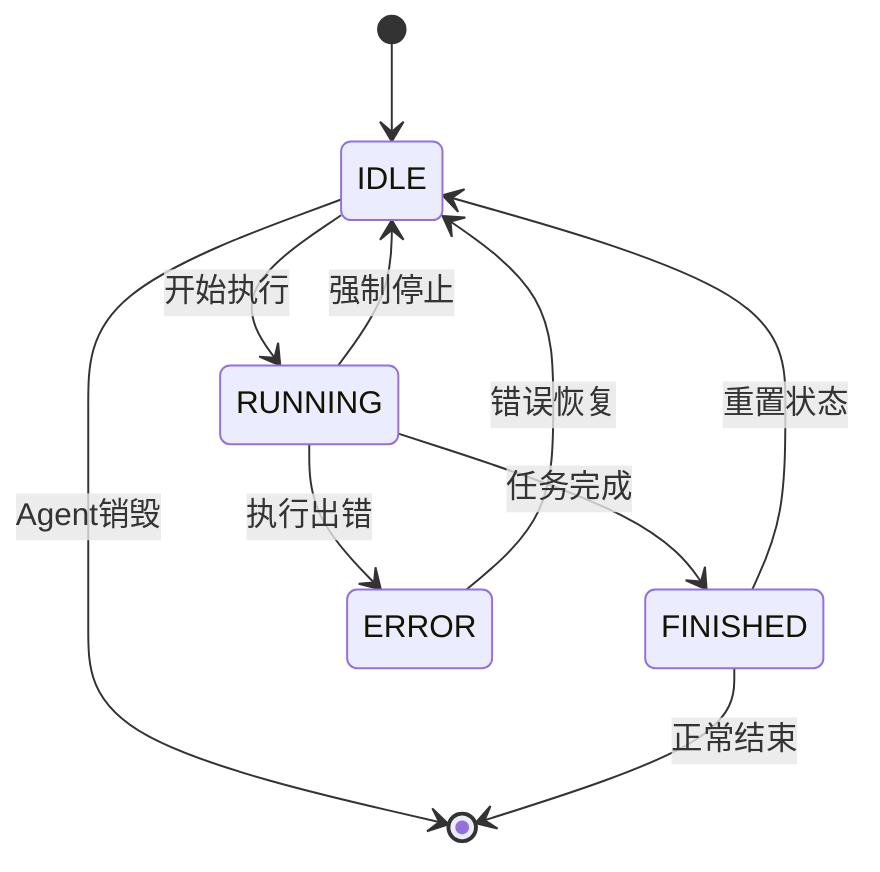

# 2.3章节统一代码示例库

本文件包含2.3章节中所有代码示例的统一定义，避免重复和不一致。各章节通过引用编号来使用这些代码示例。

## 核心类定义

### [CODE-001] TaskState枚举定义

```java
/**
 * 任务执行状态枚举
 * 
 * 设计原则：
 * - 状态完整性：覆盖任务生命周期的所有状态
 * - 状态互斥性：任务在任何时刻只能处于一个状态
 * - 语义明确性：每个状态都有清晰的业务含义
 */
public enum TaskState {
    PLANNED("planned", "已规划", "任务已被分解并加入执行计划"),
    PENDING("pending", "待执行", "任务等待前置依赖完成"),
    RUNNING("running", "执行中", "任务正在被Agent执行"),
    COMPLETED("completed", "已完成", "任务成功执行完毕"),
    FAILED("failed", "执行失败", "任务执行过程中出现错误"),
    SKIPPED("skipped", "已跳过", "由于依赖失败或条件不满足被跳过"),
    CANCELLED("cancelled", "已取消", "任务被用户或系统主动取消");
    
    private final String value;
    private final String displayName;
    private final String description;
    
    TaskState(String value, String displayName, String description) {
        this.value = value;
        this.displayName = displayName;
        this.description = description;
    }
    
    public String getValue() { return value; }
    public String getDisplayName() { return displayName; }
    public String getDescription() { return description; }
}
```

### [CODE-002] AgentState枚举定义

```java
/**
 * AI Agent状态枚举
 * 
 * 设计原则：
 * - 状态互斥性：任何时候只能处于一个状态
 * - 状态完备性：覆盖Agent执行的所有可能状态
 * - 语义清晰性：每个状态都有明确的业务含义
 */
public enum AgentState {
    IDLE("空闲", "Agent等待任务分配"),
    RUNNING("运行", "Agent正在执行任务"),
    FINISHED("完成", "Agent成功完成任务"),
    ERROR("错误", "Agent遇到不可恢复的错误");
    
    private final String displayName;
    private final String description;
    
    AgentState(String displayName, String description) {
        this.displayName = displayName;
        this.description = description;
    }
    
    public String getDisplayName() { return displayName; }
    public String getDescription() { return description; }
}
```

### [CODE-003] BaseAgent基础类

```java
/**
 * Agent基础抽象类
 * 
 * 实现了状态机的核心逻辑，所有具体Agent都继承此类
 */
public abstract class BaseAgent {
    protected AgentState state = AgentState.IDLE;
    protected AgentContext context;
    protected Memory memory;
    protected int currentStep = 0;
    protected int maxSteps = 20;
    
    /**
     * Agent执行的核心方法
     */
    public String run(String query) {
        setState(AgentState.RUNNING);
        
        try {
            while (currentStep < maxSteps && state == AgentState.RUNNING) {
                StepResult result = step(query);
                
                if (result.isFinished()) {
                    setState(AgentState.FINISHED);
                    return result.getOutput();
                }
                
                currentStep++;
            }
            
            if (currentStep >= maxSteps) {
                setState(AgentState.ERROR);
                return "Maximum steps exceeded";
            }
            
            return getOutput();
            
        } catch (Exception e) {
            setState(AgentState.ERROR);
            log.error("Agent execution failed", e);
            return "Execution failed: " + e.getMessage();
        }
    }
    
    /**
     * 抽象方法：具体Agent需要实现的执行步骤
     */
    protected abstract StepResult step(String query);
    
    /**
     * 状态转换方法
     */
    protected synchronized void setState(AgentState newState) {
        if (isValidTransition(this.state, newState)) {
            AgentState oldState = this.state;
            this.state = newState;
            onStateChanged(oldState, newState);
        } else {
            throw new IllegalStateTransitionException(
                String.format("Invalid transition: %s -> %s", this.state, newState));
        }
    }
    
    /**
     * 状态转换验证
     */
    protected boolean isValidTransition(AgentState from, AgentState to) {
        // 实现状态转换规则
        switch (from) {
            case IDLE:
                return to == AgentState.RUNNING || to == AgentState.ERROR;
            case RUNNING:
                return to == AgentState.FINISHED || to == AgentState.ERROR || to == AgentState.IDLE;
            case FINISHED:
                return to == AgentState.IDLE;
            case ERROR:
                return to == AgentState.IDLE;
            default:
                return false;
        }
    }
    
    /**
     * 状态变更回调
     */
    protected void onStateChanged(AgentState from, AgentState to) {
        log.info("Agent state changed: {} -> {}", from, to);
        
        // 更新上下文
        if (context != null) {
            context.updateState(to);
        }
        
        // 通知监听器
        notifyStateListeners(from, to);
    }
    
    // Getter方法
    public AgentState getState() { return state; }
    public AgentContext getContext() { return context; }
    public Memory getMemory() { return memory; }
    public int getCurrentStep() { return currentStep; }
    public int getMaxSteps() { return maxSteps; }
}
```

### [CODE-004] AgentContext上下文类

```java
/**
 * Agent执行上下文
 * 
 * 管理Agent执行过程中的状态数据和配置信息
 */
@Data
@Builder
public class AgentContext {
    private String sessionId;
    private String requestId;
    private AgentState currentState;
    private Map<String, Object> contextData;
    private long lastUpdateTime;
    private int executionCount;
    
    /**
     * 更新状态
     */
    public void updateState(AgentState newState) {
        this.currentState = newState;
        this.lastUpdateTime = System.currentTimeMillis();
    }
    
    /**
     * 创建状态快照
     */
    public StateSnapshot createSnapshot() {
        return StateSnapshot.builder()
            .sessionId(sessionId)
            .requestId(requestId)
            .state(currentState)
            .contextData(new HashMap<>(contextData))
            .timestamp(System.currentTimeMillis())
            .build();
    }
    
    /**
     * 重置执行状态
     */
    public void resetExecutionState() {
        this.currentState = AgentState.IDLE;
        this.executionCount = 0;
        this.lastUpdateTime = System.currentTimeMillis();
    }
}
```

### [CODE-005] Memory内存管理类

```java
/**
 * Agent内存管理
 * 
 * 负责管理Agent的消息历史和状态同步
 */
public class Memory {
    private final List<Message> messages = new ArrayList<>();
    private final Map<String, Object> toolContext = new HashMap<>();
    private volatile boolean dirty = false;
    
    /**
     * 添加消息
     */
    public synchronized void addMessage(Message message) {
        messages.add(message);
        dirty = true;
    }
    
    /**
     * 获取消息列表
     */
    public List<Message> getMessages() {
        return new ArrayList<>(messages);
    }
    
    /**
     * 清理工具上下文
     */
    public synchronized void clearToolContext() {
        toolContext.clear();
        dirty = true;
    }
    
    /**
     * 检查是否需要同步
     */
    public boolean isDirty() {
        return dirty;
    }
    
    /**
     * 标记为已同步
     */
    public void markClean() {
        dirty = false;
    }
}
```

## 具体Agent实现

### [CODE-006] ReActAgent实现

```java
/**
 * ReAct模式Agent实现
 * 
 * 实现Thought-Action-Observation循环
 */
public class ReActAgent extends BaseAgent {
    
    @Override
    protected StepResult step(String query) {
        try {
            // Think阶段
            String thought = generateThought(query);
            memory.addMessage(Message.thought(thought));
            
            // Act阶段
            String action = generateAction(thought);
            memory.addMessage(Message.action(action));
            
            // Observe阶段
            String observation = executeAction(action);
            memory.addMessage(Message.observation(observation));
            
            // 判断是否完成
            if (isTaskComplete(observation)) {
                return StepResult.finished(observation);
            }
            
            return StepResult.continuing(observation);
            
        } catch (Exception e) {
            log.error("ReAct step failed", e);
            return StepResult.error(e.getMessage());
        }
    }
    
    private String generateThought(String query) {
        // 调用LLM生成思考内容
        return llmService.generateThought(query, memory.getMessages());
    }
    
    private String generateAction(String thought) {
        // 基于思考生成行动
        return llmService.generateAction(thought, memory.getMessages());
    }
    
    private String executeAction(String action) {
        // 执行具体行动
        return actionExecutor.execute(action);
    }
    
    private boolean isTaskComplete(String observation) {
        // 判断任务是否完成
        return observation.contains("FINISHED") || observation.contains("COMPLETED");
    }
}
```

### [CODE-007] PlanningAgent实现

```java
/**
 * 规划Agent实现
 * 
 * 负责任务分解和执行计划制定
 */
public class PlanningAgent extends BaseAgent {
    
    @Override
    protected StepResult step(String query) {
        try {
            // 分析任务复杂度
            TaskComplexity complexity = analyzeTaskComplexity(query);
            
            // 生成执行计划
            Plan plan = generatePlan(query, complexity);
            
            // 验证计划可行性
            if (validatePlan(plan)) {
                context.getContextData().put("plan", plan);
                return StepResult.finished(plan.toJson());
            } else {
                // 重新规划
                return StepResult.continuing("Plan validation failed, replanning...");
            }
            
        } catch (Exception e) {
            log.error("Planning step failed", e);
            return StepResult.error(e.getMessage());
        }
    }
    
    private TaskComplexity analyzeTaskComplexity(String query) {
        // 分析任务复杂度
        return taskAnalyzer.analyze(query);
    }
    
    private Plan generatePlan(String query, TaskComplexity complexity) {
        // 生成执行计划
        return planGenerator.generate(query, complexity);
    }
    
    private boolean validatePlan(Plan plan) {
        // 验证计划可行性
        return planValidator.validate(plan);
    }
}
```

## 状态转换图

### [CODE-008] Agent状态转换Mermaid图



## 数据结构定义

### [CODE-009] 通用数据结构

```java
/**
 * 执行步骤结果
 */
@Data
@Builder
public class StepResult {
    private boolean finished;
    private boolean error;
    private String output;
    private String errorMessage;
    
    public static StepResult finished(String output) {
        return StepResult.builder()
            .finished(true)
            .error(false)
            .output(output)
            .build();
    }
    
    public static StepResult continuing(String output) {
        return StepResult.builder()
            .finished(false)
            .error(false)
            .output(output)
            .build();
    }
    
    public static StepResult error(String errorMessage) {
        return StepResult.builder()
            .finished(true)
            .error(true)
            .errorMessage(errorMessage)
            .build();
    }
}

/**
 * 状态快照
 */
@Data
@Builder
public class StateSnapshot {
    private String sessionId;
    private String requestId;
    private AgentState state;
    private Map<String, Object> contextData;
    private long timestamp;
}

/**
 * 消息类型
 */
@Data
@Builder
public class Message {
    private MessageType type;
    private String content;
    private long timestamp;
    
    public static Message thought(String content) {
        return Message.builder()
            .type(MessageType.THOUGHT)
            .content(content)
            .timestamp(System.currentTimeMillis())
            .build();
    }
    
    public static Message action(String content) {
        return Message.builder()
            .type(MessageType.ACTION)
            .content(content)
            .timestamp(System.currentTimeMillis())
            .build();
    }
    
    public static Message observation(String content) {
        return Message.builder()
            .type(MessageType.OBSERVATION)
            .content(content)
            .timestamp(System.currentTimeMillis())
            .build();
    }
}

public enum MessageType {
    THOUGHT, ACTION, OBSERVATION, SYSTEM, USER
}
```

## 使用说明

各章节在引用代码时，请使用以下格式：

```markdown
参考代码示例：[CODE-001] AgentState枚举定义

具体实现细节请参考：[CODE-002] BaseAgent基础类的`run`方法
```

这样可以确保：
1. 代码的一致性和准确性
2. 便于维护和更新
3. 避免重复定义
4. 提供统一的代码风格
