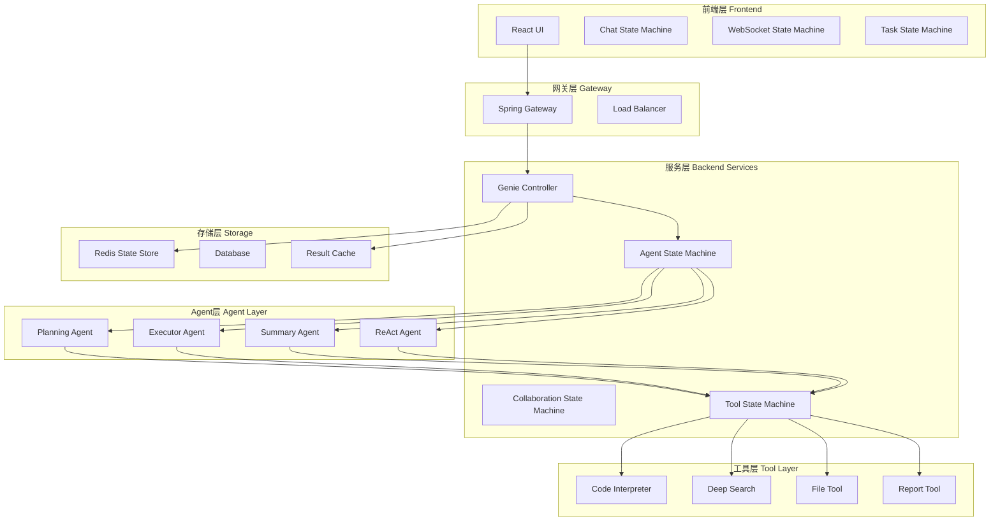

# 2.3.9 案例分析：企业级Agentic AI应用状态机架构实践

## 学习目标

- 通过JoyAgent-JDGenie项目深入理解状态机的工程化实践
- 学会分析复杂AI应用中的状态机设计模式
- 掌握从业务需求到状态机实现的完整设计流程
- 理解大规模AI应用中状态机架构的可扩展性设计

## 引言

JoyAgent-JDGenie是一个企业级Agentic AI应用平台，集成了多Agent协作、工具调用、实时交互等复杂功能。通过分析该项目的状态机架构设计，我们可以深入理解状态机在真实企业环境中的应用模式和最佳实践。

本节将从架构全貌、关键场景、实现细节和性能优化四个维度，全面剖析企业级Agentic AI应用的状态机设计。

## 1. 项目架构全貌分析

### 1.1 整体架构设计



### 1.2 状态机层次结构

在JoyAgent-JDGenie项目中，状态机按照以下层次结构组织：

```java
/**
 * 状态机层次结构
 */
public class StateMachineHierarchy {
    
    // Level 1: 应用级状态机
    public enum ApplicationState {
        INITIALIZING,    // 应用初始化
        READY,          // 准备就绪
        PROCESSING,     // 处理请求中
        MAINTAINING,    // 维护状态
        SHUTDOWN        // 关闭中
    }
    
    // Level 2: 会话级状态机
    public enum SessionState {
        CREATED,        // 会话已创建
        ACTIVE,         // 会话活跃
        IDLE,           // 会话空闲
        SUSPENDED,      // 会话暂停
        EXPIRED         // 会话过期
    }
    
    // Level 3: 请求级状态机
    public enum RequestState {
        RECEIVED,       // 请求已接收
        VALIDATED,      // 请求已验证
        PROCESSING,     // 请求处理中
        COMPLETED,      // 请求已完成
        FAILED          // 请求失败
    }
    
    // Level 4: Agent级状态机
    // (已在前面章节详细讲解)
    
    // Level 5: 工具级状态机
    // (已在前面章节详细讲解)
}
```

### 1.3 状态机交互模式

```java
/**
 * 状态机交互协调器
 */
@Component
public class StateMachineCoordinator {
    
    /**
     * 状态机交互事件
     */
    @Data
    @Builder
    public static class StateMachineEvent {
        private String eventId;
        private String sourceStateMachine;
        private String targetStateMachine;
        private String eventType;
        private Map<String, Object> eventData;
        private long timestamp;
        private int priority;
    }
    
    private final Map<String, StateMachine> stateMachines = new ConcurrentHashMap<>();
    private final BlockingQueue<StateMachineEvent> eventQueue = new PriorityBlockingQueue<>();
    private final ExecutorService eventProcessor = Executors.newFixedThreadPool(3);
    
    /**
     * 注册状态机
     */
    public void registerStateMachine(String id, StateMachine stateMachine) {
        stateMachines.put(id, stateMachine);
        log.info("Registered state machine: {}", id);
    }
    
    /**
     * 发送状态机事件
     */
    public void sendEvent(String targetId, String eventType, Map<String, Object> data) {
        StateMachineEvent event = StateMachineEvent.builder()
            .eventId(UUID.randomUUID().toString())
            .sourceStateMachine(getCurrentStateMachineId())
            .targetStateMachine(targetId)
            .eventType(eventType)
            .eventData(data)
            .timestamp(System.currentTimeMillis())
            .priority(getEventPriority(eventType))
            .build();
        
        eventQueue.offer(event);
    }
    
    /**
     * 处理状态机事件
     */
    @PostConstruct
    public void startEventProcessing() {
        for (int i = 0; i < 3; i++) {
            eventProcessor.submit(() -> {
                while (!Thread.currentThread().isInterrupted()) {
                    try {
                        StateMachineEvent event = eventQueue.take();
                        processEvent(event);
                    } catch (InterruptedException e) {
                        Thread.currentThread().interrupt();
                        break;
                    } catch (Exception e) {
                        log.error("Error processing state machine event", e);
                    }
                }
            });
        }
    }
    
    private void processEvent(StateMachineEvent event) {
        StateMachine targetMachine = stateMachines.get(event.getTargetStateMachine());
        if (targetMachine != null) {
            targetMachine.handleEvent(event.getEventType(), event.getEventData());
        }
    }
}
```

## 2. 关键场景状态机设计

### 2.1 用户查询处理流程

以用户提交一个复杂查询为例，分析整个处理流程中的状态机协作：

```java
/**
 * 查询处理流程状态机
 */
@Component
public class QueryProcessingStateMachine {
    
    public enum QueryProcessingState {
        QUERY_RECEIVED,        // 查询已接收
        QUERY_ANALYZING,       // 查询分析中
        AGENT_SELECTING,       // Agent选择中
        TASK_PLANNING,         // 任务规划中
        TASK_EXECUTING,        // 任务执行中
        RESULT_INTEGRATING,    // 结果整合中
        RESPONSE_GENERATING,   // 响应生成中
        QUERY_COMPLETED        // 查询完成
    }
    
    @Autowired
    private AgentHandlerFactory agentHandlerFactory;
    
    @Autowired
    private StateMachineCoordinator coordinator;
    
    /**
     * 处理用户查询的完整流程
     */
    public CompletableFuture<String> processQuery(AgentRequest request) {
        String requestId = request.getRequestId();
        QueryProcessingContext context = createProcessingContext(request);
        
        return CompletableFuture.supplyAsync(() -> {
            try {
                // 1. 查询分析阶段
                context.setState(QueryProcessingState.QUERY_ANALYZING);
                QueryAnalysisResult analysis = analyzeQuery(request);
                coordinator.sendEvent("chat_frontend", "query_analysis_complete", 
                    Map.of("analysis", analysis));
                
                // 2. Agent选择阶段
                context.setState(QueryProcessingState.AGENT_SELECTING);
                AgentType selectedAgentType = selectOptimalAgent(analysis);
                coordinator.sendEvent("chat_frontend", "agent_selected", 
                    Map.of("agentType", selectedAgentType));
                
                // 3. 获取对应的处理器
                AgentHandlerService handler = agentHandlerFactory.getHandler(selectedAgentType);
                
                // 4. 执行处理流程
                context.setState(QueryProcessingState.TASK_EXECUTING);
                String result = handler.handle(context.getAgentContext(), request);
                
                // 5. 完成处理
                context.setState(QueryProcessingState.QUERY_COMPLETED);
                coordinator.sendEvent("chat_frontend", "query_completed", 
                    Map.of("result", result));
                
                return result;
                
            } catch (Exception e) {
                log.error("Query processing failed for request: " + requestId, e);
                coordinator.sendEvent("chat_frontend", "query_failed", 
                    Map.of("error", e.getMessage()));
                throw e;
            }
        });
    }
    
    /**
     * 查询分析 - 理解用户意图和任务复杂度
     */
    private QueryAnalysisResult analyzeQuery(AgentRequest request) {
        String query = request.getQuery();
        
        QueryAnalysisResult analysis = QueryAnalysisResult.builder()
            .originalQuery(query)
            .complexity(calculateQueryComplexity(query))
            .requiredCapabilities(extractRequiredCapabilities(query))
            .estimatedSteps(estimateRequiredSteps(query))
            .build();
        
        log.info("Query analysis completed: complexity={}, capabilities={}, steps={}", 
            analysis.getComplexity(), analysis.getRequiredCapabilities(), 
            analysis.getEstimatedSteps());
        
        return analysis;
    }
    
    /**
     * Agent选择 - 根据查询特征选择最适合的Agent
     */
    private AgentType selectOptimalAgent(QueryAnalysisResult analysis) {
        Set<String> capabilities = analysis.getRequiredCapabilities();
        int complexity = analysis.getComplexity();
        
        // 多步骤复杂任务 -> Plan-Solve模式
        if (complexity >= 7 || capabilities.size() >= 3) {
            return AgentType.PLAN_SOLVE;
        }
        
        // 需要推理和工具调用 -> ReAct模式  
        if (capabilities.contains("reasoning") && capabilities.contains("tool_use")) {
            return AgentType.REACT;
        }
        
        // 工作流式任务 -> Workflow模式
        if (capabilities.contains("workflow")) {
            return AgentType.WORKFLOW;
        }
        
        // 默认使用综合模式
        return AgentType.COMPREHENSIVE;
    }
}
```

### 2.2 Plan-Solve模式状态机实现

```java
/**
 * Plan-Solve模式的具体实现分析
 */
@Component
public class PlanSolveImplementation {
    
    /**
     * Plan-Solve执行状态跟踪
     */
    @Data
    @Builder
    public static class PlanSolveContext {
        private String executionId;
        private PlanSolveState currentState;
        private PlanningAgent planningAgent;
        private ExecutorAgent executorAgent;
        private SummaryAgent summaryAgent;
        
        // 执行数据
        private String planningResult;
        private List<String> executionResults;
        private String finalSummary;
        
        // 状态跟踪
        private long startTime;
        private Map<String, Long> phaseStartTimes;
        private Map<String, Long> phaseEndTimes;
    }
    
    public enum PlanSolveState {
        INITIALIZING,      // 初始化各个Agent
        PLANNING,          // 规划阶段
        PLANNING_REVIEW,   // 规划结果审核
        EXECUTING,         // 执行阶段  
        EXECUTION_MONITOR, // 执行监控
        SUMMARIZING,       // 总结阶段
        COMPLETED,         // 执行完成
        FAILED            // 执行失败
    }
    
    /**
     * 执行Plan-Solve流程
     */
    public String executePlanSolve(AgentContext agentContext, AgentRequest request) {
        PlanSolveContext context = createPlanSolveContext(agentContext, request);
        
        try {
            // Phase 1: 规划阶段
            executePhase(context, PlanSolveState.PLANNING, () -> {
                context.setPlanningResult(context.getPlanningAgent().run(request.getQuery()));
                return context.getPlanningResult();
            });
            
            // Phase 2: 执行阶段
            executePhase(context, PlanSolveState.EXECUTING, () -> {
                return executeTasksWithAgent(context, request);
            });
            
            // Phase 3: 总结阶段
            executePhase(context, PlanSolveState.SUMMARIZING, () -> {
                String summaryPrompt = buildSummaryPrompt(context, request);
                context.setFinalSummary(context.getSummaryAgent().run(summaryPrompt));
                return context.getFinalSummary();
            });
            
            context.setCurrentState(PlanSolveState.COMPLETED);
            return context.getFinalSummary();
            
        } catch (Exception e) {
            context.setCurrentState(PlanSolveState.FAILED);
            log.error("Plan-Solve execution failed", e);
            throw e;
        }
    }
    
    /**
     * 通用阶段执行方法
     */
    private String executePhase(PlanSolveContext context, PlanSolveState state, 
                               Supplier<String> phaseLogic) {
        String phaseName = state.name().toLowerCase();
        context.setCurrentState(state);
        context.getPhaseStartTimes().put(phaseName, System.currentTimeMillis());
        
        // 发送状态更新
        sendPhaseStartNotification(context, state);
        
        try {
            String result = phaseLogic.get();
            
            context.getPhaseEndTimes().put(phaseName, System.currentTimeMillis());
            sendPhaseCompleteNotification(context, state, result);
            
            return result;
            
        } catch (Exception e) {
            sendPhaseErrorNotification(context, state, e.getMessage());
            throw e;
        }
    }
    
    /**
     * 任务执行监控 - 复杂的多步骤执行管理
     */
    private String executeTasksWithAgent(PlanSolveContext context, AgentRequest request) {
        String planningResult = context.getPlanningResult();
        List<String> tasks = parsePlanningResult(planningResult);
        List<String> executionResults = new ArrayList<>();
        
        int stepIdx = 0;
        int maxSteps = getConfiguredMaxSteps();
        
        while (stepIdx < maxSteps && !tasks.isEmpty()) {
            // 更新执行状态
            context.setCurrentState(PlanSolveState.EXECUTION_MONITOR);
            
            // 发送执行进度
            sendExecutionProgressNotification(context, stepIdx + 1, maxSteps);
            
            try {
                String currentTask = buildExecutionTask(tasks);
                
                // 执行任务
                String taskResult = context.getExecutorAgent().run(currentTask);
                executionResults.add(taskResult);
                
                // 检查是否需要继续
                if (context.getExecutorAgent().getState() == AgentState.FINISHED) {
                    break;
                }
                
                // 更新任务列表（移除已完成的任务）
                updateTaskList(tasks, taskResult);
                
            } catch (Exception e) {
                log.error("Task execution failed at step {}: {}", stepIdx + 1, e.getMessage());
                executionResults.add("Task failed: " + e.getMessage());
                break;
            }
            
            stepIdx++;
        }
        
        context.setExecutionResults(executionResults);
        return String.join("\n\n", executionResults);
    }
    
    /**
     * 发送阶段通知
     */
    private void sendPhaseStartNotification(PlanSolveContext context, PlanSolveState state) {
        Map<String, Object> notification = new HashMap<>();
        notification.put("executionId", context.getExecutionId());
        notification.put("phase", state.name());
        notification.put("status", "started");
        notification.put("timestamp", System.currentTimeMillis());
        
        coordinator.sendEvent("chat_frontend", "phase_update", notification);
    }
    
    private void sendExecutionProgressNotification(PlanSolveContext context, 
                                                 int currentStep, int totalSteps) {
        Map<String, Object> progress = new HashMap<>();
        progress.put("executionId", context.getExecutionId());
        progress.put("currentStep", currentStep);
        progress.put("totalSteps", totalSteps);
        progress.put("progress", (double) currentStep / totalSteps * 100);
        progress.put("timestamp", System.currentTimeMillis());
        
        coordinator.sendEvent("chat_frontend", "execution_progress", progress);
    }
}
```

### 2.3 工具调用状态机实际应用

```java
/**
 * 代码解释器工具调用的真实场景分析
 */
@Component
public class CodeInterpreterIntegration {
    
    /**
     * 代码解释器执行上下文
     */
    @Data
    @Builder
    public static class CodeInterpreterContext {
        private String taskId;
        private String code;
        private List<String> fileNames;
        private String outputDirectory;
        private CodeInterpreterState state;
        private StringBuilder outputBuffer;
        private List<String> generatedFiles;
        private String finalResult;
    }
    
    public enum CodeInterpreterState {
        PREPARING,         // 准备执行环境
        PARSING_CODE,      // 解析代码
        EXECUTING,         // 执行代码
        MONITORING,        // 监控执行
        COLLECTING_OUTPUT, // 收集输出
        GENERATING_FILES,  // 生成文件
        COMPLETED,         // 执行完成
        ERROR             // 执行出错
    }
    
    /**
     * 执行代码解释器任务
     */
    public CompletableFuture<ToolResult> executeCodeInterpreter(ToolCall toolCall) {
        CodeInterpreterContext context = createCodeInterpreterContext(toolCall);
        
        return CompletableFuture.supplyAsync(() -> {
            try {
                // 准备阶段
                executeCodeInterpreterPhase(context, CodeInterpreterState.PREPARING, 
                    () -> prepareExecutionEnvironment(context));
                
                // 解析代码阶段
                executeCodeInterpreterPhase(context, CodeInterpreterState.PARSING_CODE, 
                    () -> parseAndValidateCode(context));
                
                // 执行代码阶段
                executeCodeInterpreterPhase(context, CodeInterpreterState.EXECUTING, 
                    () -> executeCodeWithMonitoring(context));
                
                // 收集结果阶段
                executeCodeInterpreterPhase(context, CodeInterpreterState.COLLECTING_OUTPUT, 
                    () -> collectExecutionResults(context));
                
                // 生成文件阶段
                executeCodeInterpreterPhase(context, CodeInterpreterState.GENERATING_FILES, 
                    () -> generateOutputFiles(context));
                
                context.setState(CodeInterpreterState.COMPLETED);
                
                return ToolResult.success(toolCall.getId(), context.getFinalResult());
                
            } catch (Exception e) {
                context.setState(CodeInterpreterState.ERROR);
                log.error("Code interpreter execution failed", e);
                return ToolResult.failure(toolCall.getId(), e.getMessage());
            }
        });
    }
    
    /**
     * 代码执行监控 - 实时状态更新
     */
    private void executeCodeWithMonitoring(CodeInterpreterContext context) {
        context.setState(CodeInterpreterState.MONITORING);
        
        // 构建Python执行请求
        CodeInterpreterRequest request = CodeInterpreterRequest.builder()
            .task(context.getCode())
            .fileNames(context.getFileNames())
            .outputDir(context.getOutputDirectory())
            .build();
        
        // 调用Python服务的流式接口
        try (CloseableHttpResponse response = sendStreamingRequest(request)) {
            processStreamingCodeExecution(context, response);
        } catch (Exception e) {
            throw new RuntimeException("Code execution monitoring failed", e);
        }
    }
    
    /**
     * 处理流式代码执行
     */
    private void processStreamingCodeExecution(CodeInterpreterContext context, 
                                             CloseableHttpResponse response) throws IOException {
        try (BufferedReader reader = new BufferedReader(
                new InputStreamReader(response.getEntity().getContent()))) {
            
            String line;
            while ((line = reader.readLine()) != null) {
                try {
                    Map<String, Object> chunk = objectMapper.readValue(line, Map.class);
                    processCodeExecutionChunk(context, chunk);
                } catch (JsonProcessingException e) {
                    log.warn("Failed to parse code execution chunk: {}", line);
                }
            }
        }
    }
    
    /**
     * 处理代码执行块
     */
    private void processCodeExecutionChunk(CodeInterpreterContext context, 
                                          Map<String, Object> chunk) {
        String chunkType = (String) chunk.get("type");
        
        switch (chunkType) {
            case "stdout":
                String output = (String) chunk.get("content");
                context.getOutputBuffer().append(output).append("\n");
                
                // 发送实时输出到前端
                sendCodeOutputNotification(context, output);
                break;
                
            case "code_execution_start":
                Integer blockIndex = (Integer) chunk.get("block_index");
                sendCodeExecutionStartNotification(context, blockIndex);
                break;
                
            case "code_execution_complete":
                Integer completedBlockIndex = (Integer) chunk.get("block_index");
                sendCodeExecutionCompleteNotification(context, completedBlockIndex);
                break;
                
            case "final_result":
                String result = (String) chunk.get("result");
                context.setFinalResult(result);
                break;
                
            case "error":
                String error = (String) chunk.get("message");
                throw new RuntimeException("Code execution error: " + error);
                
            default:
                log.debug("Unknown chunk type: {}", chunkType);
        }
    }
    
    /**
     * 发送代码输出通知
     */
    private void sendCodeOutputNotification(CodeInterpreterContext context, String output) {
        Map<String, Object> notification = new HashMap<>();
        notification.put("taskId", context.getTaskId());
        notification.put("messageType", "code_output");
        notification.put("content", output);
        notification.put("timestamp", System.currentTimeMillis());
        
        coordinator.sendEvent("chat_frontend", "tool_output", notification);
    }
}
```

## 3. 状态持久化与恢复实践

### 3.1 Redis状态存储设计

```java
/**
 * 企业级状态存储实现
 */
@Component
public class EnterpriseStateStore {
    
    @Autowired
    private RedisTemplate<String, Object> redisTemplate;
    
    private final String STATE_KEY_PREFIX = "joyagent:state:";
    private final String STATE_HISTORY_PREFIX = "joyagent:history:";
    private final String STATE_LOCK_PREFIX = "joyagent:lock:";
    
    /**
     * 状态存储条目
     */
    @Data
    @Builder
    public static class StateEntry {
        private String key;
        private Object state;
        private String stateType;
        private long version;
        private long timestamp;
        private String nodeId;
        private Map<String, Object> metadata;
        
        // 持久化配置
        private Duration ttl;
        private boolean persistent;
        private int replicationFactor;
    }
    
    /**
     * 保存状态（带版本控制和冲突检测）
     */
    public boolean saveState(String key, Object state, StateStorageOptions options) {
        String fullKey = STATE_KEY_PREFIX + key;
        String lockKey = STATE_LOCK_PREFIX + key;
        
        // 获取分布式锁
        try (DistributedLock lock = acquireLock(lockKey)) {
            if (!lock.isAcquired()) {
                log.warn("Failed to acquire lock for state key: {}", key);
                return false;
            }
            
            // 检查版本冲突
            StateEntry existingEntry = getStateEntry(key);
            if (existingEntry != null && options.getExpectedVersion() != null) {
                if (!existingEntry.getVersion().equals(options.getExpectedVersion())) {
                    throw new OptimisticLockingException(
                        "Version conflict for key: " + key + 
                        ", expected: " + options.getExpectedVersion() + 
                        ", actual: " + existingEntry.getVersion());
                }
            }
            
            // 构建新的状态条目
            StateEntry newEntry = StateEntry.builder()
                .key(key)
                .state(state)
                .stateType(state.getClass().getSimpleName())
                .version(existingEntry != null ? existingEntry.getVersion() + 1 : 1)
                .timestamp(System.currentTimeMillis())
                .nodeId(getCurrentNodeId())
                .metadata(options.getMetadata())
                .ttl(options.getTtl())
                .persistent(options.isPersistent())
                .build();
            
            // 保存到Redis
            if (options.getTtl() != null) {
                redisTemplate.opsForValue().set(fullKey, newEntry, options.getTtl());
            } else {
                redisTemplate.opsForValue().set(fullKey, newEntry);
            }
            
            // 保存到历史记录
            if (options.isKeepHistory()) {
                saveStateHistory(key, newEntry);
            }
            
            // 发送状态变更事件
            publishStateChangeEvent(key, existingEntry, newEntry);
            
            return true;
            
        } catch (Exception e) {
            log.error("Failed to save state for key: " + key, e);
            return false;
        }
    }
    
    /**
     * 加载状态（带缓存和降级机制）
     */
    public <T> Optional<T> loadState(String key, Class<T> stateClass, 
                                   StateLoadOptions options) {
        String fullKey = STATE_KEY_PREFIX + key;
        
        try {
            // 尝试从Redis加载
            StateEntry entry = (StateEntry) redisTemplate.opsForValue().get(fullKey);
            
            if (entry != null) {
                T state = objectMapper.convertValue(entry.getState(), stateClass);
                
                // 检查状态有效性
                if (options.isValidateState() && !validateState(state)) {
                    log.warn("Invalid state detected for key: {}", key);
                    return Optional.empty();
                }
                
                return Optional.of(state);
            }
            
            // 尝试从历史记录恢复
            if (options.isAllowHistoryFallback()) {
                return loadFromHistory(key, stateClass, options);
            }
            
            return Optional.empty();
            
        } catch (Exception e) {
            log.error("Failed to load state for key: " + key, e);
            
            // 降级机制：从本地缓存加载
            if (options.isAllowLocalFallback()) {
                return loadFromLocalCache(key, stateClass);
            }
            
            return Optional.empty();
        }
    }
    
    /**
     * 状态恢复机制
     */
    public boolean recoverState(String key, StateRecoveryOptions options) {
        log.info("Starting state recovery for key: {}", key);
        
        try {
            // Step 1: 尝试从多个数据源恢复
            StateEntry recoveredEntry = tryRecoverFromMultipleSources(key, options);
            
            if (recoveredEntry == null) {
                log.warn("No recoverable state found for key: {}", key);
                return false;
            }
            
            // Step 2: 验证恢复的状态
            if (!validateRecoveredState(recoveredEntry)) {
                log.warn("Recovered state is invalid for key: {}", key);
                return false;
            }
            
            // Step 3: 重新保存状态
            String fullKey = STATE_KEY_PREFIX + key;
            redisTemplate.opsForValue().set(fullKey, recoveredEntry);
            
            // Step 4: 发送恢复完成事件
            publishStateRecoveryEvent(key, recoveredEntry);
            
            log.info("State recovery completed for key: {}", key);
            return true;
            
        } catch (Exception e) {
            log.error("State recovery failed for key: " + key, e);
            return false;
        }
    }
    
    /**
     * 从多个数据源尝试恢复
     */
    private StateEntry tryRecoverFromMultipleSources(String key, 
                                                   StateRecoveryOptions options) {
        // 恢复优先级：Redis -> 历史记录 -> 本地缓存 -> 远程备份
        
        // 1. 尝试从其他Redis节点恢复
        StateEntry redisEntry = tryRecoverFromRedis(key);
        if (redisEntry != null) {
            log.info("Recovered state from Redis for key: {}", key);
            return redisEntry;
        }
        
        // 2. 尝试从历史记录恢复
        StateEntry historyEntry = tryRecoverFromHistory(key, options);
        if (historyEntry != null) {
            log.info("Recovered state from history for key: {}", key);
            return historyEntry;
        }
        
        // 3. 尝试从本地缓存恢复
        StateEntry cacheEntry = tryRecoverFromLocalCache(key);
        if (cacheEntry != null) {
            log.info("Recovered state from local cache for key: {}", key);
            return cacheEntry;
        }
        
        // 4. 尝试从远程备份恢复
        if (options.isAllowRemoteBackupRecovery()) {
            StateEntry backupEntry = tryRecoverFromRemoteBackup(key);
            if (backupEntry != null) {
                log.info("Recovered state from remote backup for key: {}", key);
                return backupEntry;
            }
        }
        
        return null;
    }
}
```

### 3.2 状态一致性保证

```java
/**
 * 分布式状态一致性管理器
 */
@Component
public class StateConsistencyManager {
    
    /**
     * 状态一致性检查结果
     */
    @Data
    @Builder
    public static class ConsistencyCheckResult {
        private String checkId;
        private boolean isConsistent;
        private List<StateInconsistency> inconsistencies;
        private Map<String, Integer> nodeVotes;
        private String recommendedAction;
        private long checkTimestamp;
    }
    
    /**
     * 状态不一致性描述
     */
    @Data
    @Builder
    public static class StateInconsistency {
        private String stateKey;
        private InconsistencyType type;
        private Map<String, Object> nodeStates;
        private long detectedTime;
        private SeverityLevel severity;
    }
    
    public enum InconsistencyType {
        VALUE_MISMATCH,     // 值不匹配
        VERSION_CONFLICT,   // 版本冲突
        MISSING_STATE,      // 状态缺失
        STALE_STATE,        // 状态过期
        CORRUPTION        // 状态损坏
    }
    
    /**
     * 全局一致性检查
     */
    @Scheduled(fixedRate = 60000) // 每分钟检查一次
    public void performGlobalConsistencyCheck() {
        log.debug("Starting global consistency check");
        
        try {
            // 获取所有需要检查的状态键
            Set<String> criticalStateKeys = getCriticalStateKeys();
            
            // 并行检查各个状态的一致性
            List<CompletableFuture<ConsistencyCheckResult>> checkFutures = 
                criticalStateKeys.stream()
                    .map(this::checkStateConsistency)
                    .collect(Collectors.toList());
            
            // 等待所有检查完成
            CompletableFuture.allOf(checkFutures.toArray(new CompletableFuture[0]))
                .thenAccept(v -> {
                    List<ConsistencyCheckResult> results = checkFutures.stream()
                        .map(CompletableFuture::join)
                        .collect(Collectors.toList());
                    
                    processConsistencyCheckResults(results);
                })
                .exceptionally(throwable -> {
                    log.error("Global consistency check failed", throwable);
                    return null;
                });
                
        } catch (Exception e) {
            log.error("Error during global consistency check", e);
        }
    }
    
    /**
     * 检查单个状态的一致性
     */
    public CompletableFuture<ConsistencyCheckResult> checkStateConsistency(String stateKey) {
        return CompletableFuture.supplyAsync(() -> {
            String checkId = UUID.randomUUID().toString();
            
            try {
                // 从所有节点收集状态
                Map<String, StateEntry> nodeStates = collectStateFromAllNodes(stateKey);
                
                // 分析状态一致性
                List<StateInconsistency> inconsistencies = analyzeStateConsistency(stateKey, nodeStates);
                
                // 计算节点投票
                Map<String, Integer> votes = calculateNodeVotes(nodeStates);
                
                // 确定推荐动作
                String recommendedAction = determineRecommendedAction(inconsistencies, votes);
                
                return ConsistencyCheckResult.builder()
                    .checkId(checkId)
                    .isConsistent(inconsistencies.isEmpty())
                    .inconsistencies(inconsistencies)
                    .nodeVotes(votes)
                    .recommendedAction(recommendedAction)
                    .checkTimestamp(System.currentTimeMillis())
                    .build();
                
            } catch (Exception e) {
                log.error("Consistency check failed for key: " + stateKey, e);
                
                return ConsistencyCheckResult.builder()
                    .checkId(checkId)
                    .isConsistent(false)
                    .inconsistencies(List.of(StateInconsistency.builder()
                        .stateKey(stateKey)
                        .type(InconsistencyType.CORRUPTION)
                        .detectedTime(System.currentTimeMillis())
                        .severity(SeverityLevel.HIGH)
                        .build()))
                    .recommendedAction("MANUAL_INTERVENTION")
                    .checkTimestamp(System.currentTimeMillis())
                    .build();
            }
        });
    }
    
    /**
     * 自动修复状态不一致性
     */
    public boolean repairStateInconsistency(StateInconsistency inconsistency) {
        String stateKey = inconsistency.getStateKey();
        InconsistencyType type = inconsistency.getType();
        
        log.info("Attempting to repair state inconsistency: key={}, type={}", stateKey, type);
        
        try {
            switch (type) {
                case VALUE_MISMATCH:
                    return repairValueMismatch(stateKey, inconsistency);
                    
                case VERSION_CONFLICT:
                    return repairVersionConflict(stateKey, inconsistency);
                    
                case MISSING_STATE:
                    return repairMissingState(stateKey, inconsistency);
                    
                case STALE_STATE:
                    return repairStaleState(stateKey, inconsistency);
                    
                case CORRUPTION:
                    return repairCorruptedState(stateKey, inconsistency);
                    
                default:
                    log.warn("Unknown inconsistency type: {}", type);
                    return false;
            }
            
        } catch (Exception e) {
            log.error("Failed to repair state inconsistency", e);
            return false;
        }
    }
    
    /**
     * 修复值不匹配
     */
    private boolean repairValueMismatch(String stateKey, StateInconsistency inconsistency) {
        Map<String, Object> nodeStates = inconsistency.getNodeStates();
        
        // 使用多数投票算法确定正确值
        Object correctValue = determineCorrectValueByVoting(nodeStates);
        
        if (correctValue != null) {
            // 将正确值同步到所有节点
            return synchronizeValueToAllNodes(stateKey, correctValue);
        }
        
        return false;
    }
}
```

## 4. 性能优化实践

### 4.1 状态机性能监控

```java
/**
 * 状态机性能监控系统
 */
@Component
public class StateMachinePerformanceMonitor {
    
    private final MeterRegistry meterRegistry;
    private final Map<String, StateMachineMetrics> metricsRegistry = new ConcurrentHashMap<>();
    
    /**
     * 状态机性能指标
     */
    @Data
    @Builder
    public static class StateMachineMetrics {
        private String stateMachineId;
        private Timer transitionTimer;
        private Counter transitionCounter;
        private Counter errorCounter;
        private Gauge activeStatesGauge;
        private DistributionSummary stateDurationSummary;
        
        // 性能统计
        private long totalTransitions;
        private long totalErrors;
        private double averageTransitionTime;
        private double maxTransitionTime;
        private Map<String, Long> stateDistribution;
        private Map<String, Double> stateAverageDuration;
    }
    
    /**
     * 注册状态机监控
     */
    public void registerStateMachine(String stateMachineId, Set<String> states) {
        StateMachineMetrics metrics = StateMachineMetrics.builder()
            .stateMachineId(stateMachineId)
            .transitionTimer(Timer.builder("state_machine.transition.duration")
                .tag("machine_id", stateMachineId)
                .register(meterRegistry))
            .transitionCounter(Counter.builder("state_machine.transition.count")
                .tag("machine_id", stateMachineId)
                .register(meterRegistry))
            .errorCounter(Counter.builder("state_machine.error.count")
                .tag("machine_id", stateMachineId)
                .register(meterRegistry))
            .activeStatesGauge(Gauge.builder("state_machine.active_states")
                .tag("machine_id", stateMachineId)
                .register(meterRegistry, this, monitor -> getCurrentActiveStates(stateMachineId)))
            .stateDurationSummary(DistributionSummary.builder("state_machine.state.duration")
                .tag("machine_id", stateMachineId)
                .register(meterRegistry))
            .stateDistribution(new ConcurrentHashMap<>())
            .stateAverageDuration(new ConcurrentHashMap<>())
            .build();
        
        // 为每个状态创建专门的计数器
        for (String state : states) {
            Counter.builder("state_machine.state.count")
                .tag("machine_id", stateMachineId)
                .tag("state", state)
                .register(meterRegistry);
        }
        
        metricsRegistry.put(stateMachineId, metrics);
        log.info("Registered performance monitoring for state machine: {}", stateMachineId);
    }
    
    /**
     * 记录状态转换
     */
    public void recordStateTransition(String stateMachineId, String fromState, 
                                    String toState, long durationMs) {
        StateMachineMetrics metrics = metricsRegistry.get(stateMachineId);
        if (metrics != null) {
            // 记录基础指标
            metrics.getTransitionTimer().record(durationMs, TimeUnit.MILLISECONDS);
            metrics.getTransitionCounter().increment();
            
            // 记录状态分布
            metrics.getStateDistribution().merge(toState, 1L, Long::sum);
            
            // 记录状态持续时间
            if (fromState != null) {
                metrics.getStateDurationSummary().record(durationMs);
                updateStateAverageDuration(metrics, fromState, durationMs);
            }
            
            // 更新总体统计
            metrics.setTotalTransitions(metrics.getTotalTransitions() + 1);
            updateAverageTransitionTime(metrics, durationMs);
            updateMaxTransitionTime(metrics, durationMs);
            
            // 记录特定状态的指标
            meterRegistry.counter("state_machine.state.count", 
                "machine_id", stateMachineId, 
                "state", toState).increment();
        }
    }
    
    /**
     * 记录状态机错误
     */
    public void recordError(String stateMachineId, String errorType, String errorMessage) {
        StateMachineMetrics metrics = metricsRegistry.get(stateMachineId);
        if (metrics != null) {
            metrics.getErrorCounter().increment();
            metrics.setTotalErrors(metrics.getTotalErrors() + 1);
            
            // 记录错误类型分布
            meterRegistry.counter("state_machine.error.type", 
                "machine_id", stateMachineId, 
                "error_type", errorType).increment();
        }
        
        log.warn("State machine error recorded: machine={}, type={}, message={}", 
            stateMachineId, errorType, errorMessage);
    }
    
    /**
     * 获取性能报告
     */
    public StateMachinePerformanceReport getPerformanceReport(String stateMachineId) {
        StateMachineMetrics metrics = metricsRegistry.get(stateMachineId);
        if (metrics == null) {
            return null;
        }
        
        return StateMachinePerformanceReport.builder()
            .stateMachineId(stateMachineId)
            .reportTime(System.currentTimeMillis())
            .totalTransitions(metrics.getTotalTransitions())
            .totalErrors(metrics.getTotalErrors())
            .errorRate(calculateErrorRate(metrics))
            .averageTransitionTime(metrics.getAverageTransitionTime())
            .maxTransitionTime(metrics.getMaxTransitionTime())
            .stateDistribution(new HashMap<>(metrics.getStateDistribution()))
            .stateAverageDuration(new HashMap<>(metrics.getStateAverageDuration()))
            .throughput(calculateThroughput(metrics))
            .recommendations(generatePerformanceRecommendations(metrics))
            .build();
    }
    
    /**
     * 生成性能优化建议
     */
    private List<String> generatePerformanceRecommendations(StateMachineMetrics metrics) {
        List<String> recommendations = new ArrayList<>();
        
        // 检查平均转换时间
        if (metrics.getAverageTransitionTime() > 1000) {
            recommendations.add("状态转换时间过长，建议优化转换逻辑或使用异步处理");
        }
        
        // 检查错误率
        double errorRate = calculateErrorRate(metrics);
        if (errorRate > 0.05) { // 5%
            recommendations.add(String.format("错误率较高(%.2f%%)，建议检查错误处理逻辑", errorRate * 100));
        }
        
        // 检查状态分布
        Map<String, Long> stateDistribution = metrics.getStateDistribution();
        String mostFrequentState = stateDistribution.entrySet().stream()
            .max(Map.Entry.comparingByValue())
            .map(Map.Entry::getKey)
            .orElse("");
        
        if (!mostFrequentState.isEmpty()) {
            long maxCount = stateDistribution.get(mostFrequentState);
            long totalCount = stateDistribution.values().stream().mapToLong(Long::longValue).sum();
            double ratio = (double) maxCount / totalCount;
            
            if (ratio > 0.8) {
                recommendations.add(String.format("状态'%s'占比过高(%.1f%%)，可能存在设计问题", 
                    mostFrequentState, ratio * 100));
            }
        }
        
        // 检查状态持续时间
        Map<String, Double> stateAverageDuration = metrics.getStateAverageDuration();
        for (Map.Entry<String, Double> entry : stateAverageDuration.entrySet()) {
            if (entry.getValue() > 5000) { // 5秒
                recommendations.add(String.format("状态'%s'平均持续时间过长(%.1f秒)，建议优化", 
                    entry.getKey(), entry.getValue() / 1000.0));
            }
        }
        
        return recommendations;
    }
}
```

### 4.2 状态机优化策略

```java
/**
 * 状态机优化器
 */
@Component
public class StateMachineOptimizer {
    
    /**
     * 状态机优化配置
     */
    @Data
    @Builder
    public static class OptimizationConfig {
        private boolean enableStateCompression;     // 启用状态压缩
        private boolean enableLazyLoading;         // 启用懒加载
        private boolean enableStateCaching;       // 启用状态缓存
        private boolean enableBatchProcessing;    // 启用批处理
        private boolean enableAsyncTransition;    // 启用异步转换
        private int maxCacheSize;                 // 最大缓存大小
        private Duration cacheExpiration;         // 缓存过期时间
        private int batchSize;                    // 批处理大小
    }
    
    /**
     * 优化状态机性能
     */
    public void optimizeStateMachine(String stateMachineId, OptimizationConfig config) {
        log.info("Starting optimization for state machine: {}", stateMachineId);
        
        try {
            // 1. 状态压缩优化
            if (config.isEnableStateCompression()) {
                optimizeStateCompression(stateMachineId);
            }
            
            // 2. 懒加载优化
            if (config.isEnableLazyLoading()) {
                optimizeLazyLoading(stateMachineId);
            }
            
            // 3. 缓存优化
            if (config.isEnableStateCaching()) {
                optimizeStateCaching(stateMachineId, config);
            }
            
            // 4. 批处理优化
            if (config.isEnableBatchProcessing()) {
                optimizeBatchProcessing(stateMachineId, config);
            }
            
            // 5. 异步转换优化
            if (config.isEnableAsyncTransition()) {
                optimizeAsyncTransition(stateMachineId);
            }
            
            log.info("Optimization completed for state machine: {}", stateMachineId);
            
        } catch (Exception e) {
            log.error("Optimization failed for state machine: " + stateMachineId, e);
        }
    }
    
    /**
     * 状态压缩优化 - 减少状态数据大小
     */
    private void optimizeStateCompression(String stateMachineId) {
        // 实现状态数据压缩算法
        StateCompressionStrategy strategy = new StateCompressionStrategy();
        strategy.compressStateData(stateMachineId);
        
        log.info("Applied state compression optimization for: {}", stateMachineId);
    }
    
    /**
     * 懒加载优化 - 按需加载状态数据
     */
    private void optimizeLazyLoading(String stateMachineId) {
        // 实现懒加载机制
        LazyLoadingProxy proxy = new LazyLoadingProxy(stateMachineId);
        stateMachineRegistry.replaceStateMachine(stateMachineId, proxy);
        
        log.info("Applied lazy loading optimization for: {}", stateMachineId);
    }
    
    /**
     * 状态缓存优化
     */
    private void optimizeStateCaching(String stateMachineId, OptimizationConfig config) {
        // 创建LRU缓存
        Cache<String, Object> stateCache = Caffeine.newBuilder()
            .maximumSize(config.getMaxCacheSize())
            .expireAfterWrite(config.getCacheExpiration())
            .recordStats()
            .build();
        
        // 包装状态机以使用缓存
        CachedStateMachine cachedStateMachine = new CachedStateMachine(
            stateMachineRegistry.getStateMachine(stateMachineId), 
            stateCache
        );
        
        stateMachineRegistry.replaceStateMachine(stateMachineId, cachedStateMachine);
        
        log.info("Applied state caching optimization for: {}", stateMachineId);
    }
    
    /**
     * 批处理优化
     */
    private void optimizeBatchProcessing(String stateMachineId, OptimizationConfig config) {
        // 创建批处理包装器
        BatchProcessingStateMachine batchProcessor = new BatchProcessingStateMachine(
            stateMachineRegistry.getStateMachine(stateMachineId),
            config.getBatchSize()
        );
        
        stateMachineRegistry.replaceStateMachine(stateMachineId, batchProcessor);
        
        log.info("Applied batch processing optimization for: {}", stateMachineId);
    }
}
```

## 5. 监控与调试实践

### 5.1 状态机可视化监控

```java
/**
 * 状态机监控仪表板
 */
@RestController
@RequestMapping("/api/monitoring/state-machines")
public class StateMachineMonitoringController {
    
    /**
     * 获取状态机总览
     */
    @GetMapping("/overview")
    public StateMachineOverview getStateMachineOverview() {
        List<String> activeMachines = stateMachineRegistry.getActiveStateMachines();
        
        StateMachineOverview overview = StateMachineOverview.builder()
            .totalStateMachines(activeMachines.size())
            .activeStateMachines(countActiveStateMachines())
            .errorStateMachines(countErrorStateMachines())
            .averageTransitionTime(calculateAverageTransitionTime())
            .totalTransitionsToday(getTotalTransitionsToday())
            .systemLoad(getSystemLoad())
            .memoryUsage(getMemoryUsage())
            .build();
        
        return overview;
    }
    
    /**
     * 获取状态机详细信息
     */
    @GetMapping("/{stateMachineId}")
    public StateMachineDetail getStateMachineDetail(@PathVariable String stateMachineId) {
        StateMachine stateMachine = stateMachineRegistry.getStateMachine(stateMachineId);
        if (stateMachine == null) {
            throw new StateMachineNotFoundException("State machine not found: " + stateMachineId);
        }
        
        StateMachinePerformanceReport performanceReport = 
            performanceMonitor.getPerformanceReport(stateMachineId);
        
        return StateMachineDetail.builder()
            .id(stateMachineId)
            .currentState(stateMachine.getCurrentState())
            .stateHistory(getStateHistory(stateMachineId))
            .performanceMetrics(performanceReport)
            .configuration(getStateMachineConfiguration(stateMachineId))
            .lastUpdateTime(stateMachine.getLastUpdateTime())
            .build();
    }
    
    /**
     * 获取状态转换图
     */
    @GetMapping("/{stateMachineId}/transitions")
    public StateTransitionGraph getStateTransitionGraph(@PathVariable String stateMachineId) {
        // 构建状态转换图
        StateMachine stateMachine = stateMachineRegistry.getStateMachine(stateMachineId);
        
        StateTransitionGraph graph = StateTransitionGraph.builder()
            .stateMachineId(stateMachineId)
            .nodes(buildStateNodes(stateMachine))
            .edges(buildTransitionEdges(stateMachine))
            .layout(calculateOptimalLayout(stateMachine))
            .build();
        
        return graph;
    }
    
    /**
     * 实时状态变更事件流
     */
    @GetMapping(value = "/{stateMachineId}/events", produces = "text/event-stream")
    public SseEmitter getStateChangeEvents(@PathVariable String stateMachineId) {
        SseEmitter emitter = new SseEmitter(Long.MAX_VALUE);
        
        // 注册状态变更监听器
        StateChangeListener listener = new StateChangeListener() {
            @Override
            public void onStateChanged(String machineId, String fromState, String toState) {
                if (stateMachineId.equals(machineId)) {
                    try {
                        Map<String, Object> event = Map.of(
                            "type", "state_change",
                            "from", fromState,
                            "to", toState,
                            "timestamp", System.currentTimeMillis()
                        );
                        
                        emitter.send(SseEmitter.event().data(event));
                    } catch (IOException e) {
                        log.error("Failed to send state change event", e);
                        emitter.completeWithError(e);
                    }
                }
            }
        };
        
        stateChangeNotifier.addListener(stateMachineId, listener);
        
        // 设置清理逻辑
        emitter.onCompletion(() -> stateChangeNotifier.removeListener(stateMachineId, listener));
        emitter.onTimeout(() -> stateChangeNotifier.removeListener(stateMachineId, listener));
        
        return emitter;
    }
}
```

### 5.2 问题诊断与故障排除

```java
/**
 * 状态机诊断工具
 */
@Component
public class StateMachineDiagnostics {
    
    /**
     * 诊断结果
     */
    @Data
    @Builder
    public static class DiagnosticResult {
        private String stateMachineId;
        private DiagnosticStatus status;
        private List<DiagnosticIssue> issues;
        private List<String> recommendations;
        private Map<String, Object> debugInfo;
        private long diagnosticTime;
    }
    
    public enum DiagnosticStatus {
        HEALTHY,     // 健康
        WARNING,     // 警告
        ERROR,       // 错误
        CRITICAL     // 严重
    }
    
    /**
     * 综合诊断
     */
    public DiagnosticResult diagnose(String stateMachineId) {
        log.info("Starting diagnostic for state machine: {}", stateMachineId);
        
        List<DiagnosticIssue> issues = new ArrayList<>();
        List<String> recommendations = new ArrayList<>();
        Map<String, Object> debugInfo = new HashMap<>();
        
        try {
            // 1. 基础健康检查
            issues.addAll(performBasicHealthCheck(stateMachineId, debugInfo));
            
            // 2. 性能诊断
            issues.addAll(performPerformanceDiagnostic(stateMachineId, debugInfo));
            
            // 3. 状态一致性检查
            issues.addAll(performConsistencyCheck(stateMachineId, debugInfo));
            
            // 4. 内存泄漏检查
            issues.addAll(performMemoryLeakCheck(stateMachineId, debugInfo));
            
            // 5. 死锁检查
            issues.addAll(performDeadlockCheck(stateMachineId, debugInfo));
            
            // 生成建议
            recommendations.addAll(generateRecommendations(issues));
            
            // 确定整体状态
            DiagnosticStatus status = determineOverallStatus(issues);
            
            DiagnosticResult result = DiagnosticResult.builder()
                .stateMachineId(stateMachineId)
                .status(status)
                .issues(issues)
                .recommendations(recommendations)
                .debugInfo(debugInfo)
                .diagnosticTime(System.currentTimeMillis())
                .build();
            
            log.info("Diagnostic completed for {}: status={}, issues={}", 
                stateMachineId, status, issues.size());
            
            return result;
            
        } catch (Exception e) {
            log.error("Diagnostic failed for state machine: " + stateMachineId, e);
            
            return DiagnosticResult.builder()
                .stateMachineId(stateMachineId)
                .status(DiagnosticStatus.ERROR)
                .issues(List.of(DiagnosticIssue.builder()
                    .type("DIAGNOSTIC_FAILURE")
                    .severity(SeverityLevel.HIGH)
                    .message("Diagnostic process failed: " + e.getMessage())
                    .build()))
                .diagnosticTime(System.currentTimeMillis())
                .build();
        }
    }
    
    /**
     * 基础健康检查
     */
    private List<DiagnosticIssue> performBasicHealthCheck(String stateMachineId, 
                                                        Map<String, Object> debugInfo) {
        List<DiagnosticIssue> issues = new ArrayList<>();
        
        try {
            StateMachine stateMachine = stateMachineRegistry.getStateMachine(stateMachineId);
            
            if (stateMachine == null) {
                issues.add(DiagnosticIssue.builder()
                    .type("MISSING_STATE_MACHINE")
                    .severity(SeverityLevel.CRITICAL)
                    .message("State machine not found in registry")
                    .build());
                return issues;
            }
            
            debugInfo.put("currentState", stateMachine.getCurrentState());
            debugInfo.put("lastUpdateTime", stateMachine.getLastUpdateTime());
            
            // 检查状态机是否响应
            long startTime = System.currentTimeMillis();
            boolean responsive = checkStateMachineResponsiveness(stateMachine);
            long responseTime = System.currentTimeMillis() - startTime;
            
            debugInfo.put("responseTime", responseTime);
            debugInfo.put("responsive", responsive);
            
            if (!responsive) {
                issues.add(DiagnosticIssue.builder()
                    .type("UNRESPONSIVE")
                    .severity(SeverityLevel.HIGH)
                    .message("State machine is not responding to health checks")
                    .build());
            } else if (responseTime > 5000) {
                issues.add(DiagnosticIssue.builder()
                    .type("SLOW_RESPONSE")
                    .severity(SeverityLevel.MEDIUM)
                    .message(String.format("Health check response time is slow: %dms", responseTime))
                    .build());
            }
            
        } catch (Exception e) {
            issues.add(DiagnosticIssue.builder()
                .type("HEALTH_CHECK_ERROR")
                .severity(SeverityLevel.HIGH)
                .message("Health check failed: " + e.getMessage())
                .build());
        }
        
        return issues;
    }
    
    /**
     * 性能诊断
     */
    private List<DiagnosticIssue> performPerformanceDiagnostic(String stateMachineId, 
                                                             Map<String, Object> debugInfo) {
        List<DiagnosticIssue> issues = new ArrayList<>();
        
        try {
            StateMachinePerformanceReport report = 
                performanceMonitor.getPerformanceReport(stateMachineId);
            
            if (report != null) {
                debugInfo.put("performanceReport", report);
                
                // 检查错误率
                if (report.getErrorRate() > 0.1) { // 10%
                    issues.add(DiagnosticIssue.builder()
                        .type("HIGH_ERROR_RATE")
                        .severity(SeverityLevel.HIGH)
                        .message(String.format("High error rate: %.2f%%", report.getErrorRate() * 100))
                        .build());
                }
                
                // 检查平均转换时间
                if (report.getAverageTransitionTime() > 2000) { // 2秒
                    issues.add(DiagnosticIssue.builder()
                        .type("SLOW_TRANSITIONS")
                        .severity(SeverityLevel.MEDIUM)
                        .message(String.format("Slow state transitions: %.1fms average", 
                            report.getAverageTransitionTime()))
                        .build());
                }
                
                // 检查吞吐量
                if (report.getThroughput() < 1.0) { // 每秒少于1次转换
                    issues.add(DiagnosticIssue.builder()
                        .type("LOW_THROUGHPUT")
                        .severity(SeverityLevel.MEDIUM)
                        .message(String.format("Low throughput: %.2f transitions/sec", 
                            report.getThroughput()))
                        .build());
                }
            }
            
        } catch (Exception e) {
            issues.add(DiagnosticIssue.builder()
                .type("PERFORMANCE_CHECK_ERROR")
                .severity(SeverityLevel.MEDIUM)
                .message("Performance diagnostic failed: " + e.getMessage())
                .build());
        }
        
        return issues;
    }
}
```

## 6. 小结

通过对JoyAgent-JDGenie项目的深入分析，我们可以总结出企业级Agentic AI应用状态机架构的关键实践：

### 6.1 架构设计要点

1. **分层设计**：从应用级到工具级的五层状态机架构
2. **协作模式**：通过事件驱动实现状态机间的松耦合协作
3. **一致性保证**：采用分布式一致性算法确保状态同步
4. **容错机制**：多级恢复策略和自动修复能力

### 6.2 实现关键技术

1. **状态持久化**：Redis集群 + 版本控制 + 冲突检测
2. **性能优化**：缓存、压缩、懒加载、批处理等优化策略
3. **监控诊断**：全方位的性能监控和智能故障诊断
4. **可视化管理**：实时状态图和事件流监控

### 6.3 最佳实践总结

1. **设计原则**：简洁性、完整性、可观测性、可扩展性
2. **实现模式**：工厂模式、观察者模式、策略模式的综合应用
3. **运维策略**：自动化监控、智能告警、快速恢复

### 6.4 经验教训

1. **状态粒度**：需要在复杂性和性能之间找到平衡点
2. **错误处理**：必须考虑各种异常情况和边界条件
3. **扩展性设计**：为未来的功能扩展留出足够的架构空间
4. **团队协作**：需要建立清晰的状态机开发和维护规范

通过这个企业级案例的分析，读者应该能够深入理解状态机在复杂Agentic AI应用中的实际应用，并掌握从理论到实践的完整技能。

## 延伸思考

1. 如何在微服务架构中实现跨服务的状态机协作？
2. 如何设计支持动态配置的状态机系统？
3. 如何实现状态机的A/B测试和灰度发布？
4. 如何优化大规模部署下的状态同步性能？

最后一节我们将总结状态机设计的最佳实践与常见陷阱。
