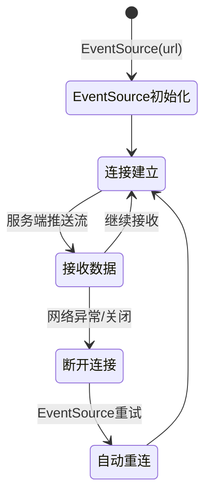
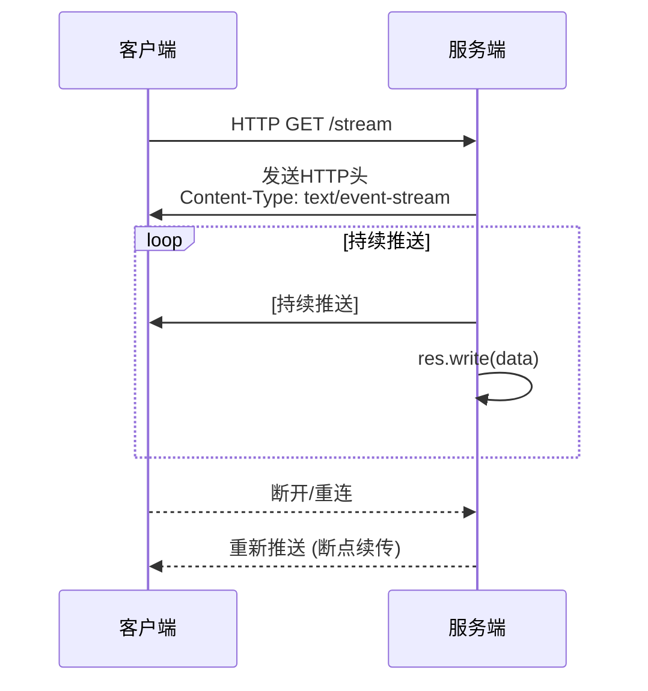

# 2.1.1 流式通信基础与应用场景

**学习目标：** 理解流式通信的核心概念、技术选型考虑，掌握SSE、WebSocket等流式通信协议的特点和适用场景

## 1. 📚 阅读指南

### 1.1 🎯 必读内容（适合所有读者）
- 传统HTTP模式的局限性
- 流式通信的优势与应用场景
- 技术选型决策矩阵

### 1.2 🔧 技术实现（适合开发者）
- SSE、WebSocket、Long Polling代码示例
- 具体技术实现细节

### 1.3 🚀 深入阅读（适合架构师）
- 性能优化策略
- 企业级部署考虑

---

## 2. 从传统通信到流式通信的演进

### 2.1 传统HTTP请求响应模式的工作原理

在理解流式通信之前，我们先回顾传统Web应用的通信模式。传统的HTTP通信遵循请求-响应模式：

```
客户端 → HTTP请求 → 服务器
客户端 ← HTTP响应 ← 服务器
```

**传统模式的特点：**
- **同步阻塞**：客户端发送请求后必须等待服务器响应
- **一次性交互**：每次请求对应一次响应，然后连接关闭
- **无状态**：每次请求都是独立的，服务器不保持连接状态

这种模式在处理简单的CRUD操作时表现良好，但在AGI应用场景中面临显著挑战：

### 2.2 响应时间不可预测
AI模型的推理时间往往无法预测，从几秒到几分钟不等。传统的同步请求会导致：
- 客户端长时间等待，用户体验差
- 服务器连接资源被长时间占用
- 容易触发网关或代理的超时限制

### 2.3 缺乏进度反馈
在传统模式下，用户无法了解AI任务的执行进度：
- 用户不知道任务是否正在执行
- 无法提供任务完成的预估时间
- 系统看起来像是"卡住了"

### 2.4 资源利用效率低下
- 服务器需要保持连接直到完整结果生成
- 无法充分利用客户端的处理能力
- 网络带宽利用不均匀

## 3. 流式通信的优势与应用场景

流式通信（Stream Communication）通过建立持久连接，实现数据的实时双向或单向传输：

```
客户端 ←→ 持久连接 ←→ 服务器
       ← 数据流1 ←
       ← 数据流2 ←
       ← 数据流3 ←
       ← ... ←
```

### 3.1 核心优势

#### 3.1.1 实时性
- 数据一产生即可传输给客户端
- 用户立即看到AI处理结果
- 支持增量更新和渐进式展示

#### 3.1.2 用户体验优化
- 提供实时的执行状态反馈
- 减少用户等待的焦虑感
- 支持早期取消和中断操作

#### 3.1.3 资源利用效率
- 减少服务器内存占用
- 避免大量数据的缓存
- 支持背压控制（Backpressure）

#### 3.1.4 可扩展性
- 更好地支持高并发场景
- 降低服务器负载峰值
- 支持负载均衡和水平扩展

### 3.2 典型应用场景

#### 3.2.1 AI文本生成
```
用户提问："什么是机器学习？"
AI模型逐token流式返回：
"机器" → "机器学习" → "机器学习是" → "机器学习是一种" → 
"机器学习是一种人工智能" → "机器学习是一种人工智能技术" → ...
```

#### 3.2.2 长时间计算任务
- 数据分析和报表生成
- 机器学习模型训练状态
- 文件批量处理进度

#### 3.2.3 实时监控和告警
- 系统性能指标监控
- 异常事件实时推送
- 业务数据实时展示

## 4. 流式通信技术的演进路径

在深入具体技术之前，让我们了解流式通信技术的演进历程。这些技术虽然在时间上有所重叠，但从技术能力角度可以看作是一个逻辑演进过程：

```
HTTP轮询 → 长轮询(Long Polling) → 服务器推送事件(SSE) → WebSocket
   ↓            ↓                    ↓              ↓
简单但低效    改善但复杂           单向实时         双向实时
```

**技术发展时间线**：
- **HTTP轮询**：HTTP协议出现（1990年代）就存在的传统方式
- **长轮询（Comet）**：2006年Alex Russell提出Comet概念，是对HTTP轮询的优化
- **SSE（Server-Sent Events）**：HTML5的一部分，2006年提出，2012年成为W3C候选推荐标准
- **WebSocket**：最初由Ian Hickson（Google工程师，HTML5规范负责人）和Michael Carter于2008年提出，旨在为Web应用提供真正的双向实时通信能力。 这一创新得到了浏览器厂商和 开源 社区的广泛支持，最终在2011年12月由IETF正式发布为RFC 6455标准，同时W3C也将其纳入HTML5规范，成为浏览器原生支持的技术。

### 4.1 技术演进的动机

每种技术的出现都是为了解决前一代技术的问题：

1. **HTTP轮询** → **长轮询**：减少无效请求，降低服务器负载
2. **长轮询** → **SSE**：标准化服务器推送，简化实现，提供更好的浏览器支持
3. **SSE** → **WebSocket**：支持双向通信，降低协议开销，提供更低的延迟

## 5. 流式通信技术详解

### 5.1 Server-Sent Events (SSE)

SSE是HTML5标准的一部分，专门用于服务器向客户端推送数据。

**核心特点：**
- **基于HTTP协议**：复用现有的HTTP基础设施
- **单向通信**：只支持服务器到客户端的数据推送
- **自动重连**：连接断开后浏览器会自动尝试重连
- **事件驱动**：支持命名事件，便于客户端分类处理

**适用场景：**
- AI结果流式返回
- 实时状态更新
- 单向数据推送

#### 5.1.1 核心机制

EventSource连接的状态流转过程：



**状态说明：**
- **EventSource初始化**：创建EventSource对象，指定服务器URL
- **连接建立**：与服务器建立HTTP连接，开始监听服务器推送
- **接收数据**：持续接收服务器推送的数据流
- **继续接收**（关键循环）：接收完一批数据后，连接保持建立状态，继续等待接收下一批数据。这条线体现了流式通信的核心特征——**连接是持久的，数据是分批次持续推送的**，而不是一次性接收完就断开
- **断开连接**：网络异常或连接被关闭
- **自动重连**：EventSource内置的重试机制，自动尝试重新建立连接

#### 5.1.2 典型交互

SSE的典型交互流程（sequenceDiagram表示）：



**交互流程说明：**
1. **初始请求**：客户端发送HTTP GET请求到流式端点
2. **响应头设置**：服务端返回`Content-Type: text/event-stream`，告知客户端这是SSE流
3. **持续推送**：服务端通过`res.write(data)`持续写入数据块，客户端实时接收
4. **断点续传**：连接断开后，客户端自动重连，服务端可以从断点处继续推送数据

**最简单的SSE示例：**

让我们从最基础的SSE实现开始理解：

```java
@RestController
public class BasicStreamController {
    
    @GetMapping(value = "/simple-stream", produces = "text/event-stream")
    public SseEmitter simpleStream() {
        SseEmitter emitter = new SseEmitter();
        
        // 立即发送一条消息
        try {
            emitter.send("Hello, 这是第一条流式消息！");
            emitter.complete(); // 完成传输
        } catch (Exception e) {
            emitter.completeWithError(e);
        }
        
        return emitter;
    }
}
```

**进阶示例：定时发送多条消息**

```java
@RestController
public class StreamController {
    
    @GetMapping(value = "/stream", produces = MediaType.TEXT_EVENT_STREAM_VALUE)
    public SseEmitter streamData() {
        SseEmitter emitter = new SseEmitter(60000L); // 60秒超时
        
        // 异步执行数据生成
        CompletableFuture.runAsync(() -> {
            try {
                for (int i = 1; i <= 5; i++) {
                    emitter.send("数据块 " + i);
                    Thread.sleep(1000); // 每秒发送一条
                }
                emitter.complete(); // 完成流式传输
            } catch (Exception e) {
                emitter.completeWithError(e); // 错误处理
            }
        });
        
        return emitter;
    }
}
```

**对应的前端代码：**

**最简单的客户端实现：**
```javascript
// 创建SSE连接
const eventSource = new EventSource('/simple-stream');

// 接收消息
eventSource.onmessage = function(event) {
    console.log('收到消息:', event.data);
    // 显示在页面上
    document.body.innerHTML += '<p>' + event.data + '</p>';
};
```

**完整的客户端示例：**
```javascript
// 建立SSE连接
const eventSource = new EventSource('/stream');

// 监听消息事件
eventSource.onmessage = function(event) {
    console.log('接收到数据:', event.data);
    // 更新UI显示
    updateUI(event.data);
};

// 监听连接状态
eventSource.onopen = function(event) {
    console.log('✅ SSE连接已建立');
    showStatus('已连接', 'green');
};

eventSource.onerror = function(error) {
    console.error('❌ SSE连接错误:', error);
    showStatus('连接错误', 'red');
};

// UI更新函数
function updateUI(data) {
    const container = document.getElementById('messages');
    const message = document.createElement('div');
    message.className = 'message';
    message.textContent = data;
    container.appendChild(message);
}

function showStatus(text, color) {
    const status = document.getElementById('status');
    status.textContent = text;
    status.style.color = color;
}

// 页面卸载时关闭连接
window.addEventListener('beforeunload', () => {
    eventSource.close();
});
```

### 5.2 WebSocket

**特点：**
- 基于TCP的全双工通信协议
- 支持双向实时数据传输
- 协议开销小，性能高
- 需要处理连接管理复杂性

**适用场景：**
- 实时聊天应用
- 协作编辑
- 在线游戏
- 需要客户端主动向服务器发送数据的场景


### 5.3 Long Polling

**特点：**
- 基于HTTP的长连接技术
- 客户端发起请求，服务器延迟响应
- 兼容性最好
- 实现相对复杂，资源开销大

**适用场景：**
- 需要兼容老旧浏览器
- 网络环境不稳定
- 对实时性要求不高的场景

## 6. 技术选型决策矩阵

| 技术方案 | 实时性 | 复杂度 | 资源消耗 | 兼容性 | 推荐场景 |
|---------|--------|--------|----------|--------|----------|
| SSE | 高 | 低 | 中 | 好 | **AI结果流式返回** |
| WebSocket | 很高 | 高 | 低 | 中 | 双向实时交互 |
| Long Polling | 中 | 高 | 高 | 很好 | 兼容性要求高 |

### 6.1 性能对比分析

| 技术方案 | 实时性 | 易用性 | 资源效率 | 兼容性 | AI适配 |
|---------|--------|--------|----------|--------|--------|
| **SSE (Server-Sent Events)** | ⭐⭐⭐⭐ | ⭐⭐ | ⭐⭐⭐ | ⭐⭐⭐⭐ | ⭐⭐⭐⭐⭐ |
| **WebSocket** | ⭐⭐⭐⭐⭐ | ⭐ | ⭐⭐⭐⭐ | ⭐⭐⭐ | ⭐⭐⭐ |
| **Long Polling** | ⭐⭐ | ⭐ | ⭐⭐ | ⭐⭐⭐⭐⭐ | ⭐⭐ |

## 7. AI应用中为什么需要流式通信

### 7.1 用户体验至关重要

在AI应用中，用户期望看到"思考过程"：
```
用户问题: "帮我分析这份财务报表"

传统方式:
用户 → 提交问题 → 等待30秒 → 突然出现完整分析结果

流式方式:
用户 → 提交问题 → "正在读取数据..." → "正在分析收入趋势..." 
    → "发现异常指标..." → "生成可视化图表..." → 完整结果
```

### 7.2 AI任务的特殊性

AI任务具有以下特点，使得流式通信成为必需：

#### 7.2.1 Token级别的生成过程
大语言模型逐个token生成文本，天然适合流式输出：

```python
# AI文本生成的典型过程
def generate_text_stream(prompt):
    for token in model.generate(prompt):
        yield token  # 立即返回生成的token
```

#### 7.2.2 多步骤任务执行
AI Agent通常需要执行多个步骤：

```
步骤1: 理解用户意图 ✓
步骤2: 搜索相关信息 ✓  
步骤3: 调用工具分析 ○ (进行中)
步骤4: 生成最终结果 ○
```

#### 7.2.3 资源密集型计算
- GPU计算资源昂贵
- 需要及时释放资源给其他任务
- 避免因异常导致资源长时间占用

### 7.3 系统可靠性保障要求

流式通信为AI系统提供了更好的可靠性保障：

#### 7.3.1 早期错误发现
```java
// 在流式处理中可以立即发现并处理错误
public void processAITask(SseEmitter emitter) {
    try {
        emitter.send("开始处理...");
        
        // 第一步：数据预处理
        preprocessData();
        emitter.send("数据预处理完成");
        
        // 第二步：模型推理
        if (!modelAvailable()) {
            emitter.send("错误：模型服务不可用");
            emitter.completeWithError(new ModelUnavailableException());
            return;
        }
        
        // 继续处理...
    } catch (Exception e) {
        emitter.completeWithError(e);
    }
}
```

#### 7.3.2 优雅降级
当系统负载过高时，可以：
- 降低流式数据的推送频率
- 简化中间状态的反馈
- 提供基础版本的功能


## 8. 小结


流式通信通过建立持久连接和实时数据推送，完美契合AI应用的特殊需求：大语言模型的Token级生成过程天然适合流式输出，多步骤任务执行需要实时进度反馈，资源密集型计算要求高效的资源管理。其中，SSE协议以其简单易用、自动重连、基于HTTP标准等特性，成为AI应用流式返回的首选方案。了解流式通信的原理和应用场景，掌握技术选型的决策方法，是构建优秀Agentic AI应用的第一步。接下来我们重点学习SSE协议在Agentic AI应用开发中的实际应用。


