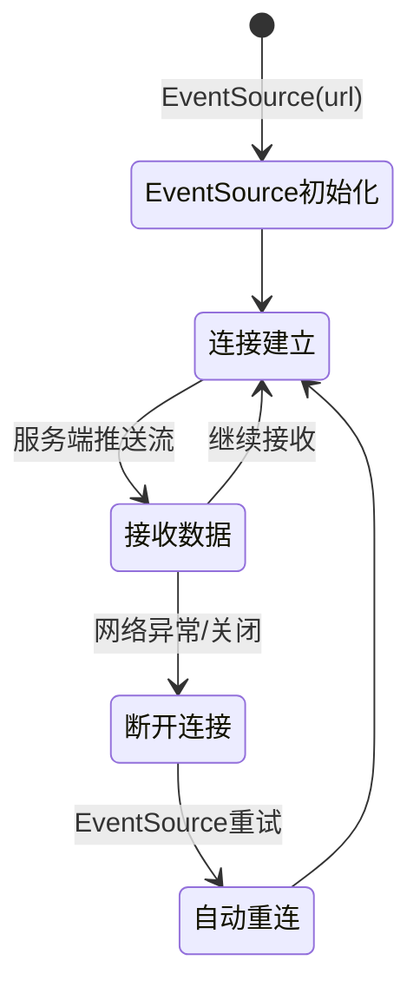
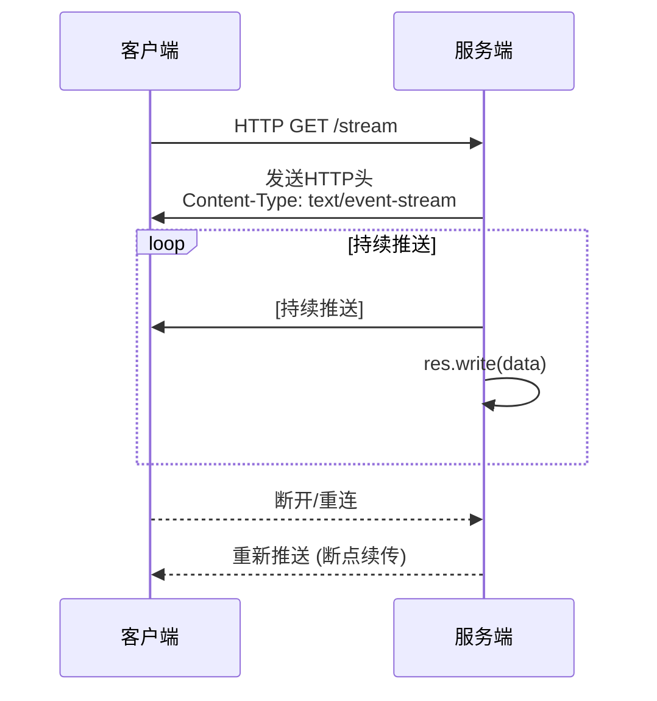

# 2.1.1 流式通信基础与应用场景

**学习目标：** 理解流式通信的核心概念、技术选型考虑，掌握SSE等流式通信协议的特点和适用场景


---

## 引言：理解两种通信范式

对于熟悉传统Web开发的工程师来说，我们日常使用的RESTful API调用都遵循着一种"请求-等待-返回"的通信模式。这种模式被称为**非流式通信**（Non-Streaming Communication）：
```
非流式通信 (Request-Response)
客户端 ──请求──→ 服务器
客户端 ←──完整响应──── 服务器 (连接关闭)
```
然而，在基于大模型技术开发的应用中，我们面临着全新的挑战：
- **响应时间长**：大模型推理可能耗时数十秒甚至数分钟
- **需要实时反馈**：用户希望看到AI的"思考过程"
- **中间结果有价值**：Agent需要持续输出执行步骤和中间结果
这时，传统的"一问一答"模式就显得力不从心了。**流式通信**（Streaming Communication）恰好完美契合了大模型的输出特点。它允许服务器在处理请求的同时，持续地、分段地将生成的数据实时推送给客户端——就像打开水龙头让水源源不断地流出，而不必等待水缸装满后才一次性倒出：
```
流式通信 (Streaming)
客户端 ──请求──→ 服务器
客户端 ←──数据流1──── 服务器 (连接保持)
客户端 ←──数据流2──── 服务器 (连接保持)
客户端 ←──数据流3──── 服务器 (连接保持)
客户端 ←──数据流n──── 服务器 (完成后关闭)
```
### 两种通信范式对比
| 对比维度 | 非流式通信 | 流式通信 |
|---------|-----------|----------|
| **连接方式** | 短连接，请求后立即关闭 | 长连接 |
| **响应方式** | 一次性返回完整结果 | 持续推送数据片段 |
| **数据可见性** | 等待→显示完整结果 | 即时反馈→逐步显示 |
| **典型场景** | RESTful API、表单提交 | AI对话、实时日志、视频流 |
| **AI适用性** | ❌ 长时间等待，体验差 | ✅ 实时反馈，体验好 |

事实上，流式通信技术并不新鲜——聊天应用、实时协作、视频流媒体、大文件下载、实时日志推送等场景早已广泛使用。但在AI应用中，这项技术展现出了前所未有的重要性，成为了构建良好用户体验的**关键技术基础**。
### 流式通信在AI应用中的核心价值
#### 1. 实时性：即产即推，无需等待
- 数据一产生即可传输给客户端
- 用户立即看到AI处理结果
- 支持增量更新和渐进式展示
**典型场景**：ChatGPT式的"打字机"效果，让用户感受到AI正在思考和生成内容。

#### 2. 用户体验：从"黑盒等待"到"透明过程"
- 提供实时的执行状态反馈
- 减少用户等待的焦虑感
- 支持早期取消和中断操作
**典型场景**：复杂任务执行时显示"正在搜索资料..."、"正在分析数据..."等中间状态。

#### 3. 资源效率：减少内存占用，优化带宽利用
- 减少服务器内存占用（无需缓存完整结果）
- 避免大量数据的积压
- 支持背压控制（Backpressure），防止数据过载
**典型场景**：生成长篇文章或报告时，边生成边传输，而不是等全部生成完再返回。

#### 4. 系统可靠性：更好的扩展性和容错能力
- 更好地支持高并发场景
- 降低服务器负载峰值
- 支持负载均衡和水平扩展
- 连接异常时可以断点续传
**典型场景**：多用户同时使用AI服务时，流式传输可以更平滑地分配资源。


### AI应用中的流式通信技术
### 流式通信基础——HTTP流式传输技术
在现代网络应用中，实现流式通信有多种传输技术方案可选：

**常见的流式通信技术对比：**

| 技术方案 | 连接模型 | 双向通信 | 适用场景 | 复杂度 |
|---------|---------|---------|---------|--------|
| **TCP Socket** | 长连接 | 全双工 | 底层网络编程、实时游戏 | 高 |
| **WebSocket** | 长连接 | 全双工 | 实时聊天、协作编辑 | 中 |
| **HTTP Streaming** | 半持久连接 | 单向（服务端→客户端） | AI生成、数据推送 | 低 |
| **轮询（Polling）** | 短连接 | 模拟实时 | 兼容性要求高的场景 | 低 |

**为什么AI应用普遍选择HTTP流式传输？**
尽管WebSocket和Socket提供了更强大的双向通信能力，但**HTTP流式传输已经成为AI应用开发的主流选择**，主要原因包括：
1. **单向通信足够用**：AI应用的典型交互模式是"请求-响应"，客户端发送问题，服务端流式返回答案，不需要频繁的双向实时通信
2. **生态系统成熟**：
   - 所有主流AI服务商（OpenAI、Anthropic、Google等）都采用HTTP流式API
   - 丰富的客户端库和工具链支持
   - 前端框架（React、Vue等）有成熟的HTTP流处理方案
3. **基础设施友好**：
   - 无需特殊的代理或负载均衡器配置
   - CDN、防火墙、企业网关等网络设备普遍支持
   - 更容易通过现有的安全策略和监控体系
4. **开发成本低**：
   - 基于标准HTTP协议，学习曲线平缓
   - 可以复用现有的HTTP中间件和认证机制
   - 调试工具丰富（浏览器开发者工具、Postman等）
5. **可靠性保障**：
   - HTTP/2和HTTP/3提供了内置的多路复用和流控制
   - 断线重连机制简单明了
   - 易于实现幂等性和重试逻辑


因此，接下来我们将重点介绍HTTP流式传输的实现机制，这是掌握AI应用开发的基础技能。

#### HTTP流式（HTTP Streaming）传输机制
##### 第一种：HTTP/1.1 分块传输编码（Chunked Transfer Encoding）
**技术定义：**
分块传输编码将内容封装为一系列数据块进行传输，每个数据块都带有自己的大小指示器，后面可选地跟随包含尾部字段的trailer区域。分块编码使得未知大小的内容流能够以长度分隔的缓冲区序列形式传输，这样发送方可以保持连接持久性，接收方也能知道何时接收到完整消息。
**实现机制：**
HTTP/1.1 标准（RFC 2616）中定义的机制，通过响应头 `Transfer-Encoding: chunked` 声明。响应体被分割为多个数据块（chunk），每个块包含：
- **块大小**：十六进制表示的字节数
- **块数据**：实际的数据内容
- **结束标记**：以 `0\r\n\r\n` 标记传输结束


##### 第二种：HTTP/2 和 HTTP/3 数据流（Stream）
**"流"（Stream）概念：** HTTP/2中的"流"是在单个HTTP/2连接内，客户端和服务器之间交换的 **独立、双向的帧序列**。流具有以下几个重要特性：
1. **多路复用**：单个HTTP/2连接可以包含多个并发打开的流，任一端点都可以交错发送来自多个流的帧
2. **灵活建立**：流可以由任一端点单方面建立和使用，也可以由双方共享
3. **双向关闭**：流可以由任一端点关闭
4. **顺序保证**：帧的发送顺序很重要，接收方按照接收顺序处理帧。特别是HEADERS帧和DATA帧的顺序在语义上具有重要意义
5. **唯一标识**：每个流通过整数ID进行标识，流标识符由发起流的端点分配

**实现机制：**

HTTP/2 标准（RFC 7540）采用二进制分帧层，主要包含以下关键机制：
- **帧结构**：所有通信都分解为更小的消息和帧，并采用二进制格式编码。每个帧包含：
  - 帧头（9字节）：长度、类型、标志、流ID
  - 帧负载：实际数据内容
- **流ID分配规则**：
  - 客户端发起的流使用奇数ID（1, 3, 5, ...）
  - 服务器发起的流使用偶数ID（2, 4, 6, ...）
  - ID必须递增，不可重用
- **关键帧类型**：
  - `HEADERS`：发送HTTP头部信息
  - `DATA`：传输HTTP消息体
  - `RST_STREAM`：终止流
  - `SETTINGS`：配置连接参数
  - `PRIORITY`：设置流优先级
- **流状态机**：流在生命周期中经历多个状态（idle → open → half-closed → closed），确保数据传输的有序性和可靠性
HTTP/3 Stream 与 HTTP/2 Stream 几乎完全相同。它们的主要区别在于在QUIC或TCP之上的功能的技术实现。在此不再赘述，感兴趣的读者可以查阅相关资料。

### 从传输协议到文本协议：理解协议栈的分层价值

在理解了HTTP1.1分块传输编码和HTTP/2的多路复用和流式传输的底层机制之后，我们需要认识到：虽然他们提供了强大的传输能力，但直接使用这些底层传输协议对开发者来说并不友好。这就引出了文本协议的价值——它们在HTTP1.1、 HTTP/2、HTTP/3等传输协议之上，提供了更加简洁、标准化的接口和语义，让开发者无需关心底层的帧控制、流量管理等复杂细节。

接下来我们将介绍一种建立在HTTP协议之上的应用层流式文本协议。这些协议充分利用了HTTP的流式传输能力，同时为特定场景提供了更高层次的抽象和更易用的编程接口。它们与底层HTTP协议的关系就像应用程序与操作系统的关系——底层提供能力，上层提供便利性和专业化。


## Server-Sent Events (SSE) 文本协议

**技术定义：**

Server-Sent Events（SSE）是 HTML5 标准定义的一种服务器向客户端单向推送实时数据的文本协议。它基于HTTP流式传输机制，允许服务器持续向客户端推送文本格式的事件流，一般客户端通过浏览器原生的 `EventSource` API 接收和处理这些事件。SSE 特别适合服务器需要主动推送数据、而客户端无需频繁响应的场景。

**核心特点：**
- **单向通信**：数据只能从服务器流向客户端，客户端不能通过 SSE 连接向服务器发送数据（需要通过其他 HTTP 请求实现双向交互）
- **事件驱动**：服务器可以发送包含不同类型事件的数据，客户端可以针对不同事件类型注册监听器并做出相应处理
- **基于HTTP协议**：使用标准的HTTP协议，易于实现、调试和部署，支持 HTTP/1.1、HTTP/2、HTTP/3
- **低资源消耗**：与 WebSocket 相比，SSE 的连接建立和维护消耗更少的资源，更适合单向数据推送场景
- **自动重连机制**：
  - 连接断开后，浏览器自动重连（默认间隔 3 秒）
  - 重连时自动发送 `Last-Event-ID` 头，服务器可据此恢复数据推送进度
  - 服务器可通过 `retry` 字段自定义重连间隔时间
**实现机制：**
SSE 标准定义了一套简单的文本协议格式和浏览器 API：
- **HTTP 响应头设置**：
  - `Content-Type: text/event-stream`：声明这是一个事件流
  - `Cache-Control: no-cache`：禁止缓存响应内容
  - `Connection: keep-alive`：保持长连接状态
- **事件数据格式**（纯文本，UTF-8 编码）：
  ```
  event: eventName     # 可选：事件类型名称
  data: message        # 必需：事件数据内容（可多行）
  id: 1               # 可选：事件ID，用于断线重连时恢复
  retry: 10000        # 可选：重连间隔时间（毫秒）
  
  （空行表示一个完整事件结束）
  ```

- **连接管理**：
  - 客户端可通过 `eventSource.close()` 主动关闭连接
  - 服务器端关闭连接时，客户端会自动尝试重连

**跨语言支持：**
虽然 SSE 在 HTML5 规范中被标准化并提供了浏览器原生的 `EventSource` API，但它本质上是基于 HTTP 的文本协议，因此：
- 任何支持 HTTP 的客户端都可以实现 SSE 接收
- 不依赖于浏览器环境，可在服务端到服务端的通信中使用


###SSE的两种使用模式
**模式一：直接发起SSE的GET请求（无参数或URL参数）**

适用于订阅公共数据流或参数简单的场景。使用浏览器原生 `EventSource` API：

```javascript
// 无参数订阅
const eventSource = new EventSource('/api/notifications');

// URL参数订阅
const eventSource = new EventSource('/api/stock-price?symbol=AAPL');

eventSource.onmessage = (event) => {
  console.log('收到数据:', event.data);
};

eventSource.onerror = (error) => {
  console.error('连接错误:', error);
};

// 关闭连接
eventSource.close();
```

**局限性**：
- 原生 `EventSource` 只支持 GET 请求
- 无法自定义请求头（如 Authorization）
- 无法发送请求体（复杂参数需放在 URL 中，不够优雅）

**模式二：通过HTTP POST发起请求+ 处理 SSE 协议格式的流式响应**

针对原生 `EventSource` 的诸多局限性，社区开发了基于底层HTTP能力的第三方库（例如：`@microsoft/fetch-event-source`、`sse.js`等）来突破这些限制。这类库的核心思路是：
- **利用底层HTTP API**：基于 `fetch`、`XMLHttpRequest` 等实现可控的流式请求
- **传递复杂参数**：通过HTTP POST等方法发起请求并传递复杂参数、认证信息等
- **手动解析 SSE 协议**：直接处理流式响应的文本格式
- **模拟事件驱动模型**：提供与原生 `EventSource` 兼容的 API 接口
- **增强控制能力**：支持自定义请求方法、请求头、请求体等
- **完善错误处理**：提供更灵活的重连策略和错误处理机制

例如，目前前端最常用的是微软开源的 `@microsoft/fetch-event-source` 库，它特别适合AI应用等需要传递复杂参数和认证信息的场景：

```javascript
import { fetchEventSource } from '@microsoft/fetch-event-source';

await fetchEventSource('/api/ai/chat', {
  method: 'POST',
  headers: {
    'Content-Type': 'application/json',
    'Authorization': 'Bearer your-token-here'
  },
  body: JSON.stringify({
    messages: [
      { role: 'user', content: '请帮我写一段Python代码' }
    ],
    model: 'gpt-4',
    temperature: 0.7
  }),
  
  onmessage(event) {
    // 处理每条消息
    console.log('收到数据:', event.data);
    const data = JSON.parse(event.data);
    // 更新UI显示
  },
  
  onerror(error) {
    console.error('连接错误:', error);
    throw error; // 抛出错误会停止重连
  },
  
  onclose() {
    console.log('连接已关闭');
  },
  
  // 配置选项
  openWhenHidden: true, // 页面隐藏时保持连接
});

// 使用 AbortController 主动取消连接
const controller = new AbortController();
fetchEventSource('/api/ai/chat', {
  signal: controller.signal,
  // ... 其他配置
});

// 取消请求
controller.abort();
```

**`fetch-event-source` 的核心优势**：
- ✅ 支持 POST 请求，可传递复杂 JSON 参数
- ✅ 支持自定义请求头（认证、跨域等）
- ✅ 提供更强的错误处理和重连控制
- ✅ 支持通过 `AbortController` 优雅地取消请求
- ✅ 更好的浏览器兼容性和边界情况处理

**在AI应用中的实践：**
- 这样的HTTP POST方法发起请求 + 处理SSE协议格式的流式响应的模式在AI应用开发中得到了广泛的应用
- 原因：AI 对话需要传递完整的对话历史、系统提示词、参数配置等复杂数据
- 同时需要携带用户认证信息保证安全性

**其他语言SSE客户端的技术选型：**

其他的开发语言中同样有丰富的SSE客户端库可供选择，例如：
- **Python**：`sseclient-py`、`aiohttp-sse-client`
- **Java**：Spring WebFlux 的 `WebClient`
- **go**： `r3labs/sse`

在实际项目中，开发者既可以直接使用现有的SSE客户端库，也可以根据特定需求自行实现。例如在京东的 JoyAgent-JDGenie 项目中，团队选择基于 OkHttp 自定义实现 SSE 客户端，以便更好地控制连接管理、错误处理和性能优化等细节。**理解这些流式通信的底层原理和协议机制，是灵活应对各种技术选型和实现方案的关键基础。**

## Streamable HTTP 与 MCP 协议

**什么是 MCP？**

MCP（Model Context Protocol，模型上下文协议）是由 Anthropic 公司于 2024 年 11 月开源的一种标准化通信协议，旨在解决大型语言模型（LLM）与外部数据源及工具之间的无缝集成需求。


**核心特性：**
- **统一接口** - 提供标准化的 API 接口，简化 AI 与各种上下文信息之间的交互。
- **无缝集成** - 轻松集成到现有开发工作流程中，无需复杂适配。
- **多源数据支持** - 支持从多个来源检索上下文信息，包括代码仓库、文档等。
- **智能上下文管理** - 优化上下文信息的传输，提升AI模型理解和生成的质量。
- **可扩展设计** - 灵活的架构允许添加新的数据源和功能。


**传输层演进：**
- **初始版本**（2024.11）：基于 HTTP + SSE 作为默认传输方式
- **重大更新**（2025.03.26）：引入 Streamable HTTP 替代原先的 HTTP+SSE，成为新的默认传输方式

> 参考资料：[MCP Streamable HTTP 详解](https://www.claube.ai/zh/blog/mcp-streamable-http)

**什么是 Streamable HTTP？**

Streamable HTTP 是一个相对较新的概念，是 MCP 协议在 2025 年 3 月引入的改进传输机制。它是一种结合普通 HTTP 请求和流式传输能力的混合机制，允许客户端通过标准的 POST/GET 请求与服务端交互，同时支持服务端根据需要将响应升级为SSE流，实现灵活的实时数据传输。

**核心工作流程：**

1. **会话初始化**
   - 客户端发送初始化请求到 `/message` 端点
   - 服务器可选择生成会话 ID 并返回给客户端
   - 会话 ID 用于后续请求中标识和维护会话状态

2. **客户端到服务器通信**
   - 所有消息通过 HTTP POST 请求发送到 `/message` 端点
   - 请求中包含会话 ID（如果已建立会话）
   - 支持发送结构化的上下文数据和工具调用请求

3. **服务器响应方式**（按需选择）
   - **普通响应**：直接返回标准 HTTP 响应，适合简单的请求-响应交互
   - **流式响应**：升级连接为 SSE 流，发送一系列事件后关闭连接
   - **长连接模式**：维持 SSE 连接持续发送事件，适合长时间交互

4. **主动建立 SSE 流**
   - 客户端可发送 GET 请求到 `/message` 端点主动建立 SSE 流
   - 服务器通过该流主动推送通知、状态更新或请求响应

5. **连接恢复与容错**
   - 连接中断时，客户端可使用之前的会话 ID 重新连接
   - 服务器可恢复会话状态，继续之前未完成的交互
   - 支持断点续传和状态同步


**核心优势：**

- **按需流式传输**：服务器可根据响应数据的特点，灵活选择返回普通 HTTP 响应还是升级为 SSE 流，兼顾简单性和实时性
- **会话持久化**：通过会话 ID 机制，支持长时间的有状态交互，适合 AI 应用的多轮对话场景
- **双向灵活交互**：结合 HTTP POST（客户端→服务器）和 SSE（服务器→客户端），实现灵活的双向通信

**SSE vs Streamable HTTP 技术对比：**

| 维度 | Server-Sent Events (SSE) | Streamable HTTP |
|------|-------------------------|-----------------|
| **协议定义** | HTML5 标准定义的专用协议，具有明确的格式和事件处理机制 | 基于 HTTP 协议的使用模式，不是专门定义的新协议 |
| **数据格式** | 固定的文本格式（`event`、`data`、`id`、`retry` 字段） | 灵活的数据格式，完全由应用层定义（通常为 JSON） |
| **连接管理** | 始终保持单一持久连接，通过该连接发送多个事件 | 灵活选择持久连接或一次性连接，按需升级为 SSE |
| **使用场景** | 纯粹的服务器到客户端单向推送 | 混合场景：普通请求-响应 + 按需流式推送 |
| **客户端复杂度** | 简单，浏览器原生支持 `EventSource` API | 需要处理 HTTP 响应类型判断和 SSE 流解析 |
| **灵活性** | 固定的单向流式模式 | 可在普通 HTTP 和流式 SSE 之间动态切换 |

**技术意义：**

Streamable HTTP 代表了 MCP 协议在传输层的重要进化。它通过结合 HTTP 和 SSE 的优点，同时克服二者的局限性，为 AI 应用的通信提供了更灵活、更可靠的解决方案。特别适合需要：
- 既有简单请求-响应，又有实时流式推送的混合场景
- 长时间有状态交互的 AI 对话应用
- 需要会话恢复和容错能力的企业级应用


| 技术方案 | 通信方向 | 核心特点 | 典型应用场景 |
|---------|---------|---------|-------------|
| **Server-Sent Events (SSE)** | 单向（服务器→客户端） | 简单易用，浏览器原生支持 | AI对话、实时通知、进度推送 |
| **HTTP/2 Streaming** | 双向（客户端↔服务器） | 多路复用，性能优秀 | 复杂交互、实时协作 |
| **Streamable HTTP (MCP)** | 双向（客户端↔服务器） | 专为AI设计，支持结构化数据流 | Model Context Protocol 应用 |


#### 1. Server-Sent Events (SSE)：AI应用的首选方案

```
通信模型：单向流（服务器 ──→ 客户端）
客户端 ──HTTP请求──→ 服务器
客户端 ←──事件流1──── 服务器 (连接保持)
客户端 ←──事件流2──── 服务器 (连接保持)
客户端 ←──事件流n──── 服务器 (完成/断开)
```

**技术特性：**

| 特性维度 | 说明 |
|---------|------|
| **技术标准** | HTML5 标准（W3C规范） |
| **底层协议** | 基于HTTP/1.1或HTTP/2 |
| **通信方向** | 单向：服务器→客户端 |
| **数据格式** | 纯文本流（text/event-stream） |
| **浏览器支持** | 所有现代浏览器原生支持（通过`EventSource` API） |
| **自动重连** | ✅ 内置自动重连机制 |
| **事件类型** | ✅ 支持命名事件，便于分类处理 |

**在AI应用中的典型应用：**

1. **ChatGPT式对话**
   - 逐token流式输出AI生成的文本
   - 用户看到"打字机"效果，体验流畅

2. **多步骤任务进度推送**
   ```
   event: progress
   data: {"step": "数据预处理", "progress": 20}
   
   event: progress
   data: {"step": "模型推理", "progress": 60}
   
   event: result
   data: {"final": "任务完成", "result": {...}}
   ```

3. **实时状态通知**
   - Agent执行状态变化通知
   - 系统告警和错误提示
   - 任务队列状态更新

**优势：**
- ✅ **简单易用**：浏览器原生API，无需额外库
- ✅ **自动重连**：断线后自动恢复，无需手动处理
- ✅ **事件驱动**：支持多种事件类型，便于业务分类
- ✅ **兼容性好**：可穿透大多数代理和防火墙
- ✅ **成本低**：复用HTTP基础设施，无需额外服务

**局限性：**
- ❌ **单向通信**：只能服务器推送，客户端需要另外发送HTTP请求
- ❌ **浏览器连接限制**：同一域名通常限制6个并发SSE连接
- ❌ **无二进制支持**：只能传输文本数据

**最佳实践：**
- ✅ 适合AI对话、实时通知等单向数据推送场景
- ✅ 大多数AI应用的首选方案
- ✅ 与RESTful API配合使用：API发起请求，SSE返回流式结果

---

#### 2. HTTP/2 Streaming：双向高性能流式通信

**HTTP/2中的"流"（Stream）概念：**

HTTP/2中的"流"是在单个HTTP/2连接内，客户端和服务器之间交换的**独立、双向的帧序列**。流具有以下几个重要特性：

1. **多路复用**：单个HTTP/2连接可以包含多个并发打开的流，任一端点都可以交错发送来自多个流的帧
2. **灵活建立**：流可以由任一端点单方面建立和使用，也可以由双方共享
3. **双向关闭**：流可以由任一端点关闭
4. **顺序保证**：帧的发送顺序很重要，接收方按照接收顺序处理帧。特别是HEADERS帧和DATA帧的顺序在语义上具有重要意义
5. **唯一标识**：每个流通过整数ID进行标识，流标识符由发起流的端点分配


```
通信模型：双向流（客户端 ←→ 服务器）
客户端 ──Stream1请求──→ 服务器
客户端 ←──Stream1响应──── 服务器 (多路复用，并发传输)
客户端 ──Stream2请求──→ 服务器
客户端 ←──Stream2响应──── 服务器
```


**技术特性：**

| 特性维度 | 说明 |
|---------|------|
| **技术标准** | HTTP/2 协议（RFC 7540） |
| **底层协议** | 基于HTTP/2，单一TCP连接 |
| **通信方向** | 双向：客户端↔服务器 |
| **多路复用** | ✅ 一个连接支持多个并发流 |
| **头部压缩** | ✅ HPACK压缩，减少传输开销 |
| **二进制协议** | ✅ 二进制帧，性能更高 |
| **流控机制** | ✅ 内置流量控制和优先级管理 |

**在AI应用中的典型应用：**

1. **实时语音识别**
   - 客户端持续发送音频流
   - 服务器实时返回识别结果

2. **视频分析**
   - 客户端推送视频帧流
   - 服务器返回分析结果流

3. **协作式AI编辑**
   - 多用户实时协作
   - 双向同步编辑状态和AI建议

**优势：**
- ✅ **真正的双向通信**：同时支持客户端和服务器推送
- ✅ **性能优秀**：多路复用、头部压缩、二进制传输
- ✅ **连接复用**：一个连接处理多个请求，减少握手开销
- ✅ **优先级控制**：可为不同流设置优先级

**局限性：**
- ❌ **实现复杂**：需要HTTP/2支持，开发调试难度较高
- ❌ **浏览器兼容性**：需要HTTPS，部分旧浏览器不支持
- ❌ **基础设施要求**：需要服务器、代理、负载均衡器全面支持HTTP/2

**最佳实践：**
- ✅ 适合需要双向实时通信的复杂场景
- ✅ 音视频处理、实时协作等高性能要求场景
- ⚠️ 对于简单的AI对话，SSE更简单实用

---

#### 3. Streamable HTTP (MCP)：专为AI设计的流式协议

```
通信模型：结构化双向流（客户端 ←→ 服务器）
客户端 ──MCP请求（结构化）──→ 服务器
客户端 ←──响应流（结构化）──── 服务器 (支持多种资源类型)
客户端 ──工具调用请求──→ 服务器
客户端 ←──工具执行结果──── 服务器
```

**技术特性：**

| 特性维度 | 说明 |
|---------|------|
| **技术标准** | Model Context Protocol（Anthropic提出） |
| **设计目标** | 专为AI Agent和LLM设计的通信协议 |
| **数据格式** | 结构化JSON流 + 类型定义 |
| **通信方向** | 双向：客户端↔服务器 |
| **资源管理** | ✅ 内置资源、工具、提示词的标准化交互 |
| **上下文管理** | ✅ 原生支持上下文传递和管理 |

**MCP协议的核心概念：**

1. **Resources（资源）**
   - 向LLM暴露数据源（文件、数据库、API等）
   - 支持动态资源发现和访问

2. **Tools（工具）**
   - 定义LLM可调用的函数/工具
   - 标准化的工具调用和结果返回

3. **Prompts（提示词）**
   - 预定义的提示词模板
   - 支持参数化和组合

**在AI应用中的典型应用：**

1. **AI Agent间通信**
   ```json
   {
     "type": "tool_call",
     "tool": "search_knowledge_base",
     "params": {"query": "流式通信"},
     "stream": true
   }
   ```

2. **LLM与外部工具集成**
   - 数据库查询工具
   - 文件系统操作
   - API调用封装

3. **多Agent协作系统**
   - Agent间任务委派
   - 结果聚合和处理
   - 上下文共享和传递

**优势：**
- ✅ **专为AI设计**：原生支持LLM常见的交互模式
- ✅ **标准化**：统一的资源、工具、提示词管理
- ✅ **类型安全**：强类型定义，减少错误
- ✅ **可扩展性**：易于添加新的工具和资源
- ✅ **上下文感知**：内置上下文管理机制

**局限性：**
- ❌ **新兴标准**：生态系统还在发展中
- ❌ **学习成本**：需要理解MCP特定的概念和模式
- ❌ **工具支持**：目前支持的语言和框架有限

**最佳实践：**
- ✅ 适合构建复杂的AI Agent系统
- ✅ 需要标准化工具调用和资源管理的场景
- ✅ 多Agent协作和编排场景
- ⚠️ 简单应用可以先从SSE开始，后续升级到MCP

---

**技术选型决策指南：**

| 场景 | 推荐方案 | 理由 |
|-----|---------|------|
| 简单AI对话（如ChatGPT） | **SSE** | 简单易用，满足需求 |
| 实时语音/视频处理 | **HTTP/2 Streaming** | 需要双向流，性能要求高 |
| 复杂Agent系统 | **MCP + SSE** | MCP处理结构化交互，SSE处理流式输出 |
| 实时协作编辑 | **WebSocket或HTTP/2** | 需要低延迟双向通信 |
| 进度通知/状态推送 | **SSE** | 单向推送，简单可靠 |

**实用建议：**
1. **80%的AI应用从SSE开始**：简单、可靠、够用
2. **确实需要双向通信时考虑HTTP/2或WebSocket**
3. **构建企业级Agent系统时研究MCP**：面向未来的标准化方案


## 2. 从传统通信到流式通信的演进

### 2.1 传统HTTP请求响应模式的工作原理


在理解流式通信之前，我们先回顾简单Web应用的通信模式。普通的HTTP通信遵循请求-响应模式：

```
客户端 → HTTP请求 → 服务器
客户端 ← HTTP响应 ← 服务器
```
**传统模式的特点：**
- **同步阻塞**：客户端发送请求后必须等待服务器响应
- **一次性交互**：每次请求对应一次响应，然后连接关闭
- **无状态**：每次请求都是独立的，服务器不保持连接状态

这种模式在处理简单的CRUD操作时表现良好，但在AI应用场景中面临显著挑战：

### 2.2 响应时间不可预测
AI模型的推理时间往往无法预测，从几秒到几分钟不等。传统的同步请求会导致：
- 客户端长时间等待，用户体验差
- 服务器连接资源被长时间占用
- 容易触发网关或代理的超时限制

### 2.3 缺乏进度反馈
在传统模式下，用户无法了解AI任务的执行进度：
- 用户不知道任务是否正在执行
- 无法提供任务完成的预估时间
- 系统看起来像是"卡住了"

### 2.4 资源利用效率低下
- 服务器需要保持连接直到完整结果生成
- 无法充分利用客户端的处理能力
- 网络带宽利用不均匀

## 3. 流式通信的优势与应用场景

流式通信（Stream Communication）通过建立持久连接，实现数据的实时双向或单向传输：

```
客户端 ←→ 持久连接 ←→ 服务器
       ← 数据流1 ←
       ← 数据流2 ←
       ← 数据流3 ←
       ← ... ←
```

### 3.1 核心优势

#### 3.1.1 实时性
- 数据一产生即可传输给客户端
- 用户立即看到AI处理结果
- 支持增量更新和渐进式展示

#### 3.1.2 用户体验优化
- 提供实时的执行状态反馈
- 减少用户等待的焦虑感
- 支持早期取消和中断操作

#### 3.1.3 资源利用效率
- 减少服务器内存占用
- 避免大量数据的缓存
- 支持背压控制（Backpressure）

#### 3.1.4 可扩展性
- 更好地支持高并发场景
- 降低服务器负载峰值
- 支持负载均衡和水平扩展

### 3.2 典型应用场景

#### 3.2.1 AI文本生成"打字式"输出
```
用户提问："什么是机器学习？"
AI模型逐token流式返回：
"机器" → "机器学习" → "机器学习是" → "机器学习是一种" → 
"机器学习是一种人工智能" → "机器学习是一种人工智能技术" → ...
```

## 1. HTTP流式通信技术详解
HTTP流式传输（HTTP Streaming）是一种在单个HTTP连接上持续传输数据的技术，允许服务器在响应完成之前就开始向客户端发送数据。这种技术特别适用于实时数据推送、大文件传输、进度反馈等场景。

在理解流式通信之前，我们先回顾简单Web应用的通信模式。普通的HTTP通信遵循请求-响应模式：

```
客户端 → HTTP请求 → 服务器
客户端 ← HTTP响应 ← 服务器
```

流式通信（Stream Communication）通过建立持久连接，实现数据的实时双向或单向传输：

```
客户端 ←→ 持久连接 ←→ 服务器
       ← 数据流1 ←
       ← 数据流2 ←
       ← 数据流3 ←
       ← ... ←
```


在深入具体技术之前，让我们了解流式通信技术的演进历程。这些技术虽然在时间上有所重叠，但从技术能力角度可以看作是一个逻辑演进过程：

```
HTTP轮询 → 长轮询(Long Polling) → 服务器推送事件(SSE) → WebSocket
   ↓            ↓                    ↓              ↓
简单但低效    改善但复杂           单向实时         双向实时
```

**技术发展时间线**：
- **HTTP轮询**：HTTP协议出现（1990年代）就存在的传统方式
- **长轮询（Comet）**：2006年Alex Russell提出Comet概念，是对HTTP轮询的优化
- **SSE（Server-Sent Events）**：HTML5的一部分，2006年提出，2012年成为W3C候选推荐标准
- **WebSocket**：最初由Ian Hickson（Google工程师，HTML5规范负责人）和Michael Carter于2008年提出，旨在为Web应用提供真正的双向实时通信能力。 这一创新得到了浏览器厂商和 开源 社区的广泛支持，最终在2011年12月由IETF正式发布为RFC 6455标准，同时W3C也将其纳入HTML5规范，成为浏览器原生支持的技术。

### 4.1 技术演进的动机

每种技术的出现都是为了解决前一代技术的问题：

1. **HTTP轮询** → **长轮询**：减少无效请求，降低服务器负载
2. **长轮询** → **SSE**：标准化服务器推送，简化实现，提供更好的浏览器支持
3. **SSE** → **WebSocket**：支持双向通信，降低协议开销，提供更低的延迟

## 5. 流式通信技术详解

### 5.1 Server-Sent Events (SSE)

SSE是HTML5标准的一部分，专门用于服务器向客户端推送数据。

**核心特点：**
- **基于HTTP协议**：复用现有的HTTP基础设施
- **单向通信**：只支持服务器到客户端的数据推送
- **自动重连**：连接断开后浏览器会自动尝试重连
- **事件驱动**：支持命名事件，便于客户端分类处理

**适用场景：**
- AI结果流式返回
- 实时状态更新
- 单向数据推送

#### 5.1.1 核心机制

EventSource连接的状态流转过程：



**状态说明：**
- **EventSource初始化**：创建EventSource对象，指定服务器URL
- **连接建立**：与服务器建立HTTP连接，开始监听服务器推送
- **接收数据**：持续接收服务器推送的数据流
- **继续接收**（关键循环）：接收完一批数据后，连接保持建立状态，继续等待接收下一批数据。这条线体现了流式通信的核心特征——**连接是持久的，数据是分批次持续推送的**，而不是一次性接收完就断开
- **断开连接**：网络异常或连接被关闭
- **自动重连**：EventSource内置的重试机制，自动尝试重新建立连接

#### 5.1.2 典型交互

SSE的典型交互流程（sequenceDiagram表示）：



**交互流程说明：**
1. **初始请求**：客户端发送HTTP GET请求到流式端点
2. **响应头设置**：服务端返回`Content-Type: text/event-stream`，告知客户端这是SSE流
3. **持续推送**：服务端通过`res.write(data)`持续写入数据块，客户端实时接收
4. **断点续传**：连接断开后，客户端自动重连，服务端可以从断点处继续推送数据

**最简单的SSE示例：**

让我们从最基础的SSE实现开始理解：

```java
@RestController
public class BasicStreamController {
    
    @GetMapping(value = "/simple-stream", produces = "text/event-stream")
    public SseEmitter simpleStream() {
        SseEmitter emitter = new SseEmitter();
        
        // 立即发送一条消息
        try {
            emitter.send("Hello, 这是第一条流式消息！");
            emitter.complete(); // 完成传输
        } catch (Exception e) {
            emitter.completeWithError(e);
        }
        
        return emitter;
    }
}
```

**进阶示例：定时发送多条消息**

```java
@RestController
public class StreamController {
    
    @GetMapping(value = "/stream", produces = MediaType.TEXT_EVENT_STREAM_VALUE)
    public SseEmitter streamData() {
        SseEmitter emitter = new SseEmitter(60000L); // 60秒超时
        
        // 异步执行数据生成
        CompletableFuture.runAsync(() -> {
            try {
                for (int i = 1; i <= 5; i++) {
                    emitter.send("数据块 " + i);
                    Thread.sleep(1000); // 每秒发送一条
                }
                emitter.complete(); // 完成流式传输
            } catch (Exception e) {
                emitter.completeWithError(e); // 错误处理
            }
        });
        
        return emitter;
    }
}
```

**对应的前端代码：**

**最简单的客户端实现：**
```javascript
// 创建SSE连接
const eventSource = new EventSource('/simple-stream');

// 接收消息
eventSource.onmessage = function(event) {
    console.log('收到消息:', event.data);
    // 显示在页面上
    document.body.innerHTML += '<p>' + event.data + '</p>';
};
```

**完整的客户端示例：**
```javascript
// 建立SSE连接
const eventSource = new EventSource('/stream');

// 监听消息事件
eventSource.onmessage = function(event) {
    console.log('接收到数据:', event.data);
    // 更新UI显示
    updateUI(event.data);
};

// 监听连接状态
eventSource.onopen = function(event) {
    console.log('✅ SSE连接已建立');
    showStatus('已连接', 'green');
};

eventSource.onerror = function(error) {
    console.error('❌ SSE连接错误:', error);
    showStatus('连接错误', 'red');
};

// UI更新函数
function updateUI(data) {
    const container = document.getElementById('messages');
    const message = document.createElement('div');
    message.className = 'message';
    message.textContent = data;
    container.appendChild(message);
}

function showStatus(text, color) {
    const status = document.getElementById('status');
    status.textContent = text;
    status.style.color = color;
}

// 页面卸载时关闭连接
window.addEventListener('beforeunload', () => {
    eventSource.close();
});
```

### 5.2 WebSocket

**特点：**
- 基于TCP的全双工通信协议
- 支持双向实时数据传输
- 协议开销小，性能高
- 需要处理连接管理复杂性

**适用场景：**
- 实时聊天应用
- 协作编辑
- 在线游戏
- 需要客户端主动向服务器发送数据的场景


### 5.3 Long Polling

**特点：**
- 基于HTTP的长连接技术
- 客户端发起请求，服务器延迟响应
- 兼容性最好
- 实现相对复杂，资源开销大

**适用场景：**
- 需要兼容老旧浏览器
- 网络环境不稳定
- 对实时性要求不高的场景

## 6. 技术选型决策矩阵

| 技术方案 | 实时性 | 复杂度 | 资源消耗 | 兼容性 | 推荐场景 |
|---------|--------|--------|----------|--------|----------|
| SSE | 高 | 低 | 中 | 好 | **AI结果流式返回** |
| WebSocket | 很高 | 高 | 低 | 中 | 双向实时交互 |
| Long Polling | 中 | 高 | 高 | 很好 | 兼容性要求高 |

### 6.1 性能对比分析

| 技术方案 | 实时性 | 易用性 | 资源效率 | 兼容性 | AI适配 |
|---------|--------|--------|----------|--------|--------|
| **SSE (Server-Sent Events)** | ⭐⭐⭐⭐ | ⭐⭐ | ⭐⭐⭐ | ⭐⭐⭐⭐ | ⭐⭐⭐⭐⭐ |
| **WebSocket** | ⭐⭐⭐⭐⭐ | ⭐ | ⭐⭐⭐⭐ | ⭐⭐⭐ | ⭐⭐⭐ |
| **Long Polling** | ⭐⭐ | ⭐ | ⭐⭐ | ⭐⭐⭐⭐⭐ | ⭐⭐ |

## 7. AI应用中为什么需要流式通信

### 7.1 用户体验至关重要

在AI应用中，用户期望看到"思考过程"：
```
用户问题: "帮我分析这份财务报表"

传统方式:
用户 → 提交问题 → 等待30秒 → 突然出现完整分析结果

流式方式:
用户 → 提交问题 → "正在读取数据..." → "正在分析收入趋势..." 
    → "发现异常指标..." → "生成可视化图表..." → 完整结果
```

### 7.2 AI任务的特殊性

AI任务具有以下特点，使得流式通信成为必需：

#### 7.2.1 Token级别的生成过程
大语言模型逐个token生成文本，天然适合流式输出：

```python
# AI文本生成的典型过程
def generate_text_stream(prompt):
    for token in model.generate(prompt):
        yield token  # 立即返回生成的token
```

#### 7.2.2 多步骤任务执行
AI Agent通常需要执行多个步骤：

```
步骤1: 理解用户意图 ✓
步骤2: 搜索相关信息 ✓  
步骤3: 调用工具分析 ○ (进行中)
步骤4: 生成最终结果 ○
```

#### 7.2.3 资源密集型计算
- GPU计算资源昂贵
- 需要及时释放资源给其他任务
- 避免因异常导致资源长时间占用

### 7.3 系统可靠性保障要求

流式通信为AI系统提供了更好的可靠性保障：

#### 7.3.1 早期错误发现
```java
// 在流式处理中可以立即发现并处理错误
public void processAITask(SseEmitter emitter) {
    try {
        emitter.send("开始处理...");
        
        // 第一步：数据预处理
        preprocessData();
        emitter.send("数据预处理完成");
        
        // 第二步：模型推理
        if (!modelAvailable()) {
            emitter.send("错误：模型服务不可用");
            emitter.completeWithError(new ModelUnavailableException());
            return;
        }
        
        // 继续处理...
    } catch (Exception e) {
        emitter.completeWithError(e);
    }
}
```

#### 7.3.2 优雅降级
当系统负载过高时，可以：
- 降低流式数据的推送频率
- 简化中间状态的反馈
- 提供基础版本的功能


## 8. 小结


流式通信通过建立持久连接和实时数据推送，完美契合AI应用的特殊需求：大语言模型的Token级生成过程天然适合流式输出，多步骤任务执行需要实时进度反馈，资源密集型计算要求高效的资源管理。其中，SSE协议以其简单易用、自动重连、基于HTTP标准等特性，成为AI应用流式返回的首选方案。了解流式通信的原理和应用场景，掌握技术选型的决策方法，是构建优秀Agentic AI应用的第一步。接下来我们重点学习SSE协议在Agentic AI应用开发中的实际应用。


