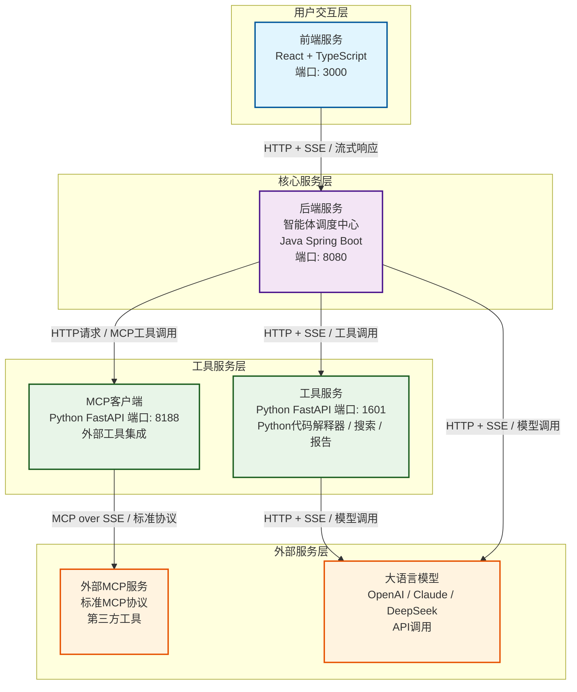

# 2.1.2 服务端流式响应架构设计

**学习目标：** 掌握服务端流式响应的架构设计模式，学会构建可扩展的流式服务架构

## 核心概念定义


在学习完单个AI Agent如何处理流式通信后，本章将从微服务整体架构的角度分析一个Agentic AI应用中流式通信的实际应用。
学习流式通信技术如何实现前后端及相关底层服务的实时数据传输。

从微服务的角度看，整个系统由四个核心服务组成，每个服务都承担特定的职责并通过标准化的通信协议进行交互。


## JoyAgent-JDGenie 流式通信整体架构图


## 微服务架构详析
### 1. 前端界面 (UI - React, Port 3000)

**技术栈**: React + TypeScript + Vite
**主要职责**: 用户交互界面，实时显示智能体执行进度

**通信特点**:
- 使用`@microsoft/fetch-event-source`库建立SSE连接
- 支持POST方法的SSE请求 
- 实现自动重连和错误处理机制
- 实时接收智能体执行状态和结果更新

前端到后端SSE消息格式标准
```json
{
  "requestId": "uuid",
  "query": "用户查询内容", 
  "agentType": 1,
  "isStream": true,
  "files": []
}
```

### 2. 后端服务 (genie-backend - Java Spring Boot, Port 8080)
**技术栈**: Java 17 + Spring Boot + Maven
**主要职责**: 智能体调度中心，流式消息分发中心

**通信特点**:
- 使用Spring的`SseEmitter`实现SSE服务端
- 支持多种消息类型：`tool_thought`、`task`、`plan`、`tool_result`、`result`等
- 实现心跳机制防止连接超时
- 异步处理智能体任务，实时推送执行状态

#### 后端返回前端的SSE消息格式标准
```json
{
  "requestId": "uuid",
  "messageId": "uuid",
  "messageType": "task|plan|tool_result|result",
  "messageTime": "1640995200000",
  "task": "当前执行任务",
  "plan": {"steps": []},
  "toolResult": {"tool": "search", "result": "..."},
  "result": "最终结果",
  "finish": false,
  "isFinal": true,
  "digitalEmployee": "搜索专员"
}

```

### 3. 工具服务 (genie-tool - Python FastAPI, Port 1601)

**技术栈**: Python 3.11 + FastAPI + uvicorn
**主要职责**: 提供智能体工具能力（代码解释、搜索、报告生成等）

**流式模式支持**:
- **general模式**: 实时推送每个数据块
- **token模式**: 累积指定token数量后推送 
- **time模式**: 按时间间隔批量推送

**核心工具**:
- **代码解释器 (code_interpreter)**: Python代码执行与结果流式返回
- **深度搜索 (deep_search)**: 互联网信息检索
- **报告生成 (report)**: HTML/PPT/Markdown报告生成


### 4. MCP客户端 (genie-client - Python FastAPI, Port 8188)  

**技术栈**: Python 3.11 + FastAPI + MCP库
**主要职责**: Model Context Protocol客户端，外部工具集成

**API接口**:
- **`POST /v1/serv/pong`**: 测试MCP服务器连通性
- **`POST /v1/tool/list`**: 获取可用工具列表  
- **`POST /v1/tool/call`**: 调用指定MCP工具

**通信特点**:
- 实现MCP (Model Context Protocol) 标准协议
- 支持与外部MCP服务器的SSE通信
- 提供工具发现和调用能力
- 统一的错误处理和资源清理


工具服务
MCP客户端


在深入架构设计之前，我们需要明确几个核心概念：

### 关键组件说明

#### 1. Printer接口
`Printer`是流式输出的统一抽象接口，负责向客户端发送不同类型的消息：

```java
public interface Printer {
    // 发送普通消息
    void send(String messageType, Object message);
    
    // 发送带标识的消息
    void send(String messageId, String messageType, Object message, Boolean isFinal);
    
    // 关闭流式连接
    void close();
}
```

#### 2. AgentContext上下文
`AgentContext`包含Agent执行过程中需要的所有上下文信息：

```java
public class AgentContext {
    private String requestId;        // 请求唯一标识
    private Printer printer;         // 流式输出器
    private Map<String, Object> parameters;  // 执行参数
    private UserSession userSession; // 用户会话信息
    
    // getter和setter方法...
}
```

#### 3. 架构分层原则
- **控制器层**：处理HTTP请求，管理SSE连接
- **服务层**：业务逻辑处理，数据流转换
- **输出层**：统一的流式数据输出管理

## Spring Boot SSE实现机制详解

### 核心组件解析

Spring Boot 通过 `SseEmitter` 类提供了对 Server-Sent Events 的原生支持。让我们深入了解其实现机制：

#### SseEmitter 生命周期

```java
public class SseEmitter extends ResponseBodyEmitter {
    private final Long timeout;
    
    public SseEmitter(Long timeout) {
        super(timeout);
        this.timeout = timeout;
    }
}
```

SseEmitter 的生命周期包含以下阶段：

1. **创建阶段**：设置超时时间和回调处理器
2. **连接建立**：HTTP连接建立，开始流式传输
3. **数据传输**：通过 `send()` 方法传输数据
4. **连接关闭**：正常完成或异常终止

### 实际项目架构分析

让我们分析实际项目中的流式响应架构实现：

#### 1. 控制器层设计

```java
@RestController
@RequestMapping("/")
public class GenieController {
    private final ScheduledExecutorService executor = Executors.newScheduledThreadPool(5);
    private static final long HEARTBEAT_INTERVAL = 10_000L; // 10秒心跳间隔

    @PostMapping("/AutoAgent")
    public SseEmitter AutoAgent(@RequestBody AgentRequest request) throws UnsupportedEncodingException {
        log.info("{} auto agent request: {}", request.getRequestId(), JSON.toJSONString(request));

        Long AUTO_AGENT_SSE_TIMEOUT = 60 * 60 * 1000L; // 1小时超时
        SseEmitter emitter = new SseEmitter(AUTO_AGENT_SSE_TIMEOUT);
        
        // SSE心跳机制
        ScheduledFuture<?> heartbeatFuture = startHeartbeat(emitter, request.getRequestId());
        
        // 监听SSE事件
        registerSSEMonitor(emitter, request.getRequestId(), heartbeatFuture);
        
        // 异步处理业务逻辑
        ThreadUtil.execute(() -> {
            try {
                // 创建流式输出器
                Printer printer = new SSEPrinter(emitter, request, request.getAgentType());
                
                // 构建Agent上下文
                AgentContext agentContext = buildAgentContext(request, printer);
                
                // 执行业务逻辑
                AgentHandlerService handler = agentHandlerFactory.getHandler(agentContext, request);
                handler.handle(agentContext, request);
                
                // 正常完成
                emitter.complete();
            } catch (Exception e) {
                log.error("{} auto agent error", request.getRequestId(), e);
                emitter.completeWithError(e);
            }
        });

        return emitter;
    }
}
```

#### 2. 心跳机制实现

```java
private ScheduledFuture<?> startHeartbeat(SseEmitter emitter, String requestId) {
    return executor.scheduleAtFixedRate(() -> {
        try {
            // 发送心跳消息
            log.info("{} send heartbeat", requestId);
            emitter.send("heartbeat");
        } catch (Exception e) {
            // 发送心跳失败，关闭连接
            log.error("{} heartbeat failed, closing connection", requestId, e);
            emitter.completeWithError(e);
        }
    }, HEARTBEAT_INTERVAL, HEARTBEAT_INTERVAL, TimeUnit.MILLISECONDS);
}

private void registerSSEMonitor(SseEmitter emitter, String requestId, ScheduledFuture<?> heartbeatFuture) {
    // 正常完成监听
    emitter.onCompletion(() -> {
        log.info("{} SSE connection completed normally", requestId);
        heartbeatFuture.cancel(true);
    });

    // 超时监听
    emitter.onTimeout(() -> {
        log.info("{} SSE connection timed out", requestId);
        heartbeatFuture.cancel(true);
        emitter.complete();
    });

    // 错误监听
    emitter.onError((ex) -> {
        log.info("{} SSE connection error: ", requestId, ex);
        heartbeatFuture.cancel(true);
        emitter.completeWithError(ex);
    });
}
```

### SseEmitter生命周期管理

#### 自定义 UTF-8 编码支持

```java
public class SseEmitterUTF8 extends SseEmitter {
    public SseEmitterUTF8(Long timeout) {
        super(timeout);
    }
    
    @Override
    protected void extendResponse(ServerHttpResponse outputMessage) {
        HttpHeaders headers = outputMessage.getHeaders();
        if (headers.getContentType() == null) {
            headers.setContentType(new MediaType("text", "event-stream", StandardCharsets.UTF_8));
        }
    }
}
```

#### 统一的 SSE 工具类

```java
@Slf4j
public class SseUtil {
    public static SseEmitter build(Long timeout, String requestId) {
        SseEmitter sseEmitter = new SseEmitterUTF8(timeout);
        
        sseEmitter.onError((err)-> {
            log.error("SseSession Error, msg: {}, requestId: {}", err.getMessage(), requestId);
            sseEmitter.completeWithError(err);
        });

        sseEmitter.onTimeout(() -> {
            log.info("SseSession Timeout, requestId : {}", requestId);
            sseEmitter.complete();
        });

        sseEmitter.onCompletion(() -> {
            log.info("SseSession Completion, requestId : {}", requestId);
        });

        return sseEmitter;
    }
}
```

## FastAPI EventSourceResponse流式响应

### 基础实现模式

在 Python 生态中，FastAPI 通过 `EventSourceResponse` 提供 SSE 支持：

```python
from fastapi import FastAPI
from fastapi.responses import EventSourceResponse
from sse_starlette import ServerSentEvent
import asyncio

app = FastAPI()

@app.post("/deepsearch")
async def post_deepsearch(body: DeepSearchRequest):
    """深度搜索端点"""
    deepsearch = DeepSearch(engines=body.search_engines)
    
    async def _stream():
        async for chunk in deepsearch.run(
                query=body.query,
                request_id=body.request_id,
                max_loop=body.max_loop,
                stream=True,
                stream_mode=body.stream_mode,
        ):
            yield ServerSentEvent(data=chunk)
        yield ServerSentEvent(data="[DONE]")

    return EventSourceResponse(
        _stream(), 
        ping_message_factory=lambda: ServerSentEvent(data="heartbeat"), 
        ping=15
    )
```

### 流式生成器模式

```python
class DeepSearch:
    async def run(self, query: str, request_id: str, max_loop: int = 3, 
                 stream: bool = True, stream_mode: str = "all"):
        """流式执行深度搜索"""
        
        # 发送初始状态
        if stream:
            yield self._format_stream_message("status", "开始搜索...", request_id)
        
        search_results = []
        for loop in range(max_loop):
            # 执行搜索步骤
            if stream:
                yield self._format_stream_message(
                    "progress", 
                    f"执行第{loop+1}轮搜索...", 
                    request_id
                )
            
            # 搜索逻辑...
            step_result = await self._search_step(query, loop)
            search_results.append(step_result)
            
            # 流式返回中间结果
            if stream and stream_mode in ["all", "intermediate"]:
                yield self._format_stream_message(
                    "intermediate", 
                    step_result, 
                    request_id
                )
        
        # 生成最终结果
        final_result = await self._generate_final_result(search_results)
        
        if stream:
            yield self._format_stream_message("final", final_result, request_id)
        else:
            return final_result

    def _format_stream_message(self, msg_type: str, data: any, request_id: str) -> str:
        """格式化流式消息"""
        return json.dumps({
            "type": msg_type,
            "data": data,
            "requestId": request_id,
            "timestamp": time.time()
        }, ensure_ascii=False)
```

## 多服务协调的流式数据传递

### 服务间流式通信架构

在微服务架构中，AI应用通常涉及多个服务协作：

```
前端 ←→ API网关 ←→ 业务服务 ←→ AI服务
                              ←→ 工具服务
                              ←→ 数据服务
```

#### HTTP流式代理实现

```java
public class MultiAgentServiceImpl implements IMultiAgentService {
    
    @Override
    public SseEmitter queryMultiAgentIncrStream(GptQueryReq params) {
        // 创建SSE发射器
        SseEmitter sseEmitter = SseUtil.build(60 * 60 * 1000L, params.getRequestId());
        
        // 构建下游请求
        AgentRequest autoReq = buildAgentRequest(params);
        
        // 异步执行流式代理
        ThreadUtil.execute(() -> {
            long startTime = System.currentTimeMillis();
            List<AgentResponse> agentRespList = new ArrayList<>();
            EventResult eventResult = new EventResult();
            
            try (Response response = httpClient.newCall(buildHttpRequest(autoReq)).execute()) {
                if (!response.isSuccessful()) {
                    sseEmitter.completeWithError(new RuntimeException("下游服务调用失败"));
                    return;
                }

                // 流式读取下游响应
                try (BufferedReader reader = new BufferedReader(
                        new InputStreamReader(response.body().byteStream()))) {
                    String line;
                    
                    while ((line = reader.readLine()) != null) {
                        if (!line.startsWith("data:")) {
                            continue;
                        }

                        String data = line.substring(5);
                        
                        // 处理结束标记
                        if (data.equals("[DONE]")) {
                            log.info("{} 数据流结束: {}", autoReq.getRequestId(), data);
                            break;
                        }

                        // 处理心跳消息
                        if (data.startsWith("heartbeat")) {
                            GptProcessResult result = buildHeartbeatData(autoReq.getRequestId());
                            sseEmitter.send(result);
                            continue;
                        }

                        log.info("{} 接收到下游数据: {}", autoReq.getRequestId(), data);
                        
                        // 解析并处理业务数据
                        AgentResponse agentResponse = JSON.parseObject(data, AgentResponse.class);
                        AgentType agentType = AgentType.fromCode(autoReq.getAgentType());
                        AgentResponseHandler handler = handlerMap.get(agentType);
                        
                        // 处理并转发给客户端
                        GptProcessResult result = handler.handle(autoReq, agentResponse, agentRespList, eventResult);
                        sseEmitter.send(result);
                        
                        if (result.isFinished()) {
                            log.info("{} 任务总耗时:{}ms", 
                                autoReq.getRequestId(), 
                                System.currentTimeMillis() - startTime);
                            sseEmitter.complete();
                            break;
                        }
                    }
                }
            } catch (Exception e) {
                log.error("流式代理异常", e);
                sseEmitter.completeWithError(e);
            }
        });

        return sseEmitter;
    }
}
```

### 统一的流式输出接口设计

```java
public interface Printer {
    void send(String messageType, Object message);
    void send(String messageType, Object message, String digitalEmployee);
    void send(String messageId, String messageType, Object message, Boolean isFinal);
    void close();
    void updateAgentType(AgentType agentType);
}

@Slf4j
public class SSEPrinter implements Printer {
    private final SseEmitter emitter;
    private final AgentRequest request;
    private String agentType;

    public SSEPrinter(SseEmitter emitter, AgentRequest request, String agentType) {
        this.emitter = emitter;
        this.request = request;
        this.agentType = agentType;
    }

    @Override
    public void send(String messageId, String messageType, Object message, 
                    String digitalEmployee, Boolean isFinal) {
        try {
            GptProcessResult response = new GptProcessResult();
            response.setRequestId(request.getRequestId());
            response.setMessageId(messageId);
            response.setMessageType(messageType);
            response.setDigitalEmployee(digitalEmployee);
            response.setFinished(isFinal);

            // 根据消息类型处理数据
            switch (messageType) {
                case "plan":
                    response.setPlans((List<Plan>) message);
                    break;
                case "agent_stream":
                    response.setResult((String) message);
                    break;
                case "result":
                    if (message instanceof String) {
                        response.setResult((String) message);
                    } else if (message instanceof Map) {
                        Map<String, Object> taskResult = (Map<String, Object>) message;
                        Object summary = taskResult.get("taskSummary");
                        response.setResultMap(taskResult);
                        response.setResult(summary != null ? summary.toString() : null);
                    }
                    response.getResultMap().put("agentType", agentType);
                    break;
                default:
                    break;
            }

            emitter.send(response);

        } catch (Exception e) {
            log.error("SSE发送错误", e);
        }
    }

    @Override
    public void close() {
        emitter.complete();
    }
}
```

## 异步处理与线程池配置

### 线程池设计原则

在流式响应场景中，合理的线程池配置至关重要：

#### 1. 分层线程池架构

```java
@Configuration
public class ThreadPoolConfig {
    
    /**
     * SSE连接处理线程池
     * 特点：长时间连接，需要较大的核心线程数
     */
    @Bean("sseExecutor")
    public ThreadPoolTaskExecutor sseExecutor() {
        ThreadPoolTaskExecutor executor = new ThreadPoolTaskExecutor();
        executor.setCorePoolSize(20);
        executor.setMaxPoolSize(50);
        executor.setQueueCapacity(100);
        executor.setKeepAliveSeconds(60);
        executor.setThreadNamePrefix("SSE-");
        executor.setRejectedExecutionHandler(new ThreadPoolExecutor.CallerRunsPolicy());
        executor.initialize();
        return executor;
    }
    
    /**
     * AI任务处理线程池
     * 特点：CPU密集型任务，核心线程数=CPU核数
     */
    @Bean("aiTaskExecutor")
    public ThreadPoolTaskExecutor aiTaskExecutor() {
        ThreadPoolTaskExecutor executor = new ThreadPoolTaskExecutor();
        int coreCount = Runtime.getRuntime().availableProcessors();
        executor.setCorePoolSize(coreCount);
        executor.setMaxPoolSize(coreCount * 2);
        executor.setQueueCapacity(200);
        executor.setKeepAliveSeconds(300);
        executor.setThreadNamePrefix("AI-Task-");
        executor.setRejectedExecutionHandler(new ThreadPoolExecutor.AbortPolicy());
        executor.initialize();
        return executor;
    }
    
    /**
     * 心跳调度线程池
     * 特点：定时任务，少量线程即可
     */
    @Bean("heartbeatScheduler")
    public ScheduledThreadPoolExecutor heartbeatScheduler() {
        return new ScheduledThreadPoolExecutor(5, r -> {
            Thread thread = new Thread(r, "Heartbeat-" + System.currentTimeMillis());
            thread.setDaemon(true);
            return thread;
        });
    }
}
```

#### 2. 资源隔离与监控

```java
@Component
public class ThreadPoolMonitor {
    private final MeterRegistry meterRegistry;
    
    @Autowired
    public ThreadPoolMonitor(MeterRegistry meterRegistry) {
        this.meterRegistry = meterRegistry;
    }
    
    @EventListener
    public void handleThreadPoolMetrics(@Qualifier("sseExecutor") ThreadPoolTaskExecutor executor) {
        Gauge.builder("thread.pool.active")
            .tag("pool", "sse")
            .register(meterRegistry, executor, ThreadPoolTaskExecutor::getActiveCount);
            
        Gauge.builder("thread.pool.size")
            .tag("pool", "sse")
            .register(meterRegistry, executor, ThreadPoolTaskExecutor::getPoolSize);
            
        Gauge.builder("thread.pool.queue.size")
            .tag("pool", "sse")
            .register(meterRegistry, executor.getThreadPoolExecutor().getQueue(), Collection::size);
    }
}
```

### 背压控制机制

当下游处理能力不足时，需要实现背压控制：

```java
public class BackPressureSSEPrinter implements Printer {
    private final SseEmitter emitter;
    private final Semaphore semaphore;
    private final AtomicLong pendingMessages;
    
    public BackPressureSSEPrinter(SseEmitter emitter, int maxPendingMessages) {
        this.emitter = emitter;
        this.semaphore = new Semaphore(maxPendingMessages);
        this.pendingMessages = new AtomicLong(0);
    }
    
    @Override
    public void send(String messageType, Object message) {
        try {
            // 获取发送许可
            if (!semaphore.tryAcquire(100, TimeUnit.MILLISECONDS)) {
                log.warn("发送缓冲区已满，丢弃消息: {}", messageType);
                return;
            }
            
            pendingMessages.incrementAndGet();
            
            // 异步发送
            CompletableFuture.runAsync(() -> {
                try {
                    emitter.send(formatMessage(messageType, message));
                } catch (Exception e) {
                    log.error("消息发送失败", e);
                } finally {
                    semaphore.release();
                    pendingMessages.decrementAndGet();
                }
            });
            
        } catch (InterruptedException e) {
            Thread.currentThread().interrupt();
            log.error("发送中断", e);
        }
    }
    
    public long getPendingMessageCount() {
        return pendingMessages.get();
    }
}
```

## 配置与最佳实践

### Spring Boot 配置优化

```yaml
# application.yml
server:
  # 增加最大连接数
  tomcat:
    max-connections: 2000
    threads:
      max: 200
      min-spare: 20
    connection-timeout: 60000

spring:
  # 流式响应相关配置
  mvc:
    async:
      request-timeout: 3600000  # 1小时超时
  
  # 连接池配置
  datasource:
    hikari:
      maximum-pool-size: 20
      minimum-idle: 5
      connection-timeout: 30000
      idle-timeout: 600000

# 自定义配置
genie:
  sse:
    timeout: 3600000
    heartbeat-interval: 10000
    max-concurrent-connections: 1000
  
  thread-pool:
    sse:
      core-size: 20
      max-size: 50
      queue-capacity: 100
    ai-task:
      core-size: 8
      max-size: 16
      queue-capacity: 200
```

### 错误处理与恢复策略

```java
@ControllerAdvice
public class SSEExceptionHandler {
    
    @ExceptionHandler(TokenLimitExceeded.class)
    public void handleTokenLimitExceeded(TokenLimitExceeded e, HttpServletResponse response) {
        try {
            // 构造错误消息
            GptProcessResult errorResult = new GptProcessResult();
            errorResult.setFinished(true);
            errorResult.setError("Token限制已达上限，请稍后重试");
            errorResult.setRequestId(e.getRequestId());
            
            // 通过SSE发送错误消息
            response.setContentType("text/event-stream;charset=UTF-8");
            response.getWriter().write("data: " + JSON.toJSONString(errorResult) + "\n\n");
            response.getWriter().flush();
        } catch (IOException ex) {
            log.error("发送错误消息失败", ex);
        }
    }
}
```

## 小结

服务端流式响应架构设计需要考虑以下关键要素：

1. **生命周期管理**：正确处理连接的建立、维持和关闭
2. **资源隔离**：使用独立的线程池处理不同类型的任务
3. **背压控制**：防止下游处理能力不足导致的系统崩溃
4. **监控与告警**：实时监控连接状态和系统资源使用情况
5. **错误恢复**：优雅处理各种异常情况，确保系统稳定性

在下一节中，我们将探讨客户端如何高效地接收和处理流式数据，实现良好的用户体验。

---

**本节关键要点：**
- Spring Boot SseEmitter 的核心机制和生命周期管理
- FastAPI EventSourceResponse 的实现模式
- 多服务协调中的流式数据传递架构
- 异步处理和线程池的合理配置
- 背压控制和错误恢复策略
