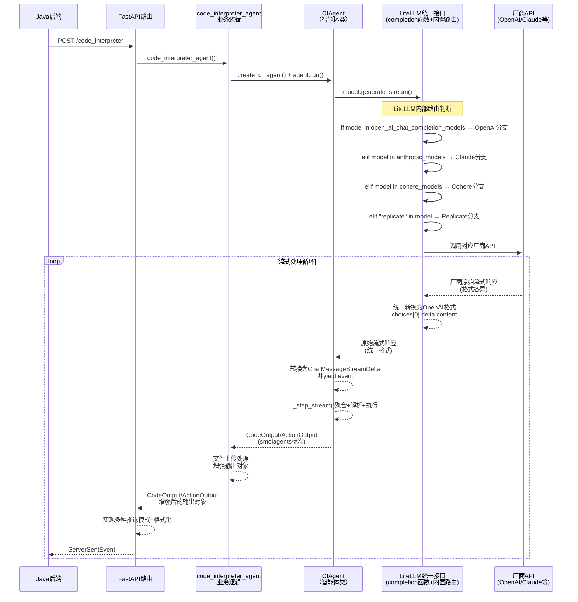

# 2.1.2 构建智能体流式通信服务端

**学习目标：** 理解AI Agent场景下的特殊流式交互需求，掌握构建智能体流式通信服务端


在掌握流式通信基础之后，本节将通过一个实际案例，深入解析如何构建具备完整AI Agent服务能力的流式通信服务端。

我们以京东开源的JDGenie项目中的**genie-tool**为例，剖析其基于 **FastAPI + sse_starlette + LiteLLM + SmoLAgents** 的流式架构设计。

## 一、引言
``` Python
# Please install OpenAI SDK first: `pip3 install openai`
import os
from openai import OpenAI

client = OpenAI(
    api_key=os.environ.get('DEEPSEEK_API_KEY'),
    base_url="https://api.deepseek.com")

response = client.chat.completions.create(
    model="deepseek-chat",
    messages=[
        {"role": "system", "content": "You are a helpful assistant"},
        {"role": "user", "content": "Hello"},
    ],
    stream=True
)

# 流式消费响应
for chunk in response:
    if chunk.choices[0].delta.content:
        print(chunk.choices[0].delta.content, end="", flush=True)
```


-----


这段代码展示了一个最简单的LLM通信示例，这是利用OpenAI SDK调用LLM的最小实现。代码中设置了`stream=True`参数开启了流式响应，但这个基础Demo作为LLM的直接客户端，只具有流式数据的消费能力，并不具备流式消息转发的能力。在实际的AI应用开发中，我们通常需要基于此类LLM客户端构建一个流式消息转发服务，以实现从LLM到前端、后端的完整流式通信链路。接下来，我们将通过genie-tool来学习如何在服务端实现这样的流式转发服务。


## 二、 genie-tool核心技术栈分析

### 2.1 Generator：生成器

什么是生成器？

生成器是一种特殊的函数，它使用 yield 关键字而不是 return 来返回值。当调用生成器函数时，它并不会立即执行函数体中的代码，而是返回一个生成器对象。只有当对这个生成器对象进行迭代时，函数体中的代码才会开始执行，并且每次执行到 yield 语句时，函数会暂停执行，并返回 yield 后面的值。下次迭代时，函数会从暂停的地方继续执行。

下面通过具体代码示例来理解生成器的编程使用：

**1. 普通方法 vs 生成器方法对比**

```python

# 普通方式：使用return一次性返回所有结果

def traditional_method():

	print("开始处理所有步骤...")
	
	results = []
	
	results.append("步骤1完成") # 执行步骤1
	results.append("步骤2完成") # 执行步骤2
	results.append("步骤3完成") # 执行步骤3
	print("所有步骤处理完毕")
	
	return results # 所有步骤完成后才返回

# 生成器方式：使用yield逐步产生结果

def generator_method():

	print("生成器函数被调用")
	yield "步骤1完成" # 第1次迭代：执行到这里暂停，返回结果
	print("从步骤1后继续执行")
	yield "步骤2完成" # 第2次迭代：从暂停处继续，执行到这里再暂停
	print("从步骤2后继续执行")
	yield "步骤3完成" # 第3次迭代：继续执行，返回最后结果
	print("生成器执行完毕")

# 调用对比

# 普通方法调用
results = traditional_method() # 函数立即完整执行
print(f"收到：{results}")


# 生成器方式调用
gen = generator_method() # 只返回生成器对象，函数体未执行
for result in gen: # 开始迭代时才逐步执行
	print(f"实时收到：{result}") # 每次yield都能立即收到结果

```

更详细的解释，大家可以查阅开发语言中迭代器和生成器的相关语法知识，在此不再赘述。

**生成器在本案例中的应用：**
在基于LLM开发AI应用这个场景中， **LLM的返回数据是整个生成器迭代的核心触发器**：

```python

# LLM输出驱动Generator的执行流程

def _step_stream(self, memory_step: ActionStep):

	# 1. 调用LLM获取流式输出（数据源头）
	
	output_stream = self.model.generate_stream(memory_messages)
	
	# 2. LLM的每个数据片段驱动Generator迭代
	
	for event in output_stream: # ← LLM数据驱动迭代
	    # 3.个性化处理 例如：积累LLM响应
	    some_method(event)
	    # 4.转发LLM数据
		yield event 
		
		# 5. LLM流结束后，触发后续业务逻辑
		
		# 聚合LLM完整响应 → 解析代码 → 执行代码 → 生成结构化输出
		
		yield ToolCall(...) # 生成工具调用事件
		
		yield CodeOutput(...) # 生成代码输出事件
		
		yield ActionOutput(...) # 生成最终结果事件

```

**LLM驱动机制的关键特点：**
- **被动响应式**：Generator不主动产生数据，而是响应LLM的输出节奏
- **实时传递**：LLM每产生一个数据片段，Generator立即处理后yield转发
- **分阶段处理**：LLM流结束后，Generator进入业务逻辑处理阶段
- **事件驱动**：整个流程由LLM的数据到达事件来驱动推进


通过上述机制，Generator成为了"**流式数据的智能路由器**"，既保证了LLM输出的实时性，又实现了业务逻辑的结构化输出。其核心价值体现在以下四个方面：

| 功能维度        | 角色定位    | 具体作用                           |
| ----------- | ------- | ------------------------------ |
| **流式数据聚合**  | 智能数据收集器 | 将LLM的碎片化输出聚合为完整的语义单元           |
| **流式数据转发**  | 实时响应管道  | 零延迟传递LLM输出，保障用户体验的即时性          |
| **多类型事件生成** | 事件分发中心  | 从单一LLM输出派生出多种业务事件类型（思考、代码、结果等） |
| **复杂业务编排**  | 流程控制器   | 串联代码生成、沙箱执行、结果校验的完整流水线         |

### 2.2 FastAPI：现代化的高性能 Python Web 框架

FastAPI作为服务端框架，核心特性之一是对异步编程的原生支持。通过使用async和await，FastAPI能够高效处理 I/O 密集型任务，如数据库查询、API 调用和文件操作。作为Web应用开发的基础技术，在此不做赘述。

### 2.3 sse_starlette：提供标准的Server-Sent Events协议实现

sse_starlette 是一个Python库，为 Starlette 和 FastAPI 框架提供对 Server-Sent Events的支持。它通过 EventSourceResponse 类实现SSE协议，允许服务器异步向客户端推送实时数据，适合构建实时Web应用，如通知系统、实时仪表盘或流式数据更新。sse_starlette轻量且与ASGI框架无缝集成，常用于需要高效单向通信的场景。


**sse_starlette在本案例中的作用**
SSE 支持：为FastAPI 提供标准化的 SSE 实现，基于 HTML5 EventSource API
实时数据推送：支持服务器到客户端的单向数据流，适合实时更新。
消息格式化： 自动将Python对象转换为SSE标准格式
高性能：利用 asyncio 和 anyio 的异步任务组（TaskGroups），确保高效并发
易于集成：与FastAPI无缝兼容，支持自定义事件和头部
连接管理： 处理HTTP连接、心跳、错误恢复等


### 2.4 LiteLLM：统一LLM客户端接口

**不同厂商接口差异示例：**

不同LLM提供商的API接口在返回格式、字段命名、数据结构等方面存在显著差异，这给多模型集成带来了挑战：

1. **流式响应格式差异**
   - **OpenAI**: 使用SSE格式，数据字段为`data: {"choices": [{"delta": {"content": "..."}}]}`
   - **Claude (Anthropic)**: 使用不同的事件类型，如`content_block_delta`、`message_delta`等
   - **千问/文心一言**: 返回格式与OpenAI类似但字段名称可能不同，如使用`result`替代`choices`

2. **认证方式差异**
   - **OpenAI**: 使用`Authorization: Bearer <token>`头部认证
   - **Claude**: 使用`x-api-key`头部字段
   - **国内厂商**: 可能使用API Key + Secret签名机制

3. **参数命名差异**
   - **温度参数**: 有的叫`temperature`，有的叫`temp`
   - **最大token数**: `max_tokens` vs `max_output_tokens` vs `max_new_tokens`
   - **流式开关**: `stream` vs `incremental_output`

4. **错误响应格式差异**
   - **OpenAI**: `{"error": {"message": "...", "type": "...", "code": "..."}}`
   - **其他厂商**: 可能使用`error_msg`、`err_msg`或完全不同的结构

为了解决上述厂商差异问题，开源社区诞生了`litellm`这类统一接口层工具。

`litellm`是一个强大的Python库，它屏蔽了不同LLM提供商的API差异，让开发者可以使用统一的OpenAI格式调用100+种模型，包括OpenAI、Claude、DeepSeek、Gemini，以及Bedrock、VertexAI、Azure等云平台。

**核心功能：**

| 功能分类 | 说明 |
|---------|------|
| **输入适配** | 自动将请求转换为各提供商的completion、embedding、image_generation端点格式 |
| **输出标准化** | 响应统一通过`['choices'][0]['message']['content']`获取，无论底层使用哪个模型 |
| **参数映射** | 自动处理不同模型间的参数命名差异（如`max_tokens` vs `max_output_tokens`） |
| **错误统一** | 将各厂商的错误响应标准化为统一格式 |
| **路由降级** | 支持跨部署（如Azure/OpenAI）的故障转移和重试逻辑 |
| **预算限流** | 可按项目、API Key、模型维度设置预算和速率限制 |

**litellm在本案例中的作用：**

- **多模型无缝切换**：业务代码无需感知底层模型差异，通过配置即可在OpenAI、Claude、DeepSeek等模型间自由切换
- **流式响应标准化**：统一处理不同厂商的流式输出格式，确保前端获得一致的SSE数据结构
- **迁移成本低**：厂商迁移只需修改配置，代码无感知
- **统一运维**：便于实现统一的监控、日志和成本管理


### 2.5 SmoLAgents：专业的Agent框架

SmoLAgents是Hugging Face于2024年底开源的轻量级Agent框架，其设计理念是"**简洁而不简单**"——用最少的代码实现最完整的智能体能力。相比LangChain等重量级框架，SmoLAgents的核心代码仅约1000行，却提供了构建生产级Agent所需的全部核心功能。

**框架定位与设计哲学：**
- **极简主义**：遵循"少即是多"的设计原则，避免过度抽象，让开发者能快速理解和掌控整个框架
- **代码优先（Code-First）**：推崇通过代码生成和执行来解决问题，而非纯粹的提示词工程
- **透明可调试**：每个推理步骤都清晰可见，便于开发者理解Agent的决策过程

**核心特性：**
- **双模式Agent架构**：
  - `CodeAgent`：通过生成并执行Python代码来完成任务，适合数据处理、计算等场景
  - `ToolCallingAgent`：通过JSON格式的工具调用完成任务，兼容OpenAI Function Calling规范
- **ReAct推理模式**：实现"思考(Thought)-行动(Action)-观察(Observation)"的完整推理循环，支持多轮迭代直至任务完成
- **内置安全沙箱**：代码执行在隔离环境中进行，支持本地沙箱和远程E2B执行器
- **流式输出支持**：原生支持流式输出和步骤级控制，可实时追踪Agent的思考和执行过程
- **丰富的工具生态**：内置网页搜索、Python解释器、文件操作等常用工具，同时支持快速自定义工具

**SmoLAgents在本案例中的作用：**
JDGenie项目基于SmoLAgents构建了代码解释器智能体，利用其ReAct框架实现了：
- 自然语言任务分析
- 代码生成与执行
- 结果验证与迭代优化
- 完整的流式交互体验


genie-tool服务提供了多个API接口，其中 `/code_interpreter` 接口是整个项目的核心AI能力入口。该接口实现了**"自然语言驱动的智能代码生成与执行"**——用户只需用自然语言描述数据分析需求，AI便能自动生成并执行相应的Python代码。接下来，我们将以这个接口为例，深入剖析其完整的流式架构实现。


## 三、 genie-tool服务分层架构速览（`/code_interpreter`）

| 层级      | 核心模块                      | 主要职责                                                                                                                                                                   | 输入类型             | 输出类型                                                                |
| ------- | ------------------------- | ---------------------------------------------------------------------------------------------------------------------------------------------------------------------- | ---------------- | ------------------------------------------------------------------- |
| **第1层** | FastAPI + sse_starlette   | HTTP请求处理、SSE响应                                                                                                                                                         | CIRequest        | ServerSentEvent                                                     |
| **第2层** | code_interpreter_agent.py | 业务逻辑处理、任务协调、文件处理 、创建智能体                                                                                                                                                | 任务参数             | 自定义的增强对象CodeOutput (包含代码文件下载链接)/ActionOutput (包含执行结果 + 所有生成文件的下载链接) |
| **第3层** | CIAgent                   | 智能体运行、代码生成、代码执行                                                                                                                                                        | 任务参数、提示词         | 使用smolagents标准对象 CodeOutput/ActionOutput                            |
| **第4层** | LiteLLM                   | **统一入口函数**：接收标准化参数<br/>**智能路由**：根据model参数判断厂商，调用对应厂商的接口， **格式转换**：统一API响应格式<br/>• OpenAI: 直接返回<br/>• Claude: `delta.text` → `choices[0].delta.content`<br/>• 其他厂商格式标准化 | 消息数组 + 模型参数      | 统一格式的流式JSON                                                         |
| **第5层** | 厂商API                     | 提供原始LLM能力：OpenAI、Anthropic、Cohere、Replicate等                                                                                                                           | 消息数组（提示词）、厂商特定参数 | 流式JSON （各厂商原始格式）                                                    |


##  四、 完整genie-tool接口code_interpreter时序图

下图展示了 `/code_interpreter` 接口从请求发起到流式响应返回的完整调用链路。整个流程涉及5个核心层级：Java后端发起HTTP请求 → FastAPI路由层接收并处理 → 业务逻辑层创建智能体 → CIAgent执行ReAct推理 → LiteLLM智能路由到对应厂商API。流式响应则沿相反方向逐层传递，最终以SSE格式推送给调用方。



## 五、服务分层详解

本节通过简化代码片段，深入分析 `code_interpreter` 接口的5层流式架构实现机制：

### 5.1 第1层：FastAPI路由
```python
# genie-tool/api/tool.py
@router.post("/code_interpreter") 
async def post_code_interpreter(body: CIRequest):
    # 文件路径预处理
    if body.file_names:
        # 标准化文件路径为完整URL
        
    async def _stream():
        # 流式推送模式控制变量
        acc_content, acc_token, acc_time = "", 0, time.time()
        
        async for chunk in code_interpreter_agent(  # 调用第2层
            task=body.task,
            file_names=body.file_names, 
            request_id=body.request_id,
            stream=True  # 流式开关
        ):
            # 根据chunk类型分别处理
            if isinstance(chunk, CodeOuput):  # 代码生成
                yield ServerSentEvent(data={code, fileInfo, isFinal=False})
            elif isinstance(chunk, ActionOutput):  # 执行结果  
                yield ServerSentEvent(data={codeOutput, fileInfo, isFinal=True})
                yield ServerSentEvent(data="[DONE]")
            else:  # 文本流
                # 支持多种推送模式：general/token/time
                yield ServerSentEvent(data={requestId, data=chunk})
    
    return EventSourceResponse(_stream())
```

**第1层的核心职责：**
- **HTTP请求接入** - 处理POST请求和参数验证
- **文件路径预处理** - 标准化文件URL格式
- **流式响应控制** - 管理SSE流式推送的多种推送策略
- **数据类型转换** - 将业务对象转换为SSE格式
- **会话管理** - 通过requestId跟踪请求状态
- **推送模式控制** - 支持general/token/time三种推送策略

### 5.2 第2层：code_interpreter_agent处理业务逻辑
```python
# genie_tool/tool/code_interpreter.py
async def code_interpreter_agent(task, file_names, request_id, stream=True):
    # 1. 文件下载和预处理
    files = await download_files_if_needed(file_names)
    
    # 2. 创建CIAgent智能体
    agent = create_ci_agent(
        prompt_templates=ci_prompt_template,
        max_tokens=max_tokens,
        return_full_result=True,
        output_dir=output_dir,
    )
    
    # 3. 构建任务模板
    template_task = Template(ci_prompt_template["task_template"]).render(
        files=files, task=task, output_dir=output_dir
    )
    
    # 4. 流式运行智能体
    if stream:
        for step in agent.run(task=template_task, stream=True, max_steps=10):
            if isinstance(step, CodeOuput):  # 代码生成步骤
                # 文件上传处理
                step.file_list = [await upload_file(...)]
                yield step
            elif isinstance(step, FinalAnswerStep):  # 最终结果
                # 收集所有生成文件并上传
                yield ActionOutput(content=step.answer, file_list=all_files)
            else:  # 文本流直接传递
                yield step
def create_ci_agent(...) -> CIAgent:
    # 1. 创建LLM模型实例
    model = LiteLLMModel(
        max_tokens=max_tokens,
        model_id=os.getenv("CODE_INTEPRETER_MODEL", "gpt-4.1")  # 模型配置
    )
    
    # 2. 构建CIAgent智能体
    return CIAgent(
        model=model,                              # LLM调用层
        prompt_templates=prompt_templates,        # 提示词模板
        tools=[PythonInterpreterTool()],         # 工具集成
        return_full_result=True,                 # 完整结果开关
        additional_authorized_imports=[...],     # 预授权包导入
        output_dir=output_dir,                   # 输出目录
    )

```

**第2层的核心职责：**
- **智能体管理** - 创建和配置CIAgent实例
- **任务协调** - 构建任务模板和提示词工程
- **文件处理** - 下载输入文件、上传生成文件
- **智能体运行** -  触发智能体运行
- **流式控制** - 管理智能体的流式运行模式
- **数据增强** - 将CIAgent输出转换为业务增强对象
- **步骤分发** - 根据步骤类型进行差异化处理


### 5.3 第3层：CIAgent 智能体类

```python
# genie_tool/tool/ci_agent.py

# CIAgent类构造方法
class CIAgent(CodeAgent):
    def __init__(
        self,
        tools: list[Tool],
        model: Model,
        prompt_templates: PromptTemplates | None = None,
        additional_authorized_imports: list[str] | None = None,
        planning_interval: int | None = None,
        executor_type: str | None = "local",
        output_dir: Optional[str] = None,
        *args, **kwargs,
    ):
        self.output_dir = output_dir  # 输出目录设置
        # 调用父类构造方法，继承CodeAgent能力
        super().__init__(
            tools=tools,                    # 工具列表
            model=model,                    # LLM模型
            prompt_templates=prompt_templates,  # 提示词模板
            additional_authorized_imports=additional_authorized_imports,  # 预授权导入
            planning_interval=planning_interval,  # 规划间隔
            executor_type=executor_type,    # 执行器类型
            **kwargs,
        )
    
    # 按需重写父类_step_stream方法，实现分阶段流式输出、**性能监控**、自定义完成判断
    @timer()
    def _step_stream(self, memory_step: ActionStep) -> Generator[
        ChatMessageStreamDelta | ToolCall | ToolOutput | ActionOutput | CodeOuput
    ]:
        """ReAct框架的核心步骤：思考→行动→观察"""
        # 1. 构建记忆消息并调用LLM流式生成
        memory_messages = self.write_memory_to_messages()
        output_stream = self.model.generate_stream(
            memory_messages,
            extra_headers={"x-ms-client-request-id": model_request_id}
        )
        
        # 2. 流式处理和消息聚合
        chat_message_stream_deltas = []
        for event in output_stream:
            chat_message_stream_deltas.append(event)
            yield event  # → ChatMessageStreamDelta 实时文本流
            
        # 3. 聚合完整消息并解析代码块
        chat_message = agglomerate_stream_deltas(chat_message_stream_deltas)
        code_action = parse_code_blobs(chat_message.content)
        
        # 4. 创建工具调用并执行Python代码
        memory_step.tool_calls = [ToolCall(name="python_interpreter", ...)]
        _, execution_logs, _ = self.python_executor(code_action)
        
        # 5. 返回代码生成结果
        yield CodeOuput(code=code_action, file_name=file_name)  # → 代码生成结果
        
        # 6. 最终答案检查和输出
        finalObj = FinalAnswerCheck(
            input_messages=self.input_messages,
            execution_logs=execution_logs,
            model=self.model, task=self.task, ...
        )
        finalFlag, exeLog = finalObj.check_is_final_answer()
        yield ActionOutput(output=exeLog, is_final_answer=finalFlag)  # → 最终执行结果
```

**第3层的核心职责：**
- **智能体定义** - 基于smolagents框架自定义继承CodeAgent的CIAgent类
- **ReAct执行** - 实现思考→行动→观察的推理框架
- **流式处理** - 将LLM流转换为结构化对象
- **智能编程** - 根据任务需求生成符合逻辑的Python代码
- **代码执行** - 集成Python解释器进行代码运行
- **工具管理** - 管理各种外部工具调用

### 5.4 第4层：LiteLLM统一调用层

#### 5.4.1 主入口函数 - completion()
```python
# site-packages/litellm/main.py:80-294
def completion(
    model, messages,  # 必需参数
    functions=[], temperature=1, top_p=1, stream=False, max_tokens=float('inf'),
    api_key=None, azure=False, logger_fn=None, **kwargs
):
    # 获取可选参数
    optional_params = get_optional_params(functions, temperature, stream, ...)
    
    # 🔄 核心路由逻辑开始
    if azure == True:
        # Azure OpenAI 专用分支
        return azure_openai_call(model, messages, optional_params)
    elif model in litellm.open_ai_chat_completion_models:
        # OpenAI Chat 模型分支  
        return openai_chat_call(model, messages, optional_params)
    elif model in litellm.open_ai_text_completion_models:
        # OpenAI Text 模型分支
        return openai_text_call(model, messages, optional_params)
    elif "replicate" in model:
        # Replicate 模型分支
        return replicate_call(model, messages, optional_params)
    elif model in litellm.anthropic_models:
        # Anthropic Claude 分支
        return anthropic_call(model, messages, optional_params)
    elif model in litellm.cohere_models:
        # Cohere 模型分支
        return cohere_call(model, messages, optional_params)
    else:
        raise ValueError(f"No valid completion model: {model}")
```

#### 5.4.2 模型路由配置 - 厂商判断依据
```python
# site-packages/litellm/__init__.py:30-65

# OpenAI Chat 模型列表
open_ai_chat_completion_models = [
    "gpt-4", "gpt-4-0613", "gpt-4-32k", "gpt-4-32k-0613",
    "gpt-3.5-turbo", "gpt-3.5-turbo-16k", "gpt-3.5-turbo-0613"
]

# Anthropic 模型列表  
anthropic_models = ["claude-2", "claude-instant-1"]

# Cohere 模型列表
cohere_models = ["command-nightly", "command", "command-light"]

# Replicate 模型判断：任何包含 "replicate/" 的模型名
replicate_models = ["replicate/"]  # 前缀匹配
```

#### 5.4.3 各厂商API调用实现详解

**🔹 OpenAI 调用分支（第123-148行）**
```python
elif model in litellm.open_ai_chat_completion_models:
    # 1. API配置
    openai.api_type = "openai"
    openai.api_base = "https://api.openai.com/v1"
    openai.api_key = api_key or os.environ.get("OPENAI_API_KEY")
    
    # 2. 直接调用OpenAI原生接口
    response = openai.ChatCompletion.create(
        model=model,
        messages=messages,
        **optional_params  # stream=True, max_tokens, temperature等
    )
    return response  # 🎯 原生OpenAI格式，无需转换
```

**🔹 Anthropic Claude 调用分支（第212-255行）**
```python
elif model in litellm.anthropic_models:
    # 1. API密钥配置
    os.environ["ANTHROPIC_API_KEY"] = api_key or litellm.anthropic_key
    
    # 2. 消息格式转换：OpenAI → Anthropic
    prompt = f"{HUMAN_PROMPT}"
    for message in messages:
        if message["role"] == "user":
            prompt += f"{HUMAN_PROMPT}{message['content']}"
        else:
            prompt += f"{AI_PROMPT}{message['content']}"
    prompt += f"{AI_PROMPT}"
    
    # 3. 调用Anthropic原生接口
    anthropic = Anthropic()
    completion = anthropic.completions.create(
        model=model,
        prompt=prompt,  # 🔄 已转换格式
        max_tokens_to_sample=max_tokens
    )
    
    # 4. 响应格式转换：Anthropic → OpenAI
    new_response = {
        "choices": [{
            "finish_reason": "stop",
            "message": {
                "content": completion.completion,  # 🔄 提取内容
                "role": "assistant"
            }
        }]
    }
    return new_response  # 🎯 统一OpenAI格式
```


#### 5.4.4 CIAgent集成调用示例
```python
# genie_tool/tool/code_interpreter.py:119-122
model = LiteLLMModel(
    max_tokens=max_tokens,
    model_id=os.getenv("CODE_INTEPRETER_MODEL", "gpt-4")  # 🎯 模型名触发路由
)

# CIAgent内部流式调用
output_stream = self.model.generate_stream(
    memory_messages,
    extra_headers={"x-ms-client-request-id": model_request_id}
)
```

**第4层的核心职责：**
- **智能路由** - 基于模型名称自动选择正确的厂商API
- **格式转换** - 双向转换：输入格式适配 + 输出格式统一
- **认证管理** - 统一处理各厂商的API密钥和认证方式
- **流式支持** - 保持各厂商流式响应的实时性
- **异常统一** - 将不同厂商的异常映射为统一的错误类型
- **标准化输出** - 确保所有响应都符合OpenAI格式：`choices[0].message.content`

### 5.5 第5层：原始LLM API服务
```python
# OpenAI API / Claude API / DeepSeek API / 其他厂商API

# 原始API调用示例
POST https://api.openai.com/v1/chat/completions
{
    "model": "gpt-4-turbo",
    "messages": [...],
    "stream": true,  # 流式开关
    "max_tokens": 16000
}

# 流式响应格式（各厂商结构不同）
data: {"id":"chatcmpl-xxx","object":"chat.completion.chunk","choices":[{"delta":{"content":"Hello"}}]}
data: {"id":"chatcmpl-xxx","object":"chat.completion.chunk","choices":[{"delta":{"content":" world"}}]}
data: [DONE]

# 不同厂商的响应差异
OpenAI: choices[0].delta.content
Claude: delta.text  
DeepSeek: choices[0].delta.content
```

**第5层的核心职责：**
- **原始LLM能力** - 提供基础的语言理解和生成能力
- **流式响应** - 支持实时流式文本生成
- **多模态支持** - 部分模型支持文本、图像、音频等多种输入
- **参数控制** - 通过temperature、top_p等参数控制生成质量
- **令牌管理** - 管理输入输出的token消耗和限制
- **厂商差异** - 不同厂商在API格式、能力边界上存在差异


## 六、小结

本节以京东开源的genie-tool服务为例，深入剖析了单智能体流式通信服务端的完整实现架构。核心要点如下：

**关键技术选型**：

本案例涉及的关键技术可分为两类：

| 类型 | 技术 | 定位 | 核心作用 |
|------|------|------|----------|
| **编程语法** | Generator（生成器） | Python语言特性 | 基于`yield`关键字实现流式数据的惰性生成与传递，是整个流式链路的"数据流转管道" |
| **框架/库** | FastAPI | Web服务框架 | 提供高性能异步HTTP服务 |
| **框架/库** | sse_starlette | SSE协议库 | 实现标准Server-Sent Events协议 |
| **框架/库** | LiteLLM | LLM统一接口库 | 屏蔽多厂商API差异，统一调用接口 |
| **框架/库** | SmoLAgents | Agent推理框架 | 提供ReAct推理循环和工具调用能力 |

其中，**Generator是一种编程语法而非框架**——它不需要安装任何依赖，而是Python语言内置的特性。Generator通过`yield`关键字实现了"按需生成、逐步传递"的流式数据处理模式，是贯穿整个5层架构的核心数据传输机制。每一层通过Generator接收上游数据、处理后再`yield`给下游，形成完整的流式数据管道。

**五层架构设计**：
- **第1层（FastAPI路由）**：负责HTTP请求接入和SSE流式响应输出，支持多种推送策略
- **第2层（业务逻辑层）**：协调智能体创建、任务模板构建和文件处理
- **第3层（CIAgent智能体）**：执行ReAct推理循环，完成代码生成与执行
- **第4层（LiteLLM）**：智能路由到不同厂商API，统一输入输出格式
- **第5层（厂商API）**：提供原始的大模型生成与推理能力

**流式数据流转**：请求自上而下逐层调用，流式响应自下而上逐层传递。每一层通过Generator对数据进行适当的转换和增强，最终以SSE格式实时推送给调用方，实现了从LLM到调用方的完整流式通信链路。

这种分层架构的优势在于：**职责清晰、易于扩展、便于维护**。当需要切换LLM厂商时只需修改配置，当需要增强业务能力时只需扩展对应层级，体现了良好的工程化设计思想。


