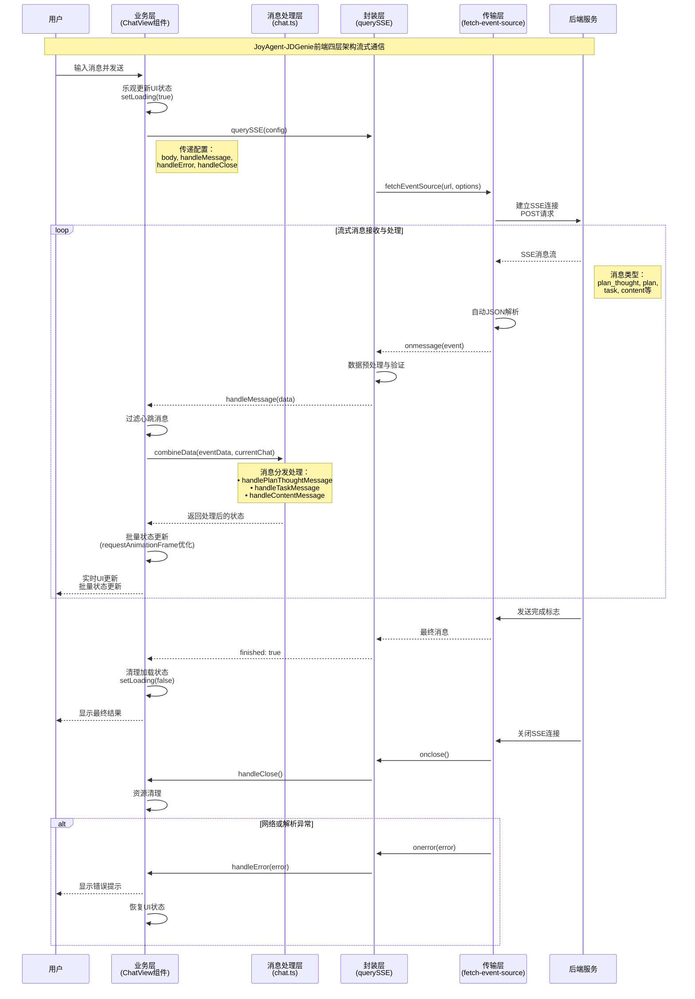

# 2.1.3 客户端流式数据接收与实时内容渲染

**学习目标：** 学会在前端实现稳定可靠的流式数据接收，掌握流式UI更新的最佳实践

在上一章我们学习了流式通信服务端的构建，本章将聚焦客户端的流式数据接收处理。在AI应用场景中，用户期望看到模型推理过程的实时反馈，而非等待最终结果的"黑盒"体验——流式通信技术正是解决这一痛点的关键。

本章将以JoyAgent-JDGenie项目的前端实现为实战案例，基于 **@microsoft/fetch-event-source + React + TypeScript** 技术栈，深入剖析如何构建**稳定可靠、高性能**的流式通信客户端系统，包括其四层架构设计和实时内容渲染机制。

## 一、引言

```typescript
// 非流式通信的局限性
const response = await fetch('/api/chat', {
  method: 'POST',
  body: JSON.stringify({message: "Hello AI"}),
});
const data = await response.json();
// ❌ 用户需要等待完整响应
// ❌ 大量数据时响应时间过长

// 流式通信的用户体验突破
import { fetchEventSource } from '@microsoft/fetch-event-source';
fetchEventSource('/api/chat-stream', {
  method: 'POST',
  body: JSON.stringify({message: "Hello AI"}),
  onmessage(event) {
    // ✅ 实时接收AI的思考片段
    // ✅ 逐字符显示，打字机效果
    // ✅ 长时间任务不再是"黑盒"
    console.log('实时接收:', event.data);
  }
});
```

------

上述代码对比展示了前端非流式通信与流式通信的根本差异。在AI应用场景中，用户不再需要盯着转圈的Loading动画，而是能够实时观察AI的推理过程、任务执行进度和中间结果。但要实现这样的用户体验，需要构建一套完整的前端流式通信架构。接下来，我们将通过JoyAgent-JDGenie项目学习如何在客户端实现这样的流式交互系统。

## 二、JoyAgent-JDGenie客户端核心技术栈分析

### 2.1 fetch-event-source：增强的SSE客户端库

什么是fetch-event-source？

`@microsoft/fetch-event-source`是Microsoft开源的增强型SSE客户端库，它解决了浏览器原生EventSource API的核心局限性。相比原生实现，它提供了更强大的配置能力和更可靠的连接管理。其诞生背景与原生EventSource API的差异，我们已经在第一章中详细讨论了，在此不再赘述。

**fetch-event-source在本案例中的作用：**

- **增强HTTP能力**：支持POST请求和自定义请求头，适配RESTful API设计
- **认证集成**：通过credentials参数支持Cookie和Token认证
- **可靠连接**：内置自动重连机制，提供稳定的长连接保障
- **事件驱动**：基于事件回调的设计，与React生命周期完美集成

### 2.2 TypeScript：类型安全的开发体验

TypeScript作为静态类型语言，在复杂的流式通信场景中提供了关键的类型安全保障。特别是在处理多种SSE消息类型时，TypeScript能够在编译期发现类型错误，大幅提升开发效率。

**复杂消息类型的类型定义：**

```typescript
// 基于JoyAgent-JDGenie项目的真实类型定义

declare global {
  namespace MESSAGE {
    // 基础类型：计划状态枚举
    type PlanStatus = 'not_started' | 'in_progress' | 'completed'

    // 工具执行结果类型
    type ToolResult = {
      toolName: string
      toolResult: string
      toolParam?: {
        query: string
      }
    }

    // 接口数据：消息条目类型
    type MsgItem = {
      logId: number
      name: string
      createTime: string
      sessionId: string
      requestId: string
      question: Question     // 用户问题
      answer: Answer         // AI回答
      taskStatus: number
    }

    // 流式响应接口：核心SSE消息结构
    interface Answer {
      status: string         // 业务状态
      finished: boolean      // 流式传输完成标志
      resultMap: ResultMap   // 核心结果数据
      packageType: string    // "heartbeat" | "data"
      errorMsg: string       // 错误信息
      useTokens: number      // 消耗token数量
    }

    // 多智能体数据结构
    interface MultiAgent {
      tasks: Task[][]        // 二维任务数组
      plan?: Plan           // 执行计划
      plan_thought?: string  // 计划思考过程
    }
  }
}
```

**TypeScript在本案例中的价值：**

- **消息类型约束**：确保SSE消息处理的类型正确性
- **编译期检查**：在开发阶段发现潜在的类型错误
- **智能提示**：IDE提供完整的代码补全和类型提示
- **重构安全**：大规模代码重构时的类型保障

### 2.3 React Hooks：响应式状态管理

什么是React Hooks？

React Hooks是React 16.8引入的革命性特性，它让函数式组件也能够拥有状态管理和生命周期能力。在流式通信场景中，Hooks提供了优雅的状态管理方案，能够高效处理频繁的状态更新和组件重渲染，是构建现代React应用的核心技术。

**Hooks vs 类组件的核心差异：**

```typescript
// ❌ 传统类组件：逻辑分散，this绑定复杂
class ChatViewClass extends React.Component {
  state = { taskList: [], loading: false };
  
  componentDidMount() { this.initializeChat(); }
  componentWillUnmount() { this.cleanup(); }
  
  handleMessage = (data) => {
    this.setState({ taskList: newTaskList, loading: false });
  }
}

// ✅ Hooks函数组件：逻辑集中，代码简洁
const ChatView = () => {
  const [taskList, setTaskList] = useState([]);
  const [loading, setLoading] = useState(false);

  useEffect(() => {
    initializeChat();
    return () => cleanup();  // 清理逻辑就近放置
  }, []);

  const handleMessage = useCallback((data) => {
    setTaskList(newTaskList);
    setLoading(false);
  }, []);
};
```

**核心Hooks在流式通信中的应用：**

**1. useState - 状态管理**
```typescript
const [taskList, setTaskList] = useState<MESSAGE.Task[]>([]);
const [loading, setLoading] = useState(false);

// 批处理优化：React自动合并多个状态更新
const handleMessage = (data: MESSAGE.Answer) => {
  setTaskList(newTaskList);
  setLoading(false);
  setPlan(newPlan);
  // 自动合并为1次重渲染
};
```

**2. useRef - 跨渲染数据存储**
```typescript
const chatList = useRef<CHAT.ChatItem[]>([]);
const abortController = useRef<AbortController>();

// 不触发重渲染的数据更新
const handleMessage = useCallback((data) => {
  chatList.current = [...chatList.current, newMessage];
}, []);
```

**3. useCallback & useMemo - 性能优化**
```typescript
// 缓存函数，避免子组件重渲染
const sendMessage = useCallback((inputInfo) => {
  querySSE({ body: params, handleMessage });
}, [sessionId]);

// 缓存计算结果
const processedTasks = useMemo(() => 
  taskList.filter(task => task.visible)
, [taskList]);
```

**4. useEffect - 副作用管理**
```typescript
// SSE连接管理
useEffect(() => {
  const controller = new AbortController();
  
  querySSE({
    body: params,
    signal: controller.signal,
    handleMessage: (data) => handleMessage(data)
  });

  return () => controller.abort();  // 自动清理
}, [params]);
```

**React Hooks在本案例中的核心价值：**

- **🔄 响应式状态管理**：实时响应SSE消息，动态更新UI状态
- **⚡ 性能优化**：通过useCallback、useMemo避免不必要的重渲染  
- **🛡️ 资源管理**：自动处理组件生命周期，防止内存泄漏
- **🧩 逻辑复用**：通过自定义Hook封装流式通信逻辑
- **💡 代码简化**：函数式编程，相比类组件减少50%代码量

### 2.4 TypeWriter机制：打字机效果

TypeWriter（打字机效果）是JoyAgent-JDGenie中的核心用户体验组件，它将流式接收的文本数据转换为逐字符渐进显示的效果，模拟真人输入体验。

**TypeWriterCore核心实现：**

```typescript
class TypeWriterCore {
  onConsume: (str: string) => void;
  queueList: string[] = [];        // 字符队列
  maxStepSeconds: number = 50;     // 基础渲染间隔
  maxQueueNum: number = 2000;      // 队列最大容量
  timer: NodeJS.Timeout | null = null;

  // 🧮 动态速度调整算法
  dynamicSpeed(): number {
    const speedQueueNum = this.maxQueueNum / this.queueList.length;
    return Math.max(
      Math.min(speedQueueNum, this.maxStepSeconds), 
      10 // 最小间隔10ms保证流畅度
    );
  }

  // 📝 逐字符渐进式渲染
  next(): void {
    this.timer = setTimeout(() => {
      if (this.queueList.length > 0) {
        const char = this.queueList.shift();
        char && this.onConsume(char);  // 逐字符输出
        this.next();                   // 递归调用
      }
    }, this.dynamicSpeed());
  }

  // 📦 添加新内容到渲染队列
  add(text: string): void {
    const chars = text.split('');
    this.queueList.push(...chars);
    
    if (!this.timer) {
      this.next();  // 启动渲染循环
    }
  }
}
```

**React Hook集成：**

```typescript
export const useTypeWriter = ({text, options = {}}) => {
  const [typedText, setTypedText] = useState('');
  
  const typingCore = useMemo(
    () => new TypeWriterCore({
      onConsume: (str: string) => setTypedText(prev => prev + str),
      maxStepSeconds: options.speed || 50,
      maxQueueNum: options.queueSize || 2000,
    }),
    [options]
  );

  useEffect(() => {
    if (text) {
      typingCore.add(text);    // 添加新内容
      typingCore.start();      // 开始渲染
    }
    
    return () => typingCore.onRendered();  // 清理定时器
  }, [text, typingCore]);

  return [typedText, typingCore];
};
```

**TypeWriter机制在本案例中的价值：**

- **打字机效果**：逐字符显示模拟真人输入，提升交互自然度
- **性能可控**：动态调整渲染速度，适应不同内容量和设备性能
- **队列管理**：智能缓冲区管理，避免内存泄漏和界面卡顿
- **用户感知**：让用户感知AI正在"思考"和"输入"，减少等待焦虑

### 2.5 requestAnimationFrame：高性能渲染优化

什么是requestAnimationFrame？

requestAnimationFrame是浏览器提供的专门用于动画优化的API，它能够将回调函数的执行与浏览器的刷新率同步，通常是60fps（每秒60帧）。在流式通信场景下，频繁的状态更新很容易导致性能问题，requestAnimationFrame提供了一种优雅的解决方案。

**基础工作原理：**

浏览器的渲染流水线遵循固定的时间间隔（通常16.67ms一次），每一帧都会经历：
```
1. 执行JavaScript → 2. 样式计算 → 3. 布局(重排) → 4. 绘制(重绘) → 5. 合成显示
```

```javascript
// ❌ 传统做法：可能在任意时刻触发渲染
setTimeout(() => {
  updateUI();  // 可能在渲染帧中途执行，造成浪费
}, 0);

// ✅ requestAnimationFrame：与浏览器刷新率同步
requestAnimationFrame(() => {
  updateUI();  // 保证在下一个渲染帧开始时执行
});
```

**与传统定时器的性能对比：**

| 对比维度 | setTimeout/setInterval | requestAnimationFrame |
|---------|----------------------|---------------------|
| **执行时机** | 固定时间间隔，与渲染无关 | 与浏览器刷新率同步(60fps) |
| **性能表现** | 可能造成过度渲染或卡顿 | 自动优化，避免无效渲染 |
| **页面隐藏时** | 继续执行，浪费资源 | 自动暂停，节省CPU |
| **电池续航** | 持续消耗电量 | 智能调节，延长续航 |
| **动画流畅度** | 容易出现掉帧和抖动 | 保证60fps的丝滑体验 |

**流式通信场景的性能挑战：**

```javascript
// 问题场景：AI消息高频到达时的性能瓶颈
const handleMessage = (data: MESSAGE.Answer) => {
  // ❌ 每次消息都立即触发多个状态更新
  setTaskList(newTaskList);        // 触发第1次重渲染
  updatePlan(newPlan);             // 触发第2次重渲染  
  setLoading(false);               // 触发第3次重渲染
  chatList.current = newChatList;  // 触发第4次重渲染
  
  // 结果：在16.67ms内可能触发数十次重排重绘，导致页面卡顿
};

// ✅ 优化方案：批处理合并更新
const handleMessage = (data: MESSAGE.Answer) => {
  requestAnimationFrame(() => {
    // 所有状态更新在同一个渲染帧内完成
    setTaskList(newTaskList);
    updatePlan(newPlan);  
    setLoading(false);
    chatList.current = newChatList;
    
    // 结果：一次性完成所有更新，大幅提升性能
  });
};
```

**智能批处理机制：**

requestAnimationFrame能够自动合并多个更新请求：

```typescript
// 高级优化：防重复调用的批处理机制
class RenderBatcher {
  private pendingUpdate = false;
  private updateQueue: (() => void)[] = [];

  scheduleUpdate(callback: () => void): void {
    this.updateQueue.push(callback);
    
    if (!this.pendingUpdate) {
      this.pendingUpdate = true;
      
      requestAnimationFrame(() => {
        // 批量执行所有待更新的操作
        this.updateQueue.forEach(cb => cb());
        
        // 清空队列，准备下一轮
        this.updateQueue = [];
        this.pendingUpdate = false;
      });
    }
  }
}

// 使用示例
const batcher = new RenderBatcher();

// 即使快速调用多次，也只会在下一帧执行一次
batcher.scheduleUpdate(() => setTaskList(newTasks));
batcher.scheduleUpdate(() => updatePlan(newPlan));
batcher.scheduleUpdate(() => setLoading(false));
```

**性能优化的核心实现：**

```typescript
const handleMessage = (data: MESSAGE.Answer) => {
  const { finished, resultMap, packageType } = data;
  
  // 过滤心跳消息，避免无效渲染
  if (packageType !== "heartbeat") {
    // 🚀 关键优化：使用requestAnimationFrame批处理更新
    requestAnimationFrame(() => {
      if (resultMap?.eventData) {
        // 1. 数据合并处理
        currentChat = combineData(resultMap.eventData, currentChat);
        
        // 2. 批量状态更新
        const taskData = handleTaskData(currentChat, deepThink, currentChat.multiAgent);
        setTaskList(taskData.taskList);    // 更新任务列表
        updatePlan(taskData.plan!);        // 更新执行计划
        openAction(taskData.taskList);     // 控制操作面板
        
        // 3. 流传输状态管理
        if (finished) {
          currentChat.loading = false;
          setLoading(false);
        }
        
        // 4. 触发React重渲染
        const newChatList = [...chatList.current];
        newChatList.splice(-1, 1, currentChat);
        chatList.current = newChatList;
      }
    });
    
    // 5. 自动滚动到最新内容
    scrollToTop(chatRef.current!);
  }
};
```

**页面可见性API集成：**

requestAnimationFrame与页面可见性API结合，可以实现更智能的性能优化：

```typescript
// 页面可见性优化：避免后台标签页的无效渲染
class SmartRenderer {
  private isPageVisible = true;
  private pendingUpdates: (() => void)[] = [];

  constructor() {
    // 监听页面可见性变化
    document.addEventListener('visibilitychange', () => {
      this.isPageVisible = !document.hidden;
      
      if (this.isPageVisible && this.pendingUpdates.length > 0) {
        // 页面重新可见时，执行积累的更新
        this.flushPendingUpdates();
      }
    });
  }

  scheduleUpdate(callback: () => void): void {
    if (this.isPageVisible) {
      // 页面可见时正常更新
      requestAnimationFrame(callback);
    } else {
      // 页面隐藏时积累更新
      this.pendingUpdates.push(callback);
    }
  }

  private flushPendingUpdates(): void {
    requestAnimationFrame(() => {
      this.pendingUpdates.forEach(update => update());
      this.pendingUpdates = [];
    });
  }
}
```

**性能监控与调试：**

```typescript
// 性能监控：测量渲染性能
class PerformanceMonitor {
  private frameCount = 0;
  private lastTime = performance.now();

  measureFPS(): void {
    const measure = () => {
      this.frameCount++;
      const currentTime = performance.now();
      
      if (currentTime - this.lastTime >= 1000) {
        console.log(`FPS: ${this.frameCount}`);
        this.frameCount = 0;
        this.lastTime = currentTime;
      }
      
      requestAnimationFrame(measure);
    };
    
    requestAnimationFrame(measure);
  }

  measureUpdateCost(callback: () => void): void {
    const startTime = performance.now();
    
    requestAnimationFrame(() => {
      callback();
      
      requestAnimationFrame(() => {
        const endTime = performance.now();
        const duration = endTime - startTime;
        
        if (duration > 16.67) {  // 超过一帧时间
          console.warn(`慢更新检测: ${duration.toFixed(2)}ms`);
        }
      });
    });
  }
}

// 在JoyAgent-JDGenie中的使用
const monitor = new PerformanceMonitor();
monitor.measureFPS();  // 开始FPS监控

const handleMessage = (data: MESSAGE.Answer) => {
  monitor.measureUpdateCost(() => {
    requestAnimationFrame(() => {
      // 批量状态更新逻辑
      currentChat = combineData(resultMap.eventData, currentChat);
      setTaskList(taskData.taskList);
      updatePlan(taskData.plan!);
    });
  });
};
```

**最佳实践与注意事项：**

```typescript
// ✅ 最佳实践
class BestPracticeRenderer {
  private animationId: number | null = null;

  // 1. 避免嵌套调用
  scheduleUpdate(callback: () => void): void {
    if (this.animationId !== null) {
      cancelAnimationFrame(this.animationId);  // 取消之前的请求
    }
    
    this.animationId = requestAnimationFrame(() => {
      callback();
      this.animationId = null;  // 重置ID
    });
  }

  // 2. 组件卸载时清理
  cleanup(): void {
    if (this.animationId !== null) {
      cancelAnimationFrame(this.animationId);
      this.animationId = null;
    }
  }

  // 3. 条件式更新
  conditionalUpdate(condition: boolean, callback: () => void): void {
    if (condition) {
      requestAnimationFrame(callback);
    }
  }
}

// React组件中的正确使用
const ChatView = () => {
  const rendererRef = useRef(new BestPracticeRenderer());

  useEffect(() => {
    const renderer = rendererRef.current;
    
    return () => {
      renderer.cleanup();  // 组件卸载时清理
    };
  }, []);

  const handleMessage = useCallback((data: MESSAGE.Answer) => {
    const renderer = rendererRef.current;
    
    renderer.conditionalUpdate(
      data.packageType !== "heartbeat",  // 条件检查
      () => {
        // 批量更新逻辑
        if (data.resultMap?.eventData) {
          currentChat = combineData(data.resultMap.eventData, currentChat);
          setTaskList(taskData.taskList);
          updatePlan(taskData.plan!);
        }
      }
    );
  }, []);
};
```

**渲染优化在本案例中的综合价值：**

- **🎯 精确同步**：与浏览器60fps刷新率完美同步，避免掉帧现象
- **⚡ 批处理更新**：将多个状态更新合并到一个渲染帧中，减少重排重绘
- **🛡️ 智能节能**：页面隐藏时自动暂停，显著降低CPU和电池消耗
- **📊 性能可控**：通过监控和调试工具，实时掌控渲染性能状况
- **🔧 易于维护**：清晰的API设计和最佳实践，降低维护复杂度
- **💡 用户体验**：保证60fps的丝滑体验，提供ChatGPT级别的交互流畅度

## 三、JoyAgent-JDGenie客户端分层架构速览

| 层级 | 核心模块 | 主要职责 | 输入类型 | 输出类型 |
|------|---------|----------|----------|----------|
| **第1层** | ChatView组件<br/>(业务层) | 用户交互管理、组件生命周期集成、流式体验优化 | 用户输入、文件上传 | React JSX渲染 |
| **第2层** | chat.ts工具函数<br/>(消息处理层) | 消息类型分发、增量数据合并、复杂状态管理 | SSE原始消息 | 标准化业务对象 |
| **第3层** | querySSE封装函数<br/>(封装层) | 统一SSE接口、配置管理、连接生命周期控制 | 配置参数、回调函数 | 事件回调触发 |
| **第4层** | fetch-event-source<br/>(传输层) | HTTP流式协议处理、自动重连、网络异常处理 | HTTP请求配置 | 原始SSE事件流 |

## 四、完整JoyAgent-JDGenie前端流式通信时序图

下图展示了从用户输入到实时UI更新的完整前端流式通信链路。整个流程涉及4个核心层级：业务层处理用户交互 → 封装层管理SSE连接 → 传输层建立HTTP流式连接 → 消息处理层转换数据格式。流式响应沿相反方向逐层传递，最终实现实时UI更新。



## 五、客户端分层详解

本节通过简化代码片段，深入分析前端流式通信的4层架构实现机制：

### 5.1 第1层：业务层组件 (ChatView)

```typescript
// ui/src/components/ChatView/index.tsx
const ChatView: GenieType.FC<Props> = (props) => {
  // ============ 状态管理 ============
  const [taskList, setTaskList] = useState<MESSAGE.Task[]>([]);  // 任务列表状态
  const [loading, setLoading] = useState(false);                 // 加载状态
  const chatList = useRef<CHAT.ChatItem[]>([]);                 // 聊天记录（不触发重渲染）

  const sendMessage = useMemoizedFn((inputInfo: CHAT.TInputInfo) => {
    // ============ 1. 参数准备 ============
    const {message, deepThink, outputStyle} = inputInfo;
    const requestId = getUniqId();                               // 生成唯一请求ID
    let currentChat = combineCurrentChat(inputInfo, sessionId, requestId);
    
    // ============ 2. 乐观更新UI ============
    // 立即显示用户消息，提升用户体验
    chatList.current = [...chatList.current, currentChat];
    if (!chatTitle) {
      setChatTitle(message!);                                    // 设置聊天标题
    }
    setLoading(true);                                           // 显示加载状态

    // ============ 3. 构建请求参数 ============
    const params = {
      sessionId: sessionId,
      requestId: requestId,
      query: message,
      deepThink: deepThink ? 1 : 0,                             // 深度思考模式
      outputStyle                                               // 输出风格
    };

    /**
     * ============ 4. 流式消息处理核心逻辑 ============
     * 处理服务端推送的实时消息，实现流式UI更新
     */
    const handleMessage = (data: MESSAGE.Answer) => {
      const { finished, resultMap, packageType, status } = data;
      
      // 业务异常处理：配额用尽、权限不足等
      if (status === "tokenUseUp") {
        modal.info({
          title: '您的试用次数已用尽',
          content: '如需额外申请，请联系相关人员',
        });
        currentChat.loading = false;
        setLoading(false);
        return;  // 终止处理
      }

      // 过滤心跳消息，只处理真实数据
      if (packageType !== "heartbeat") {
        // 🚀 性能关键：使用requestAnimationFrame批处理更新，避免频繁重排重绘
        requestAnimationFrame(() => {
          if (resultMap?.eventData) {
            // 数据合并：将新消息与现有聊天状态合并
            currentChat = combineData(resultMap.eventData || {}, currentChat);
            const taskData = handleTaskData(
              currentChat,
              deepThink,
              currentChat.multiAgent
            );
            
            // 批量状态更新：一次性更新所有相关状态
            setTaskList(taskData.taskList);                     // 更新任务列表
            updatePlan(taskData.plan!);                         // 更新执行计划
            openAction(taskData.taskList);                      // 控制操作面板显示
            
            // 流式传输完成处理
            if (finished) {
              currentChat.loading = false;
              setLoading(false);                                // 隐藏加载状态
            }
            
            // React重渲染触发：更新聊天记录引用
            const newChatList = [...chatList.current];
            newChatList.splice(newChatList.length - 1, 1, currentChat);
            chatList.current = newChatList;
          }
        });
        
        // 用户体验优化：自动滚动到最新消息
        scrollToTop(chatRef.current!);
      }
    };

    // ============ 5. 错误处理 ============
    const handleError = (error: unknown) => {
      console.error('SSE连接错误:', error);
      setLoading(false);                                        // 恢复UI状态
    };

    // ============ 6. 连接关闭处理 ============
    const handleClose = () => {
      console.log('SSE连接已关闭');
    };

    // ============ 7. 发起流式通信连接 ============
    querySSE({
      body: params,                                             // 请求参数
      handleMessage,                                            // 消息处理回调
      handleError,                                              // 错误处理回调
      handleClose,                                              // 连接关闭回调
    });
  });

  // ============ UI渲染 ============
  return (
    <div className="h-full w-full flex justify-center">
      {/* 消息输入组件 */}
      <GeneralInput send={sendMessage} />
      {/* 操作面板组件 */}
      <ActionView 
        taskList={taskList}      // 传递任务列表
        plan={plan}             // 传递执行计划
        loading={loading}       // 传递加载状态
      />
    </div>
  );
};
```

**第1层的核心职责：**
- **用户交互管理**：处理用户输入、文件上传、参数配置等前端交互
- **组件生命周期集成**：将流式通信与React组件生命周期深度融合
- **状态协调中心**：统一管理loading、taskList、plan等多种UI状态
- **流式体验优化**：乐观更新、批量渲染、自动滚动等用户体验优化
- **业务流程编排**：协调消息发送、状态更新、错误处理的完整业务流程

### 5.2 第2层：消息处理层 (chat.ts)

```typescript
// ui/src/utils/chat.ts

/**
 * 核心消息分发逻辑
 * 支持多种消息类型的增量式处理
 */
export const combineData = (
  eventData: MESSAGE.EventData,
  currentChat: CHAT.ChatItem
) => {
  switch (eventData.messageType) {
    case "plan": {
      handlePlanMessage(eventData, currentChat);
      break;
    }
    case "plan_thought": {
      handlePlanThoughtMessage(eventData, currentChat);
      break;
    }
    case "task": {
      handleTaskMessage(eventData, currentChat);
      break;
    }
    default:
      break;
  }
  return currentChat;
};

/**
 * 计划思考类型的增量式更新处理
 * 实现文本流式追加的核心逻辑
 */
function handlePlanThoughtMessage(
  eventData: MESSAGE.EventData,
  currentChat: CHAT.ChatItem
) {
  if (!currentChat.multiAgent.plan_thought) {
    currentChat.multiAgent.plan_thought = "";
  }
  
  if (eventData.resultMap.isFinal) {
    // 最终消息：直接替换
    currentChat.multiAgent.plan_thought = eventData.resultMap.planThought;
  } else {
    // 增量消息：追加内容
    currentChat.multiAgent.plan_thought += eventData.resultMap.planThought;
  }
}

/**
 * 任务消息的复杂状态管理
 * 处理嵌套的任务-工具层级结构
 */
function handleTaskMessage(
  eventData: MESSAGE.EventData,
  currentChat: CHAT.ChatItem
) {
  if (!currentChat.multiAgent.tasks) {
    currentChat.multiAgent.tasks = [];
  }
  
  const taskIndex = findTaskIndex(currentChat.multiAgent.tasks, eventData.taskId);
  const toolIndex = findToolIndex(currentChat.multiAgent.tasks[taskIndex], eventData.messageId);
  
  if (taskIndex === -1) {
    // 创建新任务
    currentChat.multiAgent.tasks.push([createNewTask(eventData)]);
  } else if (toolIndex === -1) {
    // 为现有任务添加新工具
    currentChat.multiAgent.tasks[taskIndex].push(createNewTask(eventData));
  } else {
    // 更新现有工具状态
    updateExistingTool(currentChat, taskIndex, toolIndex, eventData.resultMap);
  }
}

/**
 * 工具思考消息的流式更新
 * 支持增量和完整替换两种模式
 */
function updateToolThought(
  currentChat: CHAT.ChatItem, 
  taskIndex: number, 
  toolIndex: number, 
  eventData: MESSAGE.EventData
) {
  const { toolThought, isFinal } = eventData.resultMap;
  const tool = currentChat.multiAgent.tasks[taskIndex][toolIndex];
  
  if (isFinal) {
    // 最终消息：完整替换
    tool.toolThought = toolThought;
  } else {
    // 增量消息：追加更新
    tool.toolThought = (tool.toolThought || '') + toolThought;
  }
}
```

**第2层的核心职责：**
- **智能消息分发**：根据messageType将不同类型的SSE消息路由到对应处理函数
- **增量数据合并**：处理流式数据的增量更新，通过isFinal标志区分增量和完整数据
- **复杂状态管理**：管理多层级嵌套的任务-工具数据结构
- **数据格式标准化**：将服务端原始消息格式转换为前端组件可用的标准化结构
- **业务逻辑集中化**：集中处理AI思考、执行计划、工具调用等核心业务逻辑

### 5.3 第3层：封装层 (querySSE)

```typescript
// ui/src/utils/querySSE.ts
import { fetchEventSource, EventSourceMessage } from '@microsoft/fetch-event-source';

const customHost = SERVICE_BASE_URL || '';
const DEFAULT_SSE_URL = `${customHost}/web/api/v1/gpt/queryAgentStreamIncr`;

const SSE_HEADERS = {
  'Content-Type': 'application/json',
  'Cache-Control': 'no-cache',
  'Connection': 'keep-alive',
  'Accept': 'text/event-stream',
};

interface SSEConfig {
  body: any;
  handleMessage: (data: any) => void;
  handleError: (error: Error) => void;
  handleClose: () => void;
}

/**
 * 创建服务器发送事件（SSE）连接
 * 核心设计理念：封装复杂性，暴露简洁接口
 */
export default (config: SSEConfig, url: string = DEFAULT_SSE_URL): void => {
  const { body = null, handleMessage, handleError, handleClose } = config;

  fetchEventSource(url, {
    method: 'POST',
    credentials: 'include',  // 携带认证信息
    headers: SSE_HEADERS,
    body: JSON.stringify(body),
    openWhenHidden: true,    // 页面不可见时保持连接
    
    onmessage(event: EventSourceMessage) {
      if (event.data) {
        try {
          const parsedData = JSON.parse(event.data);
          handleMessage(parsedData);
        } catch (error) {
          console.error('Error parsing SSE message:', error);
          handleError(new Error('Failed to parse SSE message'));
        }
      }
    },
    
    onerror(error: Error) {
      console.error('SSE error:', error);
      handleError(error);
    },
    
    onclose() {
      console.log('SSE connection closed');
      handleClose();
    }
  });
};
```

**第3层的核心职责：**
- **统一通信接口**：为上层业务提供标准化的SSE调用接口
- **配置管理中心**：集中管理SSE连接的请求头、认证信息和网络配置
- **连接生命周期管理**：处理连接建立、消息接收、错误处理和连接关闭
- **数据预处理**：对服务端原始SSE消息进行JSON解析和初步验证
- **错误边界防护**：在传输层捕获和处理网络异常，避免影响上层业务

### 5.4 第4层：传输层 (fetch-event-source)

```typescript
// node_modules/@microsoft/fetch-event-source/lib/fetch.js (简化版本)

/**
 * fetch-event-source核心实现
 * 增强型SSE客户端，解决原生EventSource局限性
 */
export async function fetchEventSource(
  input: string,
  {
    method = 'GET',
    headers = {},
    body,
    credentials,
    openWhenHidden = false,
    onopen,
    onmessage,
    onclose,
    onerror,
    ...rest
  }: FetchEventSourceInit
): Promise<void> {
  
  // 1. 发起HTTP请求
  const response = await fetch(input, {
    method,
    headers: {
      'Accept': 'text/event-stream',
      'Cache-Control': 'no-cache',
      ...headers,
    },
    body,
    credentials,
    ...rest
  });

  // 2. 处理连接建立
  if (onopen) {
    await onopen(response);
  }

  // 3. 读取流式响应
  const reader = response.body!.getReader();
  const decoder = new TextDecoder();
  
  try {
    while (true) {
      const { done, value } = await reader.read();
      if (done) break;
      
      // 4. 解析SSE数据格式
      const chunk = decoder.decode(value, { stream: true });
      const lines = chunk.split('\n');
      
      for (const line of lines) {
        if (line.startsWith('data: ')) {
          const data = line.slice(6);
          if (data === '[DONE]') {
            return;
          }
          
          // 5. 触发消息回调
          if (onmessage) {
            onmessage({
              data,
              event: 'message',
              id: '',
              retry: 0
            } as EventSourceMessage);
          }
        }
      }
    }
  } catch (error) {
    // 6. 错误处理和自动重连
    if (onerror) {
      onerror(error as Error);
    }
    
    // 自动重连逻辑（简化）
    setTimeout(() => {
      fetchEventSource(input, arguments[1]);
    }, 1000);
  } finally {
    // 7. 清理资源
    reader.releaseLock();
    if (onclose) {
      onclose();
    }
  }
}
```

**第4层的核心职责：**
- **HTTP流式协议处理**：基于Fetch API实现标准SSE协议
- **增强的配置能力**：支持POST请求、自定义请求头和请求体
- **自动重连机制**：网络中断时自动重建连接，提供稳定通信保障  
- **流式数据解析**：高效处理服务端推送的连续数据流
- **跨浏览器兼容**：提供一致的SSE能力，无需担心浏览器差异

## 六、小结

本节以JoyAgent-JDGenie项目的前端实现为实际案例，深入剖析了基于fetch-event-source的流式通信客户端完整架构。核心要点如下：

**关键技术选型**：

本案例涉及的关键技术可分为三类：

| 类型 | 技术 | 定位 | 核心作用 |
|------|------|------|----------|
| **核心库** | @microsoft/fetch-event-source | 增强型SSE客户端 | 解决原生EventSource局限，支持POST请求和自定义配置 |
| **开发框架** | React + TypeScript | 前端应用框架 | 提供组件化开发和类型安全保障 |
| **性能优化** | requestAnimationFrame | 浏览器API | 实现高性能的批处理渲染和60fps流畅体验 |
| **用户体验** | TypeWriter机制 | 自研组件 | 提供打字机的内容展示效果 |

其中，**fetch-event-source是整个架构的核心基础**——它突破了浏览器原生EventSource的限制，为AI应用场景提供了更强大的流式通信能力。通过支持POST请求、自定义请求头和完善的错误处理，它成为了连接前后端的可靠桥梁。

**四层架构设计**：
- **第1层（业务层）**：负责用户交互管理和React组件集成，提供流畅的用户体验
- **第2层（消息处理层）**：实现智能消息分发和增量数据合并，处理复杂的AI对话状态
- **第3层（封装层）**：提供统一的SSE接口封装，简化上层调用复杂度
- **第4层（传输层）**：基于fetch-event-source实现可靠的HTTP流式传输

**流式数据处理**：消息自底层向上逐层处理和转换，每一层都承担特定的职责。从原始SSE事件流到最终的UI状态更新，整个链路实现了**低延迟、高可靠、类型安全**的数据传递，为用户提供媲美ChatGPT的流畅对话体验。

这种分层架构的优势在于：**职责清晰、易于扩展、便于维护**。当需要切换服务端接口时只需修改封装层配置，当需要增强用户体验时只需扩展业务层组件，体现了良好的前端工程化设计思想。

---