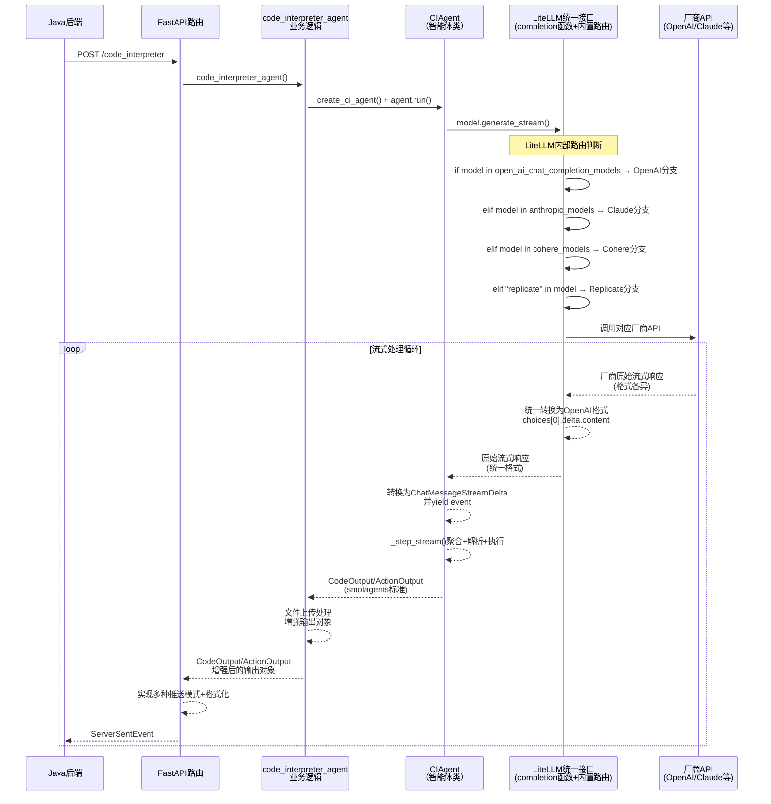

# 2.1.5 AI Agent中的流式交互模式

**学习目标：** 理解AI Agent场景下的特殊流式交互需求，掌握智能化的流式通信模式

## 单智能体流式通信服务端实现

在学习完流式通信基础后，我们将通过一个Agentic AI应用中的单智能体案例，学习如何构建完整的具有AI Agent服务能力的流式通信服务端。
本文以Python AI Agent作为例子。

## 1 Python端流式通信实现
``` Python
# Please install OpenAI SDK first: `pip3 install openai`
import os
from openai import OpenAI

client = OpenAI(
    api_key=os.environ.get('DEEPSEEK_API_KEY'),
    base_url="https://api.deepseek.com")

response = client.chat.completions.create(
    model="deepseek-chat",
    messages=[
        {"role": "system", "content": "You are a helpful assistant"},
        {"role": "user", "content": "Hello"},
    ],
    stream=True
)

# 流式消费响应
for chunk in response:
    if chunk.choices[0].delta.content:
        print(chunk.choices[0].delta.content, end="", flush=True)
```
这段代码展示了一个最简单的LLM通信示例，这是利用OpenAI SDK调用LLM的最小实现。虽然代码中设置了`stream=True`参数开启了流式响应，但这个基础Demo作为LLM的直接客户端，并不具备流式消息转发的能力。在实际的AI应用开发中，我们通常需要基于此类LLM客户端构建一个流式消息转发服务，以实现从LLM到前端、后端的完整流式通信链路。接下来，我们将通过京东的一个开源项目来学习如何在服务端实现这样的流式转发服务。
本文以京东开源的JDGenie项目中的genie-tool为例，深入解析如何基于**FastAPI + sse_starlette + litellm + SmoLAgents**构建一个完整的单智能体流式通信服务端。

## genie-tool核心技术栈分析
### 1. FastAPI：现代化的高性能 Python Web 框架
FastAPI作为服务端框架，核心特性之一是对异步编程的原生支持。通过使用async和await，FastAPI能够高效处理 I/O 密集型任务，如数据库查询、API 调用和文件操作。


### 2. sse_starlette：提供标准的Server-Sent Events协议实现

sse_starlette 是一个Python库，为 Starlette 和 FastAPI 框架提供对 Server-Sent Events的支持。它通过 EventSourceResponse 类实现SSE协议，允许服务器异步向客户端推送实时数据，适合构建实时Web应用，如通知系统、实时仪表盘或流式数据更新。sse_starlette轻量且与ASGI框架无缝集成，常用于需要高效单向通信的场景。


**sse_starlette 库的作用**
SSE 支持：为FastAPI 提供标准化的 SSE 实现，基于 HTML5 EventSource API
实时数据推送：支持服务器到客户端的单向数据流，适合实时更新。
消息格式化： 自动将Python对象转换为SSE标准格式
高性能：利用 asyncio 和 anyio 的异步任务组（TaskGroups），确保高效并发
易于集成：与FastAPI无缝兼容，支持自定义事件和头部
连接管理： 处理HTTP连接、心跳、错误恢复等


### 3. LiteLLM：统一LLM客户端接口

**不同厂商接口差异示例：**

不同LLM提供商的API接口在返回格式、字段命名、数据结构等方面存在显著差异，这给多模型集成带来了挑战：

1. **流式响应格式差异**
   - **OpenAI**: 使用SSE格式，数据字段为`data: {"choices": [{"delta": {"content": "..."}}]}`
   - **Claude (Anthropic)**: 使用不同的事件类型，如`content_block_delta`、`message_delta`等
   - **千问/文心一言**: 返回格式与OpenAI类似但字段名称可能不同，如使用`result`替代`choices`

2. **认证方式差异**
   - **OpenAI**: 使用`Authorization: Bearer <token>`头部认证
   - **Claude**: 使用`x-api-key`头部字段
   - **国内厂商**: 可能使用API Key + Secret签名机制

3. **参数命名差异**
   - **温度参数**: 有的叫`temperature`，有的叫`temp`
   - **最大token数**: `max_tokens` vs `max_output_tokens` vs `max_new_tokens`
   - **流式开关**: `stream` vs `incremental_output`

4. **错误响应格式差异**
   - **OpenAI**: `{"error": {"message": "...", "type": "...", "code": "..."}}`
   - **其他厂商**: 可能使用`error_msg`、`err_msg`或完全不同的结构

为了解决上述厂商差异问题，开源社区诞生了`litellm`这类统一接口层工具。

`litellm`是一个强大的Python库，它屏蔽了不同LLM提供商的API差异，让开发者可以使用统一的OpenAI格式调用100+种模型，包括OpenAI、Claude、DeepSeek、Gemini，以及Bedrock、VertexAI、Azure等云平台。

**核心功能：**

| 功能分类 | 说明 |
|---------|------|
| **输入适配** | 自动将请求转换为各提供商的completion、embedding、image_generation端点格式 |
| **输出标准化** | 响应统一通过`['choices'][0]['message']['content']`获取，无论底层使用哪个模型 |
| **参数映射** | 自动处理不同模型间的参数命名差异（如`max_tokens` vs `max_output_tokens`） |
| **错误统一** | 将各厂商的错误响应标准化为统一格式 |
| **路由降级** | 支持跨部署（如Azure/OpenAI）的故障转移和重试逻辑 |
| **预算限流** | 可按项目、API Key、模型维度设置预算和速率限制 |

**技术优势：**
- **开发效率**：一套代码支持多厂商，避免重复适配工作
- **切换灵活**：通过配置即可切换模型，无需修改业务代码
- **迁移成本低**：厂商迁移只需修改配置，代码无感知
- **统一运维**：便于实现统一的监控、日志和成本管理


### 4. SmoLAgents：专业的Agent推理框架

SmoLAgents是Hugging Face于2024年底开源的轻量级Agent框架，其设计理念是"**简洁而不简单**"——用最少的代码实现最完整的智能体能力。相比LangChain等重量级框架，SmoLAgents的核心代码仅约1000行，却提供了构建生产级Agent所需的全部核心功能。

**框架定位与设计哲学：**
- **极简主义**：遵循"少即是多"的设计原则，避免过度抽象，让开发者能快速理解和掌控整个框架
- **代码优先（Code-First）**：推崇通过代码生成和执行来解决问题，而非纯粹的提示词工程
- **透明可调试**：每个推理步骤都清晰可见，便于开发者理解Agent的决策过程

**核心特性：**
- **双模式Agent架构**：
  - `CodeAgent`：通过生成并执行Python代码来完成任务，适合数据处理、计算等场景
  - `ToolCallingAgent`：通过JSON格式的工具调用完成任务，兼容OpenAI Function Calling规范
- **ReAct推理模式**：实现"思考(Thought)-行动(Action)-观察(Observation)"的完整推理循环，支持多轮迭代直至任务完成
- **内置安全沙箱**：代码执行在隔离环境中进行，支持本地沙箱和远程E2B执行器
- **流式输出支持**：原生支持流式输出和步骤级控制，可实时追踪Agent的思考和执行过程
- **丰富的工具生态**：内置网页搜索、Python解释器、文件操作等常用工具，同时支持快速自定义工具

**在本案例中的作用：**
JDGenie项目基于SmoLAgents构建了代码解释器智能体，利用其ReAct框架实现了：
- 自然语言任务分析
- 代码生成与执行
- 结果验证与迭代优化
- 完整的流式交互体验


genie-tool服务提供了多个API接口，其中 `/code_interpreter` 接口是整个项目的核心AI能力入口。该接口实现了**"自然语言驱动的智能代码生成与执行"**——用户只需用自然语言描述数据分析需求，AI便能自动生成并执行相应的Python代码。接下来，我们将以这个接口为例，深入剖析其完整的流式架构实现。


##  完整genie-tool接口code_interpreter时序图

下图展示了 `/code_interpreter` 接口从请求发起到流式响应返回的完整调用链路。整个流程涉及5个核心层级：Java后端发起HTTP请求 → FastAPI路由层接收并处理 → 业务逻辑层创建智能体 → CIAgent执行ReAct推理 → LiteLLM智能路由到对应厂商API。流式响应则沿相反方向逐层传递，最终以SSE格式推送给调用方。


## 📋 服务分层架构速览

| 层级 | 核心模块 | 主要职责 | 输入类型 | 输出类型 |
|------|------|----------|----------|----------|
| **第1层** | FastAPI + sse_starlette  | HTTP请求处理、SSE响应 | CIRequest | ServerSentEvent |
| **第2层** | code_interpreter_agent.py | 业务逻辑处理、任务协调、文件处理 、创建智能体| 任务参数 |  自定义的增强对象CodeOutput (包含代码文件下载链接)/ActionOutput (包含执行结果 + 所有生成文件的下载链接) |
| **第3层** | CIAgent | 智能体运行、代码生成、代码执行 | 任务参数、提示词 | 使用smolagents标准对象 CodeOutput/ActionOutput |
| **第4层**  | LiteLLM| **统一入口函数**：接收标准化参数<br/>**智能路由**：根据model参数判断厂商，调用对应厂商的接口， **格式转换**：统一API响应格式<br/>• OpenAI: 直接返回<br/>• Claude: `delta.text` → `choices[0].delta.content`<br/>• 其他厂商格式标准化 | 消息数组 + 模型参数 | 统一格式的流式JSON  |
| **第5层** | 厂商API | 提供原始LLM能力：OpenAI、Anthropic、Cohere、Replicate等 |消息数组（提示词）、厂商特定参数| 流式JSON （各厂商原始格式）|


## 服务分层详解

本节通过简化代码片段，深入分析 `code_interpreter` 接口的5层流式架构实现机制：

### 第1层：FastAPI路由
```python
# genie-tool/api/tool.py
@router.post("/code_interpreter") 
async def post_code_interpreter(body: CIRequest):
    # 文件路径预处理
    if body.file_names:
        # 标准化文件路径为完整URL
        
    async def _stream():
        # 流式推送模式控制变量
        acc_content, acc_token, acc_time = "", 0, time.time()
        
        async for chunk in code_interpreter_agent(  # 调用第2层
            task=body.task,
            file_names=body.file_names, 
            request_id=body.request_id,
            stream=True  # 流式开关
        ):
            # 根据chunk类型分别处理
            if isinstance(chunk, CodeOuput):  # 代码生成
                yield ServerSentEvent(data={code, fileInfo, isFinal=False})
            elif isinstance(chunk, ActionOutput):  # 执行结果  
                yield ServerSentEvent(data={codeOutput, fileInfo, isFinal=True})
                yield ServerSentEvent(data="[DONE]")
            else:  # 文本流
                # 支持多种推送模式：general/token/time
                yield ServerSentEvent(data={requestId, data=chunk})
    
    return EventSourceResponse(_stream())
```

**第1层的核心职责：**
- **HTTP请求接入** - 处理POST请求和参数验证
- **文件路径预处理** - 标准化文件URL格式
- **流式响应控制** - 管理SSE流式推送的多种推送策略
- **数据类型转换** - 将业务对象转换为SSE格式
- **会话管理** - 通过requestId跟踪请求状态
- **推送模式控制** - 支持general/token/time三种推送策略

### 第2层：code_interpreter_agent处理业务逻辑
```python
# genie_tool/tool/code_interpreter.py
async def code_interpreter_agent(task, file_names, request_id, stream=True):
    # 1. 文件下载和预处理
    files = await download_files_if_needed(file_names)
    
    # 2. 创建CIAgent智能体
    agent = create_ci_agent(
        prompt_templates=ci_prompt_template,
        max_tokens=max_tokens,
        return_full_result=True,
        output_dir=output_dir,
    )
    
    # 3. 构建任务模板
    template_task = Template(ci_prompt_template["task_template"]).render(
        files=files, task=task, output_dir=output_dir
    )
    
    # 4. 流式运行智能体
    if stream:
        for step in agent.run(task=template_task, stream=True, max_steps=10):
            if isinstance(step, CodeOuput):  # 代码生成步骤
                # 文件上传处理
                step.file_list = [await upload_file(...)]
                yield step
            elif isinstance(step, FinalAnswerStep):  # 最终结果
                # 收集所有生成文件并上传
                yield ActionOutput(content=step.answer, file_list=all_files)
            else:  # 文本流直接传递
                yield step
def create_ci_agent(...) -> CIAgent:
    # 1. 创建LLM模型实例
    model = LiteLLMModel(
        max_tokens=max_tokens,
        model_id=os.getenv("CODE_INTEPRETER_MODEL", "gpt-4.1")  # 模型配置
    )
    
    # 2. 构建CIAgent智能体
    return CIAgent(
        model=model,                              # LLM调用层
        prompt_templates=prompt_templates,        # 提示词模板
        tools=[PythonInterpreterTool()],         # 工具集成
        return_full_result=True,                 # 完整结果开关
        additional_authorized_imports=[...],     # 预授权包导入
        output_dir=output_dir,                   # 输出目录
    )

```

**第2层的核心职责：**
- **智能体管理** - 创建和配置CIAgent实例
- **任务协调** - 构建任务模板和提示词工程
- **文件处理** - 下载输入文件、上传生成文件
- **智能体运行** -  触发智能体运行
- **流式控制** - 管理智能体的流式运行模式
- **数据增强** - 将CIAgent输出转换为业务增强对象
- **步骤分发** - 根据步骤类型进行差异化处理


### 第3层：CIAgent 智能体类

```python
# genie_tool/tool/ci_agent.py

# CIAgent类构造方法
class CIAgent(CodeAgent):
    def __init__(
        self,
        tools: list[Tool],
        model: Model,
        prompt_templates: PromptTemplates | None = None,
        additional_authorized_imports: list[str] | None = None,
        planning_interval: int | None = None,
        executor_type: str | None = "local",
        output_dir: Optional[str] = None,
        *args, **kwargs,
    ):
        self.output_dir = output_dir  # 输出目录设置
        # 调用父类构造方法，继承CodeAgent能力
        super().__init__(
            tools=tools,                    # 工具列表
            model=model,                    # LLM模型
            prompt_templates=prompt_templates,  # 提示词模板
            additional_authorized_imports=additional_authorized_imports,  # 预授权导入
            planning_interval=planning_interval,  # 规划间隔
            executor_type=executor_type,    # 执行器类型
            **kwargs,
        )
    
    # 按需重写父类_step_stream方法，实现分阶段流式输出、**性能监控**、自定义完成判断
    @timer()
    def _step_stream(self, memory_step: ActionStep) -> Generator[
        ChatMessageStreamDelta | ToolCall | ToolOutput | ActionOutput | CodeOuput
    ]:
        """ReAct框架的核心步骤：思考→行动→观察"""
        # 1. 构建记忆消息并调用LLM流式生成
        memory_messages = self.write_memory_to_messages()
        output_stream = self.model.generate_stream(
            memory_messages,
            extra_headers={"x-ms-client-request-id": model_request_id}
        )
        
        # 2. 流式处理和消息聚合
        chat_message_stream_deltas = []
        for event in output_stream:
            chat_message_stream_deltas.append(event)
            yield event  # → ChatMessageStreamDelta 实时文本流
            
        # 3. 聚合完整消息并解析代码块
        chat_message = agglomerate_stream_deltas(chat_message_stream_deltas)
        code_action = parse_code_blobs(chat_message.content)
        
        # 4. 创建工具调用并执行Python代码
        memory_step.tool_calls = [ToolCall(name="python_interpreter", ...)]
        _, execution_logs, _ = self.python_executor(code_action)
        
        # 5. 返回代码生成结果
        yield CodeOuput(code=code_action, file_name=file_name)  # → 代码生成结果
        
        # 6. 最终答案检查和输出
        finalObj = FinalAnswerCheck(
            input_messages=self.input_messages,
            execution_logs=execution_logs,
            model=self.model, task=self.task, ...
        )
        finalFlag, exeLog = finalObj.check_is_final_answer()
        yield ActionOutput(output=exeLog, is_final_answer=finalFlag)  # → 最终执行结果
```

**第3层的核心职责：**
- **智能体定义** - 基于smolagents框架自定义继承CodeAgent的CIAgent类
- **ReAct执行** - 实现思考→行动→观察的推理框架
- **流式处理** - 将LLM流转换为结构化对象
- **智能编程** - 根据任务需求生成符合逻辑的Python代码
- **代码执行** - 集成Python解释器进行代码运行
- **工具管理** - 管理各种外部工具调用

### 第4层：LiteLLM统一调用层

#### 4.1 主入口函数 - completion()
```python
# site-packages/litellm/main.py:80-294
def completion(
    model, messages,  # 必需参数
    functions=[], temperature=1, top_p=1, stream=False, max_tokens=float('inf'),
    api_key=None, azure=False, logger_fn=None, **kwargs
):
    # 获取可选参数
    optional_params = get_optional_params(functions, temperature, stream, ...)
    
    # 🔄 核心路由逻辑开始
    if azure == True:
        # Azure OpenAI 专用分支
        return azure_openai_call(model, messages, optional_params)
    elif model in litellm.open_ai_chat_completion_models:
        # OpenAI Chat 模型分支  
        return openai_chat_call(model, messages, optional_params)
    elif model in litellm.open_ai_text_completion_models:
        # OpenAI Text 模型分支
        return openai_text_call(model, messages, optional_params)
    elif "replicate" in model:
        # Replicate 模型分支
        return replicate_call(model, messages, optional_params)
    elif model in litellm.anthropic_models:
        # Anthropic Claude 分支
        return anthropic_call(model, messages, optional_params)
    elif model in litellm.cohere_models:
        # Cohere 模型分支
        return cohere_call(model, messages, optional_params)
    else:
        raise ValueError(f"No valid completion model: {model}")
```

#### 4.2 模型路由配置 - 厂商判断依据
```python
# site-packages/litellm/__init__.py:30-65

# OpenAI Chat 模型列表
open_ai_chat_completion_models = [
    "gpt-4", "gpt-4-0613", "gpt-4-32k", "gpt-4-32k-0613",
    "gpt-3.5-turbo", "gpt-3.5-turbo-16k", "gpt-3.5-turbo-0613"
]

# Anthropic 模型列表  
anthropic_models = ["claude-2", "claude-instant-1"]

# Cohere 模型列表
cohere_models = ["command-nightly", "command", "command-light"]

# Replicate 模型判断：任何包含 "replicate/" 的模型名
replicate_models = ["replicate/"]  # 前缀匹配
```

#### 4.3 各厂商API调用实现详解

**🔹 OpenAI 调用分支（第123-148行）**
```python
elif model in litellm.open_ai_chat_completion_models:
    # 1. API配置
    openai.api_type = "openai"
    openai.api_base = "https://api.openai.com/v1"
    openai.api_key = api_key or os.environ.get("OPENAI_API_KEY")
    
    # 2. 直接调用OpenAI原生接口
    response = openai.ChatCompletion.create(
        model=model,
        messages=messages,
        **optional_params  # stream=True, max_tokens, temperature等
    )
    return response  # 🎯 原生OpenAI格式，无需转换
```

**🔹 Anthropic Claude 调用分支（第212-255行）**
```python
elif model in litellm.anthropic_models:
    # 1. API密钥配置
    os.environ["ANTHROPIC_API_KEY"] = api_key or litellm.anthropic_key
    
    # 2. 消息格式转换：OpenAI → Anthropic
    prompt = f"{HUMAN_PROMPT}"
    for message in messages:
        if message["role"] == "user":
            prompt += f"{HUMAN_PROMPT}{message['content']}"
        else:
            prompt += f"{AI_PROMPT}{message['content']}"
    prompt += f"{AI_PROMPT}"
    
    # 3. 调用Anthropic原生接口
    anthropic = Anthropic()
    completion = anthropic.completions.create(
        model=model,
        prompt=prompt,  # 🔄 已转换格式
        max_tokens_to_sample=max_tokens
    )
    
    # 4. 响应格式转换：Anthropic → OpenAI
    new_response = {
        "choices": [{
            "finish_reason": "stop",
            "message": {
                "content": completion.completion,  # 🔄 提取内容
                "role": "assistant"
            }
        }]
    }
    return new_response  # 🎯 统一OpenAI格式
```


#### 4.4 CIAgent集成调用示例
```python
# genie_tool/tool/code_interpreter.py:119-122
model = LiteLLMModel(
    max_tokens=max_tokens,
    model_id=os.getenv("CODE_INTEPRETER_MODEL", "gpt-4")  # 🎯 模型名触发路由
)

# CIAgent内部流式调用
output_stream = self.model.generate_stream(
    memory_messages,
    extra_headers={"x-ms-client-request-id": model_request_id}
)
```

**第4层的核心职责（详细分解）：**
- **智能路由** - 基于模型名称自动选择正确的厂商API
- **格式转换** - 双向转换：输入格式适配 + 输出格式统一
- **认证管理** - 统一处理各厂商的API密钥和认证方式
- **流式支持** - 保持各厂商流式响应的实时性
- **异常统一** - 将不同厂商的异常映射为统一的错误类型
- **标准化输出** - 确保所有响应都符合OpenAI格式：`choices[0].message.content`

### 第5层：原始LLM API服务
```python
# OpenAI API / Claude API / DeepSeek API / 其他厂商API

# 原始API调用示例
POST https://api.openai.com/v1/chat/completions
{
    "model": "gpt-4-turbo",
    "messages": [...],
    "stream": true,  # 流式开关
    "max_tokens": 16000
}

# 流式响应格式（各厂商结构不同）
data: {"id":"chatcmpl-xxx","object":"chat.completion.chunk","choices":[{"delta":{"content":"Hello"}}]}
data: {"id":"chatcmpl-xxx","object":"chat.completion.chunk","choices":[{"delta":{"content":" world"}}]}
data: [DONE]

# 不同厂商的响应差异
OpenAI: choices[0].delta.content
Claude: delta.text  
DeepSeek: choices[0].delta.content
```

**第5层的核心职责：**
- **原始AI能力** - 提供基础的语言理解和生成能力
- **流式响应** - 支持实时流式文本生成
- **多模态支持** - 部分模型支持文本、图像、音频等多种输入
- **参数控制** - 通过temperature、top_p等参数控制生成质量
- **令牌管理** - 管理输入输出的token消耗和限制
- **厂商差异** - 不同厂商在API格式、能力边界上存在差异


## 小结

本节以京东开源的genie-tool服务为例，深入剖析了单智能体流式通信服务端的完整实现架构。核心要点如下：

**技术栈选型**：采用 **FastAPI + sse_starlette + LiteLLM + SmoLAgents** 的组合，各组件各司其职——FastAPI提供高性能异步Web服务，sse_starlette实现标准SSE协议，LiteLLM统一多厂商LLM接口，SmoLAgents提供ReAct推理框架。

**五层架构设计**：
- **第1层（FastAPI路由）**：负责HTTP请求接入和SSE流式响应输出，支持多种推送策略
- **第2层（业务逻辑层）**：协调智能体创建、任务模板构建和文件处理
- **第3层（CIAgent智能体）**：执行ReAct推理循环，完成代码生成与执行
- **第4层（LiteLLM）**：智能路由到不同厂商API，统一输入输出格式
- **第5层（厂商API）**：提供原始的大模型推理能力

**流式数据流转**：请求自上而下逐层调用，流式响应自下而上逐层传递。每一层对数据进行适当的转换和增强，最终以SSE格式实时推送给调用方，实现了从LLM到前端的完整流式通信链路。

这种分层架构的优势在于：**职责清晰、易于扩展、便于维护**。当需要切换LLM厂商时只需修改配置，当需要增强业务能力时只需扩展对应层级，体现了良好的工程化设计思想。


## 🎯 后端工具服务架构分层职责划分

```
┌────────────────────────────────────────┐
│          API路由层 (tool.py)        │  ← HTTP请求处理、参数验证、响应格式化
├────────────────────────────────────────┤
│     业务逻辑层 (code_interpreter.py) │  ← 核心业务逻辑、Agent编排、文件处理
├─────────────────────────────────────────┤
│        Agent层 (ci_agent.py)           │  ← 智能推理、代码执行、流式处理
├─────────────────────────────────────────┤
│      模型层 (LiteLLM + SmoLAgents)      │  ← LLM调用、推理框架
└─────────────────────────────────────────┘
```


单智能体在AI应用中的流式数据传输的完整链路

## 🔄 流式数据传输的完整链路

### 1. 数据流向分析

"""
数据流向链路：

LLM API (OpenAI/Claude/DeepSeek)
    ↓ 原始流式响应
code_interpreter_agent() 
    ↓ 处理后的 CodeOutput/ActionOutput 对象
_stream() 异步生成器
    ↓ yield ServerSentEvent (你问的这一步！)
EventSourceResponse (sse-starlette)
    ↓ HTTP SSE 流式响应
Java后端 (接收方)
    ↓ 再次转发
前端用户界面
"""
### 2. ServerSentEvent 的数据格式
```Python
             yield ServerSentEvent(
                    data=json.dumps(
                        {
                            "requestId": body.request_id,
                            "code": chunk.code,
                            "fileInfo": chunk.file_list,
                            "isFinal": False,
                        },
                        ensure_ascii=False,
                    )
                )

```


2.2 流式响应处理机制
```Python
  async with AsyncTimer(key=f"exec ask_llm"):
        if stream:
            async for chunk in response:
                if only_content:
                    if chunk.choices and chunk.choices[0] and chunk.choices[0].delta and chunk.choices[0].delta.content:
                        yield chunk.choices[0].delta.content
                else:
                    yield chunk
        else:
            yield response.choices[0].message.content if only_content else response
```
关键特性：
异步迭代器模式 - async for chunk in response
增量内容提取 - 从delta.content获取流式片段
灵活输出模式 - 支持纯内容或完整响应对象


 三种流式模式：General(实时)、Token(累积)、Time(定时)，适应不同应用场景

### 1.General模式（实时推送）
特点：

- 每个chunk立即推送到前端
- 最快的用户反馈体验
- 适用于代码生成、实时对话场景

应用场景： 代码解释器工具，用户需要实时看到代码生成过程
```Python
        acc_content += chunk
        acc_token += 1
        if body.stream_mode.mode == "general":
            yield ServerSentEvent(
                data=json.dumps(
                    {"requestId": body.request_id, "data": chunk, "isFinal": False},
                    ensure_ascii=False,
                )
            )
```


### 3.2 Token模式（批量累积推送）
特点：
- 累积N个token后批量推送
- 平衡响应速度和网络开销
- 适用于长文本生成场景
应用场景： 深度搜索工具，需要处理大量搜索结果
```Python
                elif body.stream_mode.mode == "token":
                    if acc_token >= body.stream_mode.token:
                        yield ServerSentEvent(
                            data=json.dumps(
                                {
                                    "requestId": body.request_id,
                                    "data": acc_content,
                                    "isFinal": False,
                                },
                                ensure_ascii=False,
                            )
                        )
                        acc_token = 0
                        acc_content = ""
```
### 3.3 Time模式（定时批量推送）
特点：
按固定时间间隔推送
稳定的推送节奏
适用于报告生成场景
应用场景： HTML/PPT报告生成，避免频繁推送影响渲染性能

```Python
                elif body.stream_mode.mode == "time":
                    if time.time() - acc_time > body.stream_mode.time:
                        yield ServerSentEvent(
                            data=json.dumps(
                                {
                                    "requestId": body.request_id,
                                    "data": acc_content,
                                    "isFinal": False,
                                },
                                ensure_ascii=False,
                            )
                        )
                        acc_time = time.time()
                        acc_content = ""
```


### 实际应用场景

- 代码解释器：实时生成和执行Python代码，流式显示过程

- 深度搜索：批量处理搜索结果，Token模式优化网络开销

- 报告生成：定时推送HTML/PPT内容，避免频繁UI更新


## Agent执行状态的流式反馈

### Agent生命周期与状态流

AI Agent的执行过程通常包含多个阶段，每个阶段都需要向用户提供实时反馈：

```java
public enum AgentState {
    INITIALIZING("初始化中", "正在准备执行环境..."),
    PLANNING("制定计划", "正在分析任务并制定执行计划..."),
    TOOL_CALLING("调用工具", "正在使用工具执行具体任务..."),
    THINKING("思考中", "正在分析中间结果..."),
    SUMMARIZING("总结中", "正在整理和总结执行结果..."),
    COMPLETED("已完成", "任务执行完成"),
    ERROR("执行错误", "执行过程中遇到错误");

    private final String displayName;
    private final String description;

    AgentState(String displayName, String description) {
        this.displayName = displayName;
        this.description = description;
    }
}

@Component
public class AgentStatusStreamer {
    
    public void streamAgentStatus(Printer printer, AgentState state, String detail) {
        AgentStatusMessage message = AgentStatusMessage.builder()
            .state(state.name())
            .displayName(state.getDisplayName())
            .description(state.getDescription())
            .detail(detail)
            .timestamp(System.currentTimeMillis())
            .build();
            
        printer.send("agent_status", message);
    }

    public void streamThinking(Printer printer, String thought) {
        ThinkingMessage message = ThinkingMessage.builder()
            .content(thought)
            .timestamp(System.currentTimeMillis())
            .build();
            
        printer.send("agent_thinking", message);
    }

    public void streamPlanUpdate(Printer printer, List<Plan> plans, int currentStep) {
        PlanUpdateMessage message = PlanUpdateMessage.builder()
            .plans(plans)
            .currentStep(currentStep)
            .progress(calculateProgress(plans, currentStep))
            .timestamp(System.currentTimeMillis())
            .build();
            
        printer.send("plan_update", message);
    }

    private double calculateProgress(List<Plan> plans, int currentStep) {
        if (plans == null || plans.isEmpty()) {
            return 0.0;
        }
        return Math.min(100.0, (double) currentStep / plans.size() * 100);
    }
}
```

### 分层状态反馈机制

```java
public abstract class BaseAgent {
    protected Printer printer;
    protected AgentStatusStreamer statusStreamer;
    
    protected void executeWithStatusFeedback(String operation, Runnable task) {
        try {
            // 开始执行反馈
            statusStreamer.streamAgentStatus(printer, 
                AgentState.TOOL_CALLING, "开始执行: " + operation);
            
            // 执行实际任务
            task.run();
            
            // 完成反馈
            statusStreamer.streamAgentStatus(printer, 
                AgentState.COMPLETED, "完成: " + operation);
                
        } catch (Exception e) {
            // 错误反馈
            statusStreamer.streamAgentStatus(printer, 
                AgentState.ERROR, "执行失败: " + operation + " - " + e.getMessage());
            throw e;
        }
    }

    protected <T> T executeWithProgressFeedback(String operation, 
                                               Supplier<T> task, 
                                               ProgressCallback callback) {
        statusStreamer.streamAgentStatus(printer, AgentState.TOOL_CALLING, operation);
        
        return task.get(); // 实际执行中会结合callback提供进度更新
    }
}

@Component
public class PlanningAgent extends BaseAgent {
    
    @Override
    public void handle(AgentContext context, AgentRequest request) {
        printer = context.getPrinter();
        statusStreamer = new AgentStatusStreamer();
        
        try {
            // 阶段1：初始化
            statusStreamer.streamAgentStatus(printer, AgentState.INITIALIZING, 
                "准备分析任务: " + request.getQuery());
            
            // 阶段2：制定计划
            statusStreamer.streamAgentStatus(printer, AgentState.PLANNING, 
                "正在制定执行计划...");
            
            List<Plan> plans = executeWithProgressFeedback("生成执行计划", 
                () -> generatePlan(request), 
                (progress, detail) -> {
                    // 进度回调
                    printer.send("plan_progress", Map.of(
                        "progress", progress,
                        "detail", detail
                    ));
                });
            
            // 流式发送完整计划
            statusStreamer.streamPlanUpdate(printer, plans, 0);
            
            // 阶段3：执行计划
            executePlansWithStreaming(context, plans);
            
        } catch (Exception e) {
            statusStreamer.streamAgentStatus(printer, AgentState.ERROR, e.getMessage());
            throw e;
        }
    }

    private void executePlansWithStreaming(AgentContext context, List<Plan> plans) {
        for (int i = 0; i < plans.size(); i++) {
            Plan plan = plans.get(i);
            
            // 更新当前执行计划
            statusStreamer.streamPlanUpdate(printer, plans, i + 1);
            
            // 执行单个计划步骤
            executeWithStatusFeedback("执行步骤: " + plan.getAction(), () -> {
                executePlan(context, plan);
                plan.setStatus(PlanStatus.COMPLETED);
            });
            
            // 发送步骤完成的流式反馈
            printer.send("plan_step_completed", Map.of(
                "stepIndex", i,
                "plan", plan,
                "progress", (i + 1.0) / plans.size() * 100
            ));
        }
    }
}
```


## 小结

AI-Agent中的流式交互模式具有以下特点：

1. **状态流式反馈**：Agent执行的每个阶段都需要实时反馈给用户
2. **工具调用透明化**：工具执行过程和结果需要增量传输
3. **多Agent协作可视化**：复杂的协作关系需要实时展示
4. **Token使用监控**：实时监控和控制Token消耗
5. **进度可视化**：提供直观的执行进度和状态展示

这些模式使用户能够更好地理解AI Agent的"思考"和执行过程，提供了前所未有的透明度和交互体验。在下一节中，我们将探讨如何优化流式通信的性能并建立完善的监控体系。

---

**本节关键要点：**
- Agent生命周期状态的流式反馈机制
- 工具调用结果的增量传输策略
- 多Agent协作的实时通信和可视化
- 流式Token计数和动态限流控制
- Agent执行进度的可视化展示方案
