# JoyAgent-JDGenie 流式通信架构图

## 流式通信整体架构图

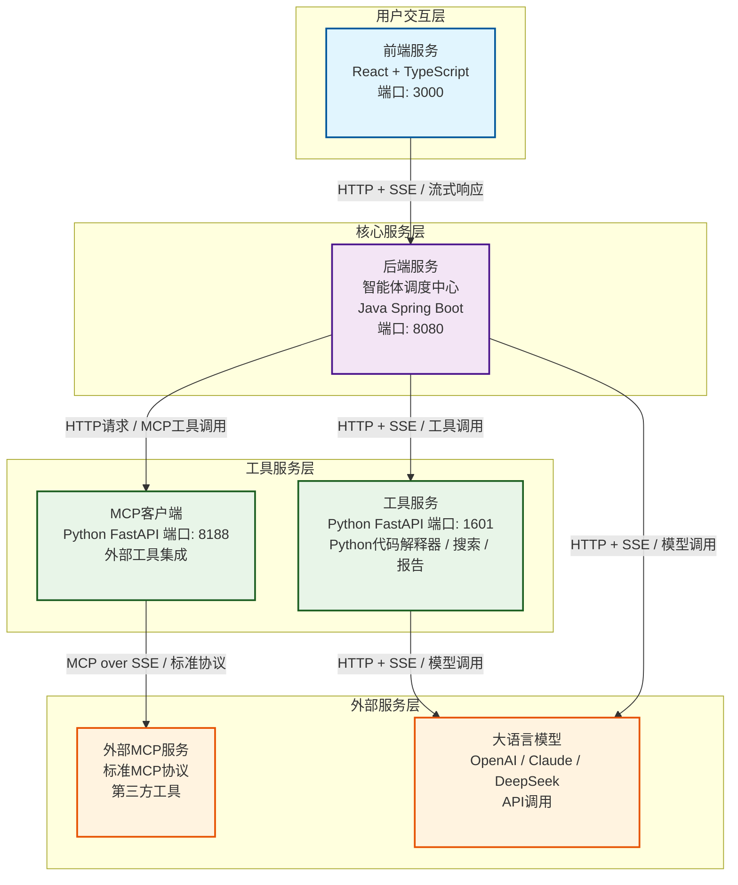

## 流式通信详细流程图

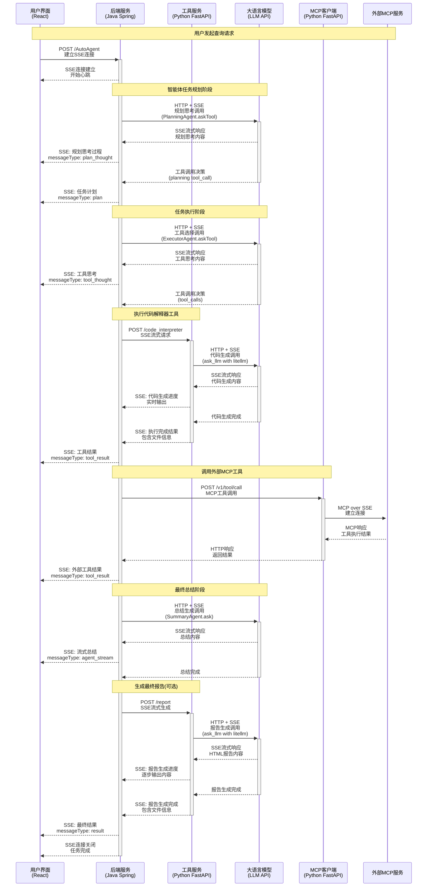

## 大语言模型调用架构

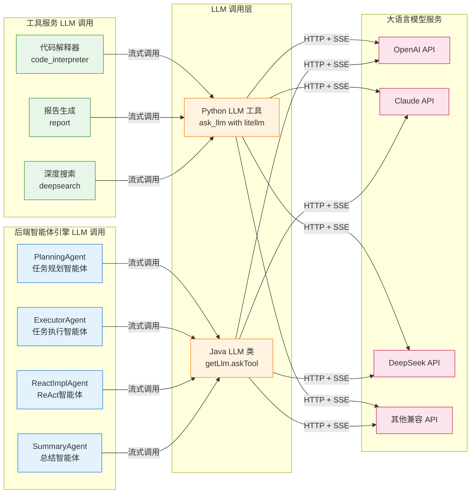

## LLM 调用时序说明

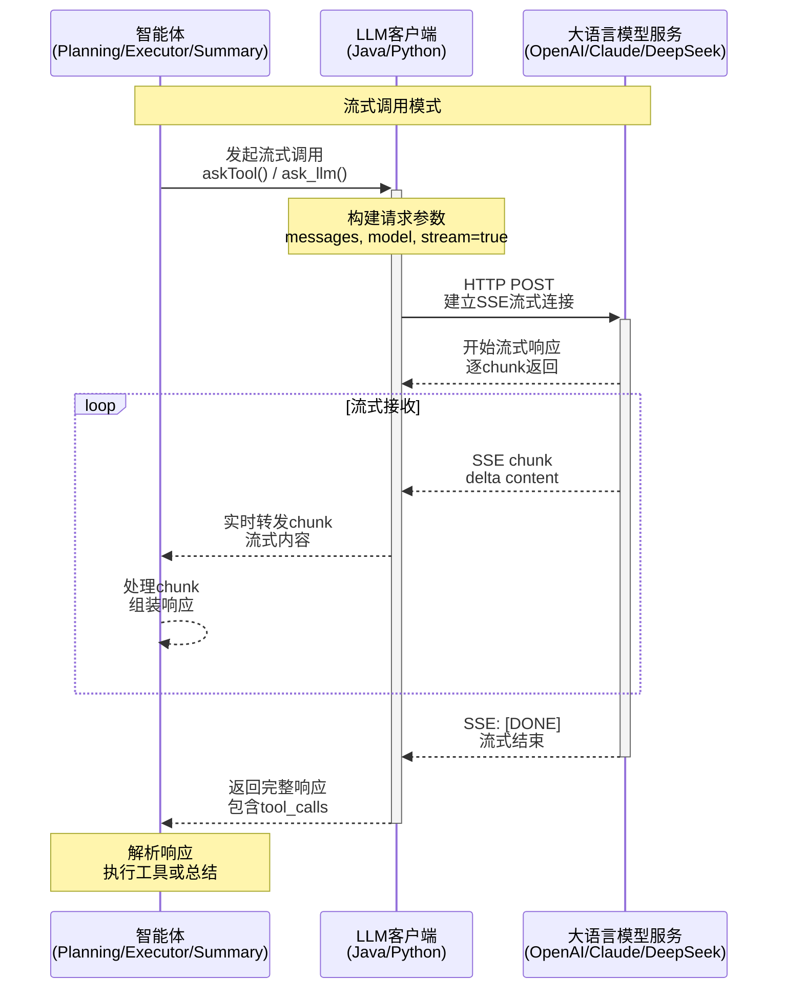

## SSE消息协议规范

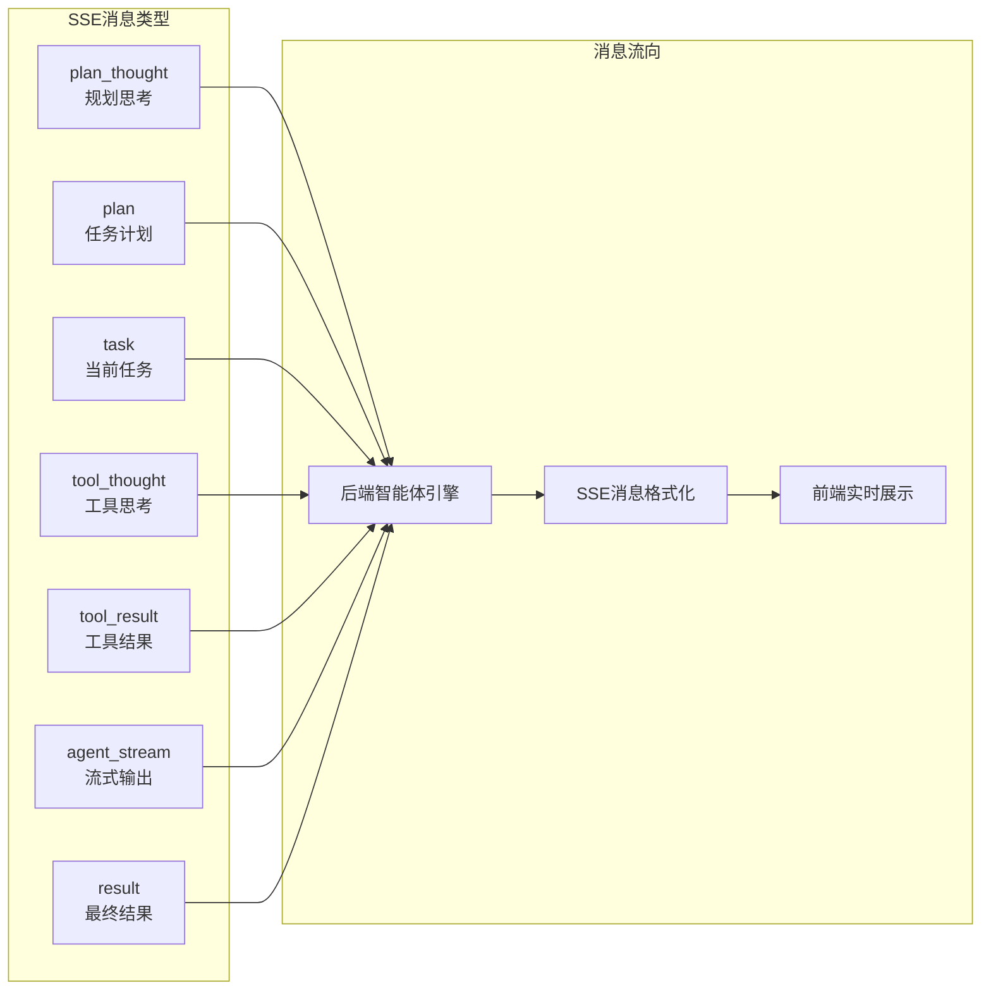

## 工具服务流式模式

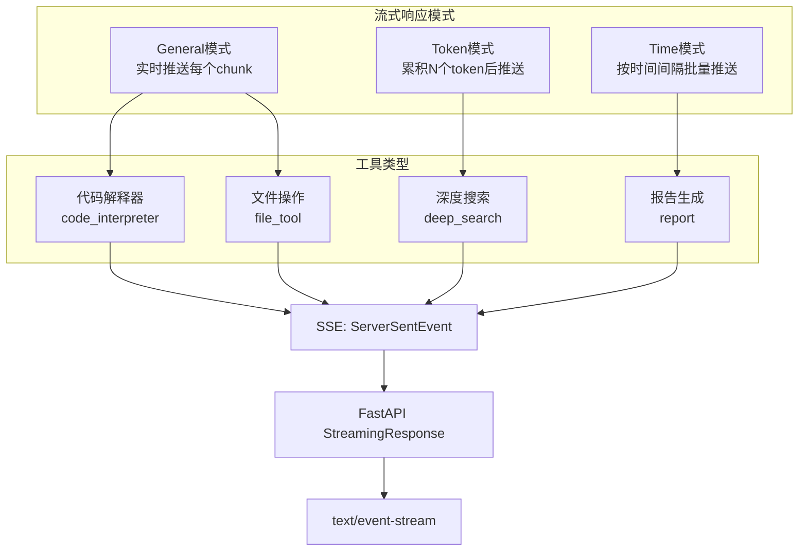

## MCP协议集成架构

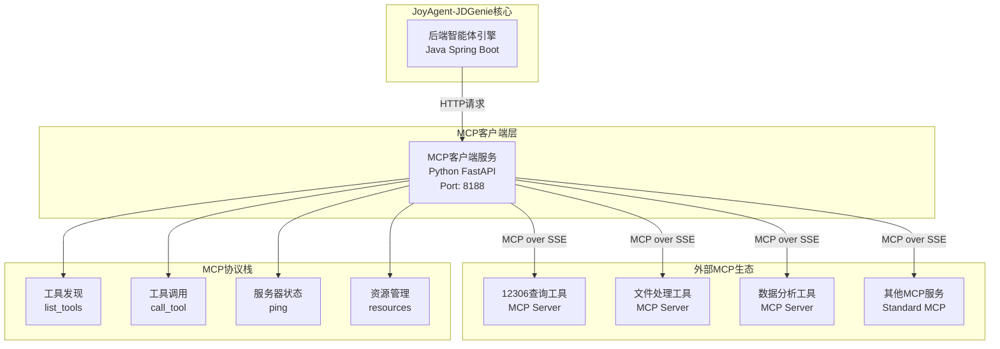

## 技术栈与端口映射

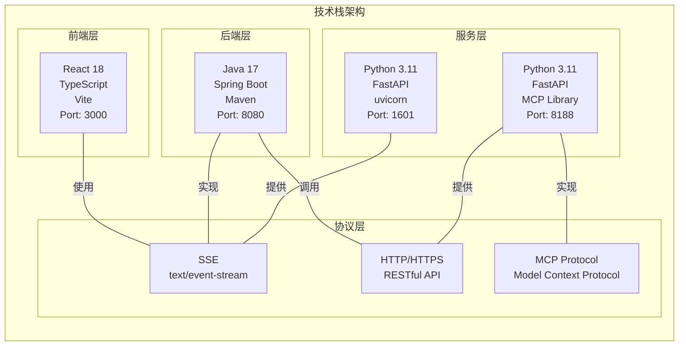

## 系统性能与监控

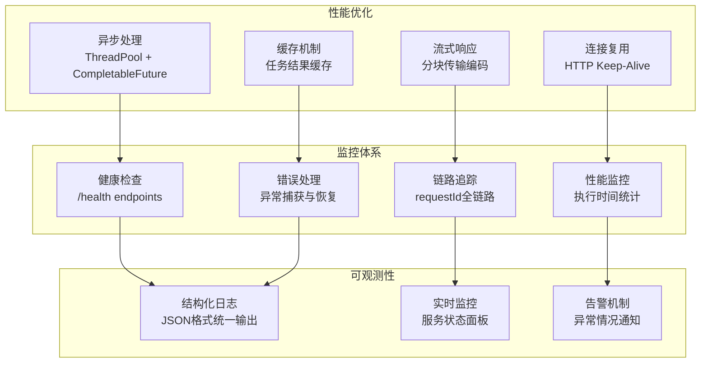

## 安全架构

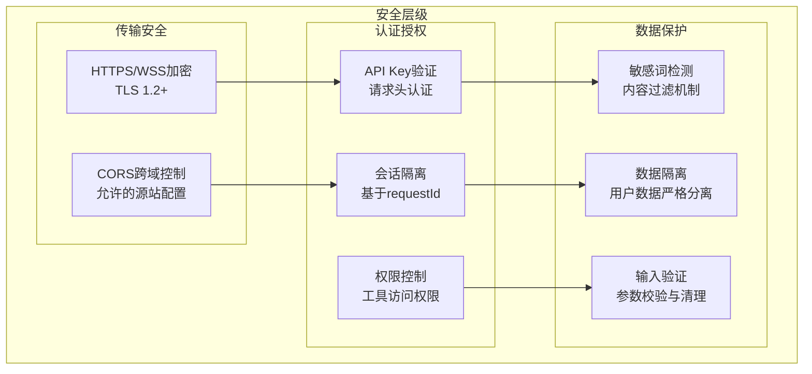

## 部署架构

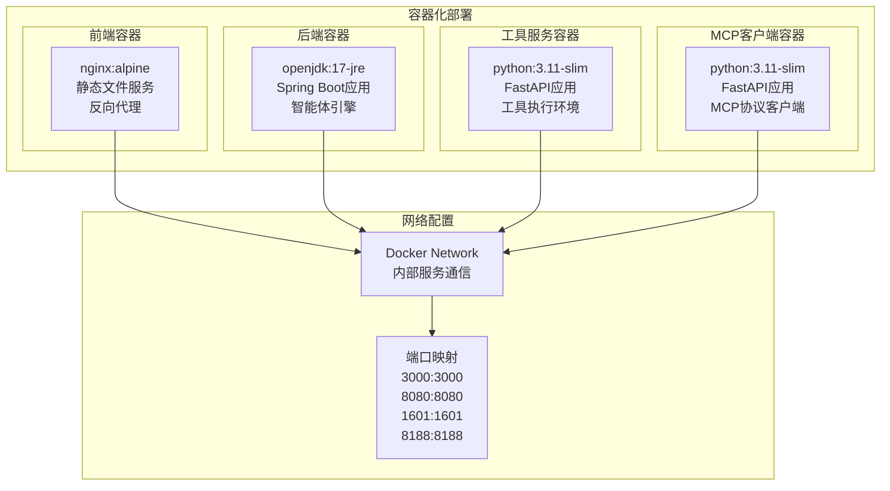

## 大语言模型调用技术细节

### 工具服务 LLM 调用 (Python)

**调用位置**：
- `code_interpreter_agent()` - 代码生成和执行
- `report()` - HTML/PPT 报告生成
- `DeepSearch.run()` - 深度搜索的推理和答案生成

**调用方法**：
```python
async for chunk in ask_llm(
    messages=messages,           # 对话历史
    model=model,                 # 模型名称
    temperature=temperature,     # 温度参数
    top_p=top_p,                # top_p 采样
    stream=True,                # 流式输出
    only_content=True,          # 只返回内容
    extra_headers=headers,      # 额外请求头
):
    yield chunk  # 流式返回
```

**底层实现**：
- 使用 `litellm` 库统一调用不同 LLM 提供商
- 支持 OpenAI、Claude、DeepSeek 等多种模型
- 自动处理敏感词过滤和替换
- 支持自定义请求头和认证信息

### 后端服务 LLM 调用 (Java)

**调用位置**：
- `PlanningAgent.think()` - 任务规划阶段的 LLM 调用
- `ExecutorAgent.think()` - 任务执行阶段的工具选择调用
- `ReactImplAgent.think()` - ReAct 模式的思考调用
- `SummaryAgent.run()` - 最终总结生成调用

**调用方法**：
```java
CompletableFuture<LLM.ToolCallResponse> future = getLlm().askTool(
    context,                           // 上下文信息
    getMemory().getMessages(),         // 历史消息
    Message.systemMessage(systemPrompt, null),  // 系统提示
    availableTools,                    // 可用工具列表
    ToolChoice.AUTO,                   // 工具选择策略
    null,                              // 额外参数
    context.getIsStream(),             // 是否流式
    300                                // 超时时间(秒)
);
```

**流式响应处理**：
- 使用 `CompletableFuture` 异步处理 LLM 响应
- 支持 SSE 流式输出,实时推送思考过程到前端
- 根据 `messageType` 区分不同阶段的输出(plan_thought, tool_thought, agent_stream)

### LLM 流式响应的数据流

```
LLM API (OpenAI/Claude)
    ↓ SSE Stream
Java LLM.askTool() / Python ask_llm()
    ↓ 实时转发
FastAPI EventSourceResponse / Spring Boot SSE
    ↓ SSE Stream
前端 EventSource / fetch
    ↓ 实时渲染
用户界面展示
```

### 不同阶段的 LLM 调用

| 阶段 | 智能体 | LLM 输入 | LLM 输出 | 流式类型 |
|------|--------|----------|----------|---------|
| 任务规划 | PlanningAgent | 用户查询 + 文件信息 | 任务计划 + planning tool_call | plan_thought |
| 工具选择 | ExecutorAgent | 当前任务 + 可用工具 | 思考过程 + tool_calls | tool_thought |
| 代码生成 | code_interpreter | 任务描述 + 文件内容 | Python 代码 | data (general) |
| 报告生成 | report | 任务描述 + 数据文件 | HTML/Markdown 报告 | data (time) |
| 深度搜索 | deepsearch | 查询 + 搜索结果 | 推理过程 + 答案 | data (token) |
| 最终总结 | SummaryAgent | 执行历史 + 结果 | 总结报告 | agent_stream |

### 流式模式说明

**General 模式** (实时推送):
- 每个 chunk 立即推送
- 适用场景: 代码生成、实时对话
- 优点: 最快的用户反馈
- 缺点: 推送频率高,网络开销大

**Token 模式** (批量推送):
- 累积 N 个 token 后推送
- 适用场景: 深度搜索、长文本生成
- 优点: 平衡响应速度和网络开销
- 缺点: 延迟略高

**Time 模式** (定时推送):
- 按时间间隔批量推送
- 适用场景: 报告生成、PPT 生成
- 优点: 稳定的推送节奏
- 缺点: 可能有明显延迟

---

**说明**：
1. 所有架构图使用Mermaid语法绘制，支持在GitHub、GitLab等平台直接渲染
2. 图表详细展示了服务间的通信协议、数据流向和技术实现
3. 每个服务的技术栈、端口配置和主要职责都有清晰标注
4. 流式通信的实现机制和消息格式规范有完整说明
5. **新增**: 完整的大语言模型调用架构和技术细节说明


```mermaid
sequenceDiagram
    participant Java as Java后端
    participant API as FastAPI层
    participant CodeInterpreter as code_interpreter_agent
    participant CIAgent as CIAgent层
    participant LLM as LLM服务(LiteLLMModel)

    Java->>+API: POST /code_interpreter
    API->>+CodeInterpreter: code_interpreter_agent()
    CodeInterpreter->>+CIAgent: create_ci_agent() + agent.run()
    CIAgent->>+LLM: model.generate_stream()
    
    loop 流式处理循环
        LLM-->>CIAgent: ChatMessageStreamDelta
        CIAgent-->>CIAgent: _step_stream() 处理
        CIAgent-->>CIAgent: 代码解析+执行
        CIAgent-->>CodeInterpreter: CodeOutput/ActionOutput
        CodeInterpreter-->>CodeInterpreter: 文件上传处理
        CodeInterpreter-->>API: 增强后的输出对象
        API-->>API: 缓冲控制+格式化
        API-->>Java: ServerSentEvent
    end
    ```
    
    
    
    