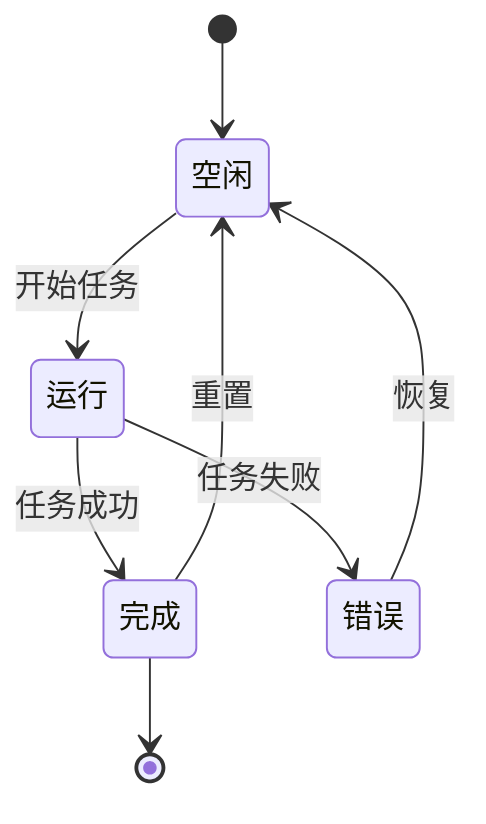
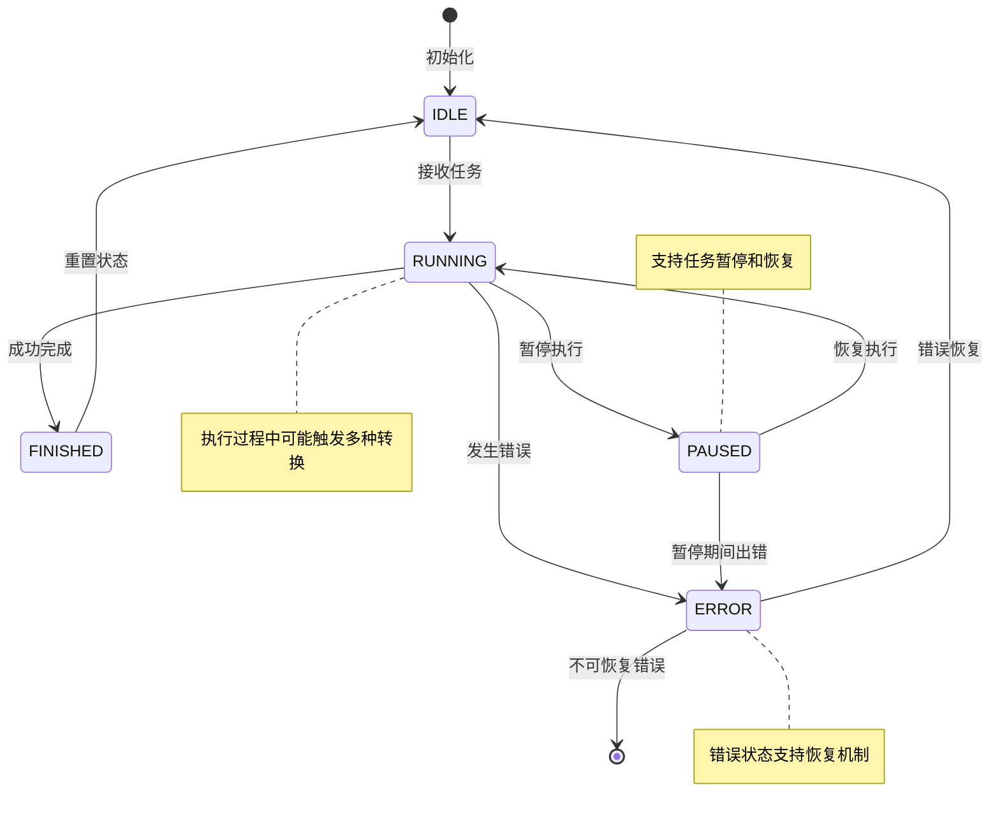

# 2.3.1 AI应用中的状态机基础理论与设计原则

## 一、状态机概述与核心价值

### 什么是状态机？


状态机，也就是 State Machine ，是计算机科学和工程中的一种重要数学模型，用于描述系统在不同状态之间的行为逻辑。它定义了：

- 状态（State）：系统在特定时刻的配置或模式。
- 事件（Event）：触发状态转换的输入或条件。
- 转换（Transition）：状态之间因事件触发的切换规则。
- 动作（Action）：在转换过程中或进入/退出状态时执行的操作。
- 初始状态（Initial State）：系统启动时的默认状态。

### 状态机的分类：有限与无限

从理论上讲，状态机可以分为两大类：**有限状态机（FSM, Finite State Machine）** 和 **无限状态机（Infinite State Machine）**。

#### 有限状态机（FSM）

有限状态机的核心特征是：**状态数量有限且预先定义**。这意味着系统可能处于的所有状态都是明确的、可枚举的、可预见的。

**有限状态机的典型特征：**

1. **状态集合可枚举**：所有可能的状态可以用一个有限集合表示，如 {IDLE, RUNNING, PAUSED, FINISHED, ERROR}
2. **转换规则确定**：从任何状态到另一个状态的转换条件是明确定义的
3. **可完全建模**：可以用状态转换图或状态转换表完整描述整个系统行为
4. **内存需求固定**：表示状态机本身的内存开销是固定的，不会随运行时间增长

**有限状态机的优势：**

| 优势 | 说明 | 在AI应用中的价值 |
|------|------|------------------|
| **逻辑清晰** | 系统的所有状态和转换一目了然 | 便于开发人员理解Agent的运行逻辑 |
| **易于调试** | 可以精确追踪状态转换路径 | 快速定位AI执行过程中的问题 |
| **可形式化验证** | 可以用数学方法验证系统的正确性 | 确保关键业务流程的可靠性 |
| **避免条件分支嵌套** | 用状态转换替代复杂的if-else | 代码更加优雅和可维护 |
| **性能可预测** | 状态检查和转换的时间复杂度是O(1) | 保证系统响应的稳定性 |


#### 无限状态机（Infinite State Machine）

无限状态机的状态空间是无限的或者极其庞大（理论上可以视为无限），系统的状态不能简单地枚举出来。

**无限状态机的典型特征：**

1. **状态由数据驱动**：状态包含动态变化的数据，状态空间随数据变化而变化
2. **状态不可完全枚举**：例如，一个包含任意长度字符串的状态机，理论上有无限多个状态
3. **需要更复杂的建模**：通常用变量、数据结构来表示状态，而不是简单的枚举
4. **内存需求动态**：状态机的内存占用随状态数据的复杂度变化


#### AI应用中的状态机选择：为什么主要使用有限状态机？

在AI应用开发中，我们**主要使用有限状态机来管理系统的控制流程**，主要原因如下：

**AI的不确定性需要确定性的控制框架**

AI应用的核心矛盾是：

| AI层特征 | 工程层需求 | 有限状态机的作用 |
|----------|-----------|-----------------|
| LLM输出不可预测 | 流程必须可控 | 定义明确的执行阶段 |
| 推理时间不确定 | 进度必须可追踪 | 提供清晰的状态标识 |
| 可能产生幻觉 | 错误必须可恢复 | 设计错误处理状态 |
| 工具调用结果多样 | 结果必须可验证 | 建立结果审查状态 |

**状态机是连接"AI不确定性"与"系统确定性"的桥梁**：

- **约束不确定性**：将AI的无限可能性约束在有限的控制流程中
- **提供可观测性**：任何时候都能明确知道Agent处于什么执行阶段
- **保障可恢复性**：当AI出现异常时，系统能够识别当前状态并采取恢复措施
- **实现可测试性**：有限的状态和转换使得系统行为可以被完整测试


## AI应用的五大工程挑战与状态机解决方案

在AI应用开发中，我们面临着传统软件开发中很少遇到的挑战。状态机正是解决这些挑战的关键技术。让我们通过实际场景来理解这些挑战：

### 挑战1：长时运行任务的生命周期管理

**场景**：用户让AI Agent分析一份100页的PDF财报并生成投资建议

```
用户提交任务 → AI开始阅读 → AI分析数据 → AI生成报告 → 完成
   (0秒)        (30秒)       (2分钟)      (1分钟)    (3分30秒)
```

**核心问题**：
- ❓ 这3分半钟里，Agent处于什么状态？用户能看到什么？
- ❓ 如果网络断了、服务器重启了，任务能恢复吗？
- ❓ 如果AI卡住不动了，系统能检测并处理吗？
- ❓ 用户能中途取消任务吗？取消后资源能正确释放吗？

**状态机如何解决**：

| 没有状态机的混乱 | 使用状态机的清晰 |
|----------------|-----------------|
| 任务运行中，不知道在干什么 | 明确显示：IDLE → READING → ANALYZING → GENERATING → FINISHED |
| 重启后任务丢失，用户需要重新提交 | 保存状态，重启后从ANALYZING继续 |
| 不知道是正常运行还是已经卡死 | 每个状态有超时检测，超时自动转入ERROR状态 |
| 资源泄漏（文件未关闭、连接未释放） | 状态退出时触发清理逻辑 |

### 挑战2：复杂任务的分解与进度追踪

**场景**：用户问"帮我规划一次去日本的7天旅行"

```
主任务：规划日本旅行
├── 子任务1：搜索机票价格（进行中...）
├── 子任务2：查询酒店推荐（等待中）
├── 子任务3：制定景点路线（等待中）
├── 子任务4：预算计算（等待中）
└── 子任务5：生成完整行程（等待中）
```

**核心问题**：
- ❓ 5个子任务，现在完成到哪一步了？
- ❓ 如果子任务3失败了，是重试还是跳过？
- ❓ 用户想看"现在进度50%"，怎么算出来的？
- ❓ 哪些子任务可以并行执行，哪些必须串行？

**状态机如何解决**：

```java
// 每个子任务都有自己的状态机
class SubTask {
    private TaskState state;  // PENDING → RUNNING → SUCCESS/FAILED
    private int retryCount = 0;
    private int maxRetries = 3;
}

// 主任务状态取决于子任务状态
class MainTask {
    private List<SubTask> subTasks;
    
    public String getProgress() {
        long completed = subTasks.stream()
            .filter(t -> t.state == TaskState.SUCCESS)
            .count();
        return completed + "/" + subTasks.size();  // 如：2/5 (40%)
    }
}
```

### 挑战3：工具调用的结果处理

**场景**：AI需要调用代码执行器运行一段Python代码

```python
# AI让工具执行这段代码
import requests
result = requests.get("https://api.example.com/data")
print(result.json())
```

**可能的结果**：
- ✅ 成功：返回了JSON数据
- ❌ 网络错误：连接超时
- ❌ 代码错误：语法错误或运行时异常
- ⏱️ 执行超时：代码运行超过30秒
- 🔒 权限错误：无法访问网络

**核心问题**：
- ❓ 5种可能的结果，每种应该如何处理？
- ❓ 错误时应该重试、回退还是放弃？
- ❓ 工具还在执行时，Agent应该等待还是继续？

**状态机如何解决**：

```
Agent状态转换：
RUNNING → 调用工具 → WAITING_TOOL
                        ↓
         ┌──────────────┴──────────────┐
         ↓                              ↓
    工具成功                         工具失败
         ↓                              ↓
    PROCESSING_RESULT              ERROR_HANDLING
         ↓                              ↓
    继续执行                      重试/回退/终止
```

### 挑战4：多Agent协作的状态协调

**场景**：一个研究型AI应用，由3个Agent协作完成任务

```
ReaderAgent (读文献)  →  AnalyzerAgent (分析数据)  →  WriterAgent (写报告)
     ↓                           ↓                              ↓
  状态：FINISHED             状态：RUNNING                 状态：WAITING
```

**核心问题**：
- ❓ AnalyzerAgent怎么知道ReaderAgent已经完成了？
- ❓ 如果AnalyzerAgent崩溃了，ReaderAgent需要重新读吗？
- ❓ WriterAgent在等待时，是在浪费资源还是可以先做别的？
- ❓ 三个Agent如何防止互相等待造成死锁？

**状态机如何解决**：

| Agent | 当前状态 | 转换条件 | 下一状态 |
|-------|---------|---------|---------|
| Reader | FINISHED | 自动通知Analyzer | IDLE（等待新任务） |
| Analyzer | WAITING | 收到Reader完成通知 | RUNNING |
| Analyzer | RUNNING | 处理完成 | FINISHED |
| Writer | WAITING | 收到Analyzer完成通知 | RUNNING |

**状态同步机制**：
```java
class AgentCoordinator {
    public void onAgentStateChange(String agentId, AgentState newState) {
        if (agentId.equals("Reader") && newState == AgentState.FINISHED) {
            // Reader完成了，通知Analyzer开始
            analyzerAgent.setState(AgentState.RUNNING);
        }
    }
}
```

### 挑战5：用户感知的实时反馈

**场景**：用户在前端界面看到AI的工作进展

**❌ 没有状态机的体验**：
```
用户界面显示：处理中...
（用户内心：到底在干啥？是卡住了还是在运行？）
```

**✅ 有状态机的体验**：
```
用户界面实时显示：
[09:30:15] 正在理解您的问题... (PLANNING)
[09:30:18] 开始搜索相关信息... (RUNNING - Tool: Search)  
[09:30:25] 找到15条结果，正在分析... (RUNNING - Analyzing)
[09:30:40] 正在生成回答... (GENERATING)
[09:30:45] ✓ 完成！(FINISHED)
```

**核心问题**：
- ❓ 如何让用户随时知道AI在做什么？
- ❓ 状态变化如何实时推送到前端？
- ❓ 如果前端刷新了，状态会丢失吗？

**状态机如何解决**：

```java
class StateStreamService {
    // 每次状态变化，立即推送给前端
    public void onStateChange(AgentState newState) {
        StateChangeEvent event = new StateChangeEvent(
            timestamp: now(),
            state: newState,
            message: getStateMessage(newState)
        );
        
        // 通过WebSocket实时推送
        webSocketService.send(sessionId, event);
        
        // 同时持久化，防止用户刷新页面
        stateStore.save(sessionId, event);
    }
}
```

### 五大挑战的关联关系

```
┌─────────────────────────────────────────────────────────────┐
│                    AI应用的状态机全景                         │
├─────────────────────────────────────────────────────────────┤
│                                                             │
│  挑战5：用户感知                                             │
│  ┌─────────────────────────────────────────────────┐       │
│  │  前端实时看到所有状态变化                         │       │
│  └─────────────────┬───────────────────────────────┘       │
│                    ↓                                        │
│  挑战1：生命周期    ┌─────────────────┐  挑战4：多Agent协作  │
│  管理             │   主Agent状态    │                     │
│  ┌────────────────►│  IDLE/RUNNING   │◄───────────────┐   │
│  │                │  /FINISHED...    │                │   │
│  │                └────────┬─────────┘                │   │
│  │                         ↓                          │   │
│  │                 挑战2：任务分解                     │   │
│  │                 ┌──────────────┐                   │   │
│  │                 │ 子任务1 状态  │                   │   │
│  │                 │ 子任务2 状态  │                   │   │
│  │                 │ 子任务3 状态  │                   │   │
│  │                 └──────┬───────┘                   │   │
│  │                        ↓                           │   │
│  │                 挑战3：工具调用                     │   │
│  │                 ┌──────────────┐                   │   │
│  └─────────────────│ 工具执行状态  ├───────────────────┘   │
│                    │ 结果处理状态  │                       │
│                    └──────────────┘                       │
│                                                            │
└────────────────────────────────────────────────────────────┘
```

### 小结

| 挑战 | 核心难点 | 状态机的作用 | 对应章节 |
|------|---------|-------------|---------|
| **长时任务管理** | 执行时间长、可能中断、需要恢复 | 清晰定义生命周期状态，支持断点续传 | 2.3.2 |
| **任务分解追踪** | 子任务多、依赖复杂、进度难算 | 为每个子任务建立状态机，聚合计算进度 | 2.3.3 |
| **工具结果处理** | 结果多样、需要分类处理 | 定义工具执行状态，明确每种结果的处理路径 | 2.3.4 |
| **多Agent协作** | 状态需要同步、防止死锁 | 建立Agent间的状态通知机制 | 2.3.5 |
| **实时反馈** | 状态变化需要实时推送 | 状态机事件驱动前端更新 | 2.3.6 |

在接下来的章节中，我们将逐一深入探讨如何用状态机技术应对这些挑战，并提供完整的设计方案和代码实现。


### 为什么AI应用需要状态机？

在AI Agent系统中，状态机解决了三个核心问题：

| 问题 | 状态机的解决方案 |
|------|-----------------|
| **不确定性管理** | 通过明确定义的状态转换路径，控制AI决策流程 |
| **任务进度追踪** | 实时感知任务执行阶段，支持断点续传和错误恢复 |
| **多组件协同** | 不同Agent、Tool之间通过状态同步实现协作 |


## 二、学习方向概览

```
┌─────────────────────────────────────────────────────────────┐
│                  状态机在AI应用中的学习路线图                    │
├─────────────────────────────────────────────────────────────┤
│                                                             │
│  方向一：Agent生命周期状态管理                                  │
│    └── 理解AI Agent的运行状态及转换逻辑                         │
│                                                             │
│  方向二：任务规划状态追踪                                       │
│    └── 掌握复杂任务分解与进度管理                               │
│                                                             │
│  方向三：工具执行结果状态                                       │
│    └── 学习工具调用的状态处理模式                               │
│                                                             │
│  方向四：前后端状态同步                                         │
│    └── 实现流式通信中的状态一致性                               │
│                                                             │
│  方向五：多Agent协作状态机                                      │
│    └── 构建Agent之间的状态协调机制                              │
│                                                             │
└─────────────────────────────────────────────────────────────┘
```


## 学习目标

🔰 **基础概念**
- 理解状态机的基本概念和传统有限状态自动机(FSA)模型
- 掌握AI应用中状态机的特殊需求与挑战

🏗️ **架构设计**
- 学会AI Agent生命周期状态的定义与转换规则
- 掌握状态机设计的核心原则与最佳实践

⚙️ **实现技术**
- 熟悉扩展状态机模型在复杂AI系统中的应用
- 理解SOLID原则在状态机设计中的具体体现

## 引言

在传统软件开发中，状态机通常用于处理有限的、确定的状态转换场景，如TCP连接状态、用户会话状态等。然而，在AI应用开发中，状态机面临着前所未有的挑战：大语言模型输出的不确定性、多Agent协作的复杂性、实时流式交互的动态性，以及工具调用的异步性。

本节将从理论基础出发，探讨如何在AI应用中设计高效、可靠的状态机系统。

## 0. 状态机基础概念回顾

🔰 **基础概念**

在深入AI应用的状态机设计之前，让我们先回顾传统状态机的基本概念：

### 0.1 有限状态自动机(FSA)基础

**状态机的基本要素：**

1. **状态集合(States)**：系统可能处于的所有状态
2. **事件集合(Events)**：能够触发状态转换的所有事件
3. **转换函数(Transitions)**：定义从一个状态到另一个状态的转换规则
4. **初始状态(Initial State)**：系统启动时的默认状态
5. **终止状态(Final States)**：系统可能结束的状态



**传统FSA的特点：**
- **确定性**：给定当前状态和输入事件，下一个状态是唯一确定的
- **有限性**：状态数量是有限的
- **离散性**：状态转换是瞬时的，不存在中间状态

### 0.2 AI应用中的状态机扩展需求

然而，AI应用的复杂性要求我们对传统FSA模型进行扩展：

| 传统FSA | AI扩展需求 | 解决方案 |
|---------|-------------|----------|
| 确定性转换 | 概率性输出 | 引入概率转换和置信度 |
| 有限状态 | 复杂上下文 | 扩展状态包含上下文数据 |
| 同步转换 | 异步处理 | 支持异步状态转换 |
| 单一状态机 | 多Agent协作 | 分层和组合状态机 |

## 1. 状态机在AI应用中的核心作用

🏗️ **架构设计**

基于上述基础概念，我们现在来探讨状态机在AI应用中的特殊作用和设计考虑。

### 1.1 不确定性的控制与管理

AI应用的核心挑战在于处理不确定性。与传统软件的确定性状态转换不同，大语言模型的输出具有概率性质，无法保证完全可预测的结果。状态机在这种环境下承担着关键作用：

```java
public enum AgentState {
    IDLE,       // 空闲状态：Agent等待任务分配
    RUNNING,    // 运行状态：Agent正在执行任务
    FINISHED,   // 完成状态：Agent成功完成任务
    ERROR       // 错误状态：Agent遇到不可恢复的错误
}
```

**不确定性处理的三个层次：**

1. **输出不确定性**：LLM可能产生格式不正确、内容不符合预期的输出
2. **执行不确定性**：工具调用可能失败、网络请求可能超时
3. **协作不确定性**：多Agent系统中的消息传递可能出现延迟或丢失

### 1.2 复杂性的分解与抽象

AI应用通常涉及复杂的多步骤流程，状态机提供了将复杂性分解为可管理单元的机制：

```java
// BaseAgent中的状态管理
public abstract class BaseAgent {
    private AgentState state = AgentState.IDLE;
    private int currentStep = 0;
    private int maxSteps = 10;
    
    public String run(String query) {
        setState(AgentState.IDLE);
        
        List<String> results = new ArrayList<>();
        try {
            while (currentStep < maxSteps && state != AgentState.FINISHED) {
                currentStep++;
                String stepResult = step(); // 抽象方法，由子类实现
                results.add(stepResult);
            }
        } catch (Exception e) {
            state = AgentState.ERROR;
            throw e;
        }
        
        return results.isEmpty() ? "No steps executed" : results.get(results.size() - 1);
    }
}
```

## 2. AI Agent生命周期状态设计

### 2.1 状态定义的设计原则

在JoyAgent-JDGenie项目中，Agent的状态设计遵循以下原则：

**简洁性原则**：状态数量应保持在可管理的范围内，避免状态爆炸
**完整性原则**：状态集合应覆盖Agent的所有可能情况
**互斥性原则**：在任意时刻，Agent只能处于一个明确的状态
**可观测性原则**：每个状态都应该是可监控和可诊断的

### 2.2 状态转换规则



**状态转换详细说明**：

| 转换 | 触发条件 | 前置检查 | 后置操作 |
|------|----------|----------|----------|
| IDLE → RUNNING | 接收有效任务请求 | 验证任务格式和权限 | 初始化执行上下文 |
| RUNNING → FINISHED | 任务成功完成 | 验证输出结果 | 清理资源，保存结果 |
| RUNNING → ERROR | 不可恢复错误 | 记录错误信息 | 资源清理，错误上报 |
| RUNNING → PAUSED | 用户暂停请求 | 检查暂停点安全性 | 保存执行状态 |
| ERROR → IDLE | 错误恢复成功 | 验证系统健康状态 | 重置错误计数器 |

**关键转换逻辑：**

1. **IDLE → RUNNING**：接收到有效任务请求时触发
2. **RUNNING → FINISHED**：成功完成所有步骤或达到终止条件
3. **RUNNING → ERROR**：遇到不可恢复的错误或超出最大步数限制
4. **ERROR/FINISHED → IDLE**：状态重置，准备接收新任务

### 2.3 状态持久化策略

```java
// AgentContext中的状态持久化
public class AgentContext {
    private String requestId;
    private String sessionId;
    private String query;
    private Map<String, Object> contextData = new ConcurrentHashMap<>();
    
    // 状态快照
    public AgentSnapshot createSnapshot() {
        return AgentSnapshot.builder()
            .requestId(requestId)
            .sessionId(sessionId)
            .state(getCurrentState())
            .contextData(new HashMap<>(contextData))
            .timestamp(System.currentTimeMillis())
            .build();
    }
}
```

## 3. 有限状态自动机在AI系统中的建模

### 3.1 扩展状态机模型

传统的有限状态自动机（FSA）在AI应用中需要扩展以处理：

- **上下文信息**：Agent的记忆、任务历史
- **概率转换**：基于模型输出概率的状态转换
- **异步事件**：来自外部系统的异步响应

```java
// 扩展状态机接口
public interface ExtendedStateMachine<S, E, C> {
    S getCurrentState();
    boolean canTransition(S from, S to, E event, C context);
    void transition(S from, S to, E event, C context);
    void handleAsyncEvent(E event, C context);
}
```

### 3.2 分层状态机架构

在复杂的AI应用中，采用分层状态机架构可以更好地管理复杂性：

```
应用层状态机（Application Level）
├── Agent层状态机（Agent Level）
│   ├── 任务层状态机（Task Level）
│   └── 工具层状态机（Tool Level）
└── 通信层状态机（Communication Level）
```

### 3.3 状态机组合模式

多个状态机可以通过不同的模式进行组合：

**并行组合**：多个状态机同时运行，独立管理各自状态
**串行组合**：状态机按顺序执行，前一个的输出作为后一个的输入
**条件组合**：根据条件选择不同的状态机执行路径

## 4. 状态机设计的核心原则

🏗️ **架构设计**

在理解了AI应用中状态机的特殊需求后，我们需要建立一套设计原则来指导实际的状态机设计。这些原则不仅包括传统软件设计的最佳实践，还需要考虑AI应用的特殊性。

### 4.1 状态机设计的基本原则

在应用具体的设计模式之前，我们先建立几个基本原则：

1. **状态互斥性**：任何时候系统只能处于一个明确的状态
2. **转换确定性**：给定当前状态和事件，转换结果应该是可预测的
3. **完备性**：状态机应该覆盖所有可能的系统状态
4. **简洁性**：避免不必要的状态和转换，保持设计简洁

### 4.2 SOLID原则在状态机设计中的应用

现在让我们看看如何将经典的SOLID原则应用到状态机设计中：

#### 4.2.1 单一职责原则（SRP）

每个状态机应该只负责一个明确的职责领域：

```java
// 专门负责Agent执行状态管理
public class AgentExecutionStateMachine {
    public void handleExecutionState(AgentState from, AgentState to) {
        // 只处理执行相关的状态转换
    }
}

// 专门负责Agent通信状态管理  
public class AgentCommunicationStateMachine {
    public void handleCommunicationState(CommState from, CommState to) {
        // 只处理通信相关的状态转换
    }
}
```

#### 4.2.2 开闭原则（OCP）

状态机设计应该对扩展开放，对修改关闭：

```java
// 抽象状态处理器
public abstract class StateHandler<T> {
    public abstract void enter(T context);
    public abstract void exit(T context);
    public abstract boolean canHandle(AgentState state);
}

// 具体状态处理器实现
public class RunningStateHandler extends StateHandler<AgentContext> {
    @Override
    public void enter(AgentContext context) {
        // 进入RUNNING状态的处理逻辑
    }
    
    @Override
    public boolean canHandle(AgentState state) {
        return state == AgentState.RUNNING;
    }
}
```

#### 4.2.3 里氏替换原则（LSP）

不同类型的Agent应该可以在状态机层面互相替换：

```java
// 所有Agent都应该遵循相同的状态机接口
public abstract class BaseAgent implements AgentStateMachine {
    @Override
    public final AgentState getCurrentState() {
        return this.state;
    }
    
    @Override
    public final void setState(AgentState newState) {
        validateTransition(this.state, newState);
        this.state = newState;
    }
}
```

#### 4.2.4 接口隔离原则（ISP）

将状态机的不同职责分离到不同的接口：

```java
// 状态查询接口
public interface StateQueryable {
    AgentState getCurrentState();
    boolean isInState(AgentState state);
}

// 状态变更接口
public interface StateTransitionable {
    void setState(AgentState newState);
    boolean canTransitionTo(AgentState targetState);
}

// 状态监听接口
public interface StateObservable {
    void addStateListener(StateListener listener);
    void removeStateListener(StateListener listener);
}
```

#### 4.2.5 依赖倒置原则（DIP）

高层模块不应依赖低层模块，两者都应依赖抽象：

```java
// 抽象的状态存储接口
public interface StateStore {
    void saveState(String agentId, AgentState state);
    AgentState loadState(String agentId);
}

// Agent依赖抽象而不是具体实现
public class BaseAgent {
    private final StateStore stateStore; // 依赖抽象
    
    public BaseAgent(StateStore stateStore) {
        this.stateStore = stateStore;
    }
}
```

## 5. 状态机设计的关键决策

### 5.1 状态粒度的选择

**粗粒度状态**：
- 优点：简单易管理，性能开销小
- 缺点：状态信息不够详细，调试困难

**细粒度状态**：
- 优点：状态信息详细，便于调试和监控
- 缺点：复杂度高，性能开销大

**最佳实践**：采用分层设计，在不同层次使用不同的粒度。

### 5.2 状态转换的触发机制

**事件驱动**：状态转换由外部事件触发
```java
public void onToolResult(ToolResult result) {
    if (result.isSuccess()) {
        transitionTo(AgentState.FINISHED);
    } else {
        transitionTo(AgentState.ERROR);
    }
}
```

**时间驱动**：状态转换由时间条件触发
```java
@Scheduled(fixedRate = 5000)
public void checkTimeout() {
    if (isTimeout()) {
        transitionTo(AgentState.ERROR);
    }
}
```

**条件驱动**：状态转换由业务条件触发
```java
public void checkCompletion() {
    if (allTasksCompleted()) {
        transitionTo(AgentState.FINISHED);
    }
}
```

## 实践指导

### AI应用状态机设计检查清单

#### 1. 状态定义检查 ✅
- [ ] 状态数量是否控制在合理范围内（建议5-10个）？
- [ ] 每个状态是否有明确的业务含义？
- [ ] 状态间是否互斥（任意时刻只能处于一个状态）？
- [ ] 是否包含错误处理状态？

#### 2. 状态转换设计 ✅
- [ ] 转换条件是否明确且可验证？
- [ ] 是否处理了所有可能的转换路径？
- [ ] 是否有合理的初始状态和终止状态？
- [ ] 异常情况下的状态恢复机制是否完善？

#### 3. 不确定性处理 ✅
- [ ] 是否考虑了LLM输出的不确定性？
- [ ] 超时和重试机制是否完善？
- [ ] 是否有回退策略？
- [ ] 错误状态是否可恢复？

### 常见问题与解决方案

#### Q1: 如何处理状态机中的异步操作？
**问题**：AI工具调用是异步的，如何在状态机中处理？

**解决方案**：
```java
public class AsyncAwareStateMachine {
    private final ExecutorService executor = Executors.newCachedThreadPool();
    
    public CompletableFuture<StateTransitionResult> transitionAsync(
            AgentState from, AgentState to, AgentContext context) {
        
        return CompletableFuture.supplyAsync(() -> {
            // 执行状态转换逻辑
            return performTransition(from, to, context);
        }, executor)
        .exceptionally(throwable -> {
            // 异常处理：回滚到安全状态
            return handleTransitionFailure(from, throwable);
        });
    }
}
```

#### Q2: 状态机如何与外部系统集成？
**问题**：AI应用需要调用外部API，如何集成到状态机中？

**解决方案**：
```java
public class ExternalServiceIntegration {
    
    @EventListener
    public void onStateChange(StateChangeEvent event) {
        if (event.getNewState() == AgentState.RUNNING) {
            // 通知外部系统开始执行
            externalService.notifyStart(event.getAgentId());
        }
    }
    
    @EventListener
    public void onExternalCallback(ExternalCallbackEvent event) {
        // 根据外部回调更新状态
        stateMachine.handleExternalEvent(event);
    }
}
```

#### Q3: 如何调试复杂的状态机？
**问题**：状态转换复杂时难以调试。

**解决方案**：
```java
public class StateMachineDebugger {
    private final List<StateTransitionLog> transitionHistory = new ArrayList<>();
    
    public void logTransition(AgentState from, AgentState to, 
                             String trigger, AgentContext context) {
        StateTransitionLog log = StateTransitionLog.builder()
            .timestamp(System.currentTimeMillis())
            .fromState(from)
            .toState(to)
            .trigger(trigger)
            .contextSnapshot(context.createSnapshot())
            .build();
        
        transitionHistory.add(log);
        
        // 可视化状态转换
        if (debugMode) {
            visualizeTransition(log);
        }
    }
    
    public void exportTransitionDiagram() {
        // 导出状态转换图，便于分析
        DiagramExporter.exportMermaid(transitionHistory);
    }
}
```

### 性能优化建议

#### 1. 状态缓存策略
```java
public class StateCacheManager {
    private final Cache<String, AgentState> stateCache = 
        Caffeine.newBuilder()
            .maximumSize(10000)
            .expireAfterWrite(30, TimeUnit.MINUTES)
            .build();
    
    public AgentState getCachedState(String agentId) {
        return stateCache.get(agentId, this::loadStateFromDatabase);
    }
}
```

#### 2. 批量状态更新
```java
public class BatchStateUpdater {
    private final Queue<StateUpdateRequest> pendingUpdates = new ConcurrentLinkedQueue<>();
    
    @Scheduled(fixedRate = 1000) // 每秒批量处理
    public void processBatchUpdates() {
        List<StateUpdateRequest> batch = new ArrayList<>();
        StateUpdateRequest request;
        
        while ((request = pendingUpdates.poll()) != null && batch.size() < 100) {
            batch.add(request);
        }
        
        if (!batch.isEmpty()) {
            persistenceService.batchUpdateStates(batch);
        }
    }
}
```

### 监控和告警

#### 状态机健康度监控
```java
@Component
public class StateMachineHealthMonitor {
    
    @EventListener
    public void onStateTransition(StateTransitionEvent event) {
        // 记录状态转换指标
        meterRegistry.counter("state.transition", 
            "from", event.getFromState().name(),
            "to", event.getToState().name())
            .increment();
        
        // 检查异常状态停留时间
        if (event.getToState() == AgentState.ERROR) {
            scheduleErrorStateCheck(event.getAgentId());
        }
    }
    
    private void scheduleErrorStateCheck(String agentId) {
        scheduler.schedule(() -> {
            AgentState currentState = getCurrentState(agentId);
            if (currentState == AgentState.ERROR) {
                alertService.sendAlert("Agent stuck in ERROR state: " + agentId);
            }
        }, 5, TimeUnit.MINUTES);
    }
}
```

## 6. 小结与展望

本节建立了AI应用状态机设计的理论基础，我们的学习路径如下：

🔰 **基础概念回顾**
- 从传统FSA的基本要素开始，理解状态机的核心概念
- 明确了AI应用对传统状态机模型的扩展需求

🏗️ **架构设计原则**
- 探讨了状态机在AI应用中控制不确定性和管理复杂性的核心作用
- 建立了AI Agent生命周期状态的设计原则
- 应用SOLID原则指导状态机的架构设计

⚙️ **实现技术预览**
- 介绍了扩展状态机模型和分层架构
- 展示了状态机设计的关键决策点

### 知识体系构建

通过本节的学习，我们构建了以下知识体系：

```
状态机理论基础
├── 传统FSA模型
├── AI应用扩展需求
├── 设计原则体系
└── 架构模式选择
```

### 下一步学习路径

基于本节建立的理论基础，接下来我们将：

- **2.3.2 Agent级状态机设计与实现**：深入Agent状态管理的具体实现
- **2.3.3 任务执行状态机与工作流管理**：探讨任务级状态控制
- **2.3.4 工具调用状态机与异步执行管理**：处理工具调用的状态管理

这种从理论到实践、从简单到复杂的渐进式学习路径，将帮助您系统掌握AI应用中的状态机设计技能。

## 延伸阅读

- 《状态机设计模式》- Gang of Four
- 《响应式系统架构》- Jonas Bonér
- 《分布式系统原理与范型》- Andrew S. Tanenbaum
- JoyAgent-JDGenie项目源码：`genie-backend/src/main/java/com/jd/genie/agent/enums/AgentState.java`
