# 2.3.1 AI应用中的状态机基础理论与设计原则


## 一、状态机概述与核心价值

### 什么是状态机？


状态机，也就是 State Machine ，是计算机科学和工程中的一种重要数学模型，用于描述系统在不同状态之间的行为逻辑。它定义了：

- 状态（State）：系统在特定时刻的配置或模式。
- 事件（Event）：触发状态转换的输入或条件。
- 转换（Transition）：状态之间因事件触发的切换规则。
- 动作（Action）：在转换过程中或进入/退出状态时执行的操作。
- 初始状态（Initial State）：系统启动时的默认状态。

### 状态机的分类：有限与无限

从理论上讲，状态机可以分为两大类：**有限状态机（FSM, Finite State Machine）** 和 **无限状态机（Infinite State Machine）**。

#### 有限状态机（FSM）

有限状态机的核心特征是：**状态数量有限且预先定义**。这意味着系统可能处于的所有状态都是明确的、可枚举的、可预见的。

**有限状态机的典型特征：**

1. **状态集合可枚举**：所有可能的状态可以用一个有限集合表示，如 {IDLE, RUNNING, PAUSED, FINISHED, ERROR}
2. **转换规则确定**：从任何状态到另一个状态的转换条件是明确定义的
3. **可完全建模**：可以用状态转换图或状态转换表完整描述整个系统行为
4. **内存需求固定**：表示状态机本身的内存开销是固定的，不会随运行时间增长

**有限状态机的优势：**

| 优势 | 说明 | 在AI应用中的价值 |
|------|------|------------------|
| **逻辑清晰** | 系统的所有状态和转换一目了然 | 便于团队理解Agent的运行逻辑 |
| **易于调试** | 可以精确追踪状态转换路径 | 快速定位AI执行过程中的问题 |
| **可形式化验证** | 可以用数学方法验证系统的正确性 | 确保关键业务流程的可靠性 |
| **避免条件分支嵌套** | 用状态转换替代复杂的if-else | 代码更加优雅和可维护 |
| **性能可预测** | 状态检查和转换的时间复杂度是O(1) | 保证系统响应的稳定性 |

**有限状态机的应用场景示例：**

```java
// Agent执行状态 - 典型的有限状态机
public enum AgentState {
    IDLE,       // 空闲：等待任务
    PLANNING,   // 规划：分析任务，制定计划
    RUNNING,    // 执行：正在执行任务
    WAITING,    // 等待：等待工具返回结果
    REVIEWING,  // 审查：验证执行结果
    FINISHED,   // 完成：任务成功完成
    ERROR       // 错误：遇到不可恢复的错误
}

// 状态数量固定，转换规则明确
public class AgentStateMachine {
    private AgentState currentState = AgentState.IDLE;
    
    public void transition(AgentEvent event) {
        AgentState nextState = getNextState(currentState, event);
        if (isValidTransition(currentState, nextState)) {
            executeTransition(currentState, nextState);
            currentState = nextState;
        }
    }
}
```

#### 无限状态机（Infinite State Machine）

无限状态机的状态空间是无限的或者极其庞大（理论上可以视为无限），系统的状态不能简单地枚举出来。

**无限状态机的典型特征：**

1. **状态由数据驱动**：状态包含动态变化的数据，状态空间随数据变化而变化
2. **状态不可完全枚举**：例如，一个包含任意长度字符串的状态机，理论上有无限多个状态
3. **需要更复杂的建模**：通常用变量、数据结构来表示状态，而不是简单的枚举
4. **内存需求动态**：状态机的内存占用随状态数据的复杂度变化

**无限状态机的应用场景示例：**

```java
// Agent上下文 - 包含动态数据的状态
public class AgentContext {
    private AgentState baseState;           // 基础状态（有限）
    private String currentQuery;            // 当前查询（可以是任意字符串）
    private List<Message> conversationHistory; // 对话历史（长度不固定）
    private Map<String, Object> memory;     // 记忆数据（内容动态变化）
    private List<ToolResult> toolResults;   // 工具执行结果（数量不定）
    
    // 完整的"状态"是基础状态+所有上下文数据的组合
    // 理论上有无限多种可能的状态组合
}
```

#### AI应用中的状态机选择：为什么主要使用有限状态机？

在AI应用开发中，我们**主要使用有限状态机来管理系统的控制流程**，原因如下：

**1. 控制流与数据流的分离**

```
┌──────────────────────────────────────────────────────────┐
│              AI应用的双层架构                              │
├──────────────────────────────────────────────────────────┤
│                                                          │
│  控制层（有限状态机）：管理执行流程                        │
│  ┌────────────────────────────────────────────────┐     │
│  │  IDLE → PLANNING → RUNNING → REVIEWING → FINISHED │   │
│  └────────────────────────────────────────────────┘     │
│                        ↕                                 │
│  数据层（无限状态空间）：存储运行数据                      │
│  ┌────────────────────────────────────────────────┐     │
│  │  Context, Memory, History, Results...          │     │
│  └────────────────────────────────────────────────┘     │
│                                                          │
└──────────────────────────────────────────────────────────┘
```

- **控制层**：用有限状态机管理Agent的生命周期和执行流程
- **数据层**：用扩展状态（Extended State）存储动态变化的上下文数据

**2. AI的不确定性需要确定性的控制框架**

AI应用的核心矛盾是：

| AI层特征 | 工程层需求 | 有限状态机的作用 |
|----------|-----------|-----------------|
| LLM输出不可预测 | 流程必须可控 | 定义明确的执行阶段 |
| 推理时间不确定 | 进度必须可追踪 | 提供清晰的状态标识 |
| 可能产生幻觉 | 错误必须可恢复 | 设计错误处理状态 |
| 工具调用结果多样 | 结果必须可验证 | 建立结果审查状态 |

**状态机是连接"AI不确定性"与"系统确定性"的桥梁**：

- **约束不确定性**：将AI的无限可能性约束在有限的控制流程中
- **提供可观测性**：任何时候都能明确知道Agent处于什么执行阶段
- **保障可恢复性**：当AI出现异常时，系统能够识别当前状态并采取恢复措施
- **实现可测试性**：有限的状态和转换使得系统行为可以被完整测试

**3. 工程实践的最佳平衡**

```java
// 最佳实践：有限状态机 + 扩展状态
public class ExtendedFiniteStateMachine {
    // 有限的控制状态（枚举）
    private AgentState controlState;
    
    // 扩展状态（动态数据）
    private AgentContext context;
    
    public void process() {
        // 用有限状态机控制流程
        switch (controlState) {
            case PLANNING:
                // 执行规划逻辑
                Plan plan = planningService.createPlan(context.getQuery());
                context.setPlan(plan); // 更新扩展状态
                controlState = AgentState.RUNNING;
                break;
                
            case RUNNING:
                // 执行任务逻辑
                ToolResult result = executeNextStep(context);
                context.addToolResult(result); // 更新扩展状态
                if (allStepsCompleted(context)) {
                    controlState = AgentState.REVIEWING;
                }
                break;
                
            // ... 其他状态处理
        }
    }
}
```

这种设计兼具两者优势：
- **控制的简洁性**：用有限状态控制执行流程
- **数据的灵活性**：用扩展状态存储动态数据
- **系统的可维护性**：状态机逻辑清晰，数据结构灵活

#### 小结

| 特性 | 有限状态机 | 无限状态机 |
|------|-----------|-----------|
| 状态数量 | 有限且可枚举 | 无限或极其庞大 |
| 适用场景 | 控制流程管理 | 数据状态表示 |
| 可视化 | 容易绘制状态图 | 难以完整可视化 |
| 调试难度 | 低 | 高 |
| AI应用中的角色 | 主要用于流程控制 | 通过扩展状态支持 |

**在AI应用开发中的实践准则：**

✅ **使用有限状态机管理**：Agent生命周期、任务执行流程、工具调用状态、通信状态  
✅ **使用扩展状态存储**：对话历史、记忆数据、中间结果、上下文信息  
✅ **核心原则**：用有限的控制状态约束无限的数据可能性，实现确定性与灵活性的平衡


┌─────────────────────────────────────────────────────────────────────────────┐
│                        AI应用系统的核心矛盾                                   │
├─────────────────────────────────────────────────────────────────────────────┤
│                                                                             │
│   ┌─────────────────────┐              ┌─────────────────────┐             │
│   │      LLM 层        │              │      工程层          │             │
│   │  (不确定性来源)     │              │  (确定性需求)        │             │
│   ├─────────────────────┤              ├─────────────────────┤             │
│   │ • 输出不可预测      │              │ • 流程必须可控       │             │
│   │ • 推理时间不确定    │              │ • 状态必须可查       │             │
│   │ • 可能产生幻觉      │     VS       │ • 错误必须可恢复     │             │
│   │ • 工具调用不确定    │              │ • 进度必须可追踪     │             │
│   │ • 多轮对话状态复杂  │              │ • 资源必须可释放     │             │
│   └─────────────────────┘              └─────────────────────┘             │
│                                                                             │
│                              ▼                                              │
│                     ┌───────────────────┐                                   │
│                     │   状态机技术      │                                   │
│                     │  (桥梁与约束)     │                                   │
│                     └───────────────────┘                                   │
│                                                                             │
└─────────────────────────────────────────────────────────────────────────────┘


### 为什么AI应用需要状态机？

在AI Agent系统中，状态机解决了三个核心问题：

| 问题 | 状态机的解决方案 |
|------|-----------------|
| **不确定性管理** | 通过明确定义的状态转换路径，控制AI决策流程 |
| **任务进度追踪** | 实时感知任务执行阶段，支持断点续传和错误恢复 |
| **多组件协同** | 不同Agent、Tool之间通过状态同步实现协作 |


## 二、学习方向概览

```
┌─────────────────────────────────────────────────────────────┐
│                  状态机在AI应用中的学习路线图                    │
├─────────────────────────────────────────────────────────────┤
│                                                             │
│  方向一：Agent生命周期状态管理                                  │
│    └── 理解AI Agent的运行状态及转换逻辑                         │
│                                                             │
│  方向二：任务规划状态追踪                                       │
│    └── 掌握复杂任务分解与进度管理                               │
│                                                             │
│  方向三：工具执行结果状态                                       │
│    └── 学习工具调用的状态处理模式                               │
│                                                             │
│  方向四：前后端状态同步                                         │
│    └── 实现流式通信中的状态一致性                               │
│                                                             │
│  方向五：多Agent协作状态机                                      │
│    └── 构建Agent之间的状态协调机制                              │
│                                                             │
└─────────────────────────────────────────────────────────────┘
```


## 学习目标

🔰 **基础概念**
- 理解状态机的基本概念和传统有限状态自动机(FSA)模型
- 掌握AI应用中状态机的特殊需求与挑战

🏗️ **架构设计**
- 学会AI Agent生命周期状态的定义与转换规则
- 掌握状态机设计的核心原则与最佳实践

⚙️ **实现技术**
- 熟悉扩展状态机模型在复杂AI系统中的应用
- 理解SOLID原则在状态机设计中的具体体现

## 引言

在传统软件开发中，状态机通常用于处理有限的、确定的状态转换场景，如TCP连接状态、用户会话状态等。然而，在AI应用开发中，状态机面临着前所未有的挑战：大语言模型输出的不确定性、多Agent协作的复杂性、实时流式交互的动态性，以及工具调用的异步性。

本节将从理论基础出发，探讨如何在AI应用中设计高效、可靠的状态机系统。

## 0. 状态机基础概念回顾

🔰 **基础概念**

在深入AI应用的状态机设计之前，让我们先回顾传统状态机的基本概念：

### 0.1 有限状态自动机(FSA)基础

**状态机的基本要素：**

1. **状态集合(States)**：系统可能处于的所有状态
2. **事件集合(Events)**：能够触发状态转换的所有事件
3. **转换函数(Transitions)**：定义从一个状态到另一个状态的转换规则
4. **初始状态(Initial State)**：系统启动时的默认状态
5. **终止状态(Final States)**：系统可能结束的状态

```mermaid
stateDiagram-v2
    [*] --> 空闲
    空闲 --> 运行: 开始任务
    运行 --> 完成: 任务成功
    运行 --> 错误: 任务失败
    完成 --> 空闲: 重置
    错误 --> 空闲: 恢复
    完成 --> [*]
```



**传统FSA的特点：**
- **确定性**：给定当前状态和输入事件，下一个状态是唯一确定的
- **有限性**：状态数量是有限的
- **离散性**：状态转换是瞬时的，不存在中间状态

### 0.2 AI应用中的状态机扩展需求

然而，AI应用的复杂性要求我们对传统FSA模型进行扩展：

| 传统FSA | AI扩展需求 | 解决方案 |
|---------|-------------|----------|
| 确定性转换 | 概率性输出 | 引入概率转换和置信度 |
| 有限状态 | 复杂上下文 | 扩展状态包含上下文数据 |
| 同步转换 | 异步处理 | 支持异步状态转换 |
| 单一状态机 | 多Agent协作 | 分层和组合状态机 |

## 1. 状态机在AI应用中的核心作用

🏗️ **架构设计**

基于上述基础概念，我们现在来探讨状态机在AI应用中的特殊作用和设计考虑。

### 1.1 不确定性的控制与管理

AI应用的核心挑战在于处理不确定性。与传统软件的确定性状态转换不同，大语言模型的输出具有概率性质，无法保证完全可预测的结果。状态机在这种环境下承担着关键作用：

```java
public enum AgentState {
    IDLE,       // 空闲状态：Agent等待任务分配
    RUNNING,    // 运行状态：Agent正在执行任务
    FINISHED,   // 完成状态：Agent成功完成任务
    ERROR       // 错误状态：Agent遇到不可恢复的错误
}
```

**不确定性处理的三个层次：**

1. **输出不确定性**：LLM可能产生格式不正确、内容不符合预期的输出
2. **执行不确定性**：工具调用可能失败、网络请求可能超时
3. **协作不确定性**：多Agent系统中的消息传递可能出现延迟或丢失

### 1.2 复杂性的分解与抽象

AI应用通常涉及复杂的多步骤流程，状态机提供了将复杂性分解为可管理单元的机制：

```java
// BaseAgent中的状态管理
public abstract class BaseAgent {
    private AgentState state = AgentState.IDLE;
    private int currentStep = 0;
    private int maxSteps = 10;
    
    public String run(String query) {
        setState(AgentState.IDLE);
        
        List<String> results = new ArrayList<>();
        try {
            while (currentStep < maxSteps && state != AgentState.FINISHED) {
                currentStep++;
                String stepResult = step(); // 抽象方法，由子类实现
                results.add(stepResult);
            }
        } catch (Exception e) {
            state = AgentState.ERROR;
            throw e;
        }
        
        return results.isEmpty() ? "No steps executed" : results.get(results.size() - 1);
    }
}
```

## 2. AI Agent生命周期状态设计

### 2.1 状态定义的设计原则

在JoyAgent-JDGenie项目中，Agent的状态设计遵循以下原则：

**简洁性原则**：状态数量应保持在可管理的范围内，避免状态爆炸
**完整性原则**：状态集合应覆盖Agent的所有可能情况
**互斥性原则**：在任意时刻，Agent只能处于一个明确的状态
**可观测性原则**：每个状态都应该是可监控和可诊断的

### 2.2 状态转换规则

```mermaid
stateDiagram-v2
    [*] --> IDLE: 初始化
    IDLE --> RUNNING: 接收任务
    RUNNING --> FINISHED: 成功完成
    RUNNING --> ERROR: 发生错误
    RUNNING --> PAUSED: 暂停执行
    PAUSED --> RUNNING: 恢复执行
    PAUSED --> ERROR: 暂停期间出错
    FINISHED --> IDLE: 重置状态
    ERROR --> IDLE: 错误恢复
    ERROR --> [*]: 不可恢复错误
    
    note right of RUNNING : 执行过程中可能触发多种转换
    note right of ERROR : 错误状态支持恢复机制
    note left of PAUSED : 支持任务暂停和恢复
```



**状态转换详细说明**：

| 转换 | 触发条件 | 前置检查 | 后置操作 |
|------|----------|----------|----------|
| IDLE → RUNNING | 接收有效任务请求 | 验证任务格式和权限 | 初始化执行上下文 |
| RUNNING → FINISHED | 任务成功完成 | 验证输出结果 | 清理资源，保存结果 |
| RUNNING → ERROR | 不可恢复错误 | 记录错误信息 | 资源清理，错误上报 |
| RUNNING → PAUSED | 用户暂停请求 | 检查暂停点安全性 | 保存执行状态 |
| ERROR → IDLE | 错误恢复成功 | 验证系统健康状态 | 重置错误计数器 |

**关键转换逻辑：**

1. **IDLE → RUNNING**：接收到有效任务请求时触发
2. **RUNNING → FINISHED**：成功完成所有步骤或达到终止条件
3. **RUNNING → ERROR**：遇到不可恢复的错误或超出最大步数限制
4. **ERROR/FINISHED → IDLE**：状态重置，准备接收新任务

### 2.3 状态持久化策略

```java
// AgentContext中的状态持久化
public class AgentContext {
    private String requestId;
    private String sessionId;
    private String query;
    private Map<String, Object> contextData = new ConcurrentHashMap<>();
    
    // 状态快照
    public AgentSnapshot createSnapshot() {
        return AgentSnapshot.builder()
            .requestId(requestId)
            .sessionId(sessionId)
            .state(getCurrentState())
            .contextData(new HashMap<>(contextData))
            .timestamp(System.currentTimeMillis())
            .build();
    }
}
```

## 3. 有限状态自动机在AI系统中的建模

### 3.1 扩展状态机模型

传统的有限状态自动机（FSA）在AI应用中需要扩展以处理：

- **上下文信息**：Agent的记忆、任务历史
- **概率转换**：基于模型输出概率的状态转换
- **异步事件**：来自外部系统的异步响应

```java
// 扩展状态机接口
public interface ExtendedStateMachine<S, E, C> {
    S getCurrentState();
    boolean canTransition(S from, S to, E event, C context);
    void transition(S from, S to, E event, C context);
    void handleAsyncEvent(E event, C context);
}
```

### 3.2 分层状态机架构

在复杂的AI应用中，采用分层状态机架构可以更好地管理复杂性：

```
应用层状态机（Application Level）
├── Agent层状态机（Agent Level）
│   ├── 任务层状态机（Task Level）
│   └── 工具层状态机（Tool Level）
└── 通信层状态机（Communication Level）
```

### 3.3 状态机组合模式

多个状态机可以通过不同的模式进行组合：

**并行组合**：多个状态机同时运行，独立管理各自状态
**串行组合**：状态机按顺序执行，前一个的输出作为后一个的输入
**条件组合**：根据条件选择不同的状态机执行路径

## 4. 状态机设计的核心原则

🏗️ **架构设计**

在理解了AI应用中状态机的特殊需求后，我们需要建立一套设计原则来指导实际的状态机设计。这些原则不仅包括传统软件设计的最佳实践，还需要考虑AI应用的特殊性。

### 4.1 状态机设计的基本原则

在应用具体的设计模式之前，我们先建立几个基本原则：

1. **状态互斥性**：任何时候系统只能处于一个明确的状态
2. **转换确定性**：给定当前状态和事件，转换结果应该是可预测的
3. **完备性**：状态机应该覆盖所有可能的系统状态
4. **简洁性**：避免不必要的状态和转换，保持设计简洁

### 4.2 SOLID原则在状态机设计中的应用

现在让我们看看如何将经典的SOLID原则应用到状态机设计中：

#### 4.2.1 单一职责原则（SRP）

每个状态机应该只负责一个明确的职责领域：

```java
// 专门负责Agent执行状态管理
public class AgentExecutionStateMachine {
    public void handleExecutionState(AgentState from, AgentState to) {
        // 只处理执行相关的状态转换
    }
}

// 专门负责Agent通信状态管理  
public class AgentCommunicationStateMachine {
    public void handleCommunicationState(CommState from, CommState to) {
        // 只处理通信相关的状态转换
    }
}
```

#### 4.2.2 开闭原则（OCP）

状态机设计应该对扩展开放，对修改关闭：

```java
// 抽象状态处理器
public abstract class StateHandler<T> {
    public abstract void enter(T context);
    public abstract void exit(T context);
    public abstract boolean canHandle(AgentState state);
}

// 具体状态处理器实现
public class RunningStateHandler extends StateHandler<AgentContext> {
    @Override
    public void enter(AgentContext context) {
        // 进入RUNNING状态的处理逻辑
    }
    
    @Override
    public boolean canHandle(AgentState state) {
        return state == AgentState.RUNNING;
    }
}
```

#### 4.2.3 里氏替换原则（LSP）

不同类型的Agent应该可以在状态机层面互相替换：

```java
// 所有Agent都应该遵循相同的状态机接口
public abstract class BaseAgent implements AgentStateMachine {
    @Override
    public final AgentState getCurrentState() {
        return this.state;
    }
    
    @Override
    public final void setState(AgentState newState) {
        validateTransition(this.state, newState);
        this.state = newState;
    }
}
```

#### 4.2.4 接口隔离原则（ISP）

将状态机的不同职责分离到不同的接口：

```java
// 状态查询接口
public interface StateQueryable {
    AgentState getCurrentState();
    boolean isInState(AgentState state);
}

// 状态变更接口
public interface StateTransitionable {
    void setState(AgentState newState);
    boolean canTransitionTo(AgentState targetState);
}

// 状态监听接口
public interface StateObservable {
    void addStateListener(StateListener listener);
    void removeStateListener(StateListener listener);
}
```

#### 4.2.5 依赖倒置原则（DIP）

高层模块不应依赖低层模块，两者都应依赖抽象：

```java
// 抽象的状态存储接口
public interface StateStore {
    void saveState(String agentId, AgentState state);
    AgentState loadState(String agentId);
}

// Agent依赖抽象而不是具体实现
public class BaseAgent {
    private final StateStore stateStore; // 依赖抽象
    
    public BaseAgent(StateStore stateStore) {
        this.stateStore = stateStore;
    }
}
```

## 5. 状态机设计的关键决策

### 5.1 状态粒度的选择

**粗粒度状态**：
- 优点：简单易管理，性能开销小
- 缺点：状态信息不够详细，调试困难

**细粒度状态**：
- 优点：状态信息详细，便于调试和监控
- 缺点：复杂度高，性能开销大

**最佳实践**：采用分层设计，在不同层次使用不同的粒度。

### 5.2 状态转换的触发机制

**事件驱动**：状态转换由外部事件触发
```java
public void onToolResult(ToolResult result) {
    if (result.isSuccess()) {
        transitionTo(AgentState.FINISHED);
    } else {
        transitionTo(AgentState.ERROR);
    }
}
```

**时间驱动**：状态转换由时间条件触发
```java
@Scheduled(fixedRate = 5000)
public void checkTimeout() {
    if (isTimeout()) {
        transitionTo(AgentState.ERROR);
    }
}
```

**条件驱动**：状态转换由业务条件触发
```java
public void checkCompletion() {
    if (allTasksCompleted()) {
        transitionTo(AgentState.FINISHED);
    }
}
```

## 实践指导

### AI应用状态机设计检查清单

#### 1. 状态定义检查 ✅
- [ ] 状态数量是否控制在合理范围内（建议5-10个）？
- [ ] 每个状态是否有明确的业务含义？
- [ ] 状态间是否互斥（任意时刻只能处于一个状态）？
- [ ] 是否包含错误处理状态？

#### 2. 状态转换设计 ✅
- [ ] 转换条件是否明确且可验证？
- [ ] 是否处理了所有可能的转换路径？
- [ ] 是否有合理的初始状态和终止状态？
- [ ] 异常情况下的状态恢复机制是否完善？

#### 3. 不确定性处理 ✅
- [ ] 是否考虑了LLM输出的不确定性？
- [ ] 超时和重试机制是否完善？
- [ ] 是否有回退策略？
- [ ] 错误状态是否可恢复？

### 常见问题与解决方案

#### Q1: 如何处理状态机中的异步操作？
**问题**：AI工具调用是异步的，如何在状态机中处理？

**解决方案**：
```java
public class AsyncAwareStateMachine {
    private final ExecutorService executor = Executors.newCachedThreadPool();
    
    public CompletableFuture<StateTransitionResult> transitionAsync(
            AgentState from, AgentState to, AgentContext context) {
        
        return CompletableFuture.supplyAsync(() -> {
            // 执行状态转换逻辑
            return performTransition(from, to, context);
        }, executor)
        .exceptionally(throwable -> {
            // 异常处理：回滚到安全状态
            return handleTransitionFailure(from, throwable);
        });
    }
}
```

#### Q2: 状态机如何与外部系统集成？
**问题**：AI应用需要调用外部API，如何集成到状态机中？

**解决方案**：
```java
public class ExternalServiceIntegration {
    
    @EventListener
    public void onStateChange(StateChangeEvent event) {
        if (event.getNewState() == AgentState.RUNNING) {
            // 通知外部系统开始执行
            externalService.notifyStart(event.getAgentId());
        }
    }
    
    @EventListener
    public void onExternalCallback(ExternalCallbackEvent event) {
        // 根据外部回调更新状态
        stateMachine.handleExternalEvent(event);
    }
}
```

#### Q3: 如何调试复杂的状态机？
**问题**：状态转换复杂时难以调试。

**解决方案**：
```java
public class StateMachineDebugger {
    private final List<StateTransitionLog> transitionHistory = new ArrayList<>();
    
    public void logTransition(AgentState from, AgentState to, 
                             String trigger, AgentContext context) {
        StateTransitionLog log = StateTransitionLog.builder()
            .timestamp(System.currentTimeMillis())
            .fromState(from)
            .toState(to)
            .trigger(trigger)
            .contextSnapshot(context.createSnapshot())
            .build();
        
        transitionHistory.add(log);
        
        // 可视化状态转换
        if (debugMode) {
            visualizeTransition(log);
        }
    }
    
    public void exportTransitionDiagram() {
        // 导出状态转换图，便于分析
        DiagramExporter.exportMermaid(transitionHistory);
    }
}
```

### 性能优化建议

#### 1. 状态缓存策略
```java
public class StateCacheManager {
    private final Cache<String, AgentState> stateCache = 
        Caffeine.newBuilder()
            .maximumSize(10000)
            .expireAfterWrite(30, TimeUnit.MINUTES)
            .build();
    
    public AgentState getCachedState(String agentId) {
        return stateCache.get(agentId, this::loadStateFromDatabase);
    }
}
```

#### 2. 批量状态更新
```java
public class BatchStateUpdater {
    private final Queue<StateUpdateRequest> pendingUpdates = new ConcurrentLinkedQueue<>();
    
    @Scheduled(fixedRate = 1000) // 每秒批量处理
    public void processBatchUpdates() {
        List<StateUpdateRequest> batch = new ArrayList<>();
        StateUpdateRequest request;
        
        while ((request = pendingUpdates.poll()) != null && batch.size() < 100) {
            batch.add(request);
        }
        
        if (!batch.isEmpty()) {
            persistenceService.batchUpdateStates(batch);
        }
    }
}
```

### 监控和告警

#### 状态机健康度监控
```java
@Component
public class StateMachineHealthMonitor {
    
    @EventListener
    public void onStateTransition(StateTransitionEvent event) {
        // 记录状态转换指标
        meterRegistry.counter("state.transition", 
            "from", event.getFromState().name(),
            "to", event.getToState().name())
            .increment();
        
        // 检查异常状态停留时间
        if (event.getToState() == AgentState.ERROR) {
            scheduleErrorStateCheck(event.getAgentId());
        }
    }
    
    private void scheduleErrorStateCheck(String agentId) {
        scheduler.schedule(() -> {
            AgentState currentState = getCurrentState(agentId);
            if (currentState == AgentState.ERROR) {
                alertService.sendAlert("Agent stuck in ERROR state: " + agentId);
            }
        }, 5, TimeUnit.MINUTES);
    }
}
```

## 6. 小结与展望

本节建立了AI应用状态机设计的理论基础，我们的学习路径如下：

🔰 **基础概念回顾**
- 从传统FSA的基本要素开始，理解状态机的核心概念
- 明确了AI应用对传统状态机模型的扩展需求

🏗️ **架构设计原则**
- 探讨了状态机在AI应用中控制不确定性和管理复杂性的核心作用
- 建立了AI Agent生命周期状态的设计原则
- 应用SOLID原则指导状态机的架构设计

⚙️ **实现技术预览**
- 介绍了扩展状态机模型和分层架构
- 展示了状态机设计的关键决策点

### 知识体系构建

通过本节的学习，我们构建了以下知识体系：

```
状态机理论基础
├── 传统FSA模型
├── AI应用扩展需求
├── 设计原则体系
└── 架构模式选择
```

### 下一步学习路径

基于本节建立的理论基础，接下来我们将：

- **2.3.2 Agent级状态机设计与实现**：深入Agent状态管理的具体实现
- **2.3.3 任务执行状态机与工作流管理**：探讨任务级状态控制
- **2.3.4 工具调用状态机与异步执行管理**：处理工具调用的状态管理

这种从理论到实践、从简单到复杂的渐进式学习路径，将帮助您系统掌握AI应用中的状态机设计技能。

## 延伸阅读

- 《状态机设计模式》- Gang of Four
- 《响应式系统架构》- Jonas Bonér
- 《分布式系统原理与范型》- Andrew S. Tanenbaum
- JoyAgent-JDGenie项目源码：`genie-backend/src/main/java/com/jd/genie/agent/enums/AgentState.java`
