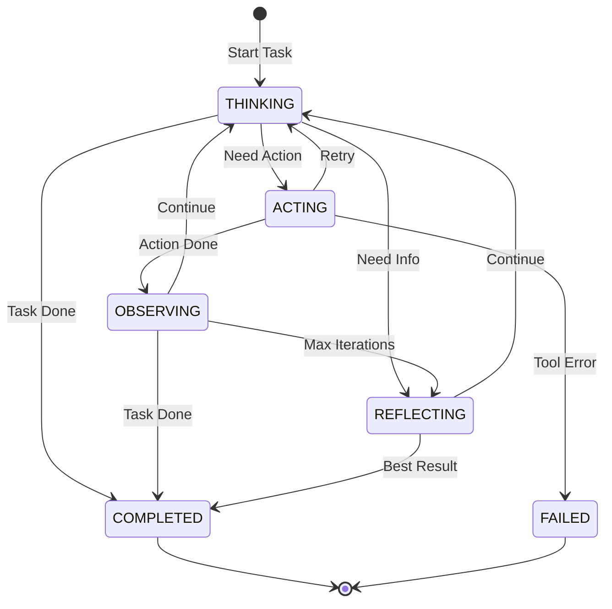

# 2.3.3 任务执行状态机与工作流管理

## 学习目标

🏗️ **架构设计层面**
- 学会设计任务分解与执行的状态机模型
- 理解任务依赖图与状态转换图的映射关系
- 掌握多任务协调的状态管理架构

⚙️ **工程实现层面**
- 掌握ReAct框架中Thought-Action-Observation循环的状态转换
- 学会实现任务失败恢复与状态回滚机制
- 掌握任务执行上下文的状态维护技术

🚀 **企业级应用**
- 理解工作流管理中的状态协调机制
- 掌握任务执行监控与性能优化策略

## 引言

在前面的章节中，我们建立了状态机的理论基础（2.3.1）并学习了Agent级状态机的设计原则（2.3.2）。现在我们将这些原则应用到更复杂的场景——**任务执行状态机与工作流管理**。

### 为什么需要任务执行状态机？

在Agentic AI应用中，一个复杂的用户请求往往需要分解为多个子任务。例如，用户询问"帮我分析这个月的销售数据并生成报告"，系统可能需要：
1. 从数据库查询销售数据
2. 对数据进行清洗和预处理
3. 进行统计分析
4. 生成可视化图表
5. 撰写分析报告

每个子任务都有自己的执行状态（待执行、执行中、已完成、失败等），而且任务之间存在依赖关系（如必须先查询数据才能分析）。**任务执行状态机就是用来管理这些任务的状态转换和协调执行的核心机制**。

本节将深入分析任务执行状态机的设计，展示如何将设计原则应用到任务规划、分解、执行和监控的完整流程中。

## 1. 任务状态模型设计

在设计任务状态模型时，我们将严格遵循2.3.1章节中建立的设计原则：状态的完整性、互斥性和可观测性。同时应用SOLID原则中的单一职责原则，确保每个状态都有明确的职责边界。

### 1.1 任务状态枚举定义

参考代码示例：**[CODE-001] TaskState枚举定义**

任务状态枚举是任务执行状态机的核心，它严格遵循了2.3.1节中提到的**状态完整性、互斥性和语义明确性**原则。与Agent状态不同，任务状态需要更细粒度的控制，以支持复杂的工作流管理。

### 1.2 任务数据模型

**设计说明**：任务计划数据模型(`Plan`)用于存储任务的整体规划信息，包括步骤列表、状态追踪和进度管理。它提供了同步的状态更新方法，确保在多线程环境下的数据一致性。

```java
/**
 * 任务计划数据模型 - 管理任务步骤和执行状态
 */
@Data
@Builder
public class Plan {
    private List<String> steps;           // 任务步骤列表
    private List<String> stepStatus;      // 每个步骤的状态（pending/running/completed）
    private String currentStep;           // 当前执行步骤
    private int currentIndex;             // 当前步骤索引
    
    /**
     * 获取下一个待执行的任务
     */
    public String getNextPendingTask() {
        for (int i = 0; i < steps.size(); i++) {
            if ("pending".equals(stepStatus.get(i))) {
                return steps.get(i);
            }
        }
        return null;
    }
    
    /**
     * 更新任务状态 - 使用synchronized保证线程安全
     */
    public synchronized void updateTaskStatus(int index, String status) {
        if (index >= 0 && index < stepStatus.size()) {
            stepStatus.set(index, status);
            if ("running".equals(status)) {
                currentIndex = index;
                currentStep = steps.get(index);
            }
        }
    }
    
    /**
     * 获取执行进度百分比
     */
    public double getProgress() {
        long completedCount = stepStatus.stream()
            .filter("completed"::equals)
            .count();
        return (double) completedCount / steps.size() * 100;
    }
}
```

### 1.3 任务执行上下文

**设计说明**：任务执行上下文(`TaskExecutionContext`)封装了单个任务执行过程中的所有状态信息，包括任务标识、状态、重试机制、依赖关系和时间追踪。它是任务状态机的核心数据结构。

```java
/**
 * 任务执行上下文 - 维护任务执行过程中的状态信息
 */
@Data
@Builder
public class TaskExecutionContext {
    // 任务标识
    private String taskId;
    private String taskDescription;
    
    // 状态管理
    private TaskState currentState;
    private int retryCount;
    private int maxRetries = 3;
    
    // 执行结果
    private String result;
    private String errorMessage;
    private List<String> intermediateResults = new ArrayList<>();
    
    // 依赖关系
    private List<String> dependencies = new ArrayList<>();
    
    // 时间追踪
    private long startTime;
    private long endTime;
    
    /**
     * 检查依赖是否满足 - 所有依赖任务必须完成
     */
    public boolean areDependenciesSatisfied(Map<String, TaskState> taskStates) {
        return dependencies.stream()
            .allMatch(depId -> taskStates.get(depId) == TaskState.COMPLETED);
    }
    
    /**
     * 更新任务状态 - 自动追踪时间信息
     */
    public void updateState(TaskState newState) {
        this.currentState = newState;
        
        // 任务开始时记录开始时间
        if (newState == TaskState.RUNNING && startTime == 0) {
            this.startTime = System.currentTimeMillis();
        } 
        // 任务结束时记录结束时间
        else if (newState == TaskState.COMPLETED || newState == TaskState.FAILED) {
            this.endTime = System.currentTimeMillis();
        }
    }
}
```

## 2. ReAct框架的任务状态循环

### 2.1 思考-行动-观察状态机

```java
/**
 * ReAct任务执行状态机
 */
public class ReActTaskStateMachine {
    
    public enum ReActState {
        THINKING,    // 思考阶段：分析问题，制定行动计划
        ACTING,      // 行动阶段：执行工具调用或生成输出
        OBSERVING,   // 观察阶段：分析行动结果，决定下一步
        REFLECTING   // 反思阶段：评估整体进展，调整策略
    }
    
    private ReActState currentState = ReActState.THINKING;
    private TaskExecutionContext taskContext;
    private int maxIterations = 10;
    private int currentIteration = 0;
    
    /**
     * 执行ReAct循环的单次迭代
     */
    public TaskExecutionResult executeIteration() {
        currentIteration++;
        
        try {
            switch (currentState) {
                case THINKING:
                    return executeThinking();
                case ACTING:
                    return executeActing();
                case OBSERVING:
                    return executeObserving();
                case REFLECTING:
                    return executeReflecting();
                default:
                    throw new IllegalStateException("Unknown ReAct state: " + currentState);
            }
        } catch (Exception e) {
            taskContext.updateState(TaskState.FAILED);
            taskContext.setErrorMessage(e.getMessage());
            return TaskExecutionResult.failure(e.getMessage());
        }
    }
    
    /**
     * 思考阶段 - 分析当前情况并制定行动计划
     */
    private TaskExecutionResult executeThinking() {
        log.info("ReAct Thinking phase for task: {}", taskContext.getTaskId());
        
        // 构建思考prompt
        String thinkingPrompt = buildThinkingPrompt(taskContext);
        
        // 调用LLM进行思考
        LLMResponse thinkingResult = llm.chat(thinkingPrompt);
        
        // 解析思考结果
        ThoughtAnalysis analysis = parseThinkingResult(thinkingResult.getContent());
        
        // 决定下一步状态
        if (analysis.shouldAct()) {
            transitionTo(ReActState.ACTING);
            return TaskExecutionResult.intermediate("Thinking completed, moving to action");
        } else if (analysis.isTaskComplete()) {
            taskContext.updateState(TaskState.COMPLETED);
            taskContext.setResult(analysis.getFinalAnswer());
            return TaskExecutionResult.success(analysis.getFinalAnswer());
        } else {
            transitionTo(ReActState.REFLECTING);
            return TaskExecutionResult.intermediate("Need more information, moving to reflection");
        }
    }
    
    /**
     * 行动阶段 - 执行具体的工具调用或生成输出
     */
    private TaskExecutionResult executeActing() {
        log.info("ReAct Acting phase for task: {}", taskContext.getTaskId());
        
        // 解析需要执行的工具调用
        List<ToolCall> toolCalls = parseToolCallsFromContext();
        
        if (toolCalls.isEmpty()) {
            // 无工具调用，直接输出结果
            transitionTo(ReActState.OBSERVING);
            return TaskExecutionResult.intermediate("No tool calls needed");
        }
        
        // 执行工具调用
        List<String> actionResults = new ArrayList<>();
        for (ToolCall toolCall : toolCalls) {
            try {
                String result = executeToolCall(toolCall);
                actionResults.add(result);
                
                // 保存中间结果
                taskContext.getIntermediateResults().add(
                    String.format("Tool: %s, Result: %s", toolCall.getName(), result)
                );
                
            } catch (ToolExecutionException e) {
                log.error("Tool execution failed: {}", toolCall.getName(), e);
                
                if (taskContext.getRetryCount() < taskContext.getMaxRetries()) {
                    taskContext.setRetryCount(taskContext.getRetryCount() + 1);
                    transitionTo(ReActState.THINKING); // 重新思考
                    return TaskExecutionResult.retry("Tool execution failed, retrying");
                } else {
                    taskContext.updateState(TaskState.FAILED);
                    return TaskExecutionResult.failure("Tool execution failed after retries");
                }
            }
        }
        
        // 转换到观察阶段
        transitionTo(ReActState.OBSERVING);
        return TaskExecutionResult.intermediate(String.join("\n", actionResults));
    }
    
    /**
     * 观察阶段 - 分析行动结果
     */
    private TaskExecutionResult executeObserving() {
        log.info("ReAct Observing phase for task: {}", taskContext.getTaskId());
        
        // 分析行动结果
        String lastResult = taskContext.getIntermediateResults().isEmpty() 
            ? "" : taskContext.getIntermediateResults().get(
                taskContext.getIntermediateResults().size() - 1);
        
        ObservationAnalysis analysis = analyzeActionResult(lastResult);
        
        // 根据分析结果决定下一步
        if (analysis.isTaskComplete()) {
            taskContext.updateState(TaskState.COMPLETED);
            taskContext.setResult(analysis.getFinalResult());
            return TaskExecutionResult.success(analysis.getFinalResult());
        } else if (analysis.needsMoreAction()) {
            transitionTo(ReActState.THINKING);
            return TaskExecutionResult.intermediate("Need more actions");
        } else if (currentIteration >= maxIterations) {
            transitionTo(ReActState.REFLECTING);
            return TaskExecutionResult.intermediate("Max iterations reached, reflecting");
        } else {
            transitionTo(ReActState.THINKING);
            return TaskExecutionResult.intermediate("Continue thinking");
        }
    }
    
    /**
     * 反思阶段 - 评估整体执行情况
     */
    private TaskExecutionResult executeReflecting() {
        log.info("ReAct Reflecting phase for task: {}", taskContext.getTaskId());
        
        // 构建反思prompt
        String reflectionPrompt = buildReflectionPrompt(taskContext);
        
        // 进行反思
        LLMResponse reflectionResult = llm.chat(reflectionPrompt);
        ReflectionAnalysis analysis = parseReflectionResult(reflectionResult.getContent());
        
        if (analysis.shouldContinue() && currentIteration < maxIterations) {
            transitionTo(ReActState.THINKING);
            return TaskExecutionResult.intermediate("Reflection suggests continuing");
        } else {
            // 任务结束，输出最佳结果
            taskContext.updateState(TaskState.COMPLETED);
            String finalResult = analysis.getBestResult();
            taskContext.setResult(finalResult);
            return TaskExecutionResult.success(finalResult);
        }
    }
    
    /**
     * 状态转换
     */
    private void transitionTo(ReActState newState) {
        log.debug("ReAct state transition: {} -> {}", currentState, newState);
        this.currentState = newState;
        taskContext.setLastUpdateTime(System.currentTimeMillis());
    }
}
```

### 2.2 任务状态转换图



## 3. 任务依赖图与工作流管理

### 3.1 任务依赖图构建

```java
/**
 * 任务依赖图管理器
 */
@Component
public class TaskDependencyManager {
    
    /**
     * 任务依赖图节点
     */
    @Data
    @Builder
    public static class TaskNode {
        private String taskId;
        private String description;
        private TaskState state;
        private Set<String> dependencies = new HashSet<>();
        private Set<String> dependents = new HashSet<>();
        private TaskExecutionContext context;
        
        /**
         * 检查是否可以执行
         */
        public boolean isReadyToExecute(Map<String, TaskNode> allTasks) {
            return dependencies.stream()
                .allMatch(depId -> {
                    TaskNode dep = allTasks.get(depId);
                    return dep != null && dep.getState() == TaskState.COMPLETED;
                });
        }
    }
    
    private final Map<String, TaskNode> taskGraph = new ConcurrentHashMap<>();
    private final ExecutorService taskExecutor = Executors.newFixedThreadPool(10);
    
    /**
     * 构建任务依赖图
     */
    public void buildDependencyGraph(Plan plan) {
        // 解析任务和依赖关系
        for (int i = 0; i < plan.getSteps().size(); i++) {
            String taskDescription = plan.getSteps().get(i);
            String taskId = "task_" + i;
            
            TaskNode node = TaskNode.builder()
                .taskId(taskId)
                .description(taskDescription)
                .state(TaskState.PLANNED)
                .context(TaskExecutionContext.builder()
                    .taskId(taskId)
                    .taskDescription(taskDescription)
                    .currentState(TaskState.PLANNED)
                    .build())
                .build();
            
            // 分析依赖关系（简化版本）
            if (i > 0) {
                node.getDependencies().add("task_" + (i - 1));
                TaskNode prevNode = taskGraph.get("task_" + (i - 1));
                if (prevNode != null) {
                    prevNode.getDependents().add(taskId);
                }
            }
            
            taskGraph.put(taskId, node);
        }
    }
    
    /**
     * 获取可执行的任务列表
     */
    public List<TaskNode> getReadyTasks() {
        return taskGraph.values().stream()
            .filter(node -> node.getState() == TaskState.PLANNED || 
                          node.getState() == TaskState.PENDING)
            .filter(node -> node.isReadyToExecute(taskGraph))
            .collect(Collectors.toList());
    }
    
    /**
     * 更新任务状态并触发依赖检查
     */
    public void updateTaskState(String taskId, TaskState newState) {
        TaskNode node = taskGraph.get(taskId);
        if (node != null) {
            TaskState oldState = node.getState();
            node.setState(newState);
            node.getContext().updateState(newState);
            
            log.info("Task {} state updated: {} -> {}", taskId, oldState, newState);
            
            // 如果任务完成，检查其依赖任务
            if (newState == TaskState.COMPLETED) {
                checkDependentTasks(taskId);
            }
            
            // 如果任务失败，处理依赖任务
            if (newState == TaskState.FAILED) {
                handleFailedTaskDependencies(taskId);
            }
        }
    }
    
    /**
     * 检查依赖任务是否可以开始执行
     */
    private void checkDependentTasks(String completedTaskId) {
        TaskNode completedTask = taskGraph.get(completedTaskId);
        if (completedTask != null) {
            completedTask.getDependents().forEach(dependentId -> {
                TaskNode dependent = taskGraph.get(dependentId);
                if (dependent != null && 
                    dependent.getState() == TaskState.PLANNED &&
                    dependent.isReadyToExecute(taskGraph)) {
                    
                    // 将依赖任务标记为待执行
                    updateTaskState(dependentId, TaskState.PENDING);
                }
            });
        }
    }
    
    /**
     * 处理失败任务的依赖关系
     */
    private void handleFailedTaskDependencies(String failedTaskId) {
        TaskNode failedTask = taskGraph.get(failedTaskId);
        if (failedTask != null) {
            // 递归标记所有依赖任务为跳过状态
            markDependentsAsSkipped(failedTaskId);
        }
    }
    
    private void markDependentsAsSkipped(String taskId) {
        TaskNode task = taskGraph.get(taskId);
        if (task != null) {
            task.getDependents().forEach(dependentId -> {
                TaskNode dependent = taskGraph.get(dependentId);
                if (dependent != null && 
                    (dependent.getState() == TaskState.PLANNED || 
                     dependent.getState() == TaskState.PENDING)) {
                    
                    updateTaskState(dependentId, TaskState.SKIPPED);
                    markDependentsAsSkipped(dependentId); // 递归处理
                }
            });
        }
    }
}
```

### 3.2 工作流执行引擎

```java
/**
 * 工作流执行引擎 - 协调任务执行和状态管理
 */
@Component
public class WorkflowExecutionEngine {
    
    @Autowired
    private TaskDependencyManager dependencyManager;
    
    @Autowired
    private ExecutorAgent executorAgent;
    
    private final ScheduledExecutorService scheduler = 
        Executors.newScheduledThreadPool(5);
    
    /**
     * 执行工作流
     */
    public CompletableFuture<WorkflowResult> executeWorkflow(Plan plan) {
        String workflowId = UUID.randomUUID().toString();
        log.info("Starting workflow execution: {}", workflowId);
        
        // 构建任务依赖图
        dependencyManager.buildDependencyGraph(plan);
        
        // 创建工作流执行上下文
        WorkflowExecutionContext context = WorkflowExecutionContext.builder()
            .workflowId(workflowId)
            .plan(plan)
            .startTime(System.currentTimeMillis())
            .state(WorkflowState.RUNNING)
            .build();
        
        // 异步执行工作流
        return CompletableFuture.supplyAsync(() -> {
            try {
                return executeWorkflowInternal(context);
            } catch (Exception e) {
                log.error("Workflow execution failed: {}", workflowId, e);
                context.setState(WorkflowState.FAILED);
                context.setErrorMessage(e.getMessage());
                return WorkflowResult.failure(workflowId, e.getMessage());
            }
        });
    }
    
    /**
     * 内部工作流执行逻辑
     */
    private WorkflowResult executeWorkflowInternal(WorkflowExecutionContext context) {
        while (context.getState() == WorkflowState.RUNNING) {
            // 获取可执行的任务
            List<TaskDependencyManager.TaskNode> readyTasks = 
                dependencyManager.getReadyTasks();
            
            if (readyTasks.isEmpty()) {
                // 检查是否所有任务都已完成
                if (isWorkflowComplete()) {
                    context.setState(WorkflowState.COMPLETED);
                    break;
                } else {
                    // 等待正在执行的任务完成
                    try {
                        Thread.sleep(1000);
                    } catch (InterruptedException e) {
                        Thread.currentThread().interrupt();
                        break;
                    }
                    continue;
                }
            }
            
            // 并行执行可执行的任务
            List<CompletableFuture<Void>> taskFutures = readyTasks.stream()
                .map(this::executeTaskAsync)
                .collect(Collectors.toList());
            
            // 等待当前批次任务完成
            CompletableFuture.allOf(taskFutures.toArray(new CompletableFuture[0]))
                .join();
        }
        
        // 生成执行结果
        context.setEndTime(System.currentTimeMillis());
        return generateWorkflowResult(context);
    }
    
    /**
     * 异步执行单个任务
     */
    private CompletableFuture<Void> executeTaskAsync(TaskDependencyManager.TaskNode taskNode) {
        return CompletableFuture.runAsync(() -> {
            try {
                log.info("Executing task: {}", taskNode.getTaskId());
                
                // 更新任务状态为执行中
                dependencyManager.updateTaskState(taskNode.getTaskId(), TaskState.RUNNING);
                
                // 创建ReAct执行器
                ReActTaskStateMachine reactMachine = new ReActTaskStateMachine();
                reactMachine.setTaskContext(taskNode.getContext());
                
                // 执行任务
                TaskExecutionResult result = null;
                while (result == null || result.isIntermediate()) {
                    result = reactMachine.executeIteration();
                    
                    if (result.isFailure()) {
                        dependencyManager.updateTaskState(taskNode.getTaskId(), TaskState.FAILED);
                        taskNode.getContext().setErrorMessage(result.getMessage());
                        return;
                    }
                }
                
                // 任务成功完成
                dependencyManager.updateTaskState(taskNode.getTaskId(), TaskState.COMPLETED);
                taskNode.getContext().setResult(result.getMessage());
                
                log.info("Task completed successfully: {}", taskNode.getTaskId());
                
            } catch (Exception e) {
                log.error("Task execution failed: {}", taskNode.getTaskId(), e);
                dependencyManager.updateTaskState(taskNode.getTaskId(), TaskState.FAILED);
                taskNode.getContext().setErrorMessage(e.getMessage());
            }
        });
    }
    
    /**
     * 检查工作流是否完成
     */
    private boolean isWorkflowComplete() {
        return dependencyManager.getAllTasks().stream()
            .allMatch(task -> task.getState() == TaskState.COMPLETED ||
                             task.getState() == TaskState.FAILED ||
                             task.getState() == TaskState.SKIPPED);
    }
}
```

## 4. 任务失败恢复与状态回滚

### 4.1 任务失败恢复策略

```java
/**
 * 任务恢复策略管理器
 */
@Component
public class TaskRecoveryManager {
    
    public enum RecoveryStrategy {
        RETRY,           // 重试策略：重新执行失败的任务
        SKIP,            // 跳过策略：跳过失败任务，继续执行后续任务
        FALLBACK,        // 降级策略：使用备选方案执行任务
        RESTART,         // 重启策略：从检查点重新开始执行
        MANUAL          // 手动策略：需要人工介入处理
    }
    
    /**
     * 处理任务失败
     */
    public void handleTaskFailure(TaskDependencyManager.TaskNode failedTask, Exception error) {
        TaskExecutionContext context = failedTask.getContext();
        RecoveryStrategy strategy = determineRecoveryStrategy(failedTask, error);
        
        log.info("Handling task failure for {}, strategy: {}", 
            failedTask.getTaskId(), strategy);
        
        switch (strategy) {
            case RETRY:
                handleRetryStrategy(failedTask);
                break;
            case SKIP:
                handleSkipStrategy(failedTask);
                break;
            case FALLBACK:
                handleFallbackStrategy(failedTask);
                break;
            case RESTART:
                handleRestartStrategy(failedTask);
                break;
            case MANUAL:
                handleManualStrategy(failedTask);
                break;
            default:
                log.warn("Unknown recovery strategy: {}", strategy);
        }
    }
    
    /**
     * 确定恢复策略
     */
    private RecoveryStrategy determineRecoveryStrategy(
            TaskDependencyManager.TaskNode task, Exception error) {
        
        TaskExecutionContext context = task.getContext();
        
        // 根据错误类型和重试次数确定策略
        if (error instanceof ToolExecutionException) {
            ToolExecutionException toolError = (ToolExecutionException) error;
            if (toolError.isRetryable() && context.getRetryCount() < context.getMaxRetries()) {
                return RecoveryStrategy.RETRY;
            } else if (toolError.hasFallback()) {
                return RecoveryStrategy.FALLBACK;
            }
        } else if (error instanceof NetworkException) {
            if (context.getRetryCount() < 2) {
                return RecoveryStrategy.RETRY;
            }
        } else if (error instanceof TokenLimitExceeded) {
            return RecoveryStrategy.RESTART; // 从检查点重新开始
        }
        
        // 根据任务重要性决定
        if (isTaskCritical(task)) {
            return RecoveryStrategy.MANUAL;
        } else {
            return RecoveryStrategy.SKIP;
        }
    }
    
    /**
     * 重试策略处理
     */
    private void handleRetryStrategy(TaskDependencyManager.TaskNode task) {
        TaskExecutionContext context = task.getContext();
        context.setRetryCount(context.getRetryCount() + 1);
        
        // 清理之前的失败状态
        context.setErrorMessage(null);
        context.getIntermediateResults().clear();
        
        // 延迟重试
        long delay = calculateRetryDelay(context.getRetryCount());
        scheduler.schedule(() -> {
            // 重置任务状态为待执行
            dependencyManager.updateTaskState(task.getTaskId(), TaskState.PENDING);
            log.info("Retrying task {} (attempt {})", 
                task.getTaskId(), context.getRetryCount());
        }, delay, TimeUnit.SECONDS);
    }
    
    /**
     * 降级策略处理
     */
    private void handleFallbackStrategy(TaskDependencyManager.TaskNode task) {
        log.info("Applying fallback strategy for task: {}", task.getTaskId());
        
        // 使用简化版本的任务描述
        String fallbackDescription = generateFallbackTask(task.getDescription());
        task.setDescription(fallbackDescription);
        
        // 重置任务状态
        task.getContext().setRetryCount(0);
        dependencyManager.updateTaskState(task.getTaskId(), TaskState.PENDING);
    }
    
    /**
     * 检查点重启策略
     */
    private void handleRestartStrategy(TaskDependencyManager.TaskNode task) {
        log.info("Restarting task from checkpoint: {}", task.getTaskId());
        
        // 加载最近的检查点
        TaskCheckpoint checkpoint = loadLastCheckpoint(task.getTaskId());
        if (checkpoint != null) {
            // 恢复到检查点状态
            restoreFromCheckpoint(task, checkpoint);
            dependencyManager.updateTaskState(task.getTaskId(), TaskState.PENDING);
        } else {
            // 无检查点，完全重新开始
            task.getContext().setRetryCount(0);
            task.getContext().getIntermediateResults().clear();
            dependencyManager.updateTaskState(task.getTaskId(), TaskState.PENDING);
        }
    }
    
    /**
     * 计算重试延迟（指数退避）
     */
    private long calculateRetryDelay(int retryCount) {
        return Math.min(60, (long) Math.pow(2, retryCount - 1));
    }
}
```

### 4.2 状态快照与回滚机制

```java
/**
 * 任务状态快照管理
 */
@Component
public class TaskSnapshotManager {
    
    /**
     * 任务检查点数据
     */
    @Data
    @Builder
    public static class TaskCheckpoint {
        private String taskId;
        private String checkpointId;
        private TaskState state;
        private List<String> intermediateResults;
        private Map<String, Object> contextData;
        private long timestamp;
        private String description;
    }
    
    private final Map<String, List<TaskCheckpoint>> checkpointStore = 
        new ConcurrentHashMap<>();
    
    /**
     * 创建任务检查点
     */
    public void createCheckpoint(TaskDependencyManager.TaskNode task) {
        String checkpointId = UUID.randomUUID().toString();
        
        TaskCheckpoint checkpoint = TaskCheckpoint.builder()
            .taskId(task.getTaskId())
            .checkpointId(checkpointId)
            .state(task.getState())
            .intermediateResults(new ArrayList<>(
                task.getContext().getIntermediateResults()))
            .contextData(new HashMap<>()) // 复制上下文数据
            .timestamp(System.currentTimeMillis())
            .description("Checkpoint at " + task.getState())
            .build();
        
        // 存储检查点
        checkpointStore.computeIfAbsent(task.getTaskId(), k -> new ArrayList<>())
            .add(checkpoint);
        
        // 只保留最近的5个检查点
        List<TaskCheckpoint> checkpoints = checkpointStore.get(task.getTaskId());
        if (checkpoints.size() > 5) {
            checkpoints.remove(0);
        }
        
        log.debug("Created checkpoint {} for task {}", checkpointId, task.getTaskId());
    }
    
    /**
     * 回滚到指定检查点
     */
    public boolean rollbackToCheckpoint(TaskDependencyManager.TaskNode task, 
                                       String checkpointId) {
        List<TaskCheckpoint> checkpoints = checkpointStore.get(task.getTaskId());
        if (checkpoints == null) {
            log.warn("No checkpoints found for task: {}", task.getTaskId());
            return false;
        }
        
        TaskCheckpoint targetCheckpoint = checkpoints.stream()
            .filter(cp -> cp.getCheckpointId().equals(checkpointId))
            .findFirst()
            .orElse(null);
        
        if (targetCheckpoint == null) {
            log.warn("Checkpoint {} not found for task {}", checkpointId, task.getTaskId());
            return false;
        }
        
        // 恢复任务状态
        task.setState(targetCheckpoint.getState());
        task.getContext().updateState(targetCheckpoint.getState());
        task.getContext().getIntermediateResults().clear();
        task.getContext().getIntermediateResults()
            .addAll(targetCheckpoint.getIntermediateResults());
        
        log.info("Rolled back task {} to checkpoint {}", 
            task.getTaskId(), checkpointId);
        
        return true;
    }
    
    /**
     * 获取任务的所有检查点
     */
    public List<TaskCheckpoint> getTaskCheckpoints(String taskId) {
        return checkpointStore.getOrDefault(taskId, new ArrayList<>());
    }
    
    /**
     * 清理过期检查点
     */
    @Scheduled(fixedRate = 3600000) // 每小时执行一次
    public void cleanupExpiredCheckpoints() {
        long expireTime = System.currentTimeMillis() - TimeUnit.DAYS.toMillis(7);
        
        checkpointStore.values().forEach(checkpoints -> {
            checkpoints.removeIf(checkpoint -> checkpoint.getTimestamp() < expireTime);
        });
        
        // 移除空的检查点列表
        checkpointStore.entrySet().removeIf(entry -> entry.getValue().isEmpty());
    }
}
```

## 5. 任务状态监控与可视化

### 5.1 任务状态监控器

```java
/**
 * 任务状态监控器
 */
@Component
public class TaskStateMonitor {
    
    /**
     * 任务执行统计信息
     */
    @Data
    @Builder
    public static class TaskStatistics {
        private int totalTasks;
        private int completedTasks;
        private int failedTasks;
        private int runningTasks;
        private int pendingTasks;
        private double completionRate;
        private long averageExecutionTime;
        private long totalExecutionTime;
    }
    
    private final Map<String, TaskStateListener> stateListeners = 
        new ConcurrentHashMap<>();
    
    /**
     * 监听任务状态变化
     */
    public interface TaskStateListener {
        void onStateChanged(String taskId, TaskState oldState, TaskState newState);
    }
    
    /**
     * 注册状态变化监听器
     */
    public void addStateListener(String listenerId, TaskStateListener listener) {
        stateListeners.put(listenerId, listener);
    }
    
    /**
     * 通知状态变化
     */
    public void notifyStateChange(String taskId, TaskState oldState, TaskState newState) {
        stateListeners.values().forEach(listener -> {
            try {
                listener.onStateChanged(taskId, oldState, newState);
            } catch (Exception e) {
                log.error("Error in state listener", e);
            }
        });
    }
    
    /**
     * 获取任务执行统计
     */
    public TaskStatistics getTaskStatistics(String workflowId) {
        Map<String, TaskDependencyManager.TaskNode> tasks = 
            dependencyManager.getWorkflowTasks(workflowId);
        
        int total = tasks.size();
        int completed = 0;
        int failed = 0;
        int running = 0;
        int pending = 0;
        long totalExecTime = 0;
        
        for (TaskDependencyManager.TaskNode task : tasks.values()) {
            TaskExecutionContext context = task.getContext();
            
            switch (task.getState()) {
                case COMPLETED:
                    completed++;
                    if (context.getEndTime() > 0 && context.getStartTime() > 0) {
                        totalExecTime += (context.getEndTime() - context.getStartTime());
                    }
                    break;
                case FAILED:
                    failed++;
                    break;
                case RUNNING:
                    running++;
                    break;
                case PENDING:
                case PLANNED:
                    pending++;
                    break;
            }
        }
        
        return TaskStatistics.builder()
            .totalTasks(total)
            .completedTasks(completed)
            .failedTasks(failed)
            .runningTasks(running)
            .pendingTasks(pending)
            .completionRate(total > 0 ? (double) completed / total * 100 : 0)
            .averageExecutionTime(completed > 0 ? totalExecTime / completed : 0)
            .totalExecutionTime(totalExecTime)
            .build();
    }
}
```

## 6. 小结

本节详细探讨了任务执行状态机与工作流管理的关键技术：

1. **任务状态模型**：设计了完整的任务状态枚举和数据模型
2. **ReAct循环**：实现了思考-行动-观察-反思的状态机循环
3. **依赖图管理**：构建了任务依赖关系的图结构和执行引擎
4. **失败恢复**：提供了多种任务失败恢复策略和状态回滚机制
5. **状态监控**：建立了任务状态的监控和统计体系

这些技术组合起来，形成了一个健壮、可靠的任务执行状态机系统，能够有效处理复杂AI应用中的多任务协调和执行问题。

## 延伸思考

1. 如何优化大规模任务图的执行性能？
2. 如何实现跨会话的任务状态持久化？
3. 如何设计更智能的任务失败预测和预防机制？
4. 如何在分布式环境中保证任务执行的一致性？

下一节我们将探讨工具调用状态机与异步执行管理的具体实现。
