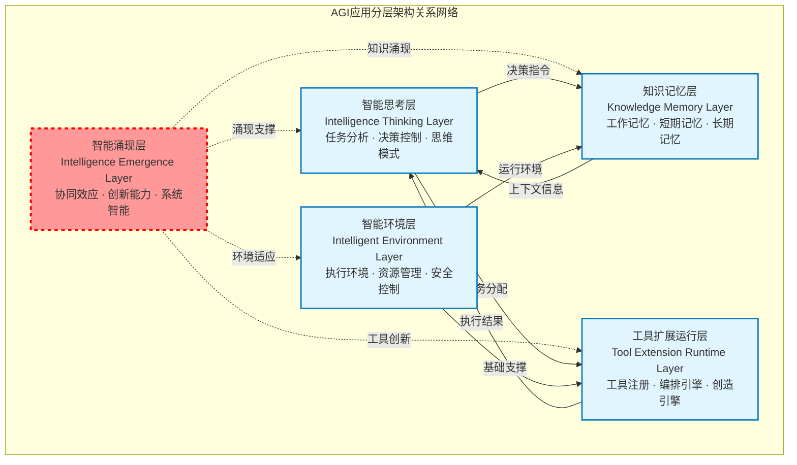
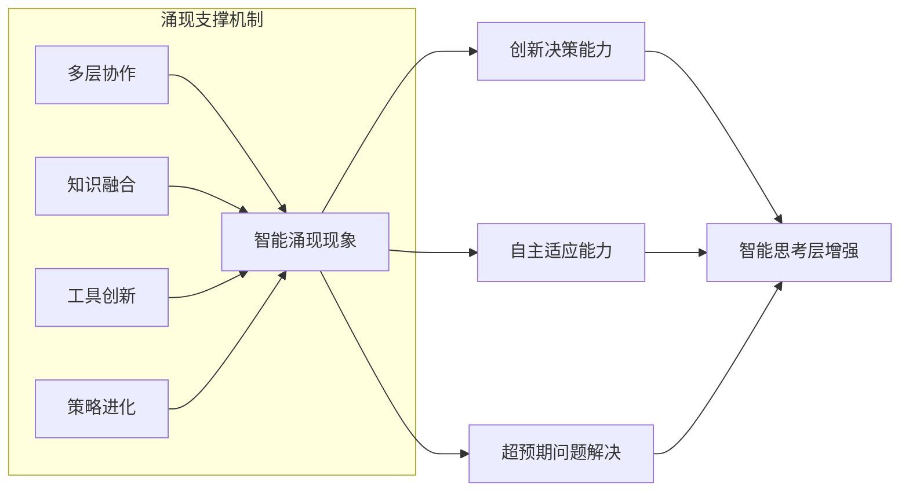
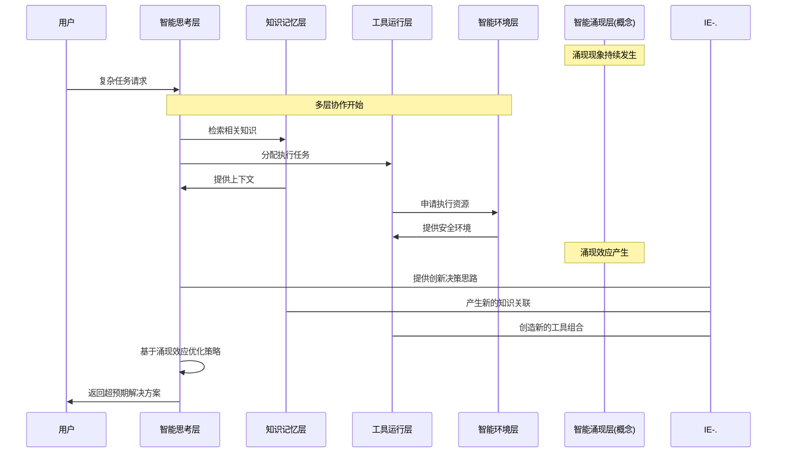
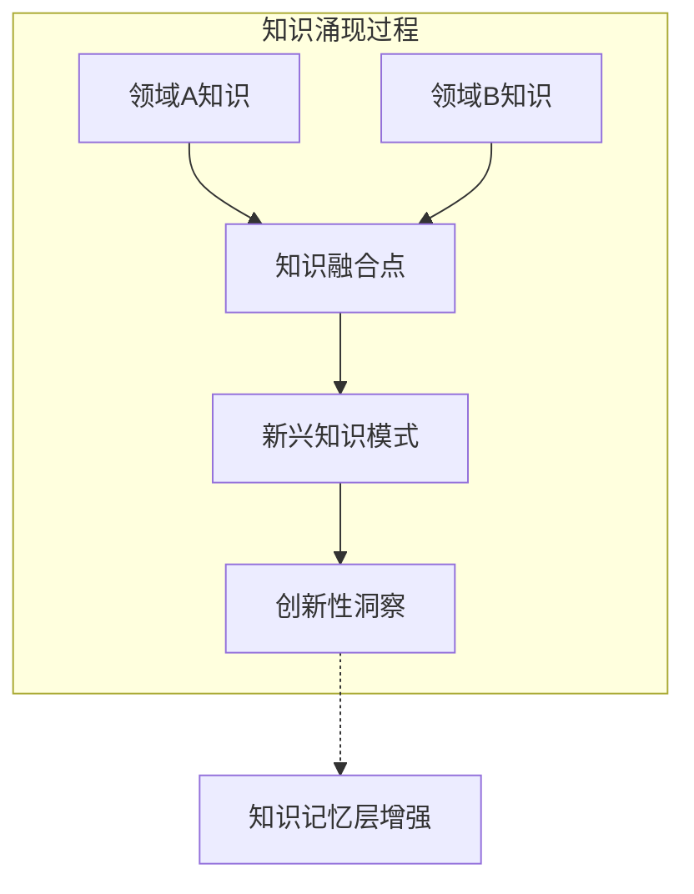
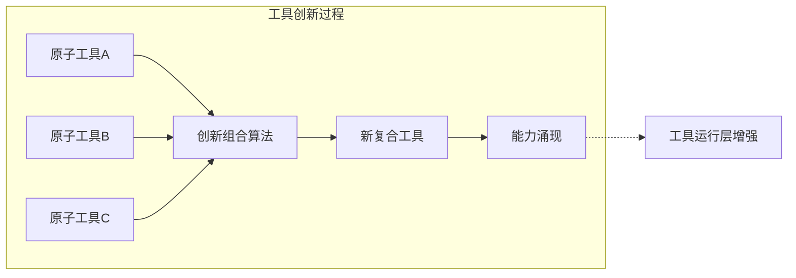
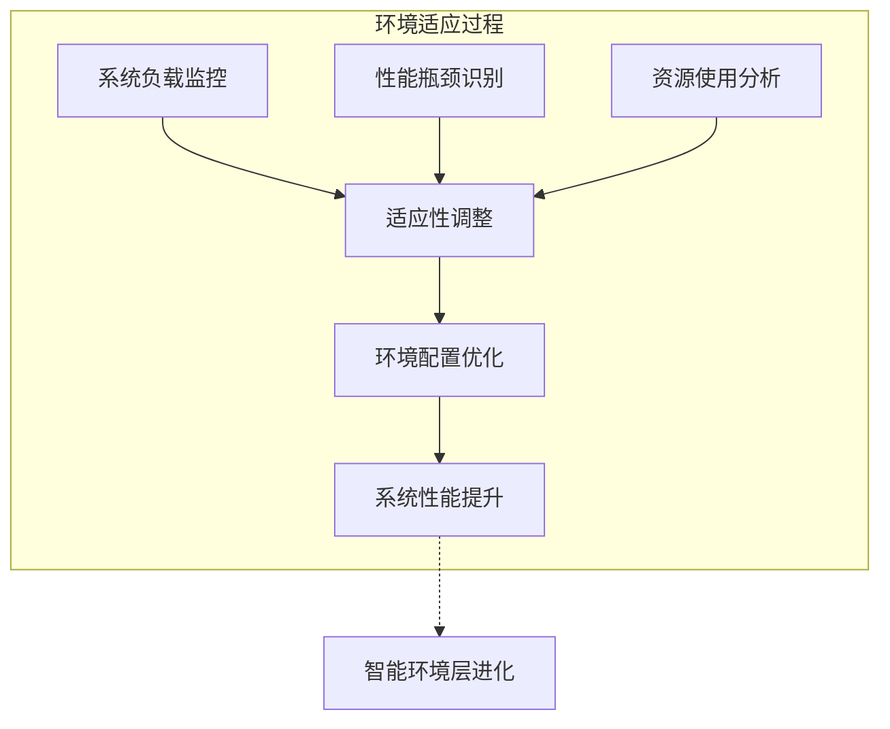
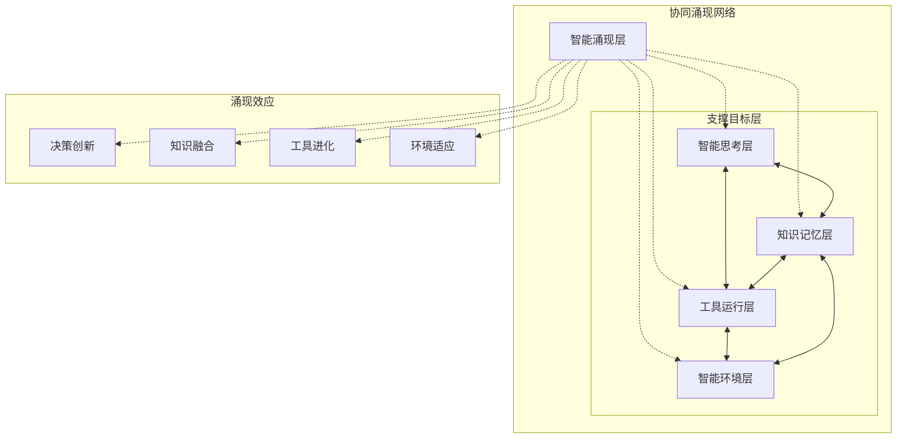

# 5.1.2 智能涌现层与其他核心层的关系分析

> **本节重点**：深入解析智能涌现层与AGI应用分层架构中其他层次的关系机制，理解涌现现象如何通过层间协作产生。

## 🔍 架构关系概览

在AGI应用分层架构中，智能涌现层与其他四个层次之间存在着复杂而精妙的关系网络。这些关系不是简单的调用依赖，而是通过协作、支撑、反馈等多种机制实现的系统性交互。

### 📊 关系图谱总览



## 🎯 智能涌现层与智能思考层的关系

### 涌现支撑关系：智能涌现层支撑智能思考层

这是AGI应用架构中最为关键的关系之一，体现了智能涌现对决策能力的根本性增强。

#### 🔍 关系本质分析

**1. 虚线关系的含义**
- 使用虚线（`-.->`)表示这不是直接的代码调用关系
- 智能涌现层是一个**概念性抽象层**，不对应具体的软件组件
- 它是系统整体行为的抽象表现

**2. "涌现支撑"的具体机制**



**3. 支撑效果的具体体现**
- **创新能力增强**：为智能思考层提供超越预设程序的创造性决策能力
- **自主适应能力**：让智能思考层具备自主学习和环境适应的能力
- **协同效应放大**：通过多层协作产生"1+1>2"的智能效应

#### 🚀 实际应用场景



## 🧠 智能涌现层与知识记忆层的关系

### 知识涌现关系：智能涌现层促进知识记忆层创新

智能涌现层通过知识融合和创新性关联，为知识记忆层带来新的认知能力。

#### 🔍 知识涌现机制

**1. 跨域知识融合**


**2. 记忆模式创新**
- **工作记忆优化**：通过涌现效应优化当前任务的信息组织方式
- **短期记忆关联**：发现会话中的隐含关联和模式
- **长期记忆进化**：形成新的知识结构和检索路径

**3. 语义理解深化**
- **概念重组**：重新组织和理解现有概念
- **关系发现**：发现知识间的新关系
- **模式识别**：识别复杂的知识模式

#### 💡 实践案例

```java
// 知识涌现的实际体现
public class EmergentKnowledgeSystem {
    private KnowledgeGraph knowledgeGraph;
    private SemanticAnalyzer semanticAnalyzer;
    
    // 知识涌现检测
    public List<EmergentPattern> detectEmergentPatterns() {
        // 通过多智能体协作发现新的知识模式
        List<KnowledgeCluster> clusters = analyzeKnowledgeClusters();
        return clusters.stream()
            .map(this::identifyEmergentPatterns)
            .flatMap(List::stream)
            .collect(toList());
    }
    
    // 涌现知识集成
    public void integrateEmergentKnowledge(EmergentPattern pattern) {
        // 将涌现的知识模式集成到记忆系统中
        knowledgeGraph.addEmergentRelation(pattern.getRelation());
        semanticAnalyzer.updateSemanticModel(pattern.getSemantics());
    }
}
```

## 🔧 智能涌现层与工具扩展运行层的关系

### 工具创新关系：智能涌现层推动工具扩展运行层进化

智能涌现层通过工具的创新性组合和进化，为工具扩展运行层带来新的能力边界。

#### 🔍 工具创新机制

**1. 原子工具重组**


**2. 工具进化路径**
- **功能融合**：将不同工具的功能进行智能融合
- **参数优化**：通过学习优化工具调用参数
- **执行策略进化**：发现更高效的工具执行策略

**3. 动态工具生态**
- **工具发现**：自动发现新的有用工具组合
- **工具适配**：智能适配工具到新的使用场景
- **工具优化**：持续优化工具性能和效果

#### 🚀 工具创新实例

```java
// 工具创新引擎
public class ToolInnovationEngine {
    private ToolCompositionAnalyzer analyzer;
    private ToolCombinator combinator;
    private EffectivenessEvaluator evaluator;
    
    // 涌现式工具创新
    public Tool createEmergentTool(TaskContext context) {
        // 1. 分析当前任务需求
        ToolRequirement requirement = analyzer.analyzeRequirement(context);
        
        // 2. 搜索可能的工具组合
        List<ToolCombination> candidates = combinator.generateCombinations(requirement);
        
        // 3. 评估组合效果
        ToolCombination bestCombination = candidates.stream()
            .max(Comparator.comparing(evaluator::evaluate))
            .orElse(null);
        
        // 4. 生成新工具
        return bestCombination != null ? 
            combinator.synthesizeTool(bestCombination) : null;
    }
    
    // 工具进化监控
    public void trackToolEvolution(Tool tool, ExecutionResult result) {
        // 记录工具使用效果，支持持续进化
        ToolEvolutionMetrics.record(tool, result);
    }
}
```

## 🐳 智能涌现层与智能环境层的关系

### 环境适应关系：智能涌现层优化智能环境层

智能涌现层通过环境感知和适应机制，推动智能环境层的动态优化和进化。

#### 🔍 环境适应机制

**1. 资源动态优化**


**2. 安全策略进化**
- **威胁模式学习**：学习新的安全威胁模式
- **防护策略优化**：动态调整安全防护策略
- **异常检测增强**：提升异常行为检测能力

**3. 容错能力提升**
- **故障模式识别**：识别系统故障的新模式
- **恢复策略优化**：优化系统故障恢复策略
- **预防机制强化**：强化故障预防机制

#### 💡 环境适应实践

```java
// 环境适应引擎
public class EnvironmentAdaptationEngine {
    private SystemMonitor monitor;
    private AdaptationStrategy strategy;
    private EnvironmentController controller;
    
    // 涌现式环境适应
    public void adaptEnvironment() {
        // 1. 监控系统状态
        SystemState currentState = monitor.getCurrentState();
        
        // 2. 分析适应需求
        AdaptationRequirement requirement = strategy.analyzeRequirement(currentState);
        
        // 3. 生成适应方案
        AdaptationPlan plan = strategy.generateAdaptationPlan(requirement);
        
        // 4. 执行环境调整
        controller.executeAdaptation(plan);
        
        // 5. 评估适应效果
        AdaptationResult result = monitor.evaluateAdaptation(plan);
        strategy.updateStrategy(result);
    }
    
    // 环境进化追踪
    public void trackEnvironmentEvolution() {
        // 记录环境变化和适应效果
        EnvironmentEvolutionMetrics.recordEvolution();
    }
}
```

## 🔄 层间关系的协同效应

### 涌现现象的系统性特征

智能涌现层与各层的关系不是孤立的，而是形成了一个相互增强的协同网络：



### 协同涌现的关键特征

**1. 多向反馈循环**
- 每层的涌现效应都会反馈到其他层
- 形成持续的优化和进化循环
- 系统整体智能水平螺旋上升

**2. 跨层能力融合**
- 不同层次的能力在涌现过程中相互融合
- 产生单一层次无法实现的复合能力
- 体现"整体大于部分之和"的系统特性

**3. 动态平衡机制**
- 各层在涌现过程中保持动态平衡
- 避免某一层的过度优化影响整体性能
- 确保系统的稳定性和可持续发展

## 🎯 理解检查与实践指导

### 关系理解检查清单

**智能涌现层理解检查**：
- [ ] 是否理解智能涌现层的概念性特征？
- [ ] 是否明白虚线关系与实线关系的区别？
- [ ] 是否掌握涌现支撑的具体机制？

**层间关系理解检查**：
- [ ] 是否理解涌现层对思维层的支撑机制？
- [ ] 是否明白知识涌现的工作原理？
- [ ] 是否掌握工具创新的实现路径？
- [ ] 是否理解环境适应的反馈机制？

### 实践应用建议

**1. 系统设计时的考虑**
```java
// 支持涌现的系统架构设计模板
public class EmergenceEnabledSystem {
    // 各层组件
    private IntelligenceThinkingLayer thinkingLayer;
    private KnowledgeMemoryLayer memoryLayer;
    private ToolExtensionLayer toolLayer;
    private IntelligentEnvironmentLayer envLayer;
    
    // 涌现监控器
    private EmergenceMonitor emergenceMonitor;
    
    public void enableEmergence() {
        // 启用跨层协作机制
        enableCrossLayerCollaboration();
        
        // 建立涌现监控
        emergenceMonitor.startMonitoring();
        
        // 激活适应性机制
        activateAdaptiveMechanisms();
    }
}
```

**2. 涌现效果评估**
- **定量指标**：系统性能提升、创新解决方案数量、适应速度等
- **定性评估**：用户满意度、问题解决质量、系统稳定性等
- **长期追踪**：系统进化轨迹、能力边界扩展、智能水平提升等

## 本节小结

智能涌现层与AGI应用架构各层次之间的关系是复杂而精妙的协同网络。通过深入理解这些关系，我们可以：

**关键收获**：
1. **概念性理解**：智能涌现层是概念抽象层，通过虚线关系体现支撑作用
2. **机制性认知**：涌现支撑通过多种机制实现，包括创新、融合、进化、适应
3. **系统性思维**：各层关系形成协同网络，产生系统性的智能涌现效应
4. **实践性指导**：提供了具体的设计模板和评估方法

**下一步行动**：
1. 在系统设计中考虑涌现关系的支撑作用
2. 建立涌现效果的监控和评估机制
3. 优化层间协作以促进智能涌现
4. 持续追踪和优化涌现效应

> **💡 核心要点**：理解智能涌现层的关系网络是构建高质量AGI应用的关键。这些关系不是简单的依赖调用，而是通过协作、支撑、反馈等机制实现的系统性智能增强。掌握这些关系的本质，将帮助开发者设计出真正具备涌现能力的AGI系统。
