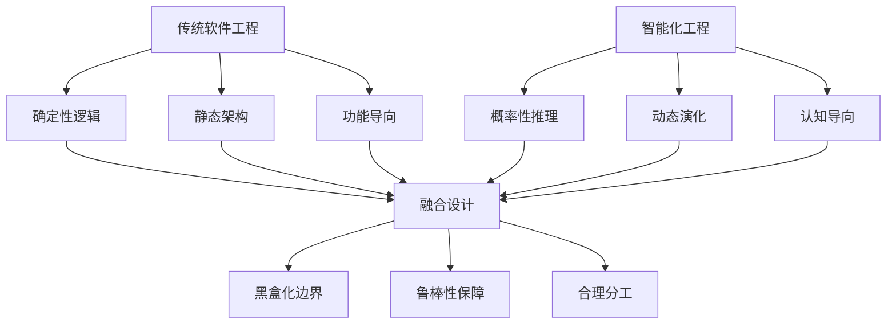
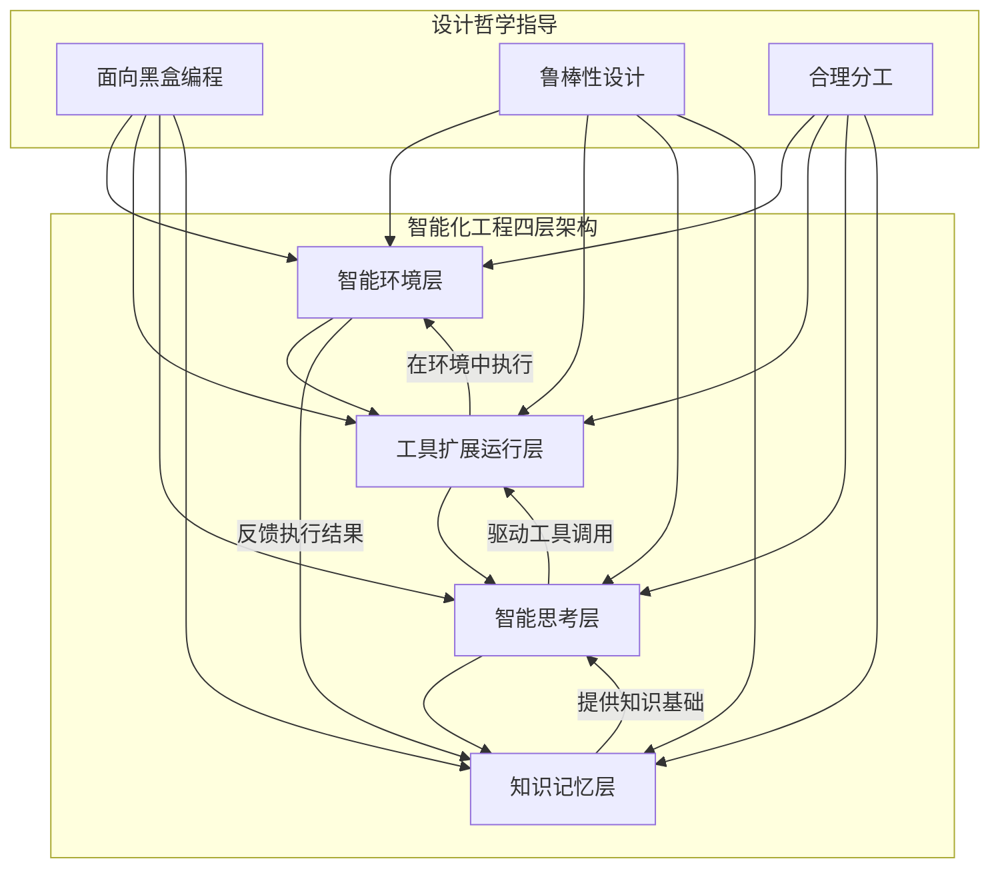

# 4.0 智能化工程简介

## 从设计哲学到工程实践的关键跃迁

在第三部分中，我们建立了AI应用开发的三大核心设计哲学：

- **3.1 面向黑盒编程**：学会了在不确定性中构建清晰的边界和接口
- **3.2 鲁棒性设计**：掌握了让系统在扰动中保持稳定并持续进化的方法
- **3.3 合理分工**：理解了AI与传统技术协同设计的架构原则

现在，我们面临一个关键问题：**如何将这些设计哲学转化为可落地的工程技术？**

第四部分"智能化工程"正是回答这一问题的技术体系。它不是简单的技术堆叠，而是基于前面建立的设计哲学，构建出一套系统性的工程实践框架。

## 智能化工程的本质定义

**智能化工程（Intelligent Engineering）**是一套面向AI应用的系统性工程方法论，它通过构建四大核心技术层次，将AI的智能能力转化为可工程化、可扩展、可治理的应用系统。

### 核心特征

智能化工程区别于传统软件工程的四个核心特征：

1. **认知驱动**：以模拟人类认知过程为设计原则，而非纯粹的数据处理
2. **动态适应**：系统能够基于经验和反馈持续学习和优化
3. **涌现导向**：通过组件协作产生超越单体能力的智能效应
4. **工程化约束**：在保持智能特性的同时满足工程可靠性要求

### 与传统工程的关系

智能化工程不是要替代传统软件工程，而是在其基础上增加智能化的维度，形成"传统工程+智能工程"的融合架构。

## 四大核心技术层次

智能化工程构建了一个四层的技术架构，每一层都承担着特定的职责：

### 第一层：知识记忆层（Knowledge Memory Layer）
- **核心职责**：构建AI应用的记忆与知识管理能力
- **技术重点**：上下文工程、记忆系统架构、RAG技术融合
- **设计哲学体现**：
  - 面向黑盒：将复杂的知识管理封装为标准接口
  - 鲁棒性：通过多层记忆架构保障知识的可靠性
  - 合理分工：AI负责语义理解，传统技术负责存储检索

### 第二层：智能思考层（Intelligent Reasoning Layer）
- **核心职责**：实现AI应用的推理、规划与决策能力
- **技术重点**：思维模式设计、推理链管理、决策优化
- **设计哲学体现**：
  - 面向黑盒：将复杂的推理过程模块化和标准化
  - 鲁棒性：通过多模式思维融合提升推理可靠性
  - 合理分工：AI负责创造性思考，传统技术负责逻辑验证

### 第三层：工具扩展运行层（Tool Extension Runtime Layer）
- **核心职责**：提供AI应用与外部世界交互的能力扩展
- **技术重点**：工具注册管理、智能编排、动态创造
- **设计哲学体现**：
  - 面向黑盒：将各种外部能力封装为统一的工具接口
  - 鲁棒性：通过工具生态的弹性适应保障系统稳定
  - 合理分工：AI负责工具选择，传统技术负责工具执行

### 第四层：智能环境层（Intelligent Environment Layer）
- **核心职责**：为AI应用提供安全、可控的运行环境
- **技术重点**：安全沙箱、资源管理、环境隔离
- **设计哲学体现**：
  - 面向黑盒：将复杂的环境管理抽象为简单的运行接口
  - 鲁棒性：通过环境隔离和资源控制保障系统安全
  - 合理分工：AI专注业务逻辑，传统技术保障运行环境

## 层次间的协同关系

四个技术层次不是孤立存在的，而是形成了一个有机的协同体系：

### 向上支撑关系
- **知识记忆层**为智能思考层提供决策所需的知识基础
- **智能思考层**为工具扩展层提供调用决策和执行策略
- **工具扩展层**为智能环境层提供具体的执行任务

### 向下反馈关系
- **智能环境层**将执行结果反馈给工具扩展层
- **工具扩展层**将工具使用经验反馈给智能思考层
- **智能思考层**将推理过程和结果反馈给知识记忆层

### 横向协调关系
- 各层之间通过标准化接口进行通信
- 共享统一的监控和治理机制
- 协同应对异常和故障场景

## 智能化工程的核心价值

### 1. 工程化智能能力
将AI的智能特性转化为可重复、可扩展、可维护的工程能力：
- **可重复性**：通过标准化接口和模块化设计实现能力复用
- **可扩展性**：通过分层架构支持系统的水平和垂直扩展
- **可维护性**：通过清晰的职责分离降低系统复杂度

### 2. 平衡智能与可控
在保持AI智能特性的同时，满足工程系统的可控性要求：
- **智能特性保持**：不限制AI的创造性和适应性
- **工程约束满足**：确保系统的稳定性和可预测性
- **动态平衡机制**：根据场景需求调整智能与可控的平衡点

### 3. 支撑智能涌现
为系统级的智能涌现提供技术基础设施：
- **组件协作**：通过标准化接口支持复杂的组件协作
- **能力组合**：支持不同智能能力的动态组合和重构
- **涌现监测**：提供监测和引导智能涌现的技术手段

## 与后续章节的关系

### 第五部分：核心进化
智能化工程为第五部分的"核心进化"提供了技术基础：
- **智能涌现**：基于四层架构的协同产生系统级智能
- **智能态势感知**：利用智能化工程的监控和反馈机制

### 实践应用指导
智能化工程不仅是理论框架，更是实践指导：
- 每一层都提供具体的技术实现方案
- 包含完整的工程实践案例
- 提供可操作的实施路径和最佳实践

## 学习路径建议

### 第一阶段：基础理解（第4.1章）
- 重点学习知识记忆层和上下文工程
- 理解智能化工程的基础概念和核心技术
- 掌握记忆系统的设计原理和实现方法

### 第二阶段：深入实践（第4.2-4.3章）
- 学习智能思考层的推理机制设计
- 掌握工具扩展层的编排和管理技术
- 理解各层之间的协同机制

### 第三阶段：系统集成（第4.4章）
- 学习智能环境层的安全和资源管理
- 掌握四层架构的整体集成方法
- 形成完整的智能化工程实践能力

## 总结：从哲学到工程的完美转化

智能化工程是AI应用开发中从设计哲学到工程实践的关键桥梁。它不仅继承了第三部分建立的设计原则，更将这些原则转化为可操作的技术体系。

通过四大技术层次的系统性构建，智能化工程实现了：
- **理论与实践的统一**：将抽象的设计哲学转化为具体的技术方案
- **智能与工程的平衡**：在保持AI智能特性的同时满足工程要求
- **当前与未来的连接**：为智能涌现和系统进化奠定技术基础

**记住：智能化工程不是技术的简单堆叠，而是基于深刻理解的系统性工程方法论。它将帮助我们构建出既智能又可靠、既创新又稳定的AI应用系统。**

让我们开始这段从哲学到工程的实践之旅，学会将AI的无限可能转化为现实的工程价值。
