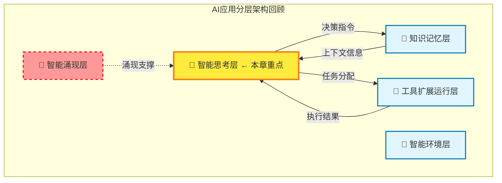
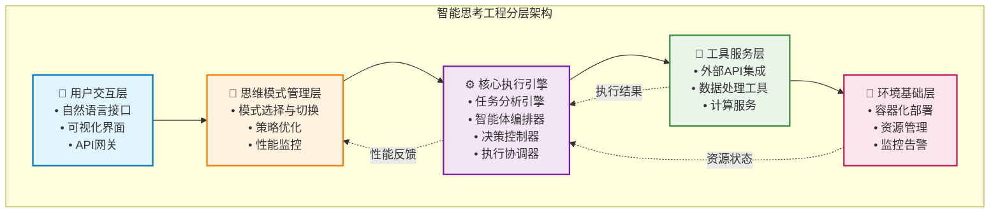
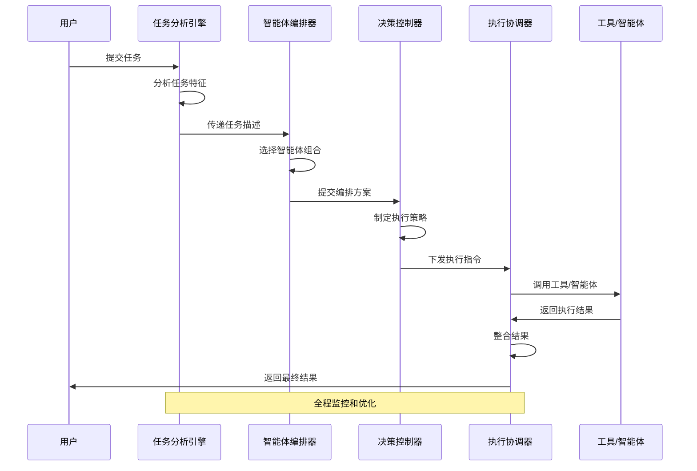
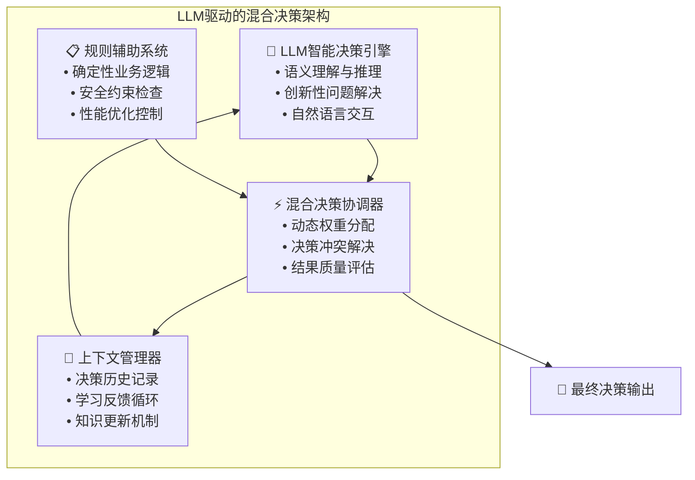
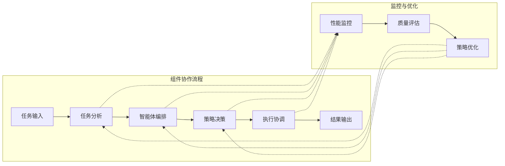
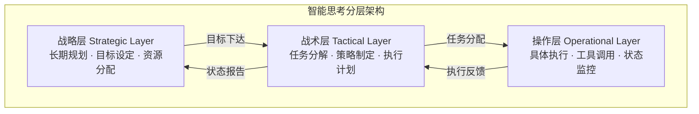

# 4.2.1 智能思考工程基础

> "智能思考工程是将人类认知过程转化为可工程化实现的计算模型，让AI应用系统具备类人的思考、推理和决策能力。它不仅是技术实现，更是连接人类智慧与机器智能的关键桥梁。"

## 学习目标

- 理解智能思考工程的核心价值和商业意义
- 掌握智能思考工程的理论基础和设计原则
- 建立智能思考系统的整体认知框架
- 了解智能思考工程与传统软件开发的本质区别

## 本章导读

本章作为智能思考工程的开篇，将为您建立完整的理论基础。我们将从**为什么需要**智能思考工程开始，逐步深入到**是什么**以及**整体架构**，为后续章节的深入学习奠定坚实基础。

**阅读建议**：
- 管理层读者：重点关注价值分析和商业意义部分
- 技术人员：全面理解理论基础和架构设计
- 研究人员：深入思考与传统方法的本质差异

## 本章与全书架构的关系

在第零部分中，我们了解了AI应用的分层架构，其中**智能思考层**作为系统的智能决策中心，基于LLM驱动的智能决策架构，形成LLM智能决策与规则辅助的混合策略，是整个AI应用的核心控制层。本章将深入探讨这一层的工程化实现方法，为后续章节的具体技术实现奠定理论基础。




### 与传统AI系统的对比

| 维度 | 传统AI系统 | 智能思考工程 | 优势说明 |
|------|------------|-------------|----------|
| **决策方式** | 单一模型预测 | 多模式思维融合 | 更全面、更可靠的决策 |
| **适应性** | 固定算法 | 自适应策略调整 | 能够应对变化的环境 |
| **可解释性** | 黑盒决策 | 可追溯的思维过程 | 提高用户信任和接受度 |
| **扩展性** | 垂直扩展 | 水平分布式扩展 | 支持大规模应用场景 |
| **学习能力** | 离线训练 | 在线持续学习 | 实时适应新情况 |
| **错误处理** | 系统性失败 | 优雅降级 | 提高系统鲁棒性 |

## 智能思考工程整体架构

### 分层架构概览

智能思考工程采用分层架构设计，每一层都有明确的职责和接口规范：



### 核心组件概述

智能思考工程的核心执行引擎包含四个关键组件，它们协同工作完成复杂的智能思考任务：

#### 1. 任务分析引擎（Task Analysis Engine）
- **职责**：理解和分析输入任务的特征和需求
- **核心能力**：语义解析、复杂度评估、子任务分解
- **输出**：结构化的任务描述和执行要求

#### 2. 智能体编排器（Agent Orchestrator）  
- **职责**：选择和组合最适合的智能体完成任务
- **核心能力**：能力匹配、协作策略设计、负载均衡
- **输出**：智能体组合方案和协作计划

#### 3. 决策控制器（Decision Controller）
- **职责**：制定执行策略并控制整个思维过程
- **核心能力**：策略生成、风险评估、异常处理
- **输出**：执行策略和控制指令

#### 4. 执行协调器（Execution Coordinator）
- **职责**：协调各组件的执行并整合最终结果
- **核心能力**：并发控制、状态管理、结果整合
- **输出**：最终的思维结果和执行报告

### 数据流向分析



## LLM驱动的智能思考架构

### 混合策略的设计理念

现代AI应用的智能思考层采用LLM驱动的混合决策策略，这种架构将大语言模型的智能决策能力与规则系统的确定性逻辑相结合，形成既具备创新性又保证可靠性的决策机制。



### LLM驱动的核心优势

**🧠 智能理解能力**
- 深度语义理解：能够理解复杂的自然语言指令和上下文
- 推理规划能力：基于理解进行逻辑推理和策略规划
- 创新思维能力：产生超越预设规则的创新性解决方案

**🎯 灵活决策机制**
- 适应性决策：根据具体场景动态调整决策策略
- 不确定性处理：在信息不完整时做出合理推断
- 多目标平衡：在复杂约束下寻找最优解决方案

**🔄 持续学习优化**
- 交互反馈学习：从用户交互中持续改进决策质量
- 经验积累机制：将成功案例转化为决策知识
- 自我反思能力：评估决策效果并优化思维过程

**⚖️ 平衡策略保障**
- 创新与稳定平衡：在保证系统稳定的前提下实现创新突破
- 效率与质量兼顾：平衡决策速度与决策质量
- 灵活与可控统一：在保持灵活性的同时确保系统可控

## 智能思考工程的本质与价值

### 从生物智能到人工智能的映射

智能思考工程的核心在于将人类解决复杂问题时思考过程进行抽象和工程化实现。当人类面对一个复杂任务时，大脑会执行以下过程：


1. **感知与理解**：通过感官接收外界信息，大脑对信息进行解析和理解
2. **知识检索与关联**：从记忆中检索相关知识和经验，建立问题与已知信息的联系
3. **分析与推理**：运用逻辑思维分析问题的本质和约束条件
4. **方案生成**：基于分析结果生成可能的解决方案
5. **决策与执行**：评估各方案的优劣，选择最佳方案并付诸实施
6. **反馈与调整**：根据执行结果进行反思，调整认知模型和策略

**智能思考工程就是将这一过程转化为软件系统可以执行的计算模型。**

### 智能思考的计算本质

从计算科学的角度看，智能思考可以抽象为以下计算模型：

#### 状态空间搜索模型
```
当前状态 --[感知]-> 问题表征 --[推理]-> 目标状态
    ↑                                      ↓
    ←--[反馈]<--[执行]<--[决策]<--[规划]<--
```

#### 信息处理流水线
- **输入层**：接收外部信息和用户指令
- **理解层**：对输入进行语义解析和意图识别
- **推理层**：基于知识库进行逻辑推理和策略制定
- **决策层**：评估可选方案并作出最优决策
- **执行层**：调用工具和资源完成具体任务
- **反馈层**：评估执行结果并优化后续行为

### 与传统软件工程的本质区别

#### 核心差异对比

| 维度 | 传统软件工程 | 智能思考工程 |
|------|-------------|-------------|
| **确定性** | 高度确定的逻辑流程 | 具有不确定性和自适应性 |
| **知识获取** | 预定义的规则和数据结构 | 动态学习和知识更新 |
| **决策机制** | 基于明确规则的分支判断 | 基于推理和概率的智能决策 |
| **错误处理** | 异常捕获和预定义处理 | 自适应的错误恢复和学习 |
| **可解释性** | 代码逻辑清晰可追溯 | 需要专门的可解释性设计 |
| **进化能力** | 通过版本更新进化 | 具备运行时学习和自我优化能力 |

#### 思维模式转换

**传统软件工程**：像精密的机械钟表
- 每个齿轮（代码）都有确定的作用
- 输入和输出完全可预测
- 按照预设程序严格执行

**智能思考工程**：像人类大脑思考
- 能够处理模糊和不完整的信息
- 可以学习和适应新情况
- 具有创造性和推理能力

## 智能思考工程的设计原则

### 核心设计原则

#### 1. 模块化与可扩展性原则
- **单一职责**：每个组件专注于特定的认知功能
- **标准接口**：定义清晰的组件间接口规范
- **可插拔架构**：支持组件的动态替换和功能扩展
- **版本兼容**：确保系统升级时的向后兼容性

#### 2. 智能化与自适应原则
- **LLM驱动**：充分发挥大语言模型的智能决策能力
- **自适应调整**：根据环境变化动态调整策略
- **持续学习**：从执行结果中学习并优化性能
- **智能容错**：具备自我诊断和恢复能力

#### 3. 可观测性与可控性原则
- **全链路追踪**：记录完整的思维执行路径
- **性能监控**：实时监控系统性能和质量指标
- **异常检测**：智能识别异常行为和性能问题
- **人工干预**：在必要时支持人工介入和调整

#### 4. 安全性与可靠性原则
- **执行边界控制**：防止无限循环和资源耗尽
- **输入验证**：对输入进行安全验证和净化
- **权限管理**：实现细粒度的权限控制
- **数据保护**：确保敏感数据的安全处理

### 组件协作机制

智能思考系统的各组件通过标准化的接口和协议进行协作：



**协作特点**：
- **异步通信**：组件间采用异步消息传递，提高系统响应性
- **事件驱动**：基于事件驱动架构，实现松耦合的组件协作
- **状态同步**：关键状态信息在组件间实时同步
- **错误传播**：错误信息能够在组件间正确传播和处理

## 智能思考的分层架构设计

现代智能思考系统通常采用分层设计，以实现不同抽象层次的认知功能：



### 战略层（Strategic Layer）
- **职责**：理解整体目标和长期规划
- **时间尺度**：长期（小时到天）
- **决策内容**：任务优先级、资源分配、总体策略
- **特点**：全局视角、抽象思考、长远规划

### 战术层（Tactical Layer）
- **职责**：将战略目标分解为具体任务
- **时间尺度**：中期（分钟到小时）
- **决策内容**：任务分解、工具选择、执行顺序
- **特点**：承上启下、具体规划、协调管理

### 操作层（Operational Layer）
- **职责**：执行具体的原子操作
- **时间尺度**：短期（秒到分钟）
- **决策内容**：工具参数、执行细节、异常处理
- **特点**：具体执行、实时响应、精确控制

### 分层架构的优势

1. **责任分离**：不同层次关注不同抽象级别的问题
2. **可维护性**：各层可以独立优化和升级
3. **可扩展性**：便于添加新的认知能力和功能模块
4. **鲁棒性**：单层故障不会影响整个系统
5. **可理解性**：清晰的层次结构便于理解和调试

## 设计原则与工程化考虑

### 核心设计原则

#### 1. 模块化设计原则
- **单一职责**：每个模块只负责一种特定的认知功能
- **标准接口**：定义清晰的模块间接口规范
- **可插拔架构**：支持模块的动态替换和扩展

#### 2. 状态一致性原则
- **上下文管理**：维护完整的执行上下文信息
- **状态同步**：确保分布式环境下的状态一致性
- **异常恢复**：设计完善的异常处理和状态恢复机制

#### 3. 性能优化原则
- **并行处理**：支持思维任务的并发执行
- **资源管理**：智能分配和管理计算资源
- **缓存复用**：通过缓存机制提升响应速度

#### 4. 可观测性原则
- **全链路追踪**：记录完整的思维执行路径
- **性能监控**：实时监控系统性能指标
- **异常检测**：智能识别异常行为和性能问题

#### 5. 安全性与可控性原则
- **执行边界控制**：防止无限循环和资源耗尽
- **输入验证**：对输入进行安全验证和净化
- **权限管理**：实现细粒度的权限控制

### 工程化实践要点

#### 开发阶段
- **架构设计优先**：在编码前完成详细的架构设计
- **接口先行**：先定义接口，再实现具体功能
- **测试驱动**：采用测试驱动的开发方法

#### 实现阶段
- **代码质量**：遵循编码规范，确保代码可读性
- **错误处理**：实现完善的错误处理逻辑
- **日志记录**：添加详细的结构化日志

#### 测试阶段
- **多层次测试**：单元测试、集成测试、系统测试
- **场景化测试**：针对不同应用场景设计测试用例
- **性能测试**：验证系统在不同负载下的性能表现

#### 部署运维
- **监控体系**：建立完善的系统监控和告警机制
- **持续优化**：基于运行数据持续优化系统性能
- **故障处理**：建立快速的故障响应和处理机制

## 智能思考工程的核心价值

### 1. 自主决策能力

相比传统的规则基础系统，AI智能思考系统能够在不确定环境中做出自主决策：
- **处理不完整信息**：在信息不完整的情况下做出合理推断
- **适应环境变化**：根据环境变化调整决策策略
- **学习和改进**：从决策结果中学习，提高决策质量

### 2. 问题解决的通用性

智能思考系统不仅仅解决特定问题，而是具备通用的问题解决能力：
- **跨域迁移**：将一个领域的经验应用到其他领域
- **组合式创新**：通过组合现有能力创造新的解决方案
- **创新性突破**：产生超越现有知识边界的创新方案

### 3. 人机协作的自然性

通过模拟人类思维过程，系统能够更自然地与人类协作：
- **理解人类意图**：准确理解人类的真实需求和偏好
- **提供可解释的决策**：能够解释决策的推理过程
- **支持交互式问题解决**：在解决问题过程中与人类进行自然交互

## 设计挑战与应对策略

### 1. 复杂性管理

**挑战**：智能思考系统的复杂度远超传统软件系统
- 状态空间爆炸问题
- 组件间的复杂交互关系
- 动态行为的不可预测性

**应对策略**：
- **分层抽象**：通过分层设计降低复杂度
- **模块化分解**：将复杂问题分解为简单子问题
- **渐进式开发**：采用迭代式开发方法

### 2. 可靠性保障

**挑战**：在关键应用中必须提供可靠的服务
- 错误传播控制
- 异常恢复机制
- 性能监控要求

**应对策略**：
- **容错设计**：设计鲁棒的故障处理策略
- **冗余备份**：关键组件采用冗余设计
- **实时监控**：建立完善的监控和告警体系

### 3. 可解释性需求

**挑战**：用户需要理解系统的决策过程
- 推理链追踪
- 决策透明化
- 交互式解释

**应对策略**：
- **过程记录**：详细记录思维过程的每个步骤
- **可视化展示**：通过图形化界面展示思维过程
- **分层解释**：提供不同详细程度的解释

## 本章要点总结

### 核心概念回顾

1. **智能思考工程的本质**：将人类认知过程转化为可工程化实现的计算模型
2. **核心价值主张**：提升决策质量、提高处理效率、增强创新能力、优化风险控制
3. **整体架构设计**：采用五层架构，从用户交互到环境基础的完整技术栈
4. **设计原则体系**：模块化、智能化、可观测性、安全性四大核心原则

### 关键理解要点

- **与传统AI的区别**：从单一模型预测转向多模式思维融合
- **LLM驱动的优势**：智能决策与规则约束的完美结合
- **组件协作机制**：异步通信、事件驱动的松耦合架构
- **分层设计价值**：不同抽象层次的职责分离和协同工作

### 实践指导意义

本章建立的理论基础将指导后续章节的具体实现：
- 为组件设计提供架构蓝图
- 为思维模式选择提供决策框架  
- 为工程实践提供设计原则
- 为系统优化提供评估标准

## 下章预告：核心组件设计原理

在建立了智能思考工程的理论基础后，下一章我们将深入探讨**核心组件的设计原理**：

### 4.2.2 核心组件设计原理
- **组件职责与边界定义**：明确各组件的职责范围和接口规范
- **任务分析引擎设计**：如何实现智能的任务理解和分解
- **智能体编排器架构**：动态选择和组合智能体的策略
- **决策控制器实现**：LLM驱动的混合决策机制
- **执行协调器设计**：统筹全流程的协调管理

这将为您提供从概念到具体设计的完整技术路径，是理论转向实践的关键桥梁。

**学习建议**：
- 结合本章的架构图理解各组件关系
- 重点关注组件间的接口设计
- 思考如何在实际项目中应用这些设计原理

## 扩展阅读

1. Russell, S. & Norvig, P. (2021). "Artificial Intelligence: A Modern Approach" - 第二章：智能体
2. Newell, A. (1990). "Unified Theories of Cognition" - 认知架构的理论基础
3. Anderson, J. R. (2007). "How Can the Human Mind Occur in the Physical Universe?" - ACT-R认知模型
4. Laird, J. E. (2012). "The Soar Cognitive Architecture" - Soar认知架构设计

## 思考练习

1. **概念理解**：分析一个你熟悉的复杂任务（如制定旅行计划），识别其中涉及的认知过程，并思考如何将其转化为智能思考系统的计算模型。

2. **架构设计**：比较智能思考系统与专家系统的区别，分析智能思考工程在哪些方面提供了更强的问题解决能力。

3. **应用场景**：考虑在你的业务领域中，哪些场景最适合应用智能思考系统？这些场景有哪些共同特征？

4. **设计权衡**：在设计智能思考系统时，如何在智能性、可靠性、性能和可解释性之间找到平衡点？
