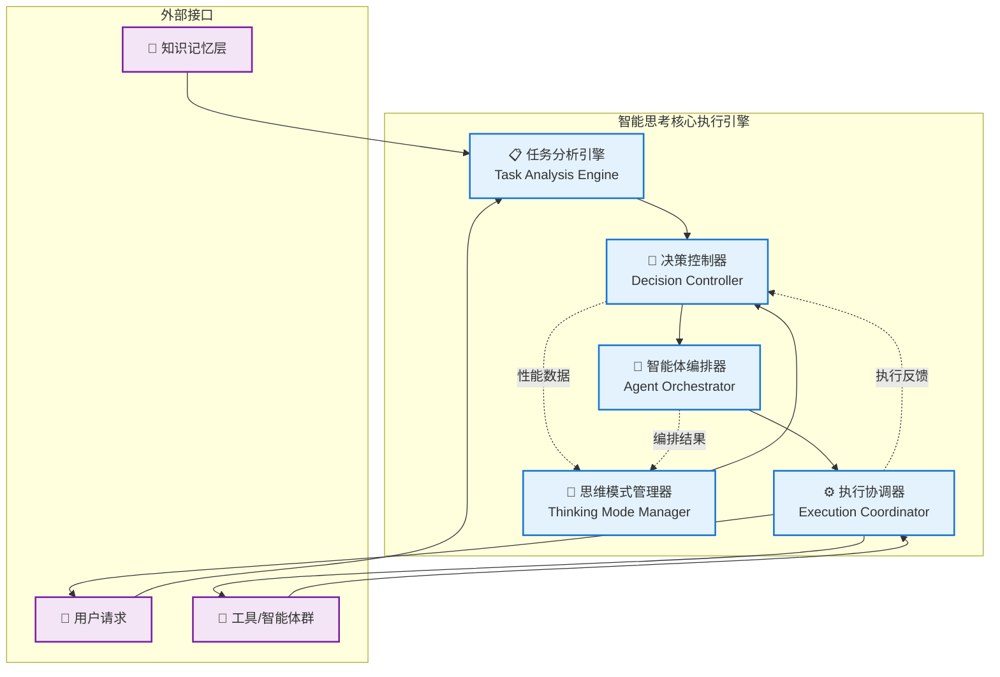
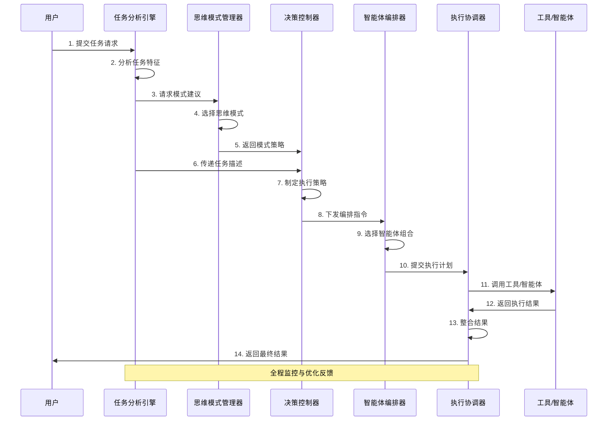
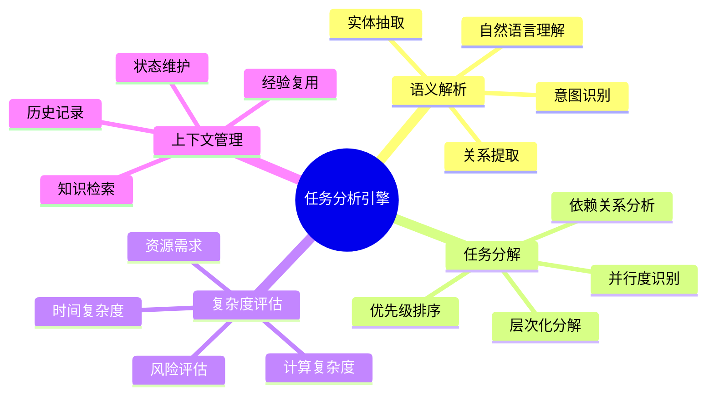
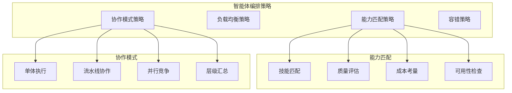
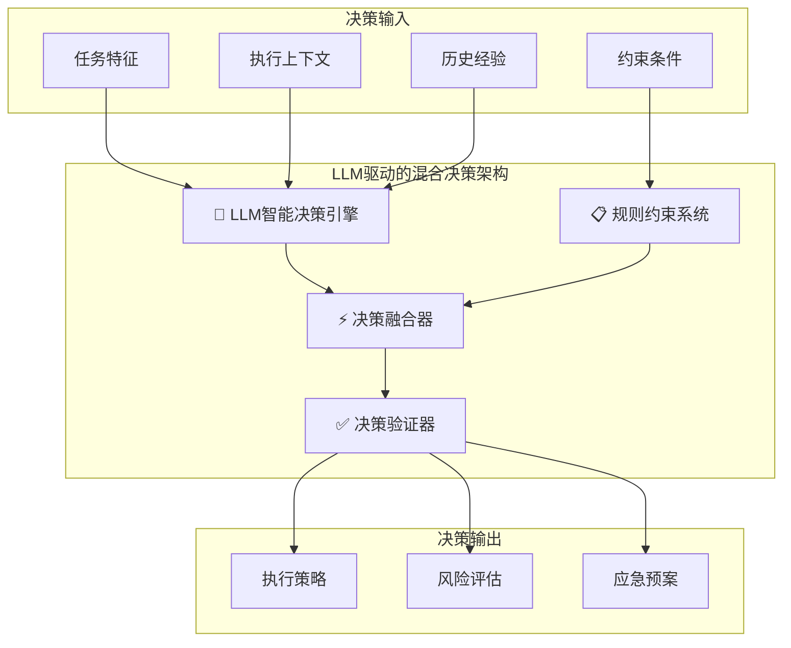
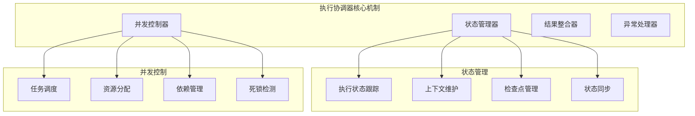
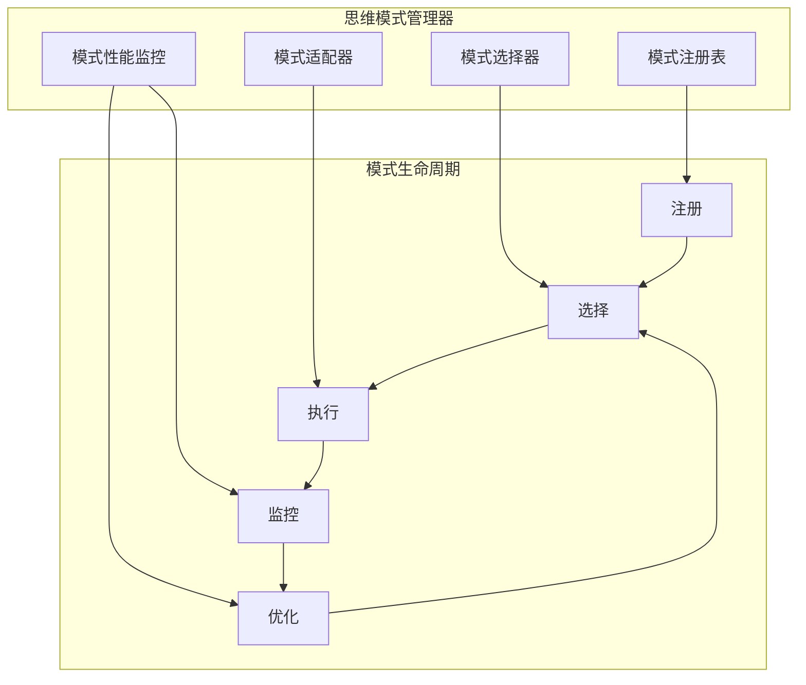
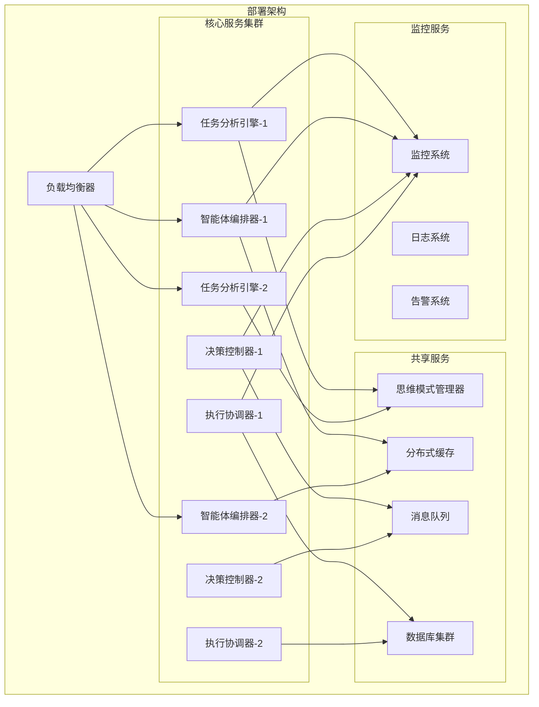

# 4.2.2 核心组件设计原理

> "优秀的架构源于清晰的组件职责划分和高效的协作机制。智能思考系统的核心组件设计，决定了整个系统的智能水平和工程质量。"

## 学习目标

- 掌握智能思考系统核心组件的设计原理
- 理解各组件的职责边界和接口规范
- 学会设计高效的组件协作机制
- 了解LLM驱动的组件实现策略

## 本章导读

本章基于4.2.1建立的理论基础，深入探讨智能思考系统核心组件的具体设计原理。我们将从**组件职责定义**开始，逐步深入到**接口设计**、**协作机制**和**实现策略**，为后续的思维模式设计和工程实践奠定坚实基础。

**与前章的关系**：
- 4.2.1提供了整体架构蓝图
- 本章细化各组件的设计原理
- 为4.2.3的思维模式设计提供组件基础

## 组件架构总览

### 核心组件关系图



### 数据流向与控制流



## 任务分析引擎设计

### 职责与能力定义

**核心职责**：
- **语义理解**：深度解析自然语言任务描述
- **任务分解**：将复杂任务分解为可执行的子任务
- **复杂度评估**：评估任务的计算复杂度和资源需求
- **上下文管理**：维护和利用任务执行上下文

**核心能力**：


### 接口设计规范

```java
/**
 * 任务分析引擎接口定义
 */
public interface TaskAnalysisEngine {
    
    /**
     * 分析任务特征
     * @param taskDescription 任务描述
     * @param context 执行上下文
     * @return 任务特征分析结果
     */
    TaskCharacteristics analyzeTask(String taskDescription, TaskContext context);
    
    /**
     * 分解任务为子任务
     * @param task 原始任务
     * @return 子任务列表
     */
    List<SubTask> decomposeTask(Task task);
    
    /**
     * 评估任务复杂度
     * @param task 待评估任务
     * @return 复杂度评估结果
     */
    ComplexityAssessment assessComplexity(Task task);
    
    /**
     * 提取用户意图
     * @param userInput 用户输入
     * @return 用户意图
     */
    UserIntent extractIntent(String userInput);
}

/**
 * 任务特征数据模型
 */
@Data
@Builder
public class TaskCharacteristics {
    private String taskId;
    private TaskType type;
    private ComplexityLevel complexity;
    private UncertaintyLevel uncertainty;
    private String domain;
    private List<String> requiredCapabilities;
    private Map<String, Object> metadata;
    private Duration estimatedDuration;
    private ResourceRequirement resourceRequirement;
}
```

### 核心算法设计

#### 1. 智能任务分解算法

```java
/**
 * 基于HTN和LLM的混合任务分解器
 */
@Component
public class HybridTaskDecomposer {
    
    private final HTNPlanner htnPlanner;
    private final LLMTaskAnalyzer llmAnalyzer;
    private final TaskValidator taskValidator;
    
    public List<SubTask> decompose(Task task) {
        // 1. HTN启发式分解
        List<SubTask> htnResults = htnPlanner.decompose(task);
        
        // 2. LLM智能分解
        List<SubTask> llmResults = llmAnalyzer.decompose(task);
        
        // 3. 结果融合与优化
        List<SubTask> mergedResults = mergeDecompositionResults(htnResults, llmResults);
        
        // 4. 验证与优化
        return taskValidator.validateAndOptimize(mergedResults, task);
    }
    
    private List<SubTask> mergeDecompositionResults(List<SubTask> htnResults, 
                                                   List<SubTask> llmResults) {
        // 基于相似度和互补性进行智能融合
        return TaskMerger.merge(htnResults, llmResults);
    }
}
```

#### 2. 复杂度评估算法

```java
/**
 * 多维度复杂度评估器
 */
@Component
public class ComplexityAssessment {
    
    public ComplexityLevel assessComplexity(Task task) {
        // 计算各维度复杂度
        double semanticComplexity = calculateSemanticComplexity(task);
        double structuralComplexity = calculateStructuralComplexity(task);
        double computationalComplexity = calculateComputationalComplexity(task);
        double domainComplexity = calculateDomainComplexity(task);
        
        // 加权综合评估
        double overallComplexity = 
            semanticComplexity * 0.3 +
            structuralComplexity * 0.25 +
            computationalComplexity * 0.25 +
            domainComplexity * 0.2;
        
        return categorizeComplexity(overallComplexity);
    }
    
    private double calculateSemanticComplexity(Task task) {
        // 基于NLP技术分析语义复杂度
        String description = task.getDescription();
        
        // 词汇复杂度
        double vocabularyComplexity = analyzeVocabularyComplexity(description);
        
        // 句法复杂度
        double syntacticComplexity = analyzeSyntacticComplexity(description);
        
        // 语义歧义度
        double ambiguityLevel = analyzeAmbiguity(description);
        
        return (vocabularyComplexity + syntacticComplexity + ambiguityLevel) / 3.0;
    }
}
```

## 智能体编排器设计

### 编排策略体系



### 核心接口设计

```java
/**
 * 智能体编排器接口
 */
public interface AgentOrchestrator {
    
    /**
     * 编排智能体执行计划
     * @param subTasks 子任务列表
     * @param availableAgents 可用智能体
     * @param constraints 约束条件
     * @return 编排计划
     */
    OrchestrationPlan orchestrate(List<SubTask> subTasks, 
                                 List<Agent> availableAgents,
                                 OrchestrationConstraints constraints);
    
    /**
     * 动态调整编排计划
     * @param currentPlan 当前计划
     * @param executionFeedback 执行反馈
     * @return 调整后的计划
     */
    OrchestrationPlan adjustPlan(OrchestrationPlan currentPlan, 
                                ExecutionFeedback executionFeedback);
    
    /**
     * 监控编排执行状态
     * @param planId 计划ID
     * @return 执行状态
     */
    OrchestrationStatus monitorExecution(String planId);
}

/**
 * 编排计划数据模型
 */
@Data
@Builder
public class OrchestrationPlan {
    private String planId;
    private List<AgentAssignment> assignments;
    private CollaborationMode collaborationMode;
    private Map<String, Object> executionPolicies;
    private Duration estimatedDuration;
    private ResourceAllocation resourceAllocation;
    private List<Dependency> dependencies;
    private FaultToleranceStrategy faultTolerance;
}
```

### 智能匹配算法

```java
/**
 * 基于多目标优化的智能体匹配算法
 */
@Component
public class MultiObjectiveAgentMatcher {
    
    public List<AgentAssignment> match(List<SubTask> subTasks, 
                                      List<Agent> availableAgents) {
        
        // 1. 构建匹配矩阵
        MatchingMatrix matrix = buildMatchingMatrix(subTasks, availableAgents);
        
        // 2. 多目标优化
        OptimizationResult result = optimizeAssignment(matrix);
        
        // 3. 生成分配方案
        return generateAssignments(result);
    }
    
    private OptimizationResult optimizeAssignment(MatchingMatrix matrix) {
        // 目标函数：最大化质量，最小化成本，均衡负载
        ObjectiveFunction[] objectives = {
            new QualityMaximizationObjective(),
            new CostMinimizationObjective(),
            new LoadBalancingObjective()
        };
        
        // 使用NSGA-II算法进行多目标优化
        return nsgaOptimizer.optimize(matrix, objectives);
    }
}
```

## 决策控制器设计

### 混合决策架构



### 核心接口设计

```java
/**
 * 决策控制器接口
 */
public interface DecisionController {
    
    /**
     * 制定执行决策
     * @param taskCharacteristics 任务特征
     * @param orchestrationPlan 编排计划
     * @param context 决策上下文
     * @return 执行决策
     */
    ExecutionDecision makeDecision(TaskCharacteristics taskCharacteristics,
                                  OrchestrationPlan orchestrationPlan,
                                  DecisionContext context);
    
    /**
     * 评估决策风险
     * @param decision 待评估决策
     * @return 风险评估结果
     */
    RiskAssessment assessRisk(ExecutionDecision decision);
    
    /**
     * 调整执行策略
     * @param currentDecision 当前决策
     * @param feedback 执行反馈
     * @return 调整后的决策
     */
    ExecutionDecision adjustStrategy(ExecutionDecision currentDecision,
                                   ExecutionFeedback feedback);
}
```

### 决策算法实现

```java
/**
 * LLM驱动的混合决策引擎
 */
@Component
public class HybridDecisionEngine implements DecisionController {
    
    private final LLMDecisionGenerator llmGenerator;
    private final RuleBasedValidator ruleValidator;
    private final DecisionFusionEngine fusionEngine;
    
    @Override
    public ExecutionDecision makeDecision(TaskCharacteristics taskCharacteristics,
                                        OrchestrationPlan orchestrationPlan,
                                        DecisionContext context) {
        
        // 1. LLM生成候选决策
        List<DecisionCandidate> llmCandidates = llmGenerator.generateCandidates(
            taskCharacteristics, orchestrationPlan, context
        );
        
        // 2. 规则验证和过滤
        List<DecisionCandidate> validCandidates = ruleValidator.validate(llmCandidates);
        
        // 3. 决策融合和选择
        ExecutionDecision finalDecision = fusionEngine.selectBest(validCandidates);
        
        // 4. 风险评估
        RiskAssessment risk = assessRisk(finalDecision);
        finalDecision.setRiskAssessment(risk);
        
        return finalDecision;
    }
}
```

## 执行协调器设计

### 协调机制架构



### 接口设计

```java
/**
 * 执行协调器接口
 */
public interface ExecutionCoordinator {
    
    /**
     * 协调执行编排计划
     * @param plan 编排计划
     * @param decision 执行决策
     * @return 执行结果
     */
    CompletableFuture<ExecutionResult> coordinate(OrchestrationPlan plan, 
                                                 ExecutionDecision decision);
    
    /**
     * 监控执行状态
     * @param executionId 执行ID
     * @return 执行状态
     */
    ExecutionStatus getExecutionStatus(String executionId);
    
    /**
     * 暂停执行
     * @param executionId 执行ID
     */
    void pauseExecution(String executionId);
    
    /**
     * 恢复执行
     * @param executionId 执行ID
     */
    void resumeExecution(String executionId);
    
    /**
     * 取消执行
     * @param executionId 执行ID
     */
    void cancelExecution(String executionId);
}
```

## 思维模式管理器设计

### 模式管理架构



### 核心接口

```java
/**
 * 思维模式管理器接口
 */
public interface ThinkingModeManager {
    
    /**
     * 注册思维模式
     * @param mode 思维模式
     * @param implementation 模式实现
     */
    void registerMode(ThinkingMode mode, ThinkingModeImplementation implementation);
    
    /**
     * 选择最优思维模式
     * @param taskCharacteristics 任务特征
     * @param context 选择上下文
     * @return 选择结果
     */
    ModeSelectionResult selectOptimalMode(TaskCharacteristics taskCharacteristics,
                                        ModeSelectionContext context);
    
    /**
     * 获取模式性能统计
     * @param mode 思维模式
     * @return 性能统计
     */
    ModePerformanceStats getPerformanceStats(ThinkingMode mode);
    
    /**
     * 更新模式性能数据
     * @param mode 思维模式
     * @param executionResult 执行结果
     */
    void updatePerformanceData(ThinkingMode mode, ExecutionResult executionResult);
}
```

## 组件集成与部署

### 集成架构设计



### 部署策略

#### 1. 微服务化部署
```yaml
# docker-compose.yml 示例
version: '3.8'
services:
  task-analysis-engine:
    image: thinking-engine/task-analysis:latest
    replicas: 2
    environment:
      - SPRING_PROFILES_ACTIVE=production
      - LLM_API_ENDPOINT=${LLM_API_ENDPOINT}
    depends_on:
      - redis
      - postgresql
      
  agent-orchestrator:
    image: thinking-engine/agent-orchestrator:latest
    replicas: 2
    environment:
      - SPRING_PROFILES_ACTIVE=production
    depends_on:
      - redis
      - rabbitmq
      
  decision-controller:
    image: thinking-engine/decision-controller:latest
    replicas: 2
    
  execution-coordinator:
    image: thinking-engine/execution-coordinator:latest
    replicas: 2
```

#### 2. 配置管理
```java
/**
 * 组件配置管理
 */
@Configuration
@ConfigurationProperties(prefix = "thinking-engine")
public class ThinkingEngineConfiguration {
    
    private TaskAnalysisConfig taskAnalysis;
    private OrchestrationConfig orchestration;
    private DecisionConfig decision;
    private ExecutionConfig execution;
    
    @Data
    public static class TaskAnalysisConfig {
        private int maxComplexityLevel = 10;
        private Duration analysisTimeout = Duration.ofSeconds(30);
        private boolean enableLLMAnalysis = true;
    }
    
    @Data
    public static class OrchestrationConfig {
        private int maxAgentsPerTask = 5;
        private LoadBalancingStrategy loadBalancing = LoadBalancingStrategy.ROUND_ROBIN;
        private boolean enableDynamicAdjustment = true;
    }
}
```

## 本章要点总结

### 核心设计原理

1. **职责分离原则**：每个组件都有明确的职责边界和功能定位
2. **接口标准化**：统一的接口设计规范确保组件间的良好协作
3. **LLM驱动策略**：充分发挥大语言模型在智能决策中的优势
4. **可扩展架构**：支持组件的独立扩展和功能增强

### 关键技术要点

- **任务分析引擎**：HTN与LLM混合的智能分解算法
- **智能体编排器**：多目标优化的智能匹配策略
- **决策控制器**：LLM智能决策与规则约束的融合
- **执行协调器**：高效的并发控制和状态管理机制
- **思维模式管理器**：动态的模式选择和性能优化

### 工程实践指导

- **模块化设计**：便于独立开发、测试和部署
- **异步通信**：提高系统响应性和吞吐量
- **容错机制**：确保系统在异常情况下的稳定运行
- **监控体系**：全面的性能监控和问题诊断能力

## 下章预告：主流思维模式设计

在掌握了核心组件的设计原理后，下一章我们将探讨**主流思维模式的设计与实现**：

### 4.2.3 主流思维模式设计
- **思维模式分类体系**：建立科学的分类框架
- **ReAct思维模式**：边思考边行动的动态决策模式
- **Plan-Solve思维模式**：先规划后执行的系统化方法
- **多模式融合架构**：智能选择和动态切换机制

这将为您提供具体的思维模式实现方案，是从组件设计到实际应用的重要桥梁。

**学习建议**：
- 结合本章的组件设计理解思维模式的实现基础
- 重点关注不同模式的适用场景和选择策略
- 思考如何在实际项目中应用这些思维模式
