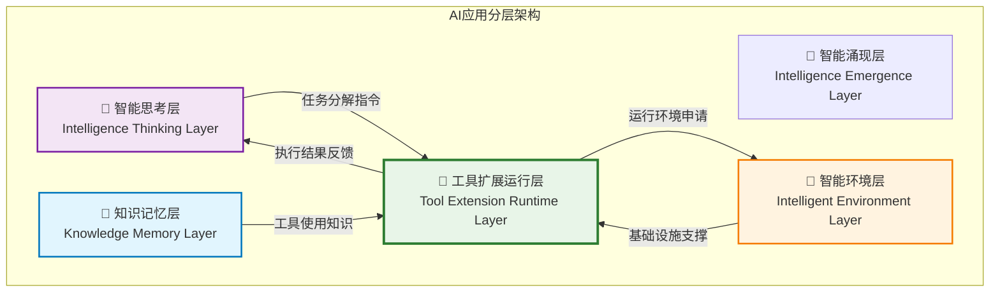
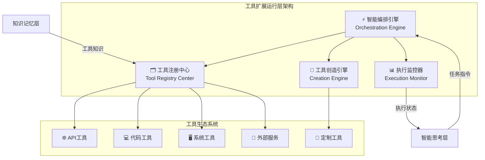
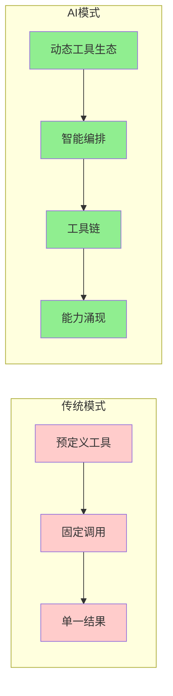
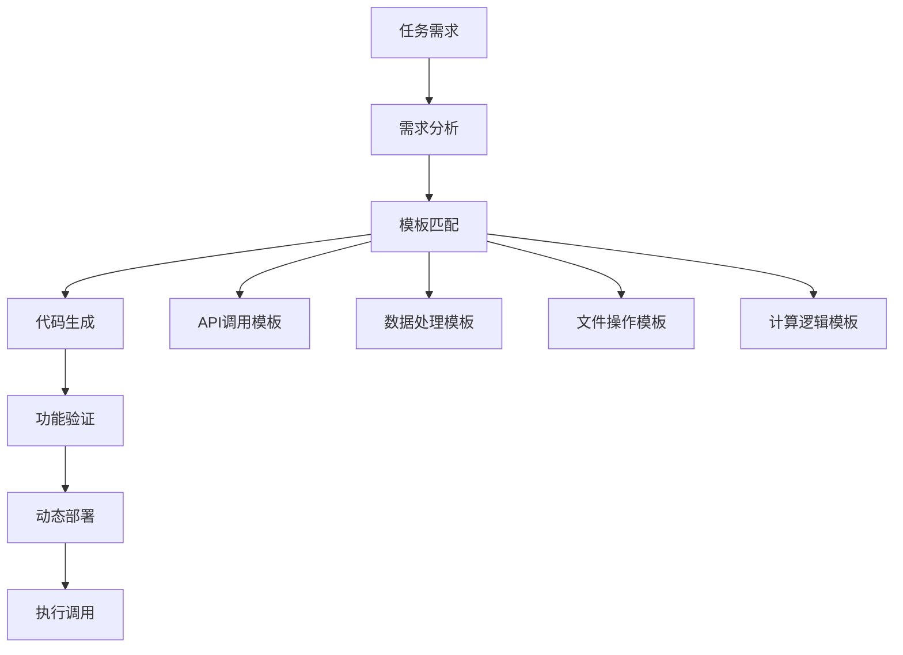

# 4.3.0 工具扩展运行层概述

> "工具扩展运行层是AI应用的核心执行层，它将静态工具调用升级为智能工具生态，通过工具的动态创造和智能编排，实现超越预定义功能的能力涌现。"

## 从智能思考到执行实现的桥梁

在智能化工程的四层架构中，我们已经学习了知识记忆层（4.1章）和智能思考层（4.2章）。现在我们进入**工具扩展运行层**，这是将智能思考转化为具体执行的关键桥梁。

### 📊 在AI架构中的定位

**核心职责关系**：
- **接收智能思考层的执行指令**：任务分解、工具选择策略、执行计划
- **利用知识记忆层的工具知识**：工具使用经验、最佳实践、历史执行记录
- **向智能环境层申请执行资源**：计算环境、网络资源、安全隔离
- **向上层反馈执行结果**：更新执行状态、异常处理、性能数据

## 工具扩展运行层核心定义

**工具扩展运行层（Tool Extension Runtime Layer）** 是AI应用架构中的核心执行层，负责集成、管理和运行所有工具型资源，通过工具注册中心、智能编排引擎和工具创造引擎的协同工作，实现从静态工具调用到动态工具生态的转变，是AI应用智能涌现的重要实现基础。

### 核心特征

#### 1. 资源集成性
- **统一工具接口**：将不同类型的工具统一抽象为标准接口
- **多源工具整合**：集成API工具、代码工具、外部服务、系统命令等
- **版本生命周期管理**：支持工具的版本控制、依赖管理和生命周期维护

#### 2. 动态扩展性  
- **热插拔能力**：支持工具的动态添加、更新和移除，无需重启系统
- **能力自适应**：根据任务需求动态发现和加载所需工具
- **插件化架构**：采用插件机制支持第三方工具的无缝集成

#### 3. 智能编排性
- **任务驱动选择**：基于任务语义智能选择最适合的工具组合
- **工具链构建**：自动构建工具执行链路，处理数据流转和参数传递
- **并发执行调度**：智能调度并发和串行执行，优化整体执行效率

#### 4. 创造涌现性
- **动态工具生成**：根据特定需求动态创造新的专用工具
- **工具组合创新**：通过工具的重新组合产生新的能力
- **能力边界突破**：创造出超越现有工具功能的新能力

## 核心组件架构

### 🗂️ 工具注册中心（Tool Registry Center）
**核心职责**：统一管理所有可用工具资源
- **工具目录管理**：维护全局工具清单和元数据信息
- **版本控制**：管理工具的多版本并存和兼容性
- **能力索引**：建立基于能力的工具检索和匹配机制
- **权限管理**：控制工具的访问权限和使用范围

### ⚡ 智能编排引擎（Orchestration Engine）
**核心职责**：基于任务需求智能编排工具执行
- **任务解析**：理解智能思考层传递的执行任务
- **工具选择**：基于任务特征选择最优工具组合
- **执行规划**：制定工具执行的时序和并发策略
- **状态管理**：维护整个执行过程的状态和上下文

### 🎨 工具创造引擎（Creation Engine）
**核心职责**：动态创造满足特定需求的新工具
- **需求分析**：分析当前任务对工具的特殊需求
- **代码生成**：基于模板和模式生成工具代码
- **工具验证**：确保生成工具的功能正确性和安全性
- **动态部署**：将新创造的工具集成到运行环境

### 📊 执行监控器（Execution Monitor）
**核心职责**：全面监控工具执行过程和结果
- **性能监控**：跟踪工具执行的性能指标
- **异常检测**：及时发现和处理执行异常
- **结果验证**：确保执行结果的正确性和完整性
- **反馈收集**：收集执行反馈优化后续执行策略

## 技术创新突破

### 从静态调用到智能编排

传统AI应用通常采用静态的工具调用模式，而工具扩展运行层实现了智能编排的技术突破：

**关键差异**：
- **工具来源**：从预定义工具集 → 动态扩展工具生态
- **选择机制**：从固定映射 → 智能匹配和组合
- **执行模式**：从单一调用 → 工具链编排
- **能力边界**：从功能受限 → 能力持续涌现

### 工具创造的技术实现

工具创造引擎是本层的核心创新，实现了工具的动态生成：

## 实际应用场景

### 📊 数据分析场景
**任务**：分析一组CSV文件的销售数据趋势

**传统方式**：需要预先开发好CSV读取、数据清洗、统计分析、图表生成等固定工具

**AI方式**：
1. **智能思考层** 分析任务：需要读取数据→清洗处理→趋势分析→可视化
2. **工具扩展运行层** 智能编排：
   - 从注册中心选择CSV读取工具
   - 创造针对该数据格式的清洗工具
   - 编排数据处理工具链
   - 生成定制化的图表工具

### 🌐 API集成场景
**任务**：从多个第三方API获取数据并生成综合报告

**智能编排过程**：
1. **任务分解**：识别需要调用的API类型和数据关联关系
2. **工具选择**：匹配合适的HTTP客户端工具和数据处理工具
3. **并发调度**：并行调用多个API提高效率
4. **结果整合**：创造数据融合工具整合不同源的数据
5. **报告生成**：动态生成符合要求格式的报告工具

## 与其他层的协同机制

### 向上协同：支撑智能思考层
- **执行能力提供**：为智能决策提供具体的执行能力
- **状态反馈**：实时反馈执行状态和结果，支持决策调整
- **能力发现**：主动报告可用工具能力，影响任务规划

### 横向协同：知识记忆层交互
- **工具知识管理**：存储工具使用经验和最佳实践
- **历史经验利用**：基于历史执行记录优化工具选择
- **知识更新**：将新的工具使用经验反馈到知识库

### 向下协同：依赖智能环境层
- **执行环境申请**：根据工具需求申请合适的执行环境
- **资源隔离**：确保不同工具的执行不互相干扰
- **安全保障**：利用环境层的安全机制保障工具执行安全

## 本章学习路径

本章采用"理论→架构→实践→优化"的递进式学习路径：

### 📚 学习阶段规划

#### 第一阶段：理论基础建立（4.3.1）
**学习目标**：掌握工具抽象模型和动态扩展的理论基础
- 🎯 核心内容：工具抽象、扩展机制、编排理论
- 🔗 学习重点：从函数调用到智能工具生态的演进

#### 第二阶段：核心组件设计（4.3.2-4.3.4）  
**学习目标**：掌握三大核心组件的设计和实现
- 🎯 **4.3.2**：工具注册中心的分布式设计
- 🎯 **4.3.3**：智能编排引擎的算法实现
- 🎯 **4.3.4**：工具创造引擎的生成机制

#### 第三阶段：工程实践落地（4.3.5-4.3.6）
**学习目标**：解决实际部署中的工程问题
- 🎯 **4.3.5**：MCP协议、并发执行、异常处理
- 🎯 **4.3.6**：性能监控、执行优化、故障排查

#### 第四阶段：企业级应用（4.3.7）
**学习目标**：构建满足企业要求的工具运行体系
- 🎯 核心内容：权限管理、安全审计、风险防控

### 🎯 学习成果预期
完成本章学习后，您将能够：
- ✅ 设计可扩展的工具管理架构
- ✅ 实现智能工具编排和动态创造机制  
- ✅ 解决工具集成和执行的工程问题
- ✅ 构建安全可控的工具运行环境

## 技术前瞻

工具扩展运行层代表了AI应用开发的重要技术方向：

### 🚀 技术趋势
- **标准化进程**：MCP（Model Context Protocol）等标准协议的广泛应用
- **智能化演进**：从规则编排向AI驱动编排演进
- **生态化发展**：构建开放的工具生态系统
- **安全性增强**：更完善的工具执行安全机制

### 💡 创新机会
- **工具市场**：类似App Store的工具分发和交易平台
- **智能代理**：具备学习能力的工具选择和优化代理
- **跨域集成**：不同领域工具的智能集成和转换
- **协同进化**：工具与AI模型的协同优化和进化

---

**下一步展望**：建立了工具扩展运行层的整体认知后，我们将在4.3.1节中深入理论基础，学习工具抽象模型的设计原理，以及从静态工具调用到动态工具生态的技术演进路径。

> **💡 学习提示**：工具扩展运行层是AI应用实现智能涌现的关键技术层次，它不仅是简单的工具调用，而是具备创造和进化能力的智能工具生态系统。