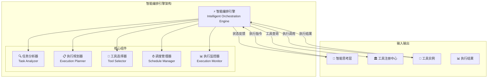

# 4.3.3 智能工具编排引擎

> "智能编排引擎是工具从静态调用升级为动态协同的关键技术，它让工具不再是孤立的功能单元，而是协同工作的智能团队。"

## 🎯 本节学习目标

完成本节学习后，您将能够：
- ✅ 设计基于任务语义的智能工具选择算法
- ✅ 实现动态工具链构建和执行调度机制
- ✅ 构建支持并发执行的工具编排系统
- ✅ 建立工具执行状态管理和异常处理机制

## 智能编排引擎概述

### 核心架构设计

智能编排引擎作为工具扩展运行层的核心调度中心，负责将智能思考层的执行指令转化为具体的工具执行计划：



### 编排引擎的核心能力

#### 1. 智能任务理解
- **语义解析**：深度理解任务的执行意图和约束条件
- **复杂度评估**：评估任务的执行难度和资源需求
- **依赖分析**：识别任务间的依赖关系和执行顺序

#### 2. 动态工具选择
- **能力匹配**：基于任务需求智能匹配最适合的工具
- **性能优化**：考虑工具性能历史和当前负载
- **成本考量**：平衡执行性能和资源消耗

#### 3. 智能执行规划
- **并发优化**：识别可并行执行的任务片段
- **资源分配**：合理分配计算和内存资源
- **容错设计**：制定异常处理和故障恢复策略

## 任务分析与理解

### 任务语义分析器

```python
from typing import List, Dict, Any, Optional
from dataclasses import dataclass
import asyncio
from enum import Enum

class TaskComplexity(Enum):
    SIMPLE = "simple"
    MODERATE = "moderate"
    COMPLEX = "complex"
    VERY_COMPLEX = "very_complex"

@dataclass
class TaskAnalysisResult:
    """任务分析结果"""
    task_id: str
    complexity: TaskComplexity
    estimated_duration: float
    required_capabilities: List[str]
    resource_requirements: Dict[str, Any]
    dependencies: List[str]
    parallelizable_segments: List[Dict]
    risk_factors: List[str]

class TaskSemanticAnalyzer:
    """任务语义分析器"""
    
    def __init__(self, llm_client, knowledge_base):
        self.llm = llm_client
        self.kb = knowledge_base
        self.complexity_classifier = ComplexityClassifier()
        self.dependency_analyzer = DependencyAnalyzer()
        
    async def analyze_task(self, task_description: str, context: Dict) -> TaskAnalysisResult:
        """分析任务语义和特征"""
        
        # 1. 基本语义解析
        semantic_features = await self.extract_semantic_features(task_description)
        
        # 2. 复杂度评估
        complexity = await self.assess_complexity(semantic_features, context)
        
        # 3. 能力需求分析
        required_capabilities = await self.analyze_capability_requirements(semantic_features)
        
        # 4. 资源需求估算
        resource_requirements = await self.estimate_resource_requirements(
            complexity, required_capabilities
        )
        
        # 5. 依赖关系分析
        dependencies = await self.analyze_dependencies(semantic_features, context)
        
        # 6. 并行化分析
        parallelizable_segments = await self.identify_parallelizable_segments(
            semantic_features, dependencies
        )
        
        # 7. 风险因素识别
        risk_factors = await self.identify_risk_factors(
            complexity, required_capabilities, dependencies
        )
        
        return TaskAnalysisResult(
            task_id=self.generate_task_id(),
            complexity=complexity,
            estimated_duration=self.estimate_duration(complexity, resource_requirements),
            required_capabilities=required_capabilities,
            resource_requirements=resource_requirements,
            dependencies=dependencies,
            parallelizable_segments=parallelizable_segments,
            risk_factors=risk_factors
        )
    
    async def extract_semantic_features(self, task_description: str) -> Dict:
        """提取任务的语义特征"""
        
        analysis_prompt = f"""
        分析以下任务的语义特征：
        任务描述：{task_description}
        
        请识别：
        1. 核心动作和操作类型
        2. 涉及的数据类型和格式
        3. 输入输出要求
        4. 性能和质量约束
        5. 特殊要求和限制条件
        
        以JSON格式返回分析结果。
        """
        
        result = await self.llm.generate(analysis_prompt)
        return self.parse_semantic_features(result)
    
    async def assess_complexity(self, semantic_features: Dict, context: Dict) -> TaskComplexity:
        """评估任务复杂度"""
        
        complexity_factors = {
            'data_volume': semantic_features.get('data_volume', 'small'),
            'operation_types': len(semantic_features.get('operations', [])),
            'integration_points': len(semantic_features.get('external_services', [])),
            'constraint_complexity': len(semantic_features.get('constraints', [])),
            'output_complexity': semantic_features.get('output_complexity', 'simple')
        }
        
        # 使用机器学习模型评估复杂度
        complexity_score = await self.complexity_classifier.classify(
            complexity_factors, context
        )
        
        if complexity_score < 0.3:
            return TaskComplexity.SIMPLE
        elif complexity_score < 0.6:
            return TaskComplexity.MODERATE
        elif complexity_score < 0.8:
            return TaskComplexity.COMPLEX
        else:
            return TaskComplexity.VERY_COMPLEX
```

### 依赖关系分析

```python
class DependencyAnalyzer:
    """依赖关系分析器"""
    
    def __init__(self):
        self.dependency_graph = DependencyGraph()
        self.cycle_detector = CycleDetector()
        
    async def analyze_dependencies(self, 
                                 semantic_features: Dict,
                                 context: Dict) -> List[str]:
        """分析任务依赖关系"""
        
        dependencies = []
        
        # 1. 数据依赖分析
        data_dependencies = self.analyze_data_dependencies(semantic_features)
        dependencies.extend(data_dependencies)
        
        # 2. 服务依赖分析
        service_dependencies = self.analyze_service_dependencies(semantic_features)
        dependencies.extend(service_dependencies)
        
        # 3. 资源依赖分析
        resource_dependencies = self.analyze_resource_dependencies(semantic_features)
        dependencies.extend(resource_dependencies)
        
        # 4. 时序依赖分析
        temporal_dependencies = self.analyze_temporal_dependencies(semantic_features)
        dependencies.extend(temporal_dependencies)
        
        # 5. 环形依赖检测
        if self.cycle_detector.has_cycles(dependencies):
            raise DependencyError("Circular dependency detected")
        
        return dependencies
    
    def analyze_data_dependencies(self, semantic_features: Dict) -> List[str]:
        """分析数据依赖"""
        
        data_dependencies = []
        
        input_data = semantic_features.get('input_data', [])
        for data_item in input_data:
            # 检查数据来源
            if 'source' in data_item and data_item['source'] != 'user_input':
                data_dependencies.append(f"data:{data_item['source']}")
            
            # 检查数据格式转换需求
            if 'format_conversion' in data_item:
                data_dependencies.append(f"converter:{data_item['target_format']}")
        
        return data_dependencies
    
    def analyze_service_dependencies(self, semantic_features: Dict) -> List[str]:
        """分析服务依赖"""
        
        service_dependencies = []
        
        external_services = semantic_features.get('external_services', [])
        for service in external_services:
            service_dependencies.append(f"service:{service['name']}")
            
            # 检查认证依赖
            if service.get('requires_auth'):
                service_dependencies.append(f"auth:{service['auth_type']}")
        
        return service_dependencies
```

## 智能工具选择算法

### 多目标优化选择器

```python
class IntelligentToolSelector:
    """智能工具选择器"""
    
    def __init__(self, tool_registry, performance_tracker):
        self.registry = tool_registry
        self.performance_tracker = performance_tracker
        self.selection_strategies = {
            'performance': PerformanceBasedStrategy(),
            'cost': CostBasedStrategy(),
            'reliability': ReliabilityBasedStrategy(),
            'compatibility': CompatibilityBasedStrategy()
        }
        
    async def select_tools(self, 
                          task_analysis: TaskAnalysisResult,
                          context: ExecutionContext) -> List[ToolSelection]:
        """智能选择执行工具"""
        
        selections = []
        
        for capability in task_analysis.required_capabilities:
            # 1. 获取候选工具
            candidate_tools = await self.registry.find_tools_by_capability(capability)
            
            # 2. 多策略评分
            scored_candidates = await self.score_candidates(
                candidate_tools, capability, context
            )
            
            # 3. 多目标优化选择
            selected_tool = await self.multi_objective_selection(
                scored_candidates, task_analysis, context
            )
            
            if selected_tool:
                selection = ToolSelection(
                    capability=capability,
                    selected_tool=selected_tool,
                    alternatives=scored_candidates[:3],  # 保留备选方案
                    selection_reason=self.generate_selection_reason(selected_tool, scored_candidates)
                )
                selections.append(selection)
            else:
                # 没有找到合适工具，需要创造新工具
                selections.append(ToolSelection(
                    capability=capability,
                    selected_tool=None,
                    alternatives=[],
                    selection_reason="No suitable tool found, creation required"
                ))
        
        return selections
    
    async def score_candidates(self,
                             candidates: List[Tool],
                             capability: str,
                             context: ExecutionContext) -> List[ScoredTool]:
        """对候选工具进行多维度评分"""
        
        scored_tools = []
        
        for tool in candidates:
            scores = {}
            
            # 并行执行多种策略评分
            scoring_tasks = [
                self.score_with_strategy(strategy_name, strategy, tool, capability, context)
                for strategy_name, strategy in self.selection_strategies.items()
            ]
            
            strategy_scores = await asyncio.gather(*scoring_tasks)
            
            for (strategy_name, _), score in zip(self.selection_strategies.items(), strategy_scores):
                scores[strategy_name] = score
            
            # 计算综合得分
            overall_score = self.calculate_overall_score(scores, context.preferences)
            
            scored_tool = ScoredTool(
                tool=tool,
                strategy_scores=scores,
                overall_score=overall_score
            )
            scored_tools.append(scored_tool)
        
        return sorted(scored_tools, key=lambda st: st.overall_score, reverse=True)
    
    async def multi_objective_selection(self,
                                      scored_candidates: List[ScoredTool],
                                      task_analysis: TaskAnalysisResult,
                                      context: ExecutionContext) -> Optional[Tool]:
        """多目标优化选择最佳工具"""
        
        if not scored_candidates:
            return None
        
        # 1. 过滤不满足基本要求的工具
        filtered_candidates = self.filter_by_requirements(
            scored_candidates, task_analysis, context
        )
        
        if not filtered_candidates:
            return None
        
        # 2. 帕累托最优选择
        pareto_optimal = self.find_pareto_optimal(filtered_candidates)
        
        # 3. 根据上下文偏好最终选择
        final_selection = self.select_by_preferences(pareto_optimal, context.preferences)
        
        return final_selection.tool if final_selection else None
    
    def calculate_overall_score(self,
                              strategy_scores: Dict[str, float],
                              preferences: Dict[str, float]) -> float:
        """计算综合得分"""
        
        # 默认权重
        default_weights = {
            'performance': 0.3,
            'cost': 0.2,
            'reliability': 0.3,
            'compatibility': 0.2
        }
        
        # 根据偏好调整权重
        weights = {
            strategy: default_weights.get(strategy, 0) * preferences.get(f"{strategy}_preference", 1.0)
            for strategy in strategy_scores.keys()
        }
        
        # 归一化权重
        total_weight = sum(weights.values())
        if total_weight > 0:
            weights = {k: v / total_weight for k, v in weights.items()}
        
        # 计算加权得分
        overall_score = sum(
            weights.get(strategy, 0) * score
            for strategy, score in strategy_scores.items()
        )
        
        return min(overall_score, 1.0)
```

## 动态执行规划

### 执行计划生成器

```python
class ExecutionPlanner:
    """执行规划器"""
    
    def __init__(self):
        self.dag_builder = DAGBuilder()
        self.resource_optimizer = ResourceOptimizer()
        self.schedule_optimizer = ScheduleOptimizer()
        
    async def create_execution_plan(self,
                                  tool_selections: List[ToolSelection],
                                  task_analysis: TaskAnalysisResult,
                                  context: ExecutionContext) -> ExecutionPlan:
        """创建执行计划"""
        
        # 1. 构建执行DAG
        execution_dag = await self.dag_builder.build_dag(
            tool_selections, task_analysis.dependencies
        )
        
        # 2. 资源分配优化
        resource_allocation = await self.resource_optimizer.optimize_allocation(
            execution_dag, task_analysis.resource_requirements, context.resource_limits
        )
        
        # 3. 执行调度优化
        execution_schedule = await self.schedule_optimizer.optimize_schedule(
            execution_dag, resource_allocation, context.time_constraints
        )
        
        # 4. 生成执行阶段
        execution_phases = self.generate_execution_phases(
            execution_dag, execution_schedule
        )
        
        # 5. 制定容错策略
        fault_tolerance_plan = self.create_fault_tolerance_plan(
            execution_phases, task_analysis.risk_factors
        )
        
        return ExecutionPlan(
            plan_id=self.generate_plan_id(),
            execution_dag=execution_dag,
            resource_allocation=resource_allocation,
            execution_schedule=execution_schedule,
            execution_phases=execution_phases,
            fault_tolerance_plan=fault_tolerance_plan,
            estimated_completion_time=execution_schedule.total_duration
        )
    
    def generate_execution_phases(self,
                                dag: ExecutionDAG,
                                schedule: ExecutionSchedule) -> List[ExecutionPhase]:
        """生成执行阶段"""
        
        phases = []
        
        # 按拓扑排序分组
        topological_groups = dag.get_topological_groups()
        
        for group_index, tool_group in enumerate(topological_groups):
            phase = ExecutionPhase(
                phase_id=f"phase_{group_index}",
                tools=tool_group,
                start_time=schedule.get_group_start_time(group_index),
                estimated_duration=schedule.get_group_duration(group_index),
                parallel_execution=len(tool_group) > 1,
                dependencies=[f"phase_{i}" for i in range(group_index)]
            )
            phases.append(phase)
        
        return phases
    
    def create_fault_tolerance_plan(self,
                                  execution_phases: List[ExecutionPhase],
                                  risk_factors: List[str]) -> FaultTolerancePlan:
        """创建容错计划"""
        
        strategies = []
        
        for phase in execution_phases:
            phase_strategies = []
            
            # 为每个工具制定容错策略
            for tool in phase.tools:
                tool_strategy = self.create_tool_fault_strategy(tool, risk_factors)
                phase_strategies.append(tool_strategy)
            
            strategies.append(PhaseStrategy(
                phase_id=phase.phase_id,
                tool_strategies=phase_strategies,
                rollback_plan=self.create_rollback_plan(phase),
                retry_policy=self.create_retry_policy(phase)
            ))
        
        return FaultTolerancePlan(
            phase_strategies=strategies,
            global_timeout=sum(phase.estimated_duration for phase in execution_phases) * 1.5,
            circuit_breaker_config=self.create_circuit_breaker_config(risk_factors)
        )
```

## 并发执行调度

### 调度管理器

```python
class ScheduleManager:
    """调度管理器"""
    
    def __init__(self, resource_pool):
        self.resource_pool = resource_pool
        self.active_executions = {}
        self.execution_queue = asyncio.Queue()
        self.worker_pool = WorkerPool(max_workers=10)
        
    async def execute_plan(self, execution_plan: ExecutionPlan) -> ExecutionResult:
        """执行计划"""
        
        try:
            # 1. 初始化执行状态
            execution_state = ExecutionState(
                plan_id=execution_plan.plan_id,
                current_phase=0,
                completed_phases=[],
                failed_phases=[],
                start_time=datetime.utcnow()
            )
            
            self.active_executions[execution_plan.plan_id] = execution_state
            
            # 2. 逐阶段执行
            for phase in execution_plan.execution_phases:
                phase_result = await self.execute_phase(phase, execution_plan, execution_state)
                
                if phase_result.success:
                    execution_state.completed_phases.append(phase.phase_id)
                    execution_state.current_phase += 1
                else:
                    execution_state.failed_phases.append(phase.phase_id)
                    
                    # 执行容错策略
                    recovery_result = await self.execute_fault_recovery(
                        phase, phase_result, execution_plan.fault_tolerance_plan
                    )
                    
                    if not recovery_result.recovered:
                        # 无法恢复，执行失败
                        return ExecutionResult(
                            success=False,
                            error_message=f"Phase {phase.phase_id} failed and could not recover",
                            execution_state=execution_state
                        )
            
            # 3. 执行成功
            execution_state.end_time = datetime.utcnow()
            execution_state.duration = (execution_state.end_time - execution_state.start_time).total_seconds()
            
            return ExecutionResult(
                success=True,
                execution_state=execution_state,
                results=self.collect_execution_results(execution_state)
            )
            
        except Exception as e:
            return ExecutionResult(
                success=False,
                error_message=str(e),
                execution_state=execution_state
            )
        finally:
            # 清理执行状态
            if execution_plan.plan_id in self.active_executions:
                del self.active_executions[execution_plan.plan_id]
    
    async def execute_phase(self,
                          phase: ExecutionPhase,
                          execution_plan: ExecutionPlan,
                          execution_state: ExecutionState) -> PhaseResult:
        """执行单个阶段"""
        
        if phase.parallel_execution and len(phase.tools) > 1:
            # 并行执行
            return await self.execute_parallel_phase(phase, execution_plan, execution_state)
        else:
            # 串行执行
            return await self.execute_sequential_phase(phase, execution_plan, execution_state)
    
    async def execute_parallel_phase(self,
                                   phase: ExecutionPhase,
                                   execution_plan: ExecutionPlan,
                                   execution_state: ExecutionState) -> PhaseResult:
        """并行执行阶段"""
        
        # 创建并发执行任务
        execution_tasks = []
        for tool in phase.tools:
            task = asyncio.create_task(
                self.execute_tool_with_monitoring(tool, execution_plan, execution_state)
            )
            execution_tasks.append(task)
        
        try:
            # 等待所有任务完成
            tool_results = await asyncio.gather(*execution_tasks, return_exceptions=True)
            
            # 分析执行结果
            successful_results = []
            failed_results = []
            
            for tool, result in zip(phase.tools, tool_results):
                if isinstance(result, Exception):
                    failed_results.append(ToolExecutionResult(
                        tool=tool,
                        success=False,
                        error=str(result)
                    ))
                else:
                    successful_results.append(result)
            
            # 判断阶段是否成功
            success = len(failed_results) == 0
            
            return PhaseResult(
                phase_id=phase.phase_id,
                success=success,
                successful_tools=successful_results,
                failed_tools=failed_results,
                duration=(datetime.utcnow() - phase.start_time).total_seconds()
            )
            
        except Exception as e:
            return PhaseResult(
                phase_id=phase.phase_id,
                success=False,
                error_message=str(e)
            )
```

## 本节总结

本节深入介绍了智能工具编排引擎的设计与实现：

### 🎯 核心技术特点
1. **智能任务理解**：基于LLM的语义分析和复杂度评估
2. **多目标工具选择**：综合性能、成本、可靠性的智能选择
3. **动态执行规划**：DAG构建和资源优化的执行计划
4. **并发调度管理**：支持并行和串行的灵活执行调度

### 🔧 关键算法实现
- 任务语义分析和复杂度评估算法
- 多策略工具选择和帕累托优化算法
- DAG构建和拓扑排序调度算法
- 容错恢复和异常处理算法

### 🚀 创新优势
- **智能化**：从规则编排升级为AI驱动编排
- **自适应**：动态调整执行策略和资源分配
- **高效性**：并发执行和资源优化提升性能
- **可靠性**：完善的容错机制和异常处理

---

**下一步学习**：掌握了智能编排的核心机制后，我们将在4.3.4节学习工具创造引擎的设计原理，了解如何动态生成满足特定需求的新工具。

> **💡 实践要点**：智能编排的关键在于平衡自动化和可控性，建议在实际应用中逐步增加智能化程度，确保系统的稳定性和可预测性。
