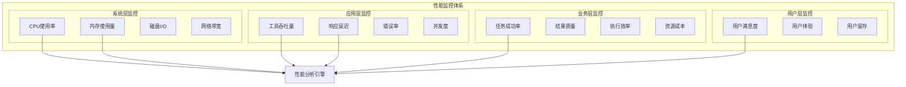

# 4.3.6 工具运行时的性能优化与监控

> "性能优化是工程艺术的体现，而监控是性能优化的眼睛。只有建立了完善的观测体系，才能实现精准的性能调优。"

## 🎯 本节学习目标

完成本节学习后，您将能够：
- ✅ 建立工具执行的全面性能监控体系
- ✅ 实现智能化的性能分析和瓶颈识别
- ✅ 掌握工具执行的多层次优化策略
- ✅ 构建自适应的性能调优机制

## 性能监控体系设计

### 多维度性能指标体系

工具运行时的性能监控需要覆盖多个维度，形成立体化的观测体系：



### 实时性能监控引擎

```python
import asyncio
import time
import psutil
import threading
from typing import Dict, List, Any, Optional, Callable
from dataclasses import dataclass, field
from collections import deque, defaultdict
import numpy as np
from datetime import datetime, timedelta

@dataclass
class MetricPoint:
    """指标数据点"""
    timestamp: float
    value: float
    tags: Dict[str, str] = field(default_factory=dict)

@dataclass
class PerformanceProfile:
    """性能剖析"""
    tool_name: str
    execution_time: float
    cpu_time: float
    memory_peak: float
    io_operations: int
    network_calls: int
    cache_hits: int
    cache_misses: int
    error_count: int
    
class RealTimeMetricsCollector:
    """实时指标收集器"""
    
    def __init__(self, collection_interval: float = 1.0):
        self.collection_interval = collection_interval
        self.metrics_buffer = defaultdict(lambda: deque(maxlen=3600))  # 1小时数据
        self.collectors = {}
        self.running = False
        self.callbacks = []
        
    def register_collector(self, name: str, collector: Callable[[], float]):
        """注册指标收集器"""
        self.collectors[name] = collector
        
    def add_callback(self, callback: Callable[[str, MetricPoint], None]):
        """添加指标回调"""
        self.callbacks.append(callback)
        
    async def start_collection(self):
        """启动指标收集"""
        self.running = True
        await asyncio.gather(
            self._collect_system_metrics(),
            self._collect_application_metrics(),
            self._process_metric_alerts()
        )
        
    async def stop_collection(self):
        """停止指标收集"""
        self.running = False
        
    async def _collect_system_metrics(self):
        """收集系统级指标"""
        
        while self.running:
            try:
                timestamp = time.time()
                
                # CPU指标
                cpu_percent = psutil.cpu_percent(interval=None)
                self._add_metric("system.cpu.percent", timestamp, cpu_percent)
                
                # 内存指标
                memory = psutil.virtual_memory()
                self._add_metric("system.memory.percent", timestamp, memory.percent)
                self._add_metric("system.memory.available", timestamp, memory.available / 1024 / 1024)  # MB
                
                # 磁盘I/O指标
                disk_io = psutil.disk_io_counters()
                if disk_io:
                    self._add_metric("system.disk.read_bytes", timestamp, disk_io.read_bytes)
                    self._add_metric("system.disk.write_bytes", timestamp, disk_io.write_bytes)
                
                # 网络I/O指标
                network_io = psutil.net_io_counters()
                if network_io:
                    self._add_metric("system.network.bytes_sent", timestamp, network_io.bytes_sent)
                    self._add_metric("system.network.bytes_recv", timestamp, network_io.bytes_recv)
                
                await asyncio.sleep(self.collection_interval)
                
            except Exception as e:
                self.logger.error(f"System metrics collection error: {e}")
                await asyncio.sleep(self.collection_interval)
                
    async def _collect_application_metrics(self):
        """收集应用级指标"""
        
        while self.running:
            try:
                timestamp = time.time()
                
                # 执行自定义收集器
                for name, collector in self.collectors.items():
                    try:
                        value = collector()
                        self._add_metric(f"application.{name}", timestamp, value)
                    except Exception as e:
                        self.logger.error(f"Collector {name} error: {e}")
                
                await asyncio.sleep(self.collection_interval)
                
            except Exception as e:
                self.logger.error(f"Application metrics collection error: {e}")
                await asyncio.sleep(self.collection_interval)
                
    def _add_metric(self, metric_name: str, timestamp: float, value: float, tags: Dict[str, str] = None):
        """添加指标数据"""
        
        metric_point = MetricPoint(
            timestamp=timestamp,
            value=value,
            tags=tags or {}
        )
        
        self.metrics_buffer[metric_name].append(metric_point)
        
        # 触发回调
        for callback in self.callbacks:
            try:
                callback(metric_name, metric_point)
            except Exception as e:
                self.logger.error(f"Metric callback error: {e}")
                
    def get_metric_values(self, metric_name: str, duration: int = 300) -> List[MetricPoint]:
        """获取指定时间段的指标值"""
        
        if metric_name not in self.metrics_buffer:
            return []
        
        current_time = time.time()
        start_time = current_time - duration
        
        return [
            point for point in self.metrics_buffer[metric_name]
            if point.timestamp >= start_time
        ]
        
    def calculate_metric_statistics(self, metric_name: str, duration: int = 300) -> Dict[str, float]:
        """计算指标统计信息"""
        
        values = [point.value for point in self.get_metric_values(metric_name, duration)]
        
        if not values:
            return {}
        
        return {
            "min": min(values),
            "max": max(values),
            "mean": np.mean(values),
            "median": np.median(values),
            "std": np.std(values),
            "p95": np.percentile(values, 95),
            "p99": np.percentile(values, 99)
        }
```

### 性能剖析器

```python
import cProfile
import pstats
import io
from contextlib import contextmanager
import resource
import tracemalloc
from typing import Generator, Dict, Any

class PerformanceProfiler:
    """性能剖析器"""
    
    def __init__(self):
        self.active_profiles = {}
        self.profile_history = []
        
    @contextmanager
    def profile_execution(self, tool_name: str, session_id: str = None) -> Generator[PerformanceProfile, None, None]:
        """性能剖析上下文管理器"""
        
        session_id = session_id or f"{tool_name}_{int(time.time())}"
        
        # 开始内存跟踪
        tracemalloc.start()
        
        # 创建CPU剖析器
        profiler = cProfile.Profile()
        profiler.enable()
        
        # 记录开始时间和资源使用
        start_time = time.time()
        start_memory = self._get_memory_usage()
        start_rusage = resource.getrusage(resource.RUSAGE_SELF)
        
        profile = PerformanceProfile(
            tool_name=tool_name,
            execution_time=0.0,
            cpu_time=0.0,
            memory_peak=0.0,
            io_operations=0,
            network_calls=0,
            cache_hits=0,
            cache_misses=0,
            error_count=0
        )
        
        self.active_profiles[session_id] = profile
        
        try:
            yield profile
            
        except Exception as e:
            profile.error_count += 1
            raise
            
        finally:
            # 停止剖析
            profiler.disable()
            
            # 计算执行时间
            end_time = time.time()
            profile.execution_time = end_time - start_time
            
            # 计算CPU时间
            end_rusage = resource.getrusage(resource.RUSAGE_SELF)
            profile.cpu_time = (
                (end_rusage.ru_utime - start_rusage.ru_utime) +
                (end_rusage.ru_stime - start_rusage.ru_stime)
            )
            
            # 获取内存使用峰值
            current_memory, peak_memory = tracemalloc.get_traced_memory()
            profile.memory_peak = peak_memory / 1024 / 1024  # MB
            tracemalloc.stop()
            
            # 分析CPU剖析结果
            cpu_stats = self._analyze_cpu_profile(profiler)
            
            # 记录剖析结果
            profile_result = {
                "session_id": session_id,
                "tool_name": tool_name,
                "profile": profile,
                "cpu_stats": cpu_stats,
                "timestamp": end_time
            }
            
            self.profile_history.append(profile_result)
            
            # 清理活跃剖析
            if session_id in self.active_profiles:
                del self.active_profiles[session_id]
                
    def _analyze_cpu_profile(self, profiler: cProfile.Profile) -> Dict[str, Any]:
        """分析CPU剖析结果"""
        
        # 创建统计对象
        stats_buffer = io.StringIO()
        stats = pstats.Stats(profiler, stream=stats_buffer)
        stats.sort_stats('cumulative')
        
        # 获取最耗时的函数
        top_functions = []
        for func_name, (call_count, total_time, cumulative_time, callers) in stats.stats.items():
            if cumulative_time > 0.001:  # 只关注耗时超过1ms的函数
                top_functions.append({
                    "function": f"{func_name[0]}:{func_name[1]}({func_name[2]})",
                    "calls": call_count,
                    "total_time": total_time,
                    "cumulative_time": cumulative_time,
                    "per_call": cumulative_time / call_count if call_count > 0 else 0
                })
        
        # 按累计时间排序
        top_functions.sort(key=lambda x: x["cumulative_time"], reverse=True)
        
        return {
            "total_calls": sum(call_count for call_count, _, _, _ in stats.stats.values()),
            "top_functions": top_functions[:10],  # 返回前10个最耗时的函数
            "profile_summary": stats_buffer.getvalue()
        }
        
    def _get_memory_usage(self) -> float:
        """获取当前内存使用量(MB)"""
        process = psutil.Process()
        return process.memory_info().rss / 1024 / 1024
        
    def get_tool_performance_summary(self, tool_name: str, hours: int = 24) -> Dict[str, Any]:
        """获取工具性能摘要"""
        
        current_time = time.time()
        start_time = current_time - (hours * 3600)
        
        # 筛选指定时间段的剖析结果
        relevant_profiles = [
            result for result in self.profile_history
            if (result["tool_name"] == tool_name and 
                result["timestamp"] >= start_time)
        ]
        
        if not relevant_profiles:
            return {"error": f"No performance data for tool {tool_name}"}
        
        # 计算统计信息
        execution_times = [result["profile"].execution_time for result in relevant_profiles]
        memory_peaks = [result["profile"].memory_peak for result in relevant_profiles]
        cpu_times = [result["profile"].cpu_time for result in relevant_profiles]
        error_counts = [result["profile"].error_count for result in relevant_profiles]
        
        return {
            "tool_name": tool_name,
            "time_range_hours": hours,
            "total_executions": len(relevant_profiles),
            "execution_time": {
                "min": min(execution_times),
                "max": max(execution_times),
                "mean": np.mean(execution_times),
                "p95": np.percentile(execution_times, 95)
            },
            "memory_usage": {
                "min": min(memory_peaks),
                "max": max(memory_peaks),
                "mean": np.mean(memory_peaks),
                "p95": np.percentile(memory_peaks, 95)
            },
            "cpu_time": {
                "min": min(cpu_times),
                "max": max(cpu_times),
                "mean": np.mean(cpu_times),
                "total": sum(cpu_times)
            },
            "error_rate": sum(error_counts) / len(relevant_profiles),
            "recent_bottlenecks": self._identify_bottlenecks(relevant_profiles[-10:])
        }
        
    def _identify_bottlenecks(self, profiles: List[Dict]) -> List[Dict[str, Any]]:
        """识别性能瓶颈"""
        
        bottlenecks = []
        
        # 分析最耗时的函数
        function_times = defaultdict(list)
        
        for profile_result in profiles:
            cpu_stats = profile_result.get("cpu_stats", {})
            top_functions = cpu_stats.get("top_functions", [])
            
            for func in top_functions:
                function_times[func["function"]].append(func["cumulative_time"])
        
        # 找出平均耗时最长的函数
        for function, times in function_times.items():
            avg_time = np.mean(times)
            if avg_time > 0.1:  # 平均耗时超过100ms
                bottlenecks.append({
                    "type": "cpu_bottleneck",
                    "function": function,
                    "average_time": avg_time,
                    "occurrences": len(times)
                })
        
        # 按平均耗时排序
        bottlenecks.sort(key=lambda x: x["average_time"], reverse=True)
        
        return bottlenecks[:5]  # 返回前5个瓶颈
```

## 智能性能分析

### 异常检测和预警系统

```python
import numpy as np
from sklearn.ensemble import IsolationForest
from sklearn.preprocessing import StandardScaler
from typing import List, Dict, Any, Optional, Tuple
import warnings
warnings.filterwarnings('ignore')

class PerformanceAnomalyDetector:
    """性能异常检测器"""
    
    def __init__(self, contamination: float = 0.1):
        self.contamination = contamination
        self.models = {}
        self.scalers = {}
        self.baseline_metrics = {}
        self.alert_thresholds = {}
        
    def train_baseline(self, tool_name: str, historical_data: List[Dict[str, float]]):
        """训练基线模型"""
        
        if not historical_data:
            return
        
        # 提取特征
        features = self._extract_features(historical_data)
        
        if len(features) < 10:  # 数据点太少
            return
        
        # 标准化
        scaler = StandardScaler()
        features_scaled = scaler.fit_transform(features)
        
        # 训练异常检测模型
        model = IsolationForest(
            contamination=self.contamination,
            random_state=42,
            n_estimators=100
        )
        model.fit(features_scaled)
        
        # 保存模型和预处理器
        self.models[tool_name] = model
        self.scalers[tool_name] = scaler
        
        # 计算基线指标
        self.baseline_metrics[tool_name] = self._calculate_baseline_metrics(historical_data)
        
        # 设置告警阈值
        self.alert_thresholds[tool_name] = self._calculate_alert_thresholds(historical_data)
        
    def detect_anomaly(self, tool_name: str, current_metrics: Dict[str, float]) -> Dict[str, Any]:
        """检测性能异常"""
        
        if tool_name not in self.models:
            return {"anomaly": False, "reason": "No baseline model"}
        
        # 提取当前特征
        features = self._extract_features([current_metrics])
        
        if not features:
            return {"anomaly": False, "reason": "Invalid metrics"}
        
        # 标准化
        scaler = self.scalers[tool_name]
        features_scaled = scaler.transform(features)
        
        # 异常检测
        model = self.models[tool_name]
        anomaly_score = model.decision_function(features_scaled)[0]
        is_anomaly = model.predict(features_scaled)[0] == -1
        
        # 详细分析
        analysis = self._analyze_performance_deviation(tool_name, current_metrics)
        
        return {
            "anomaly": is_anomaly,
            "anomaly_score": float(anomaly_score),
            "analysis": analysis,
            "recommendations": self._generate_recommendations(tool_name, current_metrics, analysis)
        }
        
    def _extract_features(self, data: List[Dict[str, float]]) -> np.ndarray:
        """提取特征向量"""
        
        feature_keys = [
            "execution_time", "memory_peak", "cpu_time", 
            "error_count", "cache_hits", "cache_misses"
        ]
        
        features = []
        for metrics in data:
            feature_vector = []
            for key in feature_keys:
                value = metrics.get(key, 0.0)
                feature_vector.append(float(value))
            features.append(feature_vector)
        
        return np.array(features)
        
    def _calculate_baseline_metrics(self, historical_data: List[Dict[str, float]]) -> Dict[str, Dict[str, float]]:
        """计算基线指标"""
        
        baseline = {}
        
        for key in ["execution_time", "memory_peak", "cpu_time", "error_count"]:
            values = [data.get(key, 0.0) for data in historical_data]
            
            if values:
                baseline[key] = {
                    "mean": np.mean(values),
                    "std": np.std(values),
                    "p50": np.percentile(values, 50),
                    "p95": np.percentile(values, 95),
                    "p99": np.percentile(values, 99)
                }
        
        return baseline
        
    def _calculate_alert_thresholds(self, historical_data: List[Dict[str, float]]) -> Dict[str, Dict[str, float]]:
        """计算告警阈值"""
        
        thresholds = {}
        
        for key in ["execution_time", "memory_peak", "cpu_time", "error_count"]:
            values = [data.get(key, 0.0) for data in historical_data]
            
            if values:
                mean = np.mean(values)
                std = np.std(values)
                
                thresholds[key] = {
                    "warning": mean + 2 * std,  # 2个标准差
                    "critical": mean + 3 * std  # 3个标准差
                }
        
        return thresholds
        
    def _analyze_performance_deviation(self, tool_name: str, current_metrics: Dict[str, float]) -> Dict[str, Any]:
        """分析性能偏差"""
        
        baseline = self.baseline_metrics.get(tool_name, {})
        thresholds = self.alert_thresholds.get(tool_name, {})
        
        analysis = {
            "deviations": [],
            "severity": "normal"
        }
        
        for metric_name, current_value in current_metrics.items():
            if metric_name not in baseline:
                continue
            
            baseline_stats = baseline[metric_name]
            baseline_mean = baseline_stats["mean"]
            baseline_std = baseline_stats["std"]
            
            # 计算Z分数
            z_score = (current_value - baseline_mean) / baseline_std if baseline_std > 0 else 0
            
            # 判断偏差程度
            if abs(z_score) > 2:
                deviation_type = "increase" if z_score > 0 else "decrease"
                severity = "critical" if abs(z_score) > 3 else "warning"
                
                analysis["deviations"].append({
                    "metric": metric_name,
                    "current_value": current_value,
                    "baseline_mean": baseline_mean,
                    "z_score": z_score,
                    "deviation_type": deviation_type,
                    "severity": severity
                })
                
                # 更新总体严重程度
                if severity == "critical":
                    analysis["severity"] = "critical"
                elif analysis["severity"] != "critical" and severity == "warning":
                    analysis["severity"] = "warning"
        
        return analysis
        
    def _generate_recommendations(self, 
                                tool_name: str, 
                                current_metrics: Dict[str, float],
                                analysis: Dict[str, Any]) -> List[str]:
        """生成优化建议"""
        
        recommendations = []
        
        for deviation in analysis.get("deviations", []):
            metric = deviation["metric"]
            deviation_type = deviation["deviation_type"]
            
            if metric == "execution_time" and deviation_type == "increase":
                recommendations.append(
                    "执行时间异常增长，建议检查算法复杂度或增加计算资源"
                )
                
            elif metric == "memory_peak" and deviation_type == "increase":
                recommendations.append(
                    "内存使用量异常增高，建议检查内存泄漏或优化数据结构"
                )
                
            elif metric == "cpu_time" and deviation_type == "increase":
                recommendations.append(
                    "CPU使用时间异常增长，建议优化计算密集型操作或启用缓存"
                )
                
            elif metric == "error_count" and deviation_type == "increase":
                recommendations.append(
                    "错误率异常增高，建议检查输入数据质量或增强异常处理"
                )
        
        if not recommendations:
            recommendations.append("性能指标正常，建议继续监控")
        
        return recommendations
```

## 性能优化策略

### 自适应资源管理器

```python
class AdaptiveResourceManager:
    """自适应资源管理器"""
    
    def __init__(self):
        self.resource_pools = {}
        self.allocation_history = []
        self.performance_feedback = {}
        self.optimization_policies = {}
        
    def register_resource_pool(self, pool_name: str, initial_size: int, max_size: int):
        """注册资源池"""
        
        self.resource_pools[pool_name] = {
            "current_size": initial_size,
            "max_size": max_size,
            "utilization_history": deque(maxlen=100),
            "performance_impact": deque(maxlen=50)
        }
        
    async def optimize_resource_allocation(self, tool_name: str, current_load: Dict[str, float]):
        """优化资源分配"""
        
        # 分析当前负载模式
        load_pattern = self._analyze_load_pattern(current_load)
        
        # 预测资源需求
        predicted_demand = await self._predict_resource_demand(tool_name, load_pattern)
        
        # 生成优化建议
        optimization_plan = self._generate_optimization_plan(
            tool_name, current_load, predicted_demand
        )
        
        # 执行资源调整
        adjustments = await self._execute_resource_adjustments(optimization_plan)
        
        return {
            "load_pattern": load_pattern,
            "predicted_demand": predicted_demand,
            "optimization_plan": optimization_plan,
            "adjustments": adjustments
        }
        
    def _analyze_load_pattern(self, current_load: Dict[str, float]) -> Dict[str, Any]:
        """分析负载模式"""
        
        # 计算负载特征
        total_load = sum(current_load.values())
        load_distribution = {
            resource: load / total_load if total_load > 0 else 0
            for resource, load in current_load.items()
        }
        
        # 识别负载类型
        load_type = "balanced"
        dominant_resource = max(load_distribution, key=load_distribution.get)
        if load_distribution[dominant_resource] > 0.6:
            load_type = f"{dominant_resource}_intensive"
        
        return {
            "total_load": total_load,
            "distribution": load_distribution,
            "dominant_resource": dominant_resource,
            "load_type": load_type,
            "timestamp": time.time()
        }
        
    async def _predict_resource_demand(self, 
                                     tool_name: str, 
                                     load_pattern: Dict[str, Any]) -> Dict[str, float]:
        """预测资源需求"""
        
        # 基于历史数据的简单预测模型
        historical_demands = self._get_historical_demands(tool_name, 10)  # 最近10次
        
        if not historical_demands:
            # 没有历史数据，使用当前负载作为基线
            return {
                "cpu": load_pattern["distribution"].get("cpu", 0.5),
                "memory": load_pattern["distribution"].get("memory", 0.3),
                "network": load_pattern["distribution"].get("network", 0.2)
            }
        
        # 计算加权平均预测
        weights = np.exp(np.linspace(-1, 0, len(historical_demands)))  # 指数加权
        weights /= weights.sum()
        
        predicted_demand = {}
        for resource in ["cpu", "memory", "network"]:
            resource_demands = [demand.get(resource, 0) for demand in historical_demands]
            predicted_demand[resource] = np.average(resource_demands, weights=weights)
        
        # 考虑当前负载模式的影响
        current_factor = 0.3  # 当前负载的权重
        for resource in predicted_demand:
            current_demand = load_pattern["distribution"].get(resource, 0)
            predicted_demand[resource] = (
                (1 - current_factor) * predicted_demand[resource] +
                current_factor * current_demand
            )
        
        return predicted_demand
        
    def _generate_optimization_plan(self, 
                                  tool_name: str,
                                  current_load: Dict[str, float],
                                  predicted_demand: Dict[str, float]) -> Dict[str, Any]:
        """生成优化计划"""
        
        optimizations = []
        
        # CPU优化
        if predicted_demand.get("cpu", 0) > 0.8:
            optimizations.append({
                "type": "cpu_scaling",
                "action": "increase_worker_threads",
                "target": min(predicted_demand["cpu"] * 1.2, 1.0),
                "priority": "high"
            })
        elif predicted_demand.get("cpu", 0) < 0.3:
            optimizations.append({
                "type": "cpu_scaling", 
                "action": "decrease_worker_threads",
                "target": max(predicted_demand["cpu"] * 1.1, 0.1),
                "priority": "medium"
            })
        
        # 内存优化
        if predicted_demand.get("memory", 0) > 0.85:
            optimizations.append({
                "type": "memory_optimization",
                "action": "enable_memory_compression",
                "target": 0.8,
                "priority": "high"
            })
            optimizations.append({
                "type": "cache_optimization",
                "action": "increase_cache_size",
                "target": predicted_demand["memory"] * 0.8,
                "priority": "medium"
            })
        
        # 网络优化
        if predicted_demand.get("network", 0) > 0.7:
            optimizations.append({
                "type": "network_optimization",
                "action": "enable_connection_pooling",
                "target": 0.6,
                "priority": "medium"
            })
        
        return {
            "tool_name": tool_name,
            "optimizations": optimizations,
            "estimated_impact": self._estimate_optimization_impact(optimizations),
            "execution_order": self._prioritize_optimizations(optimizations)
        }
        
    async def _execute_resource_adjustments(self, optimization_plan: Dict[str, Any]) -> List[Dict[str, Any]]:
        """执行资源调整"""
        
        adjustments = []
        
        for optimization in optimization_plan["execution_order"]:
            try:
                result = await self._apply_optimization(optimization)
                adjustments.append({
                    "optimization": optimization,
                    "result": result,
                    "success": True,
                    "timestamp": time.time()
                })
                
                # 短暂等待以观察效果
                await asyncio.sleep(1.0)
                
            except Exception as e:
                adjustments.append({
                    "optimization": optimization,
                    "error": str(e),
                    "success": False,
                    "timestamp": time.time()
                })
        
        return adjustments
        
    async def _apply_optimization(self, optimization: Dict[str, Any]) -> Dict[str, Any]:
        """应用具体的优化措施"""
        
        optimization_type = optimization["type"]
        action = optimization["action"]
        
        if optimization_type == "cpu_scaling":
            if action == "increase_worker_threads":
                # 增加工作线程数
                new_thread_count = await self._adjust_thread_pool_size(increase=True)
                return {"new_thread_count": new_thread_count}
                
            elif action == "decrease_worker_threads":
                # 减少工作线程数
                new_thread_count = await self._adjust_thread_pool_size(increase=False)
                return {"new_thread_count": new_thread_count}
        
        elif optimization_type == "memory_optimization":
            if action == "enable_memory_compression":
                # 启用内存压缩
                await self._enable_memory_compression()
                return {"memory_compression": "enabled"}
        
        elif optimization_type == "cache_optimization":
            if action == "increase_cache_size":
                # 增加缓存大小
                new_cache_size = await self._adjust_cache_size(increase=True)
                return {"new_cache_size": new_cache_size}
        
        elif optimization_type == "network_optimization":
            if action == "enable_connection_pooling":
                # 启用连接池
                await self._enable_connection_pooling()
                return {"connection_pooling": "enabled"}
        
        return {"status": "optimization_applied"}
```

## 本节总结

本节深入介绍了工具运行时的性能优化与监控：

### 🎯 核心监控体系
1. **多维度指标**：系统、应用、业务、用户四个层面的全方位监控
2. **实时收集**：基于异步架构的高效指标收集机制
3. **智能分析**：基于机器学习的异常检测和性能预测
4. **自动优化**：自适应的资源管理和性能调优

### 🔧 关键技术实现
- 基于时间序列的性能指标收集和存储
- 使用IsolationForest进行性能异常检测
- 基于历史数据的资源需求预测算法
- 多策略的自动化性能优化机制

### 🚀 优化策略价值
- **预防性**：通过预测发现潜在性能问题
- **自动化**：减少人工干预，提高运维效率
- **精准性**：基于数据分析的精确优化建议
- **持续性**：建立持续改进的性能优化循环

---

**下一步学习**：掌握了性能优化的核心技术后，我们将在4.3.7节学习企业级工具扩展运行层的安全与治理，了解如何在企业环境中安全可靠地运行工具系统。

> **💡 性能优化要诀**：性能优化是一个持续迭代的过程，关键在于建立完善的监控体系，基于数据驱动决策，避免过早优化，专注于真正的性能瓶颈。
