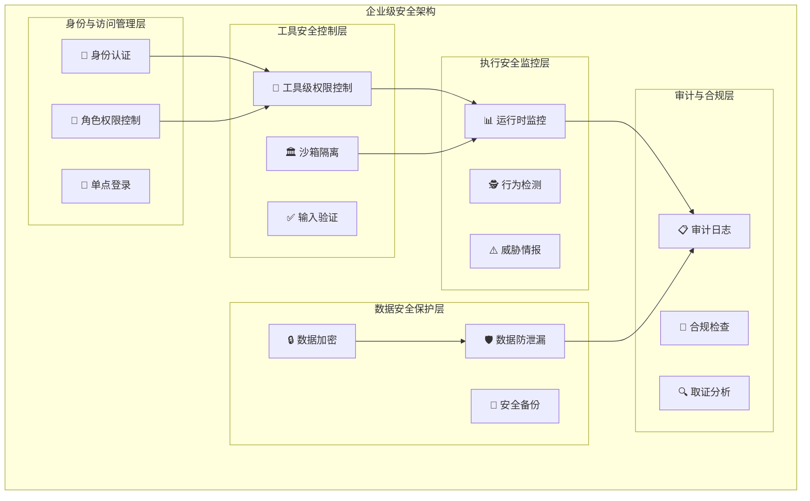

# 4.3.7 企业级工具扩展运行层的安全与治理

> "安全和治理是企业级AI应用的生命线。没有安全保障的智能系统如同脱缰野马，而缺乏治理的工具生态终将走向混乱。"

## 🎯 本节学习目标

完成本节学习后，您将能够：
- ✅ 构建完善的工具权限管理和访问控制体系
- ✅ 实现全面的工具执行审计和合规监控
- ✅ 建立企业级的安全风险防控机制
- ✅ 设计可扩展的工具治理和生命周期管理体系

## 企业级安全架构

### 多层次安全防护体系

企业级工具扩展运行层需要建立纵深防御的安全架构，确保每一个层次都有相应的安全控制措施：



### 身份与访问管理 (IAM)

```python
import jwt
import hashlib
import secrets
import time
from typing import Dict, List, Any, Optional, Set
from dataclasses import dataclass, field
from enum import Enum
import asyncio
from datetime import datetime, timedelta

class PermissionLevel(Enum):
    READ = "read"
    WRITE = "write"
    EXECUTE = "execute"
    ADMIN = "admin"

class ResourceType(Enum):
    TOOL = "tool"
    REGISTRY = "registry"
    EXECUTION = "execution"
    MONITORING = "monitoring"
    CONFIGURATION = "configuration"

@dataclass
class Permission:
    """权限定义"""
    resource_type: ResourceType
    resource_id: str
    permission_level: PermissionLevel
    conditions: Dict[str, Any] = field(default_factory=dict)
    expires_at: Optional[datetime] = None

@dataclass
class Role:
    """角色定义"""
    role_id: str
    role_name: str
    description: str
    permissions: List[Permission] = field(default_factory=list)
    inherits_from: List[str] = field(default_factory=list)

@dataclass
class User:
    """用户信息"""
    user_id: str
    username: str
    email: str
    roles: List[str] = field(default_factory=list)
    direct_permissions: List[Permission] = field(default_factory=list)
    created_at: datetime = field(default_factory=datetime.now)
    last_login: Optional[datetime] = None
    is_active: bool = True

class EnterpriseIAMManager:
    """企业级身份与访问管理器"""
    
    def __init__(self, jwt_secret: str, token_expiry_hours: int = 8):
        self.jwt_secret = jwt_secret
        self.token_expiry_hours = token_expiry_hours
        self.users = {}
        self.roles = {}
        self.active_sessions = {}
        self.permission_cache = {}
        self.audit_logger = AuditLogger()
        
        # 初始化默认角色
        self._initialize_default_roles()
    
    def _initialize_default_roles(self):
        """初始化默认角色"""
        
        # 系统管理员角色
        admin_role = Role(
            role_id="system_admin",
            role_name="系统管理员",
            description="拥有系统全部权限",
            permissions=[
                Permission(ResourceType.TOOL, "*", PermissionLevel.ADMIN),
                Permission(ResourceType.REGISTRY, "*", PermissionLevel.ADMIN),
                Permission(ResourceType.EXECUTION, "*", PermissionLevel.ADMIN),
                Permission(ResourceType.MONITORING, "*", PermissionLevel.ADMIN),
                Permission(ResourceType.CONFIGURATION, "*", PermissionLevel.ADMIN)
            ]
        )
        
        # 工具开发者角色
        developer_role = Role(
            role_id="tool_developer",
            role_name="工具开发者", 
            description="可以开发和管理工具",
            permissions=[
                Permission(ResourceType.TOOL, "*", PermissionLevel.WRITE),
                Permission(ResourceType.REGISTRY, "*", PermissionLevel.WRITE),
                Permission(ResourceType.EXECUTION, "*", PermissionLevel.EXECUTE),
                Permission(ResourceType.MONITORING, "*", PermissionLevel.READ)
            ]
        )
        
        # 普通用户角色
        user_role = Role(
            role_id="regular_user",
            role_name="普通用户",
            description="可以使用工具执行任务",
            permissions=[
                Permission(ResourceType.TOOL, "*", PermissionLevel.EXECUTE),
                Permission(ResourceType.EXECUTION, "*", PermissionLevel.READ),
                Permission(ResourceType.MONITORING, "self", PermissionLevel.READ)
            ]
        )
        
        self.roles.update({
            "system_admin": admin_role,
            "tool_developer": developer_role,
            "regular_user": user_role
        })
    
    async def authenticate_user(self, username: str, password: str) -> Optional[Dict[str, Any]]:
        """用户认证"""
        
        user = self.users.get(username)
        if not user or not user.is_active:
            await self.audit_logger.log_security_event(
                "LOGIN_FAILED", 
                {"username": username, "reason": "user_not_found_or_inactive"}
            )
            return None
        
        # 验证密码 (实际应用中应使用bcrypt等安全哈希)
        password_hash = hashlib.sha256(f"{password}{user.user_id}".encode()).hexdigest()
        stored_hash = getattr(user, 'password_hash', '')
        
        if not secrets.compare_digest(password_hash, stored_hash):
            await self.audit_logger.log_security_event(
                "LOGIN_FAILED",
                {"username": username, "reason": "invalid_password"}
            )
            return None
        
        # 生成访问令牌
        token = await self._generate_access_token(user)
        
        # 更新最后登录时间
        user.last_login = datetime.now()
        
        # 记录成功登录
        await self.audit_logger.log_security_event(
            "LOGIN_SUCCESS",
            {"username": username, "user_id": user.user_id}
        )
        
        return {
            "user": user,
            "access_token": token,
            "expires_in": self.token_expiry_hours * 3600
        }
    
    async def _generate_access_token(self, user: User) -> str:
        """生成访问令牌"""
        
        now = datetime.utcnow()
        payload = {
            "user_id": user.user_id,
            "username": user.username,
            "roles": user.roles,
            "iat": int(now.timestamp()),
            "exp": int((now + timedelta(hours=self.token_expiry_hours)).timestamp()),
            "jti": secrets.token_hex(16)  # JWT ID
        }
        
        token = jwt.encode(payload, self.jwt_secret, algorithm="HS256")
        
        # 存储活跃会话
        self.active_sessions[payload["jti"]] = {
            "user_id": user.user_id,
            "created_at": now,
            "last_activity": now
        }
        
        return token
    
    async def validate_token(self, token: str) -> Optional[Dict[str, Any]]:
        """验证访问令牌"""
        
        try:
            payload = jwt.decode(token, self.jwt_secret, algorithms=["HS256"])
            
            # 检查会话是否仍然活跃
            jti = payload.get("jti")
            if jti not in self.active_sessions:
                return None
            
            # 更新最后活动时间
            self.active_sessions[jti]["last_activity"] = datetime.utcnow()
            
            return payload
            
        except jwt.ExpiredSignatureError:
            await self.audit_logger.log_security_event(
                "TOKEN_EXPIRED", {"token": token[:20] + "..."}
            )
            return None
        except jwt.InvalidTokenError:
            await self.audit_logger.log_security_event(
                "INVALID_TOKEN", {"token": token[:20] + "..."}
            )
            return None
    
    async def check_permission(self, 
                             user_id: str, 
                             resource_type: ResourceType,
                             resource_id: str,
                             permission_level: PermissionLevel) -> bool:
        """检查用户权限"""
        
        # 使用缓存提高性能
        cache_key = f"{user_id}:{resource_type.value}:{resource_id}:{permission_level.value}"
        if cache_key in self.permission_cache:
            cached_result = self.permission_cache[cache_key]
            if time.time() - cached_result["timestamp"] < 300:  # 5分钟缓存
                return cached_result["result"]
        
        user = self.users.get(user_id)
        if not user or not user.is_active:
            return False
        
        # 收集用户的所有权限
        all_permissions = set()
        
        # 添加直接权限
        all_permissions.update(user.direct_permissions)
        
        # 添加角色权限
        for role_id in user.roles:
            role = self.roles.get(role_id)
            if role:
                all_permissions.update(role.permissions)
                
                # 处理角色继承
                inherited_permissions = self._get_inherited_permissions(role)
                all_permissions.update(inherited_permissions)
        
        # 检查权限匹配
        has_permission = self._match_permission(
            all_permissions, resource_type, resource_id, permission_level
        )
        
        # 缓存结果
        self.permission_cache[cache_key] = {
            "result": has_permission,
            "timestamp": time.time()
        }
        
        # 记录权限检查
        await self.audit_logger.log_access_check(
            user_id, resource_type.value, resource_id, 
            permission_level.value, has_permission
        )
        
        return has_permission
    
    def _get_inherited_permissions(self, role: Role) -> Set[Permission]:
        """获取角色继承的权限"""
        
        inherited_permissions = set()
        
        for parent_role_id in role.inherits_from:
            parent_role = self.roles.get(parent_role_id)
            if parent_role:
                inherited_permissions.update(parent_role.permissions)
                # 递归处理多层继承
                inherited_permissions.update(self._get_inherited_permissions(parent_role))
        
        return inherited_permissions
    
    def _match_permission(self,
                         permissions: Set[Permission],
                         resource_type: ResourceType,
                         resource_id: str, 
                         required_level: PermissionLevel) -> bool:
        """匹配权限"""
        
        permission_hierarchy = {
            PermissionLevel.READ: 1,
            PermissionLevel.WRITE: 2, 
            PermissionLevel.EXECUTE: 3,
            PermissionLevel.ADMIN: 4
        }
        
        required_level_value = permission_hierarchy.get(required_level, 0)
        
        for permission in permissions:
            # 检查资源类型
            if permission.resource_type != resource_type:
                continue
            
            # 检查资源ID (支持通配符)
            if permission.resource_id != "*" and permission.resource_id != resource_id:
                continue
            
            # 检查权限级别
            permission_level_value = permission_hierarchy.get(permission.permission_level, 0)
            if permission_level_value >= required_level_value:
                # 检查条件约束
                if self._check_permission_conditions(permission, resource_id):
                    return True
        
        return False
    
    def _check_permission_conditions(self, permission: Permission, resource_id: str) -> bool:
        """检查权限条件"""
        
        if not permission.conditions:
            return True
        
        # 检查时间约束
        if permission.expires_at and datetime.now() > permission.expires_at:
            return False
        
        # 检查IP约束
        if "allowed_ips" in permission.conditions:
            # 这里需要从请求上下文获取客户端IP
            # current_ip = get_client_ip()
            # if current_ip not in permission.conditions["allowed_ips"]:
            #     return False
            pass
        
        # 检查时间窗口约束
        if "time_window" in permission.conditions:
            current_hour = datetime.now().hour
            allowed_hours = permission.conditions["time_window"]
            if current_hour not in allowed_hours:
                return False
        
        return True
```

### 工具执行沙箱

```python
import subprocess
import tempfile
import os
import resource
import signal
import psutil
from contextlib import contextmanager
import docker
from typing import Dict, List, Any, Optional, Union

class SandboxSecurityPolicy:
    """沙箱安全策略"""
    
    def __init__(self):
        self.max_memory_mb = 512
        self.max_cpu_time = 30  # 秒
        self.max_processes = 10
        self.allowed_syscalls = set()
        self.blocked_network_ports = [22, 23, 25, 53, 80, 443]
        self.allowed_file_paths = set()
        self.blocked_file_paths = {"/etc/passwd", "/etc/shadow", "/root"}
        self.max_file_size_mb = 100
        self.execution_timeout = 60  # 秒

class DockerSandbox:
    """Docker容器沙箱"""
    
    def __init__(self, security_policy: SandboxSecurityPolicy):
        self.policy = security_policy
        self.docker_client = docker.from_env()
        self.active_containers = {}
        
    @contextmanager
    def create_sandbox(self, tool_name: str, execution_context: Dict[str, Any]):
        """创建沙箱环境"""
        
        container = None
        container_name = f"tool_sandbox_{tool_name}_{int(time.time())}"
        
        try:
            # 准备容器配置
            container_config = self._build_container_config(
                tool_name, container_name, execution_context
            )
            
            # 创建并启动容器
            container = self.docker_client.containers.run(
                **container_config,
                detach=True
            )
            
            self.active_containers[container_name] = container
            
            # 等待容器就绪
            self._wait_for_container_ready(container)
            
            yield SandboxEnvironment(container, self.policy)
            
        except Exception as e:
            self.logger.error(f"Sandbox creation failed: {e}")
            raise SandboxError(f"Failed to create sandbox: {e}")
            
        finally:
            # 清理容器
            if container:
                try:
                    container.stop(timeout=5)
                    container.remove()
                except Exception as e:
                    self.logger.error(f"Container cleanup failed: {e}")
                
                if container_name in self.active_containers:
                    del self.active_containers[container_name]
    
    def _build_container_config(self, 
                              tool_name: str,
                              container_name: str,
                              execution_context: Dict[str, Any]) -> Dict[str, Any]:
        """构建容器配置"""
        
        # 基础镜像选择
        base_image = self._select_base_image(tool_name, execution_context)
        
        # 环境变量
        environment = {
            "TOOL_NAME": tool_name,
            "EXECUTION_ID": execution_context.get("execution_id", ""),
            "PYTHONPATH": "/sandbox/tools",
        }
        
        # 挂载卷
        volumes = {
            "/tmp/sandbox_data": {"bind": "/sandbox/data", "mode": "rw"},
            "/tmp/sandbox_tools": {"bind": "/sandbox/tools", "mode": "ro"}
        }
        
        # 网络配置
        network_mode = "bridge"
        if execution_context.get("network_isolated", True):
            network_mode = "none"
        
        return {
            "image": base_image,
            "name": container_name,
            "environment": environment,
            "volumes": volumes,
            "network_mode": network_mode,
            "mem_limit": f"{self.policy.max_memory_mb}m",
            "cpu_quota": int(self.policy.max_cpu_time * 100000),  # 100% CPU = 100000
            "cpu_period": 100000,
            "pids_limit": self.policy.max_processes,
            "read_only": True,
            "tmpfs": {"/tmp": "rw,size=100m"},
            "security_opt": ["no-new-privileges:true"],
            "cap_drop": ["ALL"],
            "cap_add": ["SETUID", "SETGID"],  # 最小权限
            "user": "1000:1000",  # 非root用户
            "working_dir": "/sandbox",
            "command": ["python3", "-c", "import time; time.sleep(3600)"]  # 保持容器运行
        }
    
    def _select_base_image(self, tool_name: str, execution_context: Dict[str, Any]) -> str:
        """选择基础镜像"""
        
        # 根据工具类型选择不同的基础镜像
        tool_type = execution_context.get("tool_type", "python")
        
        image_mapping = {
            "python": "python:3.9-slim",
            "nodejs": "node:16-alpine", 
            "java": "openjdk:11-jre-slim",
            "go": "golang:1.19-alpine",
            "rust": "rust:1.70-slim"
        }
        
        return image_mapping.get(tool_type, "python:3.9-slim")
    
    def _wait_for_container_ready(self, container, timeout: int = 30):
        """等待容器就绪"""
        
        start_time = time.time()
        
        while time.time() - start_time < timeout:
            try:
                container.reload()
                if container.status == "running":
                    # 执行健康检查
                    exit_code, output = container.exec_run("echo 'container ready'")
                    if exit_code == 0:
                        return
                        
            except Exception as e:
                self.logger.debug(f"Container not ready yet: {e}")
                
            time.sleep(1)
        
        raise SandboxError("Container failed to become ready within timeout")

class SandboxEnvironment:
    """沙箱执行环境"""
    
    def __init__(self, container, security_policy: SandboxSecurityPolicy):
        self.container = container
        self.policy = security_policy
        
    async def execute_command(self, command: str, input_data: str = None) -> Dict[str, Any]:
        """在沙箱中执行命令"""
        
        try:
            # 命令安全检查
            if not self._validate_command_security(command):
                raise SecurityError("Command failed security validation")
            
            # 准备执行环境
            exec_config = {
                "cmd": ["bash", "-c", command],
                "environment": {"EXECUTION_TIMEOUT": str(self.policy.execution_timeout)},
                "user": "1000:1000",
                "workdir": "/sandbox"
            }
            
            # 执行命令
            start_time = time.time()
            exec_result = self.container.exec_run(**exec_config, stream=True, demux=True)
            
            # 收集输出
            stdout_data = []
            stderr_data = []
            
            for stdout, stderr in exec_result.output:
                if stdout:
                    stdout_data.append(stdout.decode('utf-8'))
                if stderr:
                    stderr_data.append(stderr.decode('utf-8'))
                    
                # 检查执行超时
                if time.time() - start_time > self.policy.execution_timeout:
                    self._terminate_execution()
                    raise ExecutionTimeoutError("Command execution timed out")
            
            execution_time = time.time() - start_time
            
            return {
                "exit_code": exec_result.exit_code,
                "stdout": "".join(stdout_data),
                "stderr": "".join(stderr_data),
                "execution_time": execution_time,
                "resource_usage": self._get_resource_usage()
            }
            
        except Exception as e:
            return {
                "exit_code": -1,
                "stdout": "",
                "stderr": str(e),
                "execution_time": 0,
                "error": str(e)
            }
    
    def _validate_command_security(self, command: str) -> bool:
        """验证命令安全性"""
        
        # 危险命令黑名单
        dangerous_commands = [
            "rm -rf", "dd if=", "mkfs", "format", "fdisk",
            "iptables", "ufw", "firewall", "sudo", "su",
            "chmod +s", "chown root", "passwd", "useradd",
            "wget", "curl", "nc", "netcat", "ssh", "scp"
        ]
        
        command_lower = command.lower()
        
        for dangerous_cmd in dangerous_commands:
            if dangerous_cmd in command_lower:
                self.logger.warning(f"Dangerous command detected: {dangerous_cmd}")
                return False
        
        # 检查文件路径访问
        sensitive_paths = ["/etc/", "/proc/", "/sys/", "/dev/", "/root/"]
        
        for path in sensitive_paths:
            if path in command_lower:
                self.logger.warning(f"Sensitive path access detected: {path}")
                return False
        
        return True
    
    def _get_resource_usage(self) -> Dict[str, float]:
        """获取资源使用情况"""
        
        try:
            stats = self.container.stats(stream=False)
            
            # CPU使用率
            cpu_stats = stats["cpu_stats"]
            precpu_stats = stats["precpu_stats"]
            
            cpu_delta = cpu_stats["cpu_usage"]["total_usage"] - precpu_stats["cpu_usage"]["total_usage"]
            system_delta = cpu_stats["system_cpu_usage"] - precpu_stats["system_cpu_usage"]
            
            cpu_percent = 0.0
            if system_delta > 0:
                cpu_percent = (cpu_delta / system_delta) * len(cpu_stats["cpu_usage"]["percpu_usage"]) * 100
            
            # 内存使用
            memory_stats = stats["memory_stats"]
            memory_usage = memory_stats.get("usage", 0)
            memory_limit = memory_stats.get("limit", 0)
            memory_percent = (memory_usage / memory_limit * 100) if memory_limit > 0 else 0
            
            return {
                "cpu_percent": cpu_percent,
                "memory_usage_mb": memory_usage / 1024 / 1024,
                "memory_percent": memory_percent
            }
            
        except Exception as e:
            self.logger.error(f"Failed to get resource usage: {e}")
            return {"cpu_percent": 0, "memory_usage_mb": 0, "memory_percent": 0}
    
    def _terminate_execution(self):
        """终止执行"""
        try:
            # 发送SIGTERM信号
            self.container.exec_run("pkill -TERM -P 1", user="root")
            time.sleep(2)
            
            # 如果进程仍在运行，发送SIGKILL
            self.container.exec_run("pkill -KILL -P 1", user="root")
            
        except Exception as e:
            self.logger.error(f"Failed to terminate execution: {e}")
```

## 审计与合规监控

### 全面审计日志系统

```python
import json
import asyncio
from typing import Dict, List, Any, Optional
from datetime import datetime
from dataclasses import dataclass, asdict
from enum import Enum

class AuditEventType(Enum):
    USER_LOGIN = "user_login"
    USER_LOGOUT = "user_logout" 
    TOOL_ACCESS = "tool_access"
    TOOL_EXECUTION = "tool_execution"
    PERMISSION_CHECK = "permission_check"
    SECURITY_VIOLATION = "security_violation"
    DATA_ACCESS = "data_access"
    CONFIGURATION_CHANGE = "configuration_change"
    SYSTEM_ERROR = "system_error"

class Severity(Enum):
    INFO = "info"
    WARNING = "warning"
    ERROR = "error"
    CRITICAL = "critical"

@dataclass
class AuditEvent:
    """审计事件"""
    event_id: str
    event_type: AuditEventType
    timestamp: datetime
    user_id: Optional[str]
    session_id: Optional[str]
    source_ip: Optional[str]
    user_agent: Optional[str]
    resource_type: Optional[str]
    resource_id: Optional[str]
    action: str
    result: str  # SUCCESS, FAILURE, ERROR
    details: Dict[str, Any]
    severity: Severity = Severity.INFO

class ComprehensiveAuditLogger:
    """全面审计日志系统"""
    
    def __init__(self, storage_backend):
        self.storage = storage_backend
        self.event_queue = asyncio.Queue(maxsize=10000)
        self.running = False
        self.compliance_rules = {}
        self.alert_thresholds = {}
        
        # 初始化合规规则
        self._initialize_compliance_rules()
        
    async def start_audit_logging(self):
        """启动审计日志记录"""
        self.running = True
        
        # 启动事件处理任务
        asyncio.create_task(self._process_audit_events())
        asyncio.create_task(self._compliance_monitoring())
        
    async def stop_audit_logging(self):
        """停止审计日志记录"""
        self.running = False
        
        # 处理剩余事件
        while not self.event_queue.empty():
            await asyncio.sleep(0.1)
    
    async def log_user_activity(self, 
                              event_type: AuditEventType,
                              user_id: str,
                              action: str,
                              result: str,
                              details: Dict[str, Any],
                              context: Dict[str, Any] = None):
        """记录用户活动"""
        
        event = AuditEvent(
            event_id=self._generate_event_id(),
            event_type=event_type,
            timestamp=datetime.utcnow(),
            user_id=user_id,
            session_id=context.get("session_id") if context else None,
            source_ip=context.get("source_ip") if context else None,
            user_agent=context.get("user_agent") if context else None,
            resource_type=context.get("resource_type") if context else None,
            resource_id=context.get("resource_id") if context else None,
            action=action,
            result=result,
            details=details,
            severity=self._determine_severity(event_type, result)
        )
        
        await self._enqueue_event(event)
        
    async def log_tool_execution(self,
                               tool_name: str,
                               user_id: str,
                               execution_context: Dict[str, Any],
                               execution_result: Dict[str, Any]):
        """记录工具执行"""
        
        details = {
            "tool_name": tool_name,
            "input_data_hash": self._hash_sensitive_data(execution_context.get("input_data")),
            "execution_time": execution_result.get("execution_time", 0),
            "resource_usage": execution_result.get("resource_usage", {}),
            "output_data_hash": self._hash_sensitive_data(execution_result.get("output"))
        }
        
        result = "SUCCESS" if execution_result.get("success", False) else "FAILURE"
        
        await self.log_user_activity(
            AuditEventType.TOOL_EXECUTION,
            user_id,
            f"execute_{tool_name}",
            result,
            details,
            execution_context
        )
    
    async def log_security_event(self,
                               event_type: str,
                               details: Dict[str, Any],
                               severity: Severity = Severity.WARNING):
        """记录安全事件"""
        
        event = AuditEvent(
            event_id=self._generate_event_id(),
            event_type=AuditEventType.SECURITY_VIOLATION,
            timestamp=datetime.utcnow(),
            user_id=details.get("user_id"),
            session_id=details.get("session_id"),
            source_ip=details.get("source_ip"),
            user_agent=details.get("user_agent"),
            resource_type="security",
            resource_id=event_type,
            action=event_type,
            result="VIOLATION",
            details=details,
            severity=severity
        )
        
        await self._enqueue_event(event)
        
        # 安全事件立即处理
        if severity in [Severity.ERROR, Severity.CRITICAL]:
            await self._handle_critical_security_event(event)
    
    async def _process_audit_events(self):
        """处理审计事件"""
        
        batch_size = 100
        events_batch = []
        
        while self.running:
            try:
                # 收集事件批次
                while len(events_batch) < batch_size and self.running:
                    try:
                        event = await asyncio.wait_for(
                            self.event_queue.get(), timeout=5.0
                        )
                        events_batch.append(event)
                    except asyncio.TimeoutError:
                        break
                
                # 批量存储事件
                if events_batch:
                    await self._store_events_batch(events_batch)
                    
                    # 实时合规检查
                    await self._check_compliance_violations(events_batch)
                    
                    events_batch.clear()
                
            except Exception as e:
                self.logger.error(f"Audit event processing error: {e}")
                await asyncio.sleep(1)
    
    async def _store_events_batch(self, events: List[AuditEvent]):
        """批量存储审计事件"""
        
        try:
            # 转换为存储格式
            events_data = [asdict(event) for event in events]
            
            # 存储到后端
            await self.storage.store_audit_events(events_data)
            
            # 更新统计信息
            await self._update_audit_statistics(events)
            
        except Exception as e:
            self.logger.error(f"Failed to store audit events: {e}")
            # 实现降级存储策略（如本地文件）
            await self._fallback_storage(events)
    
    def _initialize_compliance_rules(self):
        """初始化合规规则"""
        
        self.compliance_rules = {
            # 数据保护规则 (GDPR类似)
            "data_protection": {
                "sensitive_data_access_logging": True,
                "data_retention_days": 2555,  # 7年
                "anonymization_required": True,
                "cross_border_transfer_approval": True
            },
            
            # 访问控制规则 (SOX类似)
            "access_control": {
                "privileged_access_logging": True,
                "admin_activity_review": True,
                "access_certification_period": 90,  # 天
                "segregation_of_duties": True
            },
            
            # 系统完整性规则
            "system_integrity": {
                "configuration_change_approval": True,
                "emergency_access_logging": True,
                "backup_verification": True,
                "integrity_monitoring": True
            }
        }
    
    async def _check_compliance_violations(self, events: List[AuditEvent]):
        """检查合规违规"""
        
        for event in events:
            violations = []
            
            # 检查数据保护合规
            if event.event_type == AuditEventType.DATA_ACCESS:
                if not self._check_data_protection_compliance(event):
                    violations.append("data_protection_violation")
            
            # 检查访问控制合规
            if event.event_type in [AuditEventType.USER_LOGIN, AuditEventType.PERMISSION_CHECK]:
                if not self._check_access_control_compliance(event):
                    violations.append("access_control_violation")
            
            # 检查系统完整性合规
            if event.event_type == AuditEventType.CONFIGURATION_CHANGE:
                if not self._check_system_integrity_compliance(event):
                    violations.append("system_integrity_violation")
            
            # 处理违规
            if violations:
                await self._handle_compliance_violations(event, violations)
    
    def _check_data_protection_compliance(self, event: AuditEvent) -> bool:
        """检查数据保护合规"""
        
        rules = self.compliance_rules["data_protection"]
        
        # 检查敏感数据访问是否有适当的日志记录
        if event.details.get("data_classification") == "sensitive":
            if not event.details.get("access_justification"):
                return False
            
            if not event.details.get("data_minimization_applied"):
                return False
        
        return True
    
    def _check_access_control_compliance(self, event: AuditEvent) -> bool:
        """检查访问控制合规"""
        
        # 检查特权访问是否有适当审批
        if event.details.get("privilege_level") == "admin":
            if not event.details.get("approval_id"):
                return False
        
        return True
    
    async def _handle_compliance_violations(self, 
                                         event: AuditEvent, 
                                         violations: List[str]):
        """处理合规违规"""
        
        violation_details = {
            "original_event_id": event.event_id,
            "violation_types": violations,
            "severity": "HIGH",
            "requires_immediate_action": True
        }
        
        await self.log_security_event(
            "COMPLIANCE_VIOLATION",
            violation_details,
            Severity.ERROR
        )
        
        # 发送违规通知
        await self._send_compliance_alert(event, violations)
        
    async def generate_compliance_report(self, 
                                       start_date: datetime,
                                       end_date: datetime,
                                       compliance_framework: str) -> Dict[str, Any]:
        """生成合规报告"""
        
        # 查询审计事件
        events = await self.storage.query_audit_events(start_date, end_date)
        
        # 分析合规状态
        compliance_analysis = self._analyze_compliance_status(events, compliance_framework)
        
        # 生成报告
        report = {
            "report_id": self._generate_report_id(),
            "framework": compliance_framework,
            "period": {
                "start": start_date.isoformat(),
                "end": end_date.isoformat()
            },
            "summary": compliance_analysis["summary"],
            "violations": compliance_analysis["violations"],
            "recommendations": compliance_analysis["recommendations"],
            "evidence": compliance_analysis["evidence"],
            "generated_at": datetime.utcnow().isoformat()
        }
        
        return report
```

## 本节总结

本节深入介绍了企业级工具扩展运行层的安全与治理：

### 🎯 核心安全体系
1. **多层防护**：身份认证、权限控制、沙箱隔离、执行监控的全方位安全防护
2. **精细权限**：基于RBAC的细粒度权限管理和动态权限检查
3. **安全隔离**：Docker容器沙箱提供的安全执行环境
4. **全面审计**：覆盖所有关键操作的审计日志和合规监控

### 🔧 关键实现技术
- 基于JWT的安全令牌和会话管理机制
- RBAC权限模型的分层继承和条件约束
- Docker容器的资源限制和安全配置
- 实时审计日志收集和合规规则检查

### 🚀 企业级价值
- **合规性**：满足各种法规要求的审计和监控能力
- **安全性**：多层次安全防护确保系统安全可靠
- **可控性**：细粒度的权限管理和资源控制
- **可追溯性**：完整的操作轨迹和证据链管理

---

**下一步展望**：完成工具扩展运行层的学习后，我们将进入第4.4章智能环境层的学习，了解如何为AI应用构建稳定可靠的基础设施环境。

> **💡 安全要诀**：企业级安全不仅是技术问题，更是管理问题。技术手段提供防护能力，而制度流程确保防护措施的有效执行，两者缺一不可。
