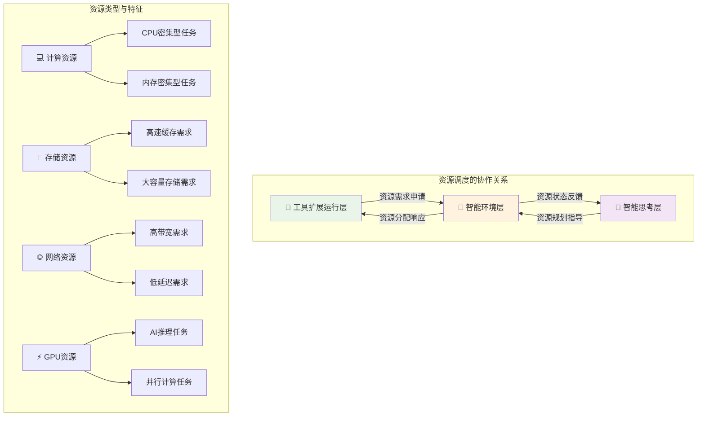

# 4.4.3 智能资源调度与管理

> "资源调度是智能环境的大脑，它不仅要满足当前需求，更要预测未来变化。智能调度的艺术在于在有限资源与无限需求之间找到最优平衡。"

## 🎯 本节学习目标

完成本节学习后，您将能够：
- ✅ 掌握AI应用场景下的资源调度算法和策略
- ✅ 实现计算、存储、网络资源的智能分配机制
- ✅ 构建动态伸缩和自适应调度系统
- ✅ 建立资源状态反馈和决策优化机制

## 资源调度理论基础

### AI应用的资源使用特征

基于修正后的架构关系，智能环境层需要响应工具扩展运行层的资源申请，并向智能思考层反馈资源状态信息：



### 传统调度 vs 智能调度

AI应用需要更智能的资源调度策略：

| 维度 | 传统资源调度 | AI智能调度 |
|------|-------------|------------|
| **预测能力** | 基于历史静态数据 | 基于AI的动态预测 |
| **调度策略** | 固定规则算法 | 自适应学习算法 |
| **资源感知** | 单维度资源考量 | 多维度全局优化 |
| **响应速度** | 分钟级调整 | 秒级实时调整 |
| **学习能力** | 无学习机制 | 持续学习优化 |
| **负载模式** | 可预测模式 | 不可预测模式 |

### 智能调度的核心原理

```python
from typing import Dict, List, Any, Optional, Tuple
from dataclasses import dataclass, field
from enum import Enum
import numpy as np
import asyncio
from datetime import datetime, timedelta
import logging

class ResourceType(Enum):
    CPU = "cpu"
    MEMORY = "memory"
    STORAGE = "storage"
    NETWORK = "network"
    GPU = "gpu"

class SchedulingStrategy(Enum):
    IMMEDIATE = "immediate"      # 立即分配
    DELAYED = "delayed"         # 延迟分配
    PREEMPTIVE = "preemptive"   # 抢占式分配
    PREDICTIVE = "predictive"   # 预测式分配

@dataclass
class ResourceRequest:
    """资源请求"""
    request_id: str
    tool_id: str
    resource_requirements: Dict[ResourceType, float]
    priority: int = 1
    max_wait_time: float = 300.0  # 最大等待时间(秒)
    estimated_duration: float = 60.0  # 预估执行时间
    flexibility: Dict[str, Any] = field(default_factory=dict)  # 资源弹性配置

@dataclass
class ResourceAllocation:
    """资源分配"""
    allocation_id: str
    request_id: str
    allocated_resources: Dict[ResourceType, float]
    allocation_time: datetime
    expected_release_time: datetime
    node_id: str
    cost: float = 0.0

class IntelligentResourceScheduler:
    """智能资源调度器"""
    
    def __init__(self):
        self.resource_pool = ResourcePool()
        self.request_queue = PriorityRequestQueue()
        self.allocation_tracker = AllocationTracker()
        self.demand_predictor = DemandPredictor()
        self.optimization_engine = OptimizationEngine()
        self.performance_analyzer = PerformanceAnalyzer()
        
        # 调度策略配置
        self.scheduling_strategies = {
            SchedulingStrategy.IMMEDIATE: ImmediateScheduler(),
            SchedulingStrategy.DELAYED: DelayedScheduler(),
            SchedulingStrategy.PREEMPTIVE: PreemptiveScheduler(),
            SchedulingStrategy.PREDICTIVE: PredictiveScheduler()
        }
        
        self.running = False
        self.logger = logging.getLogger(__name__)
    
    async def start_scheduler(self):
        """启动调度器"""
        self.running = True
        await asyncio.gather(
            self._scheduling_loop(),
            self._monitoring_loop(),
            self._optimization_loop(),
            self._prediction_loop()
        )
    
    async def submit_resource_request(self, request: ResourceRequest) -> str:
        """提交资源请求"""
        
        # 1. 验证资源请求
        validation_result = await self._validate_request(request)
        if not validation_result.valid:
            raise InvalidResourceRequestError(validation_result.error_message)
        
        # 2. 预处理请求
        processed_request = await self._preprocess_request(request)
        
        # 3. 加入请求队列
        await self.request_queue.enqueue(processed_request)
        
        # 4. 触发调度评估
        asyncio.create_task(self._evaluate_scheduling_opportunity())
        
        self.logger.info(f"Resource request {request.request_id} submitted for tool {request.tool_id}")
        return request.request_id
    
    async def _scheduling_loop(self):
        """主调度循环"""
        
        while self.running:
            try:
                # 获取当前资源状态
                resource_status = await self.resource_pool.get_current_status()
                
                # 选择调度策略
                strategy = await self._select_scheduling_strategy(resource_status)
                
                # 执行调度决策
                scheduled_requests = await self._execute_scheduling_round(strategy)
                
                # 更新性能指标
                await self._update_scheduling_metrics(scheduled_requests)
                
                # 向智能思考层反馈资源状态
                await self._report_resource_status_to_thinking_layer(resource_status)
                
                await asyncio.sleep(1.0)  # 调度周期
                
            except Exception as e:
                self.logger.error(f"Scheduling loop error: {e}")
                await asyncio.sleep(5.0)
    
    async def _select_scheduling_strategy(self, 
                                        resource_status: Dict) -> SchedulingStrategy:
        """选择调度策略"""
        
        # 基于当前资源状况和请求特征选择策略
        pending_requests = await self.request_queue.get_pending_count()
        resource_utilization = resource_status.get("utilization", 0.0)
        critical_requests = await self.request_queue.get_critical_count()
        
        # 决策逻辑
        if critical_requests > 0 and resource_utilization > 0.8:
            return SchedulingStrategy.PREEMPTIVE
        elif resource_utilization < 0.3:
            return SchedulingStrategy.IMMEDIATE
        elif pending_requests > 10:
            return SchedulingStrategy.PREDICTIVE
        else:
            return SchedulingStrategy.DELAYED
    
    async def _execute_scheduling_round(self, 
                                      strategy: SchedulingStrategy) -> List[ResourceAllocation]:
        """执行一轮调度"""
        
        scheduler = self.scheduling_strategies[strategy]
        
        # 获取待调度请求
        pending_requests = await self.request_queue.get_ready_requests()
        
        if not pending_requests:
            return []
        
        # 执行调度算法
        allocations = await scheduler.schedule(pending_requests, self.resource_pool)
        
        # 应用分配结果
        successful_allocations = []
        for allocation in allocations:
            if await self._apply_allocation(allocation):
                successful_allocations.append(allocation)
        
        return successful_allocations
    
    async def _report_resource_status_to_thinking_layer(self, 
                                                      resource_status: Dict):
        """向智能思考层报告资源状态"""
        
        # 构建资源状态报告
        status_report = {
            "timestamp": datetime.now().isoformat(),
            "overall_utilization": resource_status.get("utilization", 0.0),
            "available_resources": resource_status.get("available", {}),
            "pending_requests": await self.request_queue.get_pending_count(),
            "allocation_efficiency": await self._calculate_allocation_efficiency(),
            "predicted_bottlenecks": await self.demand_predictor.predict_bottlenecks(),
            "recommendations": await self._generate_resource_recommendations()
        }
        
        # 发送给智能思考层
        await self._send_to_thinking_layer(status_report)
```

## 智能调度算法设计

### 多目标优化调度算法

AI应用的资源调度需要同时优化多个目标：

```python
class MultiObjectiveScheduler:
    """多目标优化调度器"""
    
    def __init__(self):
        self.objectives = {
            "resource_utilization": ResourceUtilizationObjective(),
            "response_time": ResponseTimeObjective(), 
            "fairness": FairnessObjective(),
            "energy_efficiency": EnergyEfficiencyObjective(),
            "cost_optimization": CostOptimizationObjective()
        }
        
        self.weights = {
            "resource_utilization": 0.3,
            "response_time": 0.25,
            "fairness": 0.2,
            "energy_efficiency": 0.15,
            "cost_optimization": 0.1
        }
    
    async def optimize_allocation(self, 
                                requests: List[ResourceRequest],
                                available_resources: Dict) -> List[ResourceAllocation]:
        """多目标优化分配"""
        
        # 1. 生成候选分配方案
        candidate_solutions = await self._generate_candidate_solutions(
            requests, available_resources
        )
        
        # 2. 评估每个目标函数
        objective_scores = {}
        for solution in candidate_solutions:
            scores = {}
            for obj_name, objective in self.objectives.items():
                scores[obj_name] = await objective.evaluate(solution, available_resources)
            objective_scores[solution.solution_id] = scores
        
        # 3. 帕累托最优筛选
        pareto_optimal = self._find_pareto_optimal_solutions(
            candidate_solutions, objective_scores
        )
        
        # 4. 加权评分选择
        best_solution = self._select_best_weighted_solution(
            pareto_optimal, objective_scores
        )
        
        return best_solution.allocations if best_solution else []
    
    def _find_pareto_optimal_solutions(self, 
                                     solutions: List,
                                     scores: Dict) -> List:
        """找到帕累托最优解"""
        
        pareto_optimal = []
        
        for solution in solutions:
            solution_scores = scores[solution.solution_id]
            is_dominated = False
            
            # 检查是否被其他解支配
            for other_solution in solutions:
                if other_solution.solution_id == solution.solution_id:
                    continue
                
                other_scores = scores[other_solution.solution_id]
                
                # 检查是否所有目标都不优于other_solution
                all_worse_or_equal = True
                at_least_one_worse = False
                
                for obj_name in self.objectives.keys():
                    if solution_scores[obj_name] > other_scores[obj_name]:
                        all_worse_or_equal = False
                        break
                    elif solution_scores[obj_name] < other_scores[obj_name]:
                        at_least_one_worse = True
                
                if all_worse_or_equal and at_least_one_worse:
                    is_dominated = True
                    break
            
            if not is_dominated:
                pareto_optimal.append(solution)
        
        return pareto_optimal
    
    def _select_best_weighted_solution(self, 
                                     pareto_solutions: List,
                                     scores: Dict):
        """基于权重选择最佳解"""
        
        best_solution = None
        best_weighted_score = float('-inf')
        
        for solution in pareto_solutions:
            solution_scores = scores[solution.solution_id]
            
            # 计算加权得分
            weighted_score = sum(
                self.weights[obj_name] * score
                for obj_name, score in solution_scores.items()
            )
            
            if weighted_score > best_weighted_score:
                best_weighted_score = weighted_score
                best_solution = solution
        
        return best_solution

class PredictiveScheduler:
    """预测式调度器"""
    
    def __init__(self):
        self.demand_predictor = ResourceDemandPredictor()
        self.performance_predictor = PerformancePredictor()
        self.proactive_allocator = ProactiveAllocator()
        
    async def schedule(self, 
                     requests: List[ResourceRequest],
                     resource_pool) -> List[ResourceAllocation]:
        """预测式调度"""
        
        # 1. 预测未来资源需求
        future_demand = await self.demand_predictor.predict_demand(
            time_horizon=300  # 预测5分钟内的需求
        )
        
        # 2. 预测性能影响
        performance_impact = await self.performance_predictor.predict_impact(
            requests, future_demand
        )
        
        # 3. 生成前瞻性分配策略
        allocation_plan = await self._generate_proactive_plan(
            requests, future_demand, performance_impact
        )
        
        # 4. 执行资源分配
        allocations = await self.proactive_allocator.allocate(
            allocation_plan, resource_pool
        )
        
        return allocations
    
    async def _generate_proactive_plan(self,
                                     current_requests: List[ResourceRequest],
                                     future_demand: Dict,
                                     performance_impact: Dict) -> Dict:
        """生成前瞻性分配计划"""
        
        plan = {
            "immediate_allocations": [],
            "reserved_allocations": [],
            "conditional_allocations": []
        }
        
        # 分析每个请求
        for request in current_requests:
            allocation_strategy = await self._determine_allocation_strategy(
                request, future_demand, performance_impact
            )
            
            if allocation_strategy == "immediate":
                plan["immediate_allocations"].append(request)
            elif allocation_strategy == "reserve":
                plan["reserved_allocations"].append(request)
            else:
                plan["conditional_allocations"].append(request)
        
        return plan
    
    async def _determine_allocation_strategy(self,
                                           request: ResourceRequest,
                                           future_demand: Dict,
                                           performance_impact: Dict) -> str:
        """确定分配策略"""
        
        # 检查是否为高优先级请求
        if request.priority >= 8:
            return "immediate"
        
        # 预测资源紧张程度
        resource_tension = await self._predict_resource_tension(
            request, future_demand
        )
        
        # 预测性能影响
        perf_impact = performance_impact.get(request.request_id, 0.0)
        
        if resource_tension > 0.8 and perf_impact > 0.5:
            return "reserve"  # 预留资源
        elif resource_tension > 0.5:
            return "conditional"  # 条件分配
        else:
            return "immediate"
```

## 计算资源管理

### CPU资源智能分配

```python
class CPUResourceManager:
    """CPU资源管理器"""
    
    def __init__(self):
        self.cpu_nodes = {}
        self.allocation_tracker = CPUAllocationTracker()
        self.performance_profiler = CPUPerformanceProfiler()
        self.load_balancer = CPULoadBalancer()
        
    async def allocate_cpu_resources(self, 
                                   request: ResourceRequest) -> Optional[ResourceAllocation]:
        """分配CPU资源"""
        
        cpu_requirement = request.resource_requirements.get(ResourceType.CPU, 0)
        
        if cpu_requirement <= 0:
            return None
        
        # 1. 获取可用CPU节点
        available_nodes = await self._get_available_cpu_nodes(cpu_requirement)
        
        if not available_nodes:
            return None
        
        # 2. 选择最佳节点
        best_node = await self._select_best_cpu_node(
            available_nodes, request
        )
        
        # 3. 执行CPU分配
        allocation = await self._perform_cpu_allocation(
            best_node, request, cpu_requirement
        )
        
        # 4. 配置CPU调度策略
        await self._configure_cpu_scheduling(allocation, request)
        
        return allocation
    
    async def _select_best_cpu_node(self, 
                                   nodes: List[Dict],
                                   request: ResourceRequest) -> Dict:
        """选择最佳CPU节点"""
        
        node_scores = {}
        
        for node in nodes:
            score = 0
            
            # CPU利用率评分 (利用率适中得分高)
            cpu_utilization = node["cpu_utilization"]
            if 0.3 <= cpu_utilization <= 0.7:
                score += 40
            elif cpu_utilization < 0.3:
                score += 30
            else:
                score += 10
            
            # 内存可用性评分
            memory_available = node["memory_available"] / node["memory_total"]
            score += int(memory_available * 30)
            
            # 网络带宽评分
            network_bandwidth = node["network_bandwidth_available"]
            score += min(network_bandwidth / 1000, 20)  # 标准化到20分
            
            # 历史性能评分
            historical_performance = await self.performance_profiler.get_node_performance(
                node["node_id"]
            )
            score += int(historical_performance * 10)
            
            node_scores[node["node_id"]] = score
        
        # 选择得分最高的节点
        best_node_id = max(node_scores, key=node_scores.get)
        return next(node for node in nodes if node["node_id"] == best_node_id)
    
    async def _configure_cpu_scheduling(self, 
                                      allocation: ResourceAllocation,
                                      request: ResourceRequest):
        """配置CPU调度策略"""
        
        tool_type = request.tool_id.split("_")[0]  # 从tool_id提取类型
        
        # 根据工具类型配置调度策略
        scheduling_configs = {
            "ml_inference": {
                "cpu_shares": 1024,      # 高优先级
                "cpu_period": 100000,
                "cpu_quota": allocation.allocated_resources[ResourceType.CPU] * 100000
            },
            "data_processing": {
                "cpu_shares": 512,       # 中优先级
                "cpu_period": 100000,
                "cpu_quota": allocation.allocated_resources[ResourceType.CPU] * 100000
            },
            "api_call": {
                "cpu_shares": 256,       # 低优先级
                "cpu_period": 100000,
                "cpu_quota": allocation.allocated_resources[ResourceType.CPU] * 100000
            }
        }
        
        config = scheduling_configs.get(tool_type, scheduling_configs["data_processing"])
        
        # 应用CPU调度配置
        await self._apply_cpu_scheduling_config(allocation, config)

class GPUResourceManager:
    """GPU资源管理器"""
    
    def __init__(self):
        self.gpu_clusters = {}
        self.gpu_scheduler = GPUScheduler()
        self.memory_manager = GPUMemoryManager()
        self.utilization_monitor = GPUUtilizationMonitor()
        
    async def allocate_gpu_resources(self, 
                                   request: ResourceRequest) -> Optional[ResourceAllocation]:
        """分配GPU资源"""
        
        gpu_requirement = request.resource_requirements.get(ResourceType.GPU, 0)
        
        if gpu_requirement <= 0:
            return None
        
        # 1. 分析GPU需求类型
        gpu_workload_type = await self._analyze_gpu_workload(request)
        
        # 2. 选择合适的GPU集群
        suitable_clusters = await self._find_suitable_gpu_clusters(
            gpu_requirement, gpu_workload_type
        )
        
        if not suitable_clusters:
            return None
        
        # 3. 优化GPU内存分配
        memory_allocation = await self.memory_manager.optimize_memory_allocation(
            request, suitable_clusters
        )
        
        # 4. 执行GPU调度
        allocation = await self.gpu_scheduler.schedule_gpu_job(
            request, suitable_clusters[0], memory_allocation
        )
        
        return allocation
    
    async def _analyze_gpu_workload(self, request: ResourceRequest) -> str:
        """分析GPU工作负载类型"""
        
        tool_id = request.tool_id
        
        # 根据工具类型识别工作负载
        if "ml_inference" in tool_id:
            return "inference"
        elif "ml_training" in tool_id:
            return "training"
        elif "data_processing" in tool_id:
            return "compute"
        elif "rendering" in tool_id:
            return "graphics"
        else:
            return "general"
    
    async def monitor_gpu_performance(self) -> Dict[str, Any]:
        """监控GPU性能"""
        
        performance_data = {}
        
        for cluster_id, cluster in self.gpu_clusters.items():
            cluster_metrics = {
                "total_gpus": len(cluster["gpus"]),
                "active_gpus": 0,
                "total_memory": 0,
                "used_memory": 0,
                "average_utilization": 0.0,
                "temperature": []
            }
            
            utilization_sum = 0
            for gpu in cluster["gpus"]:
                gpu_stats = await self.utilization_monitor.get_gpu_stats(gpu["gpu_id"])
                
                if gpu_stats["utilization"] > 0:
                    cluster_metrics["active_gpus"] += 1
                
                cluster_metrics["total_memory"] += gpu_stats["total_memory"]
                cluster_metrics["used_memory"] += gpu_stats["used_memory"]
                cluster_metrics["temperature"].append(gpu_stats["temperature"])
                utilization_sum += gpu_stats["utilization"]
            
            cluster_metrics["average_utilization"] = utilization_sum / len(cluster["gpus"])
            cluster_metrics["memory_utilization"] = (
                cluster_metrics["used_memory"] / cluster_metrics["total_memory"] * 100
            )
            
            performance_data[cluster_id] = cluster_metrics
        
        return performance_data
```

## 存储资源管理

### 分层存储智能调度

```python
class IntelligentStorageManager:
    """智能存储管理器"""
    
    def __init__(self):
        self.storage_tiers = {
            "hot": HotStorageTier(),      # 高速SSD
            "warm": WarmStorageTier(),    # 普通SSD  
            "cold": ColdStorageTier()     # 机械硬盘
        }
        self.data_classifier = DataClassifier()
        self.access_predictor = AccessPredictor()
        self.migration_manager = DataMigrationManager()
        
    async def allocate_storage_resources(self, 
                                       request: ResourceRequest) -> Optional[ResourceAllocation]:
        """分配存储资源"""
        
        storage_requirement = request.resource_requirements.get(ResourceType.STORAGE, 0)
        
        if storage_requirement <= 0:
            return None
        
        # 1. 分析数据访问模式
        access_pattern = await self._analyze_access_pattern(request)
        
        # 2. 选择存储层级
        optimal_tier = await self._select_optimal_storage_tier(
            storage_requirement, access_pattern
        )
        
        # 3. 执行存储分配
        allocation = await self._allocate_storage_space(
            optimal_tier, storage_requirement, request
        )
        
        # 4. 配置数据生命周期管理
        await self._configure_data_lifecycle(allocation, access_pattern)
        
        return allocation
    
    async def _analyze_access_pattern(self, request: ResourceRequest) -> Dict[str, Any]:
        """分析数据访问模式"""
        
        tool_type = request.tool_id.split("_")[0]
        
        # 基于工具类型预测访问模式
        access_patterns = {
            "ml_inference": {
                "frequency": "high",        # 高频访问
                "pattern": "random",        # 随机访问
                "duration": "short",        # 短期使用
                "io_type": "read_heavy"     # 读密集型
            },
            "data_processing": {
                "frequency": "medium",
                "pattern": "sequential",    # 顺序访问
                "duration": "medium",
                "io_type": "read_write"     # 读写均衡
            },
            "backup": {
                "frequency": "low",
                "pattern": "sequential",
                "duration": "long",         # 长期保存
                "io_type": "write_heavy"    # 写密集型
            }
        }
        
        base_pattern = access_patterns.get(tool_type, access_patterns["data_processing"])
        
        # 结合历史数据优化预测
        historical_pattern = await self.access_predictor.predict_access_pattern(
            request.tool_id
        )
        
        # 融合基础模式和历史模式
        return self._merge_access_patterns(base_pattern, historical_pattern)
    
    async def _select_optimal_storage_tier(self,
                                         storage_size: float,
                                         access_pattern: Dict) -> str:
        """选择最优存储层级"""
        
        # 访问频率评分
        frequency_scores = {
            "high": {"hot": 90, "warm": 60, "cold": 10},
            "medium": {"hot": 70, "warm": 90, "cold": 40},
            "low": {"hot": 30, "warm": 60, "cold": 90}
        }
        
        # 数据大小影响
        size_gb = storage_size / 1024 / 1024 / 1024
        size_factors = {
            "hot": 1.0 if size_gb < 100 else 0.5,
            "warm": 1.0 if size_gb < 1000 else 0.8,
            "cold": 1.0  # 冷存储不受大小限制
        }
        
        # 成本权重
        cost_weights = {"hot": 0.3, "warm": 0.6, "cold": 1.0}
        
        frequency = access_pattern.get("frequency", "medium")
        tier_scores = {}
        
        for tier in self.storage_tiers.keys():
            # 基础频率评分
            base_score = frequency_scores[frequency][tier]
            
            # 应用大小因子
            size_adjusted_score = base_score * size_factors[tier]
            
            # 考虑成本因素
            final_score = size_adjusted_score * cost_weights[tier]
            
            tier_scores[tier] = final_score
        
        # 选择得分最高的存储层级
        return max(tier_scores, key=tier_scores.get)
    
    async def intelligent_data_migration(self):
        """智能数据迁移"""
        
        # 1. 分析所有数据的访问模式
        all_data_stats = await self._collect_all_data_stats()
        
        # 2. 识别迁移候选
        migration_candidates = await self._identify_migration_candidates(all_data_stats)
        
        # 3. 生成迁移计划
        migration_plan = await self._generate_migration_plan(migration_candidates)
        
        # 4. 执行智能迁移
        for migration_task in migration_plan:
            await self.migration_manager.execute_migration(migration_task)
    
    async def _identify_migration_candidates(self, 
                                           data_stats: List[Dict]) -> List[Dict]:
        """识别迁移候选数据"""
        
        candidates = []
        
        for data_item in data_stats:
            current_tier = data_item["current_tier"]
            access_frequency = data_item["access_frequency"]
            last_access = data_item["last_access_time"]
            
            # 热数据降温：很少访问的热存储数据
            if (current_tier == "hot" and 
                access_frequency < 0.1 and  # 低访问频率
                (datetime.now() - last_access).days > 7):  # 7天未访问
                
                candidates.append({
                    "data_id": data_item["data_id"],
                    "migration_type": "hot_to_warm",
                    "priority": "medium",
                    "estimated_savings": data_item["size"] * 0.5  # 估算节省50%成本
                })
            
            # 温数据降温：长期不访问的温存储数据
            elif (current_tier == "warm" and
                  access_frequency < 0.01 and
                  (datetime.now() - last_access).days > 30):  # 30天未访问
                  
                candidates.append({
                    "data_id": data_item["data_id"], 
                    "migration_type": "warm_to_cold",
                    "priority": "low",
                    "estimated_savings": data_item["size"] * 0.3
                })
            
            # 冷数据升温：频繁访问的冷存储数据
            elif (current_tier == "cold" and
                  access_frequency > 0.5 and
                  (datetime.now() - last_access).hours < 24):  # 24小时内访问
                  
                candidates.append({
                    "data_id": data_item["data_id"],
                    "migration_type": "cold_to_warm", 
                    "priority": "high",
                    "estimated_cost": data_item["size"] * 0.3
                })
        
        return candidates
```

## 本节总结

本节深入介绍了智能资源调度与管理的完整体系：

### 🎯 核心技术特点
1. **多目标优化**：同时优化资源利用率、响应时间、公平性等多个目标
2. **预测式调度**：基于AI预测的前瞻性资源分配策略
3. **自适应调整**：根据实时负载和性能反馈动态调整调度策略
4. **分层管理**：CPU、GPU、存储等不同资源的专业化管理

### 🔧 关键算法实现
- 多目标优化的帕累托最优解选择算法
- 基于机器学习的资源需求预测模型
- CPU和GPU的智能调度和负载均衡算法
- 存储分层的访问模式分析和自动迁移机制

### 🚀 智能化优势
- **预测能力**：基于历史数据和AI模型预测资源需求
- **自学习**：从调度历史中学习优化调度决策
- **全局优化**：考虑系统整体性能而非局部最优
- **反馈闭环**：向智能思考层实时反馈资源状态

### 📊 与架构协作
- **响应工具层请求**：智能响应工具扩展运行层的资源申请
- **反馈思考层状态**：向智能思考层提供资源状态和优化建议
- **支持决策优化**：为上层决策提供资源可用性信息

---

**下一步学习**：掌握了智能资源调度后，我们将继续学习其他重要章节，包括安全控制、工程实践等内容，构建完整的智能环境层知识体系。

> **💡 调度要诀**：智能资源调度的关键在于平衡多个目标，既要满足当前需求，又要为未来预留空间；既要追求高效利用，又要保证服务质量。
