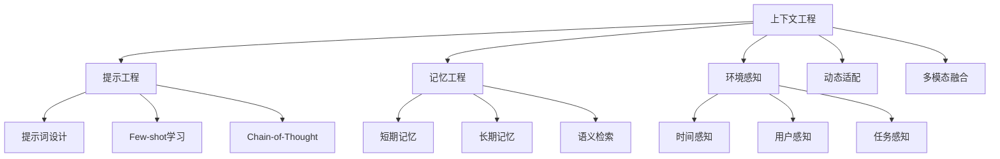

# 4.1.1 上下文工程的理论基础与技术架构

## 学习目标

- 理解上下文工程的核心概念及其在AGI应用中的战略意义
- 掌握上下文工程与传统提示工程的区别与联系
- 建立AGI应用记忆系统的理论框架

## 1. 上下文工程的定义与内涵

### 1.1 概念边界与技术特征

上下文工程（Context Engineering）是AGI应用开发中一项系统性的技术实践，旨在为大语言模型（LLM）构建完整、准确、动态的信息环境，使其能够在特定任务场景下产生高质量的响应。与传统的提示工程不同，上下文工程强调的是**全局性的信息治理**和**系统性的上下文管理**。

从技术特征来看，上下文工程具有以下核心特点：

**全局性（Holistic）**：不仅关注单次交互的提示优化，更注重整个应用生命周期中的上下文一致性和连贯性。

**动态性（Dynamic）**：能够根据用户行为、环境变化和任务需求实时调整上下文内容和结构。

**层次性（Hierarchical）**：通过多层次的信息组织，实现从即时工作记忆到长期知识存储的全覆盖。

**智能性（Intelligent）**：具备自动的信息筛选、优先级判断和关联推理能力。

### 1.2 与提示工程、记忆工程的关系辨析

为了准确理解上下文工程的定位，我们需要明确其与相关技术领域的关系：

**提示工程（Prompt Engineering）**主要关注单次交互中的输入优化，通过精心设计的提示词来引导模型产生期望的输出。其核心在于"如何问"的艺术。

**记忆工程（Memory Engineering）**专注于信息的存储、检索和管理机制，解决的是"如何记住"的问题。

**上下文工程（Context Engineering）**则是一个更高维度的综合性技术体系，它**整合了提示工程的输入优化技术和记忆工程的信息管理机制**，同时还包括环境感知、动态适配、多模态融合等更广泛的技术要素。



### 1.3 上下文工程在AGI应用架构中的定位

在现代AGI应用架构中，上下文工程处于**连接层（Connection Layer）**的核心位置，它承担着以下关键职责：

**向上对接**：与业务逻辑层进行交互，理解业务需求和用户意图。

**向下适配**：与LLM推理层进行通信，将结构化的上下文信息转换为模型可理解的输入格式。

**横向协调**：与数据存储层、工具调用层、监控日志层等进行信息交换。

以JoyAgent-JDGenie项目为例，其架构中的上下文工程实现体现在以下组件中：

```java
// AgentContext类承担上下文环境的管理职责
public class AgentContext {
    String requestId;        // 请求标识
    String sessionId;        // 会话标识  
    String query;           // 用户查询
    String task;            // 当前任务
    ToolCollection toolCollection;  // 工具集合
    List<File> productFiles; // 产品文件
    // ...其他上下文信息
}

// Memory类实现记忆管理功能
public class Memory {
    private List<Message> messages = new ArrayList<>();
    
    public void addMessage(Message message) { /* 添加记忆 */ }
    public void clearToolContext() { /* 清理工具上下文 */ }
    public String getFormatMessage() { /* 格式化输出 */ }
    // ...其他记忆操作方法
}
```

## 2. 上下文的构成要素分析

### 2.1 静态上下文：系统的基础认知框架

静态上下文是AI应用的基础认知框架，在系统初始化阶段确定，并在整个会话过程中保持相对稳定。它包括：

**系统提示（System Prompt）**：定义AI助手的角色、能力边界和行为准则。

```java
// 在ExecutorAgent中的系统提示配置
setSystemPrompt(genieConfig.getExecutorSystemPromptMap()
    .getOrDefault(promptKey, ToolCallPrompt.SYSTEM_PROMPT)
    .replace("{{tools}}", toolPrompt.toString())
    .replace("{{query}}", context.getQuery())
    .replace("{{date}}", context.getDateInfo()));
```

**领域知识（Domain Knowledge）**：特定领域的专业知识和规则集合。

**配置参数（Configuration Parameters）**：模型参数、执行策略、安全策略等系统级配置。

### 2.2 动态上下文：实时的交互状态

动态上下文反映了系统与用户交互过程中产生的实时状态信息：

**用户输入（User Input）**：当前轮次的用户查询和历史对话内容。

**交互历史（Interaction History）**：完整的对话历史记录，包括用户提问和系统回复。

**环境状态（Environment State）**：当前时间、用户位置、设备信息等环境变量。

在项目中，这些信息通过Memory类进行统一管理：

```java
// 更新动态上下文信息
public void updateMemory(RoleType role, String content, String base64Image) {
    Message message = createMessage(role, content, base64Image);
    memory.addMessage(message);
}
```

### 2.3 工具上下文：扩展的能力边界

工具上下文定义了AI系统的能力边界和执行环境：

**可用工具集（Available Tools）**：系统当前可调用的外部工具和API。

**执行历史（Execution History）**：工具调用的历史记录和执行结果。

**状态反馈（State Feedback）**：工具执行状态和错误信息。

```java
// ToolCollection管理工具上下文
public class ToolCollection {
    private final Map<String, BaseTool> toolMap = new HashMap<>();
    
    public Object execute(String toolName, Object args) {
        BaseTool tool = toolMap.get(toolName);
        return tool != null ? tool.execute(args) : null;
    }
}
```

## 3. 上下文工程的技术挑战

### 3.1 Token限制与上下文窗口管理

大语言模型存在固有的上下文窗口限制，这是上下文工程面临的首要技术挑战。即使是最新的模型，其上下文窗口也有明确的Token数量上限。

**挑战表现**：
- 长对话场景下的信息截断
- 重要历史信息的丢失
- 多文档处理时的容量不足

**技术策略**：
- **滑动窗口机制**：保留最近的N条消息
- **重要性评分**：基于语义相关性进行信息筛选
- **分层压缩**：对不同重要级别的信息采用不同的压缩策略

项目中的实现示例：

```java
// 清理工具执行上下文，释放Token空间
public void clearToolContext() {
    Iterator<Message> iterator = messages.iterator();
    while (iterator.hasNext()) {
        Message message = iterator.next();
        if (message.getRole() == RoleType.TOOL) {
            iterator.remove(); // 移除工具消息
        }
        // 移除包含工具调用的助手消息
        if (message.getRole() == RoleType.ASSISTANT && 
            Objects.nonNull(message.getToolCalls()) && 
            !message.getToolCalls().isEmpty()) {
            iterator.remove();
        }
    }
}
```

### 3.2 信息相关性判断与噪声过滤

在复杂的应用场景中，如何准确判断信息的相关性并过滤无关噪声是一个关键挑战。

**挑战表现**：
- 多主题对话中的信息混杂
- 工具输出结果的冗余信息
- 用户意图的模糊性和歧义性

**技术策略**：
- **语义相似度计算**：使用向量化技术计算信息相关性
- **主题建模**：通过主题分析确定信息归属
- **意图识别**：基于NLP技术进行用户意图理解

### 3.3 动态优先级调整与资源分配

不同类型的上下文信息在不同阶段具有不同的重要性，需要建立动态的优先级调整机制。

**挑战表现**：
- 静态优先级策略的适应性不足
- 多任务并发时的资源竞争
- 实时性要求与处理复杂度的平衡

**技术策略**：
- **自适应权重调整**：基于任务类型和执行阶段动态调整
- **资源池管理**：建立分级的资源分配机制
- **异步处理**：通过异步机制提高系统响应性

## 技术实践要点

### 关键设计原则

1. **分层设计原则**：将上下文信息按照生命周期和重要性进行分层管理
2. **模块化原则**：不同类型的上下文信息应该具备独立的管理模块
3. **可观测性原则**：提供完善的监控和调试能力
4. **扩展性原则**：支持新的上下文类型和管理策略的热插拔

### 性能优化建议

1. **缓存策略**：对频繁访问的上下文信息建立高效缓存
2. **批处理优化**：合并相似的上下文操作以提高效率
3. **并发控制**：在多线程环境下确保上下文状态的一致性
4. **内存管理**：及时释放不再需要的上下文信息

## 本节小结

上下文工程作为AI应用开发的基础设施，需要从理论高度和工程实践两个维度进行深入理解。它不仅是技术问题，更是系统性的工程挑战。通过建立完善的理论框架和技术架构，我们可以为构建高质量的AI应用奠定坚实基础。

在后续章节中，我们将深入探讨具体的实现技术和优化策略，帮助读者在实际项目中成功应用上下文工程技术。