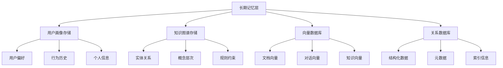

# 4.1.2 AGI记忆系统的分层架构设计

## 从理论框架到架构设计

在4.1.1节中，我们建立了上下文工程的理论基础，明确了上下文的三大构成要素（静态上下文、动态上下文、工具上下文）和面临的技术挑战。现在面临的关键问题是：**如何将这些理论概念转化为具体的系统架构？**

理论告诉我们需要管理海量的上下文信息，但工程实践中我们面临Token窗口的物理限制。这个矛盾的解决方案就是构建一个**智能的分层记忆系统**。

本节将借鉴人类认知科学的研究成果，设计一个仿生的三层记忆架构：
- **为什么选择分层架构？** - 认知科学基础和工程优势分析
- **如何设计三层结构？** - 工作记忆、短期记忆、长期记忆的功能定位
- **怎样实现数据流管理？** - 记忆写入、检索、更新的工程化实现

这个架构设计将为4.1.3节的工程实践提供具体的技术蓝图。

## 学习目标

- 掌握AGI应用记忆系统的层次化架构设计原则
- 理解不同记忆层次的功能定位与技术实现
- 学会设计符合业务需求的记忆系统架构
- 掌握记忆系统的数据流设计和管理策略

## 1. 记忆系统的认知科学基础

### 1.1 人类记忆系统的多层次模型

人类记忆系统经过数百万年的进化优化，形成了高效的多层次架构，这为AI记忆系统的设计提供了重要的理论基础和实践指导。

**Atkinson-Shiffrin模型**是认知心理学中最经典的记忆模型，将人类记忆分为三个主要组成部分：

1. **感觉记忆（Sensory Memory）**：短暂存储感知信息，持续时间仅为几毫秒到几秒
2. **短期记忆（Short-term Memory）**：临时存储和处理信息，容量有限（7±2项），持续时间15-30秒
3. **长期记忆（Long-term Memory）**：永久或半永久存储，容量几乎无限

现代认知科学进一步发展了这一模型，提出了**工作记忆（Working Memory）**的概念，强调了记忆系统的主动处理能力。

### 1.2 工作记忆、短期记忆、长期记忆的特征对比

| 记忆类型 | 容量 | 持续时间 | 主要功能 | 存储方式 |
|----------|------|----------|----------|----------|
| 工作记忆 | 3-5个项目单元 | 当前活动期间 | 信息处理与操作 | 激活状态的神经网络 |
| 短期记忆 | 7±2项 | 15-30秒 | 临时存储与维持 | 循环激活 |
| 长期记忆 | 几乎无限 | 数年到终生 | 知识存储与检索 | 结构化神经连接 |

### 1.3 AGI记忆系统的仿生设计原理

基于人类记忆系统的认知科学研究，AGI记忆系统的设计应该遵循以下仿生原理：

**分层处理原理**：不同类型的信息应该在不同的记忆层次中进行处理和存储。

**容量适配原理**：每一层记忆都应该有合适的容量限制，避免信息过载。

**时间衰减原理**：信息的重要性随时间衰减，需要建立有效的遗忘机制。

**关联检索原理**：通过语义关联和情境相似性进行信息检索。

## 2. 三层记忆架构的设计与实现

### 2.1 工作记忆层：当前对话上下文与活跃任务状态

工作记忆层是AGI系统的"思考空间"，负责处理当前正在进行的任务和对话。

**核心特征**：
- **容量有限**：类似人类工作记忆，容量严格受限（通常3-5个信息单元）
- **访问快速**：存储在最快的缓存层，支持实时访问和处理
- **动态更新**：随着任务进展实时更新内容
- **临时存储**：主要存储当前活跃的任务状态和对话上下文

**技术实现要点**：
- 通过`AgentContext`类管理当前会话状态
- 实施Token预算分配机制
- 建立紧急清理策略防止溢出
- 优先保留最关键的任务信息

### 2.2 短期记忆层：会话历史与临时知识缓存

短期记忆层桥接了工作记忆和长期记忆，负责维护会话级别的连续性。

**功能特征**：
- 存储当前会话的完整对话历史
- 缓存频繁访问的知识片段
- 维护用户偏好的临时记录
- 支持会话内的上下文传递

**技术实现**：

```java
public class Memory {
    private List<Message> messages = new ArrayList<>();
    private int maxSessionMessages = 50; // 会话最大消息数
    
    public void addMessage(Message message) {
        messages.add(message);
        // 实现滑动窗口机制
        if (messages.size() > maxSessionMessages) {
            // 保留系统消息和最近的用户消息
            compressOldMessages();
        }
    }
    
    private void compressOldMessages() {
        // 将旧消息压缩为摘要
        List<Message> oldMessages = messages.subList(0, messages.size()/2);
        String summary = generateSummary(oldMessages);
        
        // 替换旧消息为摘要消息
        messages.clear();
        messages.add(Message.systemMessage("Previous conversation summary: " + summary));
        messages.addAll(recentMessages);
    }
}
```

**缓存策略实现**：

```java
public class SessionCache {
    private final Map<String, Object> cache = new ConcurrentHashMap<>();
    private final long SESSION_TIMEOUT = 30 * 60 * 1000; // 30分钟超时
    
    public void cacheKnowledge(String key, Object knowledge) {
        cache.put(key, new CacheEntry(knowledge, System.currentTimeMillis()));
    }
    
    public Object retrieveKnowledge(String key) {
        CacheEntry entry = cache.get(key);
        if (entry != null && !entry.isExpired(SESSION_TIMEOUT)) {
            return entry.getValue();
        }
        return null;
    }
}
```

### 2.3 长期记忆层：持久化知识库与用户画像数据

长期记忆层是AGI系统的"知识宝库"，提供跨会话的持续性和个性化能力。

**功能特征**：
- 存储用户的长期偏好和行为模式
- 维护领域知识和专业信息
- 支持语义检索和关联推理
- 实现知识的增量学习和更新

**存储架构设计**：



**检索机制实现**：

在genie-tool项目中，通过向量检索实现长期记忆的语义检索：

```python
class LongTermMemory:
    def __init__(self):
        self.vector_store = VectorStore()
        self.knowledge_graph = KnowledgeGraph()
        
    async def store_knowledge(self, content: str, metadata: dict):
        """存储知识到长期记忆"""
        # 生成向量表示
        embedding = await self.generate_embedding(content)
        
        # 存储到向量数据库
        self.vector_store.add_document(
            content=content,
            embedding=embedding,
            metadata=metadata
        )
        
        # 更新知识图谱
        entities = self.extract_entities(content)
        self.knowledge_graph.add_entities(entities)
    
    async def retrieve_relevant_knowledge(self, query: str, top_k: int = 5):
        """检索相关知识"""
        query_embedding = await self.generate_embedding(query)
        
        # 向量相似度检索
        similar_docs = self.vector_store.similarity_search(
            query_embedding, 
            top_k=top_k
        )
        
        # 知识图谱推理
        related_entities = self.knowledge_graph.find_related(query)
        
        return self.merge_results(similar_docs, related_entities)
```

## 3. 记忆系统的数据流设计

### 3.1 记忆写入策略：选择性存储与优先级机制

记忆写入不应该是无差别的信息堆积，而应该是智能的、有选择性的过程。

**重要性评估算法**：

```java
public class MemoryImportanceEvaluator {
    
    public double calculateImportance(Message message, AgentContext context) {
        double importance = 0.0;
        
        // 基于消息类型的基础权重
        importance += getTypeWeight(message.getRole());
        
        // 基于内容语义的重要性
        importance += analyzeSemanticImportance(message.getContent());
        
        // 基于用户反馈的权重调整
        importance += getUserFeedbackWeight(message, context);
        
        // 基于时间衰减的权重
        importance *= getTimeDecayFactor(message.getTimestamp());
        
        return Math.min(importance, 1.0);
    }
    
    private double getTypeWeight(RoleType role) {
        switch (role) {
            case USER: return 0.8;      // 用户输入很重要
            case ASSISTANT: return 0.6;  // 系统响应中等重要
            case TOOL: return 0.4;       // 工具输出重要性较低
            case SYSTEM: return 0.9;     // 系统指令最重要
            default: return 0.1;
        }
    }
}
```

**选择性存储实现**：

```java
public void selectiveMemoryStorage(List<Message> messages) {
    for (Message message : messages) {
        double importance = evaluator.calculateImportance(message, context);
        
        if (importance > 0.7) {
            // 高重要性：存储到长期记忆
            longTermMemory.store(message);
        } else if (importance > 0.4) {
            // 中等重要性：保留在短期记忆
            shortTermMemory.store(message);
        } else {
            // 低重要性：仅在工作记忆中保留
            workingMemory.store(message);
        }
    }
}
```

### 3.2 记忆检索策略：语义检索与关联推理

有效的记忆检索需要结合多种策略，确保能够找到最相关的信息。

**多层次检索框架**：

```java
public class MemoryRetrieval {
    
    public List<Memory> retrieveRelevantMemories(String query, AgentContext context) {
        List<Memory> results = new ArrayList<>();
        
        // 1. 工作记忆直接匹配
        results.addAll(workingMemory.directMatch(query));
        
        // 2. 短期记忆语义搜索
        results.addAll(shortTermMemory.semanticSearch(query, 0.7));
        
        // 3. 长期记忆综合检索
        results.addAll(longTermMemory.comprehensiveSearch(query, context));
        
        // 4. 根据相关性重新排序
        return rankByRelevance(results, query, context);
    }
    
    private List<Memory> rankByRelevance(List<Memory> memories, String query, AgentContext context) {
        return memories.stream()
            .sorted((m1, m2) -> Double.compare(
                calculateRelevanceScore(m2, query, context),
                calculateRelevanceScore(m1, query, context)
            ))
            .collect(Collectors.toList());
    }
}
```

**语义检索实现（基于深度搜索工具）**：

```python
# 基于项目中的深度搜索实现
async def semantic_memory_search(query: str, memory_store: MemoryStore):
    """语义记忆搜索"""
    
    # 查询分解，提高检索精度
    sub_queries = await query_decompose(query)
    
    search_results = []
    for sub_query in sub_queries:
        # 向量相似度搜索
        similar_memories = await memory_store.similarity_search(
            query=sub_query,
            top_k=10,
            threshold=0.7
        )
        search_results.extend(similar_memories)
    
    # 去重和重新排序
    unique_results = remove_duplicates(search_results)
    return rank_by_semantic_relevance(unique_results, query)
```

### 3.3 记忆更新策略：增量学习与遗忘机制

记忆系统需要能够自适应地更新和遗忘，避免信息过载和知识陈旧。

**增量学习实现**：

```java
public class IncrementalLearning {
    
    public void updateMemoryWithNewKnowledge(Knowledge newKnowledge) {
        // 1. 检测知识冲突
        List<Knowledge> conflicts = detectConflicts(newKnowledge);
        
        if (conflicts.isEmpty()) {
            // 无冲突：直接添加
            memoryStore.add(newKnowledge);
        } else {
            // 有冲突：进行知识融合
            Knowledge mergedKnowledge = mergeKnowledge(newKnowledge, conflicts);
            memoryStore.update(mergedKnowledge);
            
            // 更新相关联的记忆
            updateRelatedMemories(mergedKnowledge);
        }
    }
    
    private Knowledge mergeKnowledge(Knowledge newKnowledge, List<Knowledge> conflicts) {
        // 基于置信度和时间戳的知识融合
        double newConfidence = newKnowledge.getConfidence();
        long newTimestamp = newKnowledge.getTimestamp();
        
        for (Knowledge conflict : conflicts) {
            if (newConfidence > conflict.getConfidence() || 
                newTimestamp > conflict.getTimestamp()) {
                // 新知识更可信或更新，替换旧知识
                return newKnowledge;
            }
        }
        
        // 否则保持现有知识，但更新访问时间
        return conflicts.get(0).updateAccessTime();
    }
}
```

**遗忘机制实现**：

```java
public class ForgettingMechanism {
    private static final double FORGETTING_CURVE_FACTOR = 0.5;
    
    public void applyForgetting() {
        long currentTime = System.currentTimeMillis();
        
        memoryStore.getAllMemories().forEach(memory -> {
            double timeElapsed = (currentTime - memory.getLastAccessed()) / (1000.0 * 60 * 60 * 24); // 天
            double forgettingFactor = Math.exp(-FORGETTING_CURVE_FACTOR * timeElapsed);
            
            // 更新记忆强度
            memory.setStrength(memory.getStrength() * forgettingFactor);
            
            // 移除过弱的记忆
            if (memory.getStrength() < 0.1) {
                memoryStore.remove(memory);
            }
        });
    }
    
    public void schedulePeriodicForgetting() {
        ScheduledExecutorService scheduler = Executors.newScheduledThreadPool(1);
        scheduler.scheduleAtFixedRate(this::applyForgetting, 0, 24, TimeUnit.HOURS);
    }
}
```

## 技术实践要点

### 架构设计最佳实践

1. **层次隔离**：确保不同记忆层之间的清晰边界，避免信息泄露
2. **异步处理**：长期记忆操作采用异步方式，避免影响实时响应
3. **容错机制**：建立记忆恢复和数据一致性保障机制
4. **性能优化**：合理使用缓存和索引，优化检索性能

### 常见设计陷阱及解决方案

1. **记忆爆炸问题**：设置合理的容量限制和清理策略
2. **检索精度问题**：结合多种检索策略，提高相关性判断
3. **一致性问题**：使用事务机制确保记忆更新的一致性
4. **隐私泄露问题**：实施数据脱敏和访问控制机制

## 本节小结

AGI记忆系统的分层架构设计是上下文工程的核心技术之一。通过借鉴人类认知科学的研究成果，建立工作记忆、短期记忆和长期记忆的三层架构，我们能够为AGI应用构建高效、智能的记忆系统。

关键在于理解每一层记忆的功能定位，实施合适的存储和检索策略，并建立有效的记忆管理机制。本节提供了完整的理论框架和技术实现方案，为记忆系统的工程化落地奠定了基础。

**下一步展望**：有了分层记忆架构的理论基础，我们需要解决实际工程实践中的具体问题。在下一节中，我们将深入探讨上下文管理的工程化实践，重点解决Token限制、信息选择、数据压缩、安全隔离等四大核心挑战，学习如何将理论架构转化为可落地的工程解决方案。