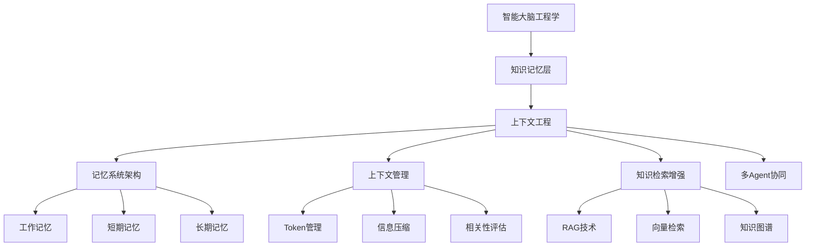

# 4.1.0 知识记忆层概述

## 从设计哲学到工程实践

在第三部分中，我们确立了AGI应用开发的核心设计哲学。现在，我们需要将这些理念转化为具体的工程技术。**智能大脑工程学**正是实现这一转化的技术体系，它包含四大核心层次：

1. **知识记忆层**（本章重点）- 构建AI的记忆与知识管理能力
2. **智能思考层** - 实现推理、规划与决策能力  
3. **工具扩展层** - 提供外部能力的调用与管理
4. **智能涌现层** - 实现系统级的智能涌现效应

## 知识记忆层与上下文工程的关系

**知识记忆层**是智能大脑工程学的基础设施层，而**上下文工程**是实现知识记忆层的核心技术手段。两者的关系可以理解为：

- **知识记忆层**：定义了"做什么"（What）- 为AGI应用提供记忆能力和知识运用能力
- **上下文工程**：定义了"怎么做"（How）- 通过工程化手段管理和优化上下文信息

## 知识记忆层（Knowledge Memory Layer）核心定义

**知识记忆层**是AGI应用架构中的核心认知基础设施层，负责构建和管理应用的全生命周期知识体系。它通过仿生人类记忆系统的分层架构设计，实现从即时工作记忆到长期知识存储的全覆盖智能记忆管理，为AGI应用提供类人的记忆能力和知识运用能力。

### 核心职责

知识记忆层承担着以下五大核心职责：

1. **知识存储管理**：统一管理系统的所有知识资源，包括领域知识库、历史经验、工具知识等
2. **上下文环境构建**：为智能思考层提供完整、准确、动态的信息环境
3. **记忆结构规划**：设计和维护多层次记忆架构，实现高效的信息组织
4. **知识记忆更新**：基于新的交互经验和反馈，持续更新和优化知识库内容
5. **记忆隔离保障**：确保不同用户、会话、任务间的记忆安全隔离

### 分层架构设计

知识记忆层采用三层记忆架构，对应人类认知科学中的记忆模型：

#### 1. 工作记忆系统（Working Memory）
- **功能定位**：当前活跃的思考空间，处理即时任务和对话上下文
- **存储内容**：当前会话状态、活跃任务信息、临时计算结果
- **技术特征**：容量有限、访问速度快、动态更新

#### 2. 短期记忆系统（Short-term Memory） 
- **功能定位**：会话级别的连续性维护，桥接工作记忆和长期记忆
- **存储内容**：对话历史记录、任务执行状态、临时变量缓存
- **技术特征**：滑动窗口机制、语义压缩、自动清理

#### 3. 长期记忆系统（Long-term Memory）
- **功能定位**：持久化知识存储，提供跨会话的知识积累
- **存储内容**：领域知识库、用户画像、历史经验模式、工具使用知识
- **技术特征**：几乎无限容量、语义检索、增量学习

### 核心技术能力

#### 1. 记忆管理器（Memory Manager）
- **知识索引**：建立高效的多维度知识检索机制
- **相关性评估**：智能判断知识与当前任务的相关程度
- **知识更新**：基于新经验和反馈持续优化知识库
- **遗忘机制**：实施时间衰减和重要性过滤的智能遗忘

#### 2. 上下文工程能力
- **动态上下文构建**：根据任务需求动态组装相关上下文信息
- **Token限制管理**：在模型窗口限制下优化信息选择和压缩
- **多模态融合**：统一处理文本、图像、结构化数据等多种信息类型
- **实时适配**：基于执行反馈动态调整上下文策略

#### 3. 检索增强机制
- **语义检索**：基于向量相似度的深度语义匹配
- **关联推理**：通过知识图谱实现概念间的关联推理
- **混合检索**：结合精确匹配、模糊匹配、语义匹配的综合检索策略

### 与其他层的协同关系

- **向上支撑智能思考层**：提供决策所需的知识基础和历史经验
- **横向协调工具扩展层**：管理工具使用的知识和执行历史
- **向下利用智能环境层**：在安全环境中进行知识处理和存储

### 本质意义

知识记忆层是AGI应用区别于传统AI应用的关键所在。它不仅是简单的数据存储，而是具备智能特征的认知基础设施，能够：

- **主动学习**：从每次交互中提取和积累知识
- **智能遗忘**：过滤无关信息，保持知识库的高质量
- **创造性关联**：通过知识的重新组合产生新的洞察
- **个性化适应**：根据用户特征和偏好调整知识服务

知识记忆层的存在使AGI应用具备了类人的记忆能力，能够在长期交互中不断学习、适应和进化，这正是智能涌现的重要基础。

## 本章学习路径

本章采用"理论→架构→实践→优化"的递进式学习路径，帮助您系统掌握上下文工程：

### 第一阶段：理论基础建立
**4.1.1 上下文工程的理论基础与技术架构**
- 🎯 学习目标：理解上下文工程的核心概念和技术特征
- 📚 核心内容：概念定义、构成要素、技术挑战
- 🔗 与前文关系：从概念概述深入到理论框架

### 第二阶段：架构设计深化  
**4.1.2 AGI记忆系统的分层架构设计**
- 🎯 学习目标：掌握三层记忆架构的设计原理
- 📚 核心内容：工作记忆、短期记忆、长期记忆的技术实现
- 🔗 与前文关系：将理论框架转化为具体架构

### 第三阶段：工程实践落地
**4.1.3 上下文管理的工程化实践**
- 🎯 学习目标：解决Token限制、信息选择等核心挑战
- 📚 核心内容：四大工程挑战的技术解决方案
- 🔗 与前文关系：将架构设计转化为可落地的工程方案

**4.1.4 检索增强生成(RAG)与上下文工程的深度融合**
- 🎯 学习目标：突破模型知识边界，实现动态上下文构建
- 📚 核心内容：RAG技术与记忆系统的集成设计
- 🔗 与前文关系：在工程实践基础上引入知识增强技术

### 第四阶段：系统优化提升
**4.1.5 多Agent系统的上下文协同机制**
- 🎯 学习目标：实现复杂多Agent环境下的上下文协同
- 📚 核心内容：分布式上下文管理和一致性保障
- 🔗 与前文关系：从单Agent扩展到多Agent协同场景

**4.1.6 上下文工程的性能优化与监控**
- 🎯 学习目标：建立全面的性能评估和监控体系
- 📚 核心内容：性能指标、优化策略、监控系统
- 🔗 与前文关系：为前面的技术方案提供性能保障

**4.1.7 企业级上下文工程的安全与合规**
- 🎯 学习目标：构建满足企业要求的安全合规框架
- 📚 核心内容：安全威胁防护、隐私保护、合规实现
- 🔗 与前文关系：为整个上下文工程体系提供安全保障

### 学习成果预期
完成本章学习后，您将能够：
- ✅ 设计符合业务需求的上下文工程架构
- ✅ 实现高效的记忆系统和上下文管理机制  
- ✅ 解决实际项目中的Token限制和性能优化问题
- ✅ 构建安全可靠的企业级上下文系统

**下一步展望**：建立了知识记忆层的整体认知后，我们将在4.1.1节中深入理论基础，学习上下文工程与传统提示工程的本质区别，以及如何构建系统性的上下文管理框架。
