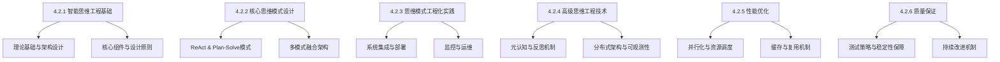

# 4.2.6 思维工程的质量保证

> "质量是智能思维系统的生命线。在AGI应用开发中，思维质量的保证不仅关乎系统的可靠性，更直接影响着用户体验和业务价值的实现。"

## 本章在整体学习路径中的意义

经过前面章节的学习，我们已经掌握了构建智能思维系统的完整知识体系：
- **4.2.1**：理论基础和架构设计
- **4.2.2**：核心思维模式设计
- **4.2.3**：工程化实践方法
- **4.2.4**：高级技术应用
- **4.2.5**：性能优化策略

现在我们需要解决最后一个关键问题：**如何确保构建的智能思维系统在生产环境中稳定可靠地运行？**

本章将探讨智能思维系统的质量保证体系，这是系统从实验室走向生产环境的最后一道关键防线。

## 学习目标

- 理解智能思维系统质量保证的特殊挑战
- 掌握适应性测试策略的设计方法
- 学会构建稳定性保障机制
- 了解持续改进的质量管理体系

### 质量保证的重要性

智能思维系统的质量保证具有独特的复杂性和挑战性：

**不确定性带来的挑战**
- 大语言模型输出的非确定性特征
- 思维过程的动态性和适应性
- 多智能体协作中的涌现行为

**传统质量保证方法的局限性**
- 传统测试方法难以应对智能系统的主观性输出
- 静态的质量标准无法适应动态的思维过程
- 确定性的验证手段与不确定性的系统特性存在根本冲突

**业务价值与用户体验的直接关联**
- 思维质量直接影响决策的准确性
- 系统稳定性关乎用户信任度
- 质量问题可能导致不可预测的业务风险

### 质量保证的核心维度

本章将从两个关键维度来构建完整的质量保证体系：

#### 4.2.6.1 思维过程的测试策略

测试是质量保证的第一道防线。针对智能思维系统的特殊性，我们将探讨：

- **适应性测试方法**：如何为非确定性系统设计有效的测试策略
- **多维度质量评估**：从准确性、一致性、鲁棒性等角度全面评估思维质量
- **自动化测试体系**：构建能够持续验证思维系统质量的自动化测试流水线
- **场景化测试设计**：针对不同应用场景设计专门的测试用例和评估标准

#### 4.2.6.2 思维系统的稳定性保障

稳定性是生产环境运行的基石。我们将深入研究：

- **容错机制设计**：如何在面对各种异常情况时保持系统的可用性
- **优雅降级策略**：在系统压力过大或部分功能故障时的应对方案
- **故障检测与恢复**：快速识别问题并自动恢复的技术实现
- **高可用架构模式**：从系统架构层面保障服务的持续可用性

## 本章要点总结

1. **质量挑战**：智能思维系统面临不确定性、传统方法局限性等独特质量挑战
2. **测试策略**：需要设计适应非确定性系统特点的测试方法和评估标准
3. **稳定性保障**：通过容错设计、优雅降级、故障恢复等机制保障系统稳定运行
4. **持续改进**：建立基于数据驱动的质量监控和持续改进机制
5. **全生命周期管理**：从设计、开发、测试到部署运维的全流程质量保证

## 4.2章节总结：智能思维工程的完整体系

通过本章六个小节的学习，我们构建了智能思维工程的完整知识体系：

### 知识体系回顾

### 核心价值与意义

**智能思维工程**作为AGI应用的核心技术，其价值体现在：

1. **认知能力工程化**：将人类认知过程转化为可工程化实现的计算模型
2. **智能决策中心**：为AGI应用提供类人的思考、推理和决策能力
3. **系统架构核心**：在AGI应用分层架构中承担智能决策和控制的核心职责
4. **技术创新基础**：为智能涌现现象提供技术基础和实现路径

### 实践应用指导

基于本章学习内容，在实际项目中应用智能思维工程技术时，建议遵循以下路径：

#### 第一阶段：基础建设
1. **架构设计**：基于4.2.1的理论基础设计系统架构
2. **模式选择**：根据4.2.2的指导选择合适的思维模式
3. **基础实现**：参考4.2.3的工程化实践进行系统实现

#### 第二阶段：能力提升
1. **高级技术**：根据需要引入4.2.4的高级技术
2. **性能优化**：应用4.2.5的优化策略提升系统性能
3. **质量保障**：建立4.2.6的质量保证体系

#### 第三阶段：持续演进
1. **监控反馈**：建立完善的监控和反馈机制
2. **持续优化**：基于实际运行数据持续优化系统
3. **技术创新**：探索新的思维模式和优化技术

### 未来发展趋势

智能思维工程作为前沿技术领域，未来发展趋势包括：

1. **更强的自适应能力**：系统将具备更强的环境适应和自我优化能力
2. **更深的认知层次**：从当前的浅层认知向深层认知和元认知发展
3. **更广的应用场景**：从特定领域向通用问题解决能力扩展
4. **更高的工程化水平**：标准化、模块化程度进一步提升

## 下一步学习建议

完成智能思维工程的学习后，建议继续深入以下相关领域：

- **第五部分：核心进化**：深入理解智能涌现和智能态势感知
- **实践项目**：选择一个具体场景实践应用智能思维工程技术
- **技术跟踪**：持续关注该领域的最新技术发展和研究成果

---

