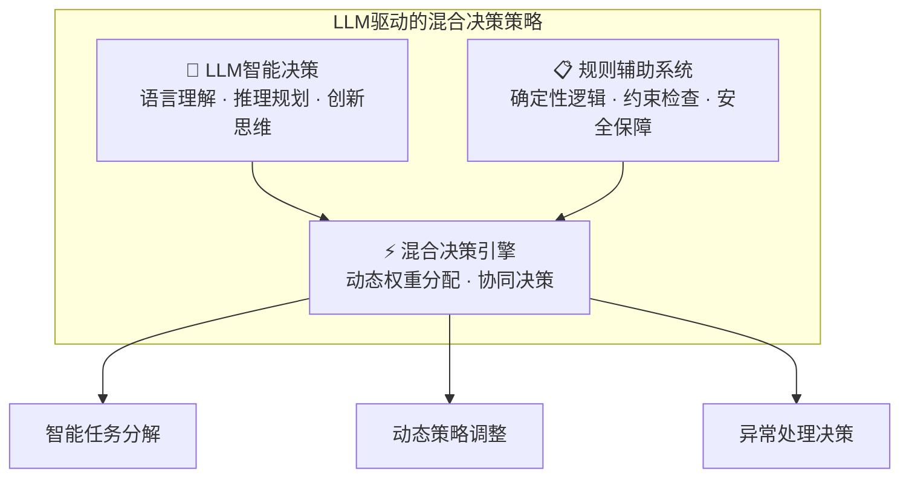

# 智能思维层

## 智能思维层概念定义

**智能思维层（Intelligence Thinking Layer）** 是AGI应用架构中的核心控制层，作为系统的智能决策中心，基于LLM驱动的智能决策架构，形成LLM智能决策与规则辅助的混合策略，负责决策控制、状态管理、任务执行控制等核心逻辑，通过感知、推理、规划、执行和反思等核心思维模块的有机协作，实现对复杂任务的自主理解、动态决策和智能执行控制。

**核心职责**： 作为系统的智能决策中心，基于LLM驱动的智能决策架构，形成LLM智能决策与规则辅助的混合策略，负责决策控制、状态管理、任务执行控制等核心逻辑。

### LLM驱动的混合策略架构

智能思维层采用LLM驱动的混合决策策略，将大语言模型的智能决策能力与规则系统的确定性逻辑相结合：

**LLM驱动特性**：
- **🧠 智能理解**：基于大语言模型的深度语义理解能力
- **🎯 灵活决策**：适应复杂多变场景的智能决策能力  
- **🔄 自主学习**：通过交互反馈持续优化决策质量
- **⚖️ 平衡策略**：LLM创新性与规则确定性的最优平衡

### 核心特征

1. **认知过程工程化**：将人类解决复杂问题时的思维过程（理解→分析→规划→执行→反思）转化为软件系统可执行的计算模型

2. **多模式思维融合**：集成ReAct（边思考边行动）、Plan-Solve（先规划后执行）等多种思维模式，能够根据任务特征智能选择或动态切换思维策略

3. **分层认知架构**：采用战略层（整体目标理解）、战术层（任务分解规划）、操作层（具体执行控制）的分层设计，实现不同抽象级别的智能决策

4. **自适应学习能力**：具备元认知和反思机制，能够评估自身思维过程的质量，从执行结果中学习并优化后续决策策略

5. **动态编排控制**：根据任务复杂度和执行状态，动态选择和编排下层的智能体、工具和资源，实现智能化的任务执行控制

### 主要组件

- **任务分析引擎**：基于LLM的任务理解、语义解析和复杂度评估能力
  - 任务语义解析：理解用户意图和任务要求
  - 复杂度评估：评估任务的难度和所需资源
  - 子任务识别：将复杂任务分解为可执行的子任务序列
- **智能体编排器**：动态选择和组合智能体
  - 能力匹配：根据任务需求匹配合适的智能体
  - 协作策略：设计多智能体的协作模式
  - 执行监控：实时监控任务执行状态
- **决策控制器**：执行策略制定和调整
  - 策略生成：基于当前状态生成执行策略
  - 异常处理：处理执行过程中的异常情况
  - 自适应调整：根据反馈优化执行策略
- **决策控制器**：策略生成、异常处理和自适应调整机制
- **思维模式管理器**：维护多种思维模式，实现智能选择和动态切换
- **执行协调器**：协调思维过程与行动执行，管理状态迁移和数据流

### 本质意义

智能思维层是AGI应用区别于传统AI应用的核心所在，它不仅仅是简单的逻辑控制层，而是具备类人认知能力的智能大脑。通过工程化实现人类的思维过程，该层使AGI应用具备了自主思考、动态决策和创造性问题解决的能力，是实现智能涌现的重要基础。

这一层的存在，让AGI应用能够像人类一样"思考"问题，而不仅仅是执行预定义的程序逻辑，这正是通向真正智能化应用的关键一步。