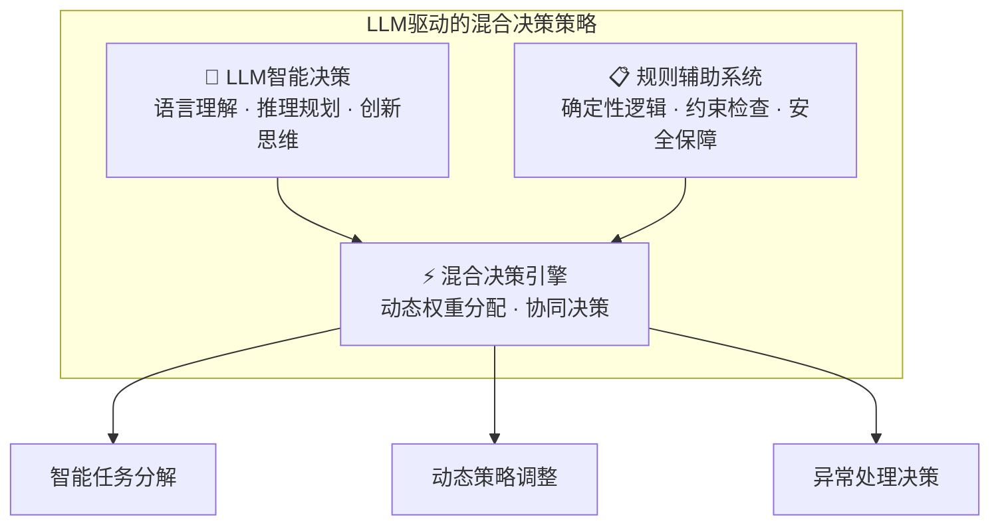

# 4.2.0 智能思考层概述

> "智能思考层是AGI应用的智能大脑，它将人类的认知过程转化为可工程化实现的计算模型，是实现真正智能化应用的核心基础。"

## 章节导读

本章节将全面探讨智能思考工程的理论基础、设计原理、实现方法和工程实践。在深入学习具体技术之前，让我们首先理解智能思考层的核心概念和本质意义。

**本概述的作用**：
- 为整个4.2章节建立概念基础
- 帮助读者理解智能思考层的核心价值
- 建立与后续技术章节的逻辑联系

**章节结构预览**：
- **4.2.1** 智能思考工程基础 - 工程化理论与整体架构
- **4.2.2** 主流思维模式设计 - ReAct、Plan-Solve等思维模式
- **4.2.3** 智能思考的工程化实践 - 实际部署与运维
- **4.2.4** 高级思考工程技术 - 元认知、分布式等高级主题

## 智能思考层概念定义

**智能思考层（Intelligence Thinking Layer）** AGI应用架构中的核心控制层，作为系统的智能决策中心，基于大语言模型驱动，形成LLM智能决策与规则辅助的混合策略，负责将类人思考过程转化为可工程化实现的计算模型。

**核心职责**： 作为系统的智能决策中心，负责决策控制、状态管理、任务执行控制等核心逻辑，通过感知、推理、规划、执行和反思等核心思维模块的有机协作，实现对复杂任务的自主理解、动态决策和智能执行控制。

### LLM驱动的混合策略架构

智能思考层采用LLM驱动的混合决策策略，将大语言模型的智能决策能力与规则系统的确定性逻辑相结合：

**LLM驱动特性**：
- **🧠 智能理解**：基于大语言模型的深度语义理解能力
- **🎯 灵活决策**：适应复杂多变场景的智能决策能力  
- **🔄 自主学习**：通过交互反馈持续优化决策质量
- **⚖️ 平衡策略**：LLM创新性与规则确定性的最优平衡

### 核心特征

1. **思考过程工程化**：将人类解决复杂问题时的思考过程（理解→分析→规划→执行→反思）转化为软件系统可执行的计算模型

2. **多模式思维融合**：集成ReAct（边思考边行动）、Plan-Solve（先规划后执行）等多种思维模式，能够根据任务特征智能选择或动态切换思维策略

3. **分层认知架构**：采用战略层（整体目标理解）、战术层（任务分解规划）、操作层（具体执行控制）的分层设计，实现不同抽象级别的智能决策

4. **自适应学习能力**：具备元认知和反思机制，能够评估自身思维过程的质量，从执行结果中学习并优化后续决策策略

5. **动态编排控制**：根据任务复杂度和执行状态，动态选择和编排下层的智能体、工具和资源，实现智能化的任务执行控制

### 主要组件

- **任务分析引擎**：基于LLM的任务理解、语义解析和复杂度评估能力
  - 任务语义解析：理解用户意图和任务要求
  - 复杂度评估：评估任务的难度和所需资源
  - 子任务识别：将复杂任务分解为可执行的子任务序列
- **智能体编排器**：动态选择和组合智能体
  - 能力匹配：根据任务需求匹配合适的智能体
  - 协作策略：设计多智能体的协作模式
  - 执行监控：实时监控任务执行状态
- **决策控制器**：执行策略制定和调整
  - 策略生成：基于当前状态生成执行策略
  - 异常处理：处理执行过程中的异常情况
  - 自适应调整：根据反馈优化执行策略
- **思维模式管理器**：维护多种思维模式，实现智能选择和动态切换
- **执行协调器**：协调思维过程与行动执行，管理状态迁移和数据流

### 本质意义

智能思考层是AGI应用区别于传统AI应用的核心所在，它不仅仅是简单的逻辑控制层，而是具备类人认知能力的智能大脑。通过工程化实现人类的思考过程，该层使AGI应用具备了自主思考、动态决策和创造性问题解决的能力，是实现智能涌现的重要基础。

这一层的存在，让AGI应用能够像人类一样"思考"问题，而不仅仅是执行预定义的程序逻辑，这正是通向真正智能化应用的关键一步。

## 下一步学习指引

在理解了智能思考层的核心概念后，我们将在接下来的章节中深入探讨：

1. **如何工程化实现**：在4.2.1中学习智能思考工程的理论基础和整体架构设计
2. **具体思维模式**：在4.2.2中掌握ReAct、Plan-Solve等主流思维模式的设计与实现
3. **实践部署**：在4.2.3中了解智能思考系统的工程化实践和运维经验
4. **高级技术**：在4.2.4中探索元认知、分布式思考等前沿技术

让我们开始这个激动人心的智能思考工程之旅！