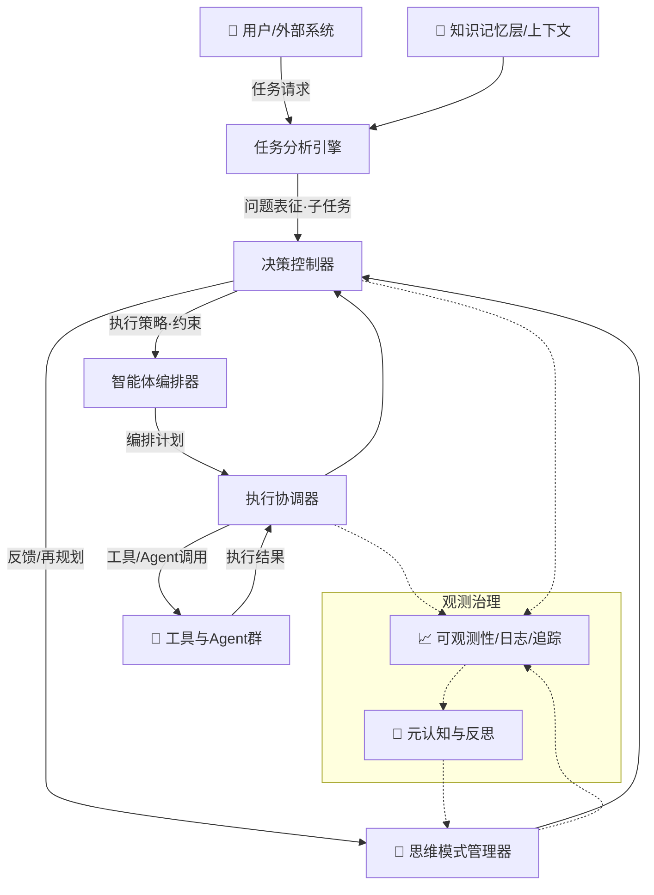
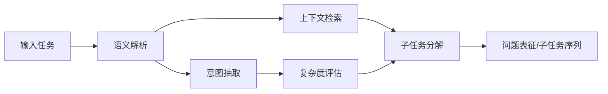

# 4.2.1.1 智能思考系统核心组件详解

> 本小节在4.2整体框架之下，面向工程实现细化六大核心组件：任务分析引擎、智能体编排器、决策控制器、思维模式管理器、执行协调器，以及最终的集成与部署方法。内容遵循“LLM智能 + 规则约束”的混合策略与分层认知架构原则。

## 1. 组件架构总览

### 1.1 组件关系图



### 1.2 数据流向分析（端到端）

1) **输入阶段**：用户/外部系统提交任务 → 任务分析引擎（TAE）进行语义理解、复杂度评估、子任务分解，并拉取知识记忆层/上下文（KM）。

2) **决策阶段**：决策控制器（DC）结合思维模式管理器（MM）给出的思维模式与规则约束，生成混合策略（含约束与风险评分）。

3) **编排阶段**：智能体编排器（AO）依据策略与能力矩阵，选取/组合合适的Agent与工具，形成执行计划（含负载与容错策略）。

4) **执行阶段**：执行协调器（EC）以状态机/DAG调度方式执行计划，进行并发控制、状态管理、异常处理与结果整合。

5) **反馈阶段**：执行结果回流决策控制器（DC）与思维模式管理器（MM），触发再规划/切换模式/早停；可观测性系统（OBS）沉淀指标、日志与追踪，元认知与反思系统（META）进行反思与策略改进。

### 1.3 接口设计规范（关键抽象）

```java
// 请求/上下文
public record ThinkingRequest(String task, Map<String, Object> context, ThinkingPreferences preferences) {}
public record TaskCharacteristics(double complexity, double uncertainty, String domain) {}
public record SubTask(String id, String description, Map<String, Object> inputs) {}

// 模式/策略/决策
public enum ThinkingMode { REACT, PLAN_SOLVE, MULTI_MODE }
public record Strategy(String id, ThinkingMode mode, Map<String, Object> constraints) {}
public record Decision(String id, Strategy strategy, List<SubTask> plan, RiskReport risk) {}
public record RiskReport(double score, List<String> risks, List<String> mitigations) {}

// 编排与执行
public record OrchestrationPlan(List<AssignedUnit> assignments, Map<String, Object> policies) {}
public record AssignedUnit(String subTaskId, String agentId, Map<String, Object> params) {}
public record ExecutionResult(boolean success, Object output, Map<String, Object> metrics) {}
```

工程约定：
- 输入输出采用强类型数据结构；所有组件实现幂等接口；关键路径提供可观测性埋点；错误统一为语义化错误码与分层异常。

---

## 2. 任务分析引擎详解（Task Analysis Engine）

### 2.1 架构设计

- 子模块：语义解析器（NLU自然语言理解）、复杂度评估器、子任务分解器（HTN分层任务网络/LLM混合）、意图抽取器、上下文检索器（RAG检索增强生成）。
- 交互：读取知识记忆层（KM）的知识/记忆；产出任务特征（TaskCharacteristics）与子任务（SubTask）队列供决策控制器（DC）使用。



### 2.2 核心算法

- 复杂度评估：基于特征工程与LLM评审的混合打分，形成`complexity ∈ [0,1]`与`uncertainty ∈ [0,1]`。
- 子任务分解：采用HTN（分层任务网络）启发式＋LLM生成的候选方案，使用一致性约束与重复检测去重，输出最小可执行集。
- 上下文对齐：对每个子任务进行检索增强生成（RAG），生成最小充分上下文切片与来源引用以支撑可解释性。

### 2.3 实现示例（伪代码）

```java
TaskCharacteristics analyzeTask(ThinkingRequest req) {
  var nlu = nluParser.parse(req.task());
  var intent = intentExtractor.extract(nlu);
  var cx = contextRetriever.retrieve(intent, req.context());
  double complexity = complexityScorer.score(nlu, cx);
  double uncertainty = uncertaintyEstimator.estimate(nlu, cx);
  return new TaskCharacteristics(complexity, uncertainty, domainDetector.detect(nlu));
}

List<SubTask> decompose(TaskCharacteristics tc, ThinkingRequest req) {
  var seeds = htnHeuristics.seed(req.task(), tc);
  var llmPlans = llmPlanner.propose(req.task(), tc, seeds);
  var merged = planMerger.mergeAndDedup(llmPlans);
  return constraintValidator.prune(merged, req.preferences());
}
```

### 2.4 性能优化

- 语义缓存：对相似任务启用语义缓存与结果适配（阈值可配）。
- 早停策略：当分解增益低于阈值或复杂度低时，直接走轻量流程（REACT）。
- RAG（检索增强生成）裁剪：限制上下文切片长度与来源数，优先权重高可信来源。

---

## 3. 智能体编排器详解（Agent Orchestrator）

### 3.1 编排策略

- 能力匹配：基于能力矩阵（技能、质量、成本、延迟、合规域），对子任务（SubTask）进行多目标匹配与排序。
- 协作模式：单体、流水线、并行竞赛（self-consistency/majority vote）、层级汇总（Hierarchical）。
- 策略输入：继承决策对象（Decision.strategy）中的约束（如工具白名单、Token预算、超时、重试策略）。

### 3.2 负载均衡

- 维度：LLM吞吐/配额、CPU/内存、队列长度、热点Agent利用率。
- 策略：加权最少连接＋亲和性（数据/区域/模型版本）；冷启动预热；请求批量化与去重。

### 3.3 故障处理

- 重试与退避：可配置指数退避与抖动；语义相同重放需携带幂等键。
- 熔断与降级：对异常Agent熔断，回退到次优策略或替代工具；强制切换思维模式（由思维模式管理器MM触发）。
- 任务重调度：失败分区迁移至健康节点；保持因果顺序与上下文一致。

### 3.4 监控机制

- 指标：队列等待时延、执行成败率、Token/成本、SLA（服务级别协议）违约、编排命中率。
- 追踪：子任务级Span，记录分配/开始/结束/错误与重试链路。

---

## 4. 决策控制器详解（Decision Controller）

### 4.1 决策算法（LLM + 规则的混合）

- 候选生成：LLM基于任务特征（TaskCharacteristics）与上下文生成多个策略候选（含模式、约束与执行骨架）。
- 规则裁剪：业务规则/安全约束/资源边界对候选进行硬约束过滤。
- 评分与选择：综合质量预测、成本/时延、风险评分，采用多目标加权或Pareto最优选择。

### 4.2 风险评估

- 维度：合规（语料/输出）、安全（Prompt注入/数据外泄）、成本、时延、故障传播。
- 手段：规则库+分类器+LLM评审混合，输出`RiskReport`并附缓解措施（限制工具、缩短上下文、启用审查）。

### 4.3 混合策略实现

- 约束层：显式约束以合同式编程（Design by Contract）嵌入策略与执行器之间。
- 监督层：引入哨兵模型进行输出审核/自检；对高风险分支启用“双读一致”或多人投票。

### 4.4 可解释性设计

- 决策摘要：生成自然语言`why/how/what-if`说明，标注关键证据与来源。
- 决策轨迹：保留候选、裁剪理由、评分细节与最终选择，可用于审计与回放。

---

## 5. 思维模式管理器详解（Thinking Mode Manager）

### 5.1 模式注册机制

- 登记表：`mode -> {特征向量, 适用域, 成本模型, 预热参数}`，支持热插拔与灰度开关。
- 兼容性：不同模型/版本/代理实现以统一`ThinkingModeImplementation`接口对接。

### 5.2 动态切换算法

- 触发：问题特征变化、性能退化、预算压力、风险上升、故障降级。
- 决策：基于历史绩效加权的性价比评分＋切换滞后（hysteresis）以避免抖动。

### 5.3 性能监控

- 维度：质量分数、响应时间分位、成本/Token、成功率、重试率、用户满意度。
- 方法：A/B测试与多臂老虎机（MAB）进行在线探索—利用权衡。

### 5.4 扩展性设计

- 新模式接入：实现接口→注册元数据→配置守护/预热→纳入选择器与可观测性。

---

## 6. 执行协调器详解（Execution Coordinator）

### 6.1 状态管理

- 统一状态机：将思维/执行过程建模为FSM（有限状态机）或DAG（有向无环图）运行图，节点状态含`PENDING/RUNNING/PAUSED/FAILED/SUCCEEDED`。
- 上下文一致：执行中维护会话上下文、工具中间态与检查点（checkpoint），支持断点续执与回滚补偿。

### 6.2 并发控制

- 调度：拓扑排序+优先级队列，结合资源配额与背压（backpressure）。
- 合并：相似子任务批处理；相同外部请求共用结果。

### 6.3 结果整合

- 策略：多数投票（majority vote）、加权RRF（倒数排名融合）、置信集成（confidence-weighted）、规则后处理。
- 质量门：对整合结果执行自动化验证（结构/约束/内容安全），不达标触发再规划或降级。

### 6.4 异常处理

- 分类：可重试/不可重试/语义错误/外部依赖错误；对应不同恢复策略与告警级别。
- 观测：为每个异常埋点错误码与根因标签，沉淀运行手册（runbook）。

---

## 7. 组件集成与部署

### 7.1 集成架构

- 形态：单体模块化 or 微服务化（推荐将执行协调器EC/可观测性系统OBS重用为平台级服务，智能体编排器AO/决策控制器DC按域拆分）。
- 通信：同步（低延迟）+异步（事件总线/队列）混合；支持流式输出与中断控制。

### 7.2 部署策略

- 容器化与Kubernetes编排，按模式/模型版本分池；HPA（水平Pod自动扩缩容）基于QPS/Token与延迟。
- 金丝雀与灰度：对新策略/新模式/新Agent先小流量验证，联动熔断与快速回滚。

### 7.3 运维监控

- SLO：质量≥阈值、P95延迟、成本预算、错误率；看板纳入模式/策略维度切片。
- 告警：基于阈值+异常检测（见4.2.4.3），结合自愈编排（重启/迁移/降级）。

### 7.4 故障排查（实务清单）

- 检查链路：请求→任务分析引擎（TAE）→决策控制器（DC）→智能体编排器（AO）→执行协调器（EC）→工具/Agent→回流→整合。
- 快速定位：利用Trace查关键路径；看重试风暴/熔断状态；核对约束与权限。
- 常见问题：上下文漂移、模式抖动、编排热点、缓存污染、预算超限、Prompt注入。

---

### 小结

本节将智能思考层的六大核心组件工程化落地，给出端到端数据流、关键接口与算法要点，并对可靠性、可观测性与可扩展性提出实践规范。结合4.2.2的思维模式与4.2.3的工程实践、4.2.4的高级技术，可支撑企业级AGI应用在复杂多变场景中的稳定演进。