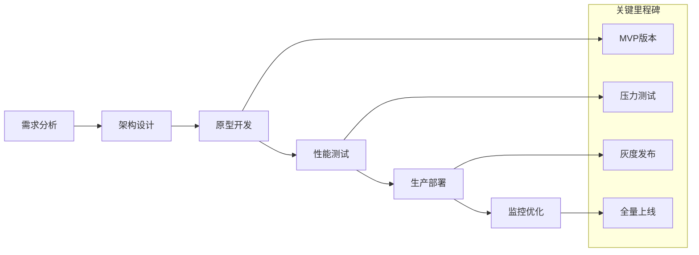
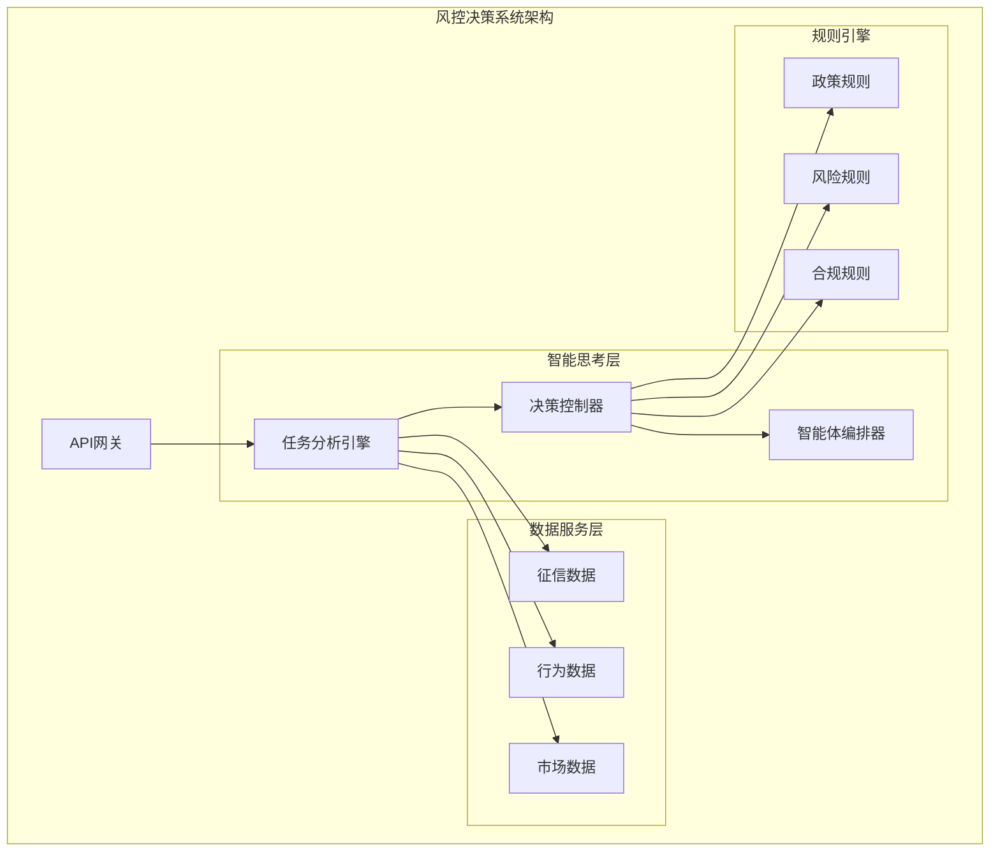
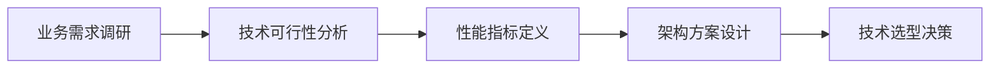

# 4.2.4 智能思考的工程化实践

> "理论指导实践，实践验证理论。智能思考工程的真正价值在于其在实际项目中的成功应用和持续优化。"

## 本章与前章的关系

在前面的章节中，我们已经建立了完整的技术基础：
- **4.2.1**：智能思考工程的理论基础和整体架构
- **4.2.2**：核心组件的设计原理和接口规范  
- **4.2.3**：主流思维模式的设计与实现

现在我们需要将这些理论知识转化为实际的工程实践。本章将重点关注**如何在生产环境中实现、部署和运维智能思考系统**。

## 本章导读

本章是理论与实践的桥梁，将为您提供：
- **开发流程指导**：从设计到部署的完整开发流程
- **实际应用案例**：真实项目中的应用经验和教训
- **性能调优策略**：系统优化和监控的最佳实践
- **运维管理方法**：生产环境的稳定运行保障

**适用读者**：
- 架构师：关注整体实施策略和技术选型
- 开发工程师：重点学习具体实现和调优技术
- 运维工程师：专注部署和监控运维方法

## 学习目标

- 掌握不同思维模式在实际项目中的应用方法
- 理解思维模式选择和切换的工程化实现
- 学会构建可扩展的思维模式管理架构
- 了解思维模式的性能调优和监控技术

## 从理论到实践的转化挑战

将思维模式从概念设计转化为可运行的系统面临以下挑战：

### 1. 复杂性管理
- 多种思维模式的统一管理
- 动态切换的状态一致性保障
- 并发执行的资源协调

### 2. 性能要求
- 实时响应的性能约束
- 大规模并发的处理能力
- 资源使用的优化需求

### 3. 可靠性保障
- 生产环境的稳定性要求
- 异常情况的优雅处理
- 系统监控和故障恢复

## 工程化实践架构

### 思维模式管理框架

```java
/**
 * 思维模式管理器 - 统一管理所有思维模式
 */
@Component
public class ThinkingModeManager {
    
    private final Map<ThinkingMode, ThinkingModeImplementation> modeImplementations;
    private final ModeSelectionStrategy selectionStrategy;
    private final PerformanceMonitor performanceMonitor;
    private final ConfigurationManager configManager;
    
    @PostConstruct
    public void initializeModes() {
        // 注册所有支持的思维模式
        modeImplementations.put(ThinkingMode.REACT, new ReActModeImplementation());
        modeImplementations.put(ThinkingMode.PLAN_SOLVE, new PlanSolveModeImplementation());
        modeImplementations.put(ThinkingMode.MULTI_MODE, new MultiModeModeImplementation());
        
        // 加载配置
        loadModeConfigurations();
        
        // 启动性能监控
        performanceMonitor.startMonitoring();
    }
    
    /**
     * 执行思维任务的统一入口
     */
    public CompletableFuture<ThinkingResult> executeThinking(ThinkingRequest request) {
        return CompletableFuture.supplyAsync(() -> {
            try {
                // 1. 分析任务特征
                TaskCharacteristics characteristics = analyzeTask(request);
                
                // 2. 选择最适合的思维模式
                ThinkingMode selectedMode = selectionStrategy.selectMode(characteristics);
                
                // 3. 获取模式实现
                ThinkingModeImplementation implementation = modeImplementations.get(selectedMode);
                
                // 4. 执行思维过程
                ThinkingExecution execution = new ThinkingExecution(request, selectedMode);
                execution.start();
                
                ThinkingResult result = implementation.execute(request, execution);
                
                // 5. 记录性能数据
                performanceMonitor.recordExecution(execution, result);
                
                // 6. 更新选择策略
                selectionStrategy.updateFromResult(characteristics, selectedMode, result);
                
                return result;
                
            } catch (Exception e) {
                log.error("Thinking execution failed", e);
                return ThinkingResult.error(e);
            }
        });
    }
    
    /**
     * 动态添加新的思维模式
     */
    public void registerMode(ThinkingMode mode, ThinkingModeImplementation implementation) {
        modeImplementations.put(mode, implementation);
        log.info("Registered new thinking mode: {}", mode);
    }
}
```

### 统一的思维模式接口

```java
/**
 * 思维模式实现的统一接口
 */
public interface ThinkingModeImplementation {
    
    /**
     * 执行思维过程
     */
    ThinkingResult execute(ThinkingRequest request, ThinkingExecution execution);
    
    /**
     * 获取模式特征
     */
    ModeCharacteristics getCharacteristics();
    
    /**
     * 配置模式参数
     */
    void configure(ModeConfiguration configuration);
    
    /**
     * 预热模式（可选）
     */
    default void warmup() {
        // 默认不需要预热
    }
    
    /**
     * 清理资源
     */
    default void cleanup() {
        // 默认不需要清理
    }
}
```

## 实际应用场景分析

### 1. 客户服务场景

**场景描述**：智能客服系统需要处理各种类型的客户咨询

```java
/**
 * 客服场景的思维模式应用
 */
@Service
public class CustomerServiceThinkingService {
    
    private final ThinkingModeManager modeManager;
    private final CustomerContextAnalyzer contextAnalyzer;
    
    public CustomerServiceResponse handleInquiry(CustomerInquiry inquiry) {
        // 1. 分析客户咨询类型
        InquiryType type = contextAnalyzer.classifyInquiry(inquiry);
        
        ThinkingRequest request = ThinkingRequest.builder()
                .query(inquiry.getContent())
                .context(buildContext(inquiry))
                .preferences(getPreferences(type))
                .build();
        
        // 2. 根据咨询类型选择思维模式
        switch (type) {
            case SIMPLE_FAQ:
                // 简单FAQ：使用ReAct模式快速响应
                request = request.withPreferredMode(ThinkingMode.REACT)
                               .withMaxSteps(3)
                               .withTimeout(Duration.ofSeconds(10));
                break;
                
            case COMPLEX_PROBLEM:
                // 复杂问题：使用Plan-Solve模式深度分析
                request = request.withPreferredMode(ThinkingMode.PLAN_SOLVE)
                               .withMaxSteps(10)
                               .withTimeout(Duration.ofMinutes(2));
                break;
                
            case MULTI_DOMAIN:
                // 跨域问题：使用Multi-Mode模式
                request = request.withPreferredMode(ThinkingMode.MULTI_MODE)
                               .withTimeout(Duration.ofMinutes(1));
                break;
        }
        
        // 3. 执行思维过程
        ThinkingResult result = modeManager.executeThinking(request).join();
        
        // 4. 转换为客服响应
        return convertToCustomerResponse(result, inquiry);
    }
    
    private ThinkingPreferences getPreferences(InquiryType type) {
        return ThinkingPreferences.builder()
                .prioritizeSpeed(type == InquiryType.SIMPLE_FAQ)
                .prioritizeAccuracy(type == InquiryType.COMPLEX_PROBLEM)
                .allowMultipleTools(type != InquiryType.SIMPLE_FAQ)
                .build();
    }
}
```

### 2. 数据分析场景

**场景描述**：商业智能系统需要分析复杂的业务数据

```java
/**
 * 数据分析场景的思维模式应用
 */
@Service
public class DataAnalysisThinkingService {
    
    private final ThinkingModeManager modeManager;
    private final DataComplexityAnalyzer complexityAnalyzer;
    
    public AnalysisReport analyzeData(DataAnalysisRequest request) {
        // 1. 分析数据复杂度
        DataComplexity complexity = complexityAnalyzer.analyze(request.getDataset());
        
        ThinkingRequest thinkingRequest = ThinkingRequest.builder()
                .query(request.getAnalysisGoal())
                .context(buildAnalysisContext(request, complexity))
                .build();
        
        // 2. 根据数据复杂度选择策略
        if (complexity.isHighDimensional() || complexity.hasMultipleDataSources()) {
            // 高维或多源数据：使用Plan-Solve进行系统性分析
            thinkingRequest = thinkingRequest
                    .withPreferredMode(ThinkingMode.PLAN_SOLVE)
                    .withToolFilter(tool -> tool.getCategory() == ToolCategory.DATA_ANALYSIS)
                    .withTimeout(Duration.ofMinutes(10));
                    
        } else if (complexity.isRealTime()) {
            // 实时数据：使用ReAct快速响应
            thinkingRequest = thinkingRequest
                    .withPreferredMode(ThinkingMode.REACT)
                    .withMaxSteps(5)
                    .withTimeout(Duration.ofSeconds(30));
                    
        } else {
            // 标准分析：使用Multi-Mode平衡质量和速度
            thinkingRequest = thinkingRequest
                    .withPreferredMode(ThinkingMode.MULTI_MODE)
                    .withTimeout(Duration.ofMinutes(5));
        }
        
        // 3. 执行分析
        ThinkingResult result = modeManager.executeThinking(thinkingRequest).join();
        
        // 4. 生成分析报告
        return generateAnalysisReport(result, request);
    }
    
    private AnalysisContext buildAnalysisContext(DataAnalysisRequest request, DataComplexity complexity) {
        return AnalysisContext.builder()
                .dataSchema(request.getDataset().getSchema())
                .analysisType(request.getAnalysisType())
                .complexity(complexity)
                .constraints(request.getConstraints())
                .build();
    }
}
```

### 3. 创意生成场景

**场景描述**：内容创作平台需要生成各种创意内容

```java
/**
 * 创意生成场景的思维模式应用
 */
@Service
public class CreativeThinkingService {
    
    private final ThinkingModeManager modeManager;
    private final CreativityAnalyzer creativityAnalyzer;
    
    public CreativeContent generateContent(CreativeRequest request) {
        // 1. 分析创意需求
        CreativityRequirement requirement = creativityAnalyzer.analyze(request);
        
        ThinkingRequest thinkingRequest = ThinkingRequest.builder()
                .query(request.getPrompt())
                .context(buildCreativeContext(request, requirement))
                .build();
        
        // 2. 根据创意类型选择模式
        switch (requirement.getCreativityLevel()) {
            case STRUCTURED:
                // 结构化创意：使用Plan-Solve确保逻辑性
                thinkingRequest = thinkingRequest
                        .withPreferredMode(ThinkingMode.PLAN_SOLVE)
                        .withCreativityBoost(false)
                        .withStructureConstraints(requirement.getStructure());
                break;
                
            case EXPLORATORY:
                // 探索性创意：使用ReAct激发灵感
                thinkingRequest = thinkingRequest
                        .withPreferredMode(ThinkingMode.REACT)
                        .withCreativityBoost(true)
                        .withExplorationDepth(requirement.getExplorationLevel());
                break;
                
            case HYBRID:
                // 混合创意：使用Multi-Mode平衡结构和创新
                thinkingRequest = thinkingRequest
                        .withPreferredMode(ThinkingMode.MULTI_MODE)
                        .withCreativityBoost(true)
                        .withAdaptiveStructure(true);
                break;
        }
        
        // 3. 执行创意生成
        ThinkingResult result = modeManager.executeThinking(thinkingRequest).join();
        
        // 4. 后处理和质量检查
        return postProcessCreativeContent(result, request);
    }
    
    private CreativeContent postProcessCreativeContent(ThinkingResult result, CreativeRequest request) {
        CreativeContent content = extractCreativeContent(result);
        
        // 质量检查
        QualityAssessment quality = assessContentQuality(content, request);
        
        if (quality.getScore() < request.getMinQualityThreshold()) {
            // 质量不足，尝试优化
            content = optimizeContent(content, quality.getIssues());
        }
        
        return content;
    }
}
```

## 性能调优实践

### 1. 模式切换优化

```java
/**
 * 智能模式切换器 - 减少切换开销
 */
@Component
public class SmartModeSwitcher {
    
    private final Map<ThinkingMode, ModeMetrics> modeMetrics;
    private final SwitchingCostCalculator costCalculator;
    
    /**
     * 决定是否需要切换模式
     */
    public SwitchingDecision decideSwitching(ThinkingExecution execution, 
                                           ThinkingMode currentMode, 
                                           ThinkingMode suggestedMode) {
        
        if (currentMode == suggestedMode) {
            return SwitchingDecision.noSwitch();
        }
        
        // 1. 计算切换成本
        SwitchingCost cost = costCalculator.calculate(currentMode, suggestedMode);
        
        // 2. 评估切换收益
        PerformanceBenefit benefit = estimateBenefit(execution, currentMode, suggestedMode);
        
        // 3. 决策逻辑
        if (benefit.getExpectedImprovement() > cost.getTotalCost() * 1.2) {
            return SwitchingDecision.switchTo(suggestedMode, benefit, cost);
        } else {
            return SwitchingDecision.stayWith(currentMode, "Switching cost too high");
        }
    }
    
    /**
     * 预热模式以减少冷启动时间
     */
    @Scheduled(fixedRate = 300000) // 每5分钟
    public void warmupModes() {
        for (Map.Entry<ThinkingMode, ModeMetrics> entry : modeMetrics.entrySet()) {
            ThinkingMode mode = entry.getKey();
            ModeMetrics metrics = entry.getValue();
            
            // 如果模式使用频率高但最近没有使用，进行预热
            if (metrics.getUsageFrequency() > 0.1 && 
                metrics.getTimeSinceLastUse().toMinutes() > 10) {
                
                warmupMode(mode);
            }
        }
    }
    
    private void warmupMode(ThinkingMode mode) {
        ThinkingModeImplementation implementation = modeManager.getImplementation(mode);
        implementation.warmup();
        
        log.debug("Warmed up thinking mode: {}", mode);
    }
}
```

### 2. 缓存策略优化

```java
/**
 * 思维结果缓存管理器
 */
@Component
public class ThinkingResultCacheManager {
    
    private final HierarchicalCache<String, ThinkingResult> cache;
    private final CacheKeyGenerator keyGenerator;
    private final ResultSimilarityMatcher similarityMatcher;
    
    /**
     * 智能缓存查找
     */
    public Optional<ThinkingResult> findCachedResult(ThinkingRequest request) {
        // 1. 精确匹配查找
        String exactKey = keyGenerator.generateExactKey(request);
        ThinkingResult exactMatch = cache.get(exactKey);
        
        if (exactMatch != null && isResultValid(exactMatch)) {
            return Optional.of(exactMatch);
        }
        
        // 2. 语义相似性匹配
        List<CacheEntry<String, ThinkingResult>> candidates = cache.getRecentEntries(100);
        
        for (CacheEntry<String, ThinkingResult> entry : candidates) {
            ThinkingRequest cachedRequest = entry.getMetadata().getOriginalRequest();
            
            double similarity = similarityMatcher.calculateSimilarity(request, cachedRequest);
            
            if (similarity > 0.85 && isResultValid(entry.getValue())) {
                // 相似度足够高，可以复用
                ThinkingResult adaptedResult = adaptResult(entry.getValue(), request);
                return Optional.of(adaptedResult);
            }
        }
        
        return Optional.empty();
    }
    
    /**
     * 智能缓存存储
     */
    public void cacheResult(ThinkingRequest request, ThinkingResult result) {
        if (!shouldCache(request, result)) {
            return;
        }
        
        String key = keyGenerator.generateExactKey(request);
        CacheMetadata metadata = CacheMetadata.builder()
                .originalRequest(request)
                .creationTime(System.currentTimeMillis())
                .usageCount(0)
                .quality(result.getQuality())
                .build();
        
        cache.put(key, result, metadata);
        
        // 更新缓存统计
        updateCacheStatistics(request, result);
    }
    
    private boolean shouldCache(ThinkingRequest request, ThinkingResult result) {
        // 缓存策略：
        // 1. 结果质量要足够高
        if (result.getQuality() < 0.7) {
            return false;
        }
        
        // 2. 请求要有一定的复用价值
        if (request.isOneTime()) {
            return false;
        }
        
        // 3. 结果要稳定（非时间敏感）
        if (result.isTimeDependent()) {
            return false;
        }
        
        return true;
    }
}
```

### 3. 资源使用优化

```java
/**
 * 思维资源优化器
 */
@Component
public class ThinkingResourceOptimizer {
    
    private final ResourceMonitor resourceMonitor;
    private final LoadBalancer loadBalancer;
    private final ResourcePool resourcePool;
    
    /**
     * 动态调整资源分配
     */
    @Scheduled(fixedRate = 10000) // 每10秒
    public void optimizeResourceAllocation() {
        ResourceUsage currentUsage = resourceMonitor.getCurrentUsage();
        
        // 1. CPU使用率优化
        if (currentUsage.getCpuUsage() > 0.8) {
            // CPU使用率过高，减少并发执行
            adjustConcurrencyLevel(0.8);
            
            // 优先使用轻量级思维模式
            promoteMode(ThinkingMode.REACT);
        } else if (currentUsage.getCpuUsage() < 0.3) {
            // CPU空闲，可以增加并发
            adjustConcurrencyLevel(1.2);
        }
        
        // 2. 内存使用优化
        if (currentUsage.getMemoryUsage() > 0.9) {
            // 内存紧张，清理缓存
            cache.evictLeastRecentlyUsed(0.3);
            
            // 限制复杂思维模式
            restrictMode(ThinkingMode.PLAN_SOLVE);
        }
        
        // 3. LLM API调用优化
        if (currentUsage.getLlmApiUsage() > 0.9) {
            // API调用接近限制，启用更激进的缓存
            cache.setEvictionPolicy(EvictionPolicy.LEAST_FREQUENTLY_USED);
            
            // 批量处理相似请求
            enableRequestBatching(true);
        }
    }
    
    /**
     * 智能负载均衡
     */
    public ThinkingModeImplementation selectImplementation(ThinkingMode mode) {
        List<ThinkingModeImplementation> implementations = 
                resourcePool.getAvailableImplementations(mode);
        
        if (implementations.isEmpty()) {
            throw new ResourceExhaustedException("No available implementation for mode: " + mode);
        }
        
        // 基于负载选择最优实现
        return loadBalancer.selectOptimal(implementations);
    }
    
    private void adjustConcurrencyLevel(double factor) {
        int currentLevel = resourcePool.getConcurrencyLevel();
        int newLevel = (int) (currentLevel * factor);
        
        newLevel = Math.max(1, Math.min(newLevel, resourcePool.getMaxConcurrency()));
        resourcePool.setConcurrencyLevel(newLevel);
        
        log.info("Adjusted concurrency level from {} to {}", currentLevel, newLevel);
    }
}
```

## 监控与诊断

### 实时性能监控

```java
/**
 * 思维性能监控器
 */
@Component
public class ThinkingPerformanceMonitor {
    
    private final MetricsRegistry metricsRegistry;
    private final AlertManager alertManager;
    private final PerformanceAnalyzer performanceAnalyzer;
    
    /**
     * 记录执行指标
     */
    public void recordExecution(ThinkingExecution execution, ThinkingResult result) {
        String modeTag = execution.getMode().name().toLowerCase();
        
        // 1. 基础性能指标
        metricsRegistry.timer("thinking.execution.duration", "mode", modeTag)
                      .record(execution.getDuration());
        
        metricsRegistry.counter("thinking.execution.count", "mode", modeTag, "status", 
                               result.isSuccessful() ? "success" : "failure")
                      .increment();
        
        // 2. 质量指标
        metricsRegistry.gauge("thinking.result.quality", "mode", modeTag)
                      .set(result.getQuality());
        
        metricsRegistry.gauge("thinking.result.confidence", "mode", modeTag)
                      .set(result.getConfidence());
        
        // 3. 资源使用指标
        ResourceUsage usage = execution.getResourceUsage();
        metricsRegistry.gauge("thinking.resource.llm_tokens", "mode", modeTag)
                      .set(usage.getLlmTokens());
        
        metricsRegistry.gauge("thinking.resource.memory_peak", "mode", modeTag)
                      .set(usage.getPeakMemoryUsage());
        
        // 4. 检查异常情况
        checkForAnomalies(execution, result);
    }
    
    private void checkForAnomalies(ThinkingExecution execution, ThinkingResult result) {
        // 执行时间异常
        if (execution.getDuration().toMillis() > getExpectedDuration(execution.getMode()).toMillis() * 2) {
            alertManager.sendAlert(Alert.builder()
                    .type(AlertType.PERFORMANCE_DEGRADATION)
                    .message("Thinking execution took unusually long")
                    .details(Map.of(
                            "mode", execution.getMode(),
                            "duration", execution.getDuration(),
                            "expected", getExpectedDuration(execution.getMode())
                    ))
                    .build());
        }
        
        // 质量异常
        if (result.getQuality() < 0.5) {
            alertManager.sendAlert(Alert.builder()
                    .type(AlertType.QUALITY_DEGRADATION)
                    .message("Thinking result quality below threshold")
                    .details(Map.of(
                            "mode", execution.getMode(),
                            "quality", result.getQuality(),
                            "request", execution.getRequest().getQuery()
                    ))
                    .build());
        }
    }
}
```

## 实际应用案例分析

### 案例1：智能客服系统

**项目背景**：某大型电商平台需要处理每日10万+客户咨询

**技术选型**：
- **主要思维模式**：ReAct模式（快速响应）+ Plan-Solve模式（复杂问题）
- **核心组件**：任务分析引擎、智能体编排器、决策控制器
- **部署架构**：微服务化 + Kubernetes集群

**实施过程**：


**核心实现**：
```java
@Service
public class CustomerServiceThinkingEngine {
    
    @Autowired
    private ThinkingModeManager modeManager;
    
    @Autowired
    private TaskAnalysisEngine taskAnalysis;
    
    public CustomerServiceResponse handleInquiry(CustomerInquiry inquiry) {
        // 1. 快速分类
        InquiryType type = classifyInquiry(inquiry);
        
        // 2. 选择思维模式
        ThinkingMode mode = selectMode(type);
        
        // 3. 执行处理
        switch (mode) {
            case REACT:
                return handleWithReAct(inquiry);
            case PLAN_SOLVE:
                return handleWithPlanSolve(inquiry);
            default:
                return handleWithDefault(inquiry);
        }
    }
    
    private ThinkingMode selectMode(InquiryType type) {
        return switch (type) {
            case SIMPLE_FAQ -> ThinkingMode.REACT;
            case COMPLEX_PROBLEM -> ThinkingMode.PLAN_SOLVE;
            case COMPLAINT -> ThinkingMode.PLAN_SOLVE;
            default -> ThinkingMode.REACT;
        };
    }
}
```

**实施效果**：
- **响应速度**：平均响应时间从30秒降至3秒
- **解决率**：一次解决率从60%提升至85%
- **用户满意度**：从3.2分提升至4.6分（5分制）
- **成本节约**：人工客服需求减少40%

**经验教训**：
- ✅ **成功经验**：模式选择策略的准确性是关键
- ✅ **技术亮点**：动态负载均衡有效提升了系统稳定性
- ⚠️ **改进点**：初期缺乏充分的边界情况测试
- ⚠️ **注意事项**：需要建立完善的人工兜底机制

### 案例2：金融风控决策系统

**项目背景**：银行信贷审批的智能化决策支持

**技术架构**：


**核心特点**：
- **混合决策**：LLM智能分析 + 规则约束
- **多维评估**：信用、行为、市场多维度分析
- **实时决策**：毫秒级响应要求
- **可解释性**：决策过程完全可追溯

**关键实现**：
```java
@Component
public class CreditDecisionEngine {
    
    public CreditDecision makeDecision(CreditApplication application) {
        // 1. 多维数据分析
        RiskProfile riskProfile = analyzeRiskProfile(application);
        
        // 2. LLM智能评估
        IntelligentAssessment llmAssessment = llmAnalyzer.assess(
            application, riskProfile
        );
        
        // 3. 规则验证
        RuleValidationResult ruleResult = ruleEngine.validate(
            llmAssessment, application
        );
        
        // 4. 融合决策
        return fusionEngine.makeDecision(llmAssessment, ruleResult);
    }
}
```

**业务成果**：
- **审批效率**：从2-3天缩短至实时决策
- **风险控制**：坏账率降低15%
- **客户体验**：审批通过率提升12%
- **合规性**：100%符合监管要求

### 案例3：智能制造优化系统

**应用场景**：生产线智能调度和质量控制

**系统特点**：
- **实时性要求**：毫秒级响应
- **多约束优化**：成本、质量、效率多目标平衡
- **动态适应**：根据实时数据调整策略

**技术实现**：
```java
@Service
public class ManufacturingOptimizationEngine {
    
    public OptimizationResult optimize(ProductionContext context) {
        // 1. 实时数据分析
        ProductionState currentState = analyzeCurrentState(context);
        
        // 2. 多目标优化
        List<OptimizationObjective> objectives = Arrays.asList(
            new CostMinimizationObjective(),
            new QualityMaximizationObjective(),
            new EfficiencyMaximizationObjective()
        );
        
        // 3. 智能决策
        return multiObjectiveOptimizer.optimize(currentState, objectives);
    }
}
```

**实施效果**：
- **生产效率**：提升25%
- **质量稳定性**：缺陷率降低30%
- **能耗优化**：能源消耗减少18%
- **设备利用率**：提升20%

## 最佳实践总结

### 开发流程最佳实践

#### 1. 需求分析阶段


**关键要点**：
- **明确业务目标**：量化的性能指标和成功标准
- **识别约束条件**：技术、成本、时间等约束
- **评估技术风险**：新技术的成熟度和风险评估
- **制定分阶段计划**：MVP → 试点 → 全面推广

#### 2. 架构设计原则
- **模块化设计**：便于独立开发和测试
- **可扩展性**：支持业务增长和功能扩展
- **可观测性**：全面的监控和诊断能力
- **安全性**：数据保护和访问控制

#### 3. 开发实施策略
- **敏捷开发**：快速迭代和持续改进
- **测试驱动**：完善的单元测试和集成测试
- **持续集成**：自动化构建和部署流程
- **灰度发布**：降低上线风险

### 性能优化策略

#### 1. 系统级优化
```java
// 连接池优化
@Configuration
public class PerformanceConfig {
    
    @Bean
    public HikariDataSource dataSource() {
        HikariConfig config = new HikariConfig();
        config.setMaximumPoolSize(50);
        config.setMinimumIdle(10);
        config.setConnectionTimeout(30000);
        return new HikariDataSource(config);
    }
    
    @Bean
    public RedisTemplate<String, Object> redisTemplate() {
        RedisTemplate<String, Object> template = new RedisTemplate<>();
        // 连接池配置
        JedisConnectionFactory factory = new JedisConnectionFactory();
        JedisPoolConfig poolConfig = new JedisPoolConfig();
        poolConfig.setMaxTotal(100);
        poolConfig.setMaxIdle(20);
        factory.setPoolConfig(poolConfig);
        template.setConnectionFactory(factory);
        return template;
    }
}
```

#### 2. 算法级优化
- **缓存策略**：多级缓存和智能失效策略
- **并行处理**：任务分解和并行执行
- **资源复用**：连接池和对象池
- **懒加载**：按需加载和延迟初始化

#### 3. 监控和调优
```java
@Component
public class PerformanceMonitor {
    
    @EventListener
    public void onThinkingCompleted(ThinkingCompletedEvent event) {
        // 记录性能指标
        meterRegistry.timer("thinking.duration")
            .record(event.getDuration());
        
        meterRegistry.gauge("thinking.quality")
            .set(event.getQualityScore());
        
        // 性能告警
        if (event.getDuration().toMillis() > 5000) {
            alertManager.sendAlert("Performance degradation detected");
        }
    }
}
```

## 小结

智能思考工程的工程化实践是一个系统性工程，需要考虑：

1. **架构设计**：建立可扩展、可维护的系统架构
2. **开发流程**：采用敏捷开发和持续集成的方法
3. **性能优化**：从系统、算法、监控多个层面进行优化
4. **运维管理**：建立完善的监控、告警和故障处理机制

通过系统性的工程化实践，可以将理论上的智能思考系统转化为稳定可靠的生产系统，为实际业务创造价值。

## 扩展阅读

1. Fowler, M. (2002). "Patterns of Enterprise Application Architecture"
2. Evans, E. (2003). "Domain-Driven Design" - 第4章：分层架构
3. Hohpe, G., & Woolf, B. (2003). "Enterprise Integration Patterns"
4. Newman, S. (2015). "Building Microservices" - 第7章：测试

## 实践练习

1. **模式管理器实现**：基于提供的架构设计实现一个简化版的思维模式管理器
2. **场景适配分析**：分析你的业务场景，设计合适的思维模式选择策略
3. **性能监控系统**：实现一个基础的思维性能监控和报警系统
4. **缓存优化实验**：对比不同缓存策略对思维系统性能的影响
