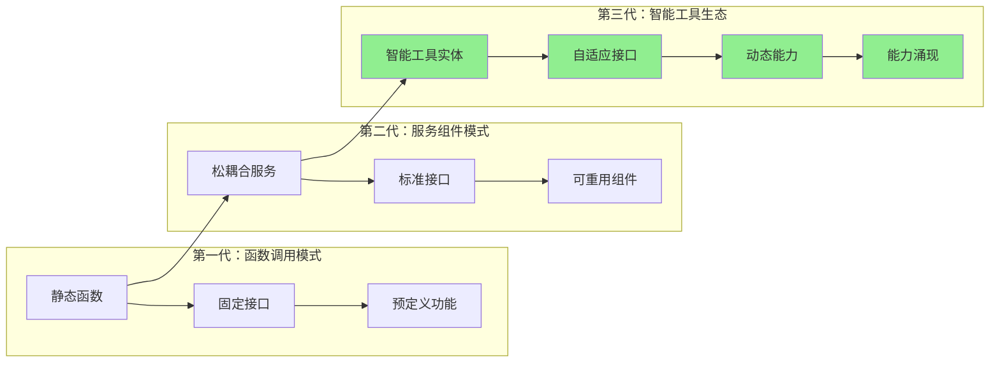
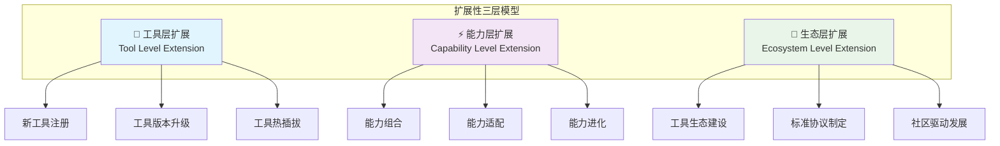
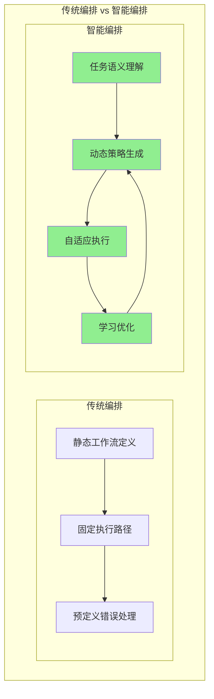
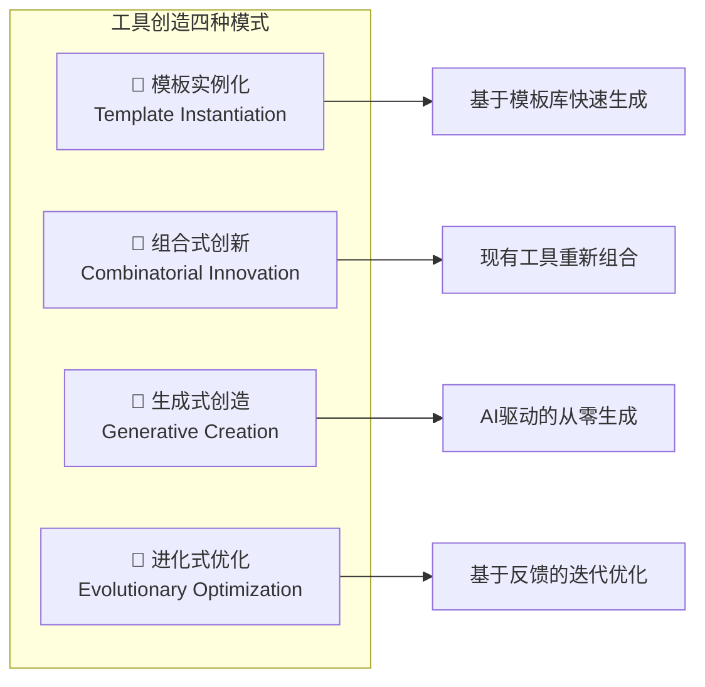
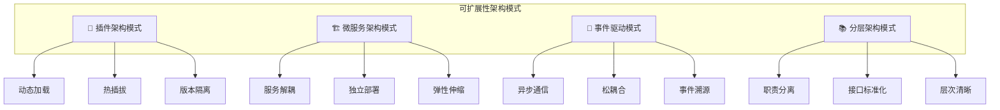

# 4.3.1 工具扩展运行层的理论基础与架构设计

> "从函数调用到智能工具生态的演进，代表了AGI应用开发的根本性范式转变。工具不再是静态的代码片段，而是具备自我进化能力的智能实体。"

## 🎯 本节学习目标

完成本节学习后，您将能够：
- ✅ 理解工具抽象模型的设计原理和演进路径
- ✅ 掌握动态扩展机制的理论基础和实现策略
- ✅ 设计支持智能编排的工具架构
- ✅ 建立工具创造和进化的概念框架

## 工具抽象理论基础

### 工具抽象模型的演进

在AGI应用开发中，工具抽象经历了三个重要的演进阶段：



### 智能工具实体的核心特征

#### 1. 自描述性（Self-Describing）
智能工具具备完整的自我描述能力：

```yaml
tool_metadata:
  name: "data_analyzer"
  version: "2.1.0"
  capabilities:
    - "csv_processing"
    - "statistical_analysis"
    - "data_visualization"
  interfaces:
    input_schema: "DataFrameSchema"
    output_schema: "AnalysisResultSchema"
  requirements:
    compute: "medium"
    memory: "2GB"
    dependencies: ["pandas", "matplotlib"]
  behavioral_patterns:
    execution_mode: "batch|streaming"
    error_handling: "graceful_degradation"
    learning_capability: true
```

#### 2. 自适应性（Self-Adapting）
工具能够根据执行环境和任务需求自动调整：

```python
class AdaptiveTool:
    def adapt_to_context(self, context: ExecutionContext):
        """根据执行上下文自适应调整"""
        if context.memory_limit < self.min_memory:
            self.switch_to_memory_efficient_mode()
        
        if context.data_size > self.batch_threshold:
            self.enable_streaming_mode()
            
        if context.security_level == "high":
            self.enable_sandbox_mode()
    
    def learn_from_execution(self, result: ExecutionResult):
        """从执行结果中学习优化策略"""
        if result.performance_metrics.execution_time > self.target_time:
            self.optimize_algorithm()
        
        if result.error_patterns:
            self.update_error_handling_strategy(result.error_patterns)
```

#### 3. 组合性（Composability）
支持与其他工具的智能组合：

```python
class ComposableTool:
    def can_compose_with(self, other_tool: Tool) -> bool:
        """判断是否可以与其他工具组合"""
        return (
            self.output_schema.is_compatible(other_tool.input_schema) and
            self.execution_requirements.is_compatible(other_tool.execution_requirements)
        )
    
    def create_composition(self, other_tool: Tool) -> CompositeToolChain:
        """创建工具组合链"""
        return CompositeToolChain([self, other_tool])
```

## 动态扩展机制设计

### 扩展性的三个层次

工具扩展运行层的扩展性体现在三个层次：



### 热插拔机制实现

#### 1. 插件生命周期管理

```python
class PluginLifecycleManager:
    def __init__(self):
        self.active_plugins = {}
        self.plugin_dependencies = {}
        
    def register_plugin(self, plugin: Plugin) -> bool:
        """注册新插件"""
        try:
            # 1. 验证插件兼容性
            if not self.validate_compatibility(plugin):
                return False
                
            # 2. 解决依赖关系
            if not self.resolve_dependencies(plugin):
                return False
                
            # 3. 加载插件
            self.load_plugin(plugin)
            
            # 4. 注册到服务发现
            self.service_discovery.register(plugin)
            
            return True
            
        except Exception as e:
            self.logger.error(f"Plugin registration failed: {e}")
            return False
    
    def unregister_plugin(self, plugin_id: str) -> bool:
        """安全卸载插件"""
        if plugin_id not in self.active_plugins:
            return False
            
        plugin = self.active_plugins[plugin_id]
        
        # 1. 检查是否有其他插件依赖
        if self.has_dependents(plugin_id):
            self.logger.warning(f"Plugin {plugin_id} has dependents")
            return False
            
        # 2. 等待当前任务完成
        self.wait_for_completion(plugin_id)
        
        # 3. 清理资源
        plugin.cleanup()
        
        # 4. 从注册表移除
        del self.active_plugins[plugin_id]
        self.service_discovery.unregister(plugin_id)
        
        return True
```

#### 2. 版本兼容性管理

```python
class VersionCompatibilityManager:
    def __init__(self):
        self.compatibility_matrix = {}
        
    def check_compatibility(self, 
                          tool_a: str, version_a: str,
                          tool_b: str, version_b: str) -> bool:
        """检查工具版本兼容性"""
        compatibility_key = f"{tool_a}:{version_a}-{tool_b}:{version_b}"
        
        if compatibility_key in self.compatibility_matrix:
            return self.compatibility_matrix[compatibility_key]
            
        # 动态兼容性检查
        result = self._dynamic_compatibility_check(
            tool_a, version_a, tool_b, version_b
        )
        
        # 缓存结果
        self.compatibility_matrix[compatibility_key] = result
        return result
    
    def _dynamic_compatibility_check(self, 
                                   tool_a: str, version_a: str,
                                   tool_b: str, version_b: str) -> bool:
        """执行动态兼容性检查"""
        try:
            # 获取工具元数据
            metadata_a = self.get_tool_metadata(tool_a, version_a)
            metadata_b = self.get_tool_metadata(tool_b, version_b)
            
            # 检查接口兼容性
            if not self.check_interface_compatibility(metadata_a, metadata_b):
                return False
                
            # 检查依赖兼容性
            if not self.check_dependency_compatibility(metadata_a, metadata_b):
                return False
                
            # 执行测试用例验证
            return self.run_compatibility_tests(tool_a, version_a, tool_b, version_b)
            
        except Exception as e:
            self.logger.error(f"Compatibility check failed: {e}")
            return False
```

## 智能编排理论基础

### 编排策略的演进

传统的工作流编排主要基于静态规则，而智能编排则基于动态学习和优化：



### 智能编排的核心算法

#### 1. 任务分解算法

```python
class TaskDecompositionAlgorithm:
    def __init__(self, llm_client, knowledge_base):
        self.llm = llm_client
        self.kb = knowledge_base
        
    def decompose_task(self, task_description: str) -> List[SubTask]:
        """智能任务分解"""
        # 1. 任务语义分析
        semantic_analysis = self.analyze_task_semantics(task_description)
        
        # 2. 检索相似任务经验
        similar_tasks = self.kb.search_similar_tasks(semantic_analysis)
        
        # 3. LLM驱动的分解策略生成
        decomposition_prompt = self.build_decomposition_prompt(
            task_description, similar_tasks
        )
        
        decomposition_result = self.llm.generate(decomposition_prompt)
        
        # 4. 结构化解析
        subtasks = self.parse_subtasks(decomposition_result)
        
        # 5. 依赖关系分析
        self.analyze_dependencies(subtasks)
        
        return subtasks
    
    def build_decomposition_prompt(self, task: str, similar_tasks: List) -> str:
        """构建分解策略提示词"""
        return f"""
        请将以下任务分解为可执行的子任务：

        目标任务：{task}
        
        参考历史经验：
        {self.format_similar_tasks(similar_tasks)}
        
        分解要求：
        1. 每个子任务应该是原子性的、可独立执行的
        2. 明确子任务间的依赖关系
        3. 识别可以并行执行的子任务
        4. 考虑异常处理和回滚机制
        
        请以JSON格式输出分解结果。
        """
```

#### 2. 工具匹配算法

```python
class ToolMatchingAlgorithm:
    def __init__(self):
        self.capability_index = CapabilityIndex()
        self.performance_history = PerformanceHistory()
        
    def match_tools_for_task(self, task: SubTask) -> List[ToolCandidate]:
        """为子任务匹配最佳工具组合"""
        
        # 1. 基于能力的初步筛选
        capability_matches = self.capability_index.search(
            task.required_capabilities
        )
        
        # 2. 基于历史性能的排序
        performance_ranked = self.performance_history.rank_by_performance(
            capability_matches, task.context
        )
        
        # 3. 考虑资源约束的过滤
        resource_filtered = self.filter_by_resource_constraints(
            performance_ranked, task.resource_limits
        )
        
        # 4. 多目标优化选择
        optimal_candidates = self.multi_objective_optimization(
            resource_filtered, 
            objectives=['performance', 'reliability', 'cost']
        )
        
        return optimal_candidates
    
    def multi_objective_optimization(self, 
                                   candidates: List[Tool], 
                                   objectives: List[str]) -> List[ToolCandidate]:
        """多目标优化工具选择"""
        pareto_front = []
        
        for candidate in candidates:
            scores = {}
            for objective in objectives:
                scores[objective] = self.evaluate_objective(candidate, objective)
            
            candidate.optimization_scores = scores
            
            # 帕累托最优检查
            if self.is_pareto_optimal(candidate, pareto_front):
                pareto_front.append(candidate)
                
        return sorted(pareto_front, key=lambda x: x.overall_score, reverse=True)
```

## 工具创造的理论基础

### 创造性工具生成模式

工具创造引擎基于四种主要的创造模式：



#### 1. 模板实例化模式

```python
class TemplateInstantiationEngine:
    def __init__(self):
        self.template_library = TemplateLibrary()
        self.parameter_resolver = ParameterResolver()
        
    def instantiate_from_template(self, 
                                requirement: ToolRequirement) -> GeneratedTool:
        """基于模板实例化工具"""
        
        # 1. 模板选择
        suitable_templates = self.template_library.search_templates(
            requirement.functionality_type
        )
        
        best_template = self.select_best_template(suitable_templates, requirement)
        
        # 2. 参数解析和绑定
        parameters = self.parameter_resolver.resolve_parameters(
            requirement, best_template.parameter_schema
        )
        
        # 3. 代码生成
        generated_code = best_template.instantiate(parameters)
        
        # 4. 工具包装
        tool = self.wrap_as_tool(generated_code, requirement)
        
        return tool

class APIToolTemplate:
    """API调用工具模板"""
    
    template_code = """
    import requests
    from typing import Any, Dict
    
    class {tool_name}:
        def __init__(self):
            self.base_url = "{api_base_url}"
            self.headers = {headers}
            
        def execute(self, {parameters}) -> Dict[str, Any]:
            try:
                response = requests.{http_method}(
                    f"{self.base_url}{endpoint}",
                    headers=self.headers,
                    {request_body}
                )
                response.raise_for_status()
                return response.json()
                
            except requests.RequestException as e:
                raise ToolExecutionError(f"API call failed: {e}")
    """
    
    def instantiate(self, parameters: Dict) -> str:
        return self.template_code.format(**parameters)
```

#### 2. 生成式创造模式

```python
class GenerativeCreationEngine:
    def __init__(self, code_generator_llm):
        self.llm = code_generator_llm
        self.code_analyzer = CodeAnalyzer()
        self.test_generator = TestGenerator()
        
    def create_tool_from_scratch(self, 
                               requirement: ToolRequirement) -> GeneratedTool:
        """从零开始生成工具"""
        
        # 1. 需求分析和规范生成
        specification = self.generate_specification(requirement)
        
        # 2. 代码生成
        generated_code = self.generate_code(specification)
        
        # 3. 代码质量分析
        quality_metrics = self.code_analyzer.analyze(generated_code)
        
        # 4. 如果质量不达标，迭代改进
        if quality_metrics.overall_score < self.quality_threshold:
            generated_code = self.iterative_improvement(
                generated_code, quality_metrics
            )
        
        # 5. 测试用例生成
        test_cases = self.test_generator.generate_tests(specification)
        
        # 6. 工具验证
        if not self.validate_tool(generated_code, test_cases):
            raise ToolCreationError("Generated tool failed validation")
            
        return GeneratedTool(generated_code, test_cases, specification)
    
    def generate_specification(self, requirement: ToolRequirement) -> ToolSpec:
        """生成详细的工具规范"""
        spec_prompt = f"""
        根据以下需求，生成详细的工具规范：
        
        功能需求：{requirement.functionality}
        输入格式：{requirement.input_format}
        输出格式：{requirement.output_format}
        性能要求：{requirement.performance_requirements}
        约束条件：{requirement.constraints}
        
        请生成包含以下内容的规范：
        1. 详细的功能描述
        2. 输入输出接口定义
        3. 错误处理策略
        4. 性能指标要求
        5. 安全考虑
        """
        
        spec_result = self.llm.generate(spec_prompt)
        return ToolSpec.parse(spec_result)
```

## 架构设计原则

### 设计原则体系

工具扩展运行层的架构设计遵循以下核心原则：

#### 1. 开放封闭原则（Open-Closed Principle）
- **对扩展开放**：支持新工具的快速集成和部署
- **对修改封闭**：核心架构稳定，不因新工具而修改

#### 2. 单一职责原则（Single Responsibility Principle）
- 每个组件专注于特定的职责领域
- 避免组件职责的重叠和耦合

#### 3. 依赖倒置原则（Dependency Inversion Principle）
- 高层模块不依赖低层模块，都依赖于抽象
- 抽象不依赖于细节，细节依赖于抽象

#### 4. 接口隔离原则（Interface Segregation Principle）
- 不应该强迫客户依赖它们不使用的方法
- 设计细粒度的接口

```python
# 良好的接口设计示例
class ExecutableInterface:
    """可执行接口"""
    def execute(self, input_data: Any) -> Any:
        pass

class ConfigurableInterface:
    """可配置接口"""
    def configure(self, config: Dict) -> None:
        pass

class MonitorableInterface:
    """可监控接口"""
    def get_metrics(self) -> Dict[str, Any]:
        pass

# 工具实现可以选择性实现需要的接口
class MyCustomTool(ExecutableInterface, MonitorableInterface):
    def execute(self, input_data: Any) -> Any:
        # 实现执行逻辑
        pass
    
    def get_metrics(self) -> Dict[str, Any]:
        # 实现监控指标
        pass
```

### 架构质量属性

#### 可扩展性设计



#### 可靠性保障

```python
class ReliabilityManager:
    def __init__(self):
        self.circuit_breaker = CircuitBreaker()
        self.retry_policy = RetryPolicy()
        self.fallback_manager = FallbackManager()
        
    def execute_with_reliability(self, tool: Tool, input_data: Any) -> Any:
        """可靠执行工具调用"""
        
        # 1. 断路器检查
        if not self.circuit_breaker.can_execute(tool.id):
            return self.fallback_manager.get_fallback_result(tool.id, input_data)
        
        # 2. 重试执行
        for attempt in range(self.retry_policy.max_attempts):
            try:
                result = tool.execute(input_data)
                
                # 成功执行，重置断路器
                self.circuit_breaker.record_success(tool.id)
                return result
                
            except Exception as e:
                self.circuit_breaker.record_failure(tool.id, e)
                
                if attempt < self.retry_policy.max_attempts - 1:
                    self.wait_for_retry(attempt)
                    continue
                else:
                    # 最后一次重试失败，返回降级结果
                    return self.fallback_manager.get_fallback_result(tool.id, input_data)
```

## 本节总结

本节建立了工具扩展运行层的完整理论基础：

### 🎯 核心理论要点
1. **工具抽象演进**：从静态函数调用到智能工具生态
2. **动态扩展机制**：支持工具的热插拔和版本管理
3. **智能编排理论**：基于任务语义的动态编排策略
4. **工具创造模式**：四种主要的工具生成模式

### 🏗️ 架构设计原则
- 遵循SOLID原则确保架构的稳定性和可扩展性
- 采用多种架构模式提供可靠性和性能保障
- 建立完善的质量属性管理机制

### 🚀 创新突破点
- **智能化**：从规则驱动到AI驱动的工具管理
- **生态化**：构建开放的工具创造和分享生态
- **自动化**：实现工具的自动创造和优化

---

**下一步学习**：在建立了扎实的理论基础后，我们将在4.3.2节深入学习工具注册中心的具体设计和实现，包括分布式工具发现、版本管理和能力匹配机制。

> **💡 思考题**：结合您的实际工作经验，思考如何将现有的工具和服务抽象为符合AGI应用要求的智能工具实体？
