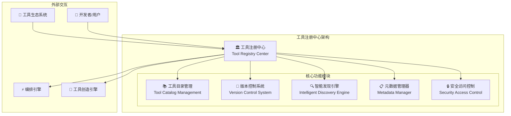
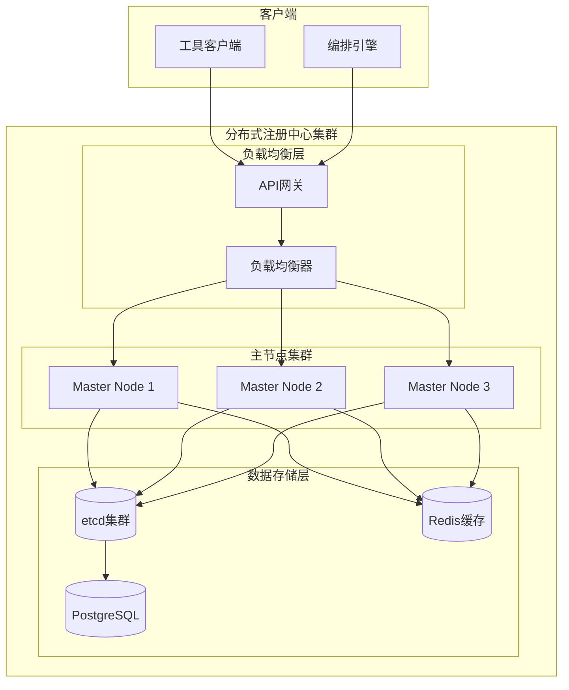
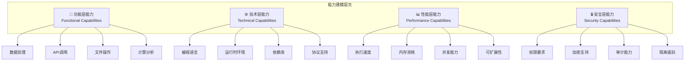

# 4.3.2 工具注册中心的设计与实现

> "工具注册中心是AGI应用工具生态的心脏，它不仅是工具的仓库，更是智能工具发现、匹配和协同的智能大脑。"

## 🎯 本节学习目标

完成本节学习后，您将能够：
- ✅ 设计高可用的分布式工具注册中心架构
- ✅ 实现智能工具发现和能力匹配机制
- ✅ 构建完善的工具版本管理和依赖解析系统
- ✅ 建立工具权限管理和安全访问控制机制

## 工具注册中心概述

### 核心定位与职责

工具注册中心作为工具扩展运行层的核心基础设施，承担着工具生态系统的管理职责：



### 核心功能特性

#### 1. 统一工具目录管理
- **全局工具清单**：维护系统中所有可用工具的完整清单
- **分类体系**：建立多维度的工具分类和标签体系
- **搜索索引**：构建高效的工具搜索和检索机制

#### 2. 智能版本控制
- **语义版本管理**：支持符合Semantic Versioning的版本控制
- **向后兼容性**：维护版本间的兼容性映射关系
- **依赖解析**：自动解析和管理工具间的依赖关系

#### 3. 动态服务发现
- **实时状态监控**：监控工具的健康状态和可用性
- **负载感知**：基于工具负载情况进行智能路由
- **故障切换**：自动处理工具故障和服务迁移

## 分布式架构设计

### 高可用架构模式

工具注册中心采用分布式微服务架构，确保高可用性和可扩展性：



### 核心组件实现

#### 1. 工具注册管理器

```python
import asyncio
from typing import Dict, List, Optional
from dataclasses import dataclass, asdict
import json
from datetime import datetime

@dataclass
class ToolMetadata:
    """工具元数据结构"""
    id: str
    name: str
    version: str
    description: str
    capabilities: List[str]
    input_schema: Dict
    output_schema: Dict
    dependencies: List[str]
    resource_requirements: Dict
    author: str
    created_at: datetime
    updated_at: datetime
    tags: List[str]
    documentation_url: Optional[str] = None
    source_url: Optional[str] = None

class ToolRegistrationManager:
    """工具注册管理器"""
    
    def __init__(self, storage_backend, event_bus):
        self.storage = storage_backend
        self.event_bus = event_bus
        self.validation_rules = ValidationRuleSet()
        
    async def register_tool(self, tool_metadata: ToolMetadata) -> bool:
        """注册新工具"""
        try:
            # 1. 元数据验证
            validation_result = await self.validate_metadata(tool_metadata)
            if not validation_result.is_valid:
                raise ValidationError(validation_result.errors)
            
            # 2. 依赖检查
            dependency_check = await self.check_dependencies(tool_metadata.dependencies)
            if not dependency_check.all_satisfied:
                raise DependencyError(dependency_check.missing_dependencies)
            
            # 3. 版本兼容性检查
            compatibility_check = await self.check_version_compatibility(
                tool_metadata.id, tool_metadata.version
            )
            if not compatibility_check.is_compatible:
                raise CompatibilityError(compatibility_check.conflicts)
            
            # 4. 存储工具元数据
            await self.storage.store_tool_metadata(tool_metadata)
            
            # 5. 更新搜索索引
            await self.update_search_index(tool_metadata)
            
            # 6. 发布注册事件
            await self.event_bus.publish(
                "tool.registered", 
                {"tool_id": tool_metadata.id, "version": tool_metadata.version}
            )
            
            self.logger.info(f"Tool {tool_metadata.id}:{tool_metadata.version} registered successfully")
            return True
            
        except Exception as e:
            self.logger.error(f"Tool registration failed: {e}")
            return False
    
    async def unregister_tool(self, tool_id: str, version: str) -> bool:
        """卸载工具"""
        try:
            # 1. 检查是否有其他工具依赖
            dependents = await self.find_dependents(tool_id, version)
            if dependents:
                raise DependencyError(f"Tool has dependents: {dependents}")
            
            # 2. 检查是否有活跃的执行实例
            active_instances = await self.get_active_instances(tool_id, version)
            if active_instances:
                # 等待实例完成或强制终止
                await self.wait_for_completion_or_terminate(active_instances)
            
            # 3. 从存储中删除
            await self.storage.remove_tool_metadata(tool_id, version)
            
            # 4. 更新搜索索引
            await self.remove_from_search_index(tool_id, version)
            
            # 5. 发布卸载事件
            await self.event_bus.publish(
                "tool.unregistered",
                {"tool_id": tool_id, "version": version}
            )
            
            return True
            
        except Exception as e:
            self.logger.error(f"Tool unregistration failed: {e}")
            return False

    async def validate_metadata(self, metadata: ToolMetadata) -> ValidationResult:
        """验证工具元数据"""
        errors = []
        
        # 基本字段验证
        if not metadata.id:
            errors.append("Tool ID is required")
        
        if not metadata.version:
            errors.append("Tool version is required")
            
        # 版本格式验证
        if not self.validation_rules.is_valid_version(metadata.version):
            errors.append(f"Invalid version format: {metadata.version}")
        
        # Schema验证
        if not self.validation_rules.is_valid_schema(metadata.input_schema):
            errors.append("Invalid input schema")
            
        if not self.validation_rules.is_valid_schema(metadata.output_schema):
            errors.append("Invalid output schema")
        
        return ValidationResult(len(errors) == 0, errors)
```

#### 2. 智能发现引擎

```python
class IntelligentDiscoveryEngine:
    """智能工具发现引擎"""
    
    def __init__(self, vector_store, semantic_search_model):
        self.vector_store = vector_store
        self.semantic_model = semantic_search_model
        self.capability_index = CapabilityIndex()
        self.performance_tracker = PerformanceTracker()
        
    async def discover_tools(self, query: ToolQuery) -> List[ToolMatch]:
        """智能工具发现"""
        
        # 1. 多维度搜索策略
        search_results = await self.multi_dimensional_search(query)
        
        # 2. 语义相似度计算
        semantic_scores = await self.compute_semantic_similarity(query, search_results)
        
        # 3. 性能历史权重
        performance_weights = self.performance_tracker.get_performance_weights(
            [tool.id for tool in search_results]
        )
        
        # 4. 综合评分排序
        ranked_matches = self.rank_matches(
            search_results, semantic_scores, performance_weights
        )
        
        return ranked_matches
    
    async def multi_dimensional_search(self, query: ToolQuery) -> List[Tool]:
        """多维度工具搜索"""
        
        results = []
        
        # 1. 基于能力的精确匹配
        if query.required_capabilities:
            capability_matches = await self.capability_index.search(
                query.required_capabilities
            )
            results.extend(capability_matches)
        
        # 2. 基于标签的模糊匹配
        if query.tags:
            tag_matches = await self.search_by_tags(query.tags)
            results.extend(tag_matches)
        
        # 3. 基于描述的语义搜索
        if query.description:
            semantic_matches = await self.semantic_search(query.description)
            results.extend(semantic_matches)
        
        # 4. 去重和合并
        unique_results = self.deduplicate_and_merge(results)
        
        return unique_results
    
    async def compute_semantic_similarity(self, 
                                        query: ToolQuery, 
                                        tools: List[Tool]) -> Dict[str, float]:
        """计算语义相似度"""
        
        similarities = {}
        
        # 构建查询向量
        query_text = self.build_query_text(query)
        query_vector = await self.semantic_model.encode(query_text)
        
        for tool in tools:
            # 构建工具描述向量
            tool_text = self.build_tool_text(tool)
            tool_vector = await self.semantic_model.encode(tool_text)
            
            # 计算余弦相似度
            similarity = self.cosine_similarity(query_vector, tool_vector)
            similarities[tool.id] = similarity
        
        return similarities
    
    def rank_matches(self, 
                    tools: List[Tool],
                    semantic_scores: Dict[str, float],
                    performance_weights: Dict[str, float]) -> List[ToolMatch]:
        """综合评分和排序"""
        
        matches = []
        
        for tool in tools:
            # 综合评分计算
            semantic_score = semantic_scores.get(tool.id, 0.0)
            performance_score = performance_weights.get(tool.id, 0.5)
            
            # 加权计算最终评分
            final_score = (
                0.4 * semantic_score + 
                0.3 * performance_score + 
                0.3 * self.calculate_popularity_score(tool)
            )
            
            match = ToolMatch(
                tool=tool,
                semantic_score=semantic_score,
                performance_score=performance_score,
                final_score=final_score
            )
            matches.append(match)
        
        # 按最终评分排序
        return sorted(matches, key=lambda m: m.final_score, reverse=True)
```

#### 3. 版本管理系统

```python
class VersionControlSystem:
    """工具版本控制系统"""
    
    def __init__(self, storage_backend):
        self.storage = storage_backend
        self.compatibility_matrix = CompatibilityMatrix()
        self.dependency_resolver = DependencyResolver()
        
    async def manage_tool_version(self, 
                                tool_id: str, 
                                new_version: str,
                                metadata: ToolMetadata) -> VersionManagementResult:
        """管理工具版本"""
        
        try:
            # 1. 获取现有版本信息
            existing_versions = await self.get_tool_versions(tool_id)
            
            # 2. 版本冲突检查
            if new_version in existing_versions:
                raise VersionConflictError(f"Version {new_version} already exists")
            
            # 3. 兼容性分析
            compatibility_analysis = await self.analyze_compatibility(
                tool_id, new_version, existing_versions, metadata
            )
            
            # 4. 依赖影响分析
            dependency_impact = await self.analyze_dependency_impact(
                tool_id, new_version, metadata.dependencies
            )
            
            # 5. 版本策略决策
            version_strategy = self.determine_version_strategy(
                compatibility_analysis, dependency_impact
            )
            
            # 6. 执行版本管理策略
            result = await self.execute_version_strategy(
                tool_id, new_version, metadata, version_strategy
            )
            
            return result
            
        except Exception as e:
            self.logger.error(f"Version management failed: {e}")
            return VersionManagementResult(success=False, error=str(e))
    
    async def analyze_compatibility(self, 
                                  tool_id: str,
                                  new_version: str,
                                  existing_versions: List[str],
                                  metadata: ToolMetadata) -> CompatibilityAnalysis:
        """分析版本兼容性"""
        
        compatibility_issues = []
        breaking_changes = []
        
        for existing_version in existing_versions:
            existing_metadata = await self.storage.get_tool_metadata(
                tool_id, existing_version
            )
            
            # 接口兼容性检查
            interface_compatibility = self.check_interface_compatibility(
                existing_metadata, metadata
            )
            
            if not interface_compatibility.is_compatible:
                breaking_changes.extend(interface_compatibility.breaking_changes)
            
            # 依赖兼容性检查
            dependency_compatibility = self.check_dependency_compatibility(
                existing_metadata.dependencies, metadata.dependencies
            )
            
            if not dependency_compatibility.is_compatible:
                compatibility_issues.extend(dependency_compatibility.issues)
        
        return CompatibilityAnalysis(
            has_breaking_changes=len(breaking_changes) > 0,
            breaking_changes=breaking_changes,
            compatibility_issues=compatibility_issues
        )
    
    def determine_version_strategy(self, 
                                 compatibility_analysis: CompatibilityAnalysis,
                                 dependency_impact: DependencyImpact) -> VersionStrategy:
        """确定版本管理策略"""
        
        if compatibility_analysis.has_breaking_changes:
            # 有破坏性变更，采用并行版本策略
            return VersionStrategy(
                type="parallel",
                migration_plan=self.create_migration_plan(compatibility_analysis),
                deprecation_timeline=self.create_deprecation_timeline()
            )
        elif dependency_impact.has_significant_impact:
            # 有重大依赖影响，采用渐进式升级策略
            return VersionStrategy(
                type="gradual_upgrade",
                rollout_phases=self.create_rollout_phases(dependency_impact)
            )
        else:
            # 兼容性变更，采用热替换策略
            return VersionStrategy(
                type="hot_replacement",
                rollback_plan=self.create_rollback_plan()
            )
```

## 智能能力匹配机制

### 多层次能力建模

工具注册中心采用多层次的能力建模方法：



### 智能匹配算法实现

```python
class IntelligentMatchingEngine:
    """智能能力匹配引擎"""
    
    def __init__(self):
        self.capability_graph = CapabilityGraph()
        self.matching_algorithms = {
            'exact': ExactMatcher(),
            'semantic': SemanticMatcher(),
            'fuzzy': FuzzyMatcher(),
            'structural': StructuralMatcher()
        }
        
    async def match_capabilities(self, 
                               required_capabilities: List[str],
                               available_tools: List[Tool]) -> List[CapabilityMatch]:
        """智能能力匹配"""
        
        matches = []
        
        for tool in available_tools:
            match_scores = {}
            
            # 1. 多种匹配策略并行计算
            for strategy, matcher in self.matching_algorithms.items():
                score = await matcher.calculate_match_score(
                    required_capabilities, tool.capabilities
                )
                match_scores[strategy] = score
            
            # 2. 加权计算综合匹配度
            combined_score = self.combine_match_scores(match_scores)
            
            # 3. 上下文相关性调整
            context_adjusted_score = self.adjust_for_context(
                combined_score, tool, required_capabilities
            )
            
            if context_adjusted_score > self.match_threshold:
                match = CapabilityMatch(
                    tool=tool,
                    match_scores=match_scores,
                    combined_score=context_adjusted_score,
                    explanation=self.generate_match_explanation(
                        tool, required_capabilities, match_scores
                    )
                )
                matches.append(match)
        
        return sorted(matches, key=lambda m: m.combined_score, reverse=True)
    
    def combine_match_scores(self, match_scores: Dict[str, float]) -> float:
        """组合多种匹配策略的得分"""
        
        # 动态权重计算
        weights = {
            'exact': 0.4,      # 精确匹配权重最高
            'semantic': 0.3,   # 语义匹配次之
            'fuzzy': 0.2,      # 模糊匹配较低
            'structural': 0.1  # 结构匹配最低
        }
        
        combined_score = sum(
            weights.get(strategy, 0) * score 
            for strategy, score in match_scores.items()
        )
        
        return min(combined_score, 1.0)  # 确保得分不超过1
    
    def generate_match_explanation(self, 
                                 tool: Tool,
                                 required_capabilities: List[str],
                                 match_scores: Dict[str, float]) -> str:
        """生成匹配解释"""
        
        explanations = []
        
        # 精确匹配的能力
        exact_matches = set(tool.capabilities) & set(required_capabilities)
        if exact_matches:
            explanations.append(f"精确匹配能力: {', '.join(exact_matches)}")
        
        # 语义相似的能力
        semantic_matches = self.find_semantic_matches(
            tool.capabilities, required_capabilities
        )
        if semantic_matches:
            explanations.append(f"语义相似能力: {', '.join(semantic_matches)}")
        
        # 缺失的能力
        missing_capabilities = set(required_capabilities) - set(tool.capabilities)
        if missing_capabilities:
            explanations.append(f"缺失能力: {', '.join(missing_capabilities)}")
        
        return "; ".join(explanations)
```

## 安全访问控制

### 多层安全模型

```python
class SecurityAccessController:
    """安全访问控制器"""
    
    def __init__(self):
        self.rbac_manager = RBACManager()
        self.policy_engine = PolicyEngine()
        self.audit_logger = AuditLogger()
        
    async def authorize_tool_access(self, 
                                  user_context: UserContext,
                                  tool_id: str,
                                  operation: str) -> AuthorizationResult:
        """工具访问授权"""
        
        try:
            # 1. 身份验证
            if not await self.authenticate_user(user_context):
                return AuthorizationResult(authorized=False, reason="Authentication failed")
            
            # 2. 角色权限检查
            if not await self.rbac_manager.check_permission(
                user_context.user_id, f"tool:{tool_id}:{operation}"
            ):
                return AuthorizationResult(authorized=False, reason="Insufficient permissions")
            
            # 3. 策略评估
            policy_result = await self.policy_engine.evaluate_policies(
                user_context, tool_id, operation
            )
            
            if not policy_result.allowed:
                return AuthorizationResult(
                    authorized=False, 
                    reason=f"Policy violation: {policy_result.violation_reason}"
                )
            
            # 4. 记录访问审计
            await self.audit_logger.log_access_attempt(
                user_context, tool_id, operation, "ALLOWED"
            )
            
            return AuthorizationResult(authorized=True, reason="Access granted")
            
        except Exception as e:
            await self.audit_logger.log_access_attempt(
                user_context, tool_id, operation, "ERROR", str(e)
            )
            return AuthorizationResult(authorized=False, reason=f"Authorization error: {e}")
    
    async def create_access_token(self, 
                                user_context: UserContext,
                                tool_id: str,
                                permissions: List[str]) -> AccessToken:
        """创建访问令牌"""
        
        token_payload = {
            "user_id": user_context.user_id,
            "tool_id": tool_id,
            "permissions": permissions,
            "issued_at": datetime.utcnow().isoformat(),
            "expires_at": (datetime.utcnow() + timedelta(hours=1)).isoformat()
        }
        
        token = jwt.encode(token_payload, self.secret_key, algorithm='HS256')
        
        # 存储令牌用于撤销检查
        await self.token_store.store_token(token, token_payload)
        
        return AccessToken(token=token, expires_at=token_payload["expires_at"])
```

## 本节总结

本节详细介绍了工具注册中心的设计与实现：

### 🎯 核心架构特点
1. **分布式高可用**：采用主从集群确保服务可用性
2. **智能发现机制**：多维度搜索和语义匹配
3. **版本管理体系**：完善的版本控制和兼容性管理
4. **安全访问控制**：多层次的权限管理和审计机制

### 🔧 关键技术实现
- 工具元数据的结构化管理
- 智能匹配算法的多策略融合
- 版本兼容性的自动化分析
- 基于RBAC的访问控制机制

### 🚀 创新特性
- **智能化**：基于AI的工具发现和匹配
- **自动化**：版本管理和依赖解析的自动化
- **安全性**：全方位的安全访问控制
- **可扩展性**：支持大规模工具生态系统

---

**下一步学习**：建立了工具注册中心的基础后，我们将在4.3.3节学习智能编排引擎的设计实现，了解如何基于工具注册信息进行智能化的工具编排和执行控制。

> **💡 实践建议**：在实际项目中，建议从小规模的工具注册开始，逐步扩展到完整的分布式注册中心，并持续优化匹配算法的准确性。
