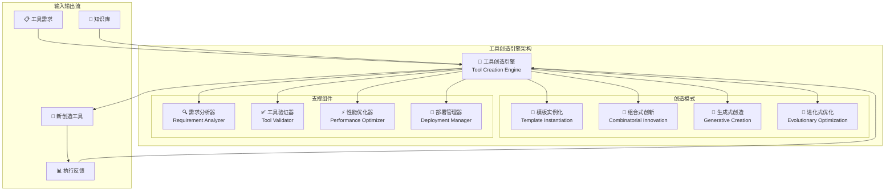

# 4.3.4 工具创造引擎的设计原理

> "工具创造引擎是AGI应用智能涌现的核心体现，它不仅能使用现有工具，更能根据需求动态创造全新的工具，实现真正的能力边界突破。"

## 🎯 本节学习目标

完成本节学习后，您将能够：
- ✅ 理解工具动态创造的核心原理和技术路径
- ✅ 设计基于模板和生成式的工具创造机制
- ✅ 实现工具验证和质量保障体系
- ✅ 构建工具进化和自我优化机制

## 工具创造引擎概述

### 核心设计理念

工具创造引擎代表了从"工具使用"向"工具创造"的根本性转变，它使AGI应用具备了真正的创造力：



### 创造引擎的核心能力

#### 1. 需求理解与分析
- **语义解析**：深度理解工具需求的功能和约束
- **场景分析**：识别工具的使用场景和环境要求
- **规格生成**：自动生成详细的工具技术规格

#### 2. 多模式工具生成
- **模板驱动**：基于预定义模板快速生成常见类型工具
- **组合创新**：通过现有工具的重新组合产生新能力
- **从零生成**：基于AI大模型完全从零创造新工具
- **进化优化**：基于使用反馈持续优化工具性能

#### 3. 质量保障机制
- **功能验证**：确保生成工具的功能正确性
- **性能测试**：验证工具的性能和效率指标
- **安全检查**：进行全面的安全性和可靠性检查
- **标准合规**：确保符合企业标准和行业规范

## 需求分析与规格生成

### 智能需求分析器

```python
from typing import Dict, List, Any, Optional
from dataclasses import dataclass
from enum import Enum
import asyncio

class ToolType(Enum):
    API_CLIENT = "api_client"
    DATA_PROCESSOR = "data_processor"
    FILE_HANDLER = "file_handler"
    CALCULATOR = "calculator"
    VALIDATOR = "validator"
    CONVERTER = "converter"
    INTEGRATOR = "integrator"
    CUSTOM = "custom"

@dataclass
class ToolRequirement:
    """工具需求定义"""
    requirement_id: str
    description: str
    functionality: str
    input_specification: Dict
    output_specification: Dict
    performance_requirements: Dict
    security_requirements: List[str]
    compatibility_requirements: List[str]
    constraints: Dict
    examples: List[Dict]
    priority: str = "normal"

@dataclass
class ToolSpecification:
    """工具技术规格"""
    spec_id: str
    tool_type: ToolType
    name: str
    description: str
    interface_definition: Dict
    implementation_approach: str
    dependencies: List[str]
    resource_requirements: Dict
    testing_strategy: Dict
    deployment_config: Dict
    quality_metrics: Dict

class RequirementAnalyzer:
    """需求分析器"""
    
    def __init__(self, llm_client, domain_knowledge):
        self.llm = llm_client
        self.domain_kb = domain_knowledge
        self.pattern_matcher = PatternMatcher()
        self.complexity_estimator = ComplexityEstimator()
        
    async def analyze_requirement(self, 
                                requirement: ToolRequirement) -> ToolSpecification:
        """分析工具需求并生成技术规格"""
        
        # 1. 功能分析
        functional_analysis = await self.analyze_functionality(requirement)
        
        # 2. 技术类型识别
        tool_type = await self.identify_tool_type(requirement, functional_analysis)
        
        # 3. 接口设计
        interface_design = await self.design_interface(requirement, tool_type)
        
        # 4. 实现方案分析
        implementation_approach = await self.analyze_implementation_approach(
            requirement, tool_type, functional_analysis
        )
        
        # 5. 依赖分析
        dependencies = await self.analyze_dependencies(
            requirement, implementation_approach
        )
        
        # 6. 性能规格制定
        performance_specs = await self.define_performance_specifications(
            requirement, implementation_approach
        )
        
        # 7. 测试策略设计
        testing_strategy = await self.design_testing_strategy(
            requirement, interface_design
        )
        
        return ToolSpecification(
            spec_id=self.generate_spec_id(),
            tool_type=tool_type,
            name=self.generate_tool_name(requirement),
            description=requirement.description,
            interface_definition=interface_design,
            implementation_approach=implementation_approach,
            dependencies=dependencies,
            resource_requirements=performance_specs,
            testing_strategy=testing_strategy,
            deployment_config=self.create_deployment_config(requirement),
            quality_metrics=self.define_quality_metrics(requirement)
        )
    
    async def analyze_functionality(self, requirement: ToolRequirement) -> Dict:
        """分析工具功能"""
        
        analysis_prompt = f"""
        分析以下工具需求的功能特征：
        
        描述：{requirement.description}
        功能要求：{requirement.functionality}
        输入规格：{requirement.input_specification}
        输出规格：{requirement.output_specification}
        
        请分析：
        1. 核心功能模块
        2. 数据处理流程
        3. 业务逻辑复杂度
        4. 异常处理需求
        5. 扩展性考虑
        
        以JSON格式返回分析结果。
        """
        
        result = await self.llm.generate(analysis_prompt)
        return self.parse_functional_analysis(result)
    
    async def identify_tool_type(self, 
                               requirement: ToolRequirement,
                               functional_analysis: Dict) -> ToolType:
        """识别工具类型"""
        
        # 基于模式匹配进行类型识别
        patterns = {
            ToolType.API_CLIENT: [
                "api", "http", "rest", "graphql", "request", "client"
            ],
            ToolType.DATA_PROCESSOR: [
                "process", "transform", "analyze", "compute", "calculate"
            ],
            ToolType.FILE_HANDLER: [
                "file", "read", "write", "parse", "format", "csv", "json", "xml"
            ],
            ToolType.CALCULATOR: [
                "calculate", "compute", "math", "formula", "algorithm"
            ],
            ToolType.VALIDATOR: [
                "validate", "check", "verify", "test", "confirm"
            ],
            ToolType.CONVERTER: [
                "convert", "transform", "translate", "format", "encode"
            ]
        }
        
        # 计算每种类型的匹配分数
        type_scores = {}
        description_lower = requirement.description.lower()
        functionality_lower = requirement.functionality.lower()
        
        for tool_type, keywords in patterns.items():
            score = 0
            for keyword in keywords:
                if keyword in description_lower:
                    score += 2
                if keyword in functionality_lower:
                    score += 3
            
            # 考虑功能分析结果
            if 'primary_operations' in functional_analysis:
                for operation in functional_analysis['primary_operations']:
                    if any(keyword in operation.lower() for keyword in keywords):
                        score += 1
            
            type_scores[tool_type] = score
        
        # 返回得分最高的类型
        best_type = max(type_scores, key=type_scores.get)
        return best_type if type_scores[best_type] > 0 else ToolType.CUSTOM
    
    async def design_interface(self, 
                             requirement: ToolRequirement,
                             tool_type: ToolType) -> Dict:
        """设计工具接口"""
        
        interface_design_prompt = f"""
        为以下工具设计API接口：
        
        工具类型：{tool_type.value}
        功能描述：{requirement.functionality}
        输入规格：{requirement.input_specification}
        输出规格：{requirement.output_specification}
        约束条件：{requirement.constraints}
        
        请设计：
        1. 主要方法和参数
        2. 输入验证规则
        3. 输出格式定义
        4. 异常处理接口
        5. 配置参数接口
        
        以JSON Schema格式返回接口定义。
        """
        
        result = await self.llm.generate(interface_design_prompt)
        return self.parse_interface_design(result)
```

## 工具生成机制

### 模板实例化引擎

```python
class TemplateInstantiationEngine:
    """模板实例化引擎"""
    
    def __init__(self):
        self.template_library = TemplateLibrary()
        self.parameter_resolver = ParameterResolver()
        self.code_generator = CodeGenerator()
        
    async def instantiate_tool(self, 
                             specification: ToolSpecification) -> GeneratedTool:
        """基于模板实例化工具"""
        
        # 1. 选择最佳模板
        best_template = await self.select_best_template(specification)
        
        if not best_template:
            raise TemplateNotFoundError(f"No suitable template for {specification.tool_type}")
        
        # 2. 解析模板参数
        template_parameters = await self.parameter_resolver.resolve_parameters(
            specification, best_template
        )
        
        # 3. 生成工具代码
        generated_code = await self.code_generator.generate_from_template(
            best_template, template_parameters
        )
        
        # 4. 生成测试代码
        test_code = await self.generate_test_code(
            specification, generated_code
        )
        
        # 5. 生成文档
        documentation = await self.generate_documentation(
            specification, template_parameters
        )
        
        return GeneratedTool(
            tool_id=specification.spec_id,
            name=specification.name,
            source_code=generated_code,
            test_code=test_code,
            documentation=documentation,
            dependencies=specification.dependencies,
            metadata=self.create_tool_metadata(specification)
        )
    
    async def select_best_template(self, 
                                 specification: ToolSpecification) -> Optional[ToolTemplate]:
        """选择最佳模板"""
        
        # 获取候选模板
        candidate_templates = await self.template_library.get_templates_by_type(
            specification.tool_type
        )
        
        if not candidate_templates:
            return None
        
        # 评估每个模板的适合度
        best_template = None
        best_score = 0
        
        for template in candidate_templates:
            score = await self.evaluate_template_fitness(template, specification)
            if score > best_score:
                best_score = score
                best_template = template
        
        return best_template if best_score > 0.5 else None
    
    async def evaluate_template_fitness(self, 
                                      template: ToolTemplate,
                                      specification: ToolSpecification) -> float:
        """评估模板适合度"""
        
        fitness_score = 0.0
        
        # 1. 功能匹配度 (40%)
        functionality_match = self.calculate_functionality_match(
            template.supported_functions, specification.interface_definition
        )
        fitness_score += 0.4 * functionality_match
        
        # 2. 技术栈兼容度 (30%)
        tech_compatibility = self.calculate_tech_compatibility(
            template.tech_stack, specification.dependencies
        )
        fitness_score += 0.3 * tech_compatibility
        
        # 3. 复杂度匹配度 (20%)
        complexity_match = self.calculate_complexity_match(
            template.complexity_level, specification.resource_requirements
        )
        fitness_score += 0.2 * complexity_match
        
        # 4. 可定制化程度 (10%)
        customization_score = template.customization_flexibility
        fitness_score += 0.1 * customization_score
        
        return min(fitness_score, 1.0)

class ToolTemplate:
    """工具模板基类"""
    
    def __init__(self, template_id: str, tool_type: ToolType):
        self.template_id = template_id
        self.tool_type = tool_type
        self.supported_functions = []
        self.tech_stack = []
        self.complexity_level = "medium"
        self.customization_flexibility = 0.8
        self.template_code = ""
        
    def instantiate(self, parameters: Dict[str, Any]) -> str:
        """实例化模板"""
        return self.template_code.format(**parameters)

class APIClientTemplate(ToolTemplate):
    """API客户端工具模板"""
    
    def __init__(self):
        super().__init__("api_client_template", ToolType.API_CLIENT)
        self.template_code = '''
import requests
import json
from typing import Any, Dict, Optional
from dataclasses import dataclass

@dataclass
class {tool_name}Config:
    """工具配置"""
    base_url: str
    headers: Dict[str, str]
    timeout: int = 30
    retry_count: int = 3

class {tool_name}:
    """
    {description}
    
    Generated API client tool for {api_name}
    """
    
    def __init__(self, config: {tool_name}Config):
        self.config = config
        self.session = requests.Session()
        self.session.headers.update(config.headers)
        
    def execute(self, {input_parameters}) -> Dict[str, Any]:
        """
        执行API调用
        
        Args:
            {parameter_docs}
            
        Returns:
            Dict[str, Any]: API响应结果
            
        Raises:
            {tool_name}Error: API调用失败时抛出异常
        """
        try:
            # 构建请求URL
            url = f"{{self.config.base_url}}{endpoint}"
            
            # 构建请求参数
            {request_building_code}
            
            # 执行HTTP请求
            response = self.session.{http_method}(
                url,
                {request_params}
                timeout=self.config.timeout
            )
            
            # 检查响应状态
            response.raise_for_status()
            
            # 解析响应结果
            {response_parsing_code}
            
            return result
            
        except requests.RequestException as e:
            raise {tool_name}Error(f"API request failed: {{e}}")
        except json.JSONDecodeError as e:
            raise {tool_name}Error(f"Invalid JSON response: {{e}}")
        except Exception as e:
            raise {tool_name}Error(f"Unexpected error: {{e}}")
    
    def validate_input(self, {input_parameters}) -> bool:
        """
        验证输入参数
        """
        {input_validation_code}
        return True
    
    def health_check(self) -> bool:
        """
        健康检查
        """
        try:
            response = self.session.get(
                f"{{self.config.base_url}}{health_endpoint}",
                timeout=5
            )
            return response.status_code == 200
        except:
            return False

class {tool_name}Error(Exception):
    """工具专用异常类"""
    pass
        '''
```

### 生成式创造引擎

```python
class GenerativeCreationEngine:
    """生成式创造引擎"""
    
    def __init__(self, code_llm, code_analyzer):
        self.code_llm = code_llm
        self.code_analyzer = code_analyzer
        self.quality_checker = CodeQualityChecker()
        self.security_scanner = SecurityScanner()
        
    async def create_tool_from_scratch(self, 
                                     specification: ToolSpecification) -> GeneratedTool:
        """从零开始创造工具"""
        
        # 1. 生成初始代码
        initial_code = await self.generate_initial_code(specification)
        
        # 2. 迭代改进代码质量
        improved_code = await self.iterative_code_improvement(
            initial_code, specification
        )
        
        # 3. 安全性检查和修复
        secure_code = await self.security_hardening(improved_code, specification)
        
        # 4. 生成测试套件
        test_suite = await self.generate_comprehensive_tests(
            secure_code, specification
        )
        
        # 5. 生成文档
        documentation = await self.generate_comprehensive_documentation(
            secure_code, specification, test_suite
        )
        
        return GeneratedTool(
            tool_id=specification.spec_id,
            name=specification.name,
            source_code=secure_code,
            test_code=test_suite,
            documentation=documentation,
            dependencies=specification.dependencies,
            metadata=self.create_enhanced_metadata(specification)
        )
    
    async def generate_initial_code(self, 
                                  specification: ToolSpecification) -> str:
        """生成初始代码"""
        
        generation_prompt = f"""
        请根据以下规格生成完整的Python工具代码：
        
        工具名称：{specification.name}
        工具类型：{specification.tool_type.value}
        功能描述：{specification.description}
        接口定义：{json.dumps(specification.interface_definition, indent=2)}
        依赖项：{specification.dependencies}
        性能要求：{specification.resource_requirements}
        
        代码要求：
        1. 遵循Python最佳实践
        2. 包含完整的类型注解
        3. 实现异常处理机制
        4. 添加详细的文档字符串
        5. 支持配置化
        6. 实现日志记录
        7. 包含输入验证
        8. 考虑性能优化
        
        请生成完整、可执行的代码。
        """
        
        generated_code = await self.code_llm.generate(generation_prompt)
        return self.clean_and_format_code(generated_code)
    
    async def iterative_code_improvement(self, 
                                       initial_code: str,
                                       specification: ToolSpecification) -> str:
        """迭代改进代码质量"""
        
        current_code = initial_code
        max_iterations = 3
        
        for iteration in range(max_iterations):
            # 分析代码质量
            quality_report = await self.code_analyzer.analyze_quality(current_code)
            
            if quality_report.overall_score > 0.85:
                break  # 质量足够好，停止迭代
            
            # 生成改进建议
            improvement_suggestions = await self.generate_improvement_suggestions(
                current_code, quality_report, specification
            )
            
            # 应用改进
            improved_code = await self.apply_improvements(
                current_code, improvement_suggestions
            )
            
            current_code = improved_code
        
        return current_code
    
    async def generate_improvement_suggestions(self,
                                             code: str,
                                             quality_report: CodeQualityReport,
                                             specification: ToolSpecification) -> List[ImprovementSuggestion]:
        """生成代码改进建议"""
        
        suggestions = []
        
        # 基于质量报告生成建议
        if quality_report.complexity_score < 0.7:
            suggestions.append(ImprovementSuggestion(
                type="complexity",
                description="降低代码复杂度，拆分大函数",
                priority="high"
            ))
        
        if quality_report.documentation_score < 0.8:
            suggestions.append(ImprovementSuggestion(
                type="documentation",
                description="改进文档字符串和注释",
                priority="medium"
            ))
        
        if quality_report.error_handling_score < 0.8:
            suggestions.append(ImprovementSuggestion(
                type="error_handling",
                description="增强异常处理机制",
                priority="high"
            ))
        
        if quality_report.performance_score < 0.7:
            suggestions.append(ImprovementSuggestion(
                type="performance",
                description="优化性能热点",
                priority="medium"
            ))
        
        return suggestions
```

## 工具验证与质量保障

### 综合验证系统

```python
class ToolValidator:
    """工具验证器"""
    
    def __init__(self):
        self.functional_tester = FunctionalTester()
        self.performance_tester = PerformanceTester()
        self.security_tester = SecurityTester()
        self.compatibility_tester = CompatibilityTester()
        
    async def validate_tool(self, generated_tool: GeneratedTool) -> ValidationResult:
        """全面验证生成的工具"""
        
        validation_results = {}
        
        # 1. 功能验证
        functional_result = await self.functional_tester.test_functionality(
            generated_tool
        )
        validation_results['functional'] = functional_result
        
        # 2. 性能测试
        performance_result = await self.performance_tester.test_performance(
            generated_tool
        )
        validation_results['performance'] = performance_result
        
        # 3. 安全检查
        security_result = await self.security_tester.test_security(
            generated_tool
        )
        validation_results['security'] = security_result
        
        # 4. 兼容性测试
        compatibility_result = await self.compatibility_tester.test_compatibility(
            generated_tool
        )
        validation_results['compatibility'] = compatibility_result
        
        # 5. 综合评分
        overall_score = self.calculate_overall_score(validation_results)
        
        # 6. 生成验证报告
        validation_report = self.generate_validation_report(
            validation_results, overall_score
        )
        
        return ValidationResult(
            is_valid=overall_score >= 0.8,
            overall_score=overall_score,
            detailed_results=validation_results,
            validation_report=validation_report,
            recommendations=self.generate_improvement_recommendations(validation_results)
        )
    
    def calculate_overall_score(self, results: Dict) -> float:
        """计算综合验证得分"""
        
        weights = {
            'functional': 0.4,    # 功能正确性权重最高
            'security': 0.3,      # 安全性次之
            'performance': 0.2,   # 性能第三
            'compatibility': 0.1  # 兼容性最低
        }
        
        weighted_score = 0.0
        total_weight = 0.0
        
        for category, result in results.items():
            if category in weights and result.score is not None:
                weighted_score += weights[category] * result.score
                total_weight += weights[category]
        
        return weighted_score / total_weight if total_weight > 0 else 0.0

class FunctionalTester:
    """功能测试器"""
    
    async def test_functionality(self, tool: GeneratedTool) -> TestResult:
        """测试工具功能正确性"""
        
        test_results = []
        
        # 1. 执行基本功能测试
        basic_tests = await self.run_basic_function_tests(tool)
        test_results.extend(basic_tests)
        
        # 2. 边界条件测试
        boundary_tests = await self.run_boundary_tests(tool)
        test_results.extend(boundary_tests)
        
        # 3. 异常处理测试
        exception_tests = await self.run_exception_handling_tests(tool)
        test_results.extend(exception_tests)
        
        # 4. 输入验证测试
        input_validation_tests = await self.run_input_validation_tests(tool)
        test_results.extend(input_validation_tests)
        
        # 计算功能测试得分
        passed_tests = sum(1 for result in test_results if result.passed)
        total_tests = len(test_results)
        score = passed_tests / total_tests if total_tests > 0 else 0.0
        
        return TestResult(
            category="functional",
            score=score,
            passed_count=passed_tests,
            total_count=total_tests,
            test_details=test_results,
            summary=f"Functional tests: {passed_tests}/{total_tests} passed"
        )
```

## 本节总结

本节深入介绍了工具创造引擎的设计原理和实现方法：

### 🎯 核心创新特性
1. **多模式创造**：模板实例化、组合创新、生成式创造、进化优化
2. **智能需求分析**：基于LLM的需求理解和技术规格生成
3. **质量保障体系**：功能、性能、安全、兼容性的全面验证
4. **持续优化机制**：基于使用反馈的工具进化和自我改进

### 🔧 关键技术实现
- 需求语义分析和规格自动生成算法
- 模板匹配和参数化实例化机制
- 基于LLM的代码生成和迭代优化
- 多维度工具验证和质量评估体系

### 🚀 技术突破价值
- **创造力**：从工具使用者升级为工具创造者
- **适应性**：动态生成满足特定需求的专用工具
- **智能化**：AI驱动的工具生成和质量保障
- **可持续性**：基于反馈的持续学习和进化

---

**下一步学习**：掌握了工具创造的核心机制后，我们将在4.3.5节学习工具扩展运行层的工程化实践，了解如何在实际项目中部署和管理这些先进的工具系统。

> **💡 创新启示**：工具创造引擎代表了AGI应用的核心竞争力，它不仅能够解决当前问题，更能够为未来未知的挑战动态创造解决方案。
