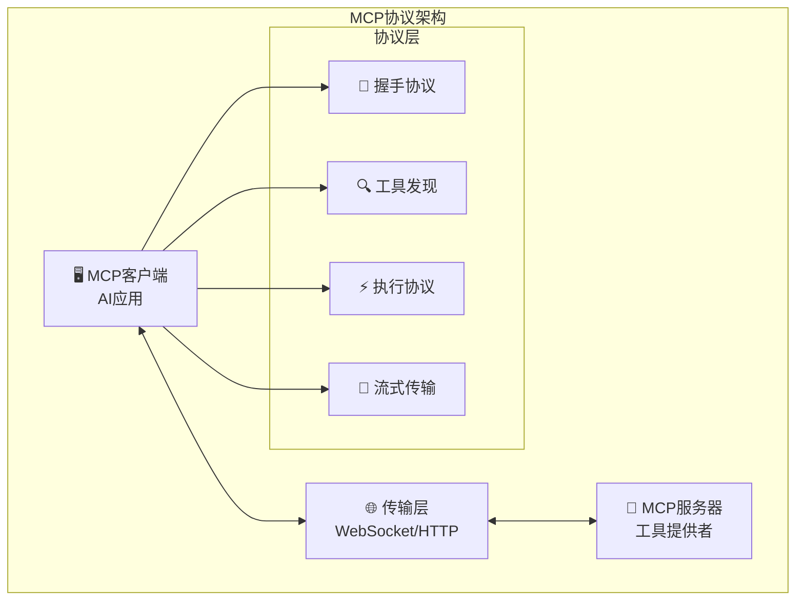

# 4.3.5 工具扩展运行层的工程化实践

> "理论再完美，也需要通过工程化实践来检验和完善。本节将理论转化为可落地的工程方案，解决实际部署中的关键问题。"

## 🎯 本节学习目标

完成本节学习后，您将能够：
- ✅ 掌握MCP协议等标准化工具集成方案
- ✅ 解决工具并发执行和资源竞争问题
- ✅ 实现完善的异常处理和故障恢复机制
- ✅ 构建企业级的工具运行监控体系

## 标准化工具集成

### MCP协议实现

Model Context Protocol (MCP)是工具标准化集成的重要协议，为AI应用提供了统一的工具接口标准：



#### MCP客户端实现

```python
import asyncio
import json
import websockets
from typing import Dict, List, Any, Optional, AsyncGenerator
from dataclasses import dataclass
from enum import Enum

class MCPMessageType(Enum):
    INITIALIZE = "initialize"
    INITIALIZED = "initialized"
    LIST_TOOLS = "tools/list"
    CALL_TOOL = "tools/call"
    RESULT = "result"
    ERROR = "error"
    NOTIFICATION = "notification"

@dataclass
class MCPTool:
    """MCP工具描述"""
    name: str
    description: str
    inputSchema: Dict[str, Any]
    outputSchema: Optional[Dict[str, Any]] = None

@dataclass
class MCPMessage:
    """MCP消息格式"""
    jsonrpc: str = "2.0"
    id: Optional[str] = None
    method: Optional[str] = None
    params: Optional[Dict[str, Any]] = None
    result: Optional[Any] = None
    error: Optional[Dict[str, Any]] = None

class MCPClient:
    """MCP协议客户端"""
    
    def __init__(self, server_uri: str):
        self.server_uri = server_uri
        self.websocket = None
        self.connected = False
        self.request_counter = 0
        self.pending_requests = {}
        self.available_tools = {}
        self.message_handlers = {
            "result": self._handle_result,
            "error": self._handle_error,
            "notification": self._handle_notification
        }
    
    async def connect(self) -> bool:
        """连接MCP服务器"""
        try:
            self.websocket = await websockets.connect(self.server_uri)
            
            # 启动消息监听
            asyncio.create_task(self._message_listener())
            
            # 执行握手
            if await self._handshake():
                # 获取可用工具列表
                await self._discover_tools()
                self.connected = True
                return True
            
            return False
            
        except Exception as e:
            self.logger.error(f"Failed to connect to MCP server: {e}")
            return False
    
    async def _handshake(self) -> bool:
        """执行MCP握手协议"""
        
        initialize_message = MCPMessage(
            id=self._generate_request_id(),
            method=MCPMessageType.INITIALIZE.value,
            params={
                "protocolVersion": "1.0",
                "capabilities": {
                    "tools": {"listChanged": True}
                },
                "clientInfo": {
                    "name": "AI-Tool-Runtime",
                    "version": "1.0.0"
                }
            }
        )
        
        response = await self._send_request(initialize_message)
        
        if response and not response.error:
            # 发送initialized通知
            initialized_notification = MCPMessage(
                method=MCPMessageType.INITIALIZED.value,
                params={}
            )
            await self._send_notification(initialized_notification)
            return True
        
        return False
    
    async def _discover_tools(self) -> None:
        """发现可用工具"""
        
        list_tools_message = MCPMessage(
            id=self._generate_request_id(),
            method=MCPMessageType.LIST_TOOLS.value,
            params={}
        )
        
        response = await self._send_request(list_tools_message)
        
        if response and response.result:
            tools_data = response.result.get("tools", [])
            for tool_data in tools_data:
                tool = MCPTool(
                    name=tool_data["name"],
                    description=tool_data["description"],
                    inputSchema=tool_data.get("inputSchema", {}),
                    outputSchema=tool_data.get("outputSchema")
                )
                self.available_tools[tool.name] = tool
    
    async def call_tool(self, tool_name: str, arguments: Dict[str, Any]) -> Any:
        """调用工具"""
        
        if tool_name not in self.available_tools:
            raise ValueError(f"Tool {tool_name} not available")
        
        call_message = MCPMessage(
            id=self._generate_request_id(),
            method=MCPMessageType.CALL_TOOL.value,
            params={
                "name": tool_name,
                "arguments": arguments
            }
        )
        
        response = await self._send_request(call_message)
        
        if response.error:
            raise Exception(f"Tool call failed: {response.error}")
        
        return response.result
    
    async def _send_request(self, message: MCPMessage) -> MCPMessage:
        """发送请求并等待响应"""
        
        if not self.connected or not self.websocket:
            raise ConnectionError("Not connected to MCP server")
        
        # 创建响应Future
        response_future = asyncio.Future()
        self.pending_requests[message.id] = response_future
        
        # 发送消息
        await self.websocket.send(json.dumps(message.__dict__))
        
        # 等待响应
        try:
            response = await asyncio.wait_for(response_future, timeout=30.0)
            return response
        except asyncio.TimeoutError:
            if message.id in self.pending_requests:
                del self.pending_requests[message.id]
            raise TimeoutError(f"Request {message.id} timed out")
    
    async def _message_listener(self):
        """消息监听器"""
        
        try:
            async for message_data in self.websocket:
                try:
                    message_dict = json.loads(message_data)
                    
                    # 处理响应消息
                    if "id" in message_dict and message_dict["id"] in self.pending_requests:
                        response = MCPMessage(**message_dict)
                        future = self.pending_requests.pop(response.id)
                        future.set_result(response)
                    
                    # 处理通知消息
                    elif "method" in message_dict:
                        await self._handle_notification(MCPMessage(**message_dict))
                        
                except json.JSONDecodeError as e:
                    self.logger.error(f"Failed to parse MCP message: {e}")
                except Exception as e:
                    self.logger.error(f"Error processing MCP message: {e}")
                    
        except websockets.exceptions.ConnectionClosed:
            self.connected = False
            self.logger.info("MCP connection closed")
        except Exception as e:
            self.logger.error(f"MCP message listener error: {e}")
    
    def _generate_request_id(self) -> str:
        """生成请求ID"""
        self.request_counter += 1
        return f"req_{self.request_counter}"
```

### 工具适配器模式

```python
class ToolAdapter:
    """工具适配器基类"""
    
    def __init__(self, tool_config: Dict[str, Any]):
        self.config = tool_config
        self.tool_id = tool_config["id"]
        self.tool_name = tool_config["name"]
        
    async def adapt_input(self, raw_input: Any) -> Any:
        """适配输入格式"""
        raise NotImplementedError
    
    async def adapt_output(self, raw_output: Any) -> Any:
        """适配输出格式"""
        raise NotImplementedError
    
    async def execute(self, adapted_input: Any) -> Any:
        """执行工具调用"""
        raise NotImplementedError

class APIToolAdapter(ToolAdapter):
    """API工具适配器"""
    
    def __init__(self, tool_config: Dict[str, Any]):
        super().__init__(tool_config)
        self.http_client = HttpClient()
        self.base_url = tool_config.get("base_url")
        self.headers = tool_config.get("headers", {})
        
    async def adapt_input(self, raw_input: Dict[str, Any]) -> Dict[str, Any]:
        """适配API输入格式"""
        
        adapted_input = {
            "method": self.config.get("http_method", "POST"),
            "url": f"{self.base_url}{self.config.get('endpoint')}",
            "headers": {**self.headers, **raw_input.get("headers", {})},
            "timeout": raw_input.get("timeout", 30)
        }
        
        # 处理请求体
        if "data" in raw_input:
            if self.config.get("content_type") == "application/json":
                adapted_input["json"] = raw_input["data"]
            else:
                adapted_input["data"] = raw_input["data"]
        
        # 处理查询参数
        if "params" in raw_input:
            adapted_input["params"] = raw_input["params"]
        
        return adapted_input
    
    async def adapt_output(self, raw_output: Any) -> Dict[str, Any]:
        """适配API输出格式"""
        
        if hasattr(raw_output, 'json'):
            try:
                return {
                    "success": True,
                    "data": raw_output.json(),
                    "status_code": raw_output.status_code,
                    "headers": dict(raw_output.headers)
                }
            except ValueError:
                return {
                    "success": True,
                    "data": raw_output.text,
                    "status_code": raw_output.status_code,
                    "headers": dict(raw_output.headers)
                }
        else:
            return {
                "success": False,
                "error": str(raw_output),
                "status_code": None
            }
    
    async def execute(self, adapted_input: Dict[str, Any]) -> Any:
        """执行API调用"""
        
        try:
            response = await self.http_client.request(**adapted_input)
            return await self.adapt_output(response)
        except Exception as e:
            return {
                "success": False,
                "error": str(e),
                "error_type": type(e).__name__
            }
```

## 并发执行管理

### 并发执行控制器

```python
import asyncio
from asyncio import Semaphore, Queue
from typing import Dict, List, Any, Optional, Callable
import threading
from concurrent.futures import ThreadPoolExecutor, as_completed
from dataclasses import dataclass
import time

@dataclass
class ExecutionTask:
    """执行任务"""
    task_id: str
    tool_name: str
    input_data: Any
    priority: int = 0
    timeout: float = 30.0
    retry_count: int = 0
    max_retries: int = 3
    callback: Optional[Callable] = None

@dataclass
class ExecutionResult:
    """执行结果"""
    task_id: str
    success: bool
    result: Any = None
    error: Optional[str] = None
    execution_time: float = 0.0
    retry_count: int = 0

class ConcurrentExecutionController:
    """并发执行控制器"""
    
    def __init__(self, max_concurrent_tasks: int = 10):
        self.max_concurrent_tasks = max_concurrent_tasks
        self.semaphore = Semaphore(max_concurrent_tasks)
        self.task_queue = Queue()
        self.active_tasks = {}
        self.completed_tasks = {}
        self.resource_locks = {}
        self.thread_pool = ThreadPoolExecutor(max_workers=max_concurrent_tasks)
        self.running = False
        
    async def start(self):
        """启动执行控制器"""
        self.running = True
        # 启动任务调度器
        asyncio.create_task(self._task_scheduler())
        
    async def stop(self):
        """停止执行控制器"""
        self.running = False
        # 等待所有任务完成
        await self._wait_for_completion()
        self.thread_pool.shutdown(wait=True)
    
    async def submit_task(self, task: ExecutionTask) -> str:
        """提交执行任务"""
        await self.task_queue.put(task)
        return task.task_id
    
    async def submit_batch_tasks(self, tasks: List[ExecutionTask]) -> List[str]:
        """批量提交任务"""
        task_ids = []
        for task in tasks:
            await self.task_queue.put(task)
            task_ids.append(task.task_id)
        return task_ids
    
    async def _task_scheduler(self):
        """任务调度器"""
        
        while self.running:
            try:
                # 从队列获取任务（非阻塞）
                try:
                    task = await asyncio.wait_for(
                        self.task_queue.get(), timeout=1.0
                    )
                    
                    # 检查资源可用性
                    if await self._can_execute_task(task):
                        # 创建执行任务
                        execution_coroutine = self._execute_task_with_control(task)
                        asyncio.create_task(execution_coroutine)
                    else:
                        # 资源不足，重新加入队列
                        await self.task_queue.put(task)
                        await asyncio.sleep(0.1)  # 短暂等待
                        
                except asyncio.TimeoutError:
                    continue  # 队列空，继续循环
                    
            except Exception as e:
                self.logger.error(f"Task scheduler error: {e}")
                await asyncio.sleep(1.0)
    
    async def _can_execute_task(self, task: ExecutionTask) -> bool:
        """检查任务是否可以执行"""
        
        # 检查并发限制
        if len(self.active_tasks) >= self.max_concurrent_tasks:
            return False
        
        # 检查资源锁
        resource_key = self._get_resource_key(task)
        if resource_key in self.resource_locks:
            return False
        
        return True
    
    async def _execute_task_with_control(self, task: ExecutionTask):
        """带控制的任务执行"""
        
        async with self.semaphore:
            # 获取资源锁
            resource_key = self._get_resource_key(task)
            if resource_key:
                self.resource_locks[resource_key] = task.task_id
            
            try:
                # 记录任务开始
                self.active_tasks[task.task_id] = task
                start_time = time.time()
                
                # 执行任务
                result = await self._execute_task(task)
                
                # 计算执行时间
                execution_time = time.time() - start_time
                result.execution_time = execution_time
                
                # 记录完成的任务
                self.completed_tasks[task.task_id] = result
                
                # 执行回调
                if task.callback:
                    try:
                        await task.callback(result)
                    except Exception as e:
                        self.logger.error(f"Task callback error: {e}")
                
            except Exception as e:
                # 记录执行失败
                result = ExecutionResult(
                    task_id=task.task_id,
                    success=False,
                    error=str(e),
                    execution_time=time.time() - start_time
                )
                self.completed_tasks[task.task_id] = result
                
            finally:
                # 清理资源
                if task.task_id in self.active_tasks:
                    del self.active_tasks[task.task_id]
                if resource_key in self.resource_locks:
                    del self.resource_locks[resource_key]
    
    async def _execute_task(self, task: ExecutionTask) -> ExecutionResult:
        """执行单个任务"""
        
        for attempt in range(task.max_retries + 1):
            try:
                # 获取工具实例
                tool = await self._get_tool_instance(task.tool_name)
                
                if not tool:
                    return ExecutionResult(
                        task_id=task.task_id,
                        success=False,
                        error=f"Tool {task.tool_name} not found"
                    )
                
                # 执行工具调用（带超时）
                result = await asyncio.wait_for(
                    tool.execute(task.input_data),
                    timeout=task.timeout
                )
                
                return ExecutionResult(
                    task_id=task.task_id,
                    success=True,
                    result=result,
                    retry_count=attempt
                )
                
            except asyncio.TimeoutError:
                if attempt < task.max_retries:
                    await asyncio.sleep(2 ** attempt)  # 指数退避
                    continue
                return ExecutionResult(
                    task_id=task.task_id,
                    success=False,
                    error="Task execution timeout",
                    retry_count=attempt
                )
                
            except Exception as e:
                if attempt < task.max_retries:
                    await asyncio.sleep(2 ** attempt)
                    continue
                return ExecutionResult(
                    task_id=task.task_id,
                    success=False,
                    error=str(e),
                    retry_count=attempt
                )
    
    def _get_resource_key(self, task: ExecutionTask) -> Optional[str]:
        """获取资源键"""
        
        # 对于某些工具，可能需要独占访问
        exclusive_tools = ["file_writer", "database_updater", "config_modifier"]
        
        if task.tool_name in exclusive_tools:
            return f"exclusive_{task.tool_name}"
        
        return None
    
    async def get_task_status(self, task_id: str) -> Optional[str]:
        """获取任务状态"""
        
        if task_id in self.completed_tasks:
            return "completed"
        elif task_id in self.active_tasks:
            return "running"
        else:
            # 检查是否在队列中
            # 注意：这是一个简化的实现，实际中可能需要更复杂的状态跟踪
            return "unknown"
    
    async def cancel_task(self, task_id: str) -> bool:
        """取消任务"""
        
        if task_id in self.active_tasks:
            # 标记任务为取消状态
            task = self.active_tasks[task_id]
            # 实际的取消逻辑会更复杂
            self.logger.info(f"Task {task_id} cancellation requested")
            return True
        
        return False
```

## 异常处理机制

### 异常处理和恢复系统

```python
from enum import Enum
from typing import Dict, List, Any, Optional, Callable
import traceback
import asyncio
from dataclasses import dataclass

class ExceptionSeverity(Enum):
    LOW = "low"
    MEDIUM = "medium"
    HIGH = "high"
    CRITICAL = "critical"

class RecoveryStrategy(Enum):
    RETRY = "retry"
    FALLBACK = "fallback"
    SKIP = "skip"
    ABORT = "abort"
    MANUAL = "manual"

@dataclass
class ExceptionContext:
    """异常上下文"""
    exception_id: str
    task_id: str
    tool_name: str
    exception_type: str
    exception_message: str
    stack_trace: str
    severity: ExceptionSeverity
    timestamp: float
    retry_count: int = 0
    recovery_attempts: List[str] = None

class ExceptionHandler:
    """异常处理器"""
    
    def __init__(self):
        self.exception_strategies = {}
        self.recovery_handlers = {}
        self.exception_history = []
        self.circuit_breakers = {}
        
        # 注册默认策略
        self._register_default_strategies()
    
    def register_strategy(self, 
                         exception_type: str,
                         strategy: RecoveryStrategy,
                         handler: Callable):
        """注册异常处理策略"""
        
        if exception_type not in self.exception_strategies:
            self.exception_strategies[exception_type] = []
        
        self.exception_strategies[exception_type].append({
            "strategy": strategy,
            "handler": handler
        })
    
    async def handle_exception(self, 
                             exception: Exception,
                             context: Dict[str, Any]) -> ExceptionContext:
        """处理异常"""
        
        # 创建异常上下文
        exception_context = ExceptionContext(
            exception_id=self._generate_exception_id(),
            task_id=context.get("task_id", "unknown"),
            tool_name=context.get("tool_name", "unknown"),
            exception_type=type(exception).__name__,
            exception_message=str(exception),
            stack_trace=traceback.format_exc(),
            severity=self._assess_severity(exception),
            timestamp=time.time(),
            retry_count=context.get("retry_count", 0)
        )
        
        # 记录异常历史
        self.exception_history.append(exception_context)
        
        # 检查断路器状态
        if self._should_trigger_circuit_breaker(exception_context):
            self._trigger_circuit_breaker(exception_context.tool_name)
        
        # 执行恢复策略
        await self._execute_recovery_strategy(exception_context)
        
        return exception_context
    
    def _register_default_strategies(self):
        """注册默认异常处理策略"""
        
        # 网络异常 - 重试策略
        self.register_strategy(
            "ConnectionError",
            RecoveryStrategy.RETRY,
            self._retry_with_backoff
        )
        
        self.register_strategy(
            "TimeoutError",
            RecoveryStrategy.RETRY,
            self._retry_with_backoff
        )
        
        # 权限异常 - 回退策略
        self.register_strategy(
            "PermissionError",
            RecoveryStrategy.FALLBACK,
            self._use_fallback_tool
        )
        
        # 数据异常 - 跳过策略
        self.register_strategy(
            "ValidationError",
            RecoveryStrategy.SKIP,
            self._skip_with_warning
        )
        
        # 严重异常 - 中止策略
        self.register_strategy(
            "CriticalSystemError",
            RecoveryStrategy.ABORT,
            self._abort_execution
        )
    
    async def _execute_recovery_strategy(self, context: ExceptionContext):
        """执行恢复策略"""
        
        exception_type = context.exception_type
        strategies = self.exception_strategies.get(exception_type, [])
        
        if not strategies:
            # 没有注册策略，使用默认处理
            await self._default_exception_handling(context)
            return
        
        # 尝试每种策略
        for strategy_config in strategies:
            try:
                strategy = strategy_config["strategy"]
                handler = strategy_config["handler"]
                
                success = await handler(context)
                
                if success:
                    self.logger.info(
                        f"Recovery successful using {strategy.value} for {context.exception_id}"
                    )
                    return
                    
            except Exception as e:
                self.logger.error(f"Recovery strategy failed: {e}")
                continue
        
        # 所有策略都失败，记录并上报
        await self._escalate_exception(context)
    
    async def _retry_with_backoff(self, context: ExceptionContext) -> bool:
        """重试策略（带指数退避）"""
        
        max_retries = 3
        if context.retry_count >= max_retries:
            return False
        
        # 计算退避时间
        backoff_time = min(2 ** context.retry_count, 30)  # 最大30秒
        
        self.logger.info(
            f"Retrying task {context.task_id} after {backoff_time}s "
            f"(attempt {context.retry_count + 1})"
        )
        
        await asyncio.sleep(backoff_time)
        
        # 这里应该重新提交任务到执行队列
        # 实际实现会依赖于具体的任务调度系统
        return True
    
    async def _use_fallback_tool(self, context: ExceptionContext) -> bool:
        """回退工具策略"""
        
        # 查找回退工具
        fallback_tool = await self._find_fallback_tool(context.tool_name)
        
        if fallback_tool:
            self.logger.info(
                f"Using fallback tool {fallback_tool} for {context.tool_name}"
            )
            # 实际实现中会重新执行任务
            return True
        
        return False
    
    async def _skip_with_warning(self, context: ExceptionContext) -> bool:
        """跳过策略"""
        
        self.logger.warning(
            f"Skipping task {context.task_id} due to {context.exception_type}: "
            f"{context.exception_message}"
        )
        
        # 标记任务为跳过状态
        return True
    
    async def _abort_execution(self, context: ExceptionContext) -> bool:
        """中止执行策略"""
        
        self.logger.critical(
            f"Aborting execution due to critical error in task {context.task_id}: "
            f"{context.exception_message}"
        )
        
        # 发送紧急通知
        await self._send_critical_alert(context)
        
        # 中止相关的所有任务
        await self._abort_related_tasks(context)
        
        return True
    
    def _assess_severity(self, exception: Exception) -> ExceptionSeverity:
        """评估异常严重程度"""
        
        critical_exceptions = [
            "SystemExit", "KeyboardInterrupt", "MemoryError", "SystemError"
        ]
        high_exceptions = [
            "PermissionError", "SecurityError", "AuthenticationError"
        ]
        medium_exceptions = [
            "TimeoutError", "ConnectionError", "HTTPError"
        ]
        
        exception_type = type(exception).__name__
        
        if exception_type in critical_exceptions:
            return ExceptionSeverity.CRITICAL
        elif exception_type in high_exceptions:
            return ExceptionSeverity.HIGH
        elif exception_type in medium_exceptions:
            return ExceptionSeverity.MEDIUM
        else:
            return ExceptionSeverity.LOW
    
    def _should_trigger_circuit_breaker(self, context: ExceptionContext) -> bool:
        """判断是否应该触发断路器"""
        
        tool_name = context.tool_name
        
        # 统计最近的异常频率
        recent_exceptions = [
            exc for exc in self.exception_history[-100:]  # 最近100个异常
            if exc.tool_name == tool_name and 
               time.time() - exc.timestamp < 300  # 5分钟内
        ]
        
        # 如果5分钟内异常超过10次，触发断路器
        return len(recent_exceptions) > 10
    
    def _trigger_circuit_breaker(self, tool_name: str):
        """触发断路器"""
        
        self.circuit_breakers[tool_name] = {
            "opened_at": time.time(),
            "failure_count": self._get_recent_failure_count(tool_name),
            "state": "open"
        }
        
        self.logger.warning(f"Circuit breaker opened for tool {tool_name}")
```

## 监控与日志系统

### 综合监控系统

```python
import asyncio
import json
from typing import Dict, List, Any, Optional
from dataclasses import dataclass, asdict
from datetime import datetime, timedelta
import psutil
import time

@dataclass
class PerformanceMetrics:
    """性能指标"""
    timestamp: float
    cpu_usage: float
    memory_usage: float
    active_tasks: int
    completed_tasks: int
    failed_tasks: int
    average_execution_time: float
    throughput: float  # 每秒处理任务数

@dataclass
class ToolMetrics:
    """工具指标"""
    tool_name: str
    total_calls: int
    successful_calls: int
    failed_calls: int
    average_response_time: float
    min_response_time: float
    max_response_time: float
    last_call_time: float

class MonitoringSystem:
    """监控系统"""
    
    def __init__(self, metrics_retention_hours: int = 24):
        self.metrics_history = []
        self.tool_metrics = {}
        self.alerts = []
        self.metrics_retention = metrics_retention_hours
        self.monitoring_active = False
        self.metric_collectors = []
        
    async def start_monitoring(self):
        """启动监控"""
        self.monitoring_active = True
        
        # 启动指标收集任务
        asyncio.create_task(self._collect_metrics())
        asyncio.create_task(self._cleanup_old_metrics())
        asyncio.create_task(self._analyze_metrics())
    
    async def stop_monitoring(self):
        """停止监控"""
        self.monitoring_active = False
    
    async def _collect_metrics(self):
        """收集性能指标"""
        
        while self.monitoring_active:
            try:
                # 收集系统指标
                metrics = PerformanceMetrics(
                    timestamp=time.time(),
                    cpu_usage=psutil.cpu_percent(interval=1),
                    memory_usage=psutil.virtual_memory().percent,
                    active_tasks=self._get_active_task_count(),
                    completed_tasks=self._get_completed_task_count(),
                    failed_tasks=self._get_failed_task_count(),
                    average_execution_time=self._calculate_average_execution_time(),
                    throughput=self._calculate_throughput()
                )
                
                self.metrics_history.append(metrics)
                
                # 检查告警条件
                await self._check_alert_conditions(metrics)
                
                await asyncio.sleep(60)  # 每分钟收集一次
                
            except Exception as e:
                self.logger.error(f"Metrics collection error: {e}")
                await asyncio.sleep(60)
    
    async def _analyze_metrics(self):
        """分析指标趋势"""
        
        while self.monitoring_active:
            try:
                if len(self.metrics_history) >= 10:  # 至少10个数据点
                    # 分析CPU趋势
                    cpu_trend = self._analyze_cpu_trend()
                    if cpu_trend == "increasing":
                        await self._create_alert(
                            "HIGH_CPU_TREND",
                            "CPU usage showing increasing trend",
                            "warning"
                        )
                    
                    # 分析内存趋势
                    memory_trend = self._analyze_memory_trend()
                    if memory_trend == "increasing":
                        await self._create_alert(
                            "HIGH_MEMORY_TREND",
                            "Memory usage showing increasing trend",
                            "warning"
                        )
                    
                    # 分析吞吐量趋势
                    throughput_trend = self._analyze_throughput_trend()
                    if throughput_trend == "decreasing":
                        await self._create_alert(
                            "DECLINING_THROUGHPUT",
                            "System throughput is declining",
                            "warning"
                        )
                
                await asyncio.sleep(300)  # 每5分钟分析一次
                
            except Exception as e:
                self.logger.error(f"Metrics analysis error: {e}")
                await asyncio.sleep(300)
    
    def record_tool_execution(self, 
                            tool_name: str,
                            success: bool,
                            execution_time: float):
        """记录工具执行指标"""
        
        if tool_name not in self.tool_metrics:
            self.tool_metrics[tool_name] = ToolMetrics(
                tool_name=tool_name,
                total_calls=0,
                successful_calls=0,
                failed_calls=0,
                average_response_time=0.0,
                min_response_time=float('inf'),
                max_response_time=0.0,
                last_call_time=time.time()
            )
        
        metrics = self.tool_metrics[tool_name]
        metrics.total_calls += 1
        metrics.last_call_time = time.time()
        
        if success:
            metrics.successful_calls += 1
        else:
            metrics.failed_calls += 1
        
        # 更新响应时间统计
        metrics.min_response_time = min(metrics.min_response_time, execution_time)
        metrics.max_response_time = max(metrics.max_response_time, execution_time)
        
        # 更新平均响应时间（移动平均）
        if metrics.total_calls == 1:
            metrics.average_response_time = execution_time
        else:
            # 使用指数移动平均
            alpha = 0.1  # 平滑因子
            metrics.average_response_time = (
                alpha * execution_time + 
                (1 - alpha) * metrics.average_response_time
            )
    
    async def _check_alert_conditions(self, metrics: PerformanceMetrics):
        """检查告警条件"""
        
        # CPU使用率告警
        if metrics.cpu_usage > 80:
            await self._create_alert(
                "HIGH_CPU_USAGE",
                f"CPU usage: {metrics.cpu_usage:.1f}%",
                "warning" if metrics.cpu_usage < 90 else "critical"
            )
        
        # 内存使用率告警
        if metrics.memory_usage > 85:
            await self._create_alert(
                "HIGH_MEMORY_USAGE", 
                f"Memory usage: {metrics.memory_usage:.1f}%",
                "warning" if metrics.memory_usage < 95 else "critical"
            )
        
        # 任务失败率告警
        if metrics.failed_tasks > 0:
            failure_rate = metrics.failed_tasks / (metrics.completed_tasks + metrics.failed_tasks)
            if failure_rate > 0.1:  # 10%失败率
                await self._create_alert(
                    "HIGH_FAILURE_RATE",
                    f"Task failure rate: {failure_rate:.1%}",
                    "warning" if failure_rate < 0.2 else "critical"
                )
        
        # 吞吐量告警
        if metrics.throughput < 1.0:  # 每秒少于1个任务
            await self._create_alert(
                "LOW_THROUGHPUT",
                f"Low system throughput: {metrics.throughput:.2f} tasks/sec",
                "warning"
            )
    
    async def _create_alert(self, alert_type: str, message: str, severity: str):
        """创建告警"""
        
        alert = {
            "type": alert_type,
            "message": message,
            "severity": severity,
            "timestamp": time.time(),
            "acknowledged": False
        }
        
        self.alerts.append(alert)
        
        # 发送告警通知
        await self._send_alert_notification(alert)
    
    def get_dashboard_data(self) -> Dict[str, Any]:
        """获取仪表板数据"""
        
        if not self.metrics_history:
            return {"error": "No metrics available"}
        
        latest_metrics = self.metrics_history[-1]
        
        return {
            "system_status": {
                "cpu_usage": latest_metrics.cpu_usage,
                "memory_usage": latest_metrics.memory_usage,
                "active_tasks": latest_metrics.active_tasks,
                "throughput": latest_metrics.throughput
            },
            "tool_metrics": {
                name: asdict(metrics) 
                for name, metrics in self.tool_metrics.items()
            },
            "recent_alerts": [
                alert for alert in self.alerts[-10:]  # 最近10个告警
                if not alert["acknowledged"]
            ],
            "performance_trends": {
                "cpu_trend": self._get_recent_cpu_values(),
                "memory_trend": self._get_recent_memory_values(),
                "throughput_trend": self._get_recent_throughput_values()
            }
        }
```

## 本节总结

本节深入介绍了工具扩展运行层的工程化实践：

### 🎯 核心实现要点
1. **标准化集成**：基于MCP协议的统一工具接口
2. **并发控制**：信号量、资源锁、任务队列的协同管理
3. **异常处理**：多策略恢复和断路器保护机制
4. **监控体系**：全方位的性能监控和告警系统

### 🔧 关键技术方案
- MCP协议客户端和工具适配器的实现
- 基于信号量和资源锁的并发控制算法
- 多层次异常处理和自动恢复机制
- 实时性能监控和趋势分析系统

### 🚀 工程化价值
- **标准化**：统一的工具接口提高互操作性
- **高并发**：充分利用系统资源提升处理能力
- **高可靠**：完善的异常处理确保系统稳定
- **可观测**：全面的监控为运维提供数据支撑

---

**下一步学习**：掌握了基本的工程化实践后，我们将在4.3.6节学习性能优化与监控的深入内容，了解如何进一步提升系统性能和运维效率。

> **💡 实践建议**：工程化实践的关键在于循序渐进，建议先在小规模环境中验证各个组件，然后逐步扩展到生产环境，并持续优化各项指标。
