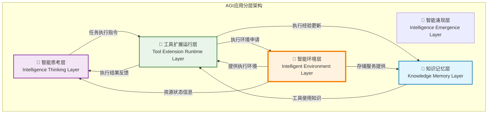
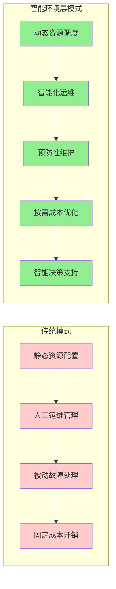
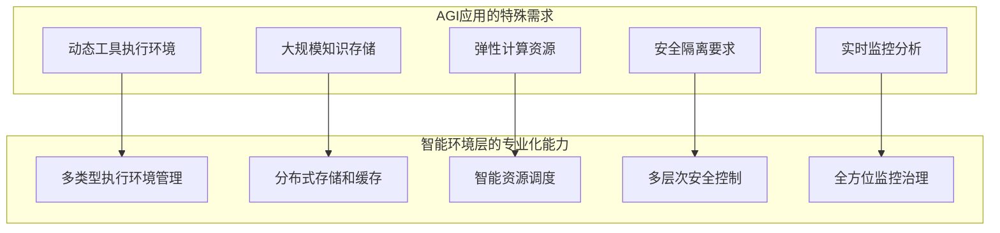
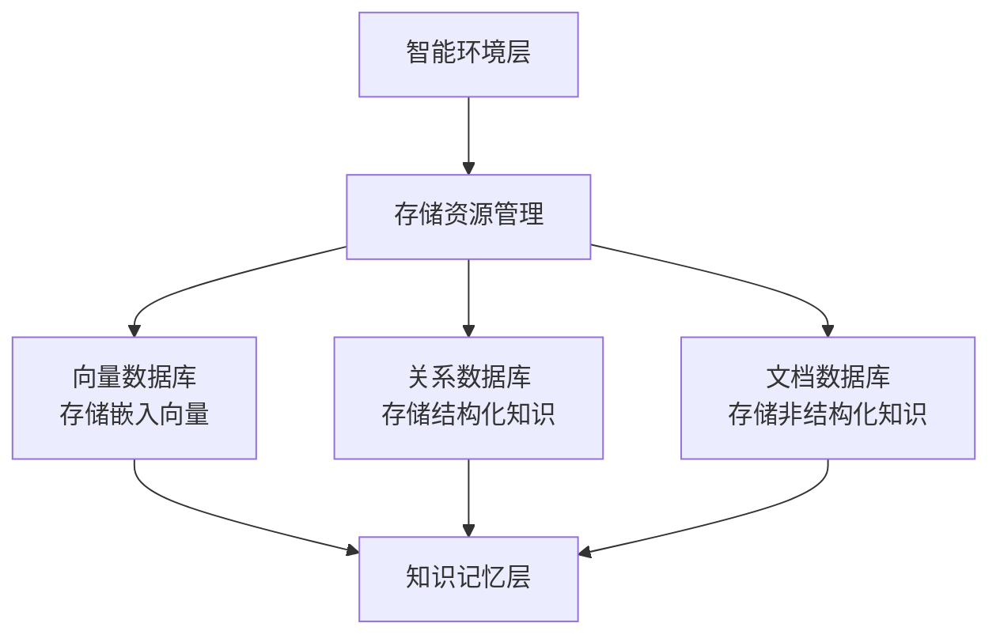

# 4.4.0 智能环境层概述

> "智能环境层是AGI应用的基石，它不仅提供执行环境，更是构建智能生态的土壤。只有坚实的基础设施，才能支撑起智能应用的参天大厦。"

## 从工具执行到环境支撑的升华

在学习了工具扩展运行层（4.3章）后，我们深入理解了AGI应用如何动态创造和编排工具。现在我们进入**智能环境层**，这是为上层所有智能活动提供基础支撑的关键层次。

### 📊 在AGI架构中的基础地位

**层间协作关系**：
- **智能思考层 ↔ 工具扩展运行层**：思考层下达任务执行指令，工具层反馈执行结果
- **知识记忆层 ↔ 工具扩展运行层**：知识层提供工具使用知识，工具层更新执行经验
- **工具扩展运行层 ↔ 智能环境层**：工具层申请执行环境，环境层提供容器化环境、虚拟机、沙箱隔离
- **智能环境层 → 知识记忆层**：提供分布式存储、缓存系统、数据库服务
- **智能环境层 → 智能思考层**：报告资源状态信息，支持决策优化

## 智能环境层核心定义

**智能环境层（Intelligent Environment Layer）** 是为AGI应用提供运行支撑的基础设施层，它构建了一个介于底层硬件资源和上层智能体应用之间的中间抽象层。该层次的设计目标是为智能体提供一个安全、高效、可扩展、可控的执行环境，同时支持复杂的智能涌现现象。

### 核心特征

#### 1. 环境隔离性
- **多租户隔离**：支持不同用户、项目、任务的完全隔离
- **资源边界控制**：严格的资源使用限制和边界管理
- **安全域分离**：不同安全级别的执行环境物理或逻辑分离
#### 2. 安全可控性
- **零信任架构**：基于身份验证的全方位安全控制
- **合规保障**：满足各种行业法规和安全标准要求
- **审计追溯**：完整的操作记录和行为分析能力
#### 3. 资源弹性化
- **动态扩缩容**：根据任务要求自动调整资源分配

#### 4. 智能化管理
- **自动化运维**：减少人工干预的智能化运维体系
- **预测性维护**：基于数据分析的故障预测和主动维护
- **自愈能力**：系统故障的自动检测、隔离和恢复

## 核心组件架构

```mermaid
graph TB
    subgraph "智能环境层架构"
        ENV_CORE[🐳 智能环境层<br/>Intelligent Environment Layer]
        
        subgraph "执行环境管理"
            CONTAINER[📦 容器管理<br/>Container Management]
            VM[🖥️ 虚拟机管理<br/>VM Management]
            SANDBOX[🏛️ 沙箱环境<br/>Sandbox Environment]
            SERVERLESS[⚡ Serverless环境<br/>Serverless Runtime]
        end
        
        subgraph "智能资源调度"
            SCHEDULER[🎯 资源调度器<br/>Resource Scheduler]
            AUTOSCALER[📈 自动伸缩器<br/>Auto Scaler]
            OPTIMIZER[⚡ 资源优化器<br/>Resource Optimizer]
            MONITOR[📊 资源监控器<br/>Resource Monitor]
        end
        
        subgraph "安全控制中心"
            NETWORK_SEC[🌐 网络安全<br/>Network Security]
            ACCESS_CTL[🔐 访问控制<br/>Access Control]
            COMPLIANCE[📜 合规管理<br/>Compliance Management]
            AUDIT[📋 审计中心<br/>Audit Center]
        end
        
        subgraph "环境监控治理"
            HEALTH_CHECK[💊 健康检查<br/>Health Check]
            ALERTING[🚨 告警系统<br/>Alerting System]
            LOGGING[📝 日志管理<br/>Log Management]
            METRICS[📈 指标收集<br/>Metrics Collection]
        end
        
        ENV_CORE --> CONTAINER
        ENV_CORE --> SCHEDULER
        ENV_CORE --> NETWORK_SEC
        ENV_CORE --> HEALTH_CHECK
    end
    
    subgraph "外部系统交互"
        CLOUD_PROVIDERS[☁️ 云服务商]
        K8S[⚓ Kubernetes]
        STORAGE[💾 存储系统]
        NETWORKING[🌐 网络基础设施]
    end
    
    ENV_CORE --> CLOUD_PROVIDERS
    ENV_CORE --> K8S
    ENV_CORE --> STORAGE
    ENV_CORE --> NETWORKING
```

### 📦 执行环境管理
**核心职责**：提供多种类型的执行环境选择
- **程序运行环境**：Python虚拟环境、Node Js 环境等
- **容器管理**：基于Docker/Kubernetes的容器化环境管理
- **虚拟机管理**：传统虚拟机的创建、配置和生命周期管理
- **沙箱环境**：高安全性的隔离执行环境
- **Serverless环境**：按需执行的无服务器计算环境

### 🔐 安全控制中心
**核心职责**：确保环境安全和合规运行
- **访问控制**：基于身份的细粒度访问控制和权限管理
- **合规管理**：确保符合行业法规和企业安全标准
- **审计中心**：全面的操作审计和安全事件分析

### 🎯 智能资源调度
**核心职责**：根据任务要求自动调整资源分配
- **资源调度器**：基于任务规划智能资源分配
- **自动伸缩器**：根据需求动态调整资源规模
- **资源优化器**：持续优化资源使用效率和成本
- **资源监控器**：实时监控资源使用状况和性能指标

### 📊 环境监控治理
**核心职责**：维护环境健康和运行状态
- **健康检查**：系统组件的健康状态监测和诊断
- **告警系统**：异常情况的及时发现和通知机制
- **日志管理**：集中化的日志收集、存储和分析
- **指标收集**：性能指标的收集、聚合和可视化

## 技术创新与价值

### 传统基础设施 vs 智能环境层

传统IT基础设施往往是静态配置的，而智能环境层实现了动态、智能化的环境管理：

**关键差异对比**：

| 维度 | 传统基础设施 | 智能环境层 |
|------|-------------|-----------|
| **资源管理** | 静态预分配 | 动态智能调度 |
| **扩展方式** | 人工扩容 | 自动弹性伸缩 |
| **故障处理** | 被动响应 | 主动预防+自愈 |
| **成本控制** | 固定成本 | 按需优化 |
| **运维方式** | 人工运维 | 智能化运维 |
| **安全保障** | 边界防护 | 零信任架构 |

### 智能环境层的核心价值

#### 🎯 为AGI应用提供专业化支撑

不同于传统应用，AGI应用具有独特的环境需求：

#### ⚡ 智能化运维的技术突破

- **自动故障恢复**：基于AI的故障模式识别和自动修复
- **预测性维护**：通过数据分析预测潜在问题并提前处理
- **智能资源优化**：基于历史数据和实时负载的智能资源分配
- **自适应安全策略**：根据威胁情况动态调整安全防护措施

## 实际应用场景

### 🏢 企业级AGI部署场景
**场景描述**：大型企业部署AGI应用处理业务流程自动化

**环境层提供的支撑**：
1. **多环境管理**：开发、测试、预生产、生产环境的统一管理
2. **资源隔离**：不同部门、项目间的资源完全隔离
3. **安全合规**：满足企业安全标准和行业法规要求
4. **弹性扩展**：根据业务负载自动调整资源配置

### 🌐 多云AGI服务场景
**场景描述**：AGI服务需要在多个云平台间灵活部署和迁移

**环境层提供的能力**：
1. **云平台抽象**：屏蔽不同云平台的差异，提供统一接口
2. **跨云资源调度**：在多个云平台间智能分配和调度资源
3. **数据同步**：确保跨云环境下数据的一致性和可用性
4. **故障切换**：单云故障时的快速切换和服务恢复

### 🔬 科研计算AGI场景
**场景描述**：科研机构使用AGI进行复杂的科学计算和数据分析

**环境层特殊支撑**：
1. **高性能计算**：GPU集群、大内存实例的智能调度
2. **数据管理**：大规模科研数据的存储、备份和访问管理
3. **实验隔离**：不同研究项目的完全隔离和独立环境
4. **成本控制**：基于项目预算的资源使用控制和优化

## 与其他层的协同机制

### 向上支撑：为上层提供基础能力
- **执行环境提供**：为工具扩展运行层提供程序运行环境、容器化环境、虚拟机、沙箱隔离等安全执行空间
- **存储服务支持**：为知识记忆层提供文件存储、分布式存储、缓存系统、数据库等可靠数据存储
- **资源状态反馈**：向智能思考层实时报告资源使用状况，支持决策优化
- **网络连接服务**：为整个系统提供稳定的网络通信和安全隔离

### 横向协调：与基础设施的集成
- **云平台对接**：与各大云服务商的深度集成
- **容器编排系统**：与Kubernetes等容器编排系统协作
- **存储系统集成**：与分布式存储、数据库系统集成
- **监控系统对接**：与企业级监控和运维系统集成

## 本章学习路径

本章采用"理论→设计→实现→运维"的实践导向学习路径：

### 📚 学习阶段规划

#### 第一阶段：理论基础建立（4.4.1）
**学习目标**：理解智能环境层的设计原则和理论基础
- 🎯 核心内容：环境隔离、资源弹性、智能管理的理论基础
- 🔗 学习重点：从传统运维向智能运维的思维转变

#### 第二阶段：架构设计深入（4.4.2-4.4.4）
**学习目标**：掌握核心组件的设计和实现方法
- 🎯 **4.4.2**：执行环境管理的多样化设计
- 🎯 **4.4.3**：智能资源调度的算法和策略
- 🎯 **4.4.4**：安全控制与环境隔离的实现

#### 第三阶段：工程实践落地（4.4.5-4.4.6）
**学习目标**：解决实际部署中的工程问题
- 🎯 **4.4.5**：云原生技术栈的工程化实践
- 🎯 **4.4.6**：全面的监控和智能治理实现

#### 第四阶段：企业级应用（4.4.7-4.4.8）
**学习目标**：构建企业级的环境管理能力
- 🎯 **4.4.7**：企业级环境的部署与运维策略
- 🎯 **4.4.8**：DevOps理念的智能化实践

### 🎯 学习成果预期
完成本章学习后，您将能够：
- ✅ 设计AGI应用所需的智能环境架构
- ✅ 实现动态资源调度和自动化运维
- ✅ 构建安全可控的多租户环境
- ✅ 建立企业级的环境治理体系

## 技术发展趋势

智能环境层代表了基础设施领域的重要发展方向：

### 🚀 技术演进趋势
- **云原生深化**：Kubernetes、Service Mesh等技术的深度应用
- **边缘计算融合**：云边端一体化的智能计算网络
- **AI运维普及**：AIOps在基础设施管理中的广泛应用
- **绿色计算推进**：节能减排的可持续发展计算模式

### 💡 创新机会点
- **智能编排**：基于AI的自动化资源编排和优化
- **预测运维**：基于机器学习的故障预测和预防
- **安全智能化**：AI驱动的安全威胁检测和响应
- **成本优化**：多维度的成本分析和优化策略

---

**下一步展望**：建立了智能环境层的整体认知后，我们将在4.4.1节中深入理论基础，学习智能环境层的设计原则，以及如何为AGI应用构建专业化的基础设施支撑。

> **💡 学习提示**：智能环境层是AGI应用的基石，其设计质量直接影响整个系统的稳定性、安全性和性能表现。理解其核心理念和实现方法，对于构建企业级AGI应用至关重要。
