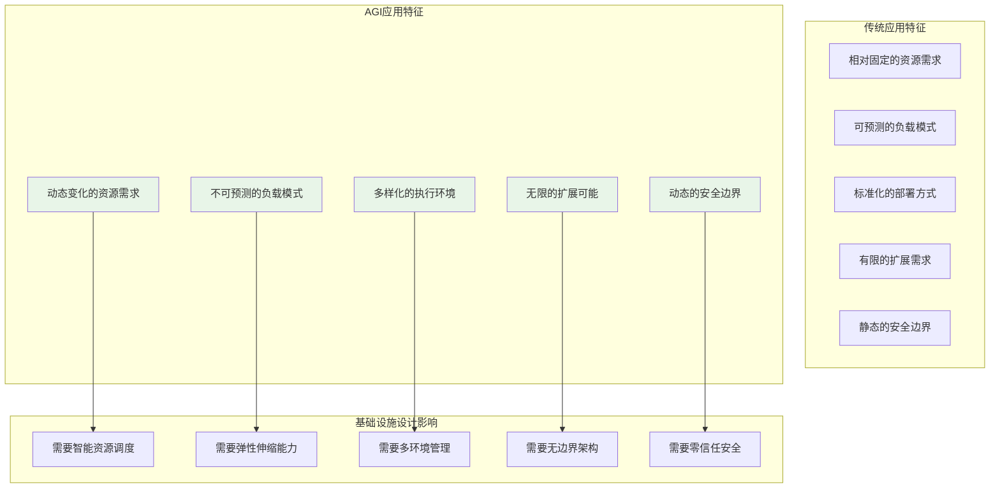
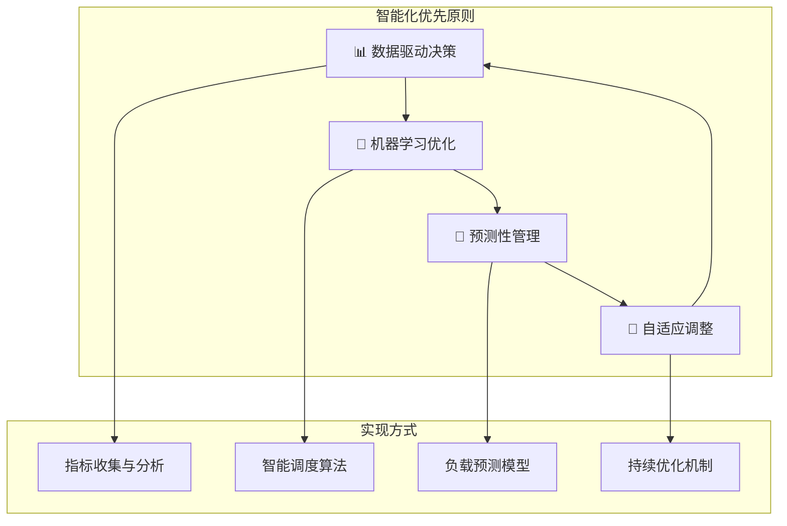
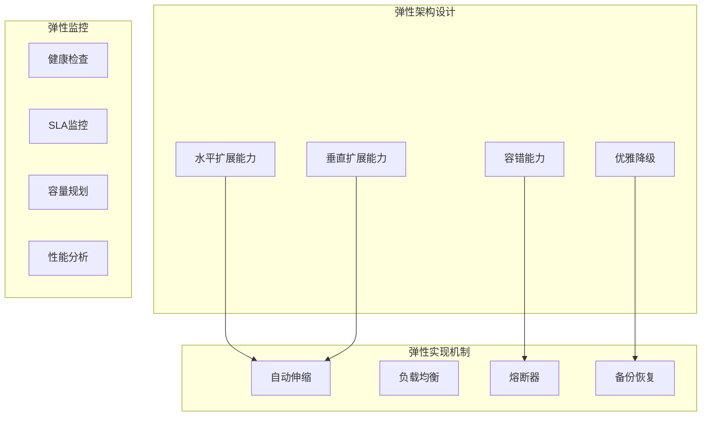
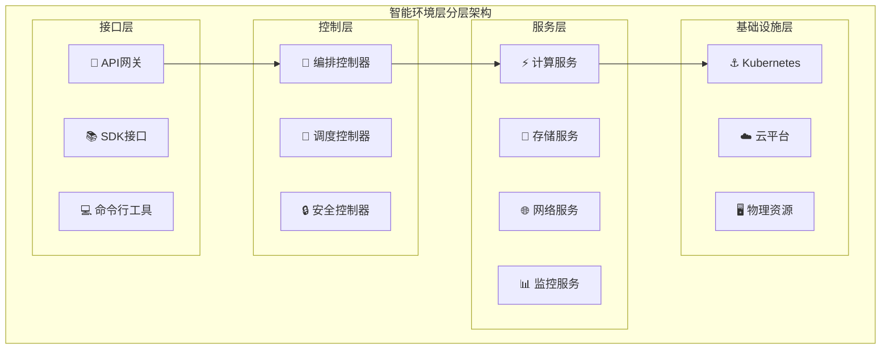

# 4.4.1 智能环境层的理论基础与设计原则

> "智能环境层的设计哲学：不仅要稳如磐石，更要灵动如水。既能提供坚实的基础支撑，又能灵活适应变化的需求。"

## 🎯 本节学习目标

完成本节学习后，您将能够：
- ✅ 理解AGI应用对基础设施的特殊需求和设计挑战
- ✅ 掌握智能环境层的核心设计原则和理论基础
- ✅ 建立云原生、弹性化、智能化的环境设计思维
- ✅ 构建面向AGI应用的基础设施架构理念

## AGI应用的基础设施挑战

### 传统应用 vs AGI应用的基础设施需求

AGI应用与传统应用在基础设施需求上存在根本性差异，这些差异决定了我们需要重新思考和设计基础设施：



### AGI应用的独特基础设施需求

#### 1. 动态计算资源需求

AGI应用的计算需求具有高度的动态性和不可预测性：

- **智能思考层**：需要大量CPU进行推理计算，峰值可能是平时的10-100倍
- **知识记忆层**：需要高速存储和缓存，数据访问模式随任务而变
- **工具扩展运行层**：需要多样化的执行环境，从轻量级容器到高性能GPU集群

#### 2. 多层次安全隔离要求

AGI应用处理的数据往往涉及敏感信息，需要更严格的安全隔离：

- **数据隔离**：不同用户、项目的数据完全隔离
- **计算隔离**：工具执行环境的安全沙箱隔离
- **网络隔离**：细粒度的网络访问控制
- **权限隔离**：基于身份和上下文的动态权限控制

#### 3. 智能化运维需求

AGI应用的复杂性要求更智能的运维管理：

- **自适应资源管理**：根据负载模式自动调整资源配置
- **预测性维护**：基于运行数据预测和预防问题
- **自动故障恢复**：最小化人工干预的故障处理
- **智能成本优化**：动态优化资源使用和成本

## 智能环境层设计原则

### 核心设计哲学

智能环境层的设计遵循"智能优先、安全至上、弹性为本"的核心哲学：

```python
"""
智能环境层设计哲学的代码体现

这不是可执行代码，而是设计理念的抽象表达
"""

class IntelligentEnvironmentLayer:
    """智能环境层的设计哲学"""
    
    def __init__(self):
        # 智能优先：所有决策都基于数据和算法
        self.intelligence_first = True
        self.decision_engine = AIDecisionEngine()
        
        # 安全至上：安全是不可妥协的底线
        self.security_paramount = True
        self.zero_trust_model = ZeroTrustSecurityModel()
        
        # 弹性为本：系统必须能够适应变化
        self.elasticity_core = True
        self.adaptive_scaling = AdaptiveScalingEngine()
    
    def make_decision(self, context):
        """所有环境决策都基于智能分析"""
        
        # 1. 智能分析当前状态
        current_state = self.analyze_current_state(context)
        
        # 2. 预测未来需求
        future_demand = self.predict_future_demand(current_state)
        
        # 3. 生成优化策略
        strategy = self.generate_optimization_strategy(
            current_state, future_demand
        )
        
        # 4. 安全性验证
        if not self.zero_trust_model.validate_security(strategy):
            strategy = self.apply_security_constraints(strategy)
        
        # 5. 弹性调整
        return self.adaptive_scaling.adjust_strategy(strategy)
```

### 设计原则体系

#### 原则一：智能化优先（Intelligence First）

**核心理念**：所有环境管理决策都应基于数据分析和智能算法，而非静态规则。



**设计实现**：
- **数据驱动决策**：基于实时监控数据和历史趋势进行资源调度
- **机器学习优化**：使用ML算法优化资源分配和成本控制
- **预测性管理**：预测系统负载和资源需求变化
- **自适应调整**：根据反馈自动调整管理策略

#### 原则二：安全至上（Security Paramount）

**核心理念**：安全是环境层设计的不可妥协底线，所有功能都必须在安全框架内实现。

```python
class SecurityParamountPrinciple:
    """安全至上原则的设计体现"""
    
    def __init__(self):
        self.security_levels = [
            "network_security",      # 网络层安全
            "infrastructure_security", # 基础设施安全
            "application_security",  # 应用层安全
            "data_security",         # 数据安全
            "identity_security"      # 身份安全
        ]
        
    def validate_all_operations(self, operation):
        """所有操作都必须通过安全验证"""
        
        for security_level in self.security_levels:
            if not self.validate_security_level(operation, security_level):
                raise SecurityViolationError(
                    f"Operation failed {security_level} validation"
                )
        
        return self.execute_with_audit(operation)
    
    def zero_trust_validation(self, request):
        """零信任模型验证"""
        
        # 验证身份
        identity = self.validate_identity(request.user)
        
        # 验证设备
        device = self.validate_device(request.device_info)
        
        # 验证上下文
        context = self.validate_context(request.context)
        
        # 验证权限
        permission = self.validate_permission(
            identity, device, context, request.resource
        )
        
        return all([identity, device, context, permission])
```

**关键安全控制**：
- **零信任架构**：永不信任，始终验证
- **多层防护**：网络、系统、应用、数据多层安全控制
- **动态权限**：基于上下文的动态权限管理
- **全程审计**：所有操作的完整审计追踪

#### 原则三：弹性为本（Elasticity Core）

**核心理念**：系统必须具备应对变化的能力，包括负载变化、需求变化、故障变化。



#### 原则四：可观测性（Observability）

**核心理念**：系统必须是完全可观测的，提供全方位的监控、日志、追踪和分析能力。

```python
class ObservabilityPrinciple:
    """可观测性原则实现"""
    
    def __init__(self):
        # 监控：系统状态的实时观测
        self.monitoring = MonitoringSystem()
        
        # 日志：详细的操作记录
        self.logging = StructuredLoggingSystem()
        
        # 追踪：请求链路的完整追踪
        self.tracing = DistributedTracingSystem()
        
        # 分析：数据的深度分析和洞察
        self.analytics = AnalyticsEngine()
    
    def instrument_operation(self, operation_name):
        """为操作添加可观测性"""
        
        def decorator(func):
            def wrapper(*args, **kwargs):
                # 开始追踪
                span = self.tracing.start_span(operation_name)
                
                # 记录监控指标
                start_time = time.time()
                self.monitoring.increment_counter(f"{operation_name}_started")
                
                try:
                    # 执行操作
                    result = func(*args, **kwargs)
                    
                    # 记录成功
                    execution_time = time.time() - start_time
                    self.monitoring.record_histogram(
                        f"{operation_name}_duration", execution_time
                    )
                    self.logging.info(
                        f"Operation {operation_name} completed successfully",
                        duration=execution_time,
                        result_size=len(str(result))
                    )
                    
                    return result
                    
                except Exception as e:
                    # 记录异常
                    self.monitoring.increment_counter(f"{operation_name}_failed")
                    self.logging.error(
                        f"Operation {operation_name} failed",
                        error=str(e),
                        traceback=traceback.format_exc()
                    )
                    span.set_tag("error", True)
                    raise
                    
                finally:
                    # 结束追踪
                    span.finish()
                    
            return wrapper
        return decorator
```

## 架构设计模式

### 分层解耦模式

智能环境层采用分层解耦的架构模式，确保各层职责清晰、松耦合：



### 事件驱动模式

使用事件驱动架构实现系统组件间的松耦合通信：

```python
class EventDrivenArchitecture:
    """事件驱动架构实现"""
    
    def __init__(self):
        self.event_bus = EventBus()
        self.event_handlers = {}
        
    def register_handler(self, event_type, handler):
        """注册事件处理器"""
        if event_type not in self.event_handlers:
            self.event_handlers[event_type] = []
        self.event_handlers[event_type].append(handler)
    
    async def publish_event(self, event_type, event_data):
        """发布事件"""
        
        event = Event(
            type=event_type,
            data=event_data,
            timestamp=datetime.utcnow(),
            event_id=uuid.uuid4()
        )
        
        # 异步发布到事件总线
        await self.event_bus.publish(event)
        
        # 通知本地处理器
        handlers = self.event_handlers.get(event_type, [])
        for handler in handlers:
            asyncio.create_task(handler.handle(event))

# 事件类型定义
class EnvironmentEvents:
    RESOURCE_ALLOCATED = "resource.allocated"
    RESOURCE_DEALLOCATED = "resource.deallocated"
    CONTAINER_STARTED = "container.started"
    CONTAINER_STOPPED = "container.stopped"
    SECURITY_VIOLATION = "security.violation"
    HEALTH_CHECK_FAILED = "health.check.failed"
    SCALING_TRIGGERED = "scaling.triggered"
```

### 微服务模式

将环境层功能分解为独立的微服务，提高系统的可维护性和可扩展性：

```yaml
# 微服务架构配置示例
services:
  resource-scheduler:
    image: intelligent-env/resource-scheduler:latest
    ports:
      - "8080:8080"
    environment:
      - SERVICE_NAME=resource-scheduler
      - EVENT_BUS_URL=kafka://kafka:9092
    
  container-manager:
    image: intelligent-env/container-manager:latest
    ports:
      - "8081:8081"
    volumes:
      - /var/run/docker.sock:/var/run/docker.sock
    
  security-controller:
    image: intelligent-env/security-controller:latest
    ports:
      - "8082:8082"
    environment:
      - VAULT_URL=https://vault.internal
      - ZERO_TRUST_ENABLED=true
    
  monitoring-service:
    image: intelligent-env/monitoring-service:latest
    ports:
      - "8083:8083"
    volumes:
      - /var/log:/var/log:ro
      - /proc:/host/proc:ro
      - /sys:/host/sys:ro
```

## 性能与可扩展性原则

### 性能优化策略

#### 1. 资源预分配与预热

```python
class ResourcePreallocationStrategy:
    """资源预分配策略"""
    
    def __init__(self):
        self.resource_pool = ResourcePool()
        self.prediction_engine = LoadPredictionEngine()
        
    async def preallocate_resources(self):
        """基于预测的资源预分配"""
        
        # 预测未来1小时的资源需求
        predicted_demand = await self.prediction_engine.predict_demand(
            time_horizon=3600  # 1小时
        )
        
        for resource_type, demand in predicted_demand.items():
            current_available = self.resource_pool.get_available(resource_type)
            
            if demand > current_available:
                # 预分配不足的资源
                additional_needed = demand - current_available + 0.2 * demand  # 20%缓冲
                await self.resource_pool.preallocate(resource_type, additional_needed)
```

#### 2. 缓存优化

```python
class IntelligentCachingStrategy:
    """智能缓存策略"""
    
    def __init__(self):
        self.cache_layers = {
            "l1": InMemoryCache(size_mb=512),
            "l2": RedisCache(size_mb=2048),
            "l3": DiskCache(size_mb=10240)
        }
        self.cache_optimizer = CacheOptimizer()
    
    async def get_cached_data(self, key):
        """多层缓存获取"""
        
        # L1缓存检查
        data = self.cache_layers["l1"].get(key)
        if data:
            return data
        
        # L2缓存检查
        data = await self.cache_layers["l2"].get(key)
        if data:
            # 回填L1缓存
            self.cache_layers["l1"].set(key, data)
            return data
        
        # L3缓存检查
        data = await self.cache_layers["l3"].get(key)
        if data:
            # 回填上层缓存
            await self.cache_layers["l2"].set(key, data)
            self.cache_layers["l1"].set(key, data)
            return data
        
        return None
```

### 可扩展性设计

#### 水平扩展能力

```python
class HorizontalScalingController:
    """水平扩展控制器"""
    
    def __init__(self):
        self.scaling_policies = {}
        self.metric_collector = MetricCollector()
        
    def define_scaling_policy(self, service_name, policy):
        """定义扩展策略"""
        
        self.scaling_policies[service_name] = {
            "min_replicas": policy.min_replicas,
            "max_replicas": policy.max_replicas,
            "target_cpu_utilization": policy.target_cpu_utilization,
            "target_memory_utilization": policy.target_memory_utilization,
            "scale_up_threshold": policy.scale_up_threshold,
            "scale_down_threshold": policy.scale_down_threshold,
            "cooldown_period": policy.cooldown_period
        }
    
    async def evaluate_scaling_decision(self, service_name):
        """评估扩展决策"""
        
        if service_name not in self.scaling_policies:
            return None
        
        policy = self.scaling_policies[service_name]
        current_metrics = await self.metric_collector.get_service_metrics(service_name)
        
        # 计算扩展决策
        cpu_utilization = current_metrics.cpu_utilization
        memory_utilization = current_metrics.memory_utilization
        current_replicas = current_metrics.replica_count
        
        # 扩容决策
        if (cpu_utilization > policy["scale_up_threshold"] or 
            memory_utilization > policy["scale_up_threshold"]):
            
            if current_replicas < policy["max_replicas"]:
                new_replicas = min(
                    current_replicas + 1,
                    policy["max_replicas"]
                )
                return ScalingDecision("scale_up", new_replicas)
        
        # 缩容决策
        elif (cpu_utilization < policy["scale_down_threshold"] and
              memory_utilization < policy["scale_down_threshold"]):
            
            if current_replicas > policy["min_replicas"]:
                new_replicas = max(
                    current_replicas - 1,
                    policy["min_replicas"]
                )
                return ScalingDecision("scale_down", new_replicas)
        
        return ScalingDecision("no_change", current_replicas)
```

## 本节总结

本节建立了智能环境层的完整理论基础：

### 🎯 核心设计理念
1. **智能化优先**：基于数据和算法的智能决策
2. **安全至上**：零信任架构的全方位安全保障
3. **弹性为本**：应对变化的自适应能力
4. **可观测性**：全方位的监控、日志、追踪

### 🏗️ 关键架构模式
- 分层解耦模式确保系统职责清晰
- 事件驱动模式实现组件松耦合
- 微服务模式提高可维护性和可扩展性

### 🚀 性能优化策略
- 资源预分配与预热机制
- 多层智能缓存优化
- 水平和垂直扩展能力

---

**下一步学习**：建立了扎实的理论基础后，我们将在4.4.2节学习执行环境管理的具体实现，了解如何构建多样化的、安全的执行环境。

> **💡 设计思考**：智能环境层的设计需要平衡多个目标：性能与安全、灵活性与稳定性、成本与质量。关键是找到适合具体业务场景的最优平衡点。
