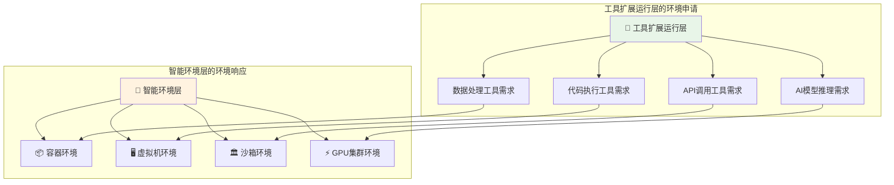

# 4.4.2 执行环境管理的架构设计

> "执行环境是AI应用的舞台，不同的任务需要不同的舞台。智能环境管理的艺术在于为每个演出提供最合适的舞台，让智能应用的每一次执行都能发挥最佳性能。"

## 🎯 本节学习目标

完成本节学习后，您将能够：
- ✅ 设计多层次的执行环境管理体系
- ✅ 实现容器化、虚拟化和沙箱环境的统一管理
- ✅ 构建响应工具运行层需求的环境分配机制
- ✅ 建立环境生命周期管理和监控体系

## 多类型执行环境概述

### AI应用的环境需求特点

基于我们修正的架构关系，工具扩展运行层会向智能环境层申请不同类型的执行环境。AI应用的环境需求具有以下特点：



### 环境类型对比分析

不同执行环境的技术特点和适用场景对比：

| 环境类型 | 启动速度 | 资源隔离 | 安全性 | 适用场景 | 资源开销 |
|---------|----------|----------|--------|----------|----------|
| **容器环境** | 秒级 | 进程级 | 中等 | 微服务、快速部署 | 低 |
| **虚拟机环境** | 分钟级 | 系统级 | 高 | 完整系统环境 | 高 |
| **沙箱环境** | 秒级 | 进程级+ | 很高 | 不trusted代码执行 | 中等 |
| **Serverless环境** | 毫秒级 | 函数级 | 高 | 事件驱动任务 | 极低 |

### 环境选择决策算法

```python
from typing import Dict, Any, List
from dataclasses import dataclass
from enum import Enum

class EnvironmentType(Enum):
    CONTAINER = "container"
    VIRTUAL_MACHINE = "virtual_machine"
    SANDBOX = "sandbox"
    SERVERLESS = "serverless"
    GPU_CLUSTER = "gpu_cluster"

@dataclass
class EnvironmentRequirement:
    """环境需求定义"""
    tool_type: str
    security_level: str  # low, medium, high, critical
    resource_needs: Dict[str, Any]
    execution_time_estimate: float  # seconds
    isolation_level: str  # process, container, vm, bare_metal
    network_access: bool
    persistent_storage: bool
    gpu_required: bool

class EnvironmentSelector:
    """环境选择决策引擎"""
    
    def __init__(self):
        self.selection_rules = self._initialize_selection_rules()
        self.environment_capabilities = self._initialize_environment_capabilities()
        
    def select_environment(self, requirement: EnvironmentRequirement) -> EnvironmentType:
        """智能选择执行环境"""
        
        # 1. 安全级别过滤
        security_filtered = self._filter_by_security_level(requirement.security_level)
        
        # 2. 资源需求匹配
        resource_matched = self._match_resource_requirements(
            security_filtered, requirement.resource_needs
        )
        
        # 3. 性能效率评估
        performance_scored = self._score_by_performance(
            resource_matched, requirement.execution_time_estimate
        )
        
        # 4. 成本效益分析
        cost_optimized = self._optimize_by_cost(performance_scored, requirement)
        
        return cost_optimized[0] if cost_optimized else EnvironmentType.CONTAINER
    
    def _initialize_selection_rules(self) -> Dict[str, Any]:
        """初始化选择规则"""
        
        return {
            "security_critical": {
                "required_isolation": "vm",
                "network_restrictions": True,
                "audit_required": True
            },
            "gpu_intensive": {
                "environment_types": [EnvironmentType.GPU_CLUSTER],
                "resource_scaling": "vertical"
            },
            "short_lived_tasks": {
                "preferred_types": [EnvironmentType.SERVERLESS, EnvironmentType.CONTAINER],
                "startup_time_priority": "high"
            },
            "data_processing": {
                "preferred_types": [EnvironmentType.CONTAINER, EnvironmentType.VIRTUAL_MACHINE],
                "storage_requirements": "high"
            }
        }
    
    def _filter_by_security_level(self, security_level: str) -> List[EnvironmentType]:
        """根据安全级别过滤环境类型"""
        
        security_mappings = {
            "low": [EnvironmentType.CONTAINER, EnvironmentType.SERVERLESS],
            "medium": [EnvironmentType.CONTAINER, EnvironmentType.SANDBOX, EnvironmentType.SERVERLESS],
            "high": [EnvironmentType.SANDBOX, EnvironmentType.VIRTUAL_MACHINE],
            "critical": [EnvironmentType.VIRTUAL_MACHINE]
        }
        
        return security_mappings.get(security_level, [EnvironmentType.CONTAINER])
    
    def _score_by_performance(self, 
                            environment_types: List[EnvironmentType],
                            execution_time: float) -> List[EnvironmentType]:
        """根据性能需求评分排序"""
        
        performance_scores = {}
        
        for env_type in environment_types:
            score = 0
            
            # 启动时间评分
            startup_times = {
                EnvironmentType.SERVERLESS: 0.1,
                EnvironmentType.CONTAINER: 2.0,
                EnvironmentType.SANDBOX: 1.5,
                EnvironmentType.VIRTUAL_MACHINE: 30.0,
                EnvironmentType.GPU_CLUSTER: 10.0
            }
            
            startup_time = startup_times.get(env_type, 5.0)
            
            # 对于短时任务，启动时间影响更大
            if execution_time < 60:  # 1分钟以下
                score += (10 - startup_time) * 2
            else:
                score += (10 - startup_time)
            
            # 执行效率评分
            execution_efficiency = {
                EnvironmentType.VIRTUAL_MACHINE: 9,
                EnvironmentType.GPU_CLUSTER: 10,
                EnvironmentType.CONTAINER: 8,
                EnvironmentType.SANDBOX: 6,
                EnvironmentType.SERVERLESS: 7
            }
            
            score += execution_efficiency.get(env_type, 5)
            performance_scores[env_type] = score
        
        return sorted(performance_scores.keys(), 
                     key=lambda x: performance_scores[x], reverse=True)
```

## 容器化环境管理

### Docker容器生命周期管理

容器化环境是AI应用最常用的执行环境，需要完善的生命周期管理：

```python
import asyncio
import docker
from typing import Dict, List, Optional, Any
from datetime import datetime, timedelta
import json

class ContainerLifecycleManager:
    """容器生命周期管理器"""
    
    def __init__(self):
        self.docker_client = docker.from_env()
        self.active_containers = {}
        self.container_templates = {}
        self.resource_limits = {}
        
    async def create_container_for_tool(self, 
                                      tool_request: Dict[str, Any]) -> str:
        """为工具请求创建专用容器"""
        
        container_config = await self._build_container_config(tool_request)
        
        try:
            # 创建容器
            container = self.docker_client.containers.run(
                **container_config,
                detach=True
            )
            
            container_id = container.id
            
            # 记录容器信息
            self.active_containers[container_id] = {
                "container": container,
                "tool_request": tool_request,
                "created_at": datetime.now(),
                "status": "created",
                "resource_usage": {}
            }
            
            # 等待容器就绪
            await self._wait_for_container_ready(container)
            
            self.active_containers[container_id]["status"] = "running"
            
            return container_id
            
        except Exception as e:
            self.logger.error(f"Container creation failed: {e}")
            raise ContainerCreationError(str(e))
    
    async def _build_container_config(self, tool_request: Dict[str, Any]) -> Dict[str, Any]:
        """构建容器配置"""
        
        tool_type = tool_request.get("tool_type", "generic")
        
        # 选择基础镜像
        base_image = self._select_base_image(tool_type, tool_request)
        
        # 配置资源限制
        resource_limits = self._calculate_resource_limits(tool_request)
        
        # 配置环境变量
        environment = self._build_environment_variables(tool_request)
        
        # 配置挂载卷
        volumes = self._configure_volumes(tool_request)
        
        # 配置网络
        network_config = self._configure_network(tool_request)
        
        return {
            "image": base_image,
            "name": f"tool-{tool_request['tool_id']}-{int(datetime.now().timestamp())}",
            "environment": environment,
            "volumes": volumes,
            "mem_limit": resource_limits["memory"],
            "cpu_quota": resource_limits["cpu_quota"],
            "cpu_period": resource_limits["cpu_period"],
            "network_mode": network_config["mode"],
            "ports": network_config.get("ports", {}),
            "working_dir": "/workspace",
            "user": "1000:1000",  # 非root用户运行
            "read_only": tool_request.get("read_only", False),
            "tmpfs": {"/tmp": "rw,size=100m"},
            "security_opt": ["no-new-privileges:true"],
            "cap_drop": ["ALL"],
            "cap_add": self._required_capabilities(tool_type)
        }
    
    def _select_base_image(self, tool_type: str, tool_request: Dict[str, Any]) -> str:
        """选择合适的基础镜像"""
        
        image_mappings = {
            "python": "python:3.11-slim",
            "nodejs": "node:18-alpine",
            "java": "openjdk:17-jre-slim", 
            "data_analysis": "jupyter/scipy-notebook:latest",
            "ml_inference": "tensorflow/tensorflow:2.13.0",
            "web_scraping": "selenium/standalone-chrome:latest"
        }
        
        # 根据特殊需求调整
        if tool_request.get("gpu_required", False):
            gpu_images = {
                "python": "tensorflow/tensorflow:2.13.0-gpu",
                "ml_inference": "pytorch/pytorch:2.0.0-cuda11.7-cudnn8-runtime"
            }
            return gpu_images.get(tool_type, "nvidia/cuda:11.7-runtime-ubuntu20.04")
        
        return image_mappings.get(tool_type, "alpine:latest")
    
    def _calculate_resource_limits(self, tool_request: Dict[str, Any]) -> Dict[str, Any]:
        """计算资源限制"""
        
        resource_requirements = tool_request.get("resource_requirements", {})
        
        # 默认资源限制
        defaults = {
            "memory": "512m",
            "cpu_quota": 50000,  # 0.5 CPU
            "cpu_period": 100000
        }
        
        # 根据工具类型调整
        tool_type_adjustments = {
            "data_analysis": {"memory": "2g", "cpu_quota": 100000},
            "ml_inference": {"memory": "4g", "cpu_quota": 200000},
            "web_scraping": {"memory": "1g", "cpu_quota": 100000}
        }
        
        tool_type = tool_request.get("tool_type", "generic")
        if tool_type in tool_type_adjustments:
            defaults.update(tool_type_adjustments[tool_type])
        
        # 应用用户指定的资源需求
        if "memory" in resource_requirements:
            defaults["memory"] = resource_requirements["memory"]
        
        if "cpu_cores" in resource_requirements:
            cpu_cores = float(resource_requirements["cpu_cores"])
            defaults["cpu_quota"] = int(cpu_cores * 100000)
        
        return defaults
    
    async def monitor_container_health(self, container_id: str) -> Dict[str, Any]:
        """监控容器健康状态"""
        
        if container_id not in self.active_containers:
            return {"error": "Container not found"}
        
        container_info = self.active_containers[container_id]
        container = container_info["container"]
        
        try:
            # 刷新容器状态
            container.reload()
            
            # 获取容器统计信息
            stats = container.stats(stream=False)
            
            # 解析资源使用情况
            resource_usage = self._parse_container_stats(stats)
            
            # 更新容器信息
            container_info["resource_usage"] = resource_usage
            container_info["last_check"] = datetime.now()
            
            # 健康检查
            health_status = await self._perform_health_check(container)
            
            return {
                "container_id": container_id,
                "status": container.status,
                "resource_usage": resource_usage,
                "health_status": health_status,
                "uptime": (datetime.now() - container_info["created_at"]).total_seconds()
            }
            
        except Exception as e:
            return {
                "container_id": container_id,
                "error": str(e),
                "status": "error"
            }
    
    def _parse_container_stats(self, stats: Dict) -> Dict[str, float]:
        """解析容器统计信息"""
        
        # CPU使用率计算
        cpu_stats = stats.get("cpu_stats", {})
        precpu_stats = stats.get("precpu_stats", {})
        
        cpu_delta = (cpu_stats.get("cpu_usage", {}).get("total_usage", 0) - 
                    precpu_stats.get("cpu_usage", {}).get("total_usage", 0))
        system_delta = (cpu_stats.get("system_cpu_usage", 0) - 
                       precpu_stats.get("system_cpu_usage", 0))
        
        cpu_percent = 0.0
        if system_delta > 0:
            num_cpus = len(cpu_stats.get("cpu_usage", {}).get("percpu_usage", [1]))
            cpu_percent = (cpu_delta / system_delta) * num_cpus * 100
        
        # 内存使用情况
        memory_stats = stats.get("memory_stats", {})
        memory_usage = memory_stats.get("usage", 0)
        memory_limit = memory_stats.get("limit", 0)
        memory_percent = (memory_usage / memory_limit * 100) if memory_limit > 0 else 0
        
        # 网络I/O
        networks = stats.get("networks", {})
        network_rx = sum(net.get("rx_bytes", 0) for net in networks.values())
        network_tx = sum(net.get("tx_bytes", 0) for net in networks.values())
        
        return {
            "cpu_percent": round(cpu_percent, 2),
            "memory_usage_mb": round(memory_usage / 1024 / 1024, 2),
            "memory_percent": round(memory_percent, 2),
            "network_rx_mb": round(network_rx / 1024 / 1024, 2),
            "network_tx_mb": round(network_tx / 1024 / 1024, 2)
        }
```

### Kubernetes集群编排

对于大规模AI应用部署，Kubernetes提供了强大的容器编排能力：

```python
from kubernetes import client, config
from kubernetes.client.rest import ApiException
import yaml

class KubernetesEnvironmentManager:
    """Kubernetes环境管理器"""
    
    def __init__(self, kubeconfig_path: Optional[str] = None):
        if kubeconfig_path:
            config.load_kube_config(config_file=kubeconfig_path)
        else:
            config.load_incluster_config()  # 集群内配置
            
        self.v1 = client.CoreV1Api()
        self.apps_v1 = client.AppsV1Api()
        self.custom_api = client.CustomObjectsApi()
        
    async def deploy_tool_environment(self, 
                                    tool_spec: Dict[str, Any]) -> Dict[str, str]:
        """部署工具执行环境"""
        
        namespace = tool_spec.get("namespace", "default")
        
        # 1. 创建Deployment
        deployment = await self._create_deployment_manifest(tool_spec)
        deployment_result = self.apps_v1.create_namespaced_deployment(
            namespace=namespace, 
            body=deployment
        )
        
        # 2. 创建Service（如果需要）
        service_result = None
        if tool_spec.get("expose_service", False):
            service = self._create_service_manifest(tool_spec)
            service_result = self.v1.create_namespaced_service(
                namespace=namespace,
                body=service
            )
        
        # 3. 创建ConfigMap（如果有配置）
        configmap_result = None
        if tool_spec.get("config_data"):
            configmap = self._create_configmap_manifest(tool_spec)
            configmap_result = self.v1.create_namespaced_config_map(
                namespace=namespace,
                body=configmap
            )
        
        return {
            "deployment_name": deployment_result.metadata.name,
            "service_name": service_result.metadata.name if service_result else None,
            "configmap_name": configmap_result.metadata.name if configmap_result else None,
            "namespace": namespace
        }
    
    def _create_deployment_manifest(self, tool_spec: Dict[str, Any]) -> client.V1Deployment:
        """创建Deployment清单"""
        
        container_spec = client.V1Container(
            name=tool_spec["name"],
            image=tool_spec["image"],
            ports=[client.V1ContainerPort(container_port=tool_spec.get("port", 8080))],
            env=self._build_env_vars(tool_spec.get("environment", {})),
            resources=client.V1ResourceRequirements(
                requests=tool_spec.get("resources", {}).get("requests", {}),
                limits=tool_spec.get("resources", {}).get("limits", {})
            ),
            volume_mounts=self._build_volume_mounts(tool_spec.get("volumes", []))
        )
        
        pod_spec = client.V1PodSpec(
            containers=[container_spec],
            volumes=self._build_volumes(tool_spec.get("volumes", [])),
            security_context=client.V1PodSecurityContext(
                run_as_non_root=True,
                run_as_user=1000,
                fs_group=1000
            )
        )
        
        pod_template = client.V1PodTemplateSpec(
            metadata=client.V1ObjectMeta(
                labels=tool_spec.get("labels", {})
            ),
            spec=pod_spec
        )
        
        deployment_spec = client.V1DeploymentSpec(
            replicas=tool_spec.get("replicas", 1),
            selector=client.V1LabelSelector(
                match_labels=tool_spec.get("labels", {})
            ),
            template=pod_template
        )
        
        return client.V1Deployment(
            api_version="apps/v1",
            kind="Deployment",
            metadata=client.V1ObjectMeta(name=tool_spec["name"]),
            spec=deployment_spec
        )
```

## 沙箱环境设计

### 安全沙箱隔离机制

沙箱环境是执行不受信任代码的关键技术，需要实现多层次的安全隔离：

```python
import subprocess
import tempfile
import os
import resource
import signal
from pathlib import Path
from typing import Dict, Any, Optional

class SecureSandboxManager:
    """安全沙箱管理器"""
    
    def __init__(self):
        self.sandbox_root = Path("/tmp/sandboxes")
        self.sandbox_root.mkdir(exist_ok=True)
        self.active_sandboxes = {}
        
    async def create_sandbox(self, 
                           sandbox_config: Dict[str, Any]) -> str:
        """创建安全沙箱环境"""
        
        sandbox_id = self._generate_sandbox_id()
        sandbox_path = self.sandbox_root / sandbox_id
        
        try:
            # 1. 创建沙箱目录结构
            await self._setup_sandbox_filesystem(sandbox_path, sandbox_config)
            
            # 2. 配置资源限制
            resource_limits = self._configure_resource_limits(sandbox_config)
            
            # 3. 设置网络隔离
            network_config = await self._setup_network_isolation(sandbox_id, sandbox_config)
            
            # 4. 配置安全策略
            security_policy = self._create_security_policy(sandbox_config)
            
            # 5. 记录沙箱信息
            self.active_sandboxes[sandbox_id] = {
                "path": sandbox_path,
                "config": sandbox_config,
                "resource_limits": resource_limits,
                "network_config": network_config,
                "security_policy": security_policy,
                "created_at": datetime.now(),
                "status": "ready"
            }
            
            return sandbox_id
            
        except Exception as e:
            # 清理失败的沙箱
            await self._cleanup_sandbox(sandbox_id)
            raise SandboxCreationError(f"Failed to create sandbox: {e}")
    
    async def _setup_sandbox_filesystem(self, 
                                      sandbox_path: Path, 
                                      config: Dict[str, Any]):
        """设置沙箱文件系统"""
        
        # 创建基本目录结构
        directories = ["bin", "lib", "tmp", "workspace", "logs"]
        for directory in directories:
            (sandbox_path / directory).mkdir(parents=True, exist_ok=True)
        
        # 复制必要的系统文件
        system_files = [
            "/bin/sh",
            "/bin/bash", 
            "/usr/bin/python3",
            "/lib/x86_64-linux-gnu/libc.so.6",
            "/lib64/ld-linux-x86-64.so.2"
        ]
        
        for src_file in system_files:
            if os.path.exists(src_file):
                dest_file = sandbox_path / src_file.lstrip("/")
                dest_file.parent.mkdir(parents=True, exist_ok=True)
                
                # 使用硬链接或复制
                try:
                    os.link(src_file, str(dest_file))
                except OSError:
                    shutil.copy2(src_file, str(dest_file))
        
        # 创建必要的设备文件
        self._create_device_files(sandbox_path)
        
        # 设置适当的权限
        os.chmod(str(sandbox_path), 0o755)
        for item in sandbox_path.rglob("*"):
            if item.is_file():
                os.chmod(str(item), 0o644)
            else:
                os.chmod(str(item), 0o755)
    
    def _create_device_files(self, sandbox_path: Path):
        """创建必要的设备文件"""
        
        dev_path = sandbox_path / "dev"
        dev_path.mkdir(exist_ok=True)
        
        # 创建null设备
        null_path = dev_path / "null"
        if not null_path.exists():
            os.mknod(str(null_path), 0o666 | stat.S_IFCHR, os.makedev(1, 3))
        
        # 创建zero设备
        zero_path = dev_path / "zero"
        if not zero_path.exists():
            os.mknod(str(zero_path), 0o666 | stat.S_IFCHR, os.makedev(1, 5))
        
        # 创建random设备
        random_path = dev_path / "random"
        if not random_path.exists():
            os.mknod(str(random_path), 0o666 | stat.S_IFCHR, os.makedev(1, 8))
    
    async def execute_in_sandbox(self, 
                                sandbox_id: str,
                                command: str,
                                input_data: Optional[str] = None) -> Dict[str, Any]:
        """在沙箱中执行命令"""
        
        if sandbox_id not in self.active_sandboxes:
            raise SandboxNotFoundError(f"Sandbox {sandbox_id} not found")
        
        sandbox_info = self.active_sandboxes[sandbox_id]
        sandbox_path = sandbox_info["path"]
        
        try:
            # 构建执行环境
            env = self._build_sandbox_environment(sandbox_info)
            
            # 配置资源限制
            self._apply_resource_limits(sandbox_info["resource_limits"])
            
            # 执行命令
            start_time = time.time()
            
            process = subprocess.Popen(
                ["chroot", str(sandbox_path), "/bin/sh", "-c", command],
                stdin=subprocess.PIPE,
                stdout=subprocess.PIPE,
                stderr=subprocess.PIPE,
                env=env,
                preexec_fn=self._setup_child_process,
                text=True
            )
            
            # 设置执行超时
            timeout = sandbox_info["config"].get("timeout", 30)
            
            try:
                stdout, stderr = process.communicate(
                    input=input_data,
                    timeout=timeout
                )
                
                execution_time = time.time() - start_time
                
                return {
                    "exit_code": process.returncode,
                    "stdout": stdout,
                    "stderr": stderr,
                    "execution_time": execution_time,
                    "sandbox_id": sandbox_id
                }
                
            except subprocess.TimeoutExpired:
                process.kill()
                return {
                    "exit_code": -1,
                    "stdout": "",
                    "stderr": "Execution timeout",
                    "execution_time": timeout,
                    "sandbox_id": sandbox_id,
                    "error": "timeout"
                }
                
        except Exception as e:
            return {
                "exit_code": -1,
                "stdout": "",
                "stderr": str(e),
                "execution_time": 0,
                "sandbox_id": sandbox_id,
                "error": str(e)
            }
    
    def _setup_child_process(self):
        """设置子进程的安全配置"""
        
        # 设置新的进程组
        os.setpgrp()
        
        # 限制可用信号
        signal.signal(signal.SIGTERM, signal.SIG_DFL)
        signal.signal(signal.SIGINT, signal.SIG_DFL)
        
        # 设置umask
        os.umask(0o022)
        
        # 限制核心转储
        resource.setrlimit(resource.RLIMIT_CORE, (0, 0))
```

## 统一环境管理接口

### 环境抽象层设计

为了管理多种类型的执行环境，我们需要设计统一的抽象接口：

```python
from abc import ABC, abstractmethod
from typing import Dict, Any, List, Optional
from enum import Enum
import asyncio

class EnvironmentStatus(Enum):
    CREATING = "creating"
    READY = "ready"
    RUNNING = "running"  
    STOPPING = "stopping"
    STOPPED = "stopped"
    ERROR = "error"

class ExecutionEnvironment(ABC):
    """执行环境抽象基类"""
    
    def __init__(self, environment_id: str, config: Dict[str, Any]):
        self.environment_id = environment_id
        self.config = config
        self.status = EnvironmentStatus.CREATING
        self.created_at = datetime.now()
        self.resource_usage = {}
        
    @abstractmethod
    async def create(self) -> bool:
        """创建环境"""
        pass
    
    @abstractmethod
    async def start(self) -> bool:
        """启动环境"""
        pass
    
    @abstractmethod
    async def stop(self) -> bool:
        """停止环境"""
        pass
    
    @abstractmethod
    async def destroy(self) -> bool:
        """销毁环境"""
        pass
    
    @abstractmethod
    async def execute(self, command: str, **kwargs) -> Dict[str, Any]:
        """执行命令"""
        pass
    
    @abstractmethod
    async def get_status(self) -> Dict[str, Any]:
        """获取状态信息"""
        pass
    
    @abstractmethod
    async def get_resource_usage(self) -> Dict[str, float]:
        """获取资源使用情况"""
        pass

class UnifiedEnvironmentManager:
    """统一环境管理器"""
    
    def __init__(self):
        self.environments = {}
        self.environment_factories = {
            EnvironmentType.CONTAINER: ContainerEnvironmentFactory(),
            EnvironmentType.VIRTUAL_MACHINE: VMEnvironmentFactory(),
            EnvironmentType.SANDBOX: SandboxEnvironmentFactory(),
            EnvironmentType.SERVERLESS: ServerlessEnvironmentFactory()
        }
        
    async def create_environment(self, 
                               env_type: EnvironmentType,
                               config: Dict[str, Any]) -> str:
        """创建执行环境"""
        
        if env_type not in self.environment_factories:
            raise UnsupportedEnvironmentError(f"Environment type {env_type} not supported")
        
        # 生成环境ID
        env_id = self._generate_environment_id(env_type)
        
        # 使用工厂创建环境实例
        factory = self.environment_factories[env_type]
        environment = await factory.create_environment(env_id, config)
        
        # 注册环境
        self.environments[env_id] = {
            "type": env_type,
            "instance": environment,
            "config": config,
            "created_at": datetime.now()
        }
        
        return env_id
    
    async def execute_in_environment(self, 
                                   env_id: str,
                                   command: str,
                                   **kwargs) -> Dict[str, Any]:
        """在指定环境中执行命令"""
        
        if env_id not in self.environments:
            raise EnvironmentNotFoundError(f"Environment {env_id} not found")
        
        environment_info = self.environments[env_id]
        environment = environment_info["instance"]
        
        # 确保环境处于运行状态
        if environment.status not in [EnvironmentStatus.READY, EnvironmentStatus.RUNNING]:
            await environment.start()
        
        # 执行命令
        result = await environment.execute(command, **kwargs)
        
        # 更新资源使用情况
        resource_usage = await environment.get_resource_usage()
        environment_info["resource_usage"] = resource_usage
        
        return result
    
    async def get_environment_status(self, env_id: str) -> Dict[str, Any]:
        """获取环境状态"""
        
        if env_id not in self.environments:
            raise EnvironmentNotFoundError(f"Environment {env_id} not found")
        
        environment_info = self.environments[env_id]
        environment = environment_info["instance"]
        
        status = await environment.get_status()
        resource_usage = await environment.get_resource_usage()
        
        return {
            "environment_id": env_id,
            "type": environment_info["type"].value,
            "status": status,
            "resource_usage": resource_usage,
            "created_at": environment_info["created_at"].isoformat(),
            "uptime": (datetime.now() - environment_info["created_at"]).total_seconds()
        }
    
    async def cleanup_environment(self, env_id: str) -> bool:
        """清理环境"""
        
        if env_id not in self.environments:
            return False
        
        environment_info = self.environments[env_id]
        environment = environment_info["instance"]
        
        try:
            # 停止环境
            await environment.stop()
            
            # 销毁环境
            await environment.destroy()
            
            # 从管理器中移除
            del self.environments[env_id]
            
            return True
            
        except Exception as e:
            self.logger.error(f"Failed to cleanup environment {env_id}: {e}")
            return False
    
    async def list_environments(self, 
                              env_type: Optional[EnvironmentType] = None) -> List[Dict[str, Any]]:
        """列出环境"""
        
        result = []
        
        for env_id, env_info in self.environments.items():
            if env_type is None or env_info["type"] == env_type:
                status = await env_info["instance"].get_status()
                
                result.append({
                    "environment_id": env_id,
                    "type": env_info["type"].value,
                    "status": status["status"],
                    "created_at": env_info["created_at"].isoformat(),
                    "config": env_info["config"]
                })
        
        return result
```

## 本节总结

本节深入介绍了执行环境管理的架构设计：

### 🎯 核心设计特点
1. **多环境支持**：容器、虚拟机、沙箱、Serverless等多种环境类型
2. **智能选择**：基于需求特征的环境类型智能选择算法
3. **生命周期管理**：从创建到销毁的完整生命周期管理
4. **统一接口**：抽象化的环境管理接口，屏蔽底层差异

### 🔧 关键技术实现
- 响应式环境分配：响应工具扩展运行层的环境申请
- Docker容器的完整生命周期管理
- Kubernetes集群的智能编排和调度  
- 安全沙箱的多层次隔离机制
- 统一环境管理的抽象接口设计

### 🚀 创新价值
- **智能化**：基于需求特征的自动化环境选择
- **标准化**：统一的环境管理接口和操作方式
- **安全性**：多层次的安全隔离和访问控制
- **高效性**：优化的资源分配和环境复用机制

---

**下一步学习**：掌握了执行环境管理后，我们将在4.4.3节学习智能资源调度与管理，了解如何实现AI应用的智能化资源分配和动态伸缩。

> **💡 设计要点**：执行环境管理的关键在于平衡安全性、性能和成本，根据不同工具的特点选择最适合的环境类型，并提供统一的管理接口。
