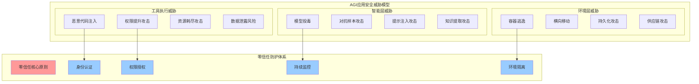

# 4.4.4 安全控制与环境隔离

> "安全是智能环境的底线，隔离是保护的屏障。在AGI应用中，我们不仅要防范已知的威胁，更要构建面向未知风险的防护体系。"

## 🎯 本节学习目标

完成本节学习后，您将能够：
- ✅ 构建多层次的安全防护体系
- ✅ 实现工具执行的安全隔离机制  
- ✅ 建立动态权限管理和访问控制系统
- ✅ 设计威胁检测与自动响应机制

## 零信任安全架构

### AGI应用的安全挑战

AGI应用在智能环境层面临独特的安全挑战：



### 零信任模型设计原则

```python
from typing import Dict, List, Any, Optional
from dataclasses import dataclass
from enum import Enum
import asyncio
import hashlib
import jwt
from datetime import datetime, timedelta

class TrustLevel(Enum):
    """信任级别"""
    UNTRUSTED = 0
    LOW = 1
    MEDIUM = 2
    HIGH = 3
    CRITICAL = 4

class AccessDecision(Enum):
    """访问决策"""
    ALLOW = "allow"
    DENY = "deny"  
    CONDITIONAL = "conditional"
    MONITOR = "monitor"

@dataclass
class SecurityContext:
    """安全上下文"""
    user_id: str
    session_id: str
    tool_id: str
    environment_id: str
    trust_level: TrustLevel
    permissions: List[str]
    constraints: Dict[str, Any]
    expiry_time: datetime

class ZeroTrustEngine:
    """零信任引擎"""
    
    def __init__(self):
        self.identity_verifier = IdentityVerifier()
        self.context_analyzer = ContextAnalyzer()
        self.risk_assessor = RiskAssessor()
        self.policy_engine = PolicyEngine()
        self.audit_logger = AuditLogger()
        
    async def evaluate_access_request(self, 
                                    request: Dict[str, Any]) -> AccessDecision:
        """评估访问请求"""
        
        # 1. 身份验证
        identity_result = await self.identity_verifier.verify_identity(
            request.get("credentials", {})
        )
        
        if not identity_result.valid:
            await self.audit_logger.log_access_denied(
                request, "identity_verification_failed"
            )
            return AccessDecision.DENY
        
        # 2. 上下文分析
        context = await self.context_analyzer.analyze_context(request)
        
        # 3. 风险评估
        risk_level = await self.risk_assessor.assess_risk(
            identity_result, context
        )
        
        # 4. 策略决策
        policy_decision = await self.policy_engine.evaluate_policies(
            identity_result, context, risk_level
        )
        
        # 5. 记录审计日志
        await self.audit_logger.log_access_decision(
            request, policy_decision, risk_level
        )
        
        return policy_decision
    
    async def create_security_context(self, 
                                    access_decision: AccessDecision,
                                    request: Dict[str, Any]) -> Optional[SecurityContext]:
        """创建安全上下文"""
        
        if access_decision == AccessDecision.DENY:
            return None
        
        # 确定信任级别
        trust_level = await self._determine_trust_level(request)
        
        # 计算权限集合
        permissions = await self._calculate_permissions(request, trust_level)
        
        # 设置约束条件
        constraints = await self._set_constraints(request, access_decision)
        
        # 计算会话过期时间
        expiry_time = self._calculate_expiry_time(trust_level)
        
        context = SecurityContext(
            user_id=request["user_id"],
            session_id=request["session_id"],
            tool_id=request["tool_id"],
            environment_id=request["environment_id"],
            trust_level=trust_level,
            permissions=permissions,
            constraints=constraints,
            expiry_time=expiry_time
        )
        
        return context
    
    async def _determine_trust_level(self, request: Dict[str, Any]) -> TrustLevel:
        """确定信任级别"""
        
        factors = {
            "user_reputation": await self._get_user_reputation(request["user_id"]),
            "tool_risk_level": await self._get_tool_risk_level(request["tool_id"]),
            "environment_security": await self._get_environment_security(request["environment_id"]),
            "network_location": await self._analyze_network_location(request.get("source_ip")),
            "device_trust": await self._assess_device_trust(request.get("device_info", {})),
            "behavior_analysis": await self._analyze_user_behavior(request)
        }
        
        # 综合评分计算信任级别
        trust_score = (
            factors["user_reputation"] * 0.3 +
            factors["tool_risk_level"] * 0.2 +
            factors["environment_security"] * 0.2 +
            factors["network_location"] * 0.1 +
            factors["device_trust"] * 0.1 +
            factors["behavior_analysis"] * 0.1
        )
        
        if trust_score >= 0.9:
            return TrustLevel.CRITICAL
        elif trust_score >= 0.7:
            return TrustLevel.HIGH
        elif trust_score >= 0.5:
            return TrustLevel.MEDIUM
        elif trust_score >= 0.3:
            return TrustLevel.LOW
        else:
            return TrustLevel.UNTRUSTED
```

## 多层次环境隔离

### 网络层隔离机制

```python
class NetworkIsolationManager:
    """网络隔离管理器"""
    
    def __init__(self):
        self.network_policies = {}
        self.isolation_zones = {}
        self.traffic_monitor = NetworkTrafficMonitor()
        self.firewall_manager = FirewallManager()
        
    async def create_isolation_zone(self, 
                                  zone_config: Dict[str, Any]) -> str:
        """创建隔离区域"""
        
        zone_id = self._generate_zone_id()
        
        # 1. 创建虚拟网络
        vnet_config = await self._create_virtual_network(zone_config)
        
        # 2. 配置网络策略
        network_policies = await self._configure_network_policies(
            zone_id, zone_config
        )
        
        # 3. 部署安全规则
        security_rules = await self._deploy_security_rules(
            zone_id, zone_config
        )
        
        # 4. 启动流量监控
        monitoring_config = await self._setup_traffic_monitoring(zone_id)
        
        # 记录隔离区域信息
        self.isolation_zones[zone_id] = {
            "config": zone_config,
            "vnet_config": vnet_config,
            "network_policies": network_policies,
            "security_rules": security_rules,
            "monitoring_config": monitoring_config,
            "created_at": datetime.now()
        }
        
        return zone_id
    
    async def _configure_network_policies(self, 
                                        zone_id: str,
                                        zone_config: Dict[str, Any]) -> List[Dict]:
        """配置网络策略"""
        
        policies = []
        security_level = zone_config.get("security_level", "medium")
        
        # 基于安全级别的默认策略
        if security_level == "high":
            policies.extend([
                {
                    "name": f"{zone_id}_default_deny",
                    "action": "deny",
                    "direction": "both",
                    "priority": 1000,
                    "description": "默认拒绝所有流量"
                },
                {
                    "name": f"{zone_id}_internal_allow",
                    "action": "allow",
                    "source": f"{zone_id}_subnet",
                    "destination": f"{zone_id}_subnet",
                    "direction": "both",
                    "priority": 900,
                    "description": "允许区域内通信"
                }
            ])
        
        # 添加自定义规则
        custom_rules = zone_config.get("network_rules", [])
        for rule in custom_rules:
            policy = {
                "name": f"{zone_id}_{rule['name']}",
                "action": rule["action"],
                "source": rule.get("source", "any"),
                "destination": rule.get("destination", "any"),
                "port": rule.get("port", "any"),
                "protocol": rule.get("protocol", "tcp"),
                "direction": rule.get("direction", "inbound"),
                "priority": rule.get("priority", 500)
            }
            policies.append(policy)
        
        # 应用网络策略
        for policy in policies:
            await self.firewall_manager.apply_policy(policy)
        
        return policies
```

### 容器级隔离机制

```python
class ContainerIsolationManager:
    """容器隔离管理器"""
    
    def __init__(self):
        self.isolation_profiles = {}
        self.security_policies = SecurityPolicyManager()
        self.runtime_monitor = ContainerRuntimeMonitor()
        
    async def create_secure_container(self, 
                                    container_spec: Dict[str, Any]) -> str:
        """创建安全容器"""
        
        # 1. 分析安全需求
        security_requirements = await self._analyze_security_requirements(
            container_spec
        )
        
        # 2. 选择隔离配置
        isolation_config = await self._select_isolation_config(
            security_requirements
        )
        
        # 3. 构建安全容器配置
        secure_config = await self._build_secure_container_config(
            container_spec, isolation_config
        )
        
        # 4. 创建容器
        container_id = await self._create_container_with_isolation(
            secure_config
        )
        
        # 5. 应用运行时安全策略
        await self._apply_runtime_security_policies(
            container_id, isolation_config
        )
        
        return container_id
    
    async def _build_secure_container_config(self,
                                           spec: Dict[str, Any],
                                           isolation: Dict[str, Any]) -> Dict[str, Any]:
        """构建安全容器配置"""
        
        config = {
            "image": spec["image"],
            "name": spec["name"],
            "hostname": f"secure-{spec['name'][:8]}",
            
            # 用户和权限配置
            "user": isolation.get("user_id", "1000:1000"),
            "read_only": isolation.get("read_only", True),
            "no_new_privileges": True,
            
            # 能力限制
            "cap_drop": ["ALL"],
            "cap_add": isolation.get("required_capabilities", []),
            
            # 资源限制
            "memory": isolation.get("memory_limit", "256m"),
            "cpu_quota": isolation.get("cpu_quota", 50000),
            "cpu_period": 100000,
            "pids_limit": isolation.get("pids_limit", 100),
            
            # 网络隔离
            "network_mode": isolation.get("network_mode", "none"),
            "dns": isolation.get("dns_servers", ["1.1.1.1"]),
            
            # 文件系统隔离
            "tmpfs": {
                "/tmp": "rw,size=100m,noexec,nosuid,nodev",
                "/var/tmp": "rw,size=50m,noexec,nosuid,nodev"
            },
            
            # 安全选项
            "security_opt": [
                "no-new-privileges:true",
                "apparmor:docker-default"
            ]
        }
        
        # 根据安全级别添加额外配置
        security_level = isolation.get("security_level", "medium")
        
        if security_level == "high":
            config.update({
                # 更严格的隔离
                "ipc_mode": "none",
                "pid_mode": "container",
                "userns_mode": "host",
                
                # 禁用特权操作
                "privileged": False,
                "cap_add": [],  # 不添加任何能力
                
                # 限制设备访问
                "devices": [],
                "device_cgroup_rules": ["a *:* rwm"]
            })
        
        # 挂载配置
        volumes = []
        for mount in spec.get("mounts", []):
            volume_config = {
                "source": mount["source"],
                "target": mount["target"],
                "type": mount.get("type", "bind"),
                "read_only": mount.get("read_only", True)
            }
            volumes.append(volume_config)
        
        config["mounts"] = volumes
        
        return config
```

## 动态权限管理

### 基于属性的访问控制（ABAC）

```python
class ABACEngine:
    """基于属性的访问控制引擎"""
    
    def __init__(self):
        self.attribute_provider = AttributeProvider()
        self.policy_repository = PolicyRepository()
        self.decision_cache = DecisionCache()
        self.audit_service = AuditService()
        
    async def evaluate_access(self, 
                            subject: Dict[str, Any],
                            resource: Dict[str, Any],
                            action: str,
                            environment: Dict[str, Any]) -> Dict[str, Any]:
        """评估访问请求"""
        
        # 1. 构建访问请求上下文
        access_context = await self._build_access_context(
            subject, resource, action, environment
        )
        
        # 2. 检查决策缓存
        cached_decision = await self.decision_cache.get_decision(access_context)
        if cached_decision and not cached_decision.is_expired():
            return cached_decision
        
        # 3. 获取相关策略
        applicable_policies = await self.policy_repository.find_applicable_policies(
            access_context
        )
        
        # 4. 评估策略
        decision_result = await self._evaluate_policies(
            applicable_policies, access_context
        )
        
        # 5. 缓存决策结果
        await self.decision_cache.cache_decision(access_context, decision_result)
        
        # 6. 记录审计日志
        await self.audit_service.log_access_decision(
            access_context, decision_result
        )
        
        return decision_result
    
    async def _build_access_context(self,
                                  subject: Dict[str, Any],
                                  resource: Dict[str, Any], 
                                  action: str,
                                  environment: Dict[str, Any]) -> Dict[str, Any]:
        """构建访问上下文"""
        
        # 获取主体属性
        subject_attributes = await self.attribute_provider.get_subject_attributes(
            subject["user_id"]
        )
        
        # 获取资源属性
        resource_attributes = await self.attribute_provider.get_resource_attributes(
            resource["resource_id"]
        )
        
        # 获取环境属性
        environment_attributes = await self.attribute_provider.get_environment_attributes(
            environment
        )
        
        return {
            "subject": {
                **subject,
                "attributes": subject_attributes
            },
            "resource": {
                **resource,
                "attributes": resource_attributes  
            },
            "action": action,
            "environment": {
                **environment,
                "attributes": environment_attributes
            },
            "timestamp": datetime.now()
        }
    
    async def _evaluate_policies(self,
                               policies: List[Dict[str, Any]],
                               context: Dict[str, Any]) -> Dict[str, Any]:
        """评估策略"""
        
        decisions = []
        
        for policy in policies:
            try:
                # 评估策略条件
                condition_result = await self._evaluate_condition(
                    policy["condition"], context
                )
                
                if condition_result:
                    effect = policy["effect"]  # "allow" or "deny"
                    obligations = policy.get("obligations", [])
                    
                    decision = {
                        "policy_id": policy["id"],
                        "effect": effect,
                        "obligations": obligations,
                        "confidence": condition_result.get("confidence", 1.0)
                    }
                    decisions.append(decision)
                    
            except Exception as e:
                # 策略评估错误，记录日志并继续
                await self.audit_service.log_policy_error(policy["id"], str(e))
                continue
        
        # 合并决策结果
        final_decision = await self._combine_decisions(decisions)
        
        return final_decision
    
    async def _evaluate_condition(self,
                                condition: Dict[str, Any],
                                context: Dict[str, Any]) -> Optional[Dict[str, Any]]:
        """评估条件表达式"""
        
        condition_type = condition.get("type")
        
        if condition_type == "attribute_comparison":
            return await self._evaluate_attribute_comparison(condition, context)
        elif condition_type == "logical_operator":
            return await self._evaluate_logical_operator(condition, context)
        elif condition_type == "function_call":
            return await self._evaluate_function_call(condition, context)
        else:
            raise ValueError(f"Unsupported condition type: {condition_type}")
    
    async def _evaluate_attribute_comparison(self,
                                           condition: Dict[str, Any],
                                           context: Dict[str, Any]) -> Optional[Dict[str, Any]]:
        """评估属性比较"""
        
        left_operand = await self._resolve_attribute_reference(
            condition["left"], context
        )
        right_operand = await self._resolve_attribute_reference(
            condition["right"], context
        )
        operator = condition["operator"]
        
        # 执行比较操作
        if operator == "equals":
            result = left_operand == right_operand
        elif operator == "not_equals":
            result = left_operand != right_operand
        elif operator == "greater_than":
            result = left_operand > right_operand
        elif operator == "less_than":
            result = left_operand < right_operand
        elif operator == "contains":
            result = right_operand in left_operand
        elif operator == "in":
            result = left_operand in right_operand
        else:
            raise ValueError(f"Unsupported operator: {operator}")
        
        return {"result": result, "confidence": 1.0} if result else None
```

## 威胁检测与响应

### 智能威胁检测系统

```python
class IntelligentThreatDetector:
    """智能威胁检测系统"""
    
    def __init__(self):
        self.anomaly_detectors = {
            "behavior": BehaviorAnomalyDetector(),
            "network": NetworkAnomalyDetector(),
            "system": SystemAnomalyDetector(),
            "resource": ResourceAnomalyDetector()
        }
        self.ml_models = ThreatDetectionModels()
        self.threat_intelligence = ThreatIntelligenceService()
        self.incident_manager = IncidentManager()
        
    async def start_continuous_monitoring(self):
        """启动持续监控"""
        
        monitoring_tasks = [
            self._monitor_user_behavior(),
            self._monitor_network_traffic(),
            self._monitor_system_calls(),
            self._monitor_resource_usage(),
            self._correlate_security_events()
        ]
        
        await asyncio.gather(*monitoring_tasks)
    
    async def _monitor_user_behavior(self):
        """监控用户行为异常"""
        
        while True:
            try:
                # 收集用户行为数据
                behavior_data = await self._collect_behavior_data()
                
                # 异常检测
                for user_id, user_behavior in behavior_data.items():
                    anomaly_score = await self.anomaly_detectors["behavior"].detect(
                        user_id, user_behavior
                    )
                    
                    if anomaly_score > 0.8:  # 高异常分数
                        await self._handle_behavior_anomaly(
                            user_id, user_behavior, anomaly_score
                        )
                
                await asyncio.sleep(60)  # 每分钟检查一次
                
            except Exception as e:
                self.logger.error(f"Behavior monitoring error: {e}")
                await asyncio.sleep(60)
    
    async def _collect_behavior_data(self) -> Dict[str, Any]:
        """收集用户行为数据"""
        
        # 从各种数据源收集行为数据
        sources = [
            self._get_authentication_events(),
            self._get_resource_access_events(), 
            self._get_tool_execution_events(),
            self._get_network_activity_events()
        ]
        
        raw_data = await asyncio.gather(*sources)
        
        # 聚合和处理数据
        behavior_profiles = {}
        
        for data_source in raw_data:
            for event in data_source:
                user_id = event["user_id"]
                
                if user_id not in behavior_profiles:
                    behavior_profiles[user_id] = {
                        "login_patterns": [],
                        "resource_access": [],
                        "tool_usage": [],
                        "network_activity": [],
                        "risk_indicators": []
                    }
                
                # 按事件类型分类
                event_type = event["type"]
                if event_type == "authentication":
                    behavior_profiles[user_id]["login_patterns"].append(event)
                elif event_type == "resource_access":
                    behavior_profiles[user_id]["resource_access"].append(event)
                elif event_type == "tool_execution":
                    behavior_profiles[user_id]["tool_usage"].append(event)
                elif event_type == "network_activity":
                    behavior_profiles[user_id]["network_activity"].append(event)
        
        return behavior_profiles
    
    async def _handle_behavior_anomaly(self,
                                     user_id: str,
                                     behavior_data: Dict[str, Any],
                                     anomaly_score: float):
        """处理行为异常"""
        
        # 1. 创建安全事件
        incident = await self.incident_manager.create_incident({
            "type": "behavior_anomaly",
            "user_id": user_id,
            "anomaly_score": anomaly_score,
            "behavior_data": behavior_data,
            "detected_at": datetime.now(),
            "severity": await self._calculate_severity(anomaly_score)
        })
        
        # 2. 执行自动响应
        await self._execute_automatic_response(incident)
        
        # 3. 通知安全团队
        await self._notify_security_team(incident)
    
    async def _execute_automatic_response(self, incident: Dict[str, Any]):
        """执行自动响应"""
        
        response_actions = []
        severity = incident["severity"]
        
        if severity >= 8:  # 严重威胁
            response_actions.extend([
                "suspend_user_session",
                "isolate_environment", 
                "block_network_access",
                "preserve_evidence"
            ])
        elif severity >= 6:  # 中等威胁
            response_actions.extend([
                "require_additional_authentication",
                "limit_resource_access",
                "increase_monitoring"
            ])
        elif severity >= 4:  # 低等威胁
            response_actions.extend([
                "log_detailed_activity",
                "request_manual_review"
            ])
        
        # 执行响应动作
        for action in response_actions:
            try:
                await self._execute_response_action(action, incident)
            except Exception as e:
                self.logger.error(f"Failed to execute response action {action}: {e}")
    
    async def _execute_response_action(self, 
                                     action: str,
                                     incident: Dict[str, Any]):
        """执行响应动作"""
        
        user_id = incident["user_id"]
        
        if action == "suspend_user_session":
            await self._suspend_user_sessions(user_id)
            
        elif action == "isolate_environment":
            await self._isolate_user_environments(user_id)
            
        elif action == "block_network_access":
            await self._block_user_network_access(user_id)
            
        elif action == "require_additional_authentication":
            await self._require_additional_auth(user_id)
            
        elif action == "limit_resource_access":
            await self._limit_resource_access(user_id)
            
        elif action == "increase_monitoring":
            await self._increase_monitoring_level(user_id)
            
        # 记录响应动作
        await self.incident_manager.log_response_action(
            incident["id"], action, datetime.now()
        )
```

## 本节总结

本节深入介绍了智能环境层的安全控制与环境隔离体系：

### 🎯 核心安全原则

1. **零信任架构**：永不信任，始终验证的安全理念
2. **多层防护**：网络、系统、应用、数据多层安全控制
3. **动态授权**：基于上下文和风险的动态权限管理
4. **智能响应**：基于AI的威胁检测和自动响应

### 🔧 关键技术实现

- **零信任引擎**：综合身份、上下文、风险的访问控制
- **网络隔离**：虚拟网络和安全策略的动态配置
- **容器隔离**：多维度的容器安全加固机制
- **ABAC引擎**：基于属性的细粒度访问控制

### 🚀 智能化安全特性

- **行为分析**：基于机器学习的用户行为异常检测
- **威胁预测**：结合威胁情报的主动安全防护
- **自动响应**：根据威胁级别的自动化响应机制
- **持续监控**：全方位的安全态势感知能力

---

**下一步学习**：掌握了安全控制与环境隔离后，我们将继续学习智能环境层的工程化实践，了解如何将理论转化为可落地的技术方案。

> **💡 安全要诀**：安全不是一个功能，而是一个体系。在AGI应用中，安全控制需要贯穿整个环境层的设计与实现，既要防范已知威胁，更要构建面向未知风险的适应性防护能力。
