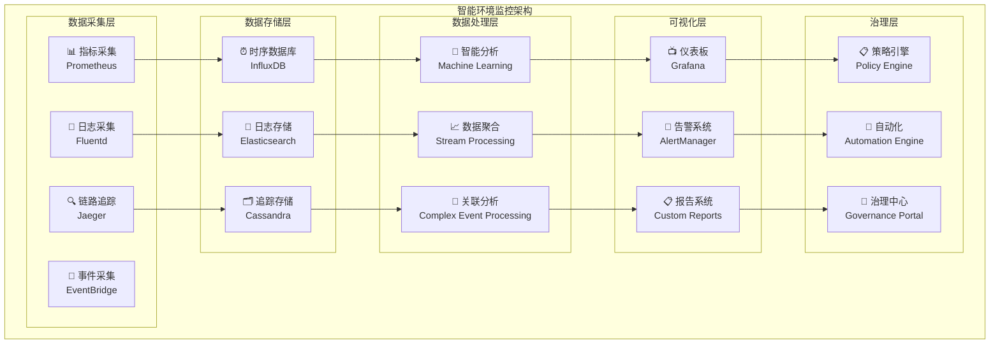

# 4.4.6 环境监控与智能治理

> "监控是运维的眼睛，治理是管理的大脑。智能环境的监控与治理，让系统具备自感知、自诊断、自优化的能力。"

## 🎯 本节学习目标

完成本节学习后，您将能够：
- ✅ 建立全方位的环境监控体系
- ✅ 实现智能告警和异常检测机制
- ✅ 构建性能分析和优化系统
- ✅ 建立可视化管理和治理平台

## 全方位监控体系

### 多维度监控架构

智能环境层需要建立覆盖基础设施、应用、业务的全方位监控体系：



### 核心监控指标体系

```python
"""
智能环境监控指标定义
file: monitoring/metrics-definitions.py
"""

from dataclasses import dataclass
from typing import Dict, List, Any, Optional
from enum import Enum
import time

class MetricType(Enum):
    """指标类型"""
    COUNTER = "counter"           # 计数器
    GAUGE = "gauge"              # 计量器
    HISTOGRAM = "histogram"      # 直方图
    SUMMARY = "summary"          # 摘要

class MetricCategory(Enum):
    """指标分类"""
    INFRASTRUCTURE = "infrastructure"   # 基础设施指标
    APPLICATION = "application"        # 应用指标
    BUSINESS = "business"              # 业务指标
    SECURITY = "security"              # 安全指标

@dataclass
class MetricDefinition:
    """指标定义"""
    name: str
    type: MetricType
    category: MetricCategory
    description: str
    labels: List[str]
    unit: str
    collection_interval: int  # 采集间隔（秒）
    retention_period: int     # 保留期（天）
    alert_rules: List[Dict[str, Any]]

class IntelligentEnvironmentMetrics:
    """智能环境指标定义"""
    
    @staticmethod
    def get_infrastructure_metrics() -> List[MetricDefinition]:
        """基础设施指标"""
        
        return [
            # CPU指标
            MetricDefinition(
                name="node_cpu_utilization",
                type=MetricType.GAUGE,
                category=MetricCategory.INFRASTRUCTURE,
                description="节点CPU使用率",
                labels=["node_id", "cpu_core"],
                unit="percent",
                collection_interval=30,
                retention_period=90,
                alert_rules=[
                    {
                        "name": "HighCPUUsage",
                        "condition": "node_cpu_utilization > 80",
                        "duration": "5m",
                        "severity": "warning"
                    }
                ]
            ),
            
            # 内存指标
            MetricDefinition(
                name="node_memory_utilization",
                type=MetricType.GAUGE,
                category=MetricCategory.INFRASTRUCTURE,
                description="节点内存使用率",
                labels=["node_id", "memory_type"],
                unit="percent", 
                collection_interval=30,
                retention_period=90,
                alert_rules=[
                    {
                        "name": "HighMemoryUsage",
                        "condition": "node_memory_utilization > 85",
                        "duration": "3m",
                        "severity": "critical"
                    }
                ]
            ),
            
            # GPU指标
            MetricDefinition(
                name="gpu_utilization",
                type=MetricType.GAUGE,
                category=MetricCategory.INFRASTRUCTURE,
                description="GPU使用率",
                labels=["node_id", "gpu_id", "gpu_type"],
                unit="percent",
                collection_interval=10,
                retention_period=30,
                alert_rules=[
                    {
                        "name": "GPUOverheating",
                        "condition": "gpu_temperature > 80",
                        "duration": "1m",
                        "severity": "warning"
                    }
                ]
            ),
            
            # 网络指标
            MetricDefinition(
                name="network_throughput",
                type=MetricType.COUNTER,
                category=MetricCategory.INFRASTRUCTURE,
                description="网络吞吐量",
                labels=["node_id", "interface", "direction"],
                unit="bytes_per_second",
                collection_interval=10,
                retention_period=30,
                alert_rules=[]
            ),
            
            # 存储指标
            MetricDefinition(
                name="disk_utilization",
                type=MetricType.GAUGE,
                category=MetricCategory.INFRASTRUCTURE,
                description="磁盘使用率",
                labels=["node_id", "mount_point", "disk_type"],
                unit="percent",
                collection_interval=60,
                retention_period=180,
                alert_rules=[
                    {
                        "name": "DiskSpaceLow",
                        "condition": "disk_utilization > 90",
                        "duration": "5m",
                        "severity": "critical"
                    }
                ]
            )
        ]
    
    @staticmethod
    def get_application_metrics() -> List[MetricDefinition]:
        """应用指标"""
        
        return [
            # 资源调度器指标
            MetricDefinition(
                name="scheduler_request_latency",
                type=MetricType.HISTOGRAM,
                category=MetricCategory.APPLICATION,
                description="资源调度请求延迟",
                labels=["scheduler_instance", "request_type"],
                unit="seconds",
                collection_interval=10,
                retention_period=30,
                alert_rules=[
                    {
                        "name": "HighSchedulerLatency",
                        "condition": "histogram_quantile(0.95, scheduler_request_latency) > 5",
                        "duration": "2m",
                        "severity": "warning"
                    }
                ]
            ),
            
            # 环境管理器指标  
            MetricDefinition(
                name="environment_creation_time",
                type=MetricType.HISTOGRAM,
                category=MetricCategory.APPLICATION,
                description="环境创建时间",
                labels=["environment_type", "cluster_id"],
                unit="seconds",
                collection_interval=30,
                retention_period=60,
                alert_rules=[
                    {
                        "name": "SlowEnvironmentCreation",
                        "condition": "histogram_quantile(0.90, environment_creation_time) > 60",
                        "duration": "5m", 
                        "severity": "warning"
                    }
                ]
            ),
            
            # 安全控制器指标
            MetricDefinition(
                name="security_violations_total",
                type=MetricType.COUNTER,
                category=MetricCategory.SECURITY,
                description="安全违规总数",
                labels=["violation_type", "severity", "source_ip"],
                unit="count",
                collection_interval=60,
                retention_period=365,
                alert_rules=[
                    {
                        "name": "SecurityViolationSpike",
                        "condition": "rate(security_violations_total[5m]) > 10",
                        "duration": "1m",
                        "severity": "critical"
                    }
                ]
            ),
            
            # 工具执行指标
            MetricDefinition(
                name="tool_execution_success_rate",
                type=MetricType.GAUGE,
                category=MetricCategory.APPLICATION,
                description="工具执行成功率",
                labels=["tool_type", "environment_type"],
                unit="percent",
                collection_interval=60,
                retention_period=90,
                alert_rules=[
                    {
                        "name": "LowToolSuccessRate",
                        "condition": "tool_execution_success_rate < 95",
                        "duration": "10m",
                        "severity": "warning"
                    }
                ]
            )
        ]
    
    @staticmethod
    def get_business_metrics() -> List[MetricDefinition]:
        """业务指标"""
        
        return [
            # 用户体验指标
            MetricDefinition(
                name="user_request_satisfaction",
                type=MetricType.GAUGE,
                category=MetricCategory.BUSINESS,
                description="用户请求满意度",
                labels=["user_tier", "request_complexity"],
                unit="score",
                collection_interval=300,
                retention_period=180,
                alert_rules=[
                    {
                        "name": "LowUserSatisfaction",
                        "condition": "user_request_satisfaction < 4.0",
                        "duration": "15m",
                        "severity": "warning"
                    }
                ]
            ),
            
            # 资源利用效率
            MetricDefinition(
                name="resource_efficiency_score",
                type=MetricType.GAUGE,
                category=MetricCategory.BUSINESS,
                description="资源利用效率分数",
                labels=["resource_type", "cluster_id"],
                unit="score",
                collection_interval=300,
                retention_period=365,
                alert_rules=[
                    {
                        "name": "LowResourceEfficiency",
                        "condition": "resource_efficiency_score < 70",
                        "duration": "30m",
                        "severity": "info"
                    }
                ]
            ),
            
            # 成本指标
            MetricDefinition(
                name="operational_cost_per_request",
                type=MetricType.GAUGE,
                category=MetricCategory.BUSINESS,
                description="每请求运营成本",
                labels=["cost_center", "environment"],
                unit="currency",
                collection_interval=3600,
                retention_period=365,
                alert_rules=[
                    {
                        "name": "HighOperationalCost",
                        "condition": "operational_cost_per_request > threshold",
                        "duration": "1h",
                        "severity": "info"
                    }
                ]
            )
        ]

class MetricsCollector:
    """指标收集器"""
    
    def __init__(self):
        self.prometheus_gateway = PrometheusGateway()
        self.metric_definitions = {}
        self.collection_tasks = {}
        
    async def register_metrics(self, metrics: List[MetricDefinition]):
        """注册监控指标"""
        
        for metric in metrics:
            self.metric_definitions[metric.name] = metric
            
            # 创建Prometheus指标对象
            await self._create_prometheus_metric(metric)
            
            # 启动采集任务
            collection_task = asyncio.create_task(
                self._start_metric_collection(metric)
            )
            self.collection_tasks[metric.name] = collection_task
    
    async def _create_prometheus_metric(self, metric: MetricDefinition):
        """创建Prometheus指标"""
        
        if metric.type == MetricType.COUNTER:
            prometheus_metric = Counter(
                name=metric.name,
                documentation=metric.description,
                labelnames=metric.labels
            )
        elif metric.type == MetricType.GAUGE:
            prometheus_metric = Gauge(
                name=metric.name,
                documentation=metric.description,
                labelnames=metric.labels
            )
        elif metric.type == MetricType.HISTOGRAM:
            prometheus_metric = Histogram(
                name=metric.name,
                documentation=metric.description,
                labelnames=metric.labels
            )
        
        # 注册到Prometheus
        await self.prometheus_gateway.register_metric(prometheus_metric)
    
    async def _start_metric_collection(self, metric: MetricDefinition):
        """启动指标采集"""
        
        while True:
            try:
                # 采集指标数据
                metric_data = await self._collect_metric_data(metric)
                
                # 发送到Prometheus
                await self.prometheus_gateway.push_metric(
                    metric.name, metric_data
                )
                
                # 等待下次采集
                await asyncio.sleep(metric.collection_interval)
                
            except Exception as e:
                logging.error(f"指标采集失败 {metric.name}: {str(e)}")
                await asyncio.sleep(60)  # 错误时等待1分钟
    
    async def _collect_metric_data(self, metric: MetricDefinition) -> Dict[str, Any]:
        """采集指标数据"""
        
        if metric.category == MetricCategory.INFRASTRUCTURE:
            return await self._collect_infrastructure_metric(metric)
        elif metric.category == MetricCategory.APPLICATION:
            return await self._collect_application_metric(metric)
        elif metric.category == MetricCategory.BUSINESS:
            return await self._collect_business_metric(metric)
        elif metric.category == MetricCategory.SECURITY:
            return await self._collect_security_metric(metric)
        
        return {}
```

## 智能告警系统

### 多维度告警规则引擎

```python
"""
智能告警系统
file: monitoring/intelligent-alerting.py
"""

import asyncio
import logging
from typing import Dict, List, Any, Optional, Callable
from datetime import datetime, timedelta
from dataclasses import dataclass
from enum import Enum
import json
import re

class AlertSeverity(Enum):
    """告警严重程度"""
    INFO = 1
    WARNING = 2
    ERROR = 3
    CRITICAL = 4
    EMERGENCY = 5

class AlertState(Enum):
    """告警状态"""
    FIRING = "firing"
    PENDING = "pending"
    RESOLVED = "resolved"
    SILENCED = "silenced"

@dataclass
class AlertRule:
    """告警规则"""
    rule_id: str
    name: str
    description: str
    condition: str
    severity: AlertSeverity
    duration: str
    labels: Dict[str, str]
    annotations: Dict[str, str]
    enabled: bool = True

@dataclass
class Alert:
    """告警实例"""
    alert_id: str
    rule_id: str
    name: str
    severity: AlertSeverity
    state: AlertState
    message: str
    labels: Dict[str, str]
    started_at: datetime
    ended_at: Optional[datetime] = None
    acknowledged_by: Optional[str] = None
    acknowledged_at: Optional[datetime] = None

class IntelligentAlertingEngine:
    """智能告警引擎"""
    
    def __init__(self):
        self.alert_rules = {}
        self.active_alerts = {}
        self.alert_history = []
        self.notification_channels = {}
        self.ml_predictor = AlertPredictor()
        self.noise_reducer = AlertNoiseReducer()
        
    async def register_alert_rule(self, rule: AlertRule):
        """注册告警规则"""
        
        # 验证规则语法
        if not await self._validate_rule_syntax(rule.condition):
            raise ValueError(f"告警规则语法错误: {rule.condition}")
        
        self.alert_rules[rule.rule_id] = rule
        logging.info(f"注册告警规则: {rule.name}")
        
        # 启动规则评估任务
        asyncio.create_task(self._evaluate_rule_continuously(rule))
    
    async def _validate_rule_syntax(self, condition: str) -> bool:
        """验证告警规则语法"""
        
        # 检查PromQL语法
        try:
            # 这里应该使用真正的PromQL解析器
            # 简化版本，检查基本语法
            if not condition.strip():
                return False
            
            # 检查是否包含比较操作符
            comparison_operators = ['>', '<', '>=', '<=', '==', '!=']
            has_comparison = any(op in condition for op in comparison_operators)
            
            if not has_comparison:
                return False
            
            return True
            
        except Exception:
            return False
    
    async def _evaluate_rule_continuously(self, rule: AlertRule):
        """持续评估告警规则"""
        
        while rule.enabled:
            try:
                # 解析持续时间
                duration_seconds = self._parse_duration(rule.duration)
                
                # 评估规则条件
                evaluation_result = await self._evaluate_rule_condition(
                    rule.condition, duration_seconds
                )
                
                if evaluation_result["triggered"]:
                    # 创建或更新告警
                    await self._handle_alert_triggered(rule, evaluation_result)
                else:
                    # 检查是否需要解决告警
                    await self._handle_alert_resolved(rule.rule_id)
                
                # 等待下次评估
                await asyncio.sleep(30)  # 每30秒评估一次
                
            except Exception as e:
                logging.error(f"告警规则评估失败 {rule.name}: {str(e)}")
                await asyncio.sleep(60)
    
    def _parse_duration(self, duration_str: str) -> int:
        """解析持续时间字符串"""
        
        duration_map = {
            's': 1,
            'm': 60,
            'h': 3600,
            'd': 86400
        }
        
        # 解析如 "5m", "1h", "30s" 等格式
        match = re.match(r'(\d+)([smhd])', duration_str)
        if match:
            value, unit = match.groups()
            return int(value) * duration_map[unit]
        
        return 300  # 默认5分钟
    
    async def _evaluate_rule_condition(self, 
                                     condition: str, 
                                     duration_seconds: int) -> Dict[str, Any]:
        """评估规则条件"""
        
        # 查询Prometheus获取指标数据
        query_result = await self._query_prometheus(condition)
        
        if not query_result["success"]:
            return {"triggered": False, "error": query_result["error"]}
        
        # 检查条件是否在指定时间内持续满足
        values = query_result["data"]
        
        if not values:
            return {"triggered": False}
        
        # 简化逻辑：如果有值且满足条件，则认为触发
        triggered = len(values) > 0
        
        return {
            "triggered": triggered,
            "values": values,
            "evaluated_at": datetime.now(),
            "duration_satisfied": duration_seconds
        }
    
    async def _handle_alert_triggered(self, 
                                    rule: AlertRule,
                                    evaluation_result: Dict[str, Any]):
        """处理告警触发"""
        
        alert_id = f"{rule.rule_id}_{datetime.now().timestamp()}"
        
        # 检查是否已存在相同的活跃告警
        existing_alert = self._find_active_alert(rule.rule_id)
        
        if existing_alert:
            # 更新现有告警
            existing_alert.message = f"持续触发: {rule.description}"
            logging.info(f"告警持续触发: {rule.name}")
            return
        
        # 创建新告警
        alert = Alert(
            alert_id=alert_id,
            rule_id=rule.rule_id,
            name=rule.name,
            severity=rule.severity,
            state=AlertState.FIRING,
            message=rule.description,
            labels=rule.labels,
            started_at=datetime.now()
        )
        
        # 智能降噪处理
        if await self.noise_reducer.should_suppress_alert(alert):
            alert.state = AlertState.SILENCED
            logging.info(f"告警被智能降噪抑制: {rule.name}")
        else:
            self.active_alerts[alert_id] = alert
            
            # 发送通知
            await self._send_alert_notification(alert)
            
            logging.warning(f"告警触发: {rule.name}")
    
    async def _handle_alert_resolved(self, rule_id: str):
        """处理告警解决"""
        
        # 查找相关的活跃告警
        resolved_alerts = []
        
        for alert_id, alert in list(self.active_alerts.items()):
            if alert.rule_id == rule_id:
                alert.state = AlertState.RESOLVED
                alert.ended_at = datetime.now()
                
                resolved_alerts.append(alert)
                del self.active_alerts[alert_id]
        
        # 发送解决通知
        for alert in resolved_alerts:
            await self._send_alert_resolution_notification(alert)
            
            # 移动到历史记录
            self.alert_history.append(alert)
            
            logging.info(f"告警已解决: {alert.name}")
    
    def _find_active_alert(self, rule_id: str) -> Optional[Alert]:
        """查找活跃告警"""
        
        for alert in self.active_alerts.values():
            if alert.rule_id == rule_id:
                return alert
        
        return None
    
    async def _send_alert_notification(self, alert: Alert):
        """发送告警通知"""
        
        # 根据告警严重程度选择通知渠道
        notification_channels = await self._select_notification_channels(alert.severity)
        
        notification_message = {
            "alert_id": alert.alert_id,
            "name": alert.name,
            "severity": alert.severity.name,
            "message": alert.message,
            "labels": alert.labels,
            "started_at": alert.started_at.isoformat(),
            "dashboard_url": f"https://grafana.example.com/alerts/{alert.alert_id}"
        }
        
        # 发送到各个通知渠道
        for channel_name, channel in notification_channels.items():
            try:
                await channel.send_notification(notification_message)
            except Exception as e:
                logging.error(f"发送告警通知失败 {channel_name}: {str(e)}")
    
    async def _select_notification_channels(self, 
                                          severity: AlertSeverity) -> Dict[str, Any]:
        """选择通知渠道"""
        
        channels = {}
        
        # 根据严重程度选择渠道
        if severity in [AlertSeverity.CRITICAL, AlertSeverity.EMERGENCY]:
            channels.update({
                "slack": self.notification_channels.get("slack"),
                "pagerduty": self.notification_channels.get("pagerduty"),
                "email": self.notification_channels.get("email"),
                "sms": self.notification_channels.get("sms")
            })
        elif severity == AlertSeverity.ERROR:
            channels.update({
                "slack": self.notification_channels.get("slack"),
                "email": self.notification_channels.get("email")
            })
        elif severity == AlertSeverity.WARNING:
            channels.update({
                "slack": self.notification_channels.get("slack")
            })
        
        # 过滤None值
        return {k: v for k, v in channels.items() if v is not None}

class AlertPredictor:
    """告警预测器"""
    
    def __init__(self):
        self.historical_data = []
        self.prediction_model = None
        
    async def predict_upcoming_alerts(self, 
                                    time_horizon: int = 3600) -> List[Dict[str, Any]]:
        """预测即将发生的告警"""
        
        # 基于历史模式预测
        predictions = []
        
        # 分析历史告警模式
        patterns = await self._analyze_alert_patterns()
        
        for pattern in patterns:
            # 预测基于模式的可能告警
            if pattern["likelihood"] > 0.7:
                prediction = {
                    "predicted_alert": pattern["alert_type"],
                    "likelihood": pattern["likelihood"],
                    "estimated_time": datetime.now() + timedelta(seconds=pattern["time_offset"]),
                    "suggested_actions": pattern["preventive_actions"]
                }
                predictions.append(prediction)
        
        return predictions
    
    async def _analyze_alert_patterns(self) -> List[Dict[str, Any]]:
        """分析告警模式"""
        
        # 简化的模式识别逻辑
        patterns = []
        
        # 分析时间模式
        time_patterns = self._analyze_time_patterns()
        
        # 分析依赖关系模式
        dependency_patterns = self._analyze_dependency_patterns()
        
        # 分析资源耗尽模式
        resource_patterns = self._analyze_resource_patterns()
        
        patterns.extend(time_patterns)
        patterns.extend(dependency_patterns)
        patterns.extend(resource_patterns)
        
        return patterns
    
    def _analyze_time_patterns(self) -> List[Dict[str, Any]]:
        """分析时间模式"""
        
        # 例如：每天特定时间的告警模式
        return [
            {
                "alert_type": "high_cpu_usage",
                "pattern_type": "daily_peak",
                "likelihood": 0.8,
                "time_offset": 3600,  # 1小时后
                "preventive_actions": ["预扩容", "负载均衡调整"]
            }
        ]

class AlertNoiseReducer:
    """告警降噪器"""
    
    def __init__(self):
        self.suppression_rules = []
        self.alert_correlations = {}
        
    async def should_suppress_alert(self, alert: Alert) -> bool:
        """判断是否应该抑制告警"""
        
        # 检查抑制规则
        for rule in self.suppression_rules:
            if await self._matches_suppression_rule(alert, rule):
                return True
        
        # 检查告警关联性
        if await self._is_duplicate_alert(alert):
            return True
        
        # 检查告警频率
        if await self._is_alert_flooding(alert):
            return True
        
        return False
    
    async def _matches_suppression_rule(self, 
                                      alert: Alert, 
                                      rule: Dict[str, Any]) -> bool:
        """检查是否匹配抑制规则"""
        
        # 检查标签匹配
        required_labels = rule.get("labels", {})
        for key, value in required_labels.items():
            if alert.labels.get(key) != value:
                return False
        
        # 检查时间窗口
        time_window = rule.get("time_window", {})
        if time_window:
            current_time = datetime.now()
            start_time = datetime.strptime(time_window["start"], "%H:%M")
            end_time = datetime.strptime(time_window["end"], "%H:%M")
            
            if not (start_time.time() <= current_time.time() <= end_time.time()):
                return False
        
        return True

## 性能分析与优化

### 智能性能分析系统

```python
"""
智能性能分析系统
file: monitoring/performance-analyzer.py
"""

import asyncio
import numpy as np
import pandas as pd
from typing import Dict, List, Any, Optional, Tuple
from datetime import datetime, timedelta
from dataclasses import dataclass
from enum import Enum
import logging

class PerformanceMetricType(Enum):
    """性能指标类型"""
    LATENCY = "latency"
    THROUGHPUT = "throughput"
    ERROR_RATE = "error_rate"
    RESOURCE_UTILIZATION = "resource_utilization"
    SATURATION = "saturation"

class AnalysisType(Enum):
    """分析类型"""
    TREND_ANALYSIS = "trend_analysis"
    ANOMALY_DETECTION = "anomaly_detection"
    BOTTLENECK_IDENTIFICATION = "bottleneck_identification"
    CAPACITY_PLANNING = "capacity_planning"
    ROOT_CAUSE_ANALYSIS = "root_cause_analysis"

@dataclass
class PerformanceBaseline:
    """性能基线"""
    metric_name: str
    baseline_value: float
    acceptable_range: Tuple[float, float]
    measurement_window: timedelta
    confidence_level: float
    last_updated: datetime

@dataclass
class PerformanceAnomaly:
    """性能异常"""
    anomaly_id: str
    metric_name: str
    detected_at: datetime
    severity: float
    deviation_score: float
    affected_components: List[str]
    probable_causes: List[str]
    recommended_actions: List[str]

class IntelligentPerformanceAnalyzer:
    """智能性能分析器"""
    
    def __init__(self):
        self.baselines = {}
        self.anomaly_detector = AnomalyDetector()
        self.trend_analyzer = TrendAnalyzer()
        self.bottleneck_detector = BottleneckDetector()
        self.capacity_planner = CapacityPlanner()
        self.root_cause_analyzer = RootCauseAnalyzer()
        
    async def establish_performance_baselines(self):
        """建立性能基线"""
        
        logging.info("开始建立性能基线")
        
        # 收集历史数据
        historical_data = await self._collect_historical_performance_data()
        
        # 为每个指标建立基线
        for metric_name, data in historical_data.items():
            baseline = await self._calculate_baseline(metric_name, data)
            self.baselines[metric_name] = baseline
            
            logging.info(f"建立性能基线: {metric_name} = {baseline.baseline_value}")
        
        logging.info("性能基线建立完成")
    
    async def _calculate_baseline(self, 
                                metric_name: str,
                                historical_data: List[float]) -> PerformanceBaseline:
        """计算性能基线"""
        
        if not historical_data:
            raise ValueError(f"缺少历史数据: {metric_name}")
        
        # 计算统计指标
        data_array = np.array(historical_data)
        
        # 移除异常值（使用IQR方法）
        q1, q3 = np.percentile(data_array, [25, 75])
        iqr = q3 - q1
        lower_bound = q1 - 1.5 * iqr
        upper_bound = q3 + 1.5 * iqr
        
        cleaned_data = data_array[(data_array >= lower_bound) & (data_array <= upper_bound)]
        
        # 计算基线值（使用中位数更稳定）
        baseline_value = np.median(cleaned_data)
        
        # 计算可接受范围（基于标准差）
        std_dev = np.std(cleaned_data)
        acceptable_range = (
            baseline_value - 2 * std_dev,
            baseline_value + 2 * std_dev
        )
        
        # 计算置信度
        confidence_level = len(cleaned_data) / len(data_array)
        
        return PerformanceBaseline(
            metric_name=metric_name,
            baseline_value=float(baseline_value),
            acceptable_range=acceptable_range,
            measurement_window=timedelta(days=7),
            confidence_level=float(confidence_level),
            last_updated=datetime.now()
        )
    
    async def analyze_performance_trends(self, 
                                       time_range: timedelta = timedelta(hours=24)) -> Dict[str, Any]:
        """分析性能趋势"""
        
        analysis_results = {}
        
        # 获取指定时间范围内的性能数据
        end_time = datetime.now()
        start_time = end_time - time_range
        
        performance_data = await self._query_performance_data(start_time, end_time)
        
        for metric_name, data_points in performance_data.items():
            trend_analysis = await self.trend_analyzer.analyze_trend(
                metric_name, data_points
            )
            analysis_results[metric_name] = trend_analysis
        
        # 生成趋势报告
        trend_report = await self._generate_trend_report(analysis_results)
        
        return {
            "analysis_results": analysis_results,
            "trend_report": trend_report,
            "analyzed_at": datetime.now(),
            "time_range": str(time_range)
        }
    
    async def detect_performance_anomalies(self) -> List[PerformanceAnomaly]:
        """检测性能异常"""
        
        detected_anomalies = []
        
        # 获取实时性能数据
        current_metrics = await self._get_current_performance_metrics()
        
        for metric_name, current_value in current_metrics.items():
            if metric_name not in self.baselines:
                continue
            
            baseline = self.baselines[metric_name]
            
            # 检查是否超出可接受范围
            if not (baseline.acceptable_range[0] <= current_value <= baseline.acceptable_range[1]):
                # 计算偏差分数
                deviation_score = await self._calculate_deviation_score(
                    current_value, baseline
                )
                
                # 分析可能原因
                probable_causes = await self._analyze_probable_causes(
                    metric_name, current_value, baseline
                )
                
                # 生成推荐操作
                recommended_actions = await self._generate_recommended_actions(
                    metric_name, deviation_score, probable_causes
                )
                
                anomaly = PerformanceAnomaly(
                    anomaly_id=f"perf_anomaly_{metric_name}_{int(datetime.now().timestamp())}",
                    metric_name=metric_name,
                    detected_at=datetime.now(),
                    severity=min(deviation_score / 3.0, 1.0),  # 标准化到0-1
                    deviation_score=deviation_score,
                    affected_components=await self._identify_affected_components(metric_name),
                    probable_causes=probable_causes,
                    recommended_actions=recommended_actions
                )
                
                detected_anomalies.append(anomaly)
                
                logging.warning(f"检测到性能异常: {metric_name} = {current_value} (基线: {baseline.baseline_value})")
        
        return detected_anomalies
    
    async def identify_bottlenecks(self) -> Dict[str, Any]:
        """识别系统瓶颈"""
        
        bottleneck_analysis = await self.bottleneck_detector.analyze_system_bottlenecks()
        
        return {
            "identified_bottlenecks": bottleneck_analysis["bottlenecks"],
            "impact_assessment": bottleneck_analysis["impact"],
            "optimization_recommendations": bottleneck_analysis["recommendations"],
            "analyzed_at": datetime.now()
        }
    
    async def perform_capacity_planning(self, 
                                      forecast_horizon: timedelta = timedelta(days=30)) -> Dict[str, Any]:
        """执行容量规划"""
        
        capacity_analysis = await self.capacity_planner.analyze_capacity_requirements(
            forecast_horizon
        )
        
        return {
            "current_capacity": capacity_analysis["current"],
            "projected_demand": capacity_analysis["projected"],
            "capacity_gaps": capacity_analysis["gaps"],
            "scaling_recommendations": capacity_analysis["scaling_recommendations"],
            "forecast_horizon": str(forecast_horizon),
            "analyzed_at": datetime.now()
        }

class BottleneckDetector:
    """瓶颈检测器"""
    
    def __init__(self):
        self.dependency_graph = SystemDependencyGraph()
        
    async def analyze_system_bottlenecks(self) -> Dict[str, Any]:
        """分析系统瓶颈"""
        
        # 获取系统组件性能数据
        component_metrics = await self._collect_component_metrics()
        
        # 识别性能瓶颈
        bottlenecks = []
        
        for component_name, metrics in component_metrics.items():
            bottleneck_score = await self._calculate_bottleneck_score(
                component_name, metrics
            )
            
            if bottleneck_score > 0.7:  # 瓶颈阈值
                bottleneck_info = {
                    "component": component_name,
                    "bottleneck_score": bottleneck_score,
                    "limiting_factors": await self._identify_limiting_factors(
                        component_name, metrics
                    ),
                    "downstream_impact": await self._assess_downstream_impact(
                        component_name
                    )
                }
                bottlenecks.append(bottleneck_info)
        
        # 评估瓶颈影响
        impact_assessment = await self._assess_bottleneck_impact(bottlenecks)
        
        # 生成优化建议
        optimization_recommendations = await self._generate_optimization_recommendations(
            bottlenecks
        )
        
        return {
            "bottlenecks": bottlenecks,
            "impact": impact_assessment,
            "recommendations": optimization_recommendations
        }
    
    async def _calculate_bottleneck_score(self, 
                                        component_name: str,
                                        metrics: Dict[str, float]) -> float:
        """计算瓶颈分数"""
        
        # 基于多个指标计算综合瓶颈分数
        factors = {
            "cpu_utilization": metrics.get("cpu_utilization", 0) / 100,
            "memory_utilization": metrics.get("memory_utilization", 0) / 100,
            "disk_io_wait": min(metrics.get("disk_io_wait", 0) / 50, 1.0),
            "network_utilization": metrics.get("network_utilization", 0) / 100,
            "queue_depth": min(metrics.get("queue_depth", 0) / 10, 1.0)
        }
        
        # 权重配置
        weights = {
            "cpu_utilization": 0.25,
            "memory_utilization": 0.25,
            "disk_io_wait": 0.2,
            "network_utilization": 0.15,
            "queue_depth": 0.15
        }
        
        # 计算加权分数
        bottleneck_score = sum(
            factors[factor] * weights[factor]
            for factor in factors
            if factor in weights
        )
        
        return min(bottleneck_score, 1.0)

class CapacityPlanner:
    """容量规划器"""
    
    def __init__(self):
        self.forecasting_models = {}
        self.growth_patterns = {}
        
    async def analyze_capacity_requirements(self, 
                                          forecast_horizon: timedelta) -> Dict[str, Any]:
        """分析容量需求"""
        
        # 收集历史资源使用数据
        historical_usage = await self._collect_historical_usage_data()
        
        # 分析增长模式
        growth_patterns = await self._analyze_growth_patterns(historical_usage)
        
        # 预测未来需求
        demand_forecast = await self._forecast_demand(
            historical_usage, growth_patterns, forecast_horizon
        )
        
        # 评估当前容量
        current_capacity = await self._assess_current_capacity()
        
        # 识别容量缺口
        capacity_gaps = await self._identify_capacity_gaps(
            current_capacity, demand_forecast
        )
        
        # 生成扩容建议
        scaling_recommendations = await self._generate_scaling_recommendations(
            capacity_gaps
        )
        
        return {
            "current": current_capacity,
            "projected": demand_forecast,
            "gaps": capacity_gaps,
            "scaling_recommendations": scaling_recommendations
        }
    
    async def _forecast_demand(self,
                             historical_data: Dict[str, List[float]],
                             growth_patterns: Dict[str, Any],
                             horizon: timedelta) -> Dict[str, Any]:
        """预测需求"""
        
        forecasts = {}
        
        for resource_type, usage_history in historical_data.items():
            if len(usage_history) < 10:  # 需要足够的历史数据
                continue
            
            # 使用时间序列预测
            forecast_values = await self._time_series_forecast(
                usage_history, horizon
            )
            
            forecasts[resource_type] = {
                "predicted_values": forecast_values,
                "confidence_interval": await self._calculate_confidence_interval(
                    forecast_values
                ),
                "peak_demand": max(forecast_values),
                "average_demand": np.mean(forecast_values)
            }
        
        return forecasts
```

## 可视化管理平台

### Grafana仪表板配置

```json
{
  "dashboard": {
    "title": "智能环境层监控仪表板",
    "tags": ["intelligent-environment", "agi", "monitoring"],
    "timezone": "browser",
    "panels": [
      {
        "title": "系统概览",
        "type": "stat",
        "targets": [
          {
            "expr": "up{job=\"intelligent-environment\"}",
            "legendFormat": "在线服务数"
          },
          {
            "expr": "rate(http_requests_total[5m])",
            "legendFormat": "请求速率"
          },
          {
            "expr": "histogram_quantile(0.95, rate(http_request_duration_seconds_bucket[5m]))",
            "legendFormat": "95%延迟"
          }
        ],
        "fieldConfig": {
          "defaults": {
            "color": {
              "mode": "palette-classic"
            },
            "unit": "short"
          }
        }
      },
      {
        "title": "资源调度器性能",
        "type": "graph",
        "targets": [
          {
            "expr": "scheduler_request_latency_seconds",
            "legendFormat": "调度延迟 - {{instance}}"
          },
          {
            "expr": "scheduler_queue_length",
            "legendFormat": "队列长度 - {{instance}}"
          },
          {
            "expr": "rate(scheduler_requests_total[5m])",
            "legendFormat": "调度请求速率 - {{instance}}"
          }
        ],
        "xAxes": [
          {
            "type": "time"
          }
        ],
        "yAxes": [
          {
            "unit": "seconds",
            "min": 0
          }
        ]
      },
      {
        "title": "环境管理器状态",
        "type": "table",
        "targets": [
          {
            "expr": "environment_manager_environments_total",
            "format": "table"
          }
        ],
        "transformations": [
          {
            "id": "organize",
            "options": {
              "excludeByName": {},
              "indexByName": {},
              "renameByName": {
                "environment_type": "环境类型",
                "status": "状态",
                "count": "数量"
              }
            }
          }
        ]
      },
      {
        "title": "安全事件监控",
        "type": "logs",
        "targets": [
          {
            "expr": "{job=\"security-controller\"} |= \"violation\"",
            "refId": "A"
          }
        ],
        "options": {
          "showTime": true,
          "showLabels": false,
          "showCommonLabels": false,
          "wrapLogMessage": false,
          "prettifyLogMessage": false,
          "enableLogDetails": true
        }
      },
      {
        "title": "资源利用率热力图",
        "type": "heatmap",
        "targets": [
          {
            "expr": "node_cpu_utilization",
            "legendFormat": "{{node_id}}"
          }
        ],
        "heatmap": {
          "xAxis": {
            "show": true
          },
          "yAxis": {
            "show": true,
            "logBase": 1,
            "min": 0,
            "max": 100
          },
          "yBucketBound": "auto"
        }
      },
      {
        "title": "告警统计",
        "type": "piechart",
        "targets": [
          {
            "expr": "sum by (severity) (ALERTS)",
            "legendFormat": "{{severity}}"
          }
        ],
        "options": {
          "reduceOptions": {
            "values": false,
            "calcs": ["lastNotNull"],
            "fields": ""
          },
          "pieType": "pie",
          "tooltip": {
            "mode": "single"
          },
          "legend": {
            "displayMode": "table",
            "placement": "right"
          }
        }
      }
    ],
    "time": {
      "from": "now-1h",
      "to": "now"
    },
    "refresh": "5s"
  }
}
```

### 智能运维决策支持系统

```python
"""
智能运维决策支持系统
file: monitoring/intelligent-ops.py
"""

import asyncio
import logging
from typing import Dict, List, Any, Optional
from datetime import datetime, timedelta
from dataclasses import dataclass
from enum import Enum
import json

class DecisionType(Enum):
    """决策类型"""
    SCALING = "scaling"
    LOAD_BALANCING = "load_balancing"
    FAILOVER = "failover"
    RESOURCE_OPTIMIZATION = "resource_optimization"
    MAINTENANCE_SCHEDULING = "maintenance_scheduling"

class DecisionConfidence(Enum):
    """决策置信度"""
    LOW = 0.3
    MEDIUM = 0.6
    HIGH = 0.8
    VERY_HIGH = 0.9

@dataclass
class OperationalDecision:
    """运维决策"""
    decision_id: str
    decision_type: DecisionType
    confidence: DecisionConfidence
    description: str
    recommended_actions: List[str]
    expected_impact: Dict[str, Any]
    execution_priority: int
    execution_window: Optional[Dict[str, datetime]]
    prerequisites: List[str]
    rollback_plan: List[str]

class IntelligentOpsDecisionEngine:
    """智能运维决策引擎"""
    
    def __init__(self):
        self.decision_models = {}
        self.historical_decisions = []
        self.system_state_analyzer = SystemStateAnalyzer()
        self.impact_predictor = ImpactPredictor()
        
    async def analyze_and_recommend(self) -> List[OperationalDecision]:
        """分析系统状态并推荐运维决策"""
        
        # 分析当前系统状态
        system_state = await self.system_state_analyzer.analyze_current_state()
        
        # 识别需要决策的场景
        decision_scenarios = await self._identify_decision_scenarios(system_state)
        
        # 生成运维建议
        recommendations = []
        for scenario in decision_scenarios:
            decision = await self._generate_decision_recommendation(scenario)
            if decision:
                recommendations.append(decision)
        
        # 按优先级排序
        recommendations.sort(key=lambda x: x.execution_priority, reverse=True)
        
        return recommendations
    
    async def _identify_decision_scenarios(self, 
                                         system_state: Dict[str, Any]) -> List[Dict[str, Any]]:
        """识别需要决策的场景"""
        
        scenarios = []
        
        # 检查资源使用情况
        resource_usage = system_state.get("resource_usage", {})
        for resource_type, usage in resource_usage.items():
            if usage.get("utilization", 0) > 80:
                scenarios.append({
                    "type": "high_resource_usage",
                    "resource_type": resource_type,
                    "current_usage": usage,
                    "trend": usage.get("trend", "stable")
                })
        
        # 检查性能指标
        performance_metrics = system_state.get("performance", {})
        for metric_name, metric_value in performance_metrics.items():
            baseline = await self._get_performance_baseline(metric_name)
            if baseline and abs(metric_value - baseline) > baseline * 0.2:
                scenarios.append({
                    "type": "performance_deviation",
                    "metric_name": metric_name,
                    "current_value": metric_value,
                    "baseline": baseline,
                    "deviation_ratio": abs(metric_value - baseline) / baseline
                })
        
        # 检查服务健康状态
        service_health = system_state.get("service_health", {})
        for service_name, health_info in service_health.items():
            if health_info.get("status") != "healthy":
                scenarios.append({
                    "type": "service_health_issue",
                    "service_name": service_name,
                    "health_status": health_info.get("status"),
                    "error_details": health_info.get("errors", [])
                })
        
        return scenarios
    
    async def _generate_decision_recommendation(self, 
                                              scenario: Dict[str, Any]) -> Optional[OperationalDecision]:
        """生成决策建议"""
        
        scenario_type = scenario["type"]
        
        if scenario_type == "high_resource_usage":
            return await self._recommend_scaling_decision(scenario)
        elif scenario_type == "performance_deviation":
            return await self._recommend_optimization_decision(scenario)
        elif scenario_type == "service_health_issue":
            return await self._recommend_recovery_decision(scenario)
        
        return None
    
    async def _recommend_scaling_decision(self, 
                                        scenario: Dict[str, Any]) -> OperationalDecision:
        """推荐扩容决策"""
        
        resource_type = scenario["resource_type"]
        current_usage = scenario["current_usage"]
        
        # 分析扩容需求
        scaling_analysis = await self._analyze_scaling_requirements(
            resource_type, current_usage
        )
        
        # 计算决策置信度
        confidence = await self._calculate_scaling_confidence(scaling_analysis)
        
        # 预测扩容影响
        expected_impact = await self.impact_predictor.predict_scaling_impact(
            resource_type, scaling_analysis["recommended_scale"]
        )
        
        decision = OperationalDecision(
            decision_id=f"scaling_{resource_type}_{int(datetime.now().timestamp())}",
            decision_type=DecisionType.SCALING,
            confidence=confidence,
            description=f"建议对{resource_type}进行扩容，当前使用率{current_usage['utilization']}%",
            recommended_actions=[
                f"将{resource_type}扩容至{scaling_analysis['recommended_scale']}",
                "监控扩容后性能变化",
                "验证扩容效果"
            ],
            expected_impact=expected_impact,
            execution_priority=self._calculate_priority(scenario, confidence),
            execution_window=self._determine_execution_window(resource_type),
            prerequisites=[
                "确认资源配额充足",
                "检查扩容影响范围"
            ],
            rollback_plan=[
                "监控扩容效果",
                "如效果不佳，回滚到原始规模",
                "分析扩容失败原因"
            ]
        )
        
        return decision
    
    async def _analyze_scaling_requirements(self,
                                          resource_type: str,
                                          current_usage: Dict[str, Any]) -> Dict[str, Any]:
        """分析扩容需求"""
        
        current_scale = current_usage.get("current_instances", 1)
        utilization = current_usage.get("utilization", 0)
        trend = current_usage.get("trend", "stable")
        
        # 基于使用率和趋势计算建议规模
        if utilization > 90:
            scale_factor = 2.0  # 高使用率时加倍
        elif utilization > 80:
            scale_factor = 1.5  # 中等使用率时增加50%
        else:
            scale_factor = 1.2  # 低使用率时增加20%
        
        # 考虑趋势影响
        if trend == "increasing":
            scale_factor *= 1.2
        elif trend == "decreasing":
            scale_factor *= 0.9
        
        recommended_scale = max(int(current_scale * scale_factor), current_scale + 1)
        
        return {
            "current_scale": current_scale,
            "recommended_scale": recommended_scale,
            "scale_factor": scale_factor,
            "reasoning": f"基于{utilization}%使用率和{trend}趋势"
        }

class SystemStateAnalyzer:
    """系统状态分析器"""
    
    def __init__(self):
        self.metrics_collector = MetricsCollector()
        
    async def analyze_current_state(self) -> Dict[str, Any]:
        """分析当前系统状态"""
        
        # 收集各类指标
        infrastructure_metrics = await self.metrics_collector.collect_infrastructure_metrics()
        application_metrics = await self.metrics_collector.collect_application_metrics()
        service_health = await self.metrics_collector.collect_service_health()
        
        # 分析资源使用情况
        resource_usage = await self._analyze_resource_usage(infrastructure_metrics)
        
        # 分析性能表现
        performance_analysis = await self._analyze_performance(application_metrics)
        
        # 分析服务健康状态
        health_analysis = await self._analyze_service_health(service_health)
        
        return {
            "timestamp": datetime.now(),
            "resource_usage": resource_usage,
            "performance": performance_analysis,
            "service_health": health_analysis,
            "overall_health_score": await self._calculate_overall_health_score(
                resource_usage, performance_analysis, health_analysis
            )
        }
    
    async def _analyze_resource_usage(self, 
                                    metrics: Dict[str, Any]) -> Dict[str, Any]:
        """分析资源使用情况"""
        
        usage_analysis = {}
        
        # CPU使用分析
        cpu_metrics = metrics.get("cpu", {})
        if cpu_metrics:
            usage_analysis["cpu"] = {
                "utilization": cpu_metrics.get("utilization", 0),
                "trend": await self._analyze_trend(cpu_metrics.get("history", [])),
                "current_instances": cpu_metrics.get("instances", 1),
                "load_average": cpu_metrics.get("load_average", 0)
            }
        
        # 内存使用分析
        memory_metrics = metrics.get("memory", {})
        if memory_metrics:
            usage_analysis["memory"] = {
                "utilization": memory_metrics.get("utilization", 0),
                "trend": await self._analyze_trend(memory_metrics.get("history", [])),
                "available_gb": memory_metrics.get("available_gb", 0),
                "swap_usage": memory_metrics.get("swap_usage", 0)
            }
        
        # GPU使用分析
        gpu_metrics = metrics.get("gpu", {})
        if gpu_metrics:
            usage_analysis["gpu"] = {
                "utilization": gpu_metrics.get("utilization", 0),
                "memory_utilization": gpu_metrics.get("memory_utilization", 0),
                "temperature": gpu_metrics.get("temperature", 0),
                "power_usage": gpu_metrics.get("power_usage", 0)
            }
        
        return usage_analysis
    
    async def _analyze_trend(self, history: List[float]) -> str:
        """分析趋势"""
        
        if len(history) < 5:
            return "insufficient_data"
        
        # 计算线性回归斜率
        x = list(range(len(history)))
        y = history
        
        n = len(history)
        x_mean = sum(x) / n
        y_mean = sum(y) / n
        
        slope = sum((x[i] - x_mean) * (y[i] - y_mean) for i in range(n)) / \
                sum((x[i] - x_mean) ** 2 for i in range(n))
        
        if slope > 0.1:
            return "increasing"
        elif slope < -0.1:
            return "decreasing"
        else:
            return "stable"

## 本节总结

本节深入介绍了智能环境层的监控与治理体系：

### 🎯 核心监控能力

1. **全方位监控体系**：
   - 基础设施、应用、业务、安全四个维度
   - 指标、日志、链路、事件四种数据类型
   - 实时监控和历史分析相结合

2. **智能告警系统**：
   - 多维度告警规则引擎
   - 智能降噪和关联分析
   - 预测性告警和自动化响应

3. **性能分析优化**：
   - 基线建立和趋势分析
   - 异常检测和瓶颈识别
   - 容量规划和优化建议

### 🔧 关键技术实现

- **智能指标体系**：涵盖基础设施到业务的全栈监控指标
- **机器学习分析**：基于ML的异常检测和性能预测
- **可视化平台**：Grafana仪表板和定制化监控界面
- **决策支持系统**：基于数据驱动的智能运维决策

### 🚀 智能化特性

- **自感知能力**：实时感知系统状态和性能变化
- **自诊断能力**：自动识别问题和分析根本原因
- **自优化能力**：基于分析结果自动优化系统配置
- **预测性维护**：提前预测故障和性能问题

### 📊 治理价值

- **提升运维效率**：减少人工监控和处理时间
- **提高系统可靠性**：及时发现和处理问题
- **优化资源利用**：基于数据驱动的资源优化
- **支持决策制定**：为运维决策提供科学依据

---

**下一步学习**：完成了监控与治理的学习后，我们将学习企业级智能环境的部署与运维，了解如何在大规模生产环境中实施智能环境层。

> **💡 监控治理要诀**：有效的监控不仅要全面覆盖，更要智能分析。通过机器学习和数据分析，将被动的监控转变为主动的洞察，将响应式运维升级为预测性维护。
