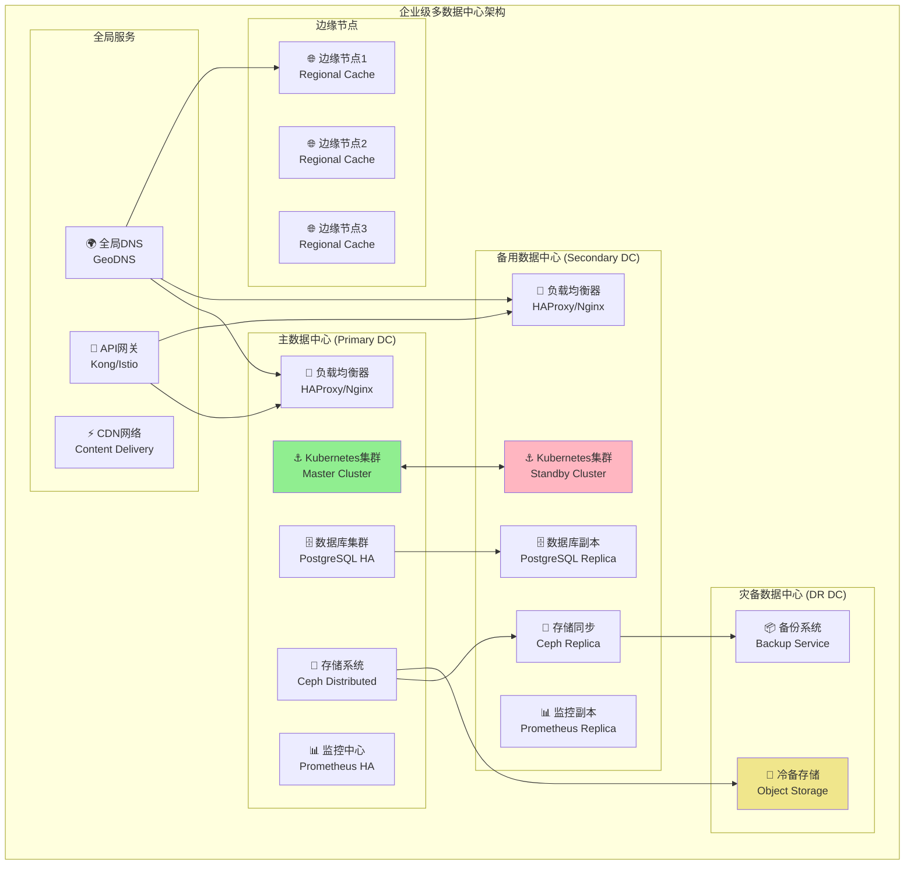

# 4.4.7 企业级智能环境的部署与运维

> "企业级部署不仅是技术的挑战，更是管理的艺术。在大规模、高并发、强可靠性要求下，智能环境层必须展现出工业级的稳定性和企业级的治理能力。"

## 🎯 本节学习目标

完成本节学习后，您将能够：
- ✅ 设计企业级多数据中心架构
- ✅ 实现大规模AI应用部署策略
- ✅ 建立企业级运维管理体系
- ✅ 构建高可用、高性能的生产环境

## 企业级架构设计

### 多数据中心架构规划

企业级智能环境需要支持多数据中心部署，确保业务连续性和灾难恢复能力：



### 高可用架构设计原则

```python
"""
企业级高可用架构设计
file: enterprise/ha-architecture.py
"""

from typing import Dict, List, Any, Optional
from dataclasses import dataclass
from enum import Enum
import asyncio
import logging

class AvailabilityTier(Enum):
    """可用性等级"""
    BASIC = "99.9%"      # 8.77小时/年停机
    STANDARD = "99.95%"  # 4.38小时/年停机
    HIGH = "99.99%"      # 52.6分钟/年停机
    ULTRA = "99.999%"    # 5.26分钟/年停机

class RedundancyStrategy(Enum):
    """冗余策略"""
    ACTIVE_PASSIVE = "active_passive"
    ACTIVE_ACTIVE = "active_active"
    N_PLUS_ONE = "n_plus_one"
    N_PLUS_M = "n_plus_m"

@dataclass
class HARequirement:
    """高可用需求"""
    service_name: str
    availability_tier: AvailabilityTier
    rpo: int  # 恢复点目标（秒）
    rto: int  # 恢复时间目标（秒）
    redundancy_strategy: RedundancyStrategy
    geographic_distribution: bool
    automated_failover: bool

class EnterpriseHAArchitect:
    """企业级高可用架构师"""
    
    def __init__(self):
        self.service_requirements = {}
        self.deployment_topology = {}
        self.failover_strategies = {}
        
    async def design_ha_architecture(self, 
                                   requirements: List[HARequirement]) -> Dict[str, Any]:
        """设计高可用架构"""
        
        # 分析服务依赖关系
        dependency_graph = await self._analyze_service_dependencies(requirements)
        
        # 设计冗余部署策略
        redundancy_design = await self._design_redundancy_strategy(requirements)
        
        # 规划数据中心分布
        datacenter_distribution = await self._plan_datacenter_distribution(
            requirements, redundancy_design
        )
        
        # 设计故障转移机制
        failover_mechanisms = await self._design_failover_mechanisms(
            requirements, datacenter_distribution
        )
        
        # 计算可用性预测
        availability_prediction = await self._predict_system_availability(
            redundancy_design, failover_mechanisms
        )
        
        return {
            "dependency_graph": dependency_graph,
            "redundancy_design": redundancy_design,
            "datacenter_distribution": datacenter_distribution,
            "failover_mechanisms": failover_mechanisms,
            "availability_prediction": availability_prediction,
            "implementation_roadmap": await self._create_implementation_roadmap(
                redundancy_design, datacenter_distribution
            )
        }
    
    async def _design_redundancy_strategy(self, 
                                        requirements: List[HARequirement]) -> Dict[str, Any]:
        """设计冗余策略"""
        
        redundancy_design = {}
        
        for req in requirements:
            service_name = req.service_name
            
            if req.redundancy_strategy == RedundancyStrategy.ACTIVE_ACTIVE:
                design = await self._design_active_active(req)
            elif req.redundancy_strategy == RedundancyStrategy.ACTIVE_PASSIVE:
                design = await self._design_active_passive(req)
            elif req.redundancy_strategy == RedundancyStrategy.N_PLUS_ONE:
                design = await self._design_n_plus_one(req)
            elif req.redundancy_strategy == RedundancyStrategy.N_PLUS_M:
                design = await self._design_n_plus_m(req)
            
            redundancy_design[service_name] = design
        
        return redundancy_design
    
    async def _design_active_active(self, requirement: HARequirement) -> Dict[str, Any]:
        """设计主主模式"""
        
        return {
            "strategy": "active_active",
            "instances": {
                "primary_dc": {
                    "min_replicas": 3,
                    "max_replicas": 10,
                    "resource_allocation": "50%"
                },
                "secondary_dc": {
                    "min_replicas": 3, 
                    "max_replicas": 10,
                    "resource_allocation": "50%"
                }
            },
            "load_distribution": {
                "algorithm": "weighted_round_robin",
                "weights": {"primary_dc": 60, "secondary_dc": 40}
            },
            "data_synchronization": {
                "method": "async_replication",
                "consistency_level": "eventual",
                "sync_interval": "1s"
            },
            "health_checks": {
                "endpoint": "/health",
                "interval": "10s",
                "timeout": "5s",
                "failure_threshold": 3
            }
        }
    
    async def _design_active_passive(self, requirement: HARequirement) -> Dict[str, Any]:
        """设计主备模式"""
        
        return {
            "strategy": "active_passive",
            "instances": {
                "primary_dc": {
                    "min_replicas": 5,
                    "max_replicas": 15,
                    "resource_allocation": "100%",
                    "status": "active"
                },
                "secondary_dc": {
                    "min_replicas": 3,
                    "max_replicas": 10,
                    "resource_allocation": "0%",
                    "status": "standby"
                }
            },
            "failover": {
                "trigger_conditions": [
                    "primary_dc_health < 50%",
                    "primary_dc_response_time > 5s",
                    "primary_dc_error_rate > 5%"
                ],
                "failover_time": f"{requirement.rto}s",
                "automated": requirement.automated_failover
            },
            "data_synchronization": {
                "method": "sync_replication",
                "consistency_level": "strong",
                "replication_lag_threshold": "100ms"
            }
        }

class EnterpriseDeploymentOrchestrator:
    """企业级部署编排器"""
    
    def __init__(self):
        self.deployment_strategies = {}
        self.rollout_policies = {}
        self.validation_rules = {}
        
    async def orchestrate_enterprise_deployment(self, 
                                              deployment_spec: Dict[str, Any]) -> Dict[str, Any]:
        """编排企业级部署"""
        
        # 预部署验证
        validation_result = await self._pre_deployment_validation(deployment_spec)
        if not validation_result["passed"]:
            return {"success": False, "errors": validation_result["errors"]}
        
        # 创建部署计划
        deployment_plan = await self._create_deployment_plan(deployment_spec)
        
        # 执行分阶段部署
        deployment_result = await self._execute_phased_deployment(deployment_plan)
        
        # 后部署验证
        post_validation = await self._post_deployment_validation(deployment_result)
        
        return {
            "success": deployment_result["success"],
            "deployment_id": deployment_result["deployment_id"],
            "phases_completed": deployment_result["phases_completed"],
            "validation_results": post_validation,
            "rollback_available": deployment_result["rollback_available"]
        }
    
    async def _create_deployment_plan(self, spec: Dict[str, Any]) -> Dict[str, Any]:
        """创建部署计划"""
        
        return {
            "deployment_id": f"enterprise_deploy_{int(asyncio.get_event_loop().time())}",
            "phases": [
                {
                    "phase_id": "infrastructure",
                    "description": "部署基础设施组件",
                    "components": ["kubernetes", "networking", "storage"],
                    "parallel": False,
                    "timeout": 1800,  # 30分钟
                    "validation": {
                        "health_checks": True,
                        "smoke_tests": True
                    }
                },
                {
                    "phase_id": "platform_services",
                    "description": "部署平台服务",
                    "components": ["monitoring", "logging", "security"],
                    "parallel": True,
                    "timeout": 1200,  # 20分钟
                    "validation": {
                        "integration_tests": True,
                        "performance_tests": True
                    }
                },
                {
                    "phase_id": "intelligent_environment",
                    "description": "部署智能环境层",
                    "components": [
                        "resource_scheduler",
                        "environment_manager", 
                        "security_controller"
                    ],
                    "parallel": False,
                    "timeout": 2400,  # 40分钟
                    "validation": {
                        "functional_tests": True,
                        "load_tests": True,
                        "security_tests": True
                    }
                },
                {
                    "phase_id": "traffic_migration",
                    "description": "流量切换",
                    "components": ["load_balancer", "dns_update"],
                    "parallel": False,
                    "timeout": 600,   # 10分钟
                    "validation": {
                        "traffic_validation": True,
                        "user_acceptance": True
                    }
                }
            ],
            "rollback_strategy": {
                "trigger_conditions": [
                    "phase_failure_rate > 50%",
                    "validation_failure",
                    "manual_trigger"
                ],
                "rollback_timeout": 900,  # 15分钟
                "data_preservation": True
            }
        }
```

## 大规模部署策略

### 分布式环境部署方案

```yaml
# 企业级Kubernetes集群配置
# file: enterprise/kubernetes-enterprise.yaml

apiVersion: v1
kind: Namespace
metadata:
  name: intelligent-environment-production
  labels:
    environment: production
    criticality: high
    compliance: required
  annotations:
    security.enterprise.com/policy: "strict"
    monitoring.enterprise.com/level: "comprehensive"

---
# 资源配额配置
apiVersion: v1
kind: ResourceQuota
metadata:
  name: intelligent-environment-quota
  namespace: intelligent-environment-production
spec:
  hard:
    requests.cpu: "100"
    requests.memory: 200Gi
    requests.nvidia.com/gpu: "10"
    limits.cpu: "200"
    limits.memory: 400Gi
    limits.nvidia.com/gpu: "20"
    persistentvolumeclaims: "20"
    services: "10"
    secrets: "50"
    configmaps: "50"

---
# 网络策略
apiVersion: networking.k8s.io/v1
kind: NetworkPolicy
metadata:
  name: intelligent-environment-network-policy
  namespace: intelligent-environment-production
spec:
  podSelector:
    matchLabels:
      app: intelligent-environment
  policyTypes:
  - Ingress
  - Egress
  ingress:
  - from:
    - namespaceSelector:
        matchLabels:
          name: intelligent-environment-production
    - podSelector:
        matchLabels:
          app: intelligent-environment
    ports:
    - protocol: TCP
      port: 8080
    - protocol: TCP
      port: 9090
  egress:
  - to:
    - namespaceSelector:
        matchLabels:
          name: monitoring
    ports:
    - protocol: TCP
      port: 9090
  - to:
    - namespaceSelector:
        matchLabels:
          name: logging
    ports:
    - protocol: TCP
      port: 9200

---
# 企业级资源调度器部署
apiVersion: apps/v1
kind: Deployment
metadata:
  name: resource-scheduler-enterprise
  namespace: intelligent-environment-production
  labels:
    app: resource-scheduler
    tier: platform
    version: enterprise
spec:
  replicas: 5
  strategy:
    type: RollingUpdate
    rollingUpdate:
      maxUnavailable: 1
      maxSurge: 2
  selector:
    matchLabels:
      app: resource-scheduler
  template:
    metadata:
      labels:
        app: resource-scheduler
        version: enterprise
      annotations:
        prometheus.io/scrape: "true"
        prometheus.io/port: "8080"
        prometheus.io/path: "/metrics"
        vault.hashicorp.com/agent-inject: "true"
        vault.hashicorp.com/role: "intelligent-environment"
    spec:
      serviceAccountName: resource-scheduler
      securityContext:
        runAsNonRoot: true
        runAsUser: 1000
        fsGroup: 2000
      affinity:
        podAntiAffinity:
          requiredDuringSchedulingIgnoredDuringExecution:
          - labelSelector:
              matchExpressions:
              - key: app
                operator: In
                values: ["resource-scheduler"]
            topologyKey: kubernetes.io/hostname
        nodeAffinity:
          requiredDuringSchedulingIgnoredDuringExecution:
            nodeSelectorTerms:
            - matchExpressions:
              - key: node-type
                operator: In
                values: ["compute-optimized"]
              - key: environment
                operator: In
                values: ["production"]
      tolerations:
      - key: "dedicated"
        operator: "Equal"
        value: "intelligent-environment"
        effect: "NoSchedule"
      containers:
      - name: resource-scheduler
        image: enterprise-registry.company.com/intelligent-environment/resource-scheduler:v2.0.0-enterprise
        ports:
        - containerPort: 8080
          name: http-api
        - containerPort: 9090
          name: grpc-api
        - containerPort: 8081
          name: metrics
        env:
        - name: ENVIRONMENT
          value: "production"
        - name: LOG_LEVEL
          value: "INFO"
        - name: CLUSTER_MODE
          value: "enterprise"
        - name: REDIS_URL
          valueFrom:
            secretKeyRef:
              name: redis-connection
              key: url
        - name: POSTGRES_URL
          valueFrom:
            secretKeyRef:
              name: postgres-connection
              key: url
        resources:
          requests:
            cpu: 2000m
            memory: 4Gi
          limits:
            cpu: 4000m
            memory: 8Gi
        livenessProbe:
          httpGet:
            path: /health/live
            port: 8080
          initialDelaySeconds: 60
          periodSeconds: 30
          timeoutSeconds: 10
          failureThreshold: 3
        readinessProbe:
          httpGet:
            path: /health/ready
            port: 8080
          initialDelaySeconds: 30
          periodSeconds: 10
          timeoutSeconds: 5
          successThreshold: 1
          failureThreshold: 3
        volumeMounts:
        - name: config
          mountPath: /etc/scheduler
          readOnly: true
        - name: tls-certs
          mountPath: /etc/tls
          readOnly: true
        - name: temp
          mountPath: /tmp
      volumes:
      - name: config
        configMap:
          name: resource-scheduler-config
      - name: tls-certs
        secret:
          secretName: scheduler-tls-certs
      - name: temp
        emptyDir: {}

---
# 水平Pod自动伸缩器
apiVersion: autoscaling/v2
kind: HorizontalPodAutoscaler
metadata:
  name: resource-scheduler-hpa
  namespace: intelligent-environment-production
spec:
  scaleTargetRef:
    apiVersion: apps/v1
    kind: Deployment
    name: resource-scheduler-enterprise
  minReplicas: 3
  maxReplicas: 15
  metrics:
  - type: Resource
    resource:
      name: cpu
      target:
        type: Utilization
        averageUtilization: 70
  - type: Resource
    resource:
      name: memory
      target:
        type: Utilization
        averageUtilization: 80
  - type: Pods
    pods:
      metric:
        name: scheduler_queue_length
      target:
        type: AverageValue
        averageValue: "10"
  behavior:
    scaleUp:
      stabilizationWindowSeconds: 60
      policies:
      - type: Percent
        value: 50
        periodSeconds: 60
    scaleDown:
      stabilizationWindowSeconds: 300
      policies:
      - type: Percent
        value: 10
        periodSeconds: 60

---
# Pod破坏预算
apiVersion: policy/v1
kind: PodDisruptionBudget
metadata:
  name: resource-scheduler-pdb
  namespace: intelligent-environment-production
spec:
  minAvailable: 60%
  selector:
    matchLabels:
      app: resource-scheduler
```

### 多区域部署策略

```python
"""
多区域部署管理器
file: enterprise/multi-region-deployment.py
"""

import asyncio
import logging
from typing import Dict, List, Any, Optional
from dataclasses import dataclass
from enum import Enum
import json

class RegionStatus(Enum):
    """区域状态"""
    ACTIVE = "active"
    STANDBY = "standby"
    MAINTENANCE = "maintenance"
    FAILED = "failed"

class DeploymentStrategy(Enum):
    """部署策略"""
    BLUE_GREEN = "blue_green"
    CANARY = "canary"
    ROLLING = "rolling"
    RECREATE = "recreate"

@dataclass
class RegionConfig:
    """区域配置"""
    region_id: str
    region_name: str
    kubernetes_endpoint: str
    status: RegionStatus
    capacity: Dict[str, int]
    latency_requirements: Dict[str, int]
    compliance_requirements: List[str]

class MultiRegionDeploymentManager:
    """多区域部署管理器"""
    
    def __init__(self):
        self.regions = {}
        self.deployment_policies = {}
        self.traffic_manager = TrafficManager()
        self.health_monitor = RegionHealthMonitor()
        
    async def register_region(self, region_config: RegionConfig):
        """注册部署区域"""
        
        self.regions[region_config.region_id] = region_config
        
        # 验证区域连接
        connectivity = await self._validate_region_connectivity(region_config)
        if not connectivity["success"]:
            raise Exception(f"区域连接验证失败: {connectivity['error']}")
        
        # 初始化区域监控
        await self.health_monitor.initialize_region_monitoring(region_config)
        
        logging.info(f"区域注册成功: {region_config.region_name}")
    
    async def deploy_to_regions(self, 
                              deployment_spec: Dict[str, Any],
                              target_regions: List[str],
                              strategy: DeploymentStrategy = DeploymentStrategy.ROLLING) -> Dict[str, Any]:
        """部署到多个区域"""
        
        deployment_results = {}
        
        if strategy == DeploymentStrategy.BLUE_GREEN:
            results = await self._blue_green_deployment(deployment_spec, target_regions)
        elif strategy == DeploymentStrategy.CANARY:
            results = await self._canary_deployment(deployment_spec, target_regions)
        elif strategy == DeploymentStrategy.ROLLING:
            results = await self._rolling_deployment(deployment_spec, target_regions)
        else:
            results = await self._recreate_deployment(deployment_spec, target_regions)
        
        return results
    
    async def _rolling_deployment(self,
                                deployment_spec: Dict[str, Any],
                                target_regions: List[str]) -> Dict[str, Any]:
        """滚动部署"""
        
        deployment_results = {
            "strategy": "rolling",
            "regions": {},
            "overall_success": True,
            "deployment_timeline": []
        }
        
        for region_id in target_regions:
            if region_id not in self.regions:
                deployment_results["regions"][region_id] = {
                    "success": False,
                    "error": "区域未注册"
                }
                continue
            
            region_config = self.regions[region_id]
            
            try:
                # 执行区域部署
                region_result = await self._deploy_to_single_region(
                    deployment_spec, region_config
                )
                
                deployment_results["regions"][region_id] = region_result
                deployment_results["deployment_timeline"].append({
                    "region": region_id,
                    "action": "deployed",
                    "timestamp": asyncio.get_event_loop().time(),
                    "success": region_result["success"]
                })
                
                if not region_result["success"]:
                    deployment_results["overall_success"] = False
                    logging.error(f"区域部署失败: {region_id}")
                    
                    # 根据策略决定是否继续
                    if deployment_spec.get("fail_fast", False):
                        break
                
            except Exception as e:
                deployment_results["regions"][region_id] = {
                    "success": False,
                    "error": str(e)
                }
                deployment_results["overall_success"] = False
                logging.error(f"区域部署异常: {region_id}, 错误: {str(e)}")
        
        return deployment_results
    
    async def _deploy_to_single_region(self,
                                     deployment_spec: Dict[str, Any],
                                     region_config: RegionConfig) -> Dict[str, Any]:
        """部署到单个区域"""
        
        try:
            # 准备区域特定配置
            region_spec = await self._prepare_region_specific_config(
                deployment_spec, region_config
            )
            
            # 执行部署
            deployment_client = KubernetesClient(region_config.kubernetes_endpoint)
            
            # 部署基础设施组件
            infra_result = await deployment_client.deploy_infrastructure(
                region_spec["infrastructure"]
            )
            
            if not infra_result["success"]:
                return {"success": False, "error": "基础设施部署失败", "details": infra_result}
            
            # 部署应用组件
            app_result = await deployment_client.deploy_applications(
                region_spec["applications"]
            )
            
            if not app_result["success"]:
                return {"success": False, "error": "应用部署失败", "details": app_result}
            
            # 验证部署
            validation_result = await self._validate_region_deployment(
                region_config, region_spec
            )
            
            if not validation_result["success"]:
                return {"success": False, "error": "部署验证失败", "details": validation_result}
            
            # 注册流量路由
            await self.traffic_manager.register_region_traffic(
                region_config.region_id, region_spec["traffic_config"]
            )
            
            return {
                "success": True,
                "infrastructure": infra_result,
                "applications": app_result,
                "validation": validation_result
            }
            
        except Exception as e:
            return {"success": False, "error": str(e)}
    
    async def _prepare_region_specific_config(self,
                                            deployment_spec: Dict[str, Any],
                                            region_config: RegionConfig) -> Dict[str, Any]:
        """准备区域特定配置"""
        
        # 基础配置
        region_spec = deployment_spec.copy()
        
        # 应用区域特定参数
        region_spec["metadata"] = {
            **region_spec.get("metadata", {}),
            "region": region_config.region_id,
            "region_name": region_config.region_name
        }
        
        # 调整资源配额
        if "resources" in region_spec:
            region_capacity = region_config.capacity
            for resource_type, requested in region_spec["resources"].items():
                available = region_capacity.get(resource_type, 0)
                if requested > available:
                    region_spec["resources"][resource_type] = available
                    logging.warning(f"区域 {region_config.region_id} 资源不足，调整 {resource_type} 从 {requested} 到 {available}")
        
        # 应用合规要求
        if region_config.compliance_requirements:
            region_spec["compliance"] = {
                **region_spec.get("compliance", {}),
                "requirements": region_config.compliance_requirements
            }
        
        # 配置延迟要求
        region_spec["performance"] = {
            **region_spec.get("performance", {}),
            "latency_requirements": region_config.latency_requirements
        }
        
        return region_spec

class TrafficManager:
    """流量管理器"""
    
    def __init__(self):
        self.routing_rules = {}
        self.health_checks = {}
        
    async def register_region_traffic(self,
                                    region_id: str,
                                    traffic_config: Dict[str, Any]):
        """注册区域流量路由"""
        
        # 配置负载均衡规则
        routing_rule = {
            "region_id": region_id,
            "weight": traffic_config.get("weight", 100),
            "priority": traffic_config.get("priority", 1),
            "health_check": {
                "endpoint": traffic_config.get("health_endpoint", "/health"),
                "interval": traffic_config.get("health_interval", 30),
                "timeout": traffic_config.get("health_timeout", 5)
            }
        }
        
        self.routing_rules[region_id] = routing_rule
        
        # 启动健康检查
        asyncio.create_task(
            self._monitor_region_health(region_id, routing_rule["health_check"])
        )
    
    async def _monitor_region_health(self,
                                   region_id: str,
                                   health_config: Dict[str, Any]):
        """监控区域健康状态"""
        
        while True:
            try:
                # 执行健康检查
                health_status = await self._perform_health_check(
                    region_id, health_config
                )
                
                # 更新路由权重
                if health_status["healthy"]:
                    await self._enable_region_traffic(region_id)
                else:
                    await self._disable_region_traffic(region_id)
                
                await asyncio.sleep(health_config["interval"])
                
            except Exception as e:
                logging.error(f"区域健康检查失败 {region_id}: {str(e)}")
                await asyncio.sleep(60)
    
    async def _perform_health_check(self,
                                  region_id: str,
                                  health_config: Dict[str, Any]) -> Dict[str, Any]:
        """执行健康检查"""
        
        # 简化的健康检查实现
        try:
            # 这里应该实际调用健康检查端点
            # 简化为模拟检查
            import random
            healthy = random.random() > 0.1  # 90%健康率
            
            return {
                "healthy": healthy,
                "response_time": random.uniform(0.1, 2.0),
                "checked_at": asyncio.get_event_loop().time()
            }
        except Exception as e:
            return {
                "healthy": False,
                "error": str(e),
                "checked_at": asyncio.get_event_loop().time()
            }
```

## 企业级运维管理体系

### 运维流程标准化

```python
"""
企业级运维流程管理
file: enterprise/ops-process-manager.py
"""

import asyncio
import logging
from typing import Dict, List, Any, Optional
from dataclasses import dataclass
from enum import Enum
from datetime import datetime, timedelta

class ProcessStatus(Enum):
    """流程状态"""
    PENDING = "pending"
    IN_PROGRESS = "in_progress"
    WAITING_APPROVAL = "waiting_approval"
    APPROVED = "approved"
    REJECTED = "rejected"
    COMPLETED = "completed"
    FAILED = "failed"
    CANCELLED = "cancelled"

class ChangeCategory(Enum):
    """变更类别"""
    EMERGENCY = "emergency"      # 紧急变更
    STANDARD = "standard"        # 标准变更
    NORMAL = "normal"           # 普通变更
    MAJOR = "major"             # 重大变更

@dataclass
class ChangeRequest:
    """变更请求"""
    request_id: str
    title: str
    description: str
    category: ChangeCategory
    requestor: str
    business_impact: str
    technical_impact: str
    rollback_plan: str
    testing_plan: str
    implementation_plan: str
    scheduled_start: datetime
    estimated_duration: int
    affected_systems: List[str]
    approval_required: bool

class EnterpriseOpsProcessManager:
    """企业级运维流程管理器"""
    
    def __init__(self):
        self.change_requests = {}
        self.approval_workflows = {}
        self.process_templates = {}
        self.compliance_rules = {}
        self.notification_service = NotificationService()
        
    async def initialize_process_templates(self):
        """初始化流程模板"""
        
        # 紧急变更流程
        self.process_templates["emergency"] = {
            "steps": [
                {
                    "step_id": "impact_assessment",
                    "description": "影响评估",
                    "required": True,
                    "timeout": 300,  # 5分钟
                    "approvers": ["ops_manager"]
                },
                {
                    "step_id": "implementation",
                    "description": "执行变更",
                    "required": True,
                    "timeout": 1800,  # 30分钟
                    "executor": "ops_engineer"
                },
                {
                    "step_id": "validation",
                    "description": "验证结果",
                    "required": True,
                    "timeout": 600,   # 10分钟
                    "validator": "ops_engineer"
                }
            ],
            "notifications": {
                "start": ["ops_team", "management"],
                "completion": ["ops_team", "management", "stakeholders"]
            }
        }
        
        # 标准变更流程
        self.process_templates["standard"] = {
            "steps": [
                {
                    "step_id": "documentation_review",
                    "description": "文档审查",
                    "required": True,
                    "timeout": 3600,  # 1小时
                    "approvers": ["senior_engineer"]
                },
                {
                    "step_id": "technical_approval",
                    "description": "技术审批",
                    "required": True,
                    "timeout": 7200,  # 2小时
                    "approvers": ["technical_lead"]
                },
                {
                    "step_id": "schedule_approval",
                    "description": "计划审批",
                    "required": True,
                    "timeout": 14400, # 4小时
                    "approvers": ["ops_manager"]
                },
                {
                    "step_id": "implementation",
                    "description": "执行变更",
                    "required": True,
                    "timeout": 7200,  # 2小时
                    "executor": "ops_engineer"
                },
                {
                    "step_id": "validation",
                    "description": "验证结果",
                    "required": True,
                    "timeout": 1800,  # 30分钟
                    "validator": "ops_engineer"
                },
                {
                    "step_id": "closure",
                    "description": "变更关闭",
                    "required": True,
                    "timeout": 1800,  # 30分钟
                    "closer": "requestor"
                }
            ],
            "notifications": {
                "submitted": ["approvers"],
                "approved": ["requestor", "ops_team"],
                "started": ["stakeholders"],
                "completed": ["all_involved"]
            }
        }
        
        # 重大变更流程
        self.process_templates["major"] = {
            "steps": [
                {
                    "step_id": "preliminary_review",
                    "description": "初步审查",
                    "required": True,
                    "timeout": 7200,  # 2小时
                    "approvers": ["senior_engineer", "security_officer"]
                },
                {
                    "step_id": "risk_assessment",
                    "description": "风险评估",
                    "required": True,
                    "timeout": 14400, # 4小时
                    "approvers": ["risk_manager"]
                },
                {
                    "step_id": "business_approval",
                    "description": "业务审批",
                    "required": True,
                    "timeout": 86400, # 24小时
                    "approvers": ["business_owner"]
                },
                {
                    "step_id": "technical_approval",
                    "description": "技术审批",
                    "required": True,
                    "timeout": 14400, # 4小时
                    "approvers": ["technical_architect", "ops_manager"]
                },
                {
                    "step_id": "cab_approval",
                    "description": "变更委员会审批",
                    "required": True,
                    "timeout": 172800, # 48小时
                    "approvers": ["change_advisory_board"]
                },
                {
                    "step_id": "implementation",
                    "description": "执行变更",
                    "required": True,
                    "timeout": 14400,  # 4小时
                    "executor": "ops_team"
                },
                {
                    "step_id": "validation",
                    "description": "验证结果",
                    "required": True,
                    "timeout": 3600,   # 1小时
                    "validator": "ops_team"
                },
                {
                    "step_id": "post_implementation_review",
                    "description": "实施后审查",
                    "required": True,
                    "timeout": 86400,  # 24小时
                    "reviewer": "change_advisory_board"
                }
            ],
            "notifications": {
                "submitted": ["all_approvers", "stakeholders"],
                "each_approval": ["next_approvers", "requestor"],
                "final_approval": ["ops_team", "stakeholders"],
                "started": ["all_involved"],
                "completed": ["all_involved", "management"],
                "failed": ["all_involved", "management", "incident_team"]
            }
        }
    
    async def submit_change_request(self, change_request: ChangeRequest) -> str:
        """提交变更请求"""
        
        # 验证变更请求
        validation_result = await self._validate_change_request(change_request)
        if not validation_result["valid"]:
            raise ValueError(f"变更请求验证失败: {validation_result['errors']}")
        
        # 确定流程模板
        template_name = change_request.category.value
        if template_name not in self.process_templates:
            template_name = "normal"
        
        # 创建工作流实例
        workflow_instance = await self._create_workflow_instance(
            change_request, self.process_templates[template_name]
        )
        
        # 存储变更请求
        self.change_requests[change_request.request_id] = change_request
        
        # 启动审批流程
        asyncio.create_task(
            self._execute_approval_workflow(change_request.request_id, workflow_instance)
        )
        
        # 发送通知
        await self.notification_service.notify_change_submitted(change_request)
        
        logging.info(f"变更请求已提交: {change_request.request_id}")
        return change_request.request_id
    
    async def _validate_change_request(self, change_request: ChangeRequest) -> Dict[str, Any]:
        """验证变更请求"""
        
        errors = []
        
        # 必填字段检查
        required_fields = ["title", "description", "business_impact", "rollback_plan"]
        for field in required_fields:
            if not getattr(change_request, field, None):
                errors.append(f"缺少必填字段: {field}")
        
        # 时间窗口检查
        if change_request.scheduled_start < datetime.now():
            errors.append("计划开始时间不能早于当前时间")
        
        # 业务时间窗口检查
        if change_request.category != ChangeCategory.EMERGENCY:
            if await self._is_business_hours(change_request.scheduled_start):
                if change_request.category == ChangeCategory.MAJOR:
                    errors.append("重大变更不允许在业务时间执行")
        
        # 变更冲突检查
        conflicts = await self._check_change_conflicts(change_request)
        if conflicts:
            errors.append(f"存在变更冲突: {', '.join(conflicts)}")
        
        return {
            "valid": len(errors) == 0,
            "errors": errors
        }
    
    async def _execute_approval_workflow(self,
                                       request_id: str,
                                       workflow_instance: Dict[str, Any]):
        """执行审批工作流"""
        
        change_request = self.change_requests[request_id]
        steps = workflow_instance["steps"]
        
        for step in steps:
            try:
                # 执行工作流步骤
                step_result = await self._execute_workflow_step(
                    change_request, step
                )
                
                if not step_result["success"]:
                    # 步骤失败，终止工作流
                    await self._handle_workflow_failure(
                        request_id, step, step_result["error"]
                    )
                    return
                
                # 记录步骤完成
                workflow_instance["completed_steps"].append(step["step_id"])
                
            except Exception as e:
                await self._handle_workflow_failure(request_id, step, str(e))
                return
        
        # 所有步骤完成，变更批准
        await self._complete_approval_workflow(request_id)
    
    async def _execute_workflow_step(self,
                                   change_request: ChangeRequest,
                                   step: Dict[str, Any]) -> Dict[str, Any]:
        """执行工作流步骤"""
        
        step_type = step["step_id"]
        
        if "approval" in step_type:
            return await self._handle_approval_step(change_request, step)
        elif step_type == "implementation":
            return await self._handle_implementation_step(change_request, step)
        elif step_type == "validation":
            return await self._handle_validation_step(change_request, step)
        else:
            return await self._handle_generic_step(change_request, step)
    
    async def _handle_approval_step(self,
                                  change_request: ChangeRequest,
                                  step: Dict[str, Any]) -> Dict[str, Any]:
        """处理审批步骤"""
        
        approvers = step.get("approvers", [])
        timeout = step.get("timeout", 3600)
        
        # 发送审批请求
        approval_requests = []
        for approver in approvers:
            approval_request = {
                "request_id": change_request.request_id,
                "approver": approver,
                "step": step["step_id"],
                "deadline": datetime.now() + timedelta(seconds=timeout)
            }
            approval_requests.append(approval_request)
            
            await self.notification_service.notify_approval_request(
                change_request, approver, approval_request
            )
        
        # 等待审批结果
        approval_results = await self._wait_for_approvals(
            approval_requests, timeout
        )
        
        # 检查审批结果
        approved_count = sum(1 for result in approval_results if result.get("approved", False))
        required_approvals = len(approvers)
        
        if approved_count >= required_approvals:
            return {"success": True, "approvals": approval_results}
        else:
            return {
                "success": False,
                "error": f"审批不足: {approved_count}/{required_approvals}",
                "approvals": approval_results
            }

## 本节总结

本节深入介绍了企业级智能环境的部署与运维：

### 🎯 核心企业级能力

1. **企业级架构设计**：
   - 多数据中心高可用架构
   - 分布式环境部署策略
   - 企业级安全和合规要求
   - 自动化故障转移机制

2. **大规模部署管理**：
   - 多区域协调部署
   - 分阶段发布策略
   - 自动化回滚机制
   - 流量智能调度

3. **运维流程标准化**：
   - 标准化变更管理流程
   - 多级审批工作流
   - 风险评估和影响分析
   - 合规性检查和审计

### 🔧 关键技术实现

- **高可用设计**：主备、主主、N+M等多种冗余策略
- **自动化部署**：基于Kubernetes的企业级部署编排
- **流量管理**：智能负载均衡和故障切换
- **流程引擎**：工作流驱动的运维流程管理

### 🚀 企业级价值

- **业务连续性保障**：99.99%以上的高可用性
- **风险控制能力**：标准化的风险评估和控制流程
- **合规性支持**：满足企业安全和合规要求
- **运维效率提升**：自动化和标准化的运维流程

---

**下一步学习**：完成了企业级部署与运维的学习后，我们将学习最后一个章节——云原生智能环境的DevOps实践，了解如何将现代DevOps理念应用到智能环境的管理中。

> **💡 企业级要诀**：企业级部署不仅要考虑技术可行性，更要关注业务连续性、风险控制和合规要求。通过标准化流程、自动化工具和智能监控，实现大规模、高可靠的智能环境运营。
