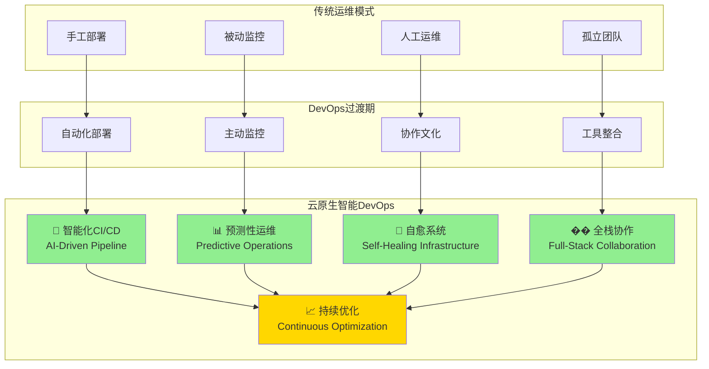

# 4.4.8 云原生智能环境的DevOps实践

> "DevOps不仅是技术实践的集合，更是文化变革的催化剂。在智能环境层中，DevOps理念与云原生技术的结合，让AI应用的交付和运维进入了一个全新的时代。"

## 🎯 本节学习目标

完成本节学习后，您将能够：
- ✅ 理解云原生DevOps的核心理念和实践
- ✅ 实现智能化的CI/CD流水线
- ✅ 建立容器化的开发与运维流程
- ✅ 构建持续改进的DevOps文化体系

## 云原生DevOps理念

### 智能环境层的DevOps转型

传统运维向智能化DevOps的演进过程：



### DevOps文化在智能环境中的体现

```python
"""
DevOps文化实践框架
file: devops/culture-framework.py
"""

from typing import Dict, List, Any, Optional
from dataclasses import dataclass
from enum import Enum
import asyncio
import logging

class DevOpsPrinciple(Enum):
    """DevOps原则"""
    COLLABORATION = "collaboration"          # 协作
    AUTOMATION = "automation"               # 自动化
    CONTINUOUS_INTEGRATION = "ci"           # 持续集成
    CONTINUOUS_DELIVERY = "cd"              # 持续交付
    MONITORING = "monitoring"               # 监控
    FEEDBACK = "feedback"                   # 反馈
    EXPERIMENTATION = "experimentation"     # 实验
    LEARNING = "learning"                   # 学习

class MaturityLevel(Enum):
    """成熟度等级"""
    INITIAL = 1      # 初始级
    MANAGED = 2      # 管理级
    DEFINED = 3      # 定义级
    QUANTIFIED = 4   # 量化级
    OPTIMIZED = 5    # 优化级

@dataclass
class DevOpsMetric:
    """DevOps指标"""
    name: str
    category: str
    current_value: float
    target_value: float
    trend: str
    measurement_unit: str

class DevOpsCultureAssessment:
    """DevOps文化评估"""
    
    def __init__(self):
        self.assessment_criteria = {}
        self.team_metrics = {}
        self.culture_indicators = {}
        
    async def assess_devops_maturity(self, team_id: str) -> Dict[str, Any]:
        """评估DevOps成熟度"""
        
        # 评估各个维度
        collaboration_score = await self._assess_collaboration(team_id)
        automation_score = await self._assess_automation(team_id)
        ci_cd_score = await self._assess_ci_cd(team_id)
        monitoring_score = await self._assess_monitoring(team_id)
        feedback_score = await self._assess_feedback_loops(team_id)
        
        # 计算综合得分
        overall_score = (
            collaboration_score * 0.25 +
            automation_score * 0.25 +
            ci_cd_score * 0.20 +
            monitoring_score * 0.15 +
            feedback_score * 0.15
        )
        
        # 确定成熟度等级
        maturity_level = self._determine_maturity_level(overall_score)
        
        # 生成改进建议
        improvement_recommendations = await self._generate_improvement_recommendations(
            team_id, {
                "collaboration": collaboration_score,
                "automation": automation_score,
                "ci_cd": ci_cd_score,
                "monitoring": monitoring_score,
                "feedback": feedback_score
            }
        )
        
        return {
            "team_id": team_id,
            "overall_score": overall_score,
            "maturity_level": maturity_level,
            "dimension_scores": {
                "collaboration": collaboration_score,
                "automation": automation_score,
                "ci_cd": ci_cd_score,
                "monitoring": monitoring_score,
                "feedback": feedback_score
            },
            "improvement_recommendations": improvement_recommendations,
            "assessment_date": asyncio.get_event_loop().time()
        }
    
    async def _assess_collaboration(self, team_id: str) -> float:
        """评估协作能力"""
        
        # 收集协作指标
        metrics = await self._collect_collaboration_metrics(team_id)
        
        # 计算得分
        cross_team_projects = min(metrics.get("cross_team_projects", 0) / 5, 1.0)
        shared_tools_adoption = min(metrics.get("shared_tools_adoption", 0) / 100, 1.0)
        knowledge_sharing_frequency = min(metrics.get("knowledge_sharing_events", 0) / 20, 1.0)
        communication_effectiveness = metrics.get("communication_score", 0) / 10
        
        collaboration_score = (
            cross_team_projects * 0.3 +
            shared_tools_adoption * 0.3 +
            knowledge_sharing_frequency * 0.2 +
            communication_effectiveness * 0.2
        )
        
        return min(collaboration_score * 10, 10.0)
    
    async def _assess_automation(self, team_id: str) -> float:
        """评估自动化水平"""
        
        metrics = await self._collect_automation_metrics(team_id)
        
        # 部署自动化
        deployment_automation = metrics.get("automated_deployments", 0) / metrics.get("total_deployments", 1)
        
        # 测试自动化
        test_automation = metrics.get("automated_test_coverage", 0) / 100
        
        # 基础设施自动化
        infrastructure_automation = metrics.get("infrastructure_as_code_coverage", 0) / 100
        
        # 监控自动化
        monitoring_automation = metrics.get("automated_monitoring_coverage", 0) / 100
        
        automation_score = (
            deployment_automation * 0.3 +
            test_automation * 0.3 +
            infrastructure_automation * 0.2 +
            monitoring_automation * 0.2
        )
        
        return min(automation_score * 10, 10.0)
    
    def _determine_maturity_level(self, overall_score: float) -> MaturityLevel:
        """确定成熟度等级"""
        
        if overall_score >= 9.0:
            return MaturityLevel.OPTIMIZED
        elif overall_score >= 7.0:
            return MaturityLevel.QUANTIFIED
        elif overall_score >= 5.0:
            return MaturityLevel.DEFINED
        elif overall_score >= 3.0:
            return MaturityLevel.MANAGED
        else:
            return MaturityLevel.INITIAL

class DevOpsTransformationCoach:
    """DevOps转型教练"""
    
    def __init__(self):
        self.transformation_plans = {}
        self.success_patterns = {}
        self.anti_patterns = {}
        
    async def create_transformation_roadmap(self, 
                                          current_state: Dict[str, Any],
                                          target_state: Dict[str, Any]) -> Dict[str, Any]:
        """创建转型路线图"""
        
        # 分析差距
        gap_analysis = await self._analyze_gaps(current_state, target_state)
        
        # 制定转型阶段
        transformation_phases = await self._design_transformation_phases(gap_analysis)
        
        # 识别风险和阻碍
        risks_and_blockers = await self._identify_risks_and_blockers(
            current_state, transformation_phases
        )
        
        # 制定成功指标
        success_metrics = await self._define_success_metrics(target_state)
        
        return {
            "gap_analysis": gap_analysis,
            "transformation_phases": transformation_phases,
            "risks_and_blockers": risks_and_blockers,
            "success_metrics": success_metrics,
            "estimated_timeline": await self._estimate_transformation_timeline(transformation_phases),
            "resource_requirements": await self._calculate_resource_requirements(transformation_phases)
        }
    
    async def _design_transformation_phases(self, 
                                          gap_analysis: Dict[str, Any]) -> List[Dict[str, Any]]:
        """设计转型阶段"""
        
        phases = []
        
        # 第一阶段：基础建设
        if gap_analysis["automation"]["score"] < 5:
            phases.append({
                "phase": "foundation",
                "duration_weeks": 8,
                "objectives": [
                    "建立基础自动化工具链",
                    "实施版本控制最佳实践",
                    "建立基础监控体系"
                ],
                "deliverables": [
                    "CI/CD基础流水线",
                    "代码质量检查工具",
                    "基础监控仪表板"
                ],
                "prerequisites": [],
                "success_criteria": [
                    "自动化部署覆盖率达到60%",
                    "代码检查通过率达到90%",
                    "基础监控指标可视化"
                ]
            })
        
        # 第二阶段：流程优化
        phases.append({
            "phase": "process_optimization",
            "duration_weeks": 12,
            "objectives": [
                "优化CI/CD流水线",
                "实施自动化测试",
                "建立反馈循环机制"
            ],
            "deliverables": [
                "完整的CI/CD流水线",
                "自动化测试套件",
                "性能监控系统"
            ],
            "prerequisites": ["foundation"],
            "success_criteria": [
                "部署频率达到每日多次",
                "测试自动化覆盖率达到80%",
                "平均恢复时间缩短50%"
            ]
        })
        
        # 第三阶段：文化转型
        phases.append({
            "phase": "culture_transformation",
            "duration_weeks": 16,
            "objectives": [
                "建立跨团队协作机制",
                "实施持续改进文化",
                "培养全栈思维"
            ],
            "deliverables": [
                "跨团队协作平台",
                "持续改进流程",
                "技能发展计划"
            ],
            "prerequisites": ["process_optimization"],
            "success_criteria": [
                "团队协作评分达到8分以上",
                "改进提案实施率达到70%",
                "跨技能人员比例达到60%"
            ]
        })
        
        # 第四阶段：智能化升级
        phases.append({
            "phase": "intelligent_evolution",
            "duration_weeks": 20,
            "objectives": [
                "实施AI驱动的DevOps",
                "建立预测性运维",
                "实现自愈系统"
            ],
            "deliverables": [
                "智能CI/CD流水线",
                "预测性监控系统",
                "自动故障恢复系统"
            ],
            "prerequisites": ["culture_transformation"],
            "success_criteria": [
                "预测性告警准确率达到85%",
                "自动故障恢复成功率达到90%",
                "系统可用性达到99.9%"
            ]
        })
        
        return phases

## 智能化CI/CD流水线

### AI驱动的代码质量检查

```python
"""
AI驱动的CI/CD流水线
file: devops/intelligent-pipeline.py
"""

import asyncio
import logging
from typing import Dict, List, Any, Optional
from dataclasses import dataclass
from enum import Enum
import json

class PipelineStage(Enum):
    """流水线阶段"""
    CODE_ANALYSIS = "code_analysis"
    SECURITY_SCAN = "security_scan"
    BUILD = "build"
    TEST = "test"
    QUALITY_GATE = "quality_gate"
    DEPLOYMENT = "deployment"
    VALIDATION = "validation"
    MONITORING = "monitoring"

class QualityGateResult(Enum):
    """质量门禁结果"""
    PASSED = "passed"
    FAILED = "failed"
    WARNING = "warning"

@dataclass
class PipelineJob:
    """流水线任务"""
    job_id: str
    stage: PipelineStage
    repository: str
    branch: str
    commit_hash: str
    author: str
    triggered_by: str
    configuration: Dict[str, Any]

class IntelligentPipelineOrchestrator:
    """智能流水线编排器"""
    
    def __init__(self):
        self.ai_code_analyzer = AICodeAnalyzer()
        self.security_scanner = IntelligentSecurityScanner()
        self.quality_predictor = QualityPredictor()
        self.performance_optimizer = PipelineOptimizer()
        
    async def execute_intelligent_pipeline(self, job: PipelineJob) -> Dict[str, Any]:
        """执行智能化CI/CD流水线"""
        
        pipeline_results = {
            "job_id": job.job_id,
            "stages": {},
            "overall_result": "success",
            "recommendations": [],
            "metrics": {}
        }
        
        try:
            # 阶段1：AI代码分析
            code_analysis = await self._execute_code_analysis(job)
            pipeline_results["stages"]["code_analysis"] = code_analysis
            
            if code_analysis["result"] == "failed":
                pipeline_results["overall_result"] = "failed"
                return pipeline_results
            
            # 阶段2：智能安全扫描
            security_scan = await self._execute_security_scan(job)
            pipeline_results["stages"]["security_scan"] = security_scan
            
            # 阶段3：构建优化
            build_result = await self._execute_optimized_build(job, code_analysis)
            pipeline_results["stages"]["build"] = build_result
            
            if build_result["result"] == "failed":
                pipeline_results["overall_result"] = "failed"
                return pipeline_results
            
            # 阶段4：智能测试执行
            test_result = await self._execute_intelligent_testing(job, code_analysis)
            pipeline_results["stages"]["test"] = test_result
            
            # 阶段5：质量门禁
            quality_gate = await self._execute_quality_gate(job, {
                "code_analysis": code_analysis,
                "security_scan": security_scan,
                "test_result": test_result
            })
            pipeline_results["stages"]["quality_gate"] = quality_gate
            
            if quality_gate["result"] == QualityGateResult.FAILED:
                pipeline_results["overall_result"] = "failed"
                return pipeline_results
            
            # 阶段6：智能部署
            if job.configuration.get("auto_deploy", False):
                deployment_result = await self._execute_intelligent_deployment(job)
                pipeline_results["stages"]["deployment"] = deployment_result
            
            # 生成智能推荐
            recommendations = await self._generate_pipeline_recommendations(pipeline_results)
            pipeline_results["recommendations"] = recommendations
            
            return pipeline_results
            
        except Exception as e:
            pipeline_results["overall_result"] = "error"
            pipeline_results["error"] = str(e)
            return pipeline_results
    
    async def _execute_code_analysis(self, job: PipelineJob) -> Dict[str, Any]:
        """执行AI代码分析"""
        
        # 获取代码变更
        code_changes = await self._get_code_changes(job.repository, job.commit_hash)
        
        # AI代码质量分析
        quality_analysis = await self.ai_code_analyzer.analyze_code_quality(
            code_changes
        )
        
        # 代码复杂度分析
        complexity_analysis = await self.ai_code_analyzer.analyze_complexity(
            code_changes
        )
        
        # 潜在缺陷预测
        defect_prediction = await self.ai_code_analyzer.predict_defects(
            code_changes
        )
        
        # 代码审查建议
        review_suggestions = await self.ai_code_analyzer.generate_review_suggestions(
            code_changes
        )
        
        # 计算总体评分
        overall_score = (
            quality_analysis["score"] * 0.4 +
            complexity_analysis["score"] * 0.3 +
            defect_prediction["score"] * 0.3
        )
        
        result = "passed" if overall_score >= 7.0 else "failed"
        
        return {
            "result": result,
            "overall_score": overall_score,
            "quality_analysis": quality_analysis,
            "complexity_analysis": complexity_analysis,
            "defect_prediction": defect_prediction,
            "review_suggestions": review_suggestions,
            "execution_time": 120  # 秒
        }
    
    async def _execute_security_scan(self, job: PipelineJob) -> Dict[str, Any]:
        """执行智能安全扫描"""
        
        # 静态代码安全分析
        sast_results = await self.security_scanner.static_analysis_security_testing(
            job.repository, job.commit_hash
        )
        
        # 依赖漏洞检查
        dependency_scan = await self.security_scanner.scan_dependencies(
            job.repository
        )
        
        # 容器镜像安全扫描
        if job.configuration.get("container_build", False):
            container_scan = await self.security_scanner.scan_container_image(
                job.configuration["container_image"]
            )
        else:
            container_scan = {"vulnerabilities": [], "score": 10.0}
        
        # 秘密泄露检查
        secrets_scan = await self.security_scanner.scan_for_secrets(
            job.repository, job.commit_hash
        )
        
        # 计算安全评分
        security_score = (
            sast_results["score"] * 0.3 +
            dependency_scan["score"] * 0.3 +
            container_scan["score"] * 0.2 +
            secrets_scan["score"] * 0.2
        )
        
        # 确定结果
        result = "passed" if security_score >= 8.0 else "failed"
        
        return {
            "result": result,
            "security_score": security_score,
            "sast_results": sast_results,
            "dependency_scan": dependency_scan,
            "container_scan": container_scan,
            "secrets_scan": secrets_scan,
            "execution_time": 180
        }
    
    async def _execute_quality_gate(self, 
                                  job: PipelineJob,
                                  stage_results: Dict[str, Any]) -> Dict[str, Any]:
        """执行质量门禁"""
        
        quality_metrics = {}
        gate_rules = job.configuration.get("quality_gates", {})
        
        # 代码质量指标
        code_quality_score = stage_results["code_analysis"]["overall_score"]
        quality_metrics["code_quality"] = {
            "score": code_quality_score,
            "threshold": gate_rules.get("code_quality_threshold", 7.0),
            "passed": code_quality_score >= gate_rules.get("code_quality_threshold", 7.0)
        }
        
        # 安全指标
        security_score = stage_results["security_scan"]["security_score"]
        quality_metrics["security"] = {
            "score": security_score,
            "threshold": gate_rules.get("security_threshold", 8.0),
            "passed": security_score >= gate_rules.get("security_threshold", 8.0)
        }
        
        # 测试覆盖率
        test_coverage = stage_results["test_result"]["coverage_percentage"]
        quality_metrics["test_coverage"] = {
            "score": test_coverage,
            "threshold": gate_rules.get("coverage_threshold", 80.0),
            "passed": test_coverage >= gate_rules.get("coverage_threshold", 80.0)
        }
        
        # 性能指标
        performance_score = stage_results["test_result"]["performance_score"]
        quality_metrics["performance"] = {
            "score": performance_score,
            "threshold": gate_rules.get("performance_threshold", 8.0),
            "passed": performance_score >= gate_rules.get("performance_threshold", 8.0)
        }
        
        # 计算总体结果
        passed_gates = sum(1 for metric in quality_metrics.values() if metric["passed"])
        total_gates = len(quality_metrics)
        
        if passed_gates == total_gates:
            result = QualityGateResult.PASSED
        elif passed_gates >= total_gates * 0.8:  # 80%通过率
            result = QualityGateResult.WARNING
        else:
            result = QualityGateResult.FAILED
        
        return {
            "result": result.value,
            "quality_metrics": quality_metrics,
            "passed_gates": passed_gates,
            "total_gates": total_gates,
            "pass_rate": passed_gates / total_gates,
            "execution_time": 30
        }

class AICodeAnalyzer:
    """AI代码分析器"""
    
    def __init__(self):
        self.ml_models = {}
        self.code_patterns = {}
        
    async def analyze_code_quality(self, code_changes: List[Dict[str, Any]]) -> Dict[str, Any]:
        """分析代码质量"""
        
        quality_issues = []
        total_score = 0
        
        for change in code_changes:
            file_path = change["file_path"]
            added_lines = change["added_lines"]
            
            # 代码风格检查
            style_issues = await self._check_code_style(file_path, added_lines)
            quality_issues.extend(style_issues)
            
            # 代码重复检查
            duplication_issues = await self._check_code_duplication(file_path, added_lines)
            quality_issues.extend(duplication_issues)
            
            # 命名规范检查
            naming_issues = await self._check_naming_conventions(file_path, added_lines)
            quality_issues.extend(naming_issues)
        
        # 计算质量评分
        if not quality_issues:
            total_score = 10.0
        else:
            # 基于问题严重程度计算扣分
            severity_weights = {"critical": 3, "major": 2, "minor": 1, "info": 0.5}
            total_deduction = sum(
                severity_weights.get(issue["severity"], 1) 
                for issue in quality_issues
            )
            total_score = max(10.0 - total_deduction, 0)
        
        return {
            "score": total_score,
            "issues": quality_issues,
            "issue_count": len(quality_issues),
            "analysis_summary": await self._generate_quality_summary(quality_issues)
        }
    
    async def predict_defects(self, code_changes: List[Dict[str, Any]]) -> Dict[str, Any]:
        """预测潜在缺陷"""
        
        defect_predictions = []
        
        for change in code_changes:
            file_path = change["file_path"]
            added_lines = change["added_lines"]
            
            # 使用ML模型预测缺陷概率
            defect_probability = await self._predict_defect_probability(
                file_path, added_lines
            )
            
            if defect_probability > 0.7:  # 高风险阈值
                defect_predictions.append({
                    "file_path": file_path,
                    "defect_probability": defect_probability,
                    "risk_level": "high",
                    "predicted_defect_types": await self._predict_defect_types(
                        file_path, added_lines
                    ),
                    "mitigation_suggestions": await self._suggest_defect_mitigation(
                        file_path, defect_probability
                    )
                })
        
        # 计算总体缺陷风险评分
        if not defect_predictions:
            risk_score = 10.0
        else:
            avg_probability = sum(p["defect_probability"] for p in defect_predictions) / len(defect_predictions)
            risk_score = (1.0 - avg_probability) * 10
        
        return {
            "score": risk_score,
            "predictions": defect_predictions,
            "high_risk_files": len(defect_predictions),
            "average_risk": sum(p["defect_probability"] for p in defect_predictions) / len(defect_predictions) if defect_predictions else 0
        }

## 容器化开发流程

### Docker多阶段构建优化

```dockerfile
# 智能环境层优化的多阶段Dockerfile
# file: docker/intelligent-environment.Dockerfile

# 第一阶段：基础环境准备
FROM python:3.11-slim as base
LABEL maintainer="AI DevOps Team <devops@company.com>"
LABEL description="Intelligent Environment Layer - Optimized Container"

# 设置工作目录
WORKDIR /app

# 安装系统依赖
RUN apt-get update && apt-get install -y \
    curl \
    git \
    gcc \
    g++ \
    && rm -rf /var/lib/apt/lists/*

# 第二阶段：依赖构建
FROM base as dependencies
COPY requirements.txt .
COPY requirements-dev.txt .

# 创建虚拟环境并安装依赖
RUN python -m venv /opt/venv
ENV PATH="/opt/venv/bin:$PATH"

# 安装生产依赖
RUN pip install --no-cache-dir --upgrade pip && \
    pip install --no-cache-dir -r requirements.txt

# 第三阶段：开发环境（可选）
FROM dependencies as development
ENV ENVIRONMENT=development
ENV LOG_LEVEL=DEBUG

# 安装开发依赖
RUN pip install --no-cache-dir -r requirements-dev.txt

# 安装开发工具
RUN pip install --no-cache-dir \
    pytest \
    pytest-cov \
    black \
    flake8 \
    mypy

COPY . .

# 第四阶段：测试环境
FROM development as testing
ENV ENVIRONMENT=testing

# 运行代码质量检查
RUN black --check . && \
    flake8 . && \
    mypy .

# 运行单元测试
RUN pytest tests/ --cov=src/ --cov-report=xml

# 第五阶段：构建生产镜像
FROM base as production

# 复制虚拟环境
COPY --from=dependencies /opt/venv /opt/venv
ENV PATH="/opt/venv/bin:$PATH"

# 创建非root用户
RUN groupadd -r appuser && useradd -r -g appuser appuser

# 复制应用代码
COPY --chown=appuser:appuser src/ /app/src/
COPY --chown=appuser:appuser config/ /app/config/
COPY --chown=appuser:appuser scripts/ /app/scripts/

# 设置权限
RUN chmod +x /app/scripts/*.py

# 健康检查
HEALTHCHECK --interval=30s --timeout=10s --start-period=60s --retries=3 \
    CMD curl -f http://localhost:8080/health || exit 1

# 暴露端口
EXPOSE 8080 9090

# 切换到非root用户
USER appuser

# 设置环境变量
ENV ENVIRONMENT=production
ENV LOG_LEVEL=INFO
ENV PYTHONPATH=/app

# 启动命令
CMD ["python", "-m", "src.main"]
```

### Kubernetes开发环境管理

```yaml
# 开发环境Kubernetes配置
# file: k8s/development/intelligent-environment-dev.yaml

apiVersion: v1
kind: Namespace
metadata:
  name: intelligent-environment-dev
  labels:
    environment: development
    team: agi-platform

---
# 开发环境ConfigMap
apiVersion: v1
kind: ConfigMap
metadata:
  name: dev-config
  namespace: intelligent-environment-dev
data:
  app.yaml: |
    environment: development
    debug: true
    log_level: DEBUG
    database:
      host: postgres-dev
      port: 5432
      name: intelligent_env_dev
    redis:
      host: redis-dev
      port: 6379
    monitoring:
      enabled: true
      endpoint: http://prometheus-dev:9090

---
# 开发环境Secret
apiVersion: v1
kind: Secret
metadata:
  name: dev-secrets
  namespace: intelligent-environment-dev
type: Opaque
stringData:
  database_password: dev-password-123
  redis_password: dev-redis-456
  jwt_secret: dev-jwt-secret-789

---
# 开发环境Deployment
apiVersion: apps/v1
kind: Deployment
metadata:
  name: intelligent-environment-dev
  namespace: intelligent-environment-dev
  labels:
    app: intelligent-environment
    environment: development
spec:
  replicas: 1
  selector:
    matchLabels:
      app: intelligent-environment
      environment: development
  template:
    metadata:
      labels:
        app: intelligent-environment
        environment: development
      annotations:
        # 开发环境特殊配置
        dev.skaffold.io/auto-sync: "true"
        dev.skaffold.io/hot-reload: "enabled"
    spec:
      containers:
      - name: intelligent-environment
        image: intelligent-environment:dev-latest
        imagePullPolicy: Always
        ports:
        - containerPort: 8080
          name: http
        - containerPort: 9090
          name: grpc
        env:
        - name: ENVIRONMENT
          value: "development"
        - name: DEBUG
          value: "true"
        - name: DATABASE_PASSWORD
          valueFrom:
            secretKeyRef:
              name: dev-secrets
              key: database_password
        volumeMounts:
        - name: config-volume
          mountPath: /app/config
          readOnly: true
        - name: dev-storage
          mountPath: /app/data
        # 开发环境资源限制（较宽松）
        resources:
          requests:
            cpu: 100m
            memory: 256Mi
          limits:
            cpu: 500m
            memory: 1Gi
        # 快速启动配置
        livenessProbe:
          httpGet:
            path: /health
            port: 8080
          initialDelaySeconds: 10
          periodSeconds: 10
        readinessProbe:
          httpGet:
            path: /ready
            port: 8080
          initialDelaySeconds: 5
          periodSeconds: 5
      volumes:
      - name: config-volume
        configMap:
          name: dev-config
      - name: dev-storage
        persistentVolumeClaim:
          claimName: dev-storage-pvc

---
# 开发环境PVC
apiVersion: v1
kind: PersistentVolumeClaim
metadata:
  name: dev-storage-pvc
  namespace: intelligent-environment-dev
spec:
  accessModes:
    - ReadWriteOnce
  resources:
    requests:
      storage: 10Gi
  storageClassName: fast-ssd

---
# 开发环境Service
apiVersion: v1
kind: Service
metadata:
  name: intelligent-environment-dev-service
  namespace: intelligent-environment-dev
spec:
  selector:
    app: intelligent-environment
    environment: development
  ports:
    - name: http
      port: 8080
      targetPort: 8080
    - name: grpc
      port: 9090
      targetPort: 9090
  type: ClusterIP

---
# 开发环境Ingress
apiVersion: networking.k8s.io/v1
kind: Ingress
metadata:
  name: intelligent-environment-dev-ingress
  namespace: intelligent-environment-dev
  annotations:
    nginx.ingress.kubernetes.io/rewrite-target: /
    nginx.ingress.kubernetes.io/ssl-redirect: "false"
    # 开发环境特殊注解
    dev.company.com/developer: "agi-team"
    dev.company.com/auto-cert: "true"
spec:
  rules:
  - host: intelligent-env-dev.company.local
    http:
      paths:
      - path: /
        pathType: Prefix
        backend:
          service:
            name: intelligent-environment-dev-service
            port:
              number: 8080
```

## 持续改进机制

### DevOps指标驱动的改进循环

```python
"""
DevOps持续改进引擎
file: devops/continuous-improvement.py
"""

import asyncio
import logging
from typing import Dict, List, Any, Optional
from dataclasses import dataclass
from enum import Enum
from datetime import datetime, timedelta
import statistics

class ImprovementType(Enum):
    """改进类型"""
    PROCESS = "process"
    TOOLING = "tooling"
    CULTURE = "culture"
    TECHNICAL = "technical"

class ImprovementStatus(Enum):
    """改进状态"""
    PROPOSED = "proposed"
    APPROVED = "approved"
    IN_PROGRESS = "in_progress"
    IMPLEMENTED = "implemented"
    VALIDATED = "validated"
    CLOSED = "closed"

@dataclass
class ImprovementProposal:
    """改进提案"""
    proposal_id: str
    title: str
    description: str
    improvement_type: ImprovementType
    current_pain_points: List[str]
    proposed_solution: str
    expected_benefits: List[str]
    implementation_effort: str  # "low", "medium", "high"
    impact_estimation: str      # "low", "medium", "high"
    proposer: str
    stakeholders: List[str]
    success_metrics: List[str]

class ContinuousImprovementEngine:
    """持续改进引擎"""
    
    def __init__(self):
        self.improvement_proposals = {}
        self.metrics_collector = DevOpsMetricsCollector()
        self.trend_analyzer = TrendAnalyzer()
        self.benefit_calculator = BenefitCalculator()
        
    async def analyze_improvement_opportunities(self) -> List[Dict[str, Any]]:
        """分析改进机会"""
        
        # 收集DevOps指标
        current_metrics = await self.metrics_collector.collect_all_metrics()
        
        # 分析趋势和瓶颈
        trend_analysis = await self.trend_analyzer.analyze_trends(current_metrics)
        
        # 识别改进机会
        opportunities = []
        
        # 1. 部署频率改进
        if current_metrics["deployment_frequency"]["value"] < 10:  # 每月少于10次
            opportunities.append({
                "area": "deployment_frequency",
                "current_value": current_metrics["deployment_frequency"]["value"],
                "target_value": 50,  # 每月50次
                "improvement_potential": "high",
                "suggested_actions": [
                    "实施更细粒度的服务拆分",
                    "优化CI/CD流水线",
                    "引入功能开关"
                ]
            })
        
        # 2. 恢复时间改进
        if current_metrics["mean_recovery_time"]["value"] > 240:  # 超过4小时
            opportunities.append({
                "area": "mean_recovery_time",
                "current_value": current_metrics["mean_recovery_time"]["value"],
                "target_value": 60,  # 1小时内
                "improvement_potential": "high",
                "suggested_actions": [
                    "实施自动化故障检测",
                    "建立快速回滚机制",
                    "改进监控和告警系统"
                ]
            })
        
        # 3. 变更失败率改进
        if current_metrics["change_failure_rate"]["value"] > 15:  # 超过15%
            opportunities.append({
                "area": "change_failure_rate",
                "current_value": current_metrics["change_failure_rate"]["value"],
                "target_value": 5,   # 低于5%
                "improvement_potential": "medium",
                "suggested_actions": [
                    "增强代码审查流程",
                    "提升测试自动化覆盖率",
                    "实施渐进式部署"
                ]
            })
        
        # 4. 交付提前期改进
        if current_metrics["lead_time"]["value"] > 168:  # 超过1周
            opportunities.append({
                "area": "lead_time",
                "current_value": current_metrics["lead_time"]["value"],
                "target_value": 72,  # 3天内
                "improvement_potential": "medium",
                "suggested_actions": [
                    "简化审批流程",
                    "实施并行开发流程",
                    "减少等待时间"
                ]
            })
        
        # 优先级排序
        opportunities.sort(key=lambda x: self._calculate_improvement_priority(x), reverse=True)
        
        return opportunities
    
    def _calculate_improvement_priority(self, opportunity: Dict[str, Any]) -> float:
        """计算改进优先级"""
        
        # 改进潜力权重
        potential_weights = {"high": 3.0, "medium": 2.0, "low": 1.0}
        potential_score = potential_weights.get(opportunity["improvement_potential"], 1.0)
        
        # 影响范围权重
        impact_weights = {
            "deployment_frequency": 2.5,
            "mean_recovery_time": 3.0,
            "change_failure_rate": 2.5,
            "lead_time": 2.0
        }
        impact_score = impact_weights.get(opportunity["area"], 1.0)
        
        # 改进幅度
        current = opportunity["current_value"]
        target = opportunity["target_value"]
        
        if current > 0:
            improvement_ratio = abs(current - target) / current
        else:
            improvement_ratio = 1.0
        
        # 综合优先级得分
        priority_score = potential_score * impact_score * min(improvement_ratio, 2.0)
        
        return priority_score
    
    async def create_improvement_proposal(self, 
                                        opportunity: Dict[str, Any],
                                        additional_context: Dict[str, Any] = None) -> ImprovementProposal:
        """创建改进提案"""
        
        area = opportunity["area"]
        
        # 生成改进提案
        if area == "deployment_frequency":
            proposal = ImprovementProposal(
                proposal_id=f"improve_deploy_freq_{int(asyncio.get_event_loop().time())}",
                title="提升部署频率和效率",
                description=f"当前部署频率为{opportunity['current_value']}次/月，目标提升至{opportunity['target_value']}次/月",
                improvement_type=ImprovementType.PROCESS,
                current_pain_points=[
                    "部署流程复杂，耗时长",
                    "手动步骤过多，容易出错",
                    "缺乏并行部署能力"
                ],
                proposed_solution="实施自动化部署流水线，支持并行部署和快速回滚",
                expected_benefits=[
                    "缩短功能交付时间",
                    "降低部署风险",
                    "提高开发团队效率"
                ],
                implementation_effort="medium",
                impact_estimation="high",
                proposer="devops_team",
                stakeholders=["development_team", "operations_team", "product_team"],
                success_metrics=[
                    "部署频率达到50次/月",
                    "部署时间缩短至15分钟以内",
                    "部署成功率达到95%以上"
                ]
            )
        elif area == "mean_recovery_time":
            proposal = ImprovementProposal(
                proposal_id=f"improve_recovery_time_{int(asyncio.get_event_loop().time())}",
                title="缩短平均故障恢复时间",
                description=f"当前MTTR为{opportunity['current_value']}分钟，目标缩短至{opportunity['target_value']}分钟",
                improvement_type=ImprovementType.TECHNICAL,
                current_pain_points=[
                    "故障检测时间过长",
                    "手动恢复流程复杂",
                    "缺乏自动回滚机制"
                ],
                proposed_solution="建立自动化故障检测和恢复系统",
                expected_benefits=[
                    "减少业务中断时间",
                    "提升系统可用性",
                    "降低运维压力"
                ],
                implementation_effort="high",
                impact_estimation="high",
                proposer="sre_team",
                stakeholders=["operations_team", "development_team", "business_team"],
                success_metrics=[
                    "MTTR缩短至60分钟以内",
                    "自动恢复成功率达到80%",
                    "故障检测时间缩短至5分钟以内"
                ]
            )
        
        return proposal
    
    async def track_improvement_progress(self, 
                                       proposal_id: str) -> Dict[str, Any]:
        """跟踪改进进展"""
        
        if proposal_id not in self.improvement_proposals:
            return {"error": "改进提案不存在"}
        
        proposal = self.improvement_proposals[proposal_id]
        
        # 收集当前指标
        current_metrics = await self.metrics_collector.collect_metrics_for_proposal(proposal)
        
        # 计算改进效果
        improvement_effect = await self._calculate_improvement_effect(
            proposal, current_metrics
        )
        
        # 评估成功度
        success_rate = await self._evaluate_success_rate(proposal, current_metrics)
        
        return {
            "proposal_id": proposal_id,
            "current_metrics": current_metrics,
            "improvement_effect": improvement_effect,
            "success_rate": success_rate,
            "status": proposal.status if hasattr(proposal, 'status') else ImprovementStatus.PROPOSED.value,
            "recommendations": await self._generate_progress_recommendations(
                proposal, improvement_effect
            )
        }

class DevOpsMetricsCollector:
    """DevOps指标收集器"""
    
    def __init__(self):
        self.metrics_sources = {}
        
    async def collect_all_metrics(self) -> Dict[str, Any]:
        """收集所有DevOps指标"""
        
        return {
            "deployment_frequency": {
                "value": await self._get_deployment_frequency(),
                "unit": "deployments_per_month",
                "trend": await self._get_metric_trend("deployment_frequency")
            },
            "lead_time": {
                "value": await self._get_lead_time(),
                "unit": "hours",
                "trend": await self._get_metric_trend("lead_time")
            },
            "mean_recovery_time": {
                "value": await self._get_mean_recovery_time(),
                "unit": "minutes",
                "trend": await self._get_metric_trend("mean_recovery_time")
            },
            "change_failure_rate": {
                "value": await self._get_change_failure_rate(),
                "unit": "percentage",
                "trend": await self._get_metric_trend("change_failure_rate")
            }
        }
    
    async def _get_deployment_frequency(self) -> float:
        """获取部署频率"""
        # 简化实现，实际应从CI/CD系统获取
        return 25.0  # 每月25次部署
    
    async def _get_lead_time(self) -> float:
        """获取交付提前期"""
        # 简化实现，实际应从项目管理系统获取
        return 120.0  # 120小时
    
    async def _get_mean_recovery_time(self) -> float:
        """获取平均恢复时间"""
        # 简化实现，实际应从监控系统获取
        return 180.0  # 180分钟
    
    async def _get_change_failure_rate(self) -> float:
        """获取变更失败率"""
        # 简化实现，实际应从部署系统获取
        return 12.0  # 12%

## 本节总结

本节全面介绍了云原生智能环境的DevOps实践：

### 🎯 核心DevOps理念

1. **文化变革**：
   - 打破团队壁垒，建立协作文化
   - 持续学习和改进的组织文化
   - 全栈思维和端到端负责制

2. **实践体系**：
   - 自动化优先的操作理念
   - 持续集成和持续交付
   - 监控驱动的运维决策

### 🔧 关键技术实现

- **智能化CI/CD**：AI驱动的代码质量检查和部署决策
- **容器化开发**：Docker多阶段构建和Kubernetes环境管理
- **持续改进**：指标驱动的改进循环和自动化优化
- **质量保障**：多维度质量门禁和智能化测试

### 🚀 DevOps价值实现

- **交付效率提升**：从月级部署提升到日级部署
- **质量保障增强**：通过自动化测试和质量门禁
- **系统可靠性**：预测性运维和自愈能力
- **团队协作优化**：跨职能团队协作和知识共享

### 📊 成功指标体系

- **部署频率**：衡量交付能力
- **交付提前期**：衡量响应速度
- **变更失败率**：衡量质量水平
- **平均恢复时间**：衡量可靠性

## 第4.4章总结

通过8个章节的学习，我们完整掌握了智能环境层的技术体系：

### 🎯 技术架构完整性

从概述到实践，从理论到落地，构建了完整的智能环境层技术栈：
- **基础理论**：设计原则和架构理念
- **核心组件**：执行环境、资源调度、安全控制
- **工程实践**：自动化部署、监控治理
- **企业应用**：大规模部署、DevOps实践

### �� 关键能力建设

- **环境管理能力**：多类型执行环境的统一管理
- **资源调度能力**：智能化的资源分配和优化
- **安全保障能力**：零信任架构和环境隔离
- **运维监控能力**：全方位监控和智能治理

### 🚀 智能化特征

- **自感知**：实时感知系统状态和性能变化
- **自决策**：基于AI的智能资源调度和优化
- **自适应**：动态调整配置和策略
- **自进化**：持续学习和改进优化

---

**学习完成**：恭喜您完成了智能环境层的完整学习！您现在具备了构建企业级AI应用基础设施的核心能力。

> **💡 总结要诀**：智能环境层是AI应用的基石，其成功实施需要技术能力、工程实践和文化变革的有机结合。通过云原生技术、DevOps理念和智能化手段，我们能够构建出稳定、高效、可扩展的智能环境平台。
