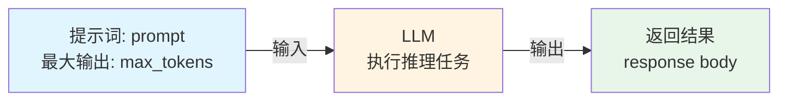
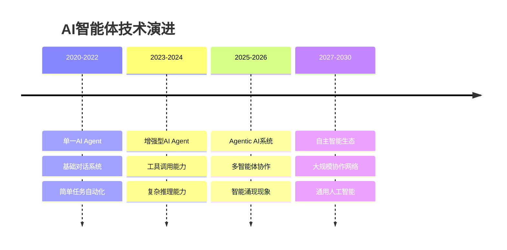

# 0.1 什么是Agentic AI？

> **本章重点**：理解AI Agent与Agentic AI的本质区别，建立对新一代智能系统的准确认知

## 🎯 核心问题

在人工智能快速发展的今天，我们经常听到"AI Agent"和"Agentic AI"这两个概念。它们到底有什么区别？为什么说Agentic AI是通向AGI应用的关键前站？本章将为您解答这些核心问题。

---

时间线
## 裸大模型调用时期
2022年11月30日OpenAI发布GPT-3.5，引起社会轰动，让大家第一次认识到了大语言模型。自此开启了全球基于大语言模型的AI浪潮。
裸大模型调用，理解类似于后端接口调用，直接返回response body。处理逻辑如下图所示：



# Agent 概念由来
Agent,这个概念在人工智能领域由来已久，最早是20世纪60年代，“人工智能之父”马文·明斯基在他的研究中首次明确使用了“Agent”一词，将其定义为一种自主运行的计算或认知实体，具备感知环境、推理决策和执行任务的能力。
从马文·明斯基提出“Agent”概念至LLM模型诞生前，AI Agent的发展经历了四个主要阶段，每个阶段在技术特点和应用场景上都有显著差异。
Symbolic Agent（符号Agent）：20世纪60年代至80年代，基于符号主义的AI Agent以规则和逻辑为核心，典型例子是专家系统。这种Agent擅长特定领域的推理，但缺乏灵活性和学习能力。
Reactive Agent（反应式Agent）：20世纪90年代，行为主义催生了反应式Agent，强调对环境的实时响应。机器人领域的“Roomba”吸尘器是其代表，优点是简单高效，缺点是无法处理复杂任务。
RL-based Agent（基于强化学习的Agent）：21世纪初，强化学习（RL）的兴起让Agent具备了试错学习能力。DeepMind的AlphaGo是这一阶段的巅峰之作，展示了Agent在动态环境中的强大适应性，但训练成本高昂。
Agent with Transfer Learning and Meta Learning（迁移学习与元学习Agent）：2010年代，随着迁移学习和元学习的发展，Agent开始能够在不同任务间迁移知识，甚至学会如何学习。这种Agent在小样本学习中表现优异，但计算复杂度仍是一个瓶颈。


# LLM-Based Agent探索
所以LLM诞生后，立即催生出了新一代的LLM-based Agent。2023年春季在开源社区诞生了基于LLM来搭建的Agent项目，其中以AutoGPT与BabyAGI两个项目最具代表性。它们共同推动了“LLM Agent”从理论概念走向大众实践，成为该领域发展的重要里程碑。这类项目首次展示了让LLM全自主管理复杂任务的能力。它们通过“生成–执行–反馈”的循环机制，结合浏览器、文件操作等插件，实现了对高层目标的分解与逐步推进。尽管存在效率有限与任务处理深度不足等问题，但这类项目展示了基于LLM让软件系统自动连贯执行任务的潜力。一时间，“让我来告诉ChatGPT干完这件事”的畅想变成了现实雏形，AutoGPT的GitHub星标飙升，在技术圈掀起了讨论自主AI代理的热潮。

## LLM的“手和脚”——LLM Function Calling诞生
不过，AutoGPT等项目在初期也暴露出诸多问题：例如：经常调用工具失败、经常生成无效方案或陷入循环，效率低下，以及对稍复杂任务仍显力不从心。为了减少胡乱调用工具的情况，规范函数调用，2023年6月由OpenAI在其GPT-4和GPT-3.5-Turbo模型的Chat Completions API中正式推出了LLM Function Calling。LLM Function Calling要求模型输出结构化的函数名和参数，从而安全地调用外部API，让Agent行为更加可控。至此，大模型厂商正式为LLM这个“大脑”装上了“手和脚”，使基于LLM的AI从一个被动的“对话者”，进化成了一个主动的“行动者”。这一举措催生了一个庞大的“LLM-Based Agent”（智能体）开发生态，也让Agent概念走出了研究圈子和技术圈，进入大众产品应用，从此这AI Agent一概念开始频繁出现在AI相关的宣传领域中。


##AI Agent 与 LLM-Based Agent 
至此，大家可以发现，原来LLM-Based Agent是AI Agent的一个特殊子集，但其能力已经极大地扩展和重新定义了AI Agent 的边界。
技术在不断地进步，我们对这一个概念的定义也在不断地丰富，逐渐的，我们在讨论LLM-Based Agent时都在用AI Agent。


单智能体与多智能体


单个LLM智能体框架的发展，研究者很快将目光投向多智能体协作


AI Agent的核心工作模式：感知-规划-执行-反馈。LLM作为“大脑”（负责规划和推理），Function Calling是“神经中枢”（负责调度），而外部函数就是“手和脚”（负责执行）。

AI Agent 概念开始频繁出现在AI领域。
智能体（AI Agent） 为其“大脑”装上了“手和脚”，使其从一个“对话者”变成一个“行动者”；

## 基于LLM的AI Agent

在LLM的推动下，AI Agent正迈向更广阔的舞台
https://zhuanlan.zhihu.com/p/29639288061


阶段三：从单一到多元，协作模式的探索（2023年 - 2024年）
随着智能体框架的出现，单智能体技术趋于成熟，很快单智能体的局限性就暴露了，

下一个问题自然浮现：

一个智能体再强大，也难以像一支团队那样高效协作。于是，从2023年末到2024年，发展进入了**多智能体**阶段。

当单智能体技术趋于稳定，研究者开始尝试让多个智能体“在一起工作”。


单智能体的局限性：
单智能体：独当一面的多面手，适合快速上手；
就像一个人同时扮演“产品经理 + 设计师 + 前端工程师+ 后端工程师”，效率高，但容易糊成一锅粥。


工作流类的平台大行其道；n8n,Dify、Coze 等低代码平台为例；其核心是预先编排好的任务路径。这种模式的可控性极高、结果稳定可预测，但牺牲了系统的自主性和灵活性。它更像一个高效的自动化执行器。

##多智能体与 Context Engineering 

一个“主编 Agent”统筹全局；几个“研究员 Agent”分别负责数据采集、筛选、总结。

Context Engineering 自然而然成为了重中之重；在合适的时机，组装整合合适的Prompt 给LLM。
旨在在上下文窗口中填入恰到好处的信息。

确保子任务被任务能够被可靠、高效地完成；也要确保子任务不偏离整体任务目的，服务与整体任务。

以确保任务能够被可靠、高效地完成。


Agentic AI Agentic System, or Agentic AI
Agentic AI（代理式人工智能）是人工智能领域的新兴方向，其核心特征在于能够通过自主感知、推理、规划与执行，独立完成复杂多步骤任务。相较于工作流类AI工具，它具备主动性、自治性和环境适应性，可脱离人类直接控制进行决策与交互。2024年3月吴恩达首次公开提出该概念后，英伟达CEO黄仁勋于2025年3月将其列为生成式AI后的重要发展阶段。

**Agentic AI** 是一种新兴的智能架构，利用多个专业化Agent协作来实现复杂且高层次的目标。这些系统由模块化的Agent组成，每个Agent负责更广泛目标的一个独特子组件，并通过集中式协调器或去中心化协议进行协调。


有多代理：
agentic AI system : 尽可能的将所有工作的所有内容都交给AI来完成。让AI来规划。追求一切交给AI。代理所有工作。从规划到执行；代理所有的工作。
代理人类的工作规划、代理人类执行工作流程、代理人类做具体的工作任务。
替代人类处理事务
AGI 其实就是人类的万能代理。


workflow AI agents: 确定性的流程，程序化的使用AI； 追求的是确定性的流程产生确定性的结果。


## 🤖 从AI Agent说起

### 什么是AI Agent？

**AI Agent** 是一种自主软件实体，专为在限定的数字环境中执行目标导向的任务而设计。是一种能够感知环境、自主决策并执行动作的智能实体。与基于LLM的对话系统不同，AI Agent不仅能回答问题，还能主动完成一系列复杂任务。


### AI Agent的三大核心特征

#### 1. 🔄 自主性（Autonomy）
- **定义**：Agent在部署后能够独立行动，减少对人工干预的依赖
- **价值**：实现大规模的无人值守运行
- **应用场景**：客户服务机器人、日程助手、内容审核系统

#### 2. 🎯 任务专一性（Task Specialization）
- **定义**：在特定功能领域内实现高性能优化
- **价值**：在自动化任务中实现高效、可解释、高精度运行
- **应用领域**：日程安排、查询处理、数据过滤、内容分类

#### 3. 🎭 反应性与适应性（Reactivity & Adaptability）
- **反应性**：能够响应环境变化（用户指令、软件状态、API响应）
- **适应性**：通过反馈循环、启发式方法或上下文缓冲区更新等方式整合学习机制

### AI Agent的典型应用

#### 🤖 客户支持自动化
- **核心能力**：利用检索增强的LLM和企业知识库
- **主要功能**：自动回答用户查询、处理工单、检索文档
- **技术实现**：RAG架构 + 知识图谱 + 对话管理

#### 📧 智能邮件管理
- **核心能力**：分析邮件内容和元数据
- **主要功能**：自动分类、任务提取、回复建议、优先级排序
- **技术实现**：NLP + 分类算法 + 规则引擎

---

## 🌐 什么是Agentic AI？

### 核心定义

**Agentic AI** 是一种新兴的智能架构，利用多个专业化Agent协作来实现复杂且高层次的目标。这些系统由模块化的Agent组成，每个Agent负责更广泛目标的一个独特子组件，并通过集中式协调器或去中心化协议进行协调。

这种结构标志着从单一Agent架构中通常观察到的**原子化、响应式行为**向**以动态Agent间协作为特征的系统级智能形式**的概念转变。

### 五大核心能力

基于复杂适应系统理论，Agentic AI具备以下五大核心能力：

#### 1. 🧠 智能涌现（Intelligence Emergence）
- **定义**：系统整体智能超越各组成部分简单叠加的现象
- **表现**："1+1>2"的智能效应
- **特征**：非线性增长、自组织性、创新性、不可预测性

#### 2. 🔧 工具创造能力（Tool Creation Capability）
- **定义**：根据需求动态生成、组合和优化工具的能力
- **三个层次**：
  1. **工具组合层**：创新性地组合现有工具
  2. **工具生成层**：根据需求动态生成新工具
  3. **工具进化层**：通过反馈持续优化工具

#### 3. 🎯 自主任务执行（Autonomous Task Execution）
- **定义**：无需人工干预，能够理解复杂意图、制定策略并完成多步骤任务的能力
- **核心要素**：意图理解、策略规划、动态调整、自主验证

#### 4. 📚 适应性学习（Adaptive Learning）
- **定义**：从执行过程中积累经验、识别模式并持续改进的能力
- **学习机制**：经验积累、模式识别、策略优化、知识迁移

#### 5. 👁️ 智能态势感知（Intelligent Situational Awareness）
- **定义**：全面感知、理解和预测系统内外部环境变化的能力
- **三个维度**：内部洞察、外部感知、未来预测

---

## 🔍 核心差异对比


### 综合特征对比

| 特征        | AI Agent        | Agentic AI                        |
| --------- | ---------------- | --------------------------------- |
| **定义**    | 执行特定任务的自主软件程序    | 多个AI智能体协作实现复杂目标的系统                |
| **自主性水平** | 在特定任务范围内具有高度自主性  | 具有广泛的自主性，能够管理多步骤、复杂任务和系统          |
| **任务复杂度** | 通常处理单一、特定的任务     | 处理需要协调的复杂、多步骤任务                   |
| **协作方式**  | 独立运行             | 涉及多智能体信息共享、协作和合作                  |
| **学习与适应** | 在其特定领域内学习和适应     | 在更广泛的任务和环境范围内学习和适应                |
| **应用场景**  | 客户服务聊天机器人、自动化工作流 | 程序开发助手、数据分析助手、供应链管理、业务流程优化、虚拟项目经理 |

### 系统架构层面对比

| 维度 | AI Agent | Agentic AI |
|------|----------|------------|
| **架构模式** | 单体智能体 | 多智能体协作系统 |
| **决策机制** | 独立决策 | 协作决策 |
| **任务处理** | 单任务专精 | 复杂任务分解 |
| **智能表现** | 响应式智能 | 涌现式智能 |
| **扩展性** | 垂直扩展 | 水平扩展 |
| **容错能力** | 单点故障 | 分布式容错 |

---

## 🧪 如何识别Agentic AI？

### 简单测试方法

**测试指令**：
```
编写一个程序计算1到99的累加值，执行该程序，报告计算结果，并提供完整代码。
```

**Agentic AI的典型响应模式**：
1. **任务分析** → 理解需求包含编程、执行、验证三个步骤
2. **工具创造** → 动态生成计算程序（如Python脚本）
3. **环境准备** → 配置执行环境（如Python解释器）
4. **自主执行** → 运行程序并获取结果
5. **结果验证** → 验证计算结果的正确性（4950）
6. **完整报告** → 提供代码、执行过程和结果

**与传统AI应用的区别**：
- ❌ 传统AI应用：只能生成代码，无法执行
- ✅ Agentic AI：完成从创造到执行的完整流程

### 必备特征检查清单

#### ✅ 必备特征（缺一不可）
- [ ] **智能涌现性**：系统表现出超越组件能力的智能行为
- [ ] **工具创造性**：能够动态创造和组合工具
- [ ] **自主执行性**：具备独立的任务执行能力
- [ ] **适应学习性**：能够从经验中学习和改进
- [ ] **态势感知性**：具备对内外环境的实时感知和分析能力

---

## 🌟 典型应用案例

### 商业化产品
- **Cursor IDE**：具备代码生成、执行、调试的完整能力，展现了智能涌现特征
- **Claude Computer Use**：能够自主操作计算机完成复杂任务

### 开源项目  
- **JoyAgent-JDGenie**：京东的Agentic AI系统，本书主要分析对象

### Agentic AI典型应用场景

#### 🔬 多智能体研究助理
- **系统架构**：文献检索Agent + 内容分析Agent + 写作Agent + 审核Agent
- **协作机制**：流水线协作 + 并行处理 + 质量控制
- **核心价值**：加速科研进程、提高研究质量、知识发现

#### 🤖 智能机器人协调系统
- **应用领域**：仓库自动化、农业无人机、协作采摘
- **协作模式**：任务分配 + 路径规划 + 实时协调
- **核心价值**：提高生产效率、降低人工成本、优化资源利用

---

## 📈 演进趋势

### 技术演进轨迹



---

## 🎯 概念理解检查

### 自我检测题目

1. **概念理解**：用自己的话解释什么是智能涌现？
2. **区别辨析**：Agentic AI与传统AI Agent的核心区别是什么？
3. **实践应用**：在你的工作领域中，哪些场景适合应用Agentic AI？

### 理解程度自评
- [ ] **基础理解**：能够准确说出Agentic AI的定义
- [ ] **概念区分**：能够区分Agentic AI与相关概念
- [ ] **实践思考**：能够识别Agentic AI的应用场景
- [ ] **深度理解**：能够分析Agentic AI的技术实现挑战

---

## 📖 延伸阅读指引

### 下一步学习路径

理解了"什么是Agentic AI"后，您可能会思考：**为什么我们需要全新的开发理念来构建这样的系统？**

在下一章中，我们将深入探讨：
- **🤝 拥抱不确定性**：为什么传统的确定性编程思维不再适用？
- **💼 90%软件工程+10%AI**：为什么工程化实践比AI算法更重要？
- **⚖️ 合理分工**：为什么不能指望大模型做所有事情？

**📖 推荐阅读路径**：
- **技术背景读者** → 重点关注下一章的工程化理念
- **产品经理** → 重点关注应用场景和价值分析
- **研究人员** → 可以跳转到0.4章节的理论基础

---

> **💡 学习建议**：Agentic AI不仅是技术概念，更代表了智能系统设计思维的根本转变。建议结合具体案例来深化理解。
